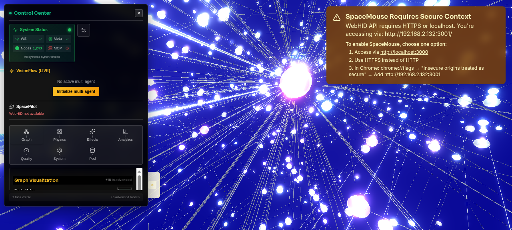
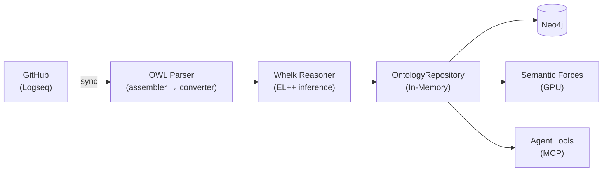
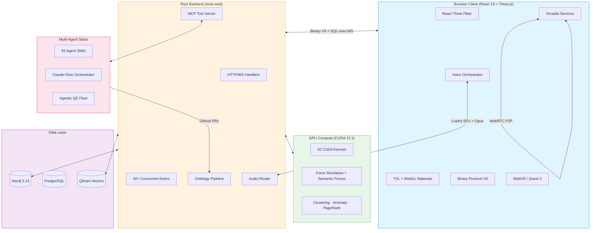

<div align="center">

# VisionClaw

### The Governed Agentic Mesh for Organisations That Can't Afford to Move Fast and Break Things

[](https://github.com/DreamLab-AI/VisionClaw/actions)
[](https://github.com/DreamLab-AI/VisionClaw/releases)
[](LICENSE)
[](https://www.rust-lang.org/)
[](https://developer.nvidia.com/cuda-toolkit)

**92 CUDA kernels | GPU clustering, anomaly detection & PageRank | Multi-user immersive XR | 83 agent skills | OWL 2 ontology governance**

<br/>

https://github.com/user-attachments/assets/f45c92dc-4800-4b57-a6e2-178da6bb0a38

<br/>

[Why VisionClaw?](#your-best-people-are-already-running-the-future) | [Quick Start](#quick-start) | [Architecture](#the-three-layers-of-the-dynamic-mesh) | [Documentation](#documentation) | [Contributing](#contributing)

</div>

---

## Your Best People Are Already Running the Future

They just haven't told you yet.

73% of frontline AI adoption happens without management sign-off. Your workforce is already building shadow workflows — stitching together AI agents, automating procurement shortcuts, inventing cross-functional pipelines that don't appear on any org chart. The question isn't whether your organisation is becoming an agentic mesh. It's whether you'll shape how it forms — or be reshaped by it.

**The personal agent revolution has a governance problem.** Tools like Claude Code have shown that autonomous AI agents are powerful, popular, and ready to act. They've also shown what happens when agents operate without shared semantics, formal reasoning, or organisational guardrails: unauthorised actions, prompt injection attacks, and enterprises deploying security scanners just to detect rogue agent instances on their own networks.

VisionClaw takes the opposite approach. **Governance isn't the brake — it's what lets you drive at 200 mph.**

---

## What Is VisionClaw?

VisionClaw is an open-source platform that transforms organisations into governed agentic meshes — where autonomous AI agents, human judgment, and institutional knowledge work together through a shared semantic substrate.

VisionClaw gives organisations a governed intelligence layer where 83 specialist agent skills reason over a formal OWL 2 ontology before they act. Every agent decision is semantically grounded, every mutation passes consistency checking, and every reasoning chain is auditable from edge case back to first principles. The middle manager doesn't disappear — they evolve into the **Judgment Broker**, reviewing only the genuine edge cases and strategic decisions that exceed agent authority.

The platform ingests knowledge from Logseq notebooks via GitHub, reasons over it with an OWL 2 EL inference engine (Whelk), renders the result as an interactive 3D graph where nodes attract or repel based on their semantic relationships, and exposes everything to AI agents through 7 Model Context Protocol tools. Users collaborate in the same space through multi-user XR presence, spatial voice, and immersive graph exploration.

VisionClaw is built on a Rust/Actix-web backend with hexagonal architecture, a React 19 + Three.js frontend with WebGPU/WebGL dual rendering, Neo4j graph storage, and CUDA 13.1 GPU-accelerated physics. It is production-proven — currently operational at MediaCityUK, powering a 15-person creative technology team, and validated in partnership with a major UK creative studio and the University of Salford.

<div align="center">

<br/>
<em>GPU-accelerated force-directed graph layout with real-time physics controls — 934 nodes responding to spring/repulsion forces</em>

<br/>


<br/>
<em>Interacting with a knowledge graph in an immersive projected environment</em>
</div>

---

## Quick Start

```bash
git clone https://github.com/DreamLab-AI/VisionClaw.git
cd VisionClaw && cp .env.example .env
docker-compose --profile dev up -d
```

| Service | URL | Description |
|:--------|:----|:------------|
| Frontend | http://localhost:3001 | 3D knowledge graph interface |
| API | http://localhost:4000/api | REST and WebSocket endpoints |
| Neo4j Browser | http://localhost:7474 | Graph database explorer |
| Vircadia Server | ws://localhost:3020/world/ws | Multi-user WebSocket endpoint |

<details>
<summary><strong>Enable voice routing</strong></summary>

```bash
docker-compose -f docker-compose.yml -f docker-compose.voice.yml --profile dev up -d
```

Adds LiveKit SFU (port 7880), turbo-whisper STT (CUDA), and Kokoro TTS.

</details>

<details>
<summary><strong>Enable multi-user XR</strong></summary>

```bash
docker-compose -f docker-compose.yml -f docker-compose.vircadia.yml --profile dev up -d
```

Adds Vircadia World Server with avatar sync, spatial audio, and collaborative graph editing.

</details>

<details>
<summary><strong>Native build (Rust + CUDA)</strong></summary>

```bash
curl --proto '=https' --tlsv1.2 -sSf https://sh.rustup.rs | sh
git clone https://github.com/DreamLab-AI/VisionClaw.git
cd VisionClaw && cp .env.example .env
cargo build --release --features gpu
cd client && npm install && npm run build && cd ..
./target/release/webxr
```

</details>

---

## The Three Layers of the Dynamic Mesh

VisionClaw implements a three-layer agentic mesh architecture. Insights bubble up from frontline discovery, are orchestrated through formal semantic pipelines, and governed by declarative policy — with humans as the irreplaceable judgment layer at the top.

```mermaid
flowchart TB
    subgraph Layer3["LAYER 3 — DECLARATIVE GOVERNANCE"]
        JB["Judgment Broker\n(Human-in-the-Loop)"]
        Policy["AI-Enforced Policies\nBias · Security · Alignment"]
        Trust["Cascading Trust\nDID/Nostr Identity"]
    end

    subgraph Layer2["LAYER 2 — ORCHESTRATION"]
        Skills["83 Agent Skills\nClaude-Flow DAG Pipelines"]
        Ontology["OWL 2 EL Reasoning\nWhelk Inference Engine"]
        MCP["7 MCP Tools\nKnowledge Graph Read/Write"]
        GPU["GPU Compute\nCUDA 13.1 Kernels"]
    end

    subgraph Layer1["LAYER 1 — DISCOVERY ENGINE"]
        Ingest["Knowledge Ingestion\nLogseq · GitHub · RSS"]
        Graph["Neo4j Knowledge Graph\n+ Qdrant Vectors"]
        Viz["3D Visualisation\nReact 19 · Three.js · WebXR"]
        Voice["Voice Routing\n4-Plane Architecture"]
    end

    Layer1 -->|"Insights bubble up"| Layer2
    Layer2 -->|"Exceptions surface"| Layer3
    Layer3 -->|"Governance flows down"| Layer2
    Layer2 -->|"Validated workflows deploy"| Layer1

    style Layer3 fill:#1A0A2A,stroke:#8B5CF6
    style Layer2 fill:#0A1A2A,stroke:#00D4FF
    style Layer1 fill:#0A2A1A,stroke:#10B981
```



---

### Layer 1 — The Discovery Engine

The discovery layer ingests, structures, and renders organisational knowledge as a navigable, interactive 3D space.

**Ontology Pipeline** — VisionClaw syncs Logseq markdown from GitHub, parses OWL 2 EL axioms, runs Whelk inference for subsumption and consistency checking, and stores results in both Neo4j (persistent) and an in-memory `OntologyRepository` (fast access). GPU semantic forces use the ontology to drive graph layout physics — `subClassOf` creates attraction, `disjointWith` creates repulsion.



Explore a live ontology dataset at **[narrativegoldmine.com](https://www.narrativegoldmine.com)** — a 2D interactive graph and data explorer built on the same ontology data that VisionClaw renders in 3D.

**3D Knowledge Visualisation** — Dual-renderer architecture: WebGPU with Three Shading Language (TSL) materials on supported browsers, automatic WebGL fallback on others. Runtime toggle in the Effects panel. Post-processing via `GemPostProcessing` with bloom, colour grading, and depth effects.

**Multi-User XR** — Vircadia World Server provides spatial presence, collaborative graph editing, and avatar synchronisation. The client detects Quest headsets and applies XR optimisations: foveated rendering, DPR capping, dynamic resolution scaling. `CollaborativeGraphSync` handles multi-user selections, annotations, and conflict resolution. The immersive graph technology was validated in the [THG world record attempt](https://github.com/DreamLab-AI/THG-world-record-attempt) — a large-scale multi-user data visualisation event demonstrating real-time collaborative graph exploration at scale.

<details>
<summary><strong>Rendering materials</strong></summary>

| Material | Effect |
|:---------|:-------|
| `GemNodeMaterial` | Primary node material with analytics-driven colour |
| `CrystalOrbMaterial` | Depth-pulsing emissive with cosmic spectrum + Fresnel |
| `AgentCapsuleMaterial` | Bioluminescent heartbeat pulse driven by activity level |
| `GlassEdgeMaterial` | Animated flow emissive for relationship edges |

</details>

<details>
<summary><strong>Voice routing (4-plane architecture)</strong></summary>

| Plane | Direction | Scope | Trigger |
|:------|:----------|:------|:--------|
| 1 | User mic → turbo-whisper STT → Agent | Private | PTT held |
| 2 | Agent → Kokoro TTS → User ear | Private | Agent responds |
| 3 | User mic → LiveKit SFU → All users | Public (spatial) | PTT released |
| 4 | Agent TTS → LiveKit → All users | Public (spatial) | Agent configured public |

Opus 48kHz mono end-to-end. HRTF spatial panning from Vircadia entity positions.

</details>

<details>
<summary><strong>Logseq ontology input (source data)</strong></summary>

<br/>

| Ontology metadata | Graph structure |
|:-:|:-:|
|  |  |
| OWL entity page with category, hierarchy, and source metadata | Graph view showing semantic clusters |


*Dense knowledge graph in Logseq — the raw ontology that VisionClaw ingests, reasons over, and renders in 3D*

</details>

---

### Layer 2 — The Orchestration Layer

The orchestration layer is where agents reason, coordinate, and act — always against the shared semantic substrate of the OWL 2 ontology.

**83 Specialist Agent Skills** — The `multi-agent-docker/` container provides a complete AI orchestration environment with Claude-Flow coordination and 83 skill modules spanning creative production, research, knowledge codification, governance, workflow discovery, financial intelligence, spatial/immersive, and identity/trust domains.

**Why OWL 2 Is the Secret Weapon** — Most agentic systems fail at scale because they lack a shared language. In VisionClaw, agents don't "guess" what a concept means — they reason against a common OWL 2 ontology. The same concept of "deliverable" means the same thing to a Creative Production agent and a Governance agent. Agent skill routing isn't keyword matching — it's ontological subsumption. The orchestration layer knows that a "risk assessment" is a sub-task of "governance review", and routes accordingly.

**7 Ontology Agent Tools (MCP)** — Read/write access to the knowledge graph via Model Context Protocol:

| Tool | Purpose |
|:-----|:--------|
| `ontology_discover` | Semantic keyword search with Whelk inference expansion |
| `ontology_read` | Enriched note with axioms, relationships, schema context |
| `ontology_query` | Validated Cypher execution with schema-aware label checking |
| `ontology_traverse` | BFS graph traversal from starting IRI |
| `ontology_propose` | Create/amend notes → consistency check → GitHub PR |
| `ontology_validate` | Axiom consistency check against Whelk reasoner |
| `ontology_status` | Service health and statistics |

**GPU-Accelerated Compute** — 92 CUDA kernel functions across 11 kernel files (6,585 lines) run server-authoritative graph layout and analytics. The physics pipeline (force-directed layout, semantic forces, ontology constraints, stress majorisation) runs at 60 Hz. The analytics pipeline (K-Means clustering, Louvain community detection, LOF anomaly detection, PageRank) runs on-demand via API and streams results to clients in the V3 binary protocol's analytics fields (cluster_id, anomaly_score, community_id at bytes 36-47).

| Metric | Result |
|:-------|-------:|
| CUDA kernel functions | 92 across 11 files |
| GPU vs CPU speedup | 55x |
| Position + analytics size | 48 bytes/node (V3) |
| WebSocket latency | 10ms |
| Binary vs JSON bandwidth | 80% reduction |

<details>
<summary><strong>Agent skill domains (83 skills)</strong></summary>

**Creative Production** — Script, storyboard, shot-list, grade & publish workflows. ComfyUI orchestration for image, video, and 3D asset generation via containerised API middleware.

**Research & Synthesis** — Multi-source ingestion, GraphRAG, semantic clustering, Perplexity integration.

**Knowledge Codification** — Tacit-to-explicit extraction; OWL concept mapping; Logseq-formatted output.

**Governance & Audit** — Bias detection, provenance chains (content-addressed beads), declarative policy enforcement.

**Workflow Discovery** — Shadow workflow detection; DAG proposal & validation.

**Financial Intelligence** — R&D tax modelling, grant pipeline, ROI attribution.

**Spatial & Immersive** — XR scene graph, light field, WebXR rendering agent, Blender, ComfyUI 3D.

**Identity & Trust** — DID management, key rotation, Nostr agent communications.

**Development & Quality** — Rust development, pair programming, agentic QE fleet, GitHub code review, performance analysis.

**Infrastructure & DevOps** — Docker management, Kubernetes ops, Linux admin, network analysis, monitoring.

**Document Processing** — LaTeX, DOCX, XLSX, PPTX, PDF generation and manipulation.

</details>

<details>
<summary><strong>Binary WebSocket Protocol V5</strong></summary>

High-frequency updates use a compact binary protocol instead of JSON, achieving 80% bandwidth reduction.

| Type | Code | Size | Purpose |
|:-----|:-----|:-----|:--------|
| `POSITION_UPDATE` | `0x10` | 48 bytes/node | Positions + velocity + SSSP + cluster/anomaly/community |
| `AGENT_POSITIONS` | `0x11` | Variable | Batch agent position updates |
| `VELOCITY_UPDATE` | `0x12` | Variable | Node velocity vectors |
| `AGENT_STATE_FULL` | `0x20` | Variable | Complete agent state snapshot |
| `AGENT_STATE_DELTA` | `0x21` | Variable | Incremental agent state |
| `GRAPH_UPDATE` | `0x01` | Variable | Graph topology changes |
| `VOICE_DATA` | `0x02` | Variable | Opus audio frames |
| `SYNC_UPDATE` | `0x50` | Variable | Multi-user sync |
| `SELECTION_UPDATE` | `0x52` | Variable | Collaborative selection |
| `VR_PRESENCE` | `0x54` | Variable | XR avatar positions |
| `HEARTBEAT` | `0x33` | 1 byte | Connection keepalive |
| `BACKPRESSURE_ACK` | `0x34` | Variable | Flow control |

Features: V3 unified format (48 bytes/node with analytics), V4 delta encoding (20 bytes/changed node), node type flag bits (bits 26-31) for agent/knowledge/ontology classification, live GPU analytics fields (cluster_id, anomaly_score, community_id).

</details>

<details>
<summary><strong>Actor system (40+ actors)</strong></summary>

The backend uses Actix actors for supervised concurrency. GPU compute actors run physics simulations, while service actors coordinate ontology processing, client sessions, and voice routing.

**GPU Compute Actors:**

| Actor | Purpose |
|:------|:--------|
| `ForceComputeActor` | Core force-directed layout (CUDA) |
| `StressMajorizationActor` | Stress majorisation algorithm |
| `ClusteringActor` | K-Means + Louvain community detection (GPU) |
| `PageRankActor` | GPU PageRank centrality computation |
| `ShortestPathActor` | Delta-stepping SSSP (GPU) |
| `ConnectedComponentsActor` | Label propagation component detection (GPU) |
| `AnomalyDetectionActor` | LOF / Z-score anomaly detection (GPU) |
| `SemanticForcesActor` | OWL-driven attraction/repulsion |
| `ConstraintActor` | Layout constraint solving |
| `AnalyticsSupervisor` | GPU analytics orchestration |

**Service Actors:**

| Actor | Purpose |
|:------|:--------|
| `GraphStateActor` | Canonical graph state |
| `OntologyActor` | OWL class management |
| `WorkspaceActor` | Multi-workspace isolation |
| `ClientCoordinatorActor` | Per-client session management |
| `PhysicsOrchestratorActor` | GPU physics delegation |
| `SemanticProcessorActor` | NLP query processing |
| `VoiceCommandsActor` | Voice-to-action routing |
| `TaskOrchestratorActor` | Background task scheduling |

</details>

---

### Layer 3 — Declarative Governance

The governance layer is what separates VisionClaw from every "move fast and break things" agent framework. Policies are code. Bias thresholds, access controls, and audit trails are embedded into every DAG transition — not bolted on afterwards.

**The Judgment Broker** — The middle manager doesn't disappear in the agentic mesh. They evolve. Freed from reporting, forecasting, and coordination (all now automated), the Judgment Broker focuses on three irreplaceable human capacities:

- **Strategic direction** — Only humans can decide what the organisation should be doing next year, and whether the mesh is pointed at it.
- **Ethical adjudication** — Bias, fairness, and consequence live in human judgment. No agent should be the final word on edge cases.
- **Relational intelligence** — Trust, culture, and coalition-building across departments are the lubrication layer no algorithm can replicate.

**HITL by Design** — The Human-in-the-Loop is not a fallback. It's an architectural feature. Agents know their authority boundary and surface exceptions cleanly. Every ontology mutation passes through a GitHub pull request workflow, giving human reviewers full visibility and veto over structural changes before they are committed.

**Ontological Provenance** — Every agent decision traces back through the OWL 2 knowledge graph. Auditors can traverse the full reasoning chain — agent-by-agent, task-by-task. Every action is recorded as an immutable bead — a content-addressed, cryptographically verifiable unit of provenance — stored alongside human-readable Markdown summaries.

**Cascading Trust Hierarchies** — DID-based agent identities with W3C-compliant key rotation. When an agent is revoked, the revocation cascades through dependent agents automatically. Self-sovereign infrastructure means no single point of trust failure.

<details>
<summary><strong>Mesh KPIs — measuring what matters in a governed agentic organisation</strong></summary>

| KPI | Formula | Target | What It Measures |
|:----|:--------|:-------|:-----------------|
| **Mesh Velocity** | Δt(insight → codified workflow) | < 48h | How fast a discovered shortcut becomes a sanctioned, reusable DAG. |
| **Augmentation Ratio** | Cognitive load offloaded ÷ Total cognitive load | > 65% | What percentage of decision-making is handled by agents without human escalation. |
| **Trust Variance** | σ(Agent Decision Quality) over 30-day window | < 0.12σ | Drift or bias monitoring in the automated task layer. |
| **HITL Precision** | Correct escalations ÷ Total escalations | > 90% | Are the edge cases the mesh flags actually requiring human intervention? |

</details>

---

## The Insight Ingestion Loop

How shadow workflows become sanctioned organisational intelligence:

```mermaid
flowchart LR
    D["DISCOVERY\nPassive agent monitoring\ndetects the pattern"]
    C["CODIFICATION\nIRIS maps the new path\nas a proposed DAG —\nOWL 2 formalised\nwith provenance"]
    V["VALIDATION\nThe Judgment Broker\nreviews for strategic\nfit & bias"]
    I["INTEGRATION\nPromoted to live mesh\nwith SLAs, ownership,\nquality"]
    A["AMPLIFICATION\nMesh propagates\npattern to other\nteams where it applies"]

    D --> C --> V --> I --> A

    style D fill:#0A2A1A,stroke:#10B981
    style C fill:#0A1A2A,stroke:#00D4FF
    style V fill:#1A0A2A,stroke:#8B5CF6
    style I fill:#0A1A2A,stroke:#00D4FF
    style A fill:#0A2A1A,stroke:#10B981
```



---

## Architecture



<details>
<summary><strong>Hexagonal architecture (Ports & Adapters)</strong></summary>

VisionClaw follows strict hexagonal architecture. Business logic in `src/services/` depends only on port traits defined in `src/ports/`. Concrete implementations live in `src/adapters/`, swapped at startup via dependency injection.

```mermaid
flowchart LR
    subgraph Ports["src/ports/ (Traits)"]
        GP[GraphRepository]
        KG[KnowledgeGraphRepository]
        OR[OntologyRepository]
        IE[InferenceEngine]
        GPA[GpuPhysicsAdapter]
        GSA[GpuSemanticAnalyzer]
        SR[SettingsRepository]
    end

    subgraph Adapters["src/adapters/ (Implementations)"]
        Neo4jGraph[Neo4jGraphRepository]
        Neo4jOntology[Neo4jOntologyRepository]
        Whelk[WhelkInferenceEngine]
        CudaPhysics[PhysicsOrchestratorAdapter]
        CudaSemantic[GpuSemanticAnalyzerAdapter]
        Neo4jSettings[Neo4jSettingsRepository]
    end

    subgraph Services["src/services/ (Business Logic)"]
        OQS[OntologyQueryService]
        OMS[OntologyMutationService]
        GPS[GitHubPRService]
        OPS[OntologyPipelineService]
    end

    Services --> Ports
    Adapters -.->|implements| Ports

    style Ports fill:#e8f5e9,stroke:#4caf50
    style Adapters fill:#fff3e0,stroke:#ff9800
    style Services fill:#e1f5ff,stroke:#0288d1
```



| Port Trait | Adapter | Purpose |
|:-----------|:--------|:--------|
| `GraphRepository` | `ActorGraphRepository` | Graph CRUD via actor messages |
| `KnowledgeGraphRepository` | `Neo4jGraphRepository` | Neo4j Cypher queries |
| `OntologyRepository` | `Neo4jOntologyRepository` | OWL class/axiom storage |
| `InferenceEngine` | `WhelkInferenceEngine` | OWL 2 EL reasoning |
| `GpuPhysicsAdapter` | `PhysicsOrchestratorAdapter` | CUDA force simulation |
| `GpuSemanticAnalyzer` | `GpuSemanticAnalyzerAdapter` | GPU semantic forces |
| `SettingsRepository` | `Neo4jSettingsRepository` | Persistent settings |

</details>

---

## Performance

| Metric | Result | Conditions |
|:-------|-------:|:-----------|
| GPU physics speedup | 55x | vs single-threaded CPU |
| WebSocket latency | 10ms | Local network |
| Bandwidth reduction | 80% | Binary V5 vs JSON |
| Concurrent users | 250+ | Vircadia World Server |
| Position update size | 48 bytes | Per node (V3 protocol) |
| Agent concurrency | 50+ | Via actor supervisor tree |

---

## Technology Stack

<details>
<summary><strong>Full technology breakdown</strong></summary>

| Layer | Technology | Detail |
|:------|:-----------|:-------|
| **Backend** | Rust (2021 edition), Actix-web | 427 files, 175K LOC, hexagonal architecture |
| **Frontend** | React 19, Three.js 0.182, R3F | 370 files, 96K LOC, TypeScript 5.9 |
| **Graph DB** | Neo4j 5.13 | Primary store, Cypher queries, bolt protocol |
| **Relational DB** | PostgreSQL 15 | Vircadia World Server entity storage |
| **Vector DB** | Qdrant | Semantic similarity search |
| **GPU** | CUDA 13.1 | 92 kernel functions, 6.4K LOC across 11 .cu files via cudarc |
| **Ontology** | OWL 2 EL, Whelk-rs | EL++ subsumption, consistency checking (20 source files) |
| **XR** | WebXR, @react-three/xr | Meta Quest 3, hand tracking, foveated rendering |
| **Multi-User** | Vircadia World Server | Avatar sync, spatial audio, entity CRUD |
| **Voice** | LiveKit SFU | turbo-whisper STT, Kokoro TTS, Opus codec |
| **Protocol** | Binary V5 | 48-byte position updates, delta encoding, flag-bit node typing |
| **Auth** | Nostr NIP-07/NIP-98 | Browser extension signing, relay integration |
| **Agents** | MCP, Claude-Flow | 83 skills, 7 ontology tools |
| **AI/ML** | GraphRAG, RAGFlow | Knowledge retrieval, inference |
| **Build** | Vite 6, Vitest, Playwright | Frontend build, unit tests, E2E tests |
| **Infra** | Docker Compose | 10 compose files, multi-profile deployment |
| **CI** | GitHub Actions | Build, test, docs quality, ontology federation |

</details>

---

## Documentation

VisionClaw uses the [Diataxis](https://diataxis.fr/) documentation framework — 267 markdown files organised into four categories:

| Category | Path | Content |
|:---------|:-----|:--------|
| **Tutorials** | `docs/tutorials/` | First graph, digital twin, protein folding, multiplayer |
| **How-To Guides** | `docs/how-to/` | Deployment, agents, features, operations, development |
| **Explanation** | `docs/explanation/` | Architecture, concepts, system overview, design decisions |
| **Reference** | `docs/reference/` | API specs, database schemas, port/adapter catalogue |

Key entry points:

- [Full Documentation Hub](docs/README.md)
- [Architecture Overview](docs/explanation/system-overview.md)
- [Project Structure](docs/how-to/development/02-project-structure.md)
- [Ontology Agent Tools](docs/how-to/agents/ontology-agent-tools.md)
- [Voice Routing](docs/how-to/features/voice-routing.md)
- [Docker Compose Guide](docs/how-to/deployment/docker-compose-guide.md)
- [Hexagonal Architecture](docs/explanation/architecture/patterns/hexagonal-cqrs.md)

---

## Development

### Prerequisites

- **Rust** (2021 edition) with cargo
- **Node.js** 20+ with npm
- **Docker** and Docker Compose
- **CUDA** 13.1 (optional, for GPU acceleration)

### Build and Test

```bash
# Backend
cargo build --release
cargo test

# Frontend
cd client && npm install && npm run build && npm test

# Integration tests
cargo test --test ontology_agent_integration_test
```

<details>
<summary><strong>Environment variables</strong></summary>

Copy `.env.example` and configure:

| Variable | Description |
|:---------|:------------|
| `NEO4J_URI` | Neo4j bolt connection (default: `bolt://localhost:7687`) |
| `NEO4J_USER` / `NEO4J_PASSWORD` | Neo4j credentials |
| `VITE_VIRCADIA_ENABLED` | Enable Vircadia multi-user (`true`/`false`) |
| `VITE_VIRCADIA_SERVER_URL` | Vircadia World Server WebSocket URL |
| `VITE_VIRCADIA_AUTH_TOKEN` | Vircadia authentication token |
| `VITE_VIRCADIA_AUTH_PROVIDER` | Auth provider (`system` or `nostr`) |
| `VITE_VIRCADIA_ENABLE_SPATIAL_AUDIO` | Enable HRTF spatial audio |
| `VITE_QUEST3_ENABLE_HAND_TRACKING` | Enable Quest 3 hand tracking |
| `LIVEKIT_URL` | LiveKit server URL for voice routing |
| `LIVEKIT_API_KEY` / `LIVEKIT_API_SECRET` | LiveKit credentials |
| `GITHUB_TOKEN` | GitHub token for ontology PR creation |
| `GITHUB_OWNER` / `GITHUB_REPO` | Target repository for ontology PRs |

</details>

### System Requirements

| Tier | CPU | RAM | GPU | Use Case |
|:-----|:----|:----|:----|:---------|
| **Minimum** | 4-core 2.5GHz | 8 GB | Integrated | Development, < 10K nodes |
| **Recommended** | 8-core 3.0GHz | 16 GB | GTX 1060 / RX 580 | Production, < 50K nodes |
| **Enterprise** | 16+ cores | 32 GB+ | RTX 4080+ (16GB VRAM) | Large graphs, multi-user XR |

**Platform Support:** Linux (full GPU), macOS (CPU-only), Windows (WSL2), Meta Quest 3 (Beta)

---

## Project Structure

```
VisionClaw/
├── src/                          # Rust backend (427 files, 175K LOC)
│   ├── actors/                   #   40+ Actix actors (GPU compute + services)
│   ├── adapters/                 #   Neo4j, Whelk, CUDA adapter implementations
│   ├── handlers/                 #   HTTP/WebSocket request handlers
│   ├── services/                 #   Business logic (ontology, voice, agents)
│   ├── ports/                    #   Trait definitions (hexagonal boundaries)
│   ├── gpu/                      #   CUDA kernel bridge, memory, streaming
│   ├── ontology/                 #   OWL parser, reasoning, physics integration
│   ├── protocols/                #   Binary settings protocol
│   ├── models/                   #   Data models
│   └── config/                   #   Configuration management
├── client/                       # React frontend (370 files, 96K LOC)
│   └── src/
│       ├── features/             #   13 feature modules (graph, settings, etc.)
│       ├── services/             #   Voice, WebSocket, auth, integration services
│       ├── rendering/            #   Custom TSL materials, post-processing
│       └── immersive/            #   XR/VR specific code
├── multi-agent-docker/           # AI agent orchestration container
│   ├── skills/                   #   83 agent skill modules
│   ├── mcp-infrastructure/       #   MCP servers, config, tools
│   └── management-api/           #   Agent lifecycle management
├── docs/                         # Diataxis documentation (285 files)
├── tests/                        # Integration tests
├── config/                       # LiveKit, deployment config
└── scripts/                      # Build, migration, testing scripts
```

---

## Contributing

See the [Contributing Guide](docs/CONTRIBUTING.md) for development workflow, branching conventions, and coding standards.

---

## License

[Mozilla Public License 2.0](LICENSE) — Use commercially, modify freely, share changes to MPL files.

---

<div align="center">

**VisionClaw is built by [DreamLab AI Consulting](https://www.dreamlab-ai.com) residential laboratory.**

[Documentation](docs/README.md) | [Issues](https://github.com/DreamLab-AI/VisionClaw/issues) | [Discussions](https://github.com/DreamLab-AI/VisionClaw/discussions)

</div>
