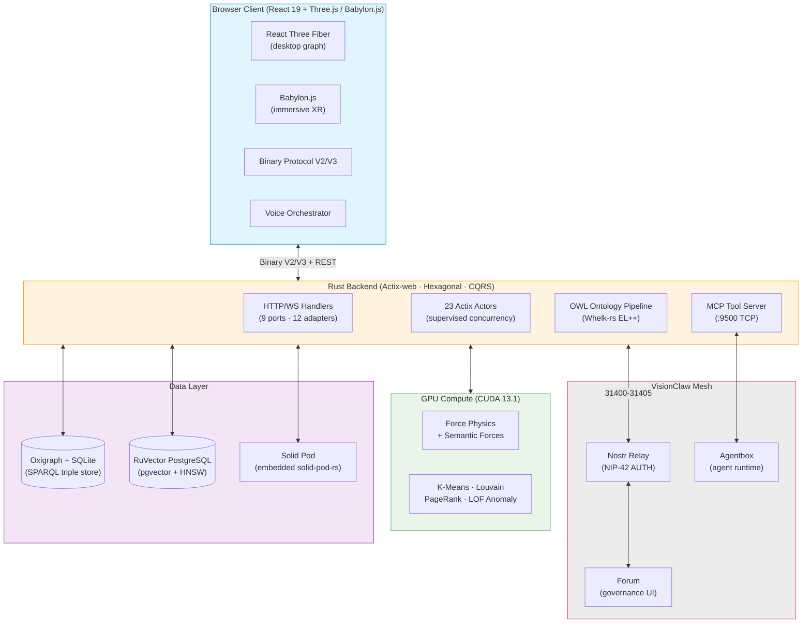

<div align="center">

# VisionClaw

### GPU-accelerated knowledge engineering with OWL 2 reasoning and immersive XR

[](https://github.com/DreamLab-AI/VisionClaw/actions)
[](https://github.com/DreamLab-AI/VisionClaw/releases)
[](LICENSE)
[](https://www.rust-lang.org/)
[](https://developer.nvidia.com/cuda-toolkit)
[](docs/README.md)

**Maintainer**: [John O'Hare](https://github.com/jjohare) · **Upstream IP**: [Melvin Carvalho](https://github.com/melvincarvalho) ([JSS](https://github.com/JavaScriptSolidServer/JavaScriptSolidServer), [DID:Nostr](https://github.com/nicholasgasior/did-nostr)) · [MAINTAINERS.md](MAINTAINERS.md)

<br/>

https://github.com/user-attachments/assets/f45c92dc-4800-4b57-a6e2-178da6bb0a38

<br/>

[Why VisionClaw?](#why-visionclaw) · [Quick Start](#quick-start) · [Capabilities](#capabilities) · [Architecture](#architecture) · [Performance](#performance) · [Documentation](#documentation)

</div>

---

**92 CUDA kernels · GPU clustering, anomaly detection and PageRank · Multi-user immersive XR · 88 agent skills · OWL 2 ontology governance · Nostr DID identity · Solid Pod sovereignty**

---

## What Is VisionClaw?

VisionClaw is an open-source knowledge engineering platform that transforms organisations into governed agentic meshes. It ingests knowledge from Logseq notebooks via GitHub, reasons over it with an OWL 2 EL inference engine (Whelk-rs), renders the result as an interactive 3D graph where nodes attract or repel based on semantic relationships, and exposes everything to AI agents through 7 Model Context Protocol tools. Users collaborate in the same space through multi-user XR presence, spatial voice, and immersive graph exploration.

Every agent decision is semantically grounded, every mutation passes consistency checking, and every reasoning chain is auditable from edge case back to first principles. **Governance isn't an inhibitor, it's an accelerant.**


### Why VisionClaw?

73% of frontline AI adoption happens without management sign-off. Your workforce is already building shadow workflows, stitching together AI agents, automating procurement shortcuts, inventing cross-functional pipelines that don't appear on any org chart. The question isn't whether your organisation is becoming an agentic mesh. It's whether you'll shape how it forms.

**The personal agent revolution has a governance problem.** Autonomous AI agents are powerful, popular, and ready to act. They've also shown what happens without shared semantics, formal reasoning, or organisational guardrails: unauthorised actions, prompt injection attacks, and enterprises deploying security scanners just to detect rogue agent instances on their own networks.

When agents know their authority boundary and surface exceptions cleanly, the 90% of decisions that don't need human judgment flow without friction. The 10% that do get clean, contextualised escalation with full provenance.

VisionClaw is the knowledge engineering substrate of the **[VisionClaw](https://github.com/DreamLab-AI/VisionClaw)** coordination platform — the federated mesh where autonomous agents, human judgment, and institutional knowledge collaborate through shared protocols and self-sovereign data.


*GPU-accelerated force-directed graph — 934 nodes responding to spring, repulsion, and ontology-driven semantic forces in real time*


*Chloe Nevitt interacting with Prof Rob Aspin's precursor to VisionClaw in the*
[Octave Multimodal Lab  University of Salford 2017](https://narrativegoldmine.com/notes/#/page/octave%20multi%20model%20laboratory)

---

## Quick Start

```bash
git clone https://github.com/DreamLab-AI/VisionClaw.git
cd VisionClaw && cp .env.example .env
docker-compose --profile dev up -d
```

| Service | URL | Description |
|:--------|:----|:------------|
| Frontend | http://localhost:3001 | 3D knowledge graph interface (via Nginx) |
| API | http://localhost:4000/api | REST + WebSocket endpoints (Rust/Actix-web) |
| Solid Pod | http://localhost:8484 | Embedded Solid pod server (solid-pod-rs) |

<details>
<summary><strong>Enable voice routing (LiveKit + whisper + TTS)</strong></summary>

```bash
docker-compose -f docker-compose.yml -f docker-compose.voice.yml --profile dev up -d
```

Adds LiveKit SFU (port 7880), turbo-whisper STT (CUDA), and Kokoro TTS. Requires GPU for real-time transcription.

</details>

<details>
<summary><strong>Enable multi-user XR (Vircadia World Server)</strong></summary>

```bash
docker-compose -f docker-compose.yml -f docker-compose.vircadia.yml --profile dev up -d
```

Adds Vircadia World Server with avatar sync, HRTF spatial audio, and collaborative graph editing.

</details>

<details>
<summary><strong>Native Rust + CUDA build</strong></summary>

```bash
curl --proto '=https' --tlsv1.2 -sSf https://sh.rustup.rs | sh
git clone https://github.com/DreamLab-AI/VisionClaw.git
cd VisionClaw && cp .env.example .env
cargo build --release --features gpu
cd client && npm install && npm run build && cd ..
./target/release/visionclaw-server
```

Requires CUDA 13.1 toolkit. See [Deployment Guide](docs/how-to/deployment-guide.md) for full GPU setup.

</details>

---

## Capabilities

### Three Layers of the Dynamic Mesh

```mermaid
flowchart TB
    subgraph Layer3["LAYER 3 — DECLARATIVE GOVERNANCE"]
        JB["Judgment Broker\n(Human-in-the-Loop)"]
        Policy["AI-Enforced Policies\nBias · Security · Alignment"]
        Trust["Cascading Trust\nNostr DID Identity"]
    end

    subgraph Layer2["LAYER 2 — ORCHESTRATION"]
        Skills["88 Agent Skills\nClaude-Flow DAG Pipelines"]
        Ontology["OWL 2 EL Reasoning\nWhelk-rs Inference Engine"]
        MCP["17 MCP Tools\nKnowledge Graph Read/Write"]
        GPU["GPU Compute\n92 CUDA Kernels"]
    end

    subgraph Layer1["LAYER 1 — DISCOVERY ENGINE"]
        Ingest["Knowledge Ingestion\nLogseq · GitHub · RSS"]
        Graph["Oxigraph + SQLite\n+ RuVector pgvector Memory"]
        Viz["3D Visualisation\nR3F · Babylon.js · WebXR"]
        Voice["Voice Routing\n4-Plane Architecture"]
    end

    Layer1 -->|"Insights bubble up"| Layer2
    Layer2 -->|"Exceptions surface"| Layer3
    Layer3 -->|"Governance flows down"| Layer2
    Layer2 -->|"Validated workflows deploy"| Layer1

    style Layer3 fill:#1A0A2A,stroke:#8B5CF6
    style Layer2 fill:#0A1A2A,stroke:#00D4FF
    style Layer1 fill:#0A2A1A,stroke:#10B981
```




<table>
<tr>
<td width="50%">

**Semantic Governance**
- OWL 2 EL reasoning via Whelk-rs (EL++ inference)
- `subClassOf` → attraction, `disjointWith` → repulsion in GPU physics
- Every ontology mutation creates a GitHub PR — human veto before commit
- Content-addressed immutable provenance beads (Nostr)
- 10 DDD bounded contexts with CQRS — 114 command/query handlers

</td>
<td width="50%">

**GPU-Accelerated Physics**
- 92 CUDA kernel functions across 11 files (6,585 LOC)
- 55× speedup vs single-threaded CPU physics
- Force-directed layout + semantic forces + stress majorisation
- On-demand: K-Means clustering, Louvain communities, LOF anomaly, PageRank
- Periodic full broadcast every 300 iterations — no stale-position bugs

</td>
</tr>
<tr>
<td width="50%">

**Agent Skills + MCP**
- Claude-Flow DAG orchestration with RAFT consensus hive-mind
- 7 MCP Ontology Tools (discover, read, query, traverse, propose, validate, status)
- Nostr DID agent identities with W3C-compliant key rotation
- Cascading trust revocation — revoke one agent, cascade to all dependents
- RuVector PostgreSQL memory (pgvector + HNSW, 384-dim MiniLM-L6-v2)

</td>
<td width="50%">

**Multi-User Immersive XR**
- Babylon.js WebXR for immersive/VR mode — Meta Quest 3 optimised
- React Three Fiber for desktop graph (dual-renderer architecture)
- Vircadia World Server: avatar sync, HRTF spatial audio, collaborative editing
- WebGPU with Three Shading Language (TSL) + WebGL fallback
- Foveated rendering, DPR capping, dynamic resolution scaling on Quest 3

</td>
</tr>
<tr>
<td width="50%">

**Self-Sovereign Identity**
- Nostr NIP-98 HTTP auth — signed cryptographic events, no passwords
- NIP-07 browser extension signing (Alby, nos2x)
- Embedded Solid Pod (solid-pod-rs) — each user owns their data
- WAC access control evaluated against `did:nostr` identities
- Per-user agent memory namespace via NIP-26 delegation

</td>
<td width="50%">

**Voice Routing (4-Plane Architecture)**
- LiveKit SFU + turbo-whisper STT (CUDA) + Kokoro TTS
- Plane 1: User mic → whisper → private agent channel
- Plane 2: Agent TTS → user ear (private)
- Planes 3–4: Public spatial audio via LiveKit + Vircadia HRTF
- Opus 48kHz mono end-to-end

</td>
</tr>
</table>

### The Insight Ingestion Loop

How shadow workflows become sanctioned organisational intelligence:

```mermaid
flowchart LR
    D["DISCOVERY\nPassive agent monitoring\ndetects the pattern"]
    C["CODIFICATION\nMaps the new path\nas a proposed DAG —\nOWL 2 formalised\nwith provenance"]
    V["VALIDATION\nThe Judgment Broker\nreviews for strategic\nfit & bias"]
    I["INTEGRATION\nPromoted to live mesh\nwith SLAs, ownership,\nquality"]
    A["AMPLIFICATION\nMesh propagates\npattern to other\nteams where it applies"]

    D --> C --> V --> I --> A

    style D fill:#0A2A1A,stroke:#10B981
    style C fill:#0A1A2A,stroke:#00D4FF
    style V fill:#1A0A2A,stroke:#8B5CF6
    style I fill:#0A1A2A,stroke:#00D4FF
    style A fill:#0A2A1A,stroke:#10B981
```



### Agent Control Surface Protocol

Agents publish structured Nostr events; the relay routes them; the forum renders decision surfaces; humans respond with cryptographically signed events. The governance audit trail is immutable by construction.

| Kind | Name | Flow |
|---|---|---|
| 31400 | PanelDefinition | Agent → declares a control panel |
| 31401 | PanelState | Agent → current data snapshot |
| 31402 | ActionRequest | Agent → requests a human decision |
| 31403 | ActionResponse | Human → approve/reject (NIP-98 signed) |
| 31404 | PanelUpdate | Agent → incremental state diff |
| 31405 | PanelRetired | Agent → retires a control panel |

<details>
<summary><strong>7 MCP Ontology Tools (native)</strong></summary>


| Tool | Purpose |
|:-----|:--------|
| `ontology_discover` | Semantic keyword search with Whelk inference expansion |
| `ontology_read` | Enriched note with axioms, relationships, schema context |
| `ontology_query` | Validated Cypher execution with schema-aware label checking |
| `ontology_traverse` | BFS graph traversal from starting IRI |
| `ontology_propose` | Create/amend notes → consistency check → GitHub PR |
| `ontology_validate` | Axiom consistency check against Whelk reasoner |
| `ontology_status` | Service health and statistics |

</details>

<details>
<summary><strong>10 MCP Ontology Bridge Tools (agentbox → VisionClaw)</strong></summary>

The agentbox ontology bridge (`mcp/servers/ontology-bridge.js`) proxies agents running inside agentbox to VisionClaw's Oxigraph SPARQL store and REST API over the shared `visionclaw_network`. Gated by `[skills.ontology]` in `agentbox.toml`. Fail-open when VisionClaw is unreachable.

| Tool | Purpose |
|:-----|:--------|
| `ontology_health` | Bridge and backend health check |
| `ontology_search` | Full-text search across ontology concepts |
| `ontology_class_get` | Retrieve a single class with axioms and relationships |
| `ontology_class_list` | List classes with optional prefix filter |
| `ontology_axiom_add` | Add axioms (SPARQL UPDATE, gated) |
| `ontology_validate` | Consistency check via Whelk reasoner |
| `ontology_graph_query` | Raw SPARQL SELECT with `vc:` prefix auto-injection |
| `kg_node_search` | Search knowledge graph nodes by label or property |
| `kg_neighbors` | Get immediate neighbors of a node (1-hop) |
| `kg_pathfind` | Shortest path between two nodes |

</details>

<details>
<summary><strong>Binary WebSocket Protocol (V2/V3)</strong></summary>

High-frequency position updates use a compact binary protocol instead of JSON, achieving 80% bandwidth reduction.

**V2 Standard (36 bytes/node)** — production default:

| Bytes | Field | Type | Description |
|:------|:------|:-----|:------------|
| 0–3 | Node ID | u32 | Flag bits 26-31 encode node type |
| 4–15 | Position (X/Y/Z) | f32×3 | World-space position |
| 16–27 | Velocity (X/Y/Z) | f32×3 | Physics velocity |
| 28–31 | SSSP distance | f32 | Shortest-path from source |
| 32–35 | Timestamp | u32 | ms since session start |

**V3 Analytics (48 bytes/node)** — includes GPU analytics:

Adds `cluster_id` (u16), `anomaly_score` (f32), `community_id` (u16), `page_rank` (f32) at bytes 36–47.

</details>

<details>
<summary><strong>Agent skill domains (83 skills)</strong></summary>

**Creative Production** — Script, storyboard, shot-list, grade & publish workflows. ComfyUI orchestration for image, video, and 3D asset generation.

**Research & Synthesis** — Multi-source ingestion, GraphRAG, semantic clustering, Perplexity integration.

**Knowledge Codification** — Tacit-to-explicit extraction; OWL concept mapping; Logseq-formatted output.

**Governance & Audit** — Bias detection, provenance chains (content-addressed beads), declarative policy enforcement.

**Workflow Discovery** — Shadow workflow detection; DAG proposal & validation against ontology.

**Spatial & Immersive** — XR scene graph, light field, WebXR rendering agent, Blender MCP, ComfyUI SAM3D.

**Identity & Trust** — DID management, key rotation, Nostr agent communications, NIP-26 delegation.

**Development & Quality** — Rust development, pair programming, agentic QE fleet (111+ sub-agents), GitHub code review.

**Infrastructure & DevOps** — Docker management, Kubernetes ops, Linux admin, network analysis, monitoring.

</details>

<details>
<summary><strong>Node geometry and material system</strong></summary>

| Node Type | Geometry | Material | ID Encoding |
|:---------|:---------|:---------|:------------|
| Knowledge (public pages) | Icosahedron r=0.5 | `GemNodeMaterial` — analytics-driven colour | Bit 30 set (`0x40000000`) |
| Ontology | Sphere r=0.5 | `CrystalOrbMaterial` — depth-pulsing cosmic spectrum | Bits 26-28 set (`0x1C000000`) |
| Agent | Capsule r=0.3 h=0.6 | `AgentCapsuleMaterial` — bioluminescent heartbeat | Bit 31 set (`0x80000000`) |
| Linked pages | Icosahedron r=0.35 | `GemNodeMaterial` | No flag bits |

Agent visual states: `#10b981` (idle) · `#fbbf24` (spawning/active) · `#ef4444` (error) · `#f97316` (busy).

</details>

<details>
<summary><strong>Voice routing (4-plane architecture)</strong></summary>

| Plane | Direction | Scope | Trigger |
|:------|:----------|:------|:--------|
| 1 | User mic → turbo-whisper STT → Agent | Private | PTT held |
| 2 | Agent → Kokoro TTS → User ear | Private | Agent responds |
| 3 | User mic → LiveKit SFU → All users | Public (spatial) | PTT released |
| 4 | Agent TTS → LiveKit → All users | Public (spatial) | Agent configured public |

Opus 48kHz mono end-to-end. HRTF spatial panning from Vircadia entity positions.

</details>

<details>
<summary><strong>Logseq ontology input (source data)</strong></summary>

<br/>

| Ontology metadata | Graph structure |
|:-:|:-:|
|  |  |
| OWL entity page with category, hierarchy, and source metadata | Graph view showing semantic clusters |


*Dense knowledge graph in Logseq — the raw ontology VisionClaw ingests, reasons over, and renders in 3D*

</details>

<details>
<summary><strong>Mesh KPIs — measuring what matters</strong></summary>

| KPI | Formula | Target | What It Measures |
|:----|:--------|:-------|:-----------------|
| **Mesh Velocity** | Δt(insight → codified workflow) | < 48h | How fast a discovered shortcut becomes a sanctioned, reusable DAG |
| **Augmentation Ratio** | Cognitive load offloaded ÷ Total cognitive load | > 65% | Percentage of decision-making handled by agents without human escalation |
| **Trust Variance** | σ(Agent Decision Quality) over 30-day window | < 0.12σ | Drift or bias monitoring in the automated task layer |
| **HITL Precision** | Correct escalations ÷ Total escalations | > 90% | Are the edge cases the mesh flags actually requiring human intervention? |

</details>

---

## Architecture


### Workspace crates (ADR-090)

The Rust backend is a Cargo workspace. The `visionclaw-server` binary depends on six extracted crates arranged as an acyclic DAG:

| Crate | Responsibility |
|:------|:---------------|
| `visionclaw-domain` | Domain model, port traits, no framework dependencies |
| `visionclaw-protocol` | Binary V2/V3 wire protocol encode/decode |
| `visionclaw-gpu` | CUDA kernels, force-directed physics, build.rs PTX compilation |
| `visionclaw-ontology` | OWL 2 types, horned-owl pipeline, ontology services |
| `visionclaw-adapters` | Oxigraph ontology store, Whelk inference engine |
| `visionclaw-actors` | Actor message types; actor implementations remain in `visionclaw-server` |

Dependency order (inner → outer): `contracts → domain → {gpu, ontology, protocol} → adapters → actors → visionclaw-server`



<details>
<summary><strong>Hexagonal architecture (9 ports · 12 adapters · 114 CQRS handlers)</strong></summary>

VisionClaw follows strict hexagonal architecture. Business logic in `src/services/` depends only on port traits in `src/ports/`. Concrete implementations live in `src/adapters/`, swapped at startup via dependency injection.

```mermaid
flowchart LR
    subgraph Ports["src/ports/ (Traits)"]
        GP[GraphRepository]
        OR[OntologyRepository]
        IE[InferenceEngine]
        GPA[GpuPhysicsAdapter]
        GSA[GpuSemanticAnalyzer]
        SR[SettingsRepository]
        SP[SolidPodRepository]
        NR[NostrRelay]
        VR[VectorRepository]
    end

    subgraph Adapters["src/adapters/ (Implementations)"]
        OxiGraph[OxigraphGraphRepository]
        OxiOntology[OxigraphOntologyRepository]
        Whelk[WhelkInferenceEngine]
        CudaPhysics[PhysicsOrchestratorAdapter]
        SolidPod[EmbeddedSolidPodAdapter]
        RuVectorAdapter[RuVectorAdapter]
    end

    subgraph Services["src/services/ (Business Logic)"]
        OQS[OntologyQueryService]
        OMS[OntologyMutationService]
        GPS[GitHubPRService]
        OPS[OntologyPipelineService]
    end

    Services --> Ports
    Adapters -.->|implements| Ports

    style Ports fill:#e8f5e9,stroke:#4caf50
    style Adapters fill:#fff3e0,stroke:#ff9800
    style Services fill:#e1f5ff,stroke:#0288d1
```



</details>

<details>
<summary><strong>23-Actor supervision tree</strong></summary>

The backend uses Actix actors for supervised concurrency. GPU actors form a hierarchy: `GraphServiceSupervisor` → `PhysicsOrchestratorActor` → `ForceComputeActor`. All actors restart automatically on failure.

**GPU Physics Actors:**

| Actor | Purpose |
|:------|:--------|
| `ForceComputeActor` | Core force-directed layout (CUDA) — 60Hz |
| `StressMajorizationActor` | Stress majorisation algorithm |
| `ClusteringActor` | K-Means + Louvain community detection (GPU) |
| `PageRankActor` | GPU PageRank centrality computation |
| `ShortestPathActor` | Delta-stepping SSSP (GPU) |
| `ConnectedComponentsActor` | Label propagation component detection (GPU) |
| `AnomalyDetectionActor` | LOF / Z-score anomaly detection (GPU) |
| `SemanticForcesActor` | OWL-driven attraction/repulsion constraints |
| `ConstraintActor` | Layout constraint solving |
| `AnalyticsSupervisor` | GPU analytics orchestration |
| `BroadcastOptimizerActor` | Delta-filter + periodic full-broadcast (300 iters) |

**Service Actors:**

| Actor | Purpose |
|:------|:--------|
| `GraphStateActor` | Canonical graph state — single source of truth |
| `OntologyActor` | OWL class management and Whelk bridge |
| `ClientCoordinatorActor` | Per-client session management + WebSocket |
| `PhysicsOrchestratorActor` | Delegates to GPU actors, manages convergence |
| `SemanticProcessorActor` | NLP query processing |
| `VoiceCommandsActor` | Voice-to-action routing |
| `TaskOrchestratorActor` | Background task scheduling |
| `GitHubSyncActor` | Incremental GitHub sync (SHA1 delta) |
| `OntologyPipelineActor` | Assembler → converter → Whelk pipeline |
| `GraphServiceSupervisor` | Top-level GPU supervision and restart |
| `ServerNostrActor` | Signs and publishes governance events (31400/31402) |
| `AgentMonitorActor` | Agent lifecycle monitoring |

</details>

<details>
<summary><strong>DDD bounded contexts (10 contexts)</strong></summary>

**Core Domain:** Knowledge Graph · Ontology Governance · Physics Simulation

**Supporting Domain:** Authentication (Nostr NIP-98) · Identity (DID/Solid) · Agent Orchestration · Semantic Analysis

**Generic Domain:** User Management · Audit/Provenance · Configuration

Each context has its own aggregate roots, domain events, and anti-corruption layers. Cross-context communication uses domain events, never direct model sharing. See [DDD Bounded Contexts](docs/explanation/ddd-bounded-contexts.md).

</details>

---

## Real-World Validation

| Deployment | Context | Scale |
|:-----------|:--------|:------|
| **DreamLab Creative Hub** | 50-person creative technology team — live production | ~998 knowledge graph nodes, daily ontology mutations |
| **University of Salford** | Research partnership validating semantic force-directed layout | Multi-institution ontology |
| **THG World Record** | Large-scale multi-user immersive data visualisation | 250+ concurrent XR users |

---

## Performance

| Metric | Result | Conditions |
|:-------|-------:|:-----------|
| GPU physics speedup | 55× | vs single-threaded CPU |
| HNSW semantic search | 61µs p50 | RuVector pgvector, 1.17M entries |
| WebSocket latency | 10ms | Local network, V2 binary |
| Bandwidth reduction | 80% | Binary V2 vs JSON |
| Concurrent XR users | 250+ | Vircadia World Server |
| CUDA kernels | 92 | 6,585 LOC across 11 files |

---

## Technology Stack

<details>
<summary><strong>Full technology breakdown</strong></summary>

| Layer | Technology | Detail |
|:------|:-----------|:-------|
| **Backend** | Rust 2021 · Actix-web | 427 files, 175K LOC · hexagonal CQRS · 9 ports · 12 adapters · 114 handlers |
| **Frontend (desktop)** | React 19 · Three.js 0.182 · R3F | 370 files, 96K LOC · TypeScript 5.9 · InstancedMesh · SAB zero-copy |
| **Frontend (XR)** | Babylon.js | Immersive/VR mode — Quest 3 foveated rendering, hand tracking |
| **WASM** | Rust → wasm-pack | `scene-effects` crate: zero-copy `Float32Array` view over `WebAssembly.Memory` |
| **Graph Store** | Oxigraph + SQLite | ADR-11 canonical persistence (SPARQL triple store) |
| **Vector Memory** | RuVector PostgreSQL · pgvector | 1.17M+ entries · HNSW 384-dim · MiniLM-L6-v2 · 61µs search |
| **GPU** | CUDA 13.1 · cudarc | 92 kernel functions · 6,585 LOC · PTX ISA auto-downgrade |
| **Ontology** | OWL 2 EL · Whelk-rs | EL++ subsumption · consistency checking |
| **Multi-User** | Vircadia World Server | Avatar sync · spatial HRTF audio · collaborative editing |
| **Voice** | LiveKit SFU · turbo-whisper · Kokoro | CUDA STT · TTS · Opus 48kHz · 4-plane routing |
| **Identity** | Nostr NIP-07/NIP-98 · DID:Nostr | Browser extension signing · NIP-26 delegation · W3C key rotation |
| **User Data** | Solid Pods · solid-pod-rs (embedded) | Per-user data sovereignty · WAC access control · JSON-LD |
| **Agents** | Claude-Flow · MCP · RAFT | 83 skills · 7 ontology tools · hive-mind consensus |
| **Build** | Vite 6 · Vitest · Playwright | Frontend build · unit tests · E2E tests |
| **Infra** | Docker Compose | 15+ services · multi-profile (dev/prod/voice/xr) |

</details>

---

## Documentation

VisionClaw uses the [Diataxis](https://diataxis.fr/) framework — 106 markdown files across four categories, 46 with embedded Mermaid diagrams:

| Category | Path | Content |
|:---------|:-----|:--------|
| **Tutorials** | [`docs/tutorials/`](docs/tutorials/) | First graph, platform overview |
| **How-To Guides** | [`docs/how-to/`](docs/how-to/) | Deployment, agents, XR setup, performance profiling, operations |
| **Explanation** | [`docs/explanation/`](docs/explanation/) | Architecture, DDD, ontology, GPU physics, VisionClaw platform, security |
| **Reference** | [`docs/reference/`](docs/reference/) | REST API, WebSocket protocol, agents catalog, error codes |

Key entry points: [Documentation Hub](docs/README.md) · [VisionClaw Platform](docs/explanation/visionclaw-coordination-platform.md) · [Wardley Map](docs/explanation/visionclaw-wardley-map.md) · [Architecture Overview](docs/explanation/system-overview.md) · [Deployment Topology](docs/explanation/deployment-topology.md) · [Known Issues](docs/KNOWN_ISSUES.md)

---

## Development

<details>
<summary><strong>Prerequisites, build commands, system requirements</strong></summary>

### Prerequisites

| Tool | Version | Purpose |
|:-----|:--------|:--------|
| Rust | 2021 edition | Backend |
| Node.js | 20+ | Frontend |
| Docker + Docker Compose | — | Services |
| CUDA Toolkit | 13.1 | GPU acceleration (optional) |

### Build and Test

```bash
cargo build --release && cargo test
cd client && npm install && npm run build && npm test
```

### System Requirements

| Tier | CPU | RAM | GPU | Use Case |
|:-----|:----|:----|:----|:---------|
| **Minimum** | 4-core 2.5GHz | 8 GB | Integrated | Development · < 10K nodes |
| **Recommended** | 8-core 3.0GHz | 16 GB | GTX 1060 / RX 580 | Production · < 50K nodes |
| **Enterprise** | 16+ cores | 32 GB+ | RTX 4080+ (16GB VRAM) | Large graphs · multi-user XR |

**Platform support:** Linux (full GPU) · macOS (CPU-only) · Windows (WSL2) · Meta Quest 3 (Beta)

</details>

<details>
<summary><strong>Project structure</strong></summary>

```
VisionClaw/
├── src/                          # Rust backend (427 files, 175K LOC)
│   ├── actors/                   #   23 Actix actors (GPU compute + services)
│   ├── adapters/                 #   Oxigraph, Whelk, CUDA, Solid, RuVector adapters
│   ├── handlers/                 #   HTTP/WebSocket request handlers (CQRS)
│   ├── services/                 #   Business logic (ontology, voice, agents)
│   ├── ports/                    #   Trait definitions (9 hexagonal boundaries)
│   ├── gpu/                      #   CUDA kernel bridge, memory, streaming
│   └── utils/*.cu                #   92 CUDA kernel functions (11 files, 6,585 LOC)
├── client/                       # React frontend (370 files, 96K LOC)
│   ├── src/features/             #   13 feature modules (graph, settings, etc.)
│   ├── src/services/             #   Voice, WebSocket, Nostr auth, Solid
│   └── crates/scene-effects/     #   Rust WASM crate — zero-copy scene FX
├── agentbox/                     # Submodule: agent runtime (ontology bridge, 88 skills, browser setup wizard)
├── docs/                         # Diataxis documentation (106 files, 46 with Mermaid)
│   ├── explanation/              #   Architecture (incl. VisionClaw platform doc)
│   ├── adr/                      #   91 Architecture Decision Records
│   └── KNOWN_ISSUES.md           #   Active P1/P2 bugs
├── tests/                        # Integration tests
└── scripts/                      # Build, migration, embedding ingestion
```

</details>

---

## Contributing

See the [Contributing Guide](docs/CONTRIBUTING.md). Check [Known Issues](docs/KNOWN_ISSUES.md) before starting — the Ontology Edge Gap (ONT-001) and V4 delta instability (WS-001) are active P1/P2 bugs.

---

## License

[Mozilla Public License 2.0](LICENSE) — Use commercially, modify freely, share changes to MPL files.

---

<div align="center">

**VisionClaw is the knowledge engineering substrate of [VisionClaw](https://github.com/DreamLab-AI/VisionClaw), built by [DreamLab AI](https://www.dreamlab-ai.com).**

[VisionClaw Platform](https://github.com/DreamLab-AI/VisionClaw) · [Documentation](docs/README.md) · [Known Issues](docs/KNOWN_ISSUES.md) · [Discussions](https://github.com/DreamLab-AI/VisionClaw/discussions)

</div>
