<div align="center">

# VisionClaw

### The governed knowledge mesh where contributors, agents, and ontology compound.

[](https://github.com/DreamLab-AI/VisionClaw/actions)
[](https://github.com/DreamLab-AI/VisionClaw/releases)
[](LICENSE)
[](https://www.rust-lang.org/)
[](https://developer.nvidia.com/cuda-toolkit)
[](docs/README.md)

**One person's breakthrough becomes everyone's baseline. Notes become vocabulary as a by-product of note-taking. Ontology governs the physics. Pods own the data. Brokers resolve the edge cases. The Contributor Studio is where all of it meets the human.**

<br/>

https://github.com/user-attachments/assets/f45c92dc-4800-4b57-a6e2-178da6bb0a38

<br/>

[The three strata](#the-three-strata) · [Quick Start](#quick-start) · [Contributor Studio](#contributor-studio-2026-04-20-sprint) · [The Migration Event](#the-migration-event) · [Architecture](#architecture) · [Capabilities](#core-capabilities) · [Documentation](#documentation)

</div>

---

## Your Best People Are Already Running the Future
They just haven't told you yet.

More than half of generative AI users already use AI without telling their employers, and 78% of knowledge workers bring their own AI tools to work. Your workforce is already building shadow workflows, stitching together AI agents, automating procurement shortcuts, and inventing cross-functional pipelines that do not appear on any org chart. The question is no longer whether the coordination function is shifting. It is whether you will surface, govern, and compound what people have already discovered.

The personal agent revolution has a governance problem. As information routing becomes computationally cheap, the strategic challenge shifts from moving information around the organisation to deciding where AI can be trusted, where human judgment must remain active, and how shared meaning is maintained across teams and agents. Tools like Claude Code have shown that autonomous AI agents are powerful, popular, and ready to act. They've also shown what happens when agents operate without shared semantics, formal reasoning, or organisational guardrails: unauthorised actions, prompt injection attacks, and enterprises deploying security scanners just to detect rogue agent instances on their own networks.

VisionClaw takes the opposite approach. Governance isn't an inhibitor, it's an accelerant — a way to turn shadow workflows into auditable, reusable organisational capability.

## Problem

Every organisation rots in the same three directions.

**Tribal knowledge accumulates** in personal notes, Slack threads, half-finished docs — rich and current but illegible to agents, query tools, or anyone who wasn't in the room.

**Formal ontology stales** — expensive to author, expensive to keep clean, and nobody uses it.

**Individual AI productivity does not compound** — a skill a contributor develops on Monday is invisible on Tuesday; a routine they stabilise is a private shell alias; an insight they harvest from Pod memory is trapped in their screen.

Agents sit in the middle, forced to improvise shared meaning on every request. They hallucinate categories, fabricate relationships, route on keyword overlap.

VisionClaw treats all three as one problem with one mechanism: **let the work become the institution — under human governance, visibly, as the graph itself.**

---
## Overall Infographic

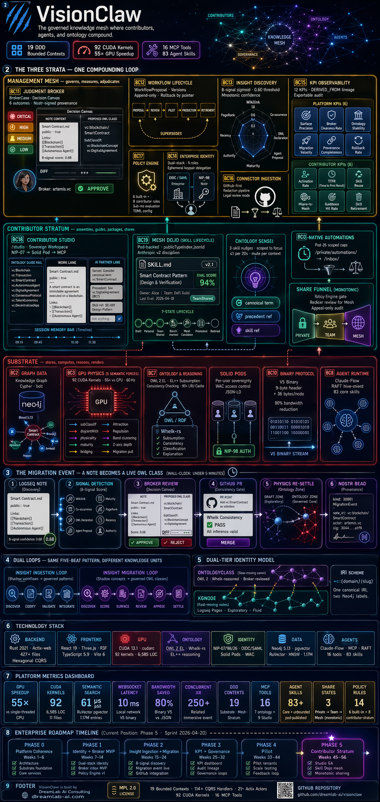

## Three Solution Strata

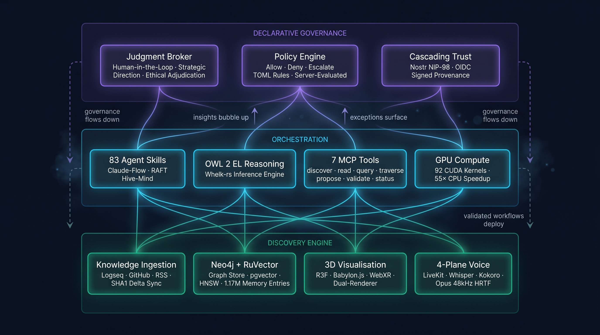

| Stratum | Owns | Contexts |
|:--------|:-----|:---------|
| **Substrate** | Graph, ontology, physics, Solid Pods, identity, agents, binary protocol | BC1–BC10 |
| **Contributor Stratum** | Daily knowledge work: Studio, Skill Dojo, Ontology Sensei, Pod-native automations | BC18, BC19 |
| **Management Mesh** | Governance: Judgment Broker, Workflow Lifecycle, Insight Discovery, Enterprise Identity, KPI Observability, Connector Ingestion, Policy Engine | BC11–BC17 |

The Contributor Stratum is the compounding loop between the other two. Private work lives in a contributor's Pod; a governed **ShareIntent** promotes it to Team, then through Broker review to Mesh, where it becomes institutional capability. The same mechanism handles notes, skills, workflows, ontology candidates, and reusable graph views.

---

## Contributor Studio (2026-04-20 sprint)

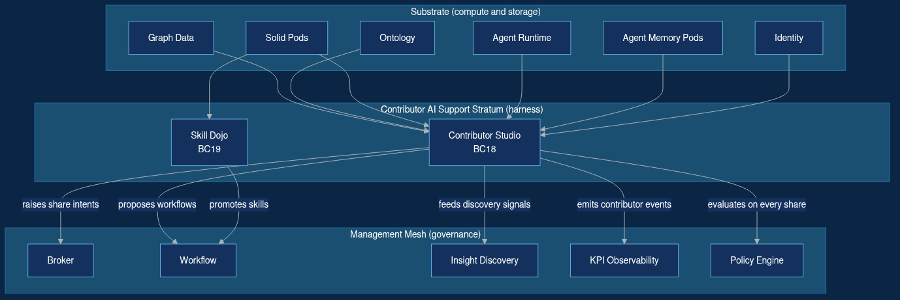

**A workspace, not a chat window.** The `/studio` surface is a peer of `/broker` that puts ontology context, AI partners, installed skills, and share controls side-by-side with the work itself. Four pillars:

- **🪟 Sovereign Workspace** — NIP-07 auth propagates transparently to Solid Pod and MCP; every artefact lands in `/private/` by default; graph-node selection deep-links into the AI partner lane.
- **🥋 Mesh Dojo** — decentralised skill sharing via `publicTypeIndex.jsonld` (ADR-029); `SKILL.md` files live in `/public/skills/{slug}/` and federate to peer pods; eval suites gate team and mesh promotion (Anthropic Skill-Creator v2 discipline).
- **🌿 Ontology Sensei** — background synthesis over `/private/agent-memory/episodic/`; proactive "3 skills you might run" nudges scoped to the current workspace focus; accept/dismiss feeds BC15 hit-rate KPI.
- **⏰ Pod-Native Automations** — cron routines in `/private/automations/*.json` run via NIP-26 scoped delegation caps; output lands in `/inbox/{agent-ns}/`; offline routines can't cross to Mesh without broker review.

| Component | Type | Location |
|:----------|:-----|:---------|
| `ContributorWorkspace`, `GuidanceSession`, `WorkArtifact`, `ShareIntent` | BC18 aggregates | `src/domain/contributor/` |
| `SkillPackage`, `SkillVersion`, `SkillEvalSuite`, `SkillBenchmark` | BC19 aggregates | `src/domain/skills/` |
| `ContributorStudioSupervisor` + Context/Guidance/Partner actors | Actor tree | `src/actors/contributor_studio_supervisor.rs` |
| `ShareOrchestratorActor` + policy engine + WAC mutator | Share funnel | `src/actors/share_orchestrator_actor.rs` |
| `AutomationOrchestratorActor` + NIP-26 caps + inbox service | Headless work | `src/actors/automation_orchestrator_actor.rs` |
| `DojoDiscoveryActor` + `SkillEvaluationActor` + compatibility scanner | Skill lifecycle | `src/actors/skill_registry_supervisor.rs` |
| `/studio` multi-pane React surface | Client | `client/src/features/contributor-studio/` |
| 9 new MCP tools (`skill_publish`, `sensei_nudge`, `share_intent_create`, ...) | Tool surface | `src/mcp/contributor_tools/` |

**Three share states, strictly monotonic:** Private → Team → Mesh. The only way down is `ContributorRevocation` or `BrokerRevocation`; every transition is a Policy Engine (ADR-045) decision with an append-only audit entry in `/private/contributor-profile/share-log.jsonld`.

Documentation: [PRD-003](docs/PRD-003-contributor-ai-support-stratum.md) · [ADR-057](docs/adr/ADR-057-contributor-enablement-platform.md) · [BC18/BC19 DDD](docs/explanation/ddd-contributor-enablement-context.md) · [Sprint master](docs/design/2026-04-20-contributor-studio/00-master.md)

---

## The Migration Event

Every capability in the substrate serves this one event. A `public:: true` Logseq note accumulates signals — ontology wikilinks, agent proposals, authoring maturity — until it surfaces in a Judgment Broker's inbox. The broker takes two minutes, approves, the system opens a GitHub PR, and on merge the note becomes a live OWL class Whelk can reason over. The 3D physics view redraws around it. A Nostr-signed provenance bead closes the chain.

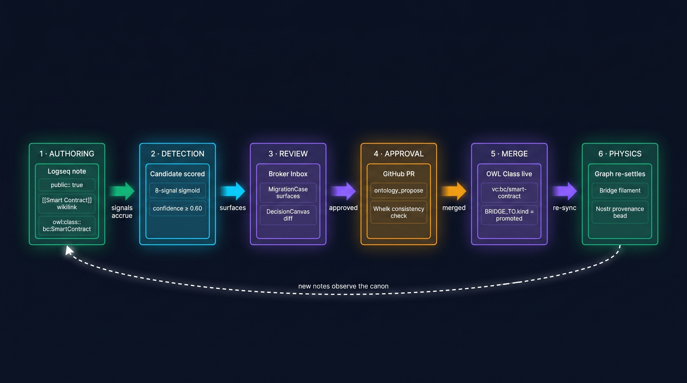

The ontology grows from the bottom up, not the top down. Nothing formal is authored unless something informal earned it.

### Two tiers it bridges

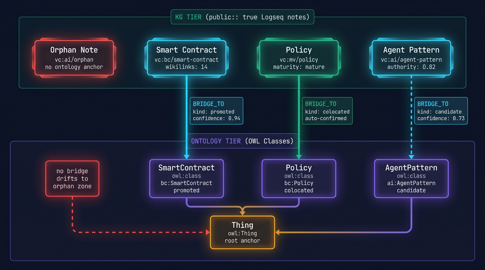

`KGNode` (fast-moving notes) and `OntologyClass` (slow-moving canon) share one canonical IRI scheme `vc:{domain}/{slug}`. They connect through `BRIDGE_TO` edges that advance `candidate → promoted` via the migration event — or stay `colocated` when a note and class are the same concept from two angles. See [ADR-048](docs/adr/ADR-048-dual-tier-identity-model.md).

### How candidates are scored

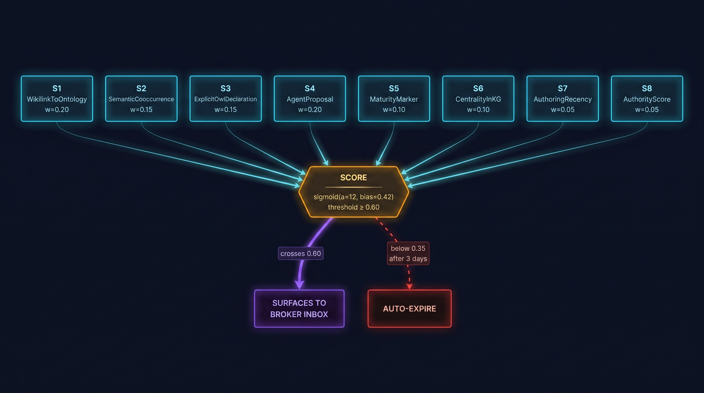

No LLM opinion-as-fact. Eight structural signals feed a sigmoid. Above 0.60 a candidate surfaces to the broker. Below 0.35 for three days it auto-expires. Agent confidence is *one* signal of eight — it does not bypass the gate. See [candidate-scoring.md](docs/design/2026-04-18-insight-migration-loop/05-candidate-scoring.md).

### Two loops, one mesh

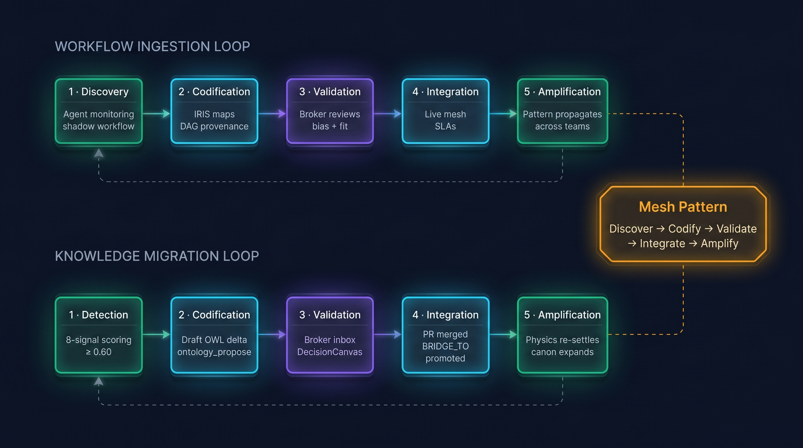

Shadow workflows become governed patterns. Shadow concepts become governed classes. Same five-beat loop, different units. See the [Insight Migration Loop master design](docs/design/2026-04-18-insight-migration-loop/00-master.md).

---

## Physics the metadata makes possible

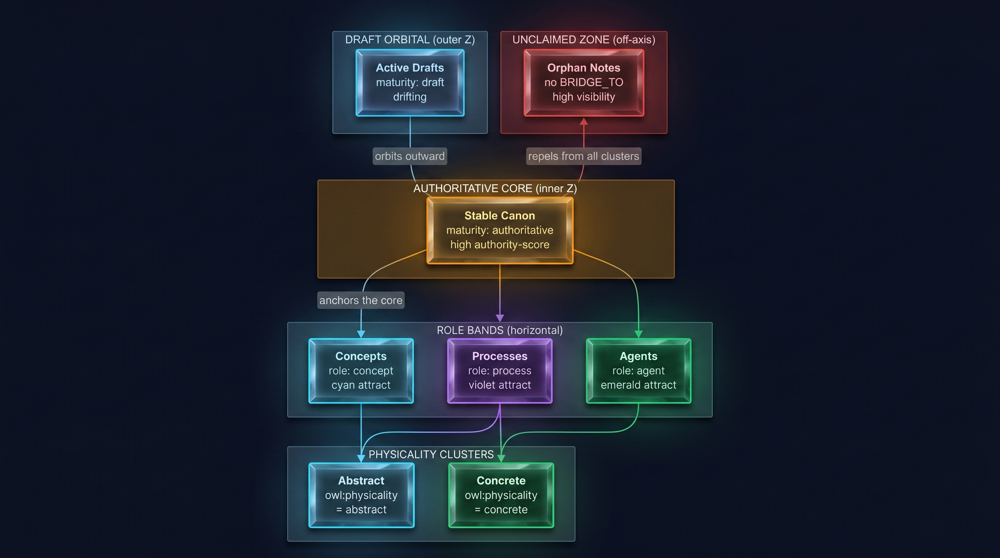

The CUDA physics is not decoration. It reads `owl:physicality`, `owl:role`, and `maturity` properties and turns them into five semantic forces: abstract clumps with abstract, processes band together, authoritative nodes anchor a stable core while drafts drift outward, orphaned notes (no ontology anchor yet) repel into a distinct zone that makes them visible as migration candidates.

92 CUDA kernel functions. 55× over single-threaded CPU. Every force is tunable per-domain. See [physics mapping](docs/design/2026-04-18-insight-migration-loop/03-physics-mapping.md).

---

## Positioning

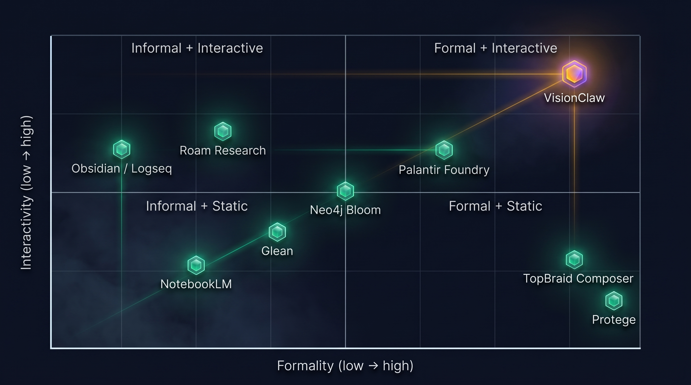

Every axis of this tool has good prior art. Obsidian and Logseq do wikilinks. Protégé and TopBraid do formal OWL authoring. Palantir does enterprise ontology. NotebookLM does LLM over notebooks. Neo4j Bloom does graph interaction. Ramp Glass does institutional AI workspace.

**Nobody puts them in the same room.** The upper-right quadrant — high formality *and* high interactivity *and* institutional compounding — was empty because the migration event itself is the hard part, and because the compounding funnel from private work to mesh asset was nobody's product surface. VisionClaw lives there. See [prior-art analysis](docs/design/2026-04-18-insight-migration-loop/01-prior-art.md) and the [Contributor Stratum evidence annex](docs/design/2026-04-20-contributor-studio/evidence-annex.md) for how the industry (PwC, McKinsey, a16z, Ramp, Anthropic) arrived at the same diagnosis from a different direction.

---

## Quick Start

```bash
git clone https://github.com/DreamLab-AI/VisionClaw.git
cd VisionClaw && cp .env.example .env
docker-compose --profile dev up -d
```

| Service | URL | Description |
|:--------|:----|:------------|
| Frontend | http://localhost:3001 | 3D knowledge graph interface |
| Contributor Studio | http://localhost:3001/#/studio | Multi-pane contributor workspace |
| Broker Workbench | http://localhost:3001/#/broker | Judgment broker inbox + Decision Canvas |
| API | http://localhost:4000/api | REST + WebSocket endpoints |
| Neo4j Browser | http://localhost:7474 | Graph database explorer |
| JSS Solid | http://localhost:3030 | Solid Pod server |

---

## Architecture

VisionClaw is a hexagonal Rust backend with 21+ Actix actors, 9 ports and 12 adapters, 114+ CQRS handlers, CUDA 13.1 compute, and OWL 2 EL reasoning via Whelk-rs.

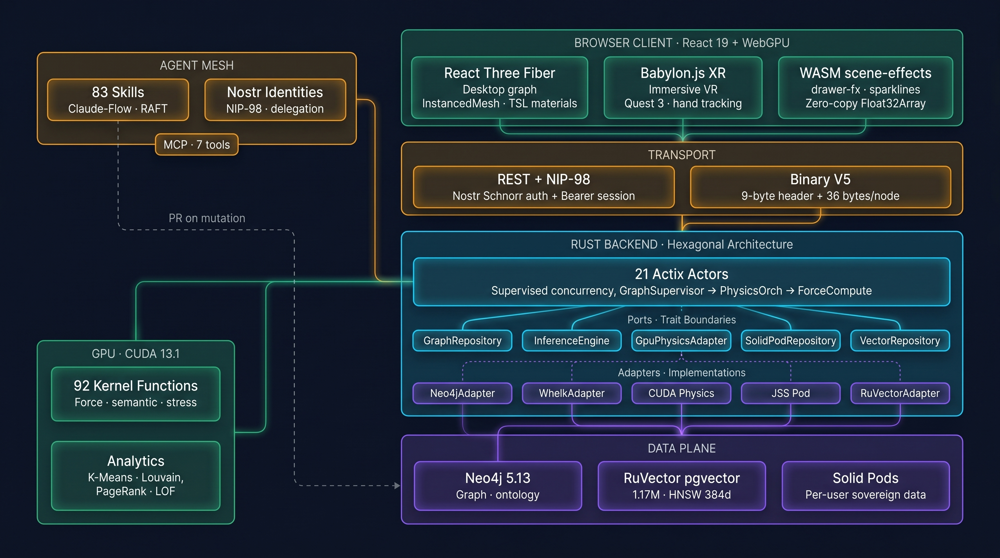

<details>
<summary><strong>19 DDD bounded contexts · hexagonal details</strong></summary>

- **Core Domain**: Knowledge Graph (BC2) · Physics Simulation (BC3) · Ontology Governance (BC7) · Judgment Broker (BC11) · Workflow Lifecycle (BC12) · Insight Discovery (BC13) · **Contributor Enablement (BC18)**
- **Supporting Domain**: Authentication (BC1) · WebSocket Comm (BC4) · Settings (BC5) · Binary Protocol (BC10) · Enterprise Identity (BC14) · KPI Observability (BC15) · Policy Engine (BC17) · **Skill Lifecycle (BC19)**
- **Generic Domain**: Analytics (BC6) · Agent Orchestration (BC8) · Rendering (BC9) · Connector Ingestion (BC16)

Each context owns aggregate roots, domain events, and anti-corruption layers. Cross-context communication uses domain events, never direct model sharing.

- [Core Bounded Contexts (BC1–BC10)](docs/explanation/ddd-bounded-contexts.md)
- [Enterprise Bounded Contexts (BC11–BC17)](docs/explanation/ddd-enterprise-contexts.md)
- [Contributor Enablement Contexts (BC18–BC19)](docs/explanation/ddd-contributor-enablement-context.md)
- [Insight Migration context refinement](docs/explanation/ddd-insight-migration-context.md)

</details>

### Sovereign-mesh data model

Every wikilink target becomes a first-class `:KGNode` regardless of publish state. Public nodes appear with full label and metadata; private nodes appear as topology-only (node shape and edges visible, label and metadata opacified via bit 29 on `node_id` in the V5 binary protocol and stripped from REST).

Each user's content lives in their own Solid Pod: `/public/kg/` for published pages (world-readable, canonical URI), `/private/kg/` for working graph (owner-only), and the full Contributor Stratum container set for their Studio state, automations, skills, and inbox. The Pod is write-master; the backend serves as indexer, aggregation point, and physics engine. The system never writes outside the owner's container.

| Component | What it does | Source |
|-----------|--------------|--------|
| NIP-98 optional auth | Anonymous callers see public only; signed callers see own-private + opacified-others | `src/utils/auth.rs`, `src/middleware/auth.rs` |
| KGNode schema | `visibility` + `owner_pubkey` + `opaque_id` + `pod_url`, HMAC with daily salt rotation, bit 29 on wire | `src/models/node.rs`, `src/utils/binary_protocol.rs`, `src/utils/canonical_iri.rs`, `src/utils/opaque_id.rs` |
| Two-pass parser | Build wikilink adjacency, classify visibility per page, emit private stubs | `src/services/parsers/knowledge_graph_parser.rs`, `src/services/parsers/visibility.rs` |
| Pod-first ingest saga | Pod write → Neo4j commit, crash-safe with pending markers | `src/services/ingest_saga.rs`, `src/services/pod_client.rs` |
| BRIDGE_TO promotion | 8-signal sigmoid scoring, monotonic confidence invariant, orphan retraction | `src/services/bridge_edge.rs`, `src/services/orphan_retraction.rs` |
| Server-as-identity | Server signs kind 30023/30100/30200/30300 events (migration / bridge / bead / audit) | `src/services/server_identity.rs`, `src/actors/server_nostr_actor.rs` |
| Share-to-Mesh funnel | Private → Team → Mesh transitions with Policy Engine check + WAC mutation + broker intake | `src/services/share_orchestrator.rs`, `src/actors/share_orchestrator_actor.rs` |
| Pod-Native automations | Cron routines with NIP-26 scoped delegation caps + `/inbox/` delivery | `src/actors/automation_orchestrator_actor.rs`, `src/services/nip26_cap.rs` |
| `solid-pod-rs` crate | Rust-native Solid Pod server (WAC + LDP + NIP-98 + FS/Memory backends) | `crates/solid-pod-rs/` |

### Solid ecosystem integration

VisionClaw aligns with two external ecosystems.

**URN-Solid registry** — We emit `owl:sameAs urn:solid:<Name>` on `:OntologyClass` entries where well-known vocabulary equivalents exist (Person, Document, Event). Each user's Pod publishes `/public/kg/corpus.jsonl` — a line-delimited JSON-LD snapshot following the URN-Solid registry generation convention. See the [URN-Solid registry](https://github.com/urn-solid/urn-solid.github.io).

**solid-schema** — JSON Schema 2020-12 contracts for `urn:solid:` types, sitting between vocabulary (URN-Solid) and runtime (LOSOS). We publish `/public/schema/kg-node.schema.json` following the solid-schema convention so the same contract can be submitted upstream for ecosystem-wide adoption. `solid-pod-rs` validates JSON-LD PUTs against user-published schemas via the `jsonschema` Rust crate. See the [solid-schema registry](https://github.com/solid-schema/solid-schema.github.io).

**Solid-Apps (LOSOS)** — We publish `/public/schema/kg-node.schema.json` and `/public/schema/manifest.jsonld` with the `urn:solid:KGNode` type binding so LOSOS apps built on LION + solid-schema + solid-panes + LOSOS can render any user's KG content directly from their Pod without VisionClaw-specific code. See the [Solid-Apps project](https://github.com/solid-apps/solid-apps.github.io).

This alignment is behind feature flag `URN_SOLID_ALIGNMENT=true`. Full specification: [ADR-054](docs/adr/ADR-054-urn-solid-and-solid-apps-alignment.md).

---

## Core capabilities

<table>
<tr>
<td width="50%">

**🪢 Insight Migration Loop** ([PRD](docs/prd-insight-migration-loop.md))
- 8-signal sigmoid scoring over `public:: true` notes
- Auto-surfacing at confidence ≥ 0.60
- Broker inbox with side-by-side KG/OWL diff
- One-click approve → auto GitHub PR
- Whelk EL++ consistency check before merge
- Physics re-settles; Nostr provenance bead closes chain

</td>
<td width="50%">

**🤝 Contributor Studio** ([PRD-003](docs/PRD-003-contributor-ai-support-stratum.md))
- Multi-pane `/studio` surface: ontology rail · work lane · AI partner · session memory
- Mesh Dojo: pod-backed SKILL.md discovery with Anthropic Skills-v2 lifecycle
- Ontology Sensei: proactive 3-skill nudges scoped to current focus
- Pod-native automations with NIP-26 scoped delegation caps
- Three share states (Private → Team → Mesh) with Policy-Engine audit trail

</td>
</tr>
<tr>
<td width="50%">

**🧠 Semantic Governance**
- OWL 2 EL reasoning via Whelk-rs
- `subClassOf` → attraction, `disjointWith` → repulsion
- Ontology mutations gate on GitHub PR
- Content-addressed provenance beads (Nostr NIP-09)
- 19 DDD bounded contexts · 114+ CQRS handlers
- Policy engine · 6 built-in rules + 8 contributor-stratum rules

</td>
<td width="50%">

**⚡ GPU Physics**
- 92 CUDA kernels · 55× vs single-threaded CPU
- 5 semantic forces driven by OWL metadata
- Force-directed layout · stress majorisation
- K-Means · Louvain · LOF anomaly · PageRank
- Periodic full broadcast every 300 iterations

</td>
</tr>
<tr>
<td width="50%">

**🤖 Agent Mesh**
- Claude-Flow orchestration · RAFT hive-mind
- 9 Contributor-Studio MCP tools · 7 ontology tools · 83 agent skill modules
- Nostr NIP-98 signed agent identities
- `ontology_propose` tool emits PRs on demand
- `skill_publish` / `skill_install` / `skill_eval_run` tools
- RuVector PostgreSQL · pgvector + HNSW · 1.17M+ memory entries · 61µs p50 semantic search

</td>
<td width="50%">

**🔐 Dual-Stack Identity**
- Enterprise OIDC/SAML (Entra, Okta, Google)
- Nostr NIP-98 signed HTTP auth for provenance
- Ephemeral keypair delegation (OIDC → secp256k1)
- NIP-26 scoped caps for automations (path + tool + TTL 24h)
- Solid Pods · per-user data sovereignty
- 5 roles: Broker · Admin · Auditor · Contributor · Power Contributor

</td>
</tr>
<tr>
<td width="50%">

**🌐 Immersive XR**
- Babylon.js WebXR · Quest 3 optimised
- React Three Fiber for desktop graph
- Vircadia avatar sync · HRTF spatial audio
- WebGPU with TSL shaders · WebGL fallback
- Foveated rendering · dynamic resolution

</td>
<td width="50%">

**📊 KPI Observability** ([ADR-043](docs/adr/ADR-043-kpi-lineage-model.md))
- 6 mesh KPIs + 6 contributor KPIs feeding BC15 lineage
- Contributor Activation Rate · Time-to-First-Result
- Skill Reuse Rate · Share-to-Mesh Conversion
- Ontology Guidance Hit Rate · Redundant Skill Retirement Rate
- Reverse KPIs for Sensei budget / Scanner queue / Inbox quota / WS fan-out
- Exportable audit reports with full lineage

</td>
</tr>
</table>

<details>
<summary><strong>Voice routing — four planes, spatial HRTF audio</strong></summary>

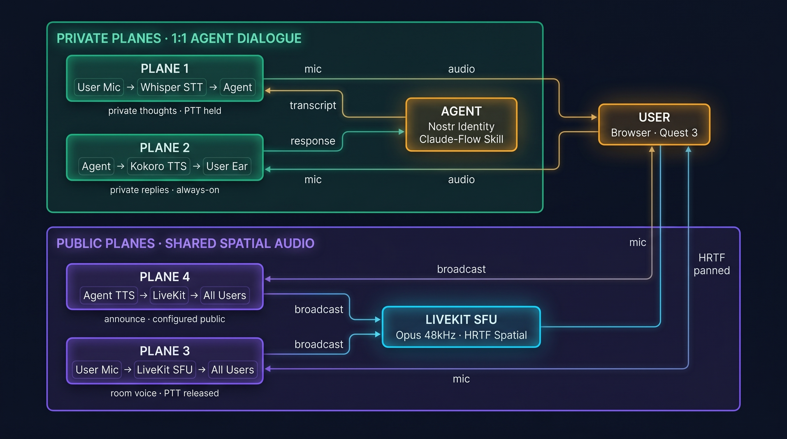

| Plane | Direction | Scope |
|:------|:----------|:------|
| 1 | User mic → turbo-whisper STT → Agent | Private (PTT held) |
| 2 | Agent → Kokoro TTS → User ear | Private |
| 3 | User mic → LiveKit SFU → All users | Public spatial |
| 4 | Agent TTS → LiveKit → All users | Public spatial |

Opus 48 kHz mono end-to-end. HRTF spatial panning from Vircadia entity positions. See [voice routing guide](docs/how-to/features/voice-routing.md).

</details>

<details>
<summary><strong>MCP tools — ontology + contributor studio surface</strong></summary>

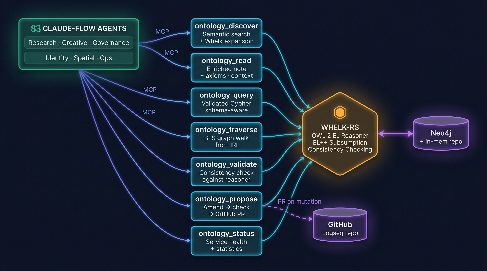

**Ontology:** `ontology_discover` · `ontology_read` · `ontology_query` · `ontology_traverse` · `ontology_propose` · `ontology_validate` · `ontology_status`. Every tool goes through Whelk for consistency. `ontology_propose` is the agent entry point to the Migration Event — it drafts the PR a broker will approve.

**Contributor Studio (Wave-1 Contributor Stratum implementation):** `skill_publish` · `skill_install` · `skill_eval_run` · `studio_context_assemble` · `sensei_nudge` · `share_intent_create` · `automation_schedule` · `inbox_ack` · `studio_run_skill`.

</details>

<details>
<summary><strong>Agent skill domains (83 core + pod-published)</strong></summary>

Creative production · Research & synthesis · Knowledge codification · Governance & audit · Workflow discovery · Financial intelligence · Spatial/immersive · Identity & trust · Development & quality · Infrastructure & DevOps · Document processing.

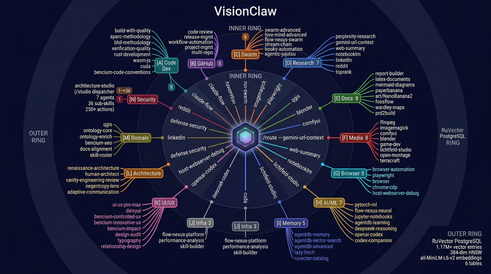

See the [agents catalog](docs/reference/agents-catalog.md) for the full core skill taxonomy. Contributor-published skills follow the Anthropic Skill-Creator v2 lifecycle and live in each user's Pod under `/public/skills/{slug}/` — discovered across the mesh via `publicTypeIndex.jsonld` (ADR-029) and promoted to org-wide via broker review.

</details>

---

## The platform in numbers

| Metric | Value | Conditions |
|:-------|-------:|:-----------|
| GPU physics speedup | 55× | vs single-threaded CPU |
| CUDA kernels | 92 | 6,585 LOC across 11 files |
| HNSW semantic search | 61 µs p50 | RuVector pgvector, 1.17M entries |
| WebSocket latency | 10 ms | Local network, V5 binary |
| Bandwidth reduction | 80% | Binary V5 vs JSON |
| Concurrent XR users | 250+ | Related immersive event |
| Frame size | 9-byte header + 36 bytes/node | V5 production |
| Physics convergence | ~600 frames (~10 s) | Typical graph at rest |
| DDD bounded contexts | 19 | Substrate · Mesh · Stratum |
| MCP tools | 16 | 7 ontology + 9 Contributor Studio |
| Agent skills | 83 core + unbounded pod-published | Claude-Flow hive-mind + Mesh Dojo |
| Skill lifecycle states | 7 | Draft → Personal → TeamShared → Benchmarked → MeshCandidate → Promoted → Retired |
| Share states | 3 | Private → Team → Mesh (monotonic) |
| Policy-Engine rules | 6 built-in + 8 contributor-stratum | BC17 |

---

## Enterprise roadmap

| Phase | Weeks | Deliverable | Exit criterion |
|:------|:------|:------------|:---------------|
| **0** Platform coherence | 1–6 | Node types, binary protocol, position flow, settings, ontology edges | No contradictions between story and behaviour |
| **1** Identity + Broker MVP | 7–14 | OIDC, roles, Broker Inbox, Decision Canvas | Broker can log in, review, decide on real cases |
| **2** Insight Ingestion + Migration | 15–24 | `WorkflowProposal` and `MigrationCandidate` lifecycles, GitHub connector, promotion | One shadow concept and one shadow workflow promoted live |
| **3** KPI + Governance | 25–32 | Six mesh KPIs, policy engine, exportable audit reports | Thesis KPIs measurable from production data |
| **4** Pilot | 33–44 | Consultancy pilot, connector hardening, success reporting | At least one paid pilot running |
| **5** Contributor Stratum | 45–56 | `/studio` MVP shell, Skill Dojo, share-to-Mesh funnel, automations, proactive Sensei | Contributor activation rate ≥ target; first contributor-to-mesh promotion lands via broker |

Key architecture decisions: [ADR-040](docs/adr/ADR-040-enterprise-identity-strategy.md) · [ADR-041](docs/adr/ADR-041-judgment-broker-workbench.md) · [ADR-042](docs/adr/ADR-042-workflow-proposal-object-model.md) · [ADR-043](docs/adr/ADR-043-kpi-lineage-model.md) · [ADR-044](docs/adr/ADR-044-connector-governance-privacy.md) · [ADR-045](docs/adr/ADR-045-policy-engine-approach.md) · [ADR-046](docs/adr/ADR-046-enterprise-ui-architecture.md) · [ADR-047](docs/adr/ADR-047-wasm-visualization-components.md) · [ADR-048](docs/adr/ADR-048-dual-tier-identity-model.md) · [ADR-049](docs/adr/ADR-049-insight-migration-broker-workflow.md) · [ADR-057](docs/adr/ADR-057-contributor-enablement-platform.md)

Sovereign-mesh ADRs (Wave 1–4): [ADR-028-ext](docs/adr/ADR-028-ext-nip98-optional-caller-aware.md) · [ADR-029](docs/adr/ADR-029-type-index-discovery.md) · [ADR-030](docs/adr/ADR-030-agent-memory-pods.md) · [ADR-030-ext](docs/adr/ADR-030-ext-github-creds-in-pod.md) · [ADR-050](docs/adr/ADR-050-pod-backed-kgnode-schema.md) · [ADR-051](docs/adr/ADR-051-visibility-transitions.md) · [ADR-052](docs/adr/ADR-052-pod-default-wac-public-container.md) · [ADR-053](docs/adr/ADR-053-solid-pod-rs-crate-extraction.md) · [ADR-054](docs/adr/ADR-054-urn-solid-and-solid-apps-alignment.md) · [ADR-055](docs/adr/ADR-055-sovereign-debt-payoff-sprint.md) · [ADR-056](docs/adr/ADR-056-jss-parity-migration.md)

---

## Technology stack

<details>
<summary><strong>Full technology breakdown</strong></summary>

| Layer | Technology | Detail |
|:------|:-----------|:-------|
| **Backend** | Rust 2021 · Actix-web | 427+ files · hexagonal CQRS · 9 ports · 12 adapters · 114+ handlers |
| **Frontend (desktop)** | React 19 · Three.js · R3F | TypeScript 5.9 · InstancedMesh · SAB zero-copy |
| **Frontend (XR)** | Babylon.js | Quest 3 foveated rendering · hand tracking |
| **Contributor Studio** | React 19 · Radix v3 · react-router-dom 7 | Multi-pane surface · NIP-07 auth flow-through · Zustand stores · ADR-026 tiered partner lane |
| **WASM** | Rust → wasm-pack | scene-effects · drawer-fx crates · mini-graph + ontology-neighbour thumbnails · zero-copy Float32Array |
| **Graph DB** | Neo4j 5.13 | Primary store · Cypher · bolt protocol |
| **Vector Memory** | RuVector · pgvector | 1.17M entries · HNSW 384-dim · MiniLM-L6-v2 |
| **GPU** | CUDA 13.1 · cudarc | 92 kernels · 6,585 LOC · PTX ISA auto-downgrade |
| **Ontology** | OWL 2 EL · Whelk-rs | EL++ subsumption · consistency checking |
| **XR** | WebXR · Babylon.js | Meta Quest 3 · hand tracking |
| **Multi-User** | Vircadia World Server | Avatar sync · HRTF spatial · collaborative editing |
| **Voice** | LiveKit · turbo-whisper · Kokoro | CUDA STT · TTS · Opus 48 kHz |
| **Identity** | Nostr NIP-07/NIP-98/NIP-26 | Browser ext signing · Schnorr HTTP auth · scoped delegation caps |
| **User Data** | Solid Pods · `solid-pod-rs` · JSS | Per-user sovereignty · WAC access control · JSON-LD |
| **Agents** | Claude-Flow · MCP · RAFT | 16 MCP tools · 83 core agent skills + Dojo-published skills · hive-mind consensus |
| **Build** | Vite 6 · Vitest · Playwright | Frontend build · unit/E2E tests |
| **Infra** | Docker Compose | 15+ services · multi-profile |

</details>

---

## Documentation

VisionClaw uses the [Diataxis](https://diataxis.fr/) framework — 144+ markdown files across four categories, 54+ with embedded Mermaid diagrams.

Entry points:

- [Full Documentation Hub](docs/README.md)
- [Contributor AI Support Stratum — sprint master](docs/design/2026-04-20-contributor-studio/00-master.md) · [PRD-003](docs/PRD-003-contributor-ai-support-stratum.md) · [ADR-057](docs/adr/ADR-057-contributor-enablement-platform.md) · [BC18/BC19 DDD](docs/explanation/ddd-contributor-enablement-context.md)
- [Insight Migration Loop — master design](docs/design/2026-04-18-insight-migration-loop/00-master.md) · [PRD](docs/prd-insight-migration-loop.md) · [explanation](docs/explanation/insight-migration-loop.md) · [tutorial](docs/tutorials/promoting-a-note-to-ontology.md)
- [System Overview](docs/explanation/system-overview.md) · [Architecture Self-Review](docs/architecture-self-review.md)
- [Deployment Guide](docs/how-to/deployment-guide.md) · [Quest 3 VR Setup](docs/how-to/xr-setup-quest3.md)
- [Agent Orchestration](docs/how-to/agent-orchestration.md) · [REST API](docs/reference/rest-api.md) · [WebSocket V5 Binary](docs/reference/websocket-binary.md)

---

## Contributing

See the [Contributing Guide](docs/CONTRIBUTING.md).

---

## License

[Mozilla Public License 2.0](LICENSE) — Use commercially, modify freely, share changes to MPL files.

---

<div align="center">

**VisionClaw is built by [DreamLab AI Consulting](https://www.dreamlab-ai.com).**

[Documentation](docs/README.md) · [Discussions](https://github.com/DreamLab-AI/VisionClaw/discussions) · [Issues](https://github.com/DreamLab-AI/VisionClaw/issues)

</div>
