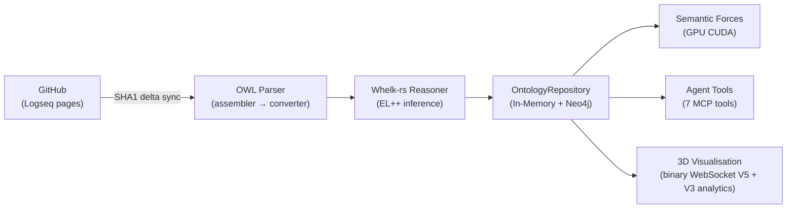
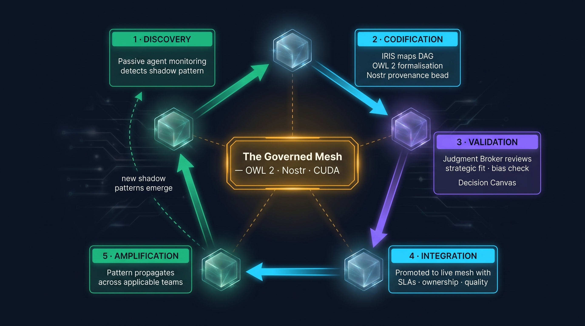

<div align="center">

# VisionClaw

### The governed agentic coordination platform.

[](https://github.com/DreamLab-AI/VisionClaw/actions)
[](https://github.com/DreamLab-AI/VisionClaw/releases)
[](LICENSE)
[](https://www.rust-lang.org/)
[](https://developer.nvidia.com/cuda-toolkit)
[](docs/README.md)

**Governed agentic coordination · Judgment Broker workbench · OWL 2 ontology governance · 92 CUDA kernels · Multi-user immersive XR · 83 agent skills · Enterprise identity (OIDC + Nostr) · Solid Pod sovereignty**

<br/>

https://github.com/user-attachments/assets/f45c92dc-4800-4b57-a6e2-178da6bb0a38

<br/>

[Why VisionClaw?](#your-best-people-are-already-running-the-future) · [Quick Start](#quick-start) · [Capabilities](#core-capabilities) · [Architecture](#the-three-layers-of-the-dynamic-mesh) · [Performance](#performance) · [Documentation](#documentation) · [Contributing](#contributing)

</div>

---

## Your Best People Are Already Running the Future

They just haven't told you yet.

More than half of generative AI users already use AI without telling their employers, and 78% of knowledge workers bring their own AI tools to work. Your workforce is already building shadow workflows, stitching together AI agents, automating procurement shortcuts, and inventing cross-functional pipelines that do not appear on any org chart. The question is no longer whether the coordination function is shifting. It is whether you will surface, govern, and compound what people have already discovered.

**The personal agent revolution has a governance problem.** As information routing becomes computationally cheap, the strategic challenge shifts from moving information around the organisation to deciding where AI can be trusted, where human judgment must remain active, and how shared meaning is maintained across teams and agents. Tools like Claude Code have shown that autonomous AI agents are powerful, popular, and ready to act. They've also shown what happens when agents operate without shared semantics, formal reasoning, or organisational guardrails: unauthorised actions, prompt injection attacks, and enterprises deploying security scanners just to detect rogue agent instances on their own networks.

VisionClaw takes the opposite approach. **Governance isn't an inhibitor, it's an accelerant** — a way to turn shadow workflows into auditable, reusable organisational capability.

---

## What Is VisionClaw?

VisionClaw is an open-source platform for building governed agentic organisations: a coordination control plane where autonomous AI agents, human judgment brokers, and institutional knowledge work together through a shared semantic layer, with every decision auditable and every workflow governed by policy.

The platform ingests knowledge from Logseq notebooks via GitHub, reasons over it with an OWL 2 EL inference engine (Whelk-rs), renders the result as an interactive 3D graph where nodes attract or repel based on their semantic relationships, and exposes that graph to AI agents through 7 Model Context Protocol tools. A **Judgment Broker Workbench** surfaces edge cases, workflow proposals, and trust drift alerts for human review. An **Insight Ingestion Loop** discovers shadow workflows and codifies them into governed, reusable patterns. **Four organisational KPIs** (Mesh Velocity, Augmentation Ratio, Trust Variance, HITL Precision) measure whether AI adoption is compounding or fragmenting. Users can collaborate in the same space through multi-user XR presence, spatial voice, and immersive graph exploration.

VisionClaw is operational at [DreamLab residential training lab](https://www.dreamlab-ai.com), supporting a creative technology team, and informed by collaboration with a major UK creative studio and the University of Salford.

> **Positioning note** — VisionClaw is best understood as a working technical substrate and an existence proof under favourable conditions: a live OWL 2 + CUDA + WebXR + Nostr + agent orchestration stack in a creative technology context. It demonstrates how ontology-grounded orchestration and embedded governance can work in practice at small-to-medium scale; it does not, by itself, prove universal fit across every industry, workforce, or regulatory setting.

<details>
<summary><strong>What VisionClaw currently demonstrates</strong></summary>

- Ontology-grounded agent orchestration with shared semantics
- GPU-accelerated knowledge graph visualisation and analytics at small-to-medium scale
- Dual-stack identity: Nostr NIP-98 + OIDC configuration for enterprise SSO
- Judgment Broker Workbench with Decision Canvas, case CRUD, and timeline (Neo4j-persisted)
- Workflow proposal lifecycle: create → review → approve → promote to reusable pattern
- KPI computation engine: Mesh Velocity, Augmentation Ratio, Trust Variance, HITL Precision with real trend data
- Policy engine: 6 built-in rules with server-side evaluation, TOML-configurable, test bench
- Connector management with GitHub connector setup, PII redaction, signal feed
- RBAC: 4 enterprise roles (Broker, Admin, Auditor, Contributor) with role hierarchy middleware
- 91 frontend tests, 60 backend tests, WCAG AA accessibility compliance
- 30 design system components including animated Canvas2D sparklines

**What remains open:**
- Full OIDC token exchange flow (configuration types ready, token verification pending)
- Validation in regulated industries (pharma, finance pilots planned)
- WebSocket push for real-time broker inbox (currently polls every 15s)
- Multi-provider orchestration beyond Claude-Flow

</details>


*GPU-accelerated force-directed graph — 934 nodes responding to spring, repulsion, and ontology-driven semantic forces in real time*


*Chloe Nevitt interacting with Prof Rob Aspin's precursor to VisionClaw in the*
[Octave Multimodal Lab  University of Salford 2017](https://narrativegoldmine.com/notes/#/page/octave%20multi%20model%20laboratory)
---

## Core Capabilities

<table>
<tr>
<td width="50%">

**🧠 Semantic Governance**
- OWL 2 EL reasoning via Whelk-rs (EL++ inference)
- `subClassOf` → attraction, `disjointWith` → repulsion in GPU physics
- Every ontology mutation creates a GitHub PR — human veto before commit
- Content-addressed immutable provenance beads (Nostr NIP-09)
- 17 DDD bounded contexts with CQRS — 114 command/query handlers
- Policy engine with TOML-configurable rules (Allow/Deny/Escalate)

</td>
<td width="50%">

**⚡ GPU-Accelerated Physics**
- 92 CUDA kernel functions across 11 files (6,585 LOC)
- 55× speedup vs single-threaded CPU physics
- Force-directed layout + semantic forces + stress majorisation
- On-demand: K-Means clustering, Louvain communities, LOF anomaly, PageRank
- Periodic full broadcast every 300 iterations — no stale-position bugs

</td>
</tr>
<tr>
<td width="50%">

**🤖 83 Agent Skills**
- Claude-Flow DAG orchestration with RAFT consensus hive-mind
- 7 MCP Ontology Tools (discover, read, query, traverse, propose, validate, status)
- Nostr-signed agent identities via NIP-98 auth
- Ontology-grounded skill decomposition rather than keyword routing
- RuVector PostgreSQL memory (pgvector + HNSW, 384-dim MiniLM-L6-v2)

</td>
<td width="50%">

**🌐 Multi-User Immersive XR**
- Babylon.js WebXR for immersive/VR mode — Meta Quest 3 optimised
- React Three Fiber for desktop graph (dual-renderer architecture)
- Vircadia World Server: avatar sync, HRTF spatial audio, collaborative editing
- WebGPU with Three Shading Language (TSL) + WebGL fallback
- Foveated rendering, DPR capping, dynamic resolution scaling on Quest 3

</td>
</tr>
<tr>
<td width="50%">

**🔐 Dual-Stack Identity**
- Enterprise: OIDC/SAML via Entra ID, Okta, Google Workspace (ADR-040)
- Provenance: Nostr NIP-98 signed events — every action cryptographically attributable
- Server-side ephemeral keypair delegation (OIDC session → secp256k1)
- Solid Pod user data sovereignty — each user owns their own Pod
- 4 enterprise roles: Broker, Admin, Auditor, Contributor

</td>
<td width="50%">

**🔊 Voice Routing (4-Plane Architecture)**
- LiveKit SFU + turbo-whisper STT (CUDA) + Kokoro TTS
- Plane 1: User mic → whisper → private agent channel
- Plane 2: Agent TTS → user ear (private)
- Planes 3–4: Public spatial audio via LiveKit + Vircadia HRTF
- Opus 48kHz mono end-to-end

</td>
</tr>
</table>

---

## Quick Start

```bash
git clone https://github.com/DreamLab-AI/VisionClaw.git
cd VisionClaw && cp .env.example .env
docker-compose --profile dev up -d
```

| Service | URL | Description |
|:--------|:----|:------------|
| Frontend | http://localhost:3001 | 3D knowledge graph interface (via Nginx) |
| API (direct) | http://localhost:4000/api | REST + WebSocket endpoints (Rust/Actix-web) |
| Neo4j Browser | http://localhost:7474 | Graph database explorer |
| JSS Solid | http://localhost:3030 | Solid Pod server |
| Vircadia | ws://localhost:3020/world/ws | Multi-user WebSocket endpoint |

<details>
<summary><strong>Enable voice routing (LiveKit + whisper + TTS)</strong></summary>

```bash
docker-compose -f docker-compose.yml -f docker-compose.voice.yml --profile dev up -d
```

Adds LiveKit SFU (port 7880), turbo-whisper STT (CUDA), and Kokoro TTS. Requires GPU for real-time transcription.

</details>

<details>
<summary><strong>Enable multi-user XR (Vircadia World Server)</strong></summary>

```bash
docker-compose -f docker-compose.yml -f docker-compose.vircadia.yml --profile dev up -d
```

Adds Vircadia World Server with avatar sync, HRTF spatial audio, and collaborative graph editing.

</details>

<details>
<summary><strong>Native Rust + CUDA build</strong></summary>

```bash
curl --proto '=https' --tlsv1.2 -sSf https://sh.rustup.rs | sh
git clone https://github.com/DreamLab-AI/VisionClaw.git
cd VisionClaw && cp .env.example .env
cargo build --release --features gpu
cd client && npm install && npm run build && cd ..
./target/release/webxr
```

Requires CUDA 13.1 toolkit. On CachyOS, set `CUDA_ROOT=/opt/cuda`. See [Deployment Guide](docs/how-to/deployment-guide.md) for full GPU setup.

</details>

---

## The Three Layers of the Dynamic Mesh

VisionClaw implements a three-layer agentic mesh. Insights bubble up from frontline discovery, orchestrated through formal semantic pipelines, governed by declarative policy — with humans as the irreplaceable judgment layer at the top.


<details>
<summary><strong>Diagram source (Mermaid)</strong></summary>

See [`docs/diagrams/src/01-three-layer-mesh.mmd`](./docs/diagrams/src/01-three-layer-mesh.mmd) for the diagram-as-code. The rendered image above was generated via Mermaid → Nano Banana Pro with the VisionClaw aesthetic prompt in [`docs/diagrams/src/aesthetic-prompt.md`](./docs/diagrams/src/aesthetic-prompt.md).

</details>

---

### Layer 1 — The Discovery Engine

The discovery layer ingests, structures, and renders organisational knowledge as a navigable, interactive 3D space.

**Ontology Pipeline** — VisionClaw syncs Logseq markdown from GitHub, parses OWL 2 EL axioms embedded in `### OntologyBlock` sections, runs Whelk-rs inference for subsumption and consistency checking, and stores results in both Neo4j (persistent) and an in-memory `OntologyRepository` (fast access). GPU semantic forces use the ontology to drive layout physics — `subClassOf` creates attraction, `disjointWith` creates repulsion.



Explore a live ontology dataset at **[narrativegoldmine.com](https://www.narrativegoldmine.com)** — a 2D interactive graph built on the same ontology data VisionClaw renders in 3D.

**Dual-Renderer 3D Visualisation** — React Three Fiber (Three.js) powers the desktop graph view with InstancedMesh, SharedArrayBuffer zero-copy positions, and custom TSL/WebGL materials. Babylon.js powers the immersive XR mode — the two renderers coexist but never overlap, with R3F suspended when entering XR.

**RuVector AI Memory Substrate** — 1.17M+ agent memory entries in PostgreSQL + pgvector with HNSW indexing. MiniLM-L6-v2 generates 384-dim embeddings at ingestion. Semantic search at 61µs p50 via HNSW (vs ~5ms brute-force). All agent memory flows through MCP tools — raw SQL bypasses the embedding pipeline.

<details>
<summary><strong>Node geometry and material system</strong></summary>

| Node Type | Geometry | Material | ID Encoding |
|:---------|:---------|:---------|:------------|
| Knowledge (public pages) | Icosahedron r=0.5 | `GemNodeMaterial` — analytics-driven colour | Bit 30 set (`0x40000000`) |
| Ontology | Sphere r=0.5 | `CrystalOrbMaterial` — depth-pulsing cosmic spectrum | Bits 26-28 set (`0x1C000000`) |
| Agent | Capsule r=0.3 h=0.6 | `AgentCapsuleMaterial` — bioluminescent heartbeat | Bit 31 set (`0x80000000`) |
| Linked pages | Icosahedron r=0.35 | `GemNodeMaterial` | No flag bits |

Agent visual states: `#10b981` (idle) · `#fbbf24` (spawning/active) · `#ef4444` (error) · `#f97316` (busy). Animation: breathing pulse (active), error flicker (failed), slow pulse (idle).

</details>

<details>
<summary><strong>Voice routing (4-plane architecture)</strong></summary>


| Plane | Direction | Scope | Trigger |
|:------|:----------|:------|:--------|
| 1 | User mic → turbo-whisper STT → Agent | Private | PTT held |
| 2 | Agent → Kokoro TTS → User ear | Private | Agent responds |
| 3 | User mic → LiveKit SFU → All users | Public (spatial) | PTT released |
| 4 | Agent TTS → LiveKit → All users | Public (spatial) | Agent configured public |

Opus 48kHz mono end-to-end. HRTF spatial panning from Vircadia entity positions.

</details>

<details>
<summary><strong>Logseq ontology input (source data)</strong></summary>

<br/>

| Ontology metadata | Graph structure |
|:-:|:-:|
|  |  |
| OWL entity page with category, hierarchy, and source metadata | Graph view showing semantic clusters |


*Dense knowledge graph in Logseq — the raw ontology VisionClaw ingests, reasons over, and renders in 3D*

</details>

---

### Layer 2 — The Orchestration Layer

The orchestration layer is where agents reason, coordinate, and act — always against the shared semantic substrate of the OWL 2 ontology.

**83 Specialist Agent Skills** — Claude-Flow coordination with RAFT consensus hive-mind and 83 skill modules spanning creative production, research, knowledge codification, governance, workflow discovery, financial intelligence, spatial/immersive, and identity/trust domains. Agents are assigned cryptographic Nostr identities and appear as physics nodes in the 3D graph — their status (idle, working, error) drives visual state changes in real time via the Agent-Physics Bridge.

**Why OWL 2 Is the Secret Weapon** — Most agentic systems fail at scale because they lack a shared language. In VisionClaw, agents reason against a common OWL 2 ontology. The same concept of "deliverable" means the same thing to a Creative Production agent and a Governance agent. Agent skill routing isn't keyword matching — it's ontological subsumption. The orchestration layer knows that a "risk assessment" is a sub-task of "governance review", and routes accordingly.

**7 Ontology Agent Tools (MCP)** — Read/write access to the knowledge graph via Model Context Protocol. Every tool flows through Whelk-rs for consistency and reasoning, with `ontology_propose` gating structural mutations through a GitHub PR for human review.


| Tool | Purpose |
|:-----|:--------|
| `ontology_discover` | Semantic keyword search with Whelk inference expansion |
| `ontology_read` | Enriched note with axioms, relationships, schema context |
| `ontology_query` | Validated Cypher execution with schema-aware label checking |
| `ontology_traverse` | BFS graph traversal from starting IRI |
| `ontology_propose` | Create/amend notes → consistency check → GitHub PR |
| `ontology_validate` | Axiom consistency check against Whelk reasoner |
| `ontology_status` | Service health and statistics |

**GPU-Accelerated Compute** — 92 CUDA kernel functions across 11 kernel files (6,585 LOC) run server-authoritative graph layout and analytics. The physics pipeline (force-directed layout, semantic forces, ontology constraints, stress majorisation) runs at 60 Hz with a periodic full broadcast every 300 iterations to keep late-connecting clients synchronised. The analytics pipeline (K-Means clustering, Louvain community detection, LOF anomaly detection, PageRank) runs on-demand via API, with results streamed in the V3 binary protocol's analytics fields.

| Metric | Result |
|:-------|-------:|
| CUDA kernel functions | 92 across 11 files |
| GPU vs CPU speedup | 55× |
| V5 protocol size | 9-byte header + 36 bytes/node |
| V3 analytics fields | +12 bytes/node (cluster_id, anomaly_score, community_id, page_rank) |
| WebSocket latency | 10ms |
| Binary vs JSON bandwidth | 80% reduction |

<details>
<summary><strong>Binary WebSocket Protocol (V5 production)</strong></summary>

High-frequency position updates use a compact binary protocol instead of JSON, achieving 80% bandwidth reduction.

**V5 Production (9-byte header + 36 bytes/node)** — current wire format:

| Bytes | Field | Type | Description |
|:------|:------|:-----|:------------|
| 0 | Version | u8 | Value `5` |
| 1–8 | Broadcast sequence | u64 LE | Monotonic counter per broadcast |

Per-node payload (V2/V3 layout following the 9-byte header):

| Bytes (per node) | Field | Type | Description |
|:-----------------|:------|:-----|:------------|
| 0–3 | Node ID | u32 | Flag bits 26-31 encode node type |
| 4–15 | Position (X/Y/Z) | f32×3 | World-space position |
| 16–27 | Velocity (X/Y/Z) | f32×3 | Physics velocity |
| 28–31 | SSSP distance | f32 | Shortest-path from source |
| 32–35 | Timestamp | u32 | ms since session start |

**V3 Analytics (48 bytes/node per frame)** — extends per-node payload with `cluster_id` (u16), `anomaly_score` (f32), `community_id` (u16), `page_rank` (f32) at bytes 36–47.

**V4 Delta (16 bytes/changed node)** — experimental, not production-ready. See [Known Issues](docs/KNOWN_ISSUES.md) → WS-001.

**Periodic full broadcast**: forced every 300 physics iterations regardless of convergence state, ensuring late-connecting clients synchronise within ~5 seconds. See [websocket-binary.md](docs/reference/websocket-binary.md) for the complete V5 specification including client parsing examples.

</details>

<details>
<summary><strong>Agent skill domains (83 skills)</strong></summary>

**Creative Production** — Script, storyboard, shot-list, grade & publish workflows. ComfyUI orchestration for image, video, and 3D asset generation via containerised API middleware.

**Research & Synthesis** — Multi-source ingestion, GraphRAG, semantic clustering, Perplexity integration.

**Knowledge Codification** — Tacit-to-explicit extraction; OWL concept mapping; Logseq-formatted output.

**Governance & Audit** — Bias detection, provenance chains (content-addressed Nostr beads), declarative policy enforcement.

**Workflow Discovery** — Shadow workflow detection; DAG proposal & validation against ontology.

**Financial Intelligence** — R&D tax modelling, grant pipeline, ROI attribution.

**Spatial & Immersive** — XR scene graph, light field, WebXR rendering agent, Blender MCP, ComfyUI SAM3D.

**Identity & Trust** — Nostr identity operations, delegation patterns, and agent communications.

**Development & Quality** — Rust development, pair programming, agentic QE fleet (111+ sub-agents), GitHub code review, performance analysis.

**Infrastructure & DevOps** — Docker management, Kubernetes ops, Linux admin, network analysis, monitoring.

**Document Processing** — LaTeX, DOCX, XLSX, PPTX, PDF generation and manipulation.

</details>

---

### Layer 3 — Declarative Governance

The governance layer is what separates VisionClaw from every "move fast and break things" agent framework. Policies are code. Bias thresholds, access controls, and audit trails are embedded into every DAG transition — not bolted on afterwards.

**The Judgment Broker** — Freed from reporting, forecasting, and coordination (all automated), the Judgment Broker focuses on three irreplaceable human capacities:

- **Strategic direction** — Only humans decide what the organisation should be doing next year, and whether the mesh is pointed at it.
- **Ethical adjudication** — Bias, fairness, and consequence live in human judgment. No agent is the final word on edge cases.
- **Relational intelligence** — Trust, culture, and coalition-building are the lubrication layer no algorithm can replicate.

**HITL by Design** — The Human-in-the-Loop is an architectural feature. Agents know their authority boundary and surface exceptions cleanly. Every ontology mutation passes through a GitHub pull request, giving human reviewers full visibility and veto over structural changes before commit.

**Ontological Provenance** — Every agent decision traces back through the OWL 2 knowledge graph. Auditors can traverse the full reasoning chain agent-by-agent, task-by-task. Every action is recorded as an immutable bead — content-addressed, cryptographically verifiable (Nostr NIP-33) — with a deterministic lifecycle state machine ([ADR-034](docs/adr/ADR-034-needle-bead-provenance.md)), exhaustive outcome classification, retry with exponential backoff, and structured learning capture. Inspired by [NEEDLE](https://github.com/jedarden/NEEDLE)'s trait-based architecture. See the [Bead Provenance PRD](docs/prd-bead-provenance-upgrade.md) and [DDD Bounded Context](docs/ddd-bead-provenance-context.md).

**Cryptographic Agent Identity** — VisionClaw uses Nostr-signed agent identities and NIP-98 request signing so agent actions are attributable without relying on passwords. Delegation and trust scoping can be layered on top of that identity model where required, while keeping the governance surface explicit and auditable.

<details>
<summary><strong>Mesh KPIs — measuring what matters in a governed agentic organisation</strong></summary>

| KPI | Formula | Target | What It Measures |
|:----|:--------|:-------|:-----------------|
| **Mesh Velocity** | Δt(insight → codified workflow) | < 48h | How fast a discovered shortcut becomes a sanctioned, reusable DAG |
| **Augmentation Ratio** | Cognitive load offloaded ÷ Total cognitive load | > 65% | Percentage of decision-making handled by agents without human escalation |
| **Trust Variance** | σ(Agent Decision Quality) over 30-day window | < 0.12σ | Drift or bias monitoring in the automated task layer |
| **HITL Precision** | Correct escalations ÷ Total escalations | > 90% | Are the edge cases the mesh flags actually requiring human intervention? |

</details>

---

## The Insight Ingestion Loop

How shadow workflows become sanctioned organisational intelligence — a five-stage feedback loop orchestrated by the governed mesh:



<details>
<summary><strong>Diagram source (Mermaid)</strong></summary>

See [`docs/diagrams/src/02-insight-ingestion-cycle.mmd`](./docs/diagrams/src/02-insight-ingestion-cycle.mmd).

</details>

---

## Enterprise Roadmap

| Phase | Timeline | Deliverables | Exit Criteria |
|:------|:---------|:-------------|:--------------|
| **0: Platform Coherence** | Weeks 1-6 | Node type consolidation, binary protocol, position flow, settings, ontology edge gap | No major contradictions between platform story and behaviour |
| **1: Identity + Broker MVP** | Weeks 7-14 | OIDC support, role model, Broker Inbox, Decision Canvas | A broker can log in, review, and decide on real cases |
| **2: Insight Ingestion Loop** | Weeks 15-24 | Insight objects, WorkflowProposal lifecycle, GitHub connector, workflow promotion | One discovered pattern becomes an approved live workflow |
| **3: KPI + Governance** | Weeks 25-32 | Four mesh KPIs, policy engine, exportable audit reports | Thesis KPIs measurable from production data |
| **4: Pilot Release** | Weeks 33-44 | Regulated pilot package, connector hardening, success reporting | At least one paid or design-partner pilot running |

**Architecture decisions**: [ADR-040](docs/adr/ADR-040-enterprise-identity-strategy.md) · [ADR-041](docs/adr/ADR-041-judgment-broker-workbench.md) · [ADR-042](docs/adr/ADR-042-workflow-proposal-object-model.md) · [ADR-043](docs/adr/ADR-043-kpi-lineage-model.md) · [ADR-044](docs/adr/ADR-044-connector-governance-privacy.md) · [ADR-045](docs/adr/ADR-045-policy-engine-approach.md)

**DDD model**: [Enterprise Bounded Contexts (BC11-BC17)](docs/explanation/ddd-enterprise-contexts.md)

**PRD**: [Enterprise PRD](presentation/enterprise-prd.md) · [Architecture Self-Review](docs/architecture-self-review.md)

---

## Architecture


<details>
<summary><strong>Diagram source (Mermaid)</strong></summary>

See [`docs/diagrams/src/05-architecture-hexagonal.mmd`](./docs/diagrams/src/05-architecture-hexagonal.mmd).

</details>

<details>
<summary><strong>Hexagonal architecture (9 ports · 12 adapters · 114 CQRS handlers)</strong></summary>

VisionClaw follows strict hexagonal architecture. Business logic in `src/services/` depends only on port traits in `src/ports/`. Concrete implementations live in `src/adapters/`, swapped at startup via dependency injection. All mutations flow through one of 114 command handlers; all reads through query handlers. No direct database access from handlers.

```mermaid
flowchart LR
    subgraph Ports["src/ports/ (Traits)"]
        GP[GraphRepository]
        OR[OntologyRepository]
        IE[InferenceEngine]
        GPA[GpuPhysicsAdapter]
        GSA[GpuSemanticAnalyzer]
        SR[SettingsRepository]
        SP[SolidPodRepository]
        NR[NostrRelay]
        VR[VectorRepository]
    end

    subgraph Adapters["src/adapters/ (Implementations)"]
        Neo4jGraph[Neo4jGraphRepository]
        Neo4jOntology[Neo4jOntologyRepository]
        Whelk[WhelkInferenceEngine]
        CudaPhysics[PhysicsOrchestratorAdapter]
        JSSPod[JssSolidPodAdapter]
        RuVectorAdapter[RuVectorAdapter]
    end

    subgraph Services["src/services/ (Business Logic)"]
        OQS[OntologyQueryService]
        OMS[OntologyMutationService]
        GPS[GitHubPRService]
        OPS[OntologyPipelineService]
    end

    Services --> Ports
    Adapters -.->|implements| Ports

    style Ports fill:#e8f5e9,stroke:#4caf50
    style Adapters fill:#fff3e0,stroke:#ff9800
    style Services fill:#e1f5ff,stroke:#0288d1
```



| Port Trait | Adapter | Purpose |
|:-----------|:--------|:--------|
| `GraphRepository` | `ActorGraphRepository` | Graph CRUD via actor messages |
| `OntologyRepository` | `Neo4jOntologyRepository` | OWL class/axiom storage |
| `InferenceEngine` | `WhelkInferenceEngine` | OWL 2 EL reasoning |
| `GpuPhysicsAdapter` | `PhysicsOrchestratorAdapter` | CUDA force simulation |
| `GpuSemanticAnalyzer` | `GpuSemanticAnalyzerAdapter` | GPU semantic forces |
| `SolidPodRepository` | `JssSolidPodAdapter` | User Pod CRUD via JSS |
| `VectorRepository` | `RuVectorAdapter` | pgvector HNSW semantic search |

</details>

<details>
<summary><strong>21-Actor supervision tree</strong></summary>

The backend uses Actix actors for supervised concurrency. GPU actors form a hierarchy: `GraphServiceSupervisor` → `PhysicsOrchestratorActor` → `ForceComputeActor`. All actors restart automatically on failure per their supervision strategy.

**GPU Physics Actors:**

| Actor | Purpose |
|:------|:--------|
| `ForceComputeActor` | Core force-directed layout (CUDA) — 60Hz |
| `StressMajorizationActor` | Stress majorisation algorithm |
| `ClusteringActor` | K-Means + Louvain community detection (GPU) |
| `PageRankActor` | GPU PageRank centrality computation |
| `ShortestPathActor` | Delta-stepping SSSP (GPU) |
| `ConnectedComponentsActor` | Label propagation component detection (GPU) |
| `AnomalyDetectionActor` | LOF / Z-score anomaly detection (GPU) |
| `SemanticForcesActor` | OWL-driven attraction/repulsion constraints |
| `ConstraintActor` | Layout constraint solving |
| `AnalyticsSupervisor` | GPU analytics orchestration |
| `BroadcastOptimizerActor` | Delta-filter + periodic full-broadcast (300 iters) |

**Service Actors:**

| Actor | Purpose |
|:------|:--------|
| `GraphStateActor` | Canonical graph state — single source of truth |
| `OntologyActor` | OWL class management and Whelk bridge |
| `ClientCoordinatorActor` | Per-client session management + WebSocket |
| `PhysicsOrchestratorActor` | Delegates to GPU actors, manages convergence |
| `SemanticProcessorActor` | NLP query processing |
| `VoiceCommandsActor` | Voice-to-action routing |
| `TaskOrchestratorActor` | Background task scheduling |
| `GitHubSyncActor` | Incremental GitHub sync (SHA1 delta) |
| `OntologyPipelineActor` | Assembler → converter → Whelk pipeline |
| `GraphServiceSupervisor` | Top-level GPU supervision and restart |

</details>

<details>
<summary><strong>DDD bounded contexts (17 contexts)</strong></summary>

VisionClaw implements Domain-Driven Design with 17 bounded contexts across three domain rings:

**Core Domain:** Knowledge Graph · Ontology Governance · Physics Simulation · **Judgment Broker (BC11)** · **Workflow Lifecycle (BC12)** · **Insight Discovery (BC13)**

**Supporting Domain:** Authentication (Nostr NIP-98) · **Enterprise Identity (BC14)** · Agent Orchestration · Semantic Analysis · **Policy Engine (BC17)**

**Generic Domain:** [Bead Provenance](docs/ddd-bead-provenance-context.md) ([ADR-034](docs/adr/ADR-034-needle-bead-provenance.md)) · Configuration · **KPI Observability (BC15)** · **Connector Ingestion (BC16)**

Each context has its own aggregate roots, domain events, and anti-corruption layers. Cross-context communication uses domain events, never direct model sharing.

- [Core Bounded Contexts (BC1-BC10)](docs/explanation/ddd-bounded-contexts.md)
- [Enterprise Bounded Contexts (BC11-BC17)](docs/explanation/ddd-enterprise-contexts.md)

</details>

---

## Operational Context & Related Validation

| Deployment | Context | Scale |
|:-----------|:--------|:------|
| **DreamLab Creative Hub** | Live creative-technology deployment context | ~998 knowledge graph nodes, daily ontology mutations |
| **University of Salford** | Research collaboration exploring semantic force-directed layout for academic knowledge graphs | Multi-institution ontology |
| **THG World Record** | Related large-scale immersive data visualisation event — see [THG project](https://github.com/DreamLab-AI/THG-world-record-attempt) | 250+ concurrent XR users |

---

## Performance

| Metric | Result | Conditions |
|:-------|-------:|:-----------|
| GPU physics speedup | 55× | vs single-threaded CPU |
| HNSW semantic search | 61µs p50 | RuVector pgvector, 1.17M entries |
| WebSocket latency | 10ms | Local network, V5 binary |
| Bandwidth reduction | 80% | Binary V5 vs JSON |
| Concurrent XR users | 250+ | Related immersive data visualisation event |
| Position update size | 9-byte header + 36 bytes/node (V5) · +12 bytes analytics (V3) | Per frame |
| CUDA kernels | 92 | 6,585 LOC across 11 files |
| Agent concurrency | 50+ | Via actor supervisor tree |
| Physics convergence | ~600 frames (~10s) | Typical graph at rest |

---

## Technology Stack

<details>
<summary><strong>Full technology breakdown</strong></summary>

| Layer | Technology | Detail |
|:------|:-----------|:-------|
| **Backend** | Rust 2021 · Actix-web | 427 files, 175K LOC · hexagonal CQRS · 9 ports · 12 adapters · 114 handlers |
| **Frontend (desktop)** | React 19 · Three.js 0.182 · R3F | 370 files, 96K LOC · TypeScript 5.9 · InstancedMesh · SAB zero-copy |
| **Frontend (XR)** | Babylon.js | Immersive/VR mode — Quest 3 foveated rendering, hand tracking |
| **WASM** | Rust → wasm-pack | `scene-effects` crate: zero-copy `Float32Array` view over `WebAssembly.Memory` |
| **Graph DB** | Neo4j 5.13 | Primary store · Cypher queries · bolt protocol |
| **Vector Memory** | RuVector PostgreSQL · pgvector | 1.17M+ entries · HNSW 384-dim · MiniLM-L6-v2 embeddings · 61µs search |
| **GPU** | CUDA 13.1 · cudarc | 92 kernel functions · 6,585 LOC · PTX ISA auto-downgrade in build.rs |
| **Ontology** | OWL 2 EL · Whelk-rs | EL++ subsumption · consistency checking · 20 source files |
| **XR** | WebXR · Babylon.js | Meta Quest 3 · hand tracking · foveated rendering · `?force=quest3` |
| **Multi-User** | Vircadia World Server | Avatar sync · spatial HRTF audio · entity CRUD · collaborative editing |
| **Voice** | LiveKit SFU · turbo-whisper · Kokoro | CUDA STT · TTS · Opus 48kHz · 4-plane routing |
| **Identity** | Nostr NIP-07/NIP-98 | Browser extension signing · cryptographic HTTP auth · scoped delegation patterns |
| **User Data** | Solid Pods · JSS sidecar | Per-user data sovereignty · WAC access control · JSON-LD |
| **Agents** | Claude-Flow · MCP · RAFT | 83 skills · 7 ontology tools · hive-mind consensus |
| **AI/ML** | GraphRAG · RAGFlow | Knowledge retrieval · semantic inference |
| **Build** | Vite 6 · Vitest · Playwright | Frontend build · unit tests · E2E tests |
| **Infra** | Docker Compose | 15+ services · multi-profile (dev/prod/voice/xr) |
| **CI** | GitHub Actions | Build · test · docs quality · ontology federation |

</details>

---

## Documentation

VisionClaw uses the [Diataxis](https://diataxis.fr/) framework — 144 markdown files across four categories, 54 with embedded Mermaid diagrams:

| Category | Path | Content |
|:---------|:-----|:--------|
| **Tutorials** | [`docs/tutorials/`](docs/tutorials/) | First graph, Neo4j basics, platform overview |
| **How-To Guides** | [`docs/how-to/`](docs/how-to/) | Deployment, agents, XR setup, performance profiling, features, operations |
| **Explanation** | [`docs/explanation/`](docs/explanation/) | Architecture, DDD, ontology, GPU physics, XR, security, Solid/Nostr, deployment topology |
| **Reference** | [`docs/reference/`](docs/reference/) | REST API, WebSocket protocol, Neo4j schema, agents catalog, error codes |

Key entry points:

- [Full Documentation Hub](docs/README.md) — all 106 docs indexed
- [Known Issues](docs/KNOWN_ISSUES.md) — active P1/P2 bugs (read before debugging)
- [Architecture Overview](docs/explanation/system-overview.md)
- [Deployment Guide](docs/how-to/deployment-guide.md)
- [Deployment Topology](docs/explanation/deployment-topology.md) — 15-service map, network architecture, dependency chain
- [Quest 3 VR Setup](docs/how-to/xr-setup-quest3.md)
- [Agent Orchestration](docs/how-to/agent-orchestration.md)
- [REST API Reference](docs/reference/rest-api.md)
- [WebSocket Binary Protocol](docs/reference/websocket-binary.md)
- [Performance Profiling](docs/how-to/performance-profiling.md)

---

## Development

### Prerequisites

| Tool | Version | Purpose |
|:-----|:--------|:--------|
| Rust | 2021 edition | Backend |
| Node.js | 20+ | Frontend |
| Docker + Docker Compose | — | Services |
| CUDA Toolkit | 13.1 | GPU acceleration (optional) |

### Build and Test

```bash
# Backend
cargo build --release
cargo test

# Frontend
cd client && npm install && npm run build && npm test

# Integration tests
cargo test --test ontology_agent_integration_test
```

### System Requirements

| Tier | CPU | RAM | GPU | Use Case |
|:-----|:----|:----|:----|:---------|
| **Minimum** | 4-core 2.5GHz | 8 GB | Integrated | Development · < 10K nodes |
| **Recommended** | 8-core 3.0GHz | 16 GB | GTX 1060 / RX 580 | Production · < 50K nodes |
| **Enterprise** | 16+ cores | 32 GB+ | RTX 4080+ (16GB VRAM) | Large graphs · multi-user XR |

**Platform support:** Linux (full GPU) · macOS (CPU-only) · Windows (WSL2) · Meta Quest 3 (Beta)

<details>
<summary><strong>Key environment variables</strong></summary>

Copy `.env.example` and configure:

| Variable | Description |
|:---------|:------------|
| `NEO4J_URI` | Neo4j bolt connection (default: `bolt://localhost:7687`) |
| `NEO4J_USER` / `NEO4J_PASSWORD` | Neo4j credentials |
| `RUVECTOR_PG_CONNINFO` | RuVector PostgreSQL connection string |
| `NOSTR_PRIVATE_KEY` | Server-side Nostr signing key (hex) |
| `GITHUB_TOKEN` | GitHub token for ontology PR creation |
| `GITHUB_OWNER` / `GITHUB_REPO` / `GITHUB_BASE_PATH` | Logseq source repository |
| `VITE_VIRCADIA_ENABLED` | Enable Vircadia multi-user (`true`/`false`) |
| `VITE_VIRCADIA_SERVER_URL` | Vircadia World Server WebSocket URL |
| `LIVEKIT_URL` / `LIVEKIT_API_KEY` / `LIVEKIT_API_SECRET` | Voice routing |
| `VITE_QUEST3_ENABLE_HAND_TRACKING` | Enable Quest 3 hand tracking |

Full reference: [Environment Variables](docs/reference/configuration/environment-variables.md)

</details>

---

## Project Structure

```
VisionClaw/
├── src/                          # Rust backend (427 files, 175K LOC)
│   ├── actors/                   #   21 Actix actors (GPU compute + services)
│   ├── adapters/                 #   Neo4j, Whelk, CUDA, JSS, RuVector adapters
│   ├── handlers/                 #   HTTP/WebSocket request handlers (CQRS)
│   ├── services/                 #   Business logic (ontology, voice, agents)
│   ├── ports/                    #   Trait definitions (9 hexagonal boundaries)
│   ├── gpu/                      #   CUDA kernel bridge, memory, streaming
│   ├── ontology/                 #   OWL parser, Whelk bridge, physics integration
│   └── config/                   #   Configuration management
├── client/                       # React frontend (370 files, 96K LOC)
│   ├── src/
│   │   ├── features/             #   20 feature modules (graph, settings, enterprise, broker, kpi, workflows, connectors, policy, analytics, bots, monitoring, onboarding, workspace, ...)
│   │   ├── services/             #   Voice, WebSocket, Nostr auth, Solid integration
│   │   ├── rendering/            #   Custom TSL/WebGL materials, post-processing
│   │   └── immersive/            #   Babylon.js XR mode
│   └── crates/scene-effects/     #   Rust WASM crate — zero-copy scene FX
├── multi-agent-docker/           # AI agent orchestration container
│   ├── skills/                   #   83 agent skill modules
│   ├── mcp-infrastructure/       #   MCP servers, config, tool registration
│   └── management-api/           #   Agent lifecycle management
├── docs/                         # Diataxis documentation (144 files, 54 with Mermaid)
│   ├── tutorials/                #   Getting started
│   ├── how-to/                   #   Operational guides
│   ├── explanation/              #   Architecture deep-dives
│   ├── reference/                #   API, protocol, schema specs
│   ├── adr/                      #   Architecture Decision Records
│   └── KNOWN_ISSUES.md           #   Active P1/P2 bugs
├── tests/                        # Integration tests
├── config/                       # LiveKit, deployment config
└── scripts/                      # Build, migration, embedding ingestion scripts
```

---

## Contributing

See the [Contributing Guide](docs/CONTRIBUTING.md) for development workflow, branching conventions, and coding standards.

> **Before contributing**: Check [Known Issues](docs/KNOWN_ISSUES.md) — the Ontology Edge Gap (ONT-001) and V4 delta instability (WS-001) are active P1/P2 bugs that may affect your work area.

---

## License

[Mozilla Public License 2.0](LICENSE) — Use commercially, modify freely, share changes to MPL files.

---

<div align="center">

**VisionClaw is built by [DreamLab AI Consulting](https://www.dreamlab-ai.com).**

[Documentation](docs/README.md) · [Known Issues](docs/KNOWN_ISSUES.md) · [Discussions](https://github.com/DreamLab-AI/VisionClaw/discussions) · [Issues](https://github.com/DreamLab-AI/VisionClaw/issues)

</div>
