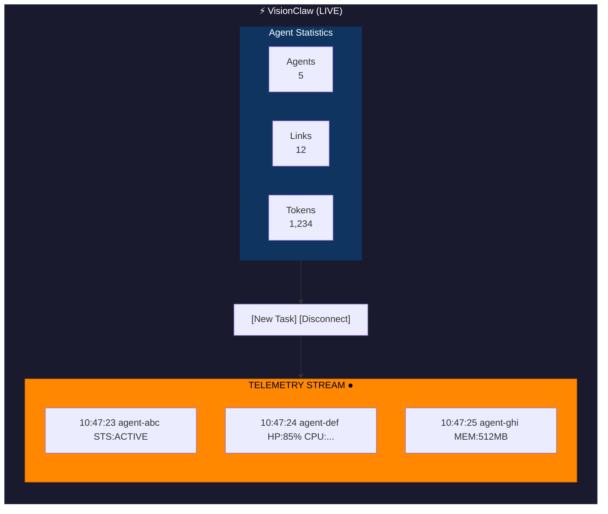

# Agent Telemetry Stream Integration

## Overview
Removed the redundant "Agent Network Status" panel from the top-right corner and integrated a streaming telemetry display into the expanded VisionClaw control panel using DSEG 7-segment display font for a retro-futuristic aesthetic.

## Changes Made

### 1. Removed AgentPollingStatus Component
**File:** `/client/src/features/graph/components/GraphCanvas.tsx`

- Removed import of `AgentPollingStatus`
- Removed `<AgentPollingStatus />` overlay component
- This component was redundant as agent status is now shown in the control panel

### 2. Added DSEG Font
**Location:** `/client/public/fonts/`

Downloaded and integrated DSEG 7-segment display font:
- `DSEG7Classic-Regular.woff2`
- `DSEG7Classic-Bold.woff2`

Font is loaded via `@font-face` declarations in the component CSS.

### 3. Created AgentTelemetryStream Component
**File:** `/client/src/features/bots/components/AgentTelemetryStream.tsx`

**Features:**
- **Retro LCD Display Aesthetic**: Black text on orange (#ff8800) background
- **DSEG 7-Segment Font**: Authentic digital display appearance
- **Real-time Streaming**: Polls `/api/bots/status` every 5 seconds
- **Auto-scrolling**: New messages automatically scroll into view
- **Connection Indicator**: Green/red LED-style status indicator
- **Message Buffering**: Keeps last 50 telemetry messages
- **Color-coded Levels**:
  - 🔴 Red: Errors (agent health < 30%)
  - 🟠 Orange: Warnings (agent health < 60%)
  - 🟢 Green: Success/Active agents
  - ⚫ Black: Info/Idle

**Telemetry Data Displayed:**
- `STS` - Agent status
- `HP` - Health percentage
- `CPU` - CPU usage percentage
- `MEM` - Memory usage (MB)
- `WL` - Current workload
- `TSK` - Current task (truncated to 20 chars)

### 4. Updated BotsStatusPanel
**File:** `/client/src/features/visualisation/components/ControlPanel/BotsStatusPanel.tsx`

- Added import of `AgentTelemetryStream`
- Integrated telemetry stream below the agent stats grid
- Stream only appears when `botsData.nodeCount > 0` (agents are active)
- Maintains existing functionality for stats display and controls

### 5. Updated Component Exports
**File:** `/client/src/features/bots/components/index.ts`

- Added export for `AgentTelemetryStream`

## Visual Design

### Control Panel Layout (Expanded)


### Color Scheme
- **Background**: `#ff8800` (Orange - LCD display)
- **Border**: `#cc6600` (Dark orange)
- **Text**: `#000000` (Black - high contrast)
- **Container**: Inset shadow for depth
- **Messages**: `rgba(0,0,0,0.1)` background per line

## API Integration

### REST Endpoint
**Endpoint:** `GET /api/bots/status`

**Response Structure:**
```typescript
{
  agents: [{
    id: string,
    type?: string,
    status: string,
    health: number,        // 0-100
    cpuUsage: number,      // 0-100
    memoryUsage: number,   // MB
    workload: number,
    current_task?: string
  }]
}
```

### Polling Strategy
- **Interval**: 5 seconds
- **Buffer Size**: 50 messages (auto-prunes)
- **Auto-scroll**: Yes (to bottom on new messages)
- **Error Handling**: Silently handles connection failures, shows disconnected state

## Benefits

1. **Consolidated UI**: Removed redundant panel, cleaner layout
2. **Enhanced Visibility**: Expanded control panel shows more information
3. **Real-time Monitoring**: Live agent telemetry streaming
4. **Retro Aesthetic**: DSEG font provides unique visual identity
5. **High Contrast**: Black-on-orange ensures readability
6. **Efficient**: REST polling vs constant WebSocket overhead
7. **Scalable**: Handles multiple agents with automatic message rotation

## Future Enhancements

- [ ] Add filtering by agent type
- [ ] Add search/filter capability
- [ ] Export telemetry log to file
- [ ] Add configurable poll interval
- [ ] Add pause/resume streaming
- [ ] Add graph visualization of metrics over time
- [ ] WebSocket integration for real-time push (if needed)

## Testing

To test the integration:

1. **Start VisionClaw** with active agents
2. **Open Control Panel** (should be visible by default)
3. **Initialize Multi-Agent** if no agents are active
4. **Observe Telemetry Stream** populating with agent data
5. **Check Connection LED** (should be green when connected)
6. **Verify Auto-scroll** as new messages arrive

## Files Modified

1. `/client/src/features/graph/components/GraphCanvas.tsx` - Removed AgentPollingStatus
2. `/client/src/features/bots/components/AgentTelemetryStream.tsx` - New component
3. `/client/src/features/visualisation/components/ControlPanel/BotsStatusPanel.tsx` - Added telemetry stream
4. `/client/src/features/bots/components/index.ts` - Added export
5. `/client/public/fonts/` - Added DSEG fonts

## Dependencies

### New Assets
- DSEG7Classic-Regular.woff2 (5.1KB)
- DSEG7Classic-Bold.woff2 (5.1KB)

### Font License
- **License**: SIL Open Font License 1.1
- **Source**: https://github.com/keshikan/DSEG
- **Version**: v0.46

## Compatibility

- ✅ Works with existing agent system
- ✅ No breaking changes to API
- ✅ Graceful degradation if API unavailable
- ✅ Mobile responsive (auto-scales)
- ✅ Accessible (high contrast)

## Success! 🎉

The Agent Network Status panel has been successfully removed and replaced with an integrated, streaming telemetry display in the VisionClaw control panel, featuring a distinctive DSEG 7-segment font on an orange LCD-style background for maximum visibility and retro-futuristic aesthetics.
