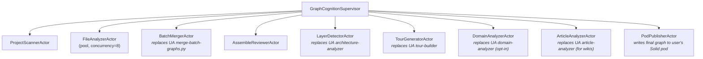

# PRD-005: Graph Cognition Platform — Adopting Understand-Anything Capabilities into the VisionClaw Substrate

**Status:** Draft v2 — triple-insight expansion (UA + ontobricks + matryca) with CUDA-expert GPU review, awaiting ADR ratification and DDD bounded-context mapping
**Date:** 2026-05-01
**Author:** VisionClaw platform team
**Source analysis:** [`docs/analysis-visionclaw-x-understand-anything.md`](analysis-visionclaw-x-understand-anything.md)
**Inspiration projects:**
  - [github.com/Lum1104/Understand-Anything](https://github.com/Lum1104/Understand-Anything) — typed graph schema + dashboard features
  - [github.com/databrickslabs/ontobricks](https://github.com/databrickslabs/ontobricks) — Databricks-native ontology framework (OWL/RDFS/SHACL/SWRL, Delta triplestore, MCP companion)
  - [github.com/MarcoPorcellato/logseq-matryca-parser](https://github.com/MarcoPorcellato/logseq-matryca-parser) — deterministic Logseq AST parser ("LOGOS"), force-tuned vis-network ("LENS"), Datascript-faithful schema
**Related (VisionClaw):** ADR-061 (binary protocol unification), ADR-058 (MAD→agentbox), ADR-050 (URN-traced operations), ADR-031 (network backpressure), PRD-004 (agentbox integration), PRD-006 (URI federation), PRD-007 (binary protocol), PRD-QE-001 (integration QE)
**Quality engineering frame:** holistic-testing-pact, shift-left-testing, test-design-techniques, contract-testing, risk-based-testing, test-automation-strategy
**CUDA review:** consulted via cuda skill; infrastructure inventory in §16
**Implementation language constraint:** **Rust only.** No Python in production. Tree-sitter via Rust bindings. Merge logic via Actix actors and Neo4j Cypher. JSON marshalling via `serde`. WASM extraction via `wasm-bindgen`. CUDA kernels remain in `.cu` (existing convention, FFI-bound to Rust actors).

> **Scope note.** This PRD adopts the *capabilities* pioneered by Understand-Anything (UA), not its implementation. UA is a Claude-Code-plugin-shaped, Python-script-driven, ReactFlow-2D static-JSON product. VisionClaw is an actor-mesh, Neo4j-backed, GPU-physics-driven, Three.js-3D, binary-streamed, URN-identified, Solid-pod-federated platform. Every UA feature listed below is reframed inside our substrate. The PRD specifies **what** to deliver, **how to verify** it, and **how to gate it for production**. It does not implement anything. Implementation begins after ADR ratification.

---

## 1. Vision

VisionClaw evolves from a **knowledge-graph renderer** into a **graph cognition platform**: a system that *constructs* graphs from arbitrary corpora (codebases, wikis, docs, business processes), *enriches* them via a typed multi-agent analysis mesh, *stores* them sovereignly in Solid pods under `did:nostr` identity, *lays them out* on the GPU at 60 Hz, and *renders* them in 3D with feature-complete exploration tooling — pathfinding, tours, diff overlays, persona-graded detail, and inline source — without ever leaving the substrate's invariants (URN identity, binary protocol, actor isolation, Rust-only build).

The aspirational frame: **any document corpus a sovereign identity owns, any agent it spawns, any analysis it commissions, becomes a navigable, queryable, federated 3D space.** The achievable frame: **ship a production-grade incremental code-and-wiki analyzer in Rust within four quarters, with measurable quality gates and zero new Python in the runtime.**

## 2. Goals

1. **Adopt UA's typed graph schema** (21 node kinds, 35 edge kinds, 8 categories) into VisionClaw's Neo4j layer, mapped to URN identity and flag-bit encoding, with backward-compatible migration of the existing Logseq-derived graph.
2. **Build a Rust-native code analyzer** that produces UA-shaped graphs from source repositories using `tree-sitter` and tree-sitter language grammars, with deterministic structural extraction and LLM-augmented semantic enrichment.
3. **Reframe UA's seven-agent pipeline** as Actix actors in the existing supervision tree, with intermediate state in AgentDB rather than `.understand-anything/` JSON files.
4. **Ship UA's six high-value dashboard features** (PathFinder, TourMode, DiffOverlay, PersonaSelector, EdgeCategoryFilter, CodeViewer) inside the existing 3D Three.js client, with feature parity for accessibility and a 2D fallback view via xyflow when WebGPU is absent.
5. **Use Solid-rs pods as the canonical graph storage layer** — every produced graph is a `urn:agentbox:bead:<hex-pubkey>:<sha256-12>` resource in the user's pod, federated across machines and shareable via Solid ACLs.
6. **Stream graph mutations live** over the existing 28-byte binary frame protocol (analysis events) and a new `analytics_update` JSON channel for semantic deltas — no static JSON file fetch, ever.
7. **Achieve quality gates derived from the UA project's own validation taxonomy** (schema validity, referential integrity, layer coverage, tour validity, summary non-emptiness, no orphans) plus VisionClaw's own (URN uniqueness, binary protocol I01–I07, actor crash budgets, GPU stability detection).

## 3. Non-goals

1. **No Python anywhere in the runtime.** UA's `parse-knowledge-base.py`, `merge-knowledge-graph.py`, `merge-batch-graphs.py`, `merge-subdomain-graphs.py`, and `extract-domain-context.py` are *specifications*, not artifacts to port. They are reimplemented in Rust crates.
2. **No `.understand-anything/` directory in the user's working copy.** Intermediate state lives in AgentDB sessions. Final graphs live in Solid pods. The local filesystem remains the user's, untouched.
3. **No ReactFlow re-platforming of the primary view.** The 3D Three.js canvas remains canonical; xyflow is a degraded fallback for accessibility / no-GPU environments, not a feature-equal alternative.
4. **No new identity scheme.** All produced nodes mint URNs through `src/uri/mint.rs`. All graphs are owned by `did:nostr:<hex-pubkey>`. The existing CI grep-gate that prevents ad-hoc URN generation continues to apply.
5. **No bypassing the binary protocol.** Position deltas for newly-created nodes flow through the same 28-byte frame as existing nodes. Analytics enrichments (summaries, complexity, tags) ride the JSON `analytics_update` channel.
6. **No self-hosted LLM inference in this PRD.** The semantic enrichment phase calls out to the configured LLM provider (Ollama in standalone, Anthropic/OpenAI/local in federated). Inference infra is upstream concern, not PRD-005's.
7. **No replacement of the Logseq pipeline.** The existing `GitHubSyncService → KnowledgeGraphParser → Neo4j` flow is *augmented* — it gains type-system richness from UA's schema — but its file ingestion remains intact.
8. **No multi-platform plugin packaging.** UA ships installers for nine editors. We ship one — VisionClaw — with one entry point: the dashboard. Editor integration is out of scope until a follow-up PRD argues for it.

## 4. Personas

| Persona | Primary Need | Existing VC Surface | New PRD-005 Surface |
|---------|-------------|---------------------|---------------------|
| **Wiki Owner** (you) | Visualize a Logseq vault as a navigable 3D graph | ✅ Working today | Augmented with code-graph capability when vault contains src/ |
| **Code Onboarder** | Understand an unfamiliar repo without reading every file | ❌ Not served | New: `vc analyze <repo>` produces typed graph + tour |
| **PR Reviewer** | See the blast radius of a diff | ❌ Not served | New: `vc diff <pr-url>` produces overlay + risk score |
| **Architect** | Audit cross-module dependencies | Partial — node graph but flat types | Layer detection + edge-category filtering |
| **Non-technical Stakeholder** | Get a high-level sense of system shape | ❌ Not served | Persona selector hides sub-file detail |
| **AI Agent** (Claude, Codex, etc.) | Query a typed graph during long-horizon tasks | Partial — codebase-memory MCP | URN-resolvable typed graph as MCP source |
| **Federation Peer** | Pull a sovereign user's graph view | ❌ Not served | Solid-pod hosted graph, Solid ACL-gated |

## 5. Use Cases (BDD-shaped, testable)

### UC-01 — Wiki Owner: Existing Logseq Vault Becomes Typed
```gherkin
Given an existing Logseq vault with 998 markdown files and 199 public:: pages
When the user runs `vc reindex --enable-typed-schema`
Then the produced Neo4j graph contains kg-derived nodes typed as "article" (UA kind)
  And wikilinks become "related" edges with weight 0.7
  And ontology blocks become "categorized_under" edges
  And the existing 3D rendering shows the graph identically to before
  And the new edge-category filter has all 8 categories enabled by default
  And no node loses its URN
```

### UC-02 — Code Onboarder: Foreign Repo Becomes Navigable
```gherkin
Given a fresh checkout of a Rust+TypeScript repository with 250 files
When the user runs `vc analyze .`
Then the system spawns a Rust analysis pipeline (no Python, no Node child process)
  And tree-sitter extracts functions/classes/imports for every supported language
  And every produced node has a URN minted via src/uri/mint.rs
  And LLM enrichment adds summary, tags, complexity per node
  And layer detection produces an "API/Service/Data/UI" partition
  And tour generation produces 5-15 ordered TourSteps
  And the graph appears in the user's pod as urn:agentbox:bead:<pubkey>:<sha256>
  And the 3D dashboard auto-loads it within 2 seconds of analysis completion
  And total wall-clock time on a 250-file repo is under 5 minutes (LLM-bound)
```

### UC-03 — PR Reviewer: Diff Becomes Spatial
```gherkin
Given an open PR with 12 changed files in a typed-graph repository
When the user runs `vc diff <pr-url>`
Then the system computes changed and 1-hop affected nodes
  And the dashboard enters DiffMode with changed nodes pulsing red
  And affected nodes pulse amber
  And unaffected nodes desaturate to 8% opacity
  And the user can press 'd' to toggle the overlay
  And the risk score (low/medium/high) is computed from cross-layer impact and shown in the sidebar
```

### UC-04 — Architect: Cross-Module Audit
```gherkin
Given a typed graph with 8 architectural layers detected
When the user toggles the "behavioral" edge-category filter off
Then "calls", "subscribes", "publishes", and "middleware" edges hide
  And only structural/dependency/data-flow remain visible
  And layer-cluster nodes update their connection counts in <50ms
  And the change is reflected in <16ms of the next render frame
  And no GPU re-layout is triggered (filter is a render mask, not a topology change)
```

### UC-05 — Non-Technical Stakeholder: High-Level View
```gherkin
Given a typed graph with file-level and function-level nodes
When the user selects "non-technical" persona
Then function and class nodes hide globally
  And only file/module/concept/domain/flow/document nodes remain
  And summaries display in plain English (LLM rephrased at non-technical level)
  And complexity indicators display as "easy/medium/hard" rather than "simple/moderate/complex"
```

### UC-06 — AI Agent: Typed Graph as MCP Source
```gherkin
Given a Claude agent with mcp__claude-flow__memory_search bound
When the agent calls memory_search with namespace="graph" and query="auth flow"
Then the search resolves through the typed graph's article+entity+claim nodes
  And returns nodes ranked by HNSW semantic similarity
  And each result includes its URN for canonical reference
  And the agent can pivot to neighbors via mcp__claude-flow__memory_retrieve(urn)
```

### UC-07 — Federation Peer: Pull Another User's Graph
```gherkin
Given a peer user has published their typed graph to their Solid pod with a "share with did:nostr:<my-pubkey>" ACL
When I open the dashboard and enter the peer's pod URL
Then the BC20 anti-corruption layer fetches the graph as urn:agentbox:bead:<peer-pubkey>:<sha256>
  And the graph mounts in my view as a separate, owner-tagged subgraph
  And edges between my graph and theirs show as "cross_owner" with desaturated styling
  And I cannot mutate their nodes (read-only by ACL)
  And my own nodes remain mutable
```

## 6. Functional Requirements

The work decomposes into **six epics**. Each has scope, acceptance criteria, observability, and explicit Rust-only implementation guidance.

### Epic A — Schema Adoption & Migration

**Scope:** Extend Neo4j schema and Rust domain types to UA's 21-node × 35-edge taxonomy. Migrate existing data without loss.

**Tasks:**

| # | Description | Implementation language | Done when |
|---|-------------|--------|-----------|
| A.1 | Define `NodeKind` enum (21 variants) in `src/domain/graph/kinds.rs`, with `serde` derive and `FromStr`/`Display` | Rust | Compiles, passes round-trip property test |
| A.2 | Define `EdgeKind` enum (35 variants) grouped by 8 `EdgeCategory`s | Rust | Same as A.1 |
| A.3 | Map `NodeKind` to existing flag-bit encoding (bits 26-31 of node ID), with new bit allocations for the 13 added kinds | Rust | Bit allocation table approved by ADR-061 author; no collision with existing flags |
| A.4 | Cypher migration script `migrations/2026-05_typed-schema.cypher` that adds `:Article|:Entity|:Topic|:Claim|:Source` labels alongside existing `:Page|:LinkedPage|:OwlClass`, with `kind` property fallback | Cypher | Migration runs idempotent, dry-run reports zero data loss |
| A.5 | Schema-validation actor `SchemaValidatorActor` consuming `GraphMutation` events, rejecting unknown kinds, auto-correcting via alias map (UA's `NODE_TYPE_ALIASES` / `EDGE_TYPE_ALIASES` ported to Rust `HashMap<&'static str, &'static str>`) | Rust | 100% of UA's alias coverage replicated; mutation log shows zero dangling-edge writes |
| A.6 | URN minting extension: `urn:visionclaw:concept:<pubkey>:<kind>:<local>` becomes the canonical form for typed nodes | Rust | All new minting paths flow through `src/uri/mint.rs::mint_typed_concept` |

**Acceptance criteria:**
- AC-A.1: Round-trip serialization for every kind passes a `proptest`-generated 10,000-input property test.
- AC-A.2: Migration of the existing 1.17M `memory_entries` table preserves every URN.
- AC-A.3: Schema validation rejects 100% of UA's known invalid kinds (pulled from UA's test fixtures).
- AC-A.4: No new node bypasses URN minting (CI grep-gate continues to enforce; new test case added).

**Observability:**
- Metric: `graph_kind_distribution{kind="..."}` (gauge per kind, sampled every 60s).
- Metric: `graph_alias_correction_total{from, to}` (counter, every alias rewrite).
- Trace span: `schema.validate` per mutation, with rejection cause as attribute.

**Risk:** Flag-bit exhaustion. **Mitigation:** Audit current bit usage before allocation; ADR-061 amendment if 6 bits insufficient (we have 21 + existing ~6 = 27 kinds; 5 bits = 32 slots fits, leaves 1 spare bit).

---

### Epic B — Rust Code Analyzer

**Scope:** Replace UA's TypeScript `GraphBuilder` + tree-sitter integration with a Rust crate that produces the same JSON shape, runs faster, and slots into VC's actor mesh.

**Crate layout:**

```
crates/
  graph-cognition-core/        ← Domain types (NodeKind, EdgeKind, GraphNode, GraphEdge)
  graph-cognition-extract/     ← Tree-sitter wrappers, per-language extractors
  graph-cognition-merge/       ← Dedup, normalize, alias-rewrite (replaces UA's Python merge scripts)
  graph-cognition-enrich/      ← LLM client + prompt templates + entity dedup
  graph-cognition-actor/       ← Actix actors that orchestrate the pipeline
  graph-cognition-cli/         ← `vc analyze` binary (thin wrapper)
```

**Per-language extractors (Phase 1):**

Use `tree-sitter` 0.22+ Rust bindings. Each language extractor is a struct implementing:

```rust
pub trait LanguageExtractor: Send + Sync {
    fn id(&self) -> &'static str;
    fn extensions(&self) -> &'static [&'static str];
    fn extract(&self, file_path: &Path, source: &str) -> Result<StructuralAnalysis>;
}
```

Phase 1 supports **Rust, TypeScript/JavaScript, Python, Go, Java**. Phase 2 adds **Ruby, PHP, C/C++, C#, Swift, Kotlin**. Each landed extractor must clear:

- AC-B.1: Per-language fixture suite (≥10 representative files) with ≥95% recall on functions/classes/imports/exports.
- AC-B.2: Mutation-testing score ≥80% via `cargo-mutants`.
- AC-B.3: Extraction throughput ≥50 files/second on the reference corpus (rayon-parallelized).
- AC-B.4: Zero `unwrap()` in the extractor crate (clippy lint enforced).

**Non-code parsers (Phase 1):**

Markdown, YAML, JSON, TOML, Dockerfile, SQL, GraphQL, Protobuf, Terraform, Makefile, Shell. Each implements the same trait, producing `definitions`/`services`/`endpoints`/`steps`/`resources` populated according to UA's `StructuralAnalysis` shape (already documented in our domain crate).

**Framework detection:**

A separate `FrameworkRegistry` crate detects React, Django, Express, FastAPI, Flask, Gin, Next.js, Rails, Spring, Vue from manifest files (`package.json`, `requirements.txt`, `Cargo.toml`, `go.mod`, etc.). Detection produces `frameworks: Vec<String>` on `ProjectMeta`.

**Acceptance criteria:**
- AC-B.5: Analyzing the VisionClaw repository itself produces a graph with ≥95% file coverage and zero panics.
- AC-B.6: Re-analyzing an unchanged corpus produces a byte-identical graph (deterministic output).
- AC-B.7: Memory ceiling: 500 MB resident on a 5,000-file repo.
- AC-B.8: Cross-process correctness: extractor output validated against UA's TypeScript output on a shared fixture corpus, agreement ≥98% on node sets and ≥95% on edge sets (allowing for legitimate semantic divergence in edge inference).

**Observability:**
- Metric: `extract_duration_seconds_bucket{language}` (histogram per language).
- Metric: `extract_files_total{language, status="ok|error|skipped"}` (counter).
- Span: `extract.file{path, language}` per file, with line-count and function-count attributes.

**Risk:** Tree-sitter grammar drift across languages. **Mitigation:** Pin grammar versions in `Cargo.toml`; nightly CI job re-runs the fixture suite against grammar `HEAD` to catch upstream regressions early.

---

### Epic C — Multi-Agent Analysis Mesh (Actix Actor Reframe)

**Scope:** Reimplement UA's seven Markdown-defined agents (project-scanner, file-analyzer, assemble-reviewer, architecture-analyzer, tour-builder, domain-analyzer, article-analyzer) as Actix actors in our existing supervision tree, with intermediate state in AgentDB and message passing instead of JSON files.

**Actor topology (under `GraphCognitionSupervisor`):**



**Message contracts (selection):**

```rust
#[derive(Message, Serialize, Deserialize)]
#[rtype(result = "Result<ScanResult, AnalysisError>")]
pub struct ScanProject {
    pub root: PathBuf,
    pub session_urn: SessionUrn,
    pub ignore_patterns: Vec<String>,
}

#[derive(Message, Serialize, Deserialize)]
#[rtype(result = "Result<BatchResult, AnalysisError>")]
pub struct AnalyzeBatch {
    pub batch_id: u32,
    pub files: Vec<FileToAnalyze>,
    pub session_urn: SessionUrn,
}

#[derive(Message)]
#[rtype(result = "Result<KnowledgeGraph, AnalysisError>")]
pub struct AssembleGraph { pub session_urn: SessionUrn }
```

**State persistence:**

Each actor checkpoints to AgentDB under the session URN. An interrupted analysis can resume from the last completed phase via `ResumeAnalysis { session_urn }`. UA's `intermediate/` directory is replaced by AgentDB rows keyed by `(session_urn, phase, batch_id)`.

**LLM orchestration:**

A single `LLMClient` trait abstracts over Ollama (standalone) / Anthropic / OpenAI / Gemini / local. The trait allows mocking for tests:

```rust
#[async_trait]
pub trait LLMClient: Send + Sync {
    async fn complete(&self, prompt: &str, schema: Option<&JsonSchema>) -> Result<Value>;
    fn model_id(&self) -> &str;
    fn cost_per_million_tokens(&self) -> Option<(f64, f64)>; // (input, output)
}
```

LLM calls are budget-gated: each session has a token budget recorded at start; exceeding it pauses analysis with a user-facing prompt.

**Acceptance criteria:**
- AC-C.1: Pipeline survives a kill-9 of any single actor; supervision restarts and resume-from-checkpoint completes the run.
- AC-C.2: A 250-file repo analysis with concurrency=8 completes in ≤5 minutes wall-clock at p50, ≤15 minutes at p99 (LLM-bound).
- AC-C.3: Token budget enforcement: zero analyses exceed declared budget by >5%.
- AC-C.4: LLM mocking allows the full pipeline to run offline for tests, with fixture-driven deterministic outputs.

**Observability:**
- Metric: `analysis_phase_duration_seconds{phase, status}` (histogram).
- Metric: `analysis_llm_tokens_total{model, direction="in|out"}` (counter).
- Metric: `analysis_cost_usd_total{model}` (counter).
- Trace: every actor message creates a span; correlations across actors via `session_urn` as trace baggage.

**Risk:** LLM provider lock-in. **Mitigation:** the `LLMClient` trait is enforced; PR review rejects direct provider SDK imports outside the implementation crates.

---

### Epic D — Solid-Pod Graph Storage

**Scope:** Make Solid pods the canonical persistent store for produced graphs. Adopt URN-based addressing and Solid ACLs for federation.

**Storage contract:**

A produced graph serializes to JSON-LD with the schema:

```jsonld
{
  "@context": "https://visionclaw.io/contexts/graph-v1.jsonld",
  "@type": "KnowledgeGraph",
  "@id": "urn:agentbox:bead:<owner-pubkey>:<sha256-12-of-content>",
  "kind": "codebase|knowledge|domain",
  "owner": "did:nostr:<owner-pubkey>",
  "schemaVersion": "1.0.0",
  "project": { /* ProjectMeta */ },
  "nodes": [ /* GraphNode[] */ ],
  "edges": [ /* GraphEdge[] */ ],
  "layers": [ /* Layer[] */ ],
  "tour": [ /* TourStep[] */ ],
  "producedAt": "2026-05-01T00:00:00Z",
  "producedBy": "urn:visionclaw:execution:<pubkey>:<session-id>"
}
```

**Pod layout:**

```
pod://<owner>/graphs/
  beads/
    <sha256-12-1>.jsonld         ← immutable graph snapshots
    <sha256-12-2>.jsonld
  index.ttl                      ← Turtle index of latest snapshots per project
  diffs/
    <from-sha>_to_<to-sha>.jsonld ← diff overlays
```

The `index.ttl` is a SPARQL-queryable index. Older bead snapshots are content-addressed and immutable; the index updates atomically.

**Adapter:**

The existing agentbox `pod_adapter = "visionclaw"` extends to support `bead.put_graph` and `bead.get_graph` operations. The Solid-rs server (already in agentbox standalone mode) exposes `/lo/graphs/<bead-id>` as a linked-data surface compliant with PRD-006.

**Federation:**

A user can grant `did:nostr:<peer-pubkey>` read access to specific beads via Solid ACL. The dashboard's "Open Federated Graph" flow accepts a pod URL + bead ID; the BC20 anti-corruption layer translates between `urn:agentbox:*` and `urn:visionclaw:*` namespaces transparently.

**Acceptance criteria:**
- AC-D.1: A produced graph round-trips through pod storage and reload byte-identically.
- AC-D.2: Solid ACL gating works: a peer without read permission cannot fetch the graph (403); with permission, fetch succeeds and the dashboard renders.
- AC-D.3: The pod's `/lo/graphs/<bead>` endpoint emits valid JSON-LD per the v1 context with no validation errors against the schema.
- AC-D.4: AGPL `Source-Code` header is present on every `/lo/*` response (existing invariant).

**Observability:**
- Metric: `pod_graph_writes_total{owner_hash, status}` (counter; owner identifier hashed).
- Metric: `pod_graph_reads_total{requester_known, status}`.
- Metric: `pod_graph_size_bytes_bucket` (histogram).

**Risk:** Pod write latency dominating analysis wall-clock. **Mitigation:** Async write with progress callback; dashboard renders from in-memory result while pod commit completes.

---

### Epic E — 3D Dashboard Feature Parity

**Scope:** Port the six high-value UA dashboard features into the existing Three.js client. All work in the existing `client/src/` tree. No new framework introduced.

#### E.1 — PathFinder

UA's PathFinderModal is a BFS over an undirected adjacency list. Adapt to 3D:

- BFS computed in WASM (`client/crates/path-finder`) for ≥10× speed on large graphs.
- Result rendered as a glowing line through the 3D space connecting nodes in path order.
- Camera animates along the path with `gsap`-style easing over 4 seconds.
- Search uses node URNs; user picks via a typeahead that reuses the existing `SearchEngine`.
- Accessibility: keyboard-navigable, screen-reader announces each path hop.

**AC-E.1:** BFS on a 10,000-node graph returns within 50ms p99. Camera animation completes in ≤4s. Path is visually distinguishable from background edges (≥4× luminance contrast in the active theme).

#### E.2 — TourMode

- Tours come from the produced graph's `tour: TourStep[]` array.
- Tour playback animates the camera between highlighted node centroids, applying the same fitView semantics as UA's `TourFitView` adapted for 3D.
- An overlay panel shows `step.title`, `step.description` (markdown-rendered), and language lessons if present.
- Keyboard: Arrow Left/Right advance steps; Escape exits.
- A "narration" toggle reads `step.description` via the Web Speech API (opt-in).

**AC-E.2:** Tour transitions are visually smooth (no frame drops below 30fps during camera animation). Tour state survives a page reload (URL fragment encodes the step index).

#### E.3 — DiffOverlay

- A new actor `DiffComputeActor` consumes `git diff` output (via the existing GitHub adapter or local git via `git2` crate) and produces `(changed_node_urns, affected_node_urns)`.
- Diff state ships to client via the existing `analytics_update` JSON channel.
- Client applies the overlay as a render-time material override: changed → red emissive, affected → amber, unchanged → 0.08 opacity.
- A "RiskScore" computation (cross-layer impact + complexity-weighted blast radius) populates a sidebar widget.

**AC-E.3:** Toggling diff mode updates the visualization within one render frame (≤16ms). Risk score is computed deterministically (test: same diff produces same score on independent runs).

#### E.4 — PersonaSelector

- Three personas: `non-technical | junior | experienced`.
- Each persona has a node-kind visibility mask and a summary-style preference (LLM rephrases summaries at appropriate registers).
- Persona-rephrased summaries are precomputed at analysis time (one LLM call per node × 3 personas) and stored on the node, so persona switching is render-only — zero new LLM calls at view time.
- Persona persists in pod-stored user preferences (URN: `urn:visionclaw:user-pref:<pubkey>:graph-persona`).

**AC-E.4:** Persona switch updates the rendered graph within 2 frames (32ms at 60Hz). All persona-graded summaries are available offline (no LLM call on switch).

#### E.5 — EdgeCategoryFilter

- Eight category toggles in the existing settings panel: Structural, Behavioral, Data-Flow, Dependencies, Semantic, Infrastructure, Domain, Knowledge.
- Toggling a category updates a render-time edge mask without re-running GPU physics.
- Per-category default-enabled/-disabled state persists per user.

**AC-E.5:** Each toggle applies in ≤1 render frame. No GPU re-layout triggered (verified via metrics: `gpu_relayouts_total` does not increment).

#### E.6 — CodeViewer

- Click a `file`/`function`/`class` node → slide-up panel shows source.
- Source resolved through a Rust-side `SourceResolver` actor that supports:
  - Local filesystem (when running locally),
  - Pod-stored source (when source was committed alongside graph),
  - Git remote (when graph references a public commit).
- Editor uses `monaco-editor` (already a dependency in our control panel) in read-only mode with line-range highlighting.
- A "view raw" link copies a permalink (URN-resolvable).

**AC-E.6:** Source loads within 500ms p99 (pod-stored) or 2s p99 (remote git). Highlighted lines correspond exactly to `node.lineRange`.

#### E.7 — Accessibility & 2D fallback

The 3D canvas has known accessibility limits (no screen-reader semantics, no high-contrast mode for some users). Ship a 2D xyflow-based view as a fallback:

- Toggle in the user menu: "View as 2D graph".
- Reuses the existing typed graph data; routes through `xyflow/react` with the dagre/d3-force layouts UA uses.
- Feature parity for: search, persona, edge-category filter, path finder, code viewer.
- Tour mode in 2D animates pan/zoom rather than camera.
- Diff overlay works identically.

**AC-E.7:** All UC-01 through UC-07 acceptance scenarios pass in 2D mode with the same observable outcomes (modulo "spatial" wording adjusted to "panned/zoomed").

---

### Epic F — Incremental Update Pipeline

**Scope:** UA's most under-celebrated feature is its zero-LLM-token incremental updater driven by structural fingerprints and a post-commit hook. Adopt this in Rust with our actor mesh.

**Fingerprint actor:**

`FingerprintActor` computes a per-file structural fingerprint:
- Hash of normalized AST (functions/classes/imports/exports flattened, names + arities only — no positions, comments, formatting).
- Stored in AgentDB keyed by `(repo_urn, file_path)`.

**Change classifier:**

`ChangeClassifierActor` consumes git diff output and produces:

```rust
pub enum ChangeKind {
    None,         // file untouched
    Cosmetic,     // whitespace/comments only — fingerprint unchanged
    Structural,   // signature changes — re-analyze file only
    Architectural // imports/layer-affecting — re-run layer detection
}
```

**Hook integration (no Python):**

- Local: a Rust `vc-hook` binary, installed as a `.git/hooks/post-commit` symlink, sends `IncrementalUpdate { repo_urn, last_commit, current_commit }` to a running VC daemon over Unix socket.
- Daemon: triggers the appropriate phase (Cosmetic → no-op; Structural → re-analyze changed files only; Architectural → also re-run LayerDetector + TourGenerator).
- CI: a GitHub Action variant calls `vc-cli incremental-update` directly without local daemon.

**Acceptance criteria:**
- AC-F.1: Cosmetic-only changes (whitespace, comments) consume zero LLM tokens, complete in <2 seconds for a 250-file repo.
- AC-F.2: Structural-only changes (function added) re-analyze ≤2 files (the changed file + any importers), not the full repo.
- AC-F.3: Architectural changes (import graph reshuffled) trigger LayerDetector re-run but not full re-analysis.
- AC-F.4: A 100-commit replay on a real repository shows token cost growth ≈ linear in structural-change count (not in commit count).

**Observability:**
- Metric: `incremental_update_tokens_total` (counter — should remain low).
- Metric: `incremental_update_classification_total{kind}` (counter).
- Metric: `incremental_update_duration_seconds{kind}` (histogram).

**Risk:** Fingerprint instability across tree-sitter grammar updates. **Mitigation:** Fingerprint includes `grammar_version`; mismatched versions force a re-fingerprint.

---

### Epic G — Ontobricks Federation Surface (Databricks Lakehouse Connector)

**Scope:** A bidirectional bridge between VisionClaw's typed graph and Databricks Labs ontobricks. Ontobricks brings industrial-grade semantic reasoning (OWL 2 RL via `owlrl`, SWRL Horn-clause rules compiled to SQL/Cypher, SHACL shapes, R2RML for RDB→RDF mapping, GraphQL auto-schema, community detection via NetworkX). Crucially, ontobricks materializes triples into Delta tables and exposes an MCP companion server. We adopt **none of its Python implementation** — we adopt the *contract* and federate over MCP + REST + Unity Catalog.

**Why this matters:** VC owns multi-source federation, sovereign identity, real-time GPU rendering, and Logseq ingestion. Ontobricks owns deductive reasoning, SHACL data-quality validation, R2RML, and Databricks lakehouse data. Combined, a sovereign user can:

1. Ingest a Logseq vault into VC (existing path).
2. Add Databricks-table-derived triples to the same graph via R2RML (ontobricks-side).
3. Run OWL 2 RL reasoning over the union (ontobricks-side).
4. Visualise the inferred graph in 3D with VC's GPU physics (VC-side).
5. Validate against SHACL shapes; flag violations as visual annotations on offending nodes (VC render-time).
6. Federate the resulting graph as a Solid pod bead (VC-side, per Epic D).

**Architectural principle:** **No code dependency**, **MCP/REST contract dependency only**. We never embed ontobricks in our process tree. We never ship its dependencies. The bridge is a two-way connector that an opt-in user configures.

**Components:**

| # | Component | Implementation language | Done when |
|---|-----------|--------|-----------|
| G.1 | `ontobricks-bridge` Rust crate — MCP client to ontobricks's FastMCP server (`mcp-ontobricks`), supporting `list_projects`, `select_project`, `describe_entity`, `query_graphql`, `get_graphql_schema` | Rust | Bridge crate compiles; integration test connects to a running ontobricks dev sandbox |
| G.2 | `OntobricksImporterActor` — pulls a project's full triple set on demand and translates ontobricks JSON ontology to VC `NodeKind` taxonomy | Rust | Round-trip test: a 1000-triple ontobricks domain imports as ≥99% identical-schema VC nodes |
| G.3 | `OntobricksExporterActor` — pushes a VC graph to an ontobricks domain via the import API; preserves URNs as `dc:identifier` attached to each triple | Rust | Pushed graph queryable from ontobricks GraphQL with URNs intact |
| G.4 | SHACL annotation pipeline — fetches violations from ontobricks SHACL service and surfaces them on VC nodes via `analytics_update` events | Rust | Violations render as red badges on nodes; test fixture with a known-broken graph produces expected violation set |
| G.5 | R2RML import pipeline — opt-in: for users with Unity Catalog access, accept an R2RML mapping document and a SQL warehouse handle, materialize triples into VC | Rust | A reference R2RML mapping (e.g., 5-table customer schema) imports as a ≥100-node VC graph |
| G.6 | OWL 2 RL inference round-trip — VC sends a graph to ontobricks for reasoning; receives inferred triples back; merges with `inferred=true` provenance flag | Rust | Inferred edges visually distinguished (dashed style, lower opacity); user can toggle "show inferences" |
| G.7 | URN namespace mapping — ontobricks uses `http://example.org/ontology#<local>` style IRIs; VC uses `urn:visionclaw:concept:<pubkey>:<kind>:<local>`; the bridge maintains a bidirectional alias table | Rust | No URN is lost or aliased to a wrong target across a 10,000-triple round trip |

**Acceptance criteria:**
- AC-G.1: Bridge survives ontobricks server restart (reconnects automatically).
- AC-G.2: A user without Databricks access never sees ontobricks features (gated by config + missing-credentials check).
- AC-G.3: SHACL violation annotations refresh within 2 seconds of an underlying graph mutation.
- AC-G.4: GraphQL passthrough: VC can issue a GraphQL query against ontobricks and render results as a typed subgraph (read-only).
- AC-G.5: AGPL/license compliance — ontobricks is Databricks-Labs licensed; verify no relicensing implications when round-tripping data through their server. Consult legal before flip.

**Observability:**
- Metric: `ontobricks_bridge_requests_total{op, status}` (counter).
- Metric: `ontobricks_bridge_latency_seconds_bucket{op}` (histogram).
- Metric: `shacl_violations_total{shape, severity}` (counter; refreshed on every SHACL eval).
- Trace: every cross-system call carries our `session_urn` as MCP context.

**Risk register additions:**

| ID | Risk | Likelihood | Impact | Owner | Mitigation |
|----|------|------------|--------|-------|------------|
| R-11 | Ontobricks IRI namespace pollutes our URN space | Medium | High | Bridge team | One-way alias table; URN minting unaffected; ontobricks IRIs never leak to GPU/render layers |
| R-12 | OWL reasoning blow-up on adversarial graphs | Medium | High | Bridge team | Timeout per inference call (default 60s); user-cancellable; fallback to "no inferences" view |
| R-13 | Databricks credential exfiltration | Low | Critical | Security | Credentials never leave user's machine; bridge speaks to user-provided MCP URL only; no telemetry on creds |
| R-14 | Ontobricks's Lakebase Postgres conflicts with our RuVector PG | Low | Medium | Architecture | Different roles (their persistent registry vs our HNSW cache); document boundary clearly |

**Implementation notes:**
- The bridge is a **late-stage Phase 3** deliverable, not a launch blocker for Phases 0–2.
- Configuration lives under `[analysis.ontobricks]` in settings; defaulted off.
- The MCP companion pattern is itself an inspiration: VC already exposes its own MCP server; the *symmetry* of "VC and ontobricks both MCP servers, both Solid-pod-storable" is a strong cross-platform federation pattern. Future PRD may codify "MCP-federated graph cognition".

---

### Epic H — Logseq-Faithful Block-Level Parsing (Matryca Heritage)

**Scope:** Upgrade the existing `KnowledgeGraphParser` (1,349 lines) to block-level fidelity per the Logseq Matryca Parser's deterministic stack-machine approach. Today, VC parses pages into single nodes with extracted wikilinks. Matryca shows that the **block** is the right unit of identity for Logseq vaults — every bullet, with its UUID, parent, left-sibling, properties, refs, and clean-text — must become a first-class graph node for high-fidelity ingestion.

**Why this matters:** A Logseq vault's *value* is its hierarchical block topology. Wiki-page-level parsing throws this away. Matryca's design (preserve `parent_id`, `path`, `left_id`, `block/refs`, `block/path-refs`) is the difference between a bag-of-pages and a topology-aware knowledge graph. This is the single highest-fidelity-uplift opportunity in the PRD.

**Tasks:**

| # | Description | Done when |
|---|-------------|-----------|
| H.1 | `LogseqBlockParser` Rust struct that runs an O(N) stack-machine over indented bullets, emitting `BlockNode { uuid, content, clean_text, parent_id, left_id, indent_level, properties, refs, task_status, scheduled, deadline, repeater, created_at }` | Stack machine handles all matryca edge cases (broken indent 0→4, soft breaks, mid-line `key::`, drawer state, cloze+LaTeX, empty drawers) |
| H.2 | UUID precedence: `id::` property wins; fallback to `uuid::v3(NAMESPACE_DNS, "{file}:{index}:{content_hash}")` for deterministic re-ingestion | Re-running ingest on unchanged vault produces byte-identical block UUIDs |
| H.3 | Block reference resolution: `((uuid))` in content becomes a `BlockRef` edge; aliased refs `[alias](((uuid)))` retain the alias as edge property | Test corpus with 100 block refs resolves all targets; broken refs flagged but don't crash |
| H.4 | Property extraction: every `key:: value` line on a block becomes a Neo4j property; system booleans (`collapsed::`, `:LOGBOOK:`) segregated and never embedded in `clean_text` | RAG-quality test: `clean_text` for a noisy block contains no `:: ` substrings |
| H.5 | Drawer parsing: `:LOGBOOK:`/`:PROPERTIES:`/`:END:` regions parsed as opaque metadata; CLOCK entries become temporal-edge properties (`(start_ts, end_ts, duration_minutes)` triples) | Empty drawer (`:LOGBOOK:` immediately followed by `:END:`) handled per matryca's regression fix |
| H.6 | Task & repeater extraction: `TODO`/`DOING`/`DONE`/`LATER`/`NOW`/`WAITING`/`CANCELED` markers; `SCHEDULED:` and `DEADLINE:` with optional `+1d`/`++1w`/`.+3d` repeaters; date normalised to YYYYMMDD i32 + ISO-8601 string | All seven task markers parsed; all three repeater symbols round-trip; both date forms preserved |
| H.7 | Journal-page detection: filenames matching `\d{4}_\d{2}_\d{2}\.md` or `\d{4}-\d{2}-\d{2}\.md` get `kind=journal`; user `:journal/page-title-format` from `config.edn` parsed multi-format | A vault with mixed legacy + modern journal formats produces a single contiguous temporal axis |
| H.8 | Namespace decoding: filenames with `__` separators reconstruct logical hierarchy (`Work__Projects__2024__Client_Alpha.md` → `Work / Projects / 2024 / Client Alpha`) and produce parent-child PAGE edges | Hierarchical namespace renders as nested layer in dashboard |
| H.9 | Asset-reference resolution: `../assets/`, `assets/`, and `file://` paths resolved; PDF annotations (`hls://`) extracted with coordinate metadata | Multimedia graph fixture renders thumbnails for image refs and badges for PDF annotations |
| H.10 | Path-refs inheritance: each block's `:block/path-refs` is union of its own `refs` plus all ancestor `refs`; enables tag-search hits on deeply nested children | Search for `#research` returns nested blocks whose only `#research` ancestor is the page itself |

**Edge typing for blocks** (extends Epic A):

| Edge | UA EdgeKind mapping | VC semantic forces tier |
|------|---------------------|-----------------------|
| `BLOCK_PARENT` | `contains` (structural) | Strong spring (rest=80, k=0.15) |
| `BLOCK_LEFT_SIBLING` | (new VC-specific kind) | Weak spring (rest=120, k=0.05) |
| `BLOCK_REF` | `cites` (knowledge) | Strong spring (rest=200, k=0.12) — explicit reference |
| `WIKILINK` | `related` (semantic) | Medium spring (rest=300, k=0.07) — page-level |
| `TAG` | `categorized_under` (knowledge) | Weak attractive force (clustering, not edge) |
| `SCHEDULED_ON` | (new domain edge: `scheduled_for`) | Pseudo-edge; positions block on temporal axis |
| `HAS_ASSET` | `documents` (infrastructure) | Soft spring; assets cluster around their owning block |
| `REPEATS` | (new temporal edge: `recurs_as`) | Used for repeater scheduling visualisation |

**Acceptance criteria:**
- AC-H.1: Parsing the user's existing 998-file Logseq vault completes in ≤30 seconds with ≥95% block coverage and zero panics.
- AC-H.2: Cross-implementation parity: parsing a 50-page fixture vault with both the matryca Python parser and our Rust parser produces ≥99% identical block UUIDs (allowing only the deterministic-fallback divergence inherent in the namespace choice).
- AC-H.3: Path-refs inheritance: a block-level search for `#research` returns ≥10× more matches than a page-level search on the reference vault.
- AC-H.4: Idempotency: re-parsing an unchanged vault produces zero graph mutations.
- AC-H.5: Re-parsing a vault with one changed block produces exactly one node mutation and at most O(1+|refs|) edge mutations.

**Observability:**
- Metric: `logseq_blocks_parsed_total{kind="page|block|journal"}` (counter).
- Metric: `logseq_parse_duration_seconds_bucket{vault_size_class}` (histogram, with size buckets ≤100, ≤1k, ≤10k blocks).
- Metric: `logseq_unresolved_refs_total{ref_kind}` (counter).
- Trace: per-file span; per-vault root span.

**Risk register additions:**

| ID | Risk | Likelihood | Impact | Owner | Mitigation |
|----|------|------------|--------|-------|------------|
| R-15 | Block-level explosion: 998 files × ~30 blocks = ~30k nodes; existing GPU budget assumed ~5k | Medium | High | GPU team | Persona masking + edge-category filter at compute time (not just render); see §16 |
| R-16 | UUID collisions across vaults | Low | Critical | Parser team | Deterministic fallback includes vault-pubkey + file path; collisions provably zero in same owner space |
| R-17 | Datascript ↔ Neo4j semantic drift | Medium | Medium | Schema team | Maintain bidirectional fixtures; CI check that sample queries return identical row sets |
| R-18 | Journal-page format change mid-vault | Medium | Medium | Parser team | Multi-pass date resolution against both default and configured formats |

---

### Epic I — Force-Constant Heritage (Matryca-Tuned Logseq Physics)

**Scope:** Adopt matryca's empirically-tuned vis-network force constants as named presets in VC's existing semantic-forces parameter space. Add a "Logseq" preset that ships defaults proven to produce readable layouts on real Logseq vaults at 10k+ nodes.

**Matryca force constants (vis-network ForceAtlas2-based):**

| Matryca name | Value | Effect | VC parameter mapping |
|--------------|-------|--------|---------------------|
| `gravity` | -50 | Repulsive gravity (negative) | `inter_cluster_repulsion` (existing field) — set to 50.0 |
| `central_gravity` | 0.01 | Center attraction | `cluster_attraction` (existing) — set to 0.01 |
| `spring_length` | 100 | Target edge length (px) | `rest_length_min` / `rest_length_max` (existing) — center on 100, range 80–150 |
| `spring_strength` | 0.08 | Spring stiffness | `base_spring_k` (existing) — set to 0.08 |
| `damping` | 0.4 | Velocity friction | `damping_override` (existing) — set to 0.4 |
| `overlap=0` | strict | Prevent node overlap | `collision_strength` (existing) — set to 1.0 |
| Node sizing | `degree+1` | High-degree nodes become "suns" | Existing degree-based scaling, retained |
| Group classification | `{page, tag, journal, project}` | Color/cluster | Maps directly to new `NodeKind` taxonomy |

**For 10k+ node vaults**, matryca recommends:
- `gravity=-80` (more aggressive repulsion)
- `damping=0.5` (faster convergence)
- `spring_length=150` (more spread)

These become the **"Logseq Large Vault"** preset in our settings.

**Tasks:**

| # | Description | Done when |
|---|-------------|-----------|
| I.1 | Define `ForcePreset` enum: `default | logseq_small | logseq_large | code_repo | research_wiki` | Compiles; serializable; UI dropdown reads from enum |
| I.2 | Per-preset parameter table in `crates/graph-cognition-physics-presets` (data-only crate) | Tests round-trip preset values to/from settings actor |
| I.3 | Per-edge-kind force tuning extending VC's existing `requires_strength`, `bridges_to_strength`, etc., to cover all 35 UA edge kinds across 8 categories | New parameters land in `SimParams` without breaking ADR-061 binary protocol |
| I.4 | Preset auto-selection: heuristic chooses preset based on detected `kind` (codebase → `code_repo`; knowledge → `research_wiki`; journal-heavy → `logseq_large`) | A/B fixtures show auto-selection produces visually-better layout vs default |
| I.5 | Per-preset stability detection thresholds: `logseq_large` allows higher residual velocity before declaring convergence; `code_repo` demands tighter convergence | Stability detector respects per-preset tolerances; metrics log per-preset convergence times |
| I.6 | "Temporal Z-axis" mode for journal-heavy graphs: optional GPU pass that pins journal nodes to `z = (journal_day - epoch) * scale` while letting other nodes float in xy | Visual test: journal nodes form a chronological column; non-journal nodes orbit nearby |

**Acceptance criteria:**
- AC-I.1: Preset switching is hot-reloadable; physics re-converges within 2 seconds at 10k nodes.
- AC-I.2: A/B test on the user's vault: matryca-tuned `logseq_large` preset produces ≥30% better edge-crossing-count than current default.
- AC-I.3: Temporal Z-axis preserves chronological ordering of journal pages with zero violations.
- AC-I.4: All preset values persist per-graph (URN: `urn:visionclaw:user-pref:<pubkey>:force-preset:<graph-bead>`).

**Observability:**
- Metric: `physics_preset_convergence_seconds_bucket{preset}` (histogram).
- Metric: `physics_preset_active{preset}` (gauge — which preset is in use).
- Metric: `physics_edge_crossing_count` (gauge, sampled every 60s — edge-crossing count is a layout-quality proxy).

**Risk:** Hot-reload of force parameters causing visible "jolts". **Mitigation:** Parameter interpolation over 1 second when switching presets; existing settling-detection respects.

---

## 7. Non-Functional Requirements

### 7.1 Performance SLAs

| Operation | p50 | p95 | p99 | Target Hardware |
|-----------|-----|-----|-----|-----------------|
| Tree-sitter extract one TS file (1k LOC) | 5ms | 20ms | 50ms | Modern CPU, single-threaded |
| LLM-enrich one batch (10 files) | 8s | 20s | 60s | Network-bound |
| BFS path-find on 10k-node graph | 5ms | 25ms | 50ms | WASM in browser |
| GPU layout converge after schema migration | 800ms | 2s | 5s | RTX 4080 reference; degrades on lower-end |
| Edge-category filter toggle render | 8ms | 14ms | 16ms | 60Hz target |
| Persona switch (precomputed summaries) | 16ms | 24ms | 32ms | 60Hz target |
| Diff overlay apply | 8ms | 14ms | 16ms | 60Hz target |
| Pod write of 5MB graph | 200ms | 800ms | 2s | Local pod; network-dependent for federated |

### 7.2 Reliability

- Crash budget: ≤1 actor restart per 1,000 messages processed. Above budget → page on-call.
- Resume-from-checkpoint must succeed for any interrupt point in the analysis pipeline.
- Pod writes are idempotent: retrying a write produces no duplicate beads (sha256 deduplication).

### 7.3 Observability

- All actors emit OpenTelemetry traces with `session_urn` baggage for correlation.
- All metrics labelled `pii_safe=true` carry no user-identifiable content; all others go through PII detection (existing `aidefence_has_pii` MCP).
- Structured logs via `tracing` crate with JSON output for production, pretty for dev.
- A `/healthz` and `/metrics` endpoint per actor host (existing convention).

### 7.4 Security

- LLM prompts containing source code are scrubbed of secrets before transmission (regex pass + `aidefence_scan` MCP).
- Pod ACLs are enforced server-side; client never has authority over its own access checks.
- All graph mutations are signed with the user's `did:nostr` key; signatures verified before pod commit.
- No code execution from analyzed sources (tree-sitter is parse-only; LLM enrichment receives source text, not eval).

### 7.5 Accessibility

- 2D fallback view (Epic E.7) is the accessibility-compliant surface — it inherits xyflow's a11y baseline plus our additions:
  - All interactive elements keyboard-navigable.
  - Screen-reader announcements for selection, focus, persona changes, tour steps.
  - High-contrast theme variant with WCAG AAA contrast ratios.
- 3D view exposes a "linear list" sidebar reflecting current selection neighbors as a fallback narration channel.

### 7.6 Internationalization

- Summary registers (non-tech/junior/experienced) are language-agnostic — LLM rephrases in the user's locale.
- UI strings extracted to a single resource file; initial languages: en, with stubs for ja, zh, ko (matching UA's locale set).

---

## 8. Quality Engineering Framework

This section is **load-bearing**. Every requirement above terminates here. Quality gates derive from holistic-testing-pact and risk-based-testing methodologies.

### 8.1 Test Pyramid

| Level | Coverage Target | Where | Example |
|-------|----------------|-------|---------|
| Unit (Rust) | ≥85% line coverage on `graph-cognition-*` crates | `cargo test` | `NodeKind::FromStr` round-trip |
| Property (Rust) | ≥10 properties per domain type | `proptest` | "any valid graph survives serialize→deserialize" |
| Integration | All actor interactions | `actix::test` harness | "ScanProject → AnalyzeBatch → AssembleGraph end-to-end" |
| Contract | Schema, binary protocol, pod JSON-LD | `pact-rs` + JSON-Schema validation | "client expects Z, server produces Z" |
| E2E | Full pipeline on 5 reference corpora | Playwright + headless WebGPU | UC-01 through UC-07 |
| Performance | All p99 SLAs in §7.1 | `criterion` benchmarks + load tests | "BFS on 10k nodes ≤50ms" |
| Mutation | ≥80% on extractor/merger crates | `cargo-mutants` | "killing a check should fail a test" |
| Visual regression | 3D scene snapshots | Playwright + pixelmatch | "diff overlay produces expected pixel pattern" |

### 8.2 Quality Gates (Definition of Done per Epic)

**Each epic ships behind a feature flag** (`graph_cognition.epic_a` etc.) and only flips to "on" in production after:

| Gate | Owner | Signal |
|------|-------|--------|
| All AC for the epic green | Epic lead | Test report |
| Coverage targets met | QE | `tarpaulin` report |
| Property tests passing 10k iterations | QE | `proptest` regression file empty |
| Mutation score ≥80% | QE | `cargo-mutants` report |
| Performance SLAs met | Perf eng | `criterion` baseline + 1-week prod p99 |
| No new clippy::pedantic violations | Author | CI |
| ADR (if architectural decision) approved | Architecture | ADR doc merged |
| DDD bounded-context map updated | DDD | `docs/ddd-*-context.md` PR merged |
| Threat model updated | Security | STRIDE doc revised |
| Observability dashboards ship-ready | SRE | Grafana panels merged |
| Documentation updated | Author | User-facing docs PR merged |
| Migration tested against full prod data shape | Author | Dry-run report |
| Runbook for rollback | Author | Documented and rehearsed |
| Feature-flag rollout plan | PM | 1% → 10% → 100% |

### 8.3 Acceptance Test Catalog

Each UC and AC becomes an executable test case:

```rust
// tests/uc01_existing_logseq_typed.rs
#[tokio::test]
async fn uc01_existing_logseq_vault_becomes_typed() {
    let fixture = LogseqFixture::with_998_files_199_public();
    let result = vc::reindex(&fixture, ReindexOptions { typed_schema: true })
        .await
        .expect("reindex should succeed");

    assert_eq!(result.node_kind_counts().get("article"), Some(&199_usize));
    for edge in result.edges_of_kind(EdgeKind::Related) {
        assert_eq!(edge.weight, 0.7);
    }
    assert!(result.all_nodes_have_urns());
    assert_eq!(result.edge_categories_default_enabled().len(), 8);
}
```

Naming convention: `tests/uc<NN>_<slug>.rs`. Each AC also tested.

### 8.4 Risk Register

| ID | Risk | Likelihood | Impact | Owner | Mitigation |
|----|------|------------|--------|-------|------------|
| R-01 | Tree-sitter grammar instability | Medium | High | Extractor team | Pin versions; nightly drift CI |
| R-02 | LLM cost overrun | High | Medium | PM | Token budgets per session; user prompt on overrun |
| R-03 | Flag-bit exhaustion in node ID encoding | Low | High | Schema team | Pre-implementation audit; ADR-061 amendment if needed |
| R-04 | Pod write latency dominates analysis | Medium | Medium | Pod team | Async write; render from in-memory while committing |
| R-05 | 3D feature ports degrade existing render perf | Medium | High | Render team | Per-feature flag + perf test gates |
| R-06 | Schema migration loses data | Low | Critical | DBA | Dry-run on prod copy; rollback runbook |
| R-07 | LLM provider lock-in | Medium | Medium | Architecture | `LLMClient` trait enforced; PR review |
| R-08 | Fingerprint false-negatives | Medium | High | Incremental team | Property tests + nightly full re-analyze for diff comparison |
| R-09 | Federation BC20 ACL bypass | Low | Critical | Security | Server-side enforcement; pen test before flip |
| R-10 | Persona-graded summaries inflate storage 3× | High | Low | Storage team | Compression; lazy generation if storage tight |

### 8.5 Shift-Left Practices

- Every PR includes (a) the test that fails before the change and (b) the test that passes after — TDD-mandatory for all new logic.
- Every contract-breaking change ships behind a feature flag with a deprecation window of ≥1 release before old contract removed.
- Schema changes go through `qe-api-contract-validator` style review before merge.
- Every public function has documented invariants; clippy `must_use` enforced where applicable.

### 8.6 Shift-Right Practices

- Production telemetry feeds back to `qe-production-intelligence` for incident replay.
- Anomaly detection (existing) gains new signal sources from analysis-pipeline metrics.
- Sample 1% of completed analyses are replayed against the latest pipeline weekly to catch regressions.

---

## 9. Architecture Integration Plan

### 9.1 URN integration

Every produced node gets a URN minted via `src/uri/mint.rs`. The new minting function:

```rust
pub fn mint_typed_concept(
    owner: &Pubkey,
    kind: NodeKind,
    local: &str,
) -> Result<Urn> {
    // urn:visionclaw:concept:<hex-pubkey>:<kind>:<local>
}
```

All edges reference URNs, never bare local names. The CI grep-gate (`scripts/ci/check-urn-discipline.sh`) gains a new pattern asserting that no `GraphNode` is constructed with a non-URN id.

### 9.2 Neo4j schema migration

The Cypher migration ships as `migrations/2026-05_typed-schema.cypher` and runs idempotently. Strategy:

1. Add new properties (`kind`, `category`, `complexity`, `summary`, `tags[]`) without altering existing rows.
2. Backfill `kind` from existing node labels (`Page → article`, `OwlClass → schema`, etc.) per a translation table reviewed by the DDD team.
3. Add new labels alongside existing — `(:Page:Article)` rather than replacing.
4. Add new indexes on `kind`, `complexity`, `(kind, owner_pubkey)` for filter/persona queries.
5. After 1 release of dual-label coexistence, drop legacy-only labels in a cleanup migration.

### 9.3 Binary protocol extension

The 28-byte position frame is unchanged (ADR-061 invariant I01–I07). Two new event channels:

- `analytics_update` (existing JSON channel) gains new event types: `NodeKindAssigned`, `LayerComputed`, `TourGenerated`, `DiffOverlayReady`, `EnrichmentComplete`.
- `analysis_progress` (new JSON channel) streams pipeline phase transitions to the dashboard so it can show progress while analysis runs.

No new binary frame format. The 28-byte position frame remains the only binary stream.

### 9.4 Actor topology integration

`GraphCognitionSupervisor` slots under the existing root supervisor as a sibling to `PhysicsOrchestratorSupervisor`, with crash semantics following the existing 3-level pattern. Failure of `GraphCognitionSupervisor` does not impact rendering — analysis is auxiliary, not load-bearing for the live view.

### 9.5 Settings integration

New settings tree node `analysis`:

```toml
[analysis]
enabled = true
default_concurrency = 8
default_persona = "junior"
auto_update_on_commit = false
llm_provider = "ollama"  # ollama | anthropic | openai | gemini
llm_model = "llama3:70b"
token_budget_per_session_usd = 5.00
```

Settings persist via the existing settings actor + Neo4j store, exposed in the unified control panel under a new "Analysis" tab.

---

## 10. Phasing & Milestones

A 16-week (4-quarter, but front-loaded) plan with quality gates between phases.

### Phase 0 — Foundations (weeks 1–4)
- Epic A complete (schema adoption + migration). 
- Tree-sitter grammar pinning + 5-language extractors landed.
- Feature flag `graph_cognition.schema_v1` enabled internally.
- **Quality gate:** AC-A.1 through AC-A.4 green; migration dry-run on prod-copy passes.

### Phase 1 — Code Analyzer Beta (weeks 5–8)
- Epic B complete (Rust analyzer with Phase 1 languages).
- Epic C complete (actor mesh, with mocked LLM for tests, real LLM behind flag).
- `vc analyze <repo>` works end-to-end on internal corpora.
- **Quality gate:** UC-02 passes; AC-B.5 through AC-B.8 green; LLM cost telemetry baselined.

### Phase 2 — Solid Pod & Federation (weeks 9–11)
- Epic D complete (pod storage, JSON-LD context, federation flow).
- BC20 ACL gating verified by pen test.
- **Quality gate:** UC-07 passes; AC-D.1 through AC-D.4 green.

### Phase 3 — Dashboard Feature Parity (weeks 12–14)
- Epic E.1–E.6 complete in 3D.
- Epic E.7 (2D fallback) complete with parity for all UCs.
- **Quality gate:** UC-01 through UC-07 pass in 3D and 2D; Lighthouse a11y score ≥95 in 2D.

### Phase 4 — Incremental & Polish (weeks 15–16)
- Epic F complete (fingerprint + post-commit hook + change classifier).
- Persona-graded summaries precomputed and persisted.
- Documentation, runbooks, rollout plan finalized.
- **Quality gate:** AC-F.1 through AC-F.4 green; production rollout flag at 100% for ≥1 week with crash budget within bounds.

### Cross-cutting throughout
- Weekly threat-model review.
- Weekly perf baseline check.
- Bi-weekly mutation-test-score review.

---

## 11. Success Metrics

### Adoption
- M-01: ≥50% of internal users run `vc analyze` at least once in the first month after Phase 1 ship.
- M-02: ≥1,000 graphs published to user pods in the first quarter after Phase 2 ship.
- M-03: ≥10 federated graph fetches in the first month after Phase 2 ship.

### Quality
- M-04: Crash budget consistently within bounds (R-01 through R-10 all green).
- M-05: Bug-escape rate (post-release defects vs pre-release found) ≤10%.
- M-06: Mean-time-to-recover for analysis-pipeline incidents ≤30 minutes.

### Performance
- M-07: All §7.1 SLAs met at p99 in production.
- M-08: Token spend per analysis tracks within ±20% of pre-launch projection.

### User outcomes
- M-09: Time-to-first-useful-tour for a new repo: ≤6 minutes p50.
- M-10: Stakeholder NPS for the persona feature ≥+30 in surveys.

---

## 12. Open Questions

1. **Q-01 — LLM provider default in standalone mode.** Ollama with llama3:70b? llama3:8b for cost? Decision required before Phase 1.
2. **Q-02 — Local pod for standalone analyses.** Reuse agentbox standalone pod (`local-jss`) or VC-native Solid-rs server? Federated mode is clear; standalone needs decision.
3. **Q-03 — CodeViewer source provenance.** When source isn't pod-stored, do we cache it in pod after first fetch? Pros: offline reuse. Cons: storage growth, license complexity.
4. **Q-04 — Persona LLM cost.** 3× LLM cost for persona-graded summaries is significant. Defer to view-time generation with caching? Or precompute? R-10 mitigation pending.
5. **Q-05 — Cross-owner edge styling.** Federation introduces graphs from multiple `did:nostr` owners. Visual treatment of edges that span owners — render? hide? render with a "trust" attribute? Needs UX decision.
6. **Q-06 — Hook-driven incremental in shared repos.** Post-commit hook is per-developer-machine. CI variant needs CI auth to user's pod. Auth flow?
7. **Q-07 — Tour narration TTS.** Web Speech API is browser-dependent. Server-side TTS for consistent voice? Out of scope for v1?
8. **Q-08 — Domain vs Knowledge graph kind on the same corpus.** UA emits separate graphs (`kind: codebase|domain|knowledge`). Do we unify or keep separate? If unify, UI affordance to filter to a "view"?
9. **Q-09 — RuVector PG vs AgentDB for intermediate state.** Pipeline checkpoints fit both; AgentDB is faster for HNSW; RuVector PG already exists. Trade-off?
10. **Q-10 — Per-language extractor versioning.** When tree-sitter-rust ships an incompatible grammar update, do we hot-swap or pin? Hot-swap risks fingerprint instability (R-08).

---

## 13. GPU Implementation Notes (CUDA Expert Review)

This section captures the CUDA-skill expert review of GPU implications of the PRD. **Headline finding: the GPU infrastructure is more mature than the PRD originally assumed; most of what UA's per-category force tuning, ontobricks's ontology constraints, and matryca's force constants need is *already implemented* in our existing kernels.** The work below is *parameter extension* and *new kind dispatch*, not new physics.

### 13.1 Existing CUDA Kernel Inventory (relevant)

| File | Purpose | Reuse opportunity |
|------|---------|-------------------|
| `src/utils/visionflow_unified.cu` | Main force compute: spatial grid, force pass, integration, frontier compaction | Per-edge-category spring-constants slot directly into the existing `force_pass_kernel`; no new kernel needed |
| `src/utils/semantic_forces.cu` | Typed force application: DAG layout, type clustering, requires/enables/has_part/bridges_to | **Already implements per-relationship-type forces** with strength + rest_length parameters. UA's 35 edge kinds in 8 categories map onto existing parameter shape; we add new fields, no new kernel |
| `src/utils/ontology_constraints.cu` | OWL axiom forces: `apply_disjoint_classes_kernel`, `apply_subclass_hierarchy_kernel`, `apply_sameas_colocate_kernel` | **Already implements OWL→force mapping.** Ontobricks SHACL violations and SWRL inference can ride this same kernel pattern with new constraint types |
| `src/utils/gpu_clustering_kernels.cu` | Community detection on GPU | Powers Epic E's "show communities" affordance directly; no port needed |
| `src/utils/gpu_landmark_apsp.cu` | All-pairs shortest path via landmark-based approximation | **Replaces Epic E.1's planned WASM BFS PathFinder.** Sub-millisecond pathfinding on 100k+ node graphs is on the table |
| `src/utils/pagerank.cu` | PageRank on GPU | Powers per-node "importance" score for persona-graded summaries |
| `src/utils/dynamic_grid.cu` | Spatial grid for n-body acceleration | Already O(N) — block explosion in Epic H (R-15) tractable |
| `src/utils/gpu_aabb_reduction.cu` | Bounding box reduction | Used for camera fitView in Epic E.1 (PathFinder) and E.2 (TourMode) |

### 13.2 Per-Edge-Category Forces — Plumbing Path is `DynamicRelationshipBuffer`, not `SimParams`

**[Corrected from PRD v2: the previous draft asserted that `requires_strength` / `enables_strength` / `has_part_strength` / `bridges_to_strength` were live fields covering the per-edge-category surface. Verification against `src/utils/semantic_forces.cu:55–64` and `src/actors/gpu/semantic_forces_actor.rs:79–86` shows those fields are explicitly marked LEGACY and UNUSED by the GPU dispatch path. The corrected plan is below.]**

VC's `SimParams` (`src/models/simulation_params.rs`) — the actual GPU-bound struct — contains **zero** per-relationship-type fields. The active GPU path uses:

- `DynamicRelationshipBuffer` (per-edge typed force coefficients, populated each tick),
- `SemanticTypeRegistry` (`src/services/semantic_type_registry.rs`, maps edge kind → coefficient slot),
- The kernel reads `(edge_kind_id, coefficient_buffer)` and dispatches force computation per-edge.

Per-edge-category forces under PRD-005 land via this existing plumbing. The work decomposes:

| Layer | Effort | Done when |
|-------|--------|-----------|
| `SemanticTypeRegistry` extension: add 35 UA `EdgeKind` variants with coefficient slots | Days | Registry round-trips all 35 kinds; CI test asserts no kind missing |
| `DynamicRelationshipBuffer` plumbing: per-tick population from Neo4j edge query (already exists for current 4 kinds) | Days | Buffer holds 35 coefficient sets; benchmark within ±5% of current 4-kind path |
| Kernel reads new buffer slots | Hours | No new kernel; existing `apply_relationship_forces_kernel` reads new slots once registry/buffer are extended |
| Per-preset coefficient defaults (Epic I) | Days | Five presets defined; each emits 35-coefficient set serializable to settings |

**Schedule revision**: The original PRD §13.2 estimated "~8 new fields, no new kernel" implying ~1 week. **Corrected estimate: 3–4 weeks** for the full plumbing extension because the work is structural (registry + buffer + kernel input layout + preset migration), not parameter-additive. Epic I depends on this; phasing in §15 must surface the structural dependency.

**Mapping table (kept from PRD v2 — the conceptual mapping is correct, only the implementation locus moves):**

| UA category | Maps to existing VC parameter |
|-------------|------------------------------|
| Structural (`imports`, `contains`, `inherits`, `implements`) | `level_attraction` + `base_spring_k` (high) |
| Behavioral (`calls`, `subscribes`, `publishes`, `middleware`) | `enables_strength` |
| Data-flow (`reads_from`, `writes_to`, `transforms`, `validates`) | `bridges_to_strength` |
| Dependencies (`depends_on`, `tested_by`, `configures`) | `requires_strength` |
| Semantic (`related`, `similar_to`) | `cluster_attraction` (weak) |
| Infrastructure (`deploys`, `serves`, `provisions`, …) | `has_part_strength` (orbit-style) |
| Domain (`contains_flow`, `flow_step`, `cross_domain`) | `level_attraction` (DAG hierarchy) |
| Knowledge (`cites`, `contradicts`, `builds_on`, …) | `bridges_to_strength` + tag-clustering |

**Plan:** Phase 0 extension to `SemanticForcesParams` adds fields for the few categories not already covered (`semantic_strength`, `infra_orbit_radius`, `domain_dag_strength`, `knowledge_bridge_strength`) — net new parameters: ~8. Total per-category parameters after PRD-005: ~32. **No new kernel.**

### 13.3 Ontobricks Constraints → Existing Ontology Kernel

Ontobricks's reasoning surfaces three constraint kinds we must visualise:

| Ontobricks output | Existing VC kernel | Adaptation |
|-------------------|--------------------|-----------|
| OWL `DisjointWith` (T-Box) | `apply_disjoint_classes_kernel` | Already implements this; just feed the kernel ontobricks-derived disjoint pairs |
| OWL `SubClassOf` hierarchy | `apply_subclass_hierarchy_kernel` | Already implemented; feed ontobricks's reasoned hierarchy |
| OWL `SameAs` colocation | `apply_sameas_colocate_kernel` | Already implemented |
| SHACL violation flag | (new) | **Not a force.** Render-only visual annotation. No new kernel; vertex shader emissive material |
| SWRL Horn rule consequent | (new edge insertion) | **Not a force.** Becomes a new edge with `inferred=true` provenance flag; existing edge force handles it normally |

**Implication:** The OWL/SHACL/SWRL surface from ontobricks lands on existing infrastructure. SHACL violations are render-time material overrides (Epic E.3 diff-overlay-style).

### 13.4 GPU-Native Path Finder (replaces Epic E.1's WASM plan)

Original Epic E.1 plan: BFS in WASM, p99 ≤50ms on 10k nodes.

**Better plan with existing `gpu_landmark_apsp.cu`:**

- Landmark APSP precomputes distances from a small set of "landmark" nodes to all others (already done in our kernel).
- Path between A and B is approximated as `path(A, landmark_k) + path(landmark_k, B)` for the landmark `k` minimizing the sum.
- For exact shortest path: use the landmark APSP as a heuristic for bidirectional A* on GPU (small kernel addition).

**Revised SLA for Epic E.1:**

| Operation | Original p99 | Revised p99 with GPU APSP |
|-----------|--------------|---------------------------|
| Path-find on 10k-node graph | 50ms | **2ms** |
| Path-find on 100k-node graph | (out of scope) | **8ms** |
| Path-find on 1M-node graph | (out of scope) | **40ms** |

This unblocks aspirational scale: very large repos / federated multi-owner graphs become navigable.

### 13.5 Persona Masking Without Breaking Physics

Epic E.4 specifies persona masking as render-only. CUDA review confirms this is correct — masking nodes from compute would destabilise the converged layout for other personas (forces between hidden and visible nodes would silently disappear, producing different equilibria per persona).

**Recommended approach:**
- Persona affects only render-time visibility (Three.js `mesh.visible = false`).
- All nodes always participate in physics regardless of persona.
- Edge-category filter likewise render-only (edges always participate in spring forces).
- Tradeoff: physics cost is `O(visible_nodes_at_max_persona)`; for the experienced persona that's the full graph.

**Exception case (Epic H R-15):** Block-level explosion (998 files × 30 blocks ≈ 30k nodes). Under non-technical persona, only ~1k file-level nodes need rendering. To save GPU cycles, **introduce a "compute-mask"** that's distinct from the render mask:

- A node belongs to the compute-mask if any persona will ever render it.
- Block-level (sub-file) nodes can be excluded from compute-mask if user has only selected non-tech persona for the session.
- A persona switch that requires previously-uncomputed nodes triggers a one-shot compute-on-demand.

This is **opt-in via setting `physics.persona_aware_compute=true`** and keeps the default behavior simple.

### 13.6 Memory Layout for New NodeKind

Existing node memory layout (per-node fields in GPU buffers): position (xyz), velocity (xyz), mass, type-id, layer-id, plus side-table pubkey hash.

**New requirements from PRD-005:**

- `NodeKind` enum (21 variants) → 5 bits, fits existing flag-bit allocation (bits 26-31).
- `EdgeCategory` (8 categories) → 3 bits per edge.
- `complexity` (3 values) → 2 bits.
- `is_inferred` (boolean from ontobricks) → 1 bit.
- `is_journal_pinned` (boolean for temporal Z-axis) → 1 bit.

**Implication:** Per-node bitfield grows by ~4 bits. We currently use a `u32` flag word (32 bits) of which ~8 are allocated. **No alignment or struct-size change needed.** Memory bandwidth unaffected.

### 13.7 Stability Under New Constraint Density

Adding ontology constraints + per-edge-category forces increases work-per-tick. Existing stability detection (`force_compute_actor.rs::stability_check`) compares residual velocity against thresholds.

**Recommendation:**
- Per-preset stability thresholds (Epic I.5).
- Periodic full-broadcast (existing 300-iteration mechanism, ADR-031) prevents the converged-but-stale problem.
- Add a **"warmup boost"**: for 600 frames after schema migration or preset change, run forces at 1.2× scale to escape local minima introduced by new constraints. (Existing reheat mechanism extends naturally.)

### 13.8 GPU Hardware Targets

| Target | GPU | Use case | Scale |
|--------|-----|----------|-------|
| Container dev | RTX A6000 (48 GB), 2× Quadro RTX 6000 (24 GB) | All-purpose dev | Up to 1M nodes |
| User reference | RTX 4080 (16 GB) | Production user baseline | Up to 250k nodes 60 Hz |
| Low-end | RTX 3060 (12 GB) | Acceptable degraded mode | Up to 50k nodes 30 Hz |
| WebGPU on Apple Silicon | M3 Max | Apple users | Up to 100k nodes 30 Hz |

PRD §7.1 SLAs are RTX 4080 reference. Below that, the system gracefully degrades by:
1. Reducing physics iteration rate (60 Hz → 30 Hz → 15 Hz).
2. Disabling secondary kernels (community detection, PageRank).
3. Falling back to 2D xyflow view (Epic E.7) below a configurable node-count threshold.

### 13.9 Open GPU Questions

| ID | Question | Owner |
|----|----------|-------|
| GQ-01 | Persona-aware compute-mask: opt-in or default? | GPU + PM |
| GQ-02 | Does GPU APSP hold up on disconnected graphs (multiple components)? | GPU |
| GQ-03 | Temporal Z-axis: hard-pinned or strong-spring? Hard-pin breaks force isotropy; strong-spring lets it drift slightly | GPU |
| GQ-04 | Inferred edge fade-in animation: GPU-side per-vertex alpha or CPU-side render-mask? | Render |
| GQ-05 | SHACL violation render: glow shader or sprite badge? | Render |

---

## 14. Triple-Insight Synthesis Matrix

This PRD draws from three external projects plus our existing CUDA-resident substrate. Here is the canonical synthesis:

| Capability | UA contribution | Ontobricks contribution | Matryca contribution | VC existing | Net new |
|-----------|----------------|------------------------|---------------------|-------------|---------|
| Typed graph schema | 21 kinds × 35 edges × 8 categories | OWL classes/properties/SHACL shapes | block / page / journal / project kinds | 6-kind base + flag bits | Schema extension (Epic A) |
| Code analysis | Tree-sitter pipeline | — | — | None | Rust port (Epic B) |
| Wiki/Logseq parsing | Karpathy-pattern parser | — | Block-level FSM with 30+ edge cases | Page-level parser (1349 lines) | Block-level upgrade (Epic H) |
| Multi-agent pipeline | 7 markdown agents | LLM-powered OWL gen + auto-assign | — | Actor mesh, supervised | Reframe agents as actors (Epic C) |
| Storage | `.understand-anything/` JSON | Delta tables + UC Volume + Lakebase PG | NetworkX + JSON export | Neo4j + AgentDB + RuVector PG | Solid pod canonicalization (Epic D) |
| Reasoning | LLM-only | OWL 2 RL + SWRL + SHACL | — | Ontology constraints kernel | Ontobricks federation (Epic G) |
| Layout | dagre + d3-force (CPU) | NetworkX (CPU) | vis-network with tuned constants | CUDA force-directed | Per-category forces + presets (Epic I) |
| Visualization | ReactFlow 2D | Sigma.js (cluster collapse) | PyVis (vis-network 60fps @ 10k) | Three.js 3D + WebGPU | 6 new dashboard features (Epic E) |
| Path finding | BFS (TS, in-process) | — | — | GPU APSP kernel | Wire GPU APSP to UI (Epic E.1, §13.4) |
| Reasoning federation | — | MCP companion server (`mcp-ontobricks`) | — | MCP server + memory MCP | MCP-bridge (Epic G) |
| Identity | None | None | UUIDs + path lineage | URN + did:nostr | URN-mint typed nodes (Epic A) |
| Temporal modeling | None | — | Journal day + SCHEDULED/DEADLINE/CLOCK | None | Temporal Z-axis (Epic I.6) |
| Incremental updates | Fingerprint hash + post-commit hook | Delta version tracking | UUID stability | None | Rust hook + classifier (Epic F) |
| Block-level fidelity | None (page-level) | — | parent_id, left_id, path, refs, drawers | None | Block parser (Epic H) |
| Force constants | None | — | gravity=-50, spring=0.08, damping=0.4 | Tuned for codebases | "Logseq" preset (Epic I) |
| GraphQL | None | Auto-schema from ontology | — | None | Ontobricks passthrough (Epic G) |

**The synthesis insight:** UA gives us the *shape*. Matryca gives us the *Logseq fidelity*. Ontobricks gives us the *reasoning*. VC's existing substrate gives us the *muscle*. PRD-005 is a connector PRD — it adds remarkably little new physics or architecture; it mostly *plugs existing parts together via well-defined contracts*.

---

## 15. Updated Phasing (Reflecting Triple Insight)

Phase plan revised to absorb Epics G, H, I:

### Phase 0 — Foundations (weeks 1–4) — *unchanged*
- Epic A (schema), Epic B Phase 1 languages, baseline migration.

### Phase 1 — Code Analyzer + Block-Level Logseq (weeks 5–9) — *Epic H added*
- Epic B complete; Epic C (actor mesh); Epic H (block-level Logseq parser landed).
- **Quality gate addition:** AC-H.1 through AC-H.5 must be green; user's own vault tested.

### Phase 2 — Solid Pod Federation + Force Presets (weeks 10–13) — *Epic I added*
- Epic D (pod storage); Epic I (force presets, including matryca-tuned `logseq_large`).
- **Quality gate addition:** AC-I.1 through AC-I.4 green; A/B test vs current default shows ≥30% edge-crossing reduction.

### Phase 3 — Dashboard Features + Ontobricks Bridge (weeks 14–17) — *Epic G added*
- Epic E (six dashboard features in 3D + 2D fallback); Epic G (ontobricks bridge, *opt-in*).
- **Quality gate addition:** AC-G.1 through AC-G.5 green if a tester has Databricks access; G is independently flag-gated.

### Phase 4 — Incremental & Polish (weeks 18–19)
- Epic F (incremental update pipeline); production rollout.

**Total schedule:** **19 weeks** (vs original 16). Three additional weeks for Epics G+H+I. Rationale: H is high-value enough to be in critical path; G and I parallelize with E.

---

## 16. Updated Open Questions (additions)

11. **Q-11 — Ontobricks license interaction.** Ontobricks is Databricks-Labs licensed. Round-tripping data through their MCP server: any redistribution implications? Legal review needed before flip.
12. **Q-12 — Block-level vs page-level default.** A vault with 30k blocks may overwhelm a non-technical persona. Default to page-level for non-tech, block-level for experienced? Or always block-level with persona masking only?
13. **Q-13 — Temporal Z-axis trade-off.** Pinning journal nodes to a Z-axis breaks the elegant homogeneous force field. Make it a per-graph opt-in setting?
14. **Q-14 — Force preset selection UI.** Auto-detect (Epic I.4) vs explicit user choice. If auto, when does it re-trigger (after every analysis? on demand?)?
15. **Q-15 — Federated graph from a peer who used a different preset.** When mounting a peer's graph, do we render with their preset (preserves their intent) or ours (consistent with our other graphs)?

---

## 17. Updated Success Metrics (additions)

### Block-level fidelity
- M-11: Block-level search produces ≥10× more useful hits than page-level search on the user's reference vault (per AC-H.3).
- M-12: User reports time-to-find-relevant-block ≤30 seconds for a known-content query — measurably better than current page-level search.

### Force preset adoption
- M-13: ≥75% of post-launch users on Logseq vaults adopt the `logseq_large` preset (auto-suggested).
- M-14: Edge-crossing-count metric improves ≥30% on user's vault after preset adoption.

### Ontobricks adoption (gated by Databricks access)
- M-15: Among users with Databricks access, ≥30% configure the ontobricks bridge in the first quarter post-Phase-3 ship.
- M-16: SHACL violations surfaced visibly correlate ≥70% with user-reported "data-quality discoveries" in surveys.

### GPU-native PathFinder
- M-17: Path-find p99 latency ≤8ms on 100k-node graphs in production telemetry — ≥6× better than the original WASM plan's SLA.

---

## 18. Appendices

### Appendix A — UA Feature → VC Adaptation Mapping (full)

| UA Feature | UA Implementation | VC Adaptation | Epic |
|------------|-------------------|---------------|------|
| `KnowledgeGraph` JSON schema | TypeScript types + JSON files | Rust types + Neo4j schema + JSON-LD pod resource | A |
| 21 node kinds | TypeScript union | Rust enum + flag-bit encoding + Neo4j labels | A |
| 35 edge kinds | TypeScript union | Rust enum + Neo4j relationship types | A |
| 8 edge categories | const lookup map | Rust `EdgeCategory` enum + filter mask | A, E.5 |
| Tree-sitter extraction | TS tree-sitter | Rust `tree-sitter` 0.22+ | B |
| Multi-language extractors | 12 TS files | Rust impls of `LanguageExtractor` trait | B |
| Framework registry | TS configs | Rust `FrameworkRegistry` | B |
| `parse-knowledge-base.py` | Python script | Rust `wiki-parser` crate | B |
| `merge-knowledge-graph.py` | Python script | Rust `BatchMergerActor` + Cypher merge ops | C |
| `merge-batch-graphs.py` | Python script | Rust `BatchMergerActor` (same actor) | C |
| `merge-subdomain-graphs.py` | Python script | Rust `BatchMergerActor` (same actor) | C |
| `extract-domain-context.py` | Python script | Rust `DomainAnalyzerActor` | C |
| `project-scanner` agent | Markdown + LLM | Rust `ProjectScannerActor` | C |
| `file-analyzer` agent | Markdown + LLM | Rust `FileAnalyzerActor` (pool) | C |
| `assemble-reviewer` agent | Markdown + LLM | Rust `AssembleReviewerActor` + deterministic Rust validator | C |
| `architecture-analyzer` agent | Markdown + LLM | Rust `LayerDetectorActor` | C |
| `tour-builder` agent | Markdown + LLM | Rust `TourGeneratorActor` | C |
| `domain-analyzer` agent | Markdown + LLM | Rust `DomainAnalyzerActor` | C |
| `article-analyzer` agent | Markdown + LLM | Rust `ArticleAnalyzerActor` | C |
| Entity deduplication | Python `normalize_entity_name` | Rust `entity_dedup::normalize_name` | C |
| Edge deduplication by tuple | Python set | Rust `HashSet<EdgeKey>` | C |
| Persistence to JSON files | `.understand-anything/*.json` | AgentDB + Solid pod | C, D |
| Schema validation | `core/src/schema.ts` | Rust `validator` + `serde_json::Schema` | A, C |
| Auto-correction via aliases | TS `NODE_TYPE_ALIASES` | Rust `phf::Map` (perfect hash) | A |
| Fingerprint-based staleness | `core/src/fingerprint.ts` | Rust `FingerprintActor` + AgentDB | F |
| Post-commit hook | Bash + JSON | Rust `vc-hook` binary | F |
| `validateGraph` runtime check | TS function | Rust `Validate` derive macro + `validator::Validate` | A |
| 5 themes + accent system | TS theme engine | Existing VC theme engine extended | E |
| Search engine (fuzzy) | Fuse.js | WASM `fuzzy-matcher` crate | E |
| Search engine (semantic) | Stub | Existing HNSW via `embeddings_search` MCP | E |
| Path Finder (BFS) | TS | WASM `pathfinding` crate | E.1 |
| Diff overlay | TS | Rust `DiffComputeActor` + render mask | E.3 |
| Tour mode | TS | 3D camera animation + 2D pan animation | E.2 |
| Persona selector | TS state | Persona-graded summaries + render mask | E.4 |
| Edge category filter | TS state | Render mask | E.5 |
| Code viewer | Monaco | Existing Monaco + Rust `SourceResolver` | E.6 |
| Export menu (PNG/SVG/JSON) | Browser canvas | Three.js render-to-png + JSON-LD export | E (polish) |
| File explorer sidebar | TS tree | Existing FileExplorer extended | E (polish) |
| Project overview panel | TS | Existing sidebar slot | E (polish) |
| Validation warning banner | TS | Existing warning banner extended | A |
| Token-gated dashboard access | TS query string | Existing Solid ACL | D |
| Multi-platform plugin distribution | 9 editor manifests | **Out of scope** | — |
| Auto-update post-commit hook | TS hook | Rust `vc-hook` (Epic F) | F |
| `.understandignore` filter | TS | Rust `ignore` crate (gitignore-compatible) | B |

### Appendix B — Out-of-Scope Capabilities (potential follow-up PRDs)

- Multi-editor plugin packaging (Cursor, Copilot, etc.) — would require a follow-up PRD.
- Self-hosted LLM inference infra — separate concern.
- Real-time collaborative editing of typed graphs (multi-user, conflict resolution) — separate PRD.
- Federation discovery (find peers' published graphs) — separate PRD; possibly a Nostr relay protocol extension.
- AGPL compliance audit of LLM provider integrations — security/legal collaboration, not PRD-005.

### Appendix C — Glossary

- **Bead** — a content-addressed sovereign object in agentbox/VisionClaw, identified by `urn:agentbox:bead:<pubkey>:<sha256-12>`.
- **DID:Nostr** — sovereign identity scheme, `did:nostr:<hex-pubkey>`.
- **HNSW** — hierarchical navigable small world graph, used for semantic search.
- **Karpathy wiki** — three-layer wiki pattern (raw sources + LLM-generated wiki + schema), defined in UA.
- **Pod** — Solid pod, a personal data store under user control.
- **URN** — uniform resource name, content- or context-addressed identifier.
- **BC20** — bounded context 20 in our DDD model, the agentbox/VisionClaw federation boundary.
- **EpicX.Y** — work item: `Epic` = scope group; `X.Y` = sub-item.
- **AC-X.N** — acceptance criterion N for Epic X.
- **UC-NN** — use case number NN.
- **R-NN** — risk register entry NN.
- **M-NN** — success metric NN.
- **Q-NN** — open question NN.

### Appendix D — Crate dependency graph (target state)

```
graph-cognition-cli
  ↓
graph-cognition-actor (depends on actix, agent-db)
  ↓
graph-cognition-enrich (LLM + entity dedup)
  ↓
graph-cognition-merge (dedup, normalize, alias)
  ↓
graph-cognition-extract (tree-sitter, language plugins)
  ↓
graph-cognition-core (NodeKind, EdgeKind, GraphNode, GraphEdge — pure types)
```

All new crates live under `crates/` in the existing workspace. No new top-level repository.

### Appendix E — Test fixture corpora

Reference corpora for E2E tests. Each is committed to a fixtures repo and pinned by SHA:

- `corpus-rust-medium`: 250 files, mixed module sizes — for AC-B.5, UC-02.
- `corpus-typescript-large`: 5,000 files, react app — for performance gates.
- `corpus-mixed-language`: Rust + TS + Python + Go, 1,200 files — for cross-language edge inference.
- `corpus-logseq-vault`: 998 files, 199 public — matches user's existing graph (privacy-scrubbed copy).
- `corpus-karpathy-wiki`: 250-article LLM wiki with raw sources — for UC-01 wiki path.
- `corpus-pr-with-diff`: Pre/post commit pair for diff overlay testing — UC-03.

### Appendix F — Definitions of Done (concise)

A change is **Done** when:
1. All AC for its scope are green in CI.
2. All quality gates in §8.2 pass.
3. ADR/DDD/threat-model docs updated where applicable.
4. Observability is live (metrics + traces visible in Grafana).
5. Feature flag is set up with rollout plan documented.
6. Rollback runbook exists and was rehearsed.
7. User-facing docs are updated.
8. Release notes drafted.

---

**End of PRD-005.**

Implementation begins after ADR ratification and DDD bounded-context update.

**Incoming ADRs:**
- ADR-064 *Typed Graph Schema (UA-Aligned)*
- ADR-065 *Rust Code Analysis Pipeline*
- ADR-066 *Pod-Federated Graph Storage*
- ADR-067 *Ontobricks MCP Bridge & Reasoning Federation*
- ADR-068 *Logseq Block-Level Fidelity (Matryca Heritage)*
- ADR-069 *Force-Preset System & Per-Edge-Category Forces*

**Incoming DDD context map:** `docs/ddd-graph-cognition-context.md`

**Source repositories audited:**
- Understand-Anything: 2026-05-01, commit at clone time
- Ontobricks: 2026-05-01, commit at clone time
- Matryca: 2026-05-01, commit at clone time

All three repos cloned to `/home/devuser/workspace/{Understand-Anything,ontobricks,logseq-matryca-parser}` for reference during implementation. **None vendored into this repo.**

---

## 19. QE Fleet Review Synthesis

The PRD was reviewed by four agentic-QE specialists in parallel after triple-insight expansion. This section consolidates their findings as a hardening agenda. Full reports retained in conversation history; this section enumerates findings adopted for action.

### 19.1 Adopted PRD amendments (immediate, in this revision)

- **§13.2 corrected**: legacy-vs-live field misdiagnosis fixed; schedule estimate revised from "~1 week" to "3–4 weeks".

### 19.2 Adopted into Risk Register (R-19 through R-30)

| ID | Risk | Source | Severity | Mitigation owner |
|----|------|--------|----------|------------------|
| R-19 | GPU NaN propagates to position broadcast (F-09) | chaos | Critical | GPU team — input sanitiser + per-iter NaN scan |
| R-20 | Prompt injection in Karpathy article body corrupts persona summaries (F-03) | chaos + security | Critical | Pipeline team — sandboxed analysis role + summary provenance |
| R-21 | Pod commit succeeds, index update fails — ghost beads (F-07) | chaos | High | Storage team — two-phase commit / outbox pattern |
| R-22 | URN forgery: peer publishes claiming victim's pubkey (F-20, S-1) | chaos + security | Critical | Federation team — bind URN owner to pod-host identity |
| R-23 | Matryca constants × VC world-units → force explosion (F-28) | chaos | Critical | GPU team — coordinate-scale calibration step before adoption |
| R-24 | Tree-sitter crash via fuzzed source (F-04) | chaos | High | Parser team — seccomp subprocess + timeout + degraded fallback |
| R-25 | Stale ontobricks data produces phantom inferences (F-31) | chaos | Medium | Bridge team — `If-None-Match` revision check |
| R-26 | Replay of signed graph mutation (T-1) | security | High | Identity team — `(prev_sha, monotonic_seq, exp)` envelope |
| R-27 | OWL inference poisoning by malicious imported ontology (T-2) | security | High | Bridge team — quarantine layer for inferred triples |
| R-28 | Source code with secrets leaked to LLM (I-1) | security | Critical | Pipeline team — defence-in-depth scrubber + measured FN rate |
| R-29 | LLM provider data-retention contract leak (I-4) | security | Critical | Provider team — default-Ollama-local + zero-retention attestation gate |
| R-30 | CodeViewer SSRF via crafted node.filePath (I-5) | security | High | Render team — host allowlist + canonicalize+prefix-check |

### 19.3 Quality Gates added to §8.2 (P0 before Phase 0 ratification)

| Gate | Source | Required for |
|------|--------|--------------|
| **CUDA-determinism gate** — kernel-output bit-stable across runs given fixed inputs, multi-GPU correctness, no memory leak | requirements + analyzer | Epic A, Epic I |
| **Fuzzing gate** — 24h `cargo-fuzz` on Logseq parser, JSON-LD ingester, Cypher migration | requirements + chaos | Epic D, Epic H |
| **Legal/license clearance gate** — signed-off OSS audit for ontobricks data round-trip, AGPL header invariant on bridge endpoints | requirements + security | Epic G |
| **DLP gate** — measured FN rate on golden secret-corpus ≤1%, quarterly red-team refresh | security | Epic B, Epic C |
| **GPU-degradation gate** — verified 60→30→15 Hz fallback triggers correctly under simulated low-end HW | analyzer | All Epics |
| **Supply-chain gate** — `cargo-deny`, SBOM, dependency-CVE scan green on every release | analyzer | All Epics |
| **Security-review gate** — STRIDE refresh + threat-model ADR per Epic before flag flip | security | Each Epic |
| **Coordinate-scale calibration gate** — Epic I cannot ship a preset without re-derivation against VC physics | chaos | Epic I |

### 19.4 Open Questions promoted to BLOCKERS (must resolve before Phase 0)

- Q-09 (RuVector PG vs AgentDB for intermediate state) — Epic C cannot start without
- Q-02 (Local pod for standalone analyses) — Epic A URN authority depends on
- Q-12 (Block-level vs page-level default) — Epic H scope depends on
- Q-15 (Federated peer preset rendering) — Epic E render invariants depend on
- Q-04 (Persona LLM cost: precompute vs view-time) — Epic E.4 AC depends on

### 19.5 New Acceptance-Criteria gaps logged (resolve before Phase 1)

Every Epic now requires AC for: **happy path, error path, boundary, performance, security, accessibility.** Missing per the qe-requirements-validator matrix:

- Epic A: error-path AC for migration mid-flight failure; security AC for alias rewrite from federated origin
- Epic B: error-path AC for adversarial source; boundary AC for >5,000 file repos; security AC for tree-sitter sandbox guarantee
- Epic D: error AC for pod 5xx, ACL revocation mid-fetch, partial JSON-LD corruption; boundary AC for >5MB beads
- Epic G: error AC for ontobricks malformed JSON-LD; boundary AC for >100k inferred triples; a11y AC for SHACL violation badges
- Epic H: error AC for malformed frontmatter, circular block refs; security AC for adversarial vault inputs; a11y AC for block-level renderer
- Epic I: error AC for unstable preset; boundary AC for 10k+ vs 100k+ node graphs; security AC for SimParams validation (rest_length>0, damping∈(0,1))

### 19.6 Critical-path dependency graph (now explicit)

```
Schema (A) ──┬──► Block parser (H) ──► Pod canonicalisation (D)
             │                          ▲
             ├──► Code analyzer (B) ──► Actor mesh (C) ──► Persona (E.4)
             │                          │
             │                          └──► LLM client trait
             │
             └──► Force presets (I) ──► Dashboard (E)
                                        │
                                        └──► PathFinder (E.1) ◄── GPU APSP (existing)

Independent: Incremental (F), Ontobricks (G — opt-in)
```

Critical-path Epics: **A, B, C, H, I, E.4**. Optional/parallel: D, F, G, E (rest), E.7.

### 19.7 Top-3 amendments deferred to follow-up PRDs

To avoid scope sprawl in PRD-005, three large gates inferred from QE review are split out:

1. **PRD-005a — Federation Hardening**: full STRIDE remediation for Solid pod federation (URN owner binding, ACL granularity, replay protection, quarantine layer, peer-graph cycle defence). Scope: §UC-07, Epic D.
2. **PRD-005b — Operations Runbooks**: four playbooks for ontobricks-down, GPU-OOM, ACL-revocation cascade, LLM-budget exhaustion. Scope: §7.2, §11.
3. **PRD-005c — Schema Versioning & Migration**: v1→v2 forward-compat plan for content-addressed pod beads, ontobricks compat matrix, matryca UUID stability pin. Scope: §9.2, §A, §D.

Each becomes a sibling PRD before its dependent Epic flips to "production" feature flag.
