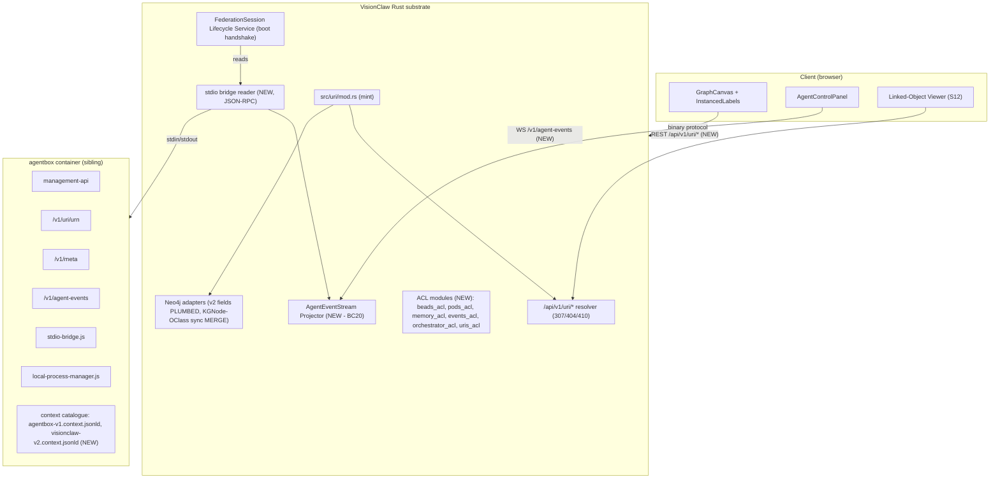

# PRD-006: VisionClaw ↔ Agentbox URI/JSON-LD Federation & Live Agent Observability

**Status:** Draft
**Author:** Architecture Agent (parallel-swarm audit)
**Date:** 2026-04-27
**Priority:** P0 — blocks federated agent commerce, linked-data viewer, BC20 ACL completion
**Related:** PRD-004 (agentbox↔VisionClaw integration), PRD-005 (v2 pipeline refactor), agentbox ADR-012 (JSON-LD adoption), agentbox ADR-013 (canonical URI grammar), DDD `ddd-agentbox-integration-context.md` (BC20 anti-corruption), ADR-058 (MAD→agentbox migration), ADR-050 (pod-backed KGNode schema), ADR-054 (URN/Solid alignment)

---

## 1. Problem Statement

We have **two correctly-designed Linked-Data substrates** that do not yet speak to each other.

**VisionClaw** (this repo) just landed the v2 IRI-first ontology pipeline (commit `581d4d1c1`). Every imported page now carries an `iri::` (HTTP IRI), `uri::` (URN of shape `urn:visionclaw:concept:<domain>:<slug>`), `rdf-type::`, `same-as::`, and `content-hash::` (in the form `sha256-12-<12 hex>`). Neo4j stores these on `:OntologyClass` nodes. Owner-scoped resources additionally carry an `owner_pubkey` (BIP-340 x-only hex).

**Agentbox** (`./agentbox`) ships the canonical URI grammar (ADR-013) — `did:nostr:<pubkey>` for identity, `urn:agentbox:<kind>:[<scope>:]<local>` for everything else — minted through one chokepoint (`management-api/lib/uris.js`), resolved at `/v1/uri/<urn>` with `307|404|410` semantics, and serves a build-time-pinned JSON-LD context catalogue at `/opt/agentbox/contexts/`.

Four parallel investigations (this PRD's evidence base) revealed the **integration is shallower than the docs suggest**:

| # | Finding | Severity | Evidence |
|---|---|---|---|
| F1 | v2 fields are written to Neo4j on ingest but **dropped on read** by `Neo4jGraphRepository::load_all_nodes_filtered()` — the in-memory `Node` carries `None` for `canonical_iri`, `visionclaw_uri`, `rdf_type`, `content_hash`, `quality_score`, `authority_score`. They reach neither GPU nor client. | P0 | `src/adapters/neo4j_graph_repository.rs:220-246` (Cypher SELECT omits v2 fields), `:358-367` (Node ctor hard-codes `None`) |
| F2 | `:KGNode` and `:OntologyClass` are **two parallel Neo4j collections with no sync bridge**. Ontology REST handlers fetch from one, graph/binary from the other. | P0 | `Neo4jOntologyRepository` vs `Neo4jGraphRepository` with disjoint schemas |
| F3 | Client agent spawn POSTs `/bots/spawn-agent-hybrid` and Rust dispatches to `TaskOrchestratorActor`, but **Rust never reads agentbox stdio**. Agentbox's `stdio-bridge.js` writes JSON-RPC to a stream nobody reads. **BC20 (FederationSession, AgentExecution, AdapterEndpointRegistry, ACL modules) is 0% implemented in Rust.** | P0 | `agentbox/management-api/adapters/orchestrator/stdio-bridge.js:33-44` writes; no `Command::stdout()` reader anywhere in `src/`. Zero matches for `FederationSession`, `AgentExecution`, `*_acl` in `src/`. |
| F4 | Client cannot observe agent lifecycle. `AgentMonitorActor` polls `/v1/status` every 3-15s; **no real-time event stream**. Agentbox writes events to JSONL on disk; nothing reads them; nothing projects them to WebSocket. | P0 | `src/actors/agent_monitor_actor.rs:1-96` (polling only); `agentbox/management-api/adapters/events/local-jsonl.js:46` (disk-only sink) |
| F5 | VisionClaw has **no central URN mint library**. The single mint site is `format!("urn:visionclaw:group:{}#members", team)` in `src/services/wac_mutator.rs:280`. Concept URNs are parsed off markdown `uri::` lines, never minted programmatically. A second, divergent grammar exists (`canonical_iri.rs`: `visionclaw:owner:{npub}/kg/{full_sha256_hex}`). | P0 | `src/services/wac_mutator.rs:280`, `src/utils/canonical_iri.rs:48` |
| F6 | **No `/api/v1/uri/<urn>` resolver on VC side.** PRD-005 plans `/api/v1/nodes/{id}/jsonld` keyed by Neo4j numeric id, not by URN. Agentbox's S12 viewer cannot dereference VC URIs. | P0 | grep across `src/handlers/`, `src/ap/routes/` returns zero `/uri/` routes |
| F7 | `owner_pubkey` leaks as **bare hex** at API boundaries instead of being wrapped as `did:nostr:<hex>`. | P1 | `src/models/node.rs:106` serialised as-is; no wrap in handlers |
| F8 | VisionClaw context (`https://visionclaw.dreamlab-ai.systems/ns/v2`) is **not in agentbox's pinned context catalogue** (`flake.nix` + `lib/linked-data-contexts.nix`); cross-substrate JSON-LD emission would fail-closed. | P1 | `agentbox/lib/linked-data-contexts.nix` lists 12 contexts, none VC |
| F9 | **Zero cross-substrate references in production code.** No bead/credential/event ever cites a VC URN; no VC node ever cites an agentbox URN. | P0 | grep `visionclaw` in `agentbox/management-api/` → 0; grep `urn:agentbox` in `src/` → 0 |
| F10 | The 12-hex content-hash form is **byte-identical** between VC and agentbox. Free win — no negotiation needed. | (positive) | `src/models/node.rs:142-144` vs `agentbox/management-api/lib/uris.js:_contentAddress()` |

The grammars are compatible in principle and the content-addressing convention already aligns; the **plumbing is missing**.

---

## 2. Goals

| # | Goal | Success Metric |
|---|------|----------------|
| G1 | v2 fields survive ingest→Neo4j→Graph→GPU→Client round-trip | A node minted with `iri/uri/content_hash/rdf_type` is observable via `GET /api/v1/nodes/{id}/jsonld` after a server restart |
| G2 | Single canonical URN minting library on VC side | `src/uri/mod.rs` is the only place URNs are generated; `wac_mutator.rs:280` and `canonical_iri.rs:48` route through it; lint forbids ad-hoc `format!("urn:visionclaw:...")` |
| G3 | URN-keyed resolver on VC side, semantically equal to agentbox's | `GET /api/v1/uri/<urn>` returns `307` (with Location to `/api/v1/nodes/{id}/jsonld`), `404`, or `410` — same contract as agentbox `/v1/uri/<urn>` |
| G4 | Agentbox grammar extended to recognise VC concept URNs | `urn:agentbox:thing:visionclaw:<domain>:<slug>` mints+resolves; VC concepts dereference via federation hop |
| G5 | `did:nostr:<pubkey>` wrap at every external boundary | bare-hex pubkey leaks fail a contract test; SDKs at API/WS/JSON-LD edges always emit `did:nostr:` |
| G6 | BC20 anti-corruption layer is real, not paper | Six ACL modules (`beads_acl`, `pods_acl`, `memory_acl`, `events_acl`, `orchestrator_acl`, `uris_acl`) compile and pass contract tests against agentbox sibling |
| G7 | Live agent observability via stdio bridge | A client clicks "spawn agent"; spawn → tool-use → completion events are visible in the UI within 1s of emission, sourced from agentbox stdout, not polling |
| G8 | Federation handshake | On agentbox boot, VC's BC20 service performs the `/v1/meta` handshake (image_hash + manifest_checksum + adapter_contract_versions + LocalFallbackProbe) before accepting executions |
| G9 | Context catalogue federation | VisionClaw's v2 context document is FOD-pinned in `agentbox/lib/linked-data-contexts.nix`; agentbox can emit JSON-LD that references VC terms without a runtime fetch |
| G10 | KGNode↔OntologyClass sync bridge | A v2 ontology page produces both a `:KGNode` (graph/physics) and a `:OntologyClass` (semantic), and they share `iri`/`uri`/`content_hash` via a single `MERGE` cypher block |

---

## 3. Non-Goals

- Replacing the binary protocol. v2 metadata reaches the client via JSON/JSON-LD side-channels, not by inflating the 48-byte position frame.
- Implementing all eleven agentbox JSON-LD surfaces (S1-S11) inside VisionClaw. We implement **only** S10 (architecture-doc cross-refs) and S11 (`/v1/meta` HTTP-meta).
- Replacing the `urn:visionclaw:concept:*` grammar with `urn:agentbox:thing:*`. Both forms coexist; the resolver mediates.
- Pod backend changes (ADR-053 stays). Solid pods remain authoritative for owner-scoped artefacts; federation only adds the resolver hop.
- CUDA kernel changes. Per-type GPU physics differentiation remains out of scope.
- Replacing `TaskOrchestratorActor`. The stdio bridge wraps it.

---

## 4. Architecture Overview



---

## 5. Detailed Design

### 5.1 Central URN minting library (`src/uri/mod.rs`)

```rust
// src/uri/mod.rs (NEW)
pub enum Kind {
    Concept,            // urn:visionclaw:concept:<domain>:<slug>      (R3 stable)
    Group,              // urn:visionclaw:group:<team>#members          (R3 stable)
    OwnedKgNode,        // urn:visionclaw:kg:<hex-pubkey>:<sha256-12-hex> (R1+R2 content+scope)
    Bead,               // urn:visionclaw:bead:<hex-pubkey>:<sha256-12-hex> (R1+R2)
    AgentExecution,     // urn:visionclaw:execution:<sha256-12-hex>     (R1)
    Did,                // did:nostr:<pubkey-hex>
}

pub fn mint_concept(domain: &str, slug: &str) -> String;
pub fn mint_owned_kg(pubkey: &str, payload_bytes: &[u8]) -> String;
pub fn mint_did_nostr(pubkey: &str) -> Result<String, UriError>;
pub fn mint_bead(pubkey: &str, payload: &serde_json::Value) -> String;
pub fn mint_execution(action: &str, slot: &str, pubkey: &str, ts: i64) -> String;

pub fn parse(urn: &str) -> Result<ParsedUri, UriError>;
pub fn is_canonical(urn: &str) -> bool;

pub fn content_hash_12(payload_bytes: &[u8]) -> String;   // "sha256-12-<12 hex>"
pub fn normalise_pubkey(input: &str) -> Result<String, UriError>;  // accepts hex|did:nostr|npub
```

**Invariants:**
- Same payload → same URI. Different payload → different URI. (R1)
- Owner-scoped kinds reject empty pubkey at mint time.
- `did:nostr:<hex>` is the **only** form pubkeys take at API boundaries; the substrate-internal hex form is never serialised externally.
- A clippy lint (`forbid-format-urn`) rejects any `format!` containing `"urn:visionclaw:"` outside `src/uri/`.

**Migration:** `wac_mutator.rs:280` and `canonical_iri.rs:48` both route through `mint_*` functions. The legacy `visionclaw:owner:<npub>/kg/<full-sha256>` form is preserved behind `mint_legacy_canonical_iri()` for ADR-054 compatibility, marked `#[deprecated]`.

### 5.2 URN-keyed resolver (`GET /api/v1/uri/<urn>`)

```rust
// src/handlers/uri_resolver.rs (NEW)
async fn resolve(urn: web::Path<String>) -> impl Responder {
    match crate::uri::parse(&urn)? {
        ParsedUri::Concept { domain, slug }       => redirect_307(format!("/api/v1/nodes/by-uri/{urn}/jsonld")),
        ParsedUri::OwnedKgNode { pubkey, hash }   => redirect_307(format!("/api/v1/nodes/by-uri/{urn}/jsonld")),
        ParsedUri::Did { pubkey }                 => redirect_307(format!("/api/v1/identity/{pubkey}/did.json")),
        ParsedUri::Bead { .. }                    => not_resolvable_404(),  // BC20 federates to agentbox
        _                                         => malformed_uri_400(),
    }
}
```

Symmetric with agentbox's `/v1/uri/<urn>` (`management-api/routes/uri-resolver.js:42-141`). Same error envelope, same status codes, same self-describing `GET /api/v1/uri` (no urn) response.

### 5.3 Plumb v2 fields through Neo4j read path

**`src/adapters/neo4j_graph_repository.rs:220-246`** — extend the Cypher SELECT to return the v2 fields already written by `:329-339`:

```cypher
RETURN n.id, n.metadata_id, n.label,
       n.canonical_iri, n.visionclaw_uri, n.rdf_type,
       n.same_as, n.content_hash, n.quality_score,
       n.authority_score, n.preferred_term_v2, n.graph_source,
       n.x, n.y, n.z, n.vx, n.vy, n.vz, n.owner_pubkey, ...
```

**`:358-367`** — replace the hard-coded `None` initialisations with `row.get("canonical_iri").ok()`-style reads. **Add a regression test** that writes a node with all v2 fields, restarts, reads, and asserts every field round-trips.

### 5.4 KGNode↔OntologyClass sync bridge

A v2 ontology page (`iri::` + `rdf-type:: owl:Class`) currently produces:
- a `:KGNode` via `KnowledgeGraphParser` + `Neo4jGraphRepository`
- a `:OntologyClass` via `OntologyParser` + `Neo4jOntologyRepository`

These have **disjoint schemas** despite representing the same concept. The fix is a single `MERGE` block per page, parameterised on `iri`:

```cypher
MERGE (k:KGNode { canonical_iri: $iri })
ON CREATE SET k.id = $id, k.metadata_id = $metadata_id
SET k.visionclaw_uri = $uri, k.rdf_type = $rdf_type,
    k.content_hash = $content_hash, k.label = $label, ...

MERGE (o:OntologyClass { iri: $iri })
SET o.uri = $uri, o.rdf_type = $rdf_type, o.content_hash = $content_hash, ...

MERGE (k)-[:HAS_ONTOLOGY]->(o)
```

`HAS_ONTOLOGY` lets a single graph load fetch both rows in one Cypher call. `Neo4jGraphRepository` is extended with `load_with_ontology()` returning `(Node, Option<OwlClass>)`. Existing `load_all_nodes_filtered()` keeps its current signature for the binary path; the new method is used by `/api/v1/nodes/{id}/jsonld`.

### 5.5 BC20 anti-corruption layer (`src/bc20/`)

Six modules, one per agentbox adapter slot plus the URI translator:

```
src/bc20/
  mod.rs                      // BC20 facade
  federation_session.rs       // FederationSession aggregate (DDD §4.1)
  federation_lifecycle.rs     // /v1/meta handshake, LocalFallbackProbe (DDD §4.1a)
  adapter_registry.rs         // AdapterEndpointRegistry (DDD §4.3)
  agent_execution.rs          // AgentExecution aggregate (DDD §4.2)
  acl/
    mod.rs
    beads_acl.rs              // bd-CLI ↔ BeadProvenance
    pods_acl.rs               // Solid LDP ↔ VC pod artefact URIs
    memory_acl.rs             // generic vector ↔ VC namespace layout
    events_acl.rs             // agentbox JSONL ↔ Contributor Stratum bus
    orchestrator_acl.rs       // stdio spawn ↔ actor spawn
    uris_acl.rs               // urn:agentbox:* ↔ urn:visionclaw:*
```

Each ACL module exports `to_visionclaw(agentbox_payload) -> Result<VcDomainEvent, AclError>` and `to_agentbox(vc_command) -> AgentboxWire`. Translation must be **total** — unmapped payloads raise `UnmappedAgentboxPayload` per DDD §5 rule 4.

**`uris_acl.rs`** specifically:
- `urn:agentbox:bead:<scope>:<hash>` → `urn:visionclaw:bead:<scope>:<hash>` (1:1)
- `urn:agentbox:thing:visionclaw:<domain>:<slug>` ↔ `urn:visionclaw:concept:<domain>:<slug>` (federation form)
- `did:nostr:<pubkey>` is invariant across both substrates

### 5.6 Federation handshake (`/v1/meta` boot)

`FederationSessionLifecycleService::start()`:

1. Wait for agentbox sibling readiness probe
2. `GET http://agentbox:9190/v1/meta` — read `image_hash`, `manifest_checksum`, `adapter_contract_versions`, `federation_mode`
3. Verify `federation_mode == "client"`. Fail-closed otherwise (`FederationMisconfigured`)
4. Compare every adapter contract version against `AdapterEndpointRegistry::compat_ranges` (semver intersect). Fail with `AdapterContractVersionMismatch`
5. For every slot: `GET <endpoint>/probe/origin`, verify Ed25519 signature against the registered key. Fail with `LocalFallbackProbeFailed`
6. Emit `FederationSessionStarted` with the resolved bindings
7. Total p95 ≤ 2s; no caching; runs on every session start

### 5.7 Live agent stdio bridge

**Reader side (Rust, NEW):**

```rust
// src/bc20/orchestrator_stdio_reader.rs (NEW)
let child = Command::new("docker")
    .args(["exec", "-i", "agentbox", "node", "/app/management-api/adapters/orchestrator/stdio-bridge.js"])
    .stdin(Stdio::piped())
    .stdout(Stdio::piped())
    .stderr(Stdio::piped())
    .spawn()?;

let stdout = BufReader::new(child.stdout.take().unwrap());
tokio::spawn(async move {
    let mut lines = stdout.lines();
    while let Some(line) = lines.next_line().await? {
        let event: AgentboxEvent = serde_json::from_str(&line)?;
        let vc_event = events_acl::to_visionclaw(event)?;
        agent_event_bus.publish(vc_event).await;  // → Neo4j + WebSocket
    }
});
```

**WebSocket out (`/v1/agent-events`):** new SSE/WS handler in `src/handlers/agent_events_handler.rs`. Subscribes to `agent_event_bus`, filters by `(execution_id | session_id)`, projects each `AgentEvent { kind: Spawned|ToolUsed|Progress|Completed|Failed }` to JSON. Client `BotsControlPanel` switches from polling to subscribing.

**Persistence:** every event also lands in Neo4j as a `(:AgentEvent { kind, ts, execution_id, payload })`-`[:OF_EXECUTION]`->`(:AgentExecution)`. Replay by execution_id is supported via `GET /api/v1/executions/{id}/events`.

### 5.8 Context catalogue federation

`agentbox/lib/linked-data-contexts.nix` adds:

```nix
visionclaw-v2 = {
  url = "https://visionclaw.dreamlab-ai.systems/ns/v2";
  hash = "sha256-AAAAAAAAAAAAAAAAAAAAAAAAAAAAAAAAAAAAAAAAAAA=";  # FOD; resolved by prefetch
  destination = "/opt/agentbox/contexts/visionclaw-v2.context.jsonld";
};
```

VC publishes the context document at `docs/schema/visionclaw-ontology-schema-v2.jsonld` (already planned in PRD-005 §5.4.1). `scripts/prefetch-hashes.sh --linked-data` resolves the SRI hash. Agentbox's `agbx:` registry adds reciprocal aliases for VC-only terms with no upstream W3C equivalent (`vc:bridges-to`, `vc:quality-score`, `vc:authority-score`).

### 5.9 Agentbox-side: register the `concept` kind

`agentbox/management-api/lib/uris.js` `KINDS` table extends:

```javascript
thing: { ownerScope: false, contentAddressed: false, resolvableSurface: 'thing-resolver',
         externalNamespaces: { visionclaw: 'urn:visionclaw:concept:' } },
```

`/v1/uri/urn:agentbox:thing:visionclaw:<domain>:<slug>` resolves with a `307` to the VC sibling's `/api/v1/uri/urn:visionclaw:concept:<domain>:<slug>` resolver (federation hop). 404 if VC sibling unreachable.

### 5.10 Domain model deltas

| File | Change |
|---|---|
| `src/models/node.rs` | No new fields; serde sets `did_nostr` from `owner_pubkey` at boundary |
| `src/models/agent_execution.rs` | NEW — `AgentExecution`, `AgentExecutionId`, `ExecutionStatus`, `AgentEvent` |
| `src/models/federation_session.rs` | NEW — `FederationSession`, `FederationSessionId`, `AdapterBindings` |
| `src/ports/uri_resolver.rs` | NEW port |
| `src/handlers/uri_resolver_handler.rs` | NEW |
| `src/handlers/agent_events_handler.rs` | NEW (WS/SSE) |
| `src/handlers/jsonld_handler.rs` | NEW (`GET /api/v1/nodes/{id}/jsonld`, `GET /api/v1/nodes/by-uri/{urn}/jsonld`) |
| `src/adapters/neo4j_graph_repository.rs` | EXTEND — Cypher SELECT + Node ctor |
| `src/adapters/neo4j_ontology_repository.rs` | EXTEND — `MERGE (:KGNode)-[:HAS_ONTOLOGY]->(:OntologyClass)` |
| `src/services/wac_mutator.rs` | REFACTOR — route through `src/uri/mod.rs` |
| `src/utils/canonical_iri.rs` | DEPRECATE in favour of `src/uri/mod.rs` mint functions |

### 5.11 Files & deltas summary

```
NEW (~3,500 LoC Rust):
  src/uri/{mod.rs, kinds.rs, parse.rs, validate.rs}
  src/bc20/{mod.rs, federation_session.rs, federation_lifecycle.rs,
            adapter_registry.rs, agent_execution.rs,
            orchestrator_stdio_reader.rs}
  src/bc20/acl/{mod.rs, beads_acl.rs, pods_acl.rs, memory_acl.rs,
                events_acl.rs, orchestrator_acl.rs, uris_acl.rs}
  src/handlers/{uri_resolver_handler.rs, agent_events_handler.rs, jsonld_handler.rs}
  src/models/{agent_execution.rs, federation_session.rs}
  src/ports/uri_resolver.rs
  docs/schema/visionclaw-ontology-schema-v2.jsonld

EXTEND:
  src/adapters/neo4j_graph_repository.rs  (~80 lines)
  src/adapters/neo4j_ontology_repository.rs (~60 lines)
  src/services/wac_mutator.rs              (~10 lines refactor)
  src/utils/canonical_iri.rs               (~30 lines deprecation shim)

NEW (~600 LoC JS in agentbox):
  agentbox/management-api/lib/uris.js          KINDS extension + visionclaw federation hop
  agentbox/management-api/routes/uri-resolver.js  thing→visionclaw federation case
  agentbox/lib/linked-data-contexts.nix         visionclaw-v2 entry
  agentbox/docs/reference/_vocab/agbx.md        register vc: aliases
```

---

## 6. Phased Rollout

| Phase | Scope | Target | Gate |
|---|---|---|---|
| **P1** Plumbing | F1, F2, F10 | 2026-05-09 | v2 fields round-trip Neo4j↔Graph; KGNode↔OntologyClass MERGE; regression test green |
| **P2** Mint+Resolver | G2, G3, G4, G5, G7-bare-pubkey | 2026-05-23 | `src/uri/mod.rs` is sole mint chokepoint; `/api/v1/uri/<urn>` returns 307/404/410; clippy lint blocks ad-hoc URN format!; agentbox `concept` kind registered |
| **P3** BC20 ACL | G6, G8 | 2026-06-13 | Six ACL modules compile; `/v1/meta` handshake green; LocalFallbackProbe verifies signatures; cross-substrate contract test passes |
| **P4** Live agent observability | G7 | 2026-06-27 | UI shows agent events <1s after emission; stdio reader doesn't deadlock under sustained load; replay endpoint works |
| **P5** JSON-LD federation | G9 | 2026-07-04 | Visionclaw context FOD-pinned in agentbox; agentbox emits a bead referencing a VC concept URN; round-trip `expand→compact` is identity |

---

## 7. Open Questions

1. **Stdio bridge transport.** Should Rust spawn `docker exec -i agentbox …` per-execution, or should it open a single long-lived stdio session at startup and multiplex? Recommend: long-lived; per-execution `docker exec` adds 200-500ms latency per spawn.
2. **Federation hop loops.** `urn:agentbox:thing:visionclaw:*` resolves via VC; `urn:visionclaw:bead:*` resolves via agentbox. If both 404, we need a "tried and failed" cache to avoid pathological retries. Recommend 5-min TTL negative cache.
3. **Context document hosting.** VC currently hosts no public `/ns/v2`. Recommend: `docs/schema/visionclaw-ontology-schema-v2.jsonld` + `Vary: Accept` on management API root + DNS only after the schema is signed/frozen.
4. **Agent execution privacy.** Should agent-event WS subscription enforce visibility filters (only events whose `requester == ws_user_pubkey`)? Recommend yes by default; `events.broadcast = "all"` is opt-in per session.
5. **Solid Pod identity.** `did:nostr:<pubkey>` resolution today returns the pod's `/.well-known/did.json`. Should we serve a DID document directly from VC for non-pod-bound identities? Defer to ADR-040 (enterprise identity) follow-up.

---

## 8. References

- DDD: [`docs/ddd-agentbox-integration-context.md`](ddd-agentbox-integration-context.md)
- agentbox ADR-013: [`agentbox/docs/reference/adr/ADR-013-canonical-uri-grammar.md`](../agentbox/docs/reference/adr/ADR-013-canonical-uri-grammar.md)
- agentbox ADR-012: [`agentbox/docs/reference/adr/ADR-012-jsonld-federation-grammar.md`](../agentbox/docs/reference/adr/ADR-012-jsonld-federation-grammar.md)
- agentbox `agbx:` vocab: [`agentbox/docs/reference/_vocab/agbx.md`](../agentbox/docs/reference/_vocab/agbx.md)
- VC v2 PRD: [`docs/PRD-v2-pipeline-refactor.md`](PRD-v2-pipeline-refactor.md)
- Sibling QE PRD: [`docs/PRD-QE-001-integration-quality-engineering.md`](PRD-QE-001-integration-quality-engineering.md)
