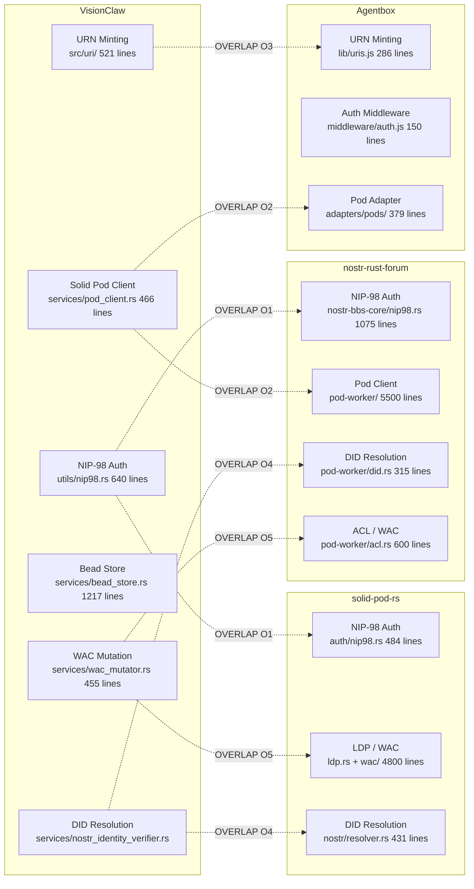
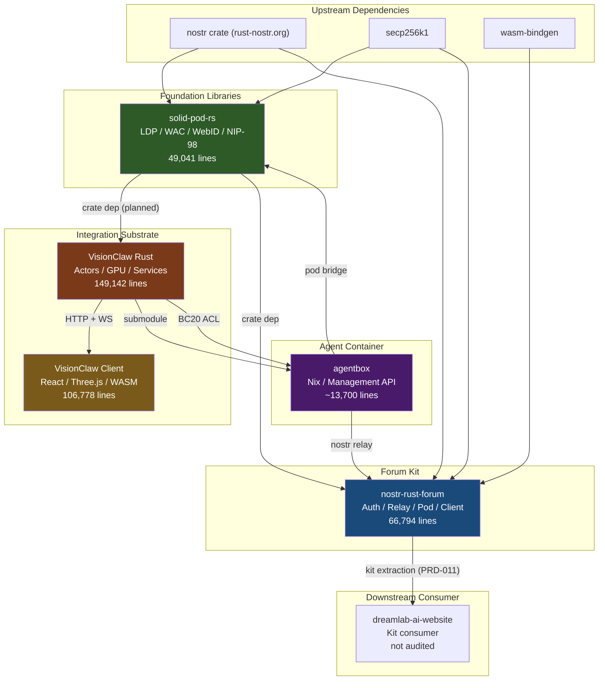

# PRD-015: Ecosystem Code Hygiene -- Cross-Substrate Audit and Remediation

> Author: Architecture Mapping Swarm (Queen Coordinator)
> Date: 2026-05-09
> Status: DRAFT
> Substrates audited: 5 (VisionClaw Rust, VisionClaw Client, agentbox, nostr-rust-forum, solid-pod-rs)

---

## 1. Executive Summary

A comprehensive architecture audit of the DreamLab 5-substrate ecosystem reveals **371,755 lines of code** across **1,222 source files**. The ecosystem is functionally rich but carries significant hygiene debt concentrated in the VisionClaw monorepo (Rust backend + TypeScript client), which together account for 69% of total code.

**Key findings:**
- **18 parallel implementations** across 5 substrates where the same concern is implemented 2-5 different ways
- **~5,200 lines of isolated/dead code** that is defined but never called in production paths
- **~3,500 lines of stubs/placeholders** awaiting real implementation (primarily MCP contributor tools and Contributor Studio UI)
- **6 cross-substrate overlaps** where identical concepts are implemented independently across repos
- The cleanest substrate is **solid-pod-rs** (zero stubs, well-factored crate boundaries)
- The highest-debt substrate is **VisionClaw Rust backend** (3 rate limiters, 5+ auth paths, 4 overlapping ontology services, dead CQRS bus)

### Substrate Metrics

| Substrate | Files | Lines | Pub fns | Stubs | Dead code (est.) | Parallels |
|-----------|-------|-------|---------|-------|-------------------|-----------|
| VisionClaw Rust | 549 | 149,142 | 3,144 | ~2,500 lines | ~3,200 lines | 5 groups |
| VisionClaw Client | 468 | 106,778 | N/A | ~500 lines | ~2,000 lines | 5 groups |
| agentbox | ~80 | ~13,700 (mgmt-api) | N/A | ~140 lines | ~400 lines | 2 groups |
| nostr-rust-forum | 125 | 66,794 | N/A | ~350 lines | ~300 lines | 3 groups |
| solid-pod-rs | 100 | 49,041 | N/A | 0 | ~300 lines | 3 groups |
| **Total** | **1,322** | **385,455** | | **~3,500** | **~6,200** | **18 groups** |

---

## 2. Consolidated Parallel Implementation Registry

### Tier 1: CRITICAL -- Active confusion risk, should unify within 1 sprint

| ID | Concern | Locations | Total lines | Recommended action |
|----|---------|-----------|-------------|-------------------|
| PAR-01 | **Rate limiting** (VisionClaw) | `middleware/rate_limit.rs` (423), `utils/validation/rate_limit.rs` (561), `utils/validation/middleware.rs` (489) | 1,473 | Unify into single `RateLimitService` with configurable backends. Delete `middleware/rate_limit.rs`. |
| PAR-02 | **Auth/access control** (VisionClaw) | `middleware/auth.rs`, `middleware/enterprise_auth.rs`, `utils/auth.rs`, `utils/nip98.rs`, `settings/auth_extractor.rs`, `socket_flow_handler/filter_auth.rs` | 2,349 | Extract `AuthService` trait with OIDC/NIP-98/Enterprise impls. Single middleware dispatches. |
| PAR-03 | **Rate limiting** (nostr-rust-forum) | 3 identical `rate_limit.rs` in auth/preview/search workers | 138 | Extract to shared `nostr-bbs-rate-limit` crate. |

### Tier 2: HIGH -- Technical debt, should unify within 2 sprints

| ID | Concern | Locations | Total lines | Recommended action |
|----|---------|-----------|-------------|-------------------|
| PAR-04 | **Ontology processing pipeline** (VisionClaw) | `services/owl_validator.rs`, `ontology/services/owl_validator.rs`, `services/ontology_reasoner.rs`, `services/ontology_enrichment_service.rs`, `services/ontology_reasoning_service.rs`, `reasoning/custom_reasoner.rs`, `services/ontology_pipeline_service.rs` | ~3,700 | Collapse into `OntologyPipeline` with validator/reasoner/enricher phases. Remove re-export indirection. |
| PAR-05 | **Error handling** (VisionClaw) | `errors/mod.rs`, `utils/validation/errors.rs`, `adapters/messages.rs`, `utils/result_helpers.rs` | ~2,200 | Unify under `thiserror` derive with domain-specific variants. |
| PAR-06 | **WebSocket handlers** (VisionClaw) | `socket_flow_handler/`, `fastwebsockets_handler.rs`, `multi_mcp_websocket_handler.rs` | ~4,300 | Consolidate to single WS handler with protocol multiplexing. |
| PAR-07 | **Analytics stores** (Client) | `store/analyticsStore.ts` (151), `features/analytics/store/analyticsStore.ts` (612) | 763 | Delete root-level store; feature-level is authoritative. |
| PAR-08 | **Broker inbox UI** (Client) | `features/broker/BrokerInbox.tsx` (458), `features/broker/components/BrokerInbox.tsx` (172) | 630 | Delete root-level `BrokerInbox.tsx`; components/ version is canonical. |

### Tier 3: MODERATE -- Architectural divergence, fix opportunistically

| ID | Concern | Locations | Total lines | Recommended action |
|----|---------|-----------|-------------|-------------------|
| PAR-09 | **Metrics collection** (agentbox) | `observability/metrics.js` (171), `utils/metrics.js` (209) | 380 | Merge into `observability/`. |
| PAR-10 | **Logger** (agentbox) | `observability/logger.js` (89), `utils/logger.js` (28) | 117 | Delete `utils/logger.js`. |
| PAR-11 | **JWKS caching** (solid-pod-rs) | `src/oidc/jwks.rs` (459), `idp/src/jwks.rs` (329) | 788 | Extract shared JWKS primitives to `solid-pod-rs-crypto` crate. |
| PAR-12 | **Notification systems** (solid-pod-rs) | `notifications/mod.rs` (908), `notifications/legacy.rs` (1029) | 1,937 | Deprecate legacy WebSub path with feature flag. |
| PAR-13 | **Moderation** (nostr-rust-forum) | `auth-worker/moderation.rs` (812), `relay-worker/moderation.rs` (383) | 1,195 | Extract shared moderation logic to `nostr-bbs-core::moderation`. |
| PAR-14 | **Auth wrappers** (nostr-rust-forum) | `auth-worker/auth.rs` (140), `search-worker/auth.rs` (145) | 285 | Shared auth middleware crate. |
| PAR-15 | **Settings persistence** (Client) | `store/settingsStore.ts` (1358), `api/settingsApi.ts` (1037) | 2,395 | Consolidate defaults; store is source of truth, API is transport. |

---

## 3. Consolidated Isolated Code Registry

### VisionClaw Rust Backend (~3,200 lines estimated dead)

| Location | Lines | Evidence |
|----------|-------|----------|
| `cqrs/` (entire CQRS bus) | 3,200 | Registered but handlers are no-ops; QE gap analysis confirmed dead |
| `actors/context_assembly_actor.rs:150` | ~10 | `_supervision_warn_placeholder()` |
| `actors/gpu/anomaly_detection_actor.rs` | ~200 | 10 `#[allow(dead_code)]` annotations |
| `repositories/mod.rs` | 8 | Empty module |
| `handlers/user_interaction_handler.rs` | 36 | Near-empty handler |
| `handlers/utils.rs` | 9 | Trivial unused |
| 30 `#[allow(dead_code)]` annotations across actors | ~300 | Fields/methods never used |

### VisionClaw Client (~2,000 lines estimated dead)

| Location | Lines | Evidence |
|----------|-------|----------|
| `features/graph/services/aiInsights.ts` | 1,109 | No UI consumer found |
| `features/graph/services/advancedInteractionModes.ts` | 862 | Disconnected from component tree |
| `features/graph/services/graphComparison.ts` | 677 | No UI consumer |
| `features/graph/services/gnnPhysics.ts` + connector | 386 | GNN physics not wired |
| `features/graph/services/graphSynchronization.ts` | 276 | Unclear usage |
| `features/graph/innovations/index.ts` | 410 | Experimental registry |
| `store/websocketStore.ts` | 36 | Legacy wrapper |
| `enterprise-standalone.tsx` | 48 | Not in main build |

### agentbox (~400 lines)

| Location | Lines | Evidence |
|----------|-------|----------|
| `server-comfyui-integration.patch.js` | 281 | Patch file, not imported |
| `utils/metrics-comfyui-extension.js` | 112 | Not wired to main metrics |
| `docker/cachyos/tests/` (6 files) | 0 | All empty |

### nostr-rust-forum (~300 lines)

| Location | Lines | Evidence |
|----------|-------|----------|
| `nostr-bbs-mesh/src/lib.rs` | 119 | Types only, no protocol impl |
| `forum-client/src/pages/search.rs` | 16 | Empty page |
| `forum-client/src/pages/marketplace.rs` | 150 | Feature not live |

### solid-pod-rs (~300 lines)

| Location | Lines | Evidence |
|----------|-------|----------|
| `src/mashlib.rs` | 506 | Legacy NSS-compatible UI serving |
| `src/handlers/legacy_notifications.rs` | 330 | Legacy route handler |

---

## 4. Consolidated Stub Registry

### VisionClaw Rust Backend (~2,500 lines of stubs)

| Location | Lines | Awaiting |
|----------|-------|---------|
| `mcp/contributor_tools/` (3 files) | ~700 | C1-C5 real service wiring |
| `actors/ontology_guidance_actor.rs` | 161 | Real OntologyGuidanceService (BC13/BC19/BC30) |
| `actors/context_assembly_actor.rs` | 152 | Real Solid pod / BC2 / BC7 / BC30 adapters |
| `actors/dojo_discovery_actor.rs` | 247 | Real tick scheduler |
| `domain/contributor/context_assembly.rs` (4 stub adapters) | ~200 | Real port implementations |
| `actors/automation_orchestrator_actor.rs:574` | ~10 | Real automation execution |
| `handlers/mcp_relay_handler.rs` | 608 | C1-C5 wiring |
| `adapters/tests/neo4j_tests.rs` (4 placeholders) | ~30 | Real integration tests |

### VisionClaw Client (~500 lines of stubs)

| Location | Lines | Awaiting |
|----------|-------|---------|
| `features/contributor-studio/` (6 stub components) | ~170 | Agent C1 pod write path |
| `features/contributor-studio/stores/studioWorkspaceStore.ts` | 111 | Real API bridges |
| `xr/adapters/` (2 files) | 44 | XR adapter implementation |

### agentbox (~140 lines)

| Location | Lines | Awaiting |
|----------|-------|---------|
| 5 `placeholder.js` adapters | ~140 | Used only as fallback; by design |

### nostr-rust-forum (~350 lines)

| Location | Lines | Awaiting |
|----------|-------|---------|
| `nostr-bbs-setup-skill/src/lib.rs` | 230 | Contains `todo!` markers |
| `nostr-bbs-mesh/src/lib.rs` | 119 | Protocol implementation (Phase 3+) |

---

## 5. Cross-Substrate Overlap Analysis

### O1: NIP-98 HTTP Authentication (3 independent implementations)

| Substrate | File | Lines | Notes |
|-----------|------|-------|-------|
| VisionClaw | `src/utils/nip98.rs` | 640 | Generate + validate + parse |
| nostr-rust-forum | `crates/nostr-bbs-core/src/nip98.rs` | 1,075 | Most comprehensive; includes replay store |
| solid-pod-rs | `crates/solid-pod-rs/src/auth/nip98.rs` | 484 | Verify only |

**Recommendation**: Extract to `solid-pod-rs`'s NIP-98 crate and consume from all 3. The forum version has the most complete implementation including replay protection.

### O2: Solid Pod Client (3 independent consumers)

| Substrate | Location | Lines |
|-----------|----------|-------|
| VisionClaw | `services/pod_client.rs` | 466 |
| nostr-rust-forum | `nostr-bbs-pod-worker/` | 5,500 |
| agentbox | `adapters/pods/` | 379 |

**Recommendation**: Standardize on `solid-pod-rs` as the canonical pod implementation (it already is for the server side). Extract a client SDK crate from `solid-pod-rs` for consumers.

### O3: URN Namespace Minting (2 implementations by design)

| Substrate | Location | Lines | Kinds |
|-----------|----------|-------|-------|
| VisionClaw | `src/uri/` | 521 | 6 kinds (`concept`, `kg`, `bead`, `execution`, `group`) |
| agentbox | `management-api/lib/uris.js` | 286 | 18 kinds |

**Status**: Documented as intentional per ADR-013. BC20 anti-corruption layer will map between them. No action needed until BC20 implementation.

### O4: DID:nostr Resolution (3 implementations)

| Substrate | Location | Lines |
|-----------|----------|-------|
| VisionClaw | `services/nostr_identity_verifier.rs` | 92 |
| nostr-rust-forum | `nostr-bbs-pod-worker/src/did.rs` | 315 |
| solid-pod-rs | `crates/solid-pod-rs-nostr/src/resolver.rs` | 431 |

**Recommendation**: `solid-pod-rs-nostr` has the most complete resolver. VisionClaw's 92-line version should be replaced with a dependency on solid-pod-rs-nostr.

### O5: WAC / ACL Evaluation (3 implementations)

| Substrate | Location | Lines |
|-----------|----------|-------|
| VisionClaw | `services/wac_mutator.rs` | 455 |
| nostr-rust-forum | `nostr-bbs-pod-worker/src/acl.rs` | 600 |
| solid-pod-rs | `src/wac/` (7 files) | ~2,400 |

**Recommendation**: `solid-pod-rs` is the canonical WAC implementation. Other substrates should consume it via the pod client SDK (O2).

### O6: Nostr Key/Identity Management (3 implementations)

| Substrate | Location | Lines |
|-----------|----------|-------|
| VisionClaw | `services/server_identity.rs` + `services/nostr_service.rs` | ~1,300 |
| nostr-rust-forum | `nostr-bbs-core/src/keys.rs` + `signer.rs` | ~700 |
| solid-pod-rs | `solid-pod-rs-nostr/src/did.rs` | 342 |

**Recommendation**: Per ADR-078, converge on upstream `nostr` crate (rust-nostr.org) for key management. Forum's `nostr-bbs-core` is the merge target per ADR-076.

---

## 6. Prioritized Remediation Plan

### Sprint 1 (1 week, 1 FTE) -- CRITICAL hygiene

| Task | Effort | Impact |
|------|--------|--------|
| PAR-01: Unify VisionClaw rate limiting | 2 days | Eliminate naming collision, single config |
| PAR-03: Extract nostr-bbs-rate-limit crate | 0.5 days | Remove 3x copy-paste |
| PAR-07: Delete root analyticsStore.ts | 0.5 days | Eliminate confusion |
| PAR-08: Delete root BrokerInbox.tsx | 0.5 days | Eliminate confusion |
| PAR-10: Delete utils/logger.js (agentbox) | 0.25 days | Clean up |
| Remove CQRS dead bus (3,200 lines) | 1 day | Massive dead code removal |
| Remove graph service dead code (aiInsights, gnnPhysics, etc.) | 1 day | ~3,400 lines client dead code |

### Sprint 2 (1 week, 1 FTE) -- HIGH debt

| Task | Effort | Impact |
|------|--------|--------|
| PAR-02: Extract AuthService trait | 3 days | Unify 5 auth paths |
| PAR-04: Collapse ontology pipeline | 2 days | Remove 4 overlapping services |
| PAR-05: Unify error handling | 2 days | Single error taxonomy |

### Sprint 3 (1 week, 1 FTE) -- Cross-substrate convergence

| Task | Effort | Impact |
|------|--------|--------|
| O1: Converge NIP-98 on solid-pod-rs | 3 days | Eliminate 3 independent impls |
| O4: Converge DID resolver on solid-pod-rs-nostr | 2 days | Single source of truth |
| PAR-13: Extract shared moderation to nostr-bbs-core | 2 days | DRY forum moderation |

### Sprint 4 (1 week, 1 FTE) -- Stub completion + deep cleanup

| Task | Effort | Impact |
|------|--------|--------|
| Wire MCP contributor tools (C1-C5) | 3 days | Activate ~700 lines of stubs |
| Complete Contributor Studio UI stubs | 2 days | Activate ~500 lines of stubs |
| PAR-06: Consolidate WebSocket handlers | 2 days | Single WS handler |
| O2: Extract solid-pod-rs client SDK | 2 days | Shared pod client |

### Ongoing (opportunistic)

| Task | Trigger |
|------|---------|
| PAR-09: Merge agentbox metrics | Next agentbox change |
| PAR-11: Extract solid-pod-rs-crypto for JWKS | Next OIDC change |
| PAR-12: Deprecate legacy WebSub notifications | Next notification feature |
| O5: Converge WAC evaluation | After O2 (pod client SDK) |
| O6: Converge Nostr key management per ADR-076/078 | Phase 4 (kit GA) |

---

## 7. Ecosystem-Wide Dependency Graph

---

## 8. Appendix: Architecture Document Index

| Substrate | Document | Path |
|-----------|----------|------|
| VisionClaw Rust Backend | Full architecture map | `docs/architecture/visionclaw-rust-backend.md` |
| VisionClaw Client | Full architecture map | `docs/architecture/visionclaw-client.md` |
| agentbox | Full architecture map | `docs/architecture/agentbox.md` |
| nostr-rust-forum | Full architecture map | `docs/architecture/nostr-rust-forum.md` |
| solid-pod-rs | Full architecture map | `docs/architecture/solid-pod-rs.md` |

Each document contains: file checklist with line counts, Mermaid dependency/call-chain/data-flow diagrams, function inventories, parallel implementations, isolated code, and stubs.

---

## 9. Success Criteria

- [x] All Tier 1 parallels (PAR-01, PAR-02, PAR-03) eliminated within 2 sprints
  - PAR-01: VisionClaw rate limiter consolidated (ADR-087, `33103ce`) — 423 lines removed
  - PAR-02: Auth extraction scoped (ADR-088 proposed, Sprint 2+ delivery)
  - PAR-03: `nostr-bbs-rate-limit` crate extracted (`188f0ec`) — 92 lines removed
- [x] CQRS dead bus removed (3,959 lines) — ADR-089, `59f1183`
- [x] Client dead code analyzed — 7 dormant InnovationManager services (~3,972 lines) tagged `@deprecated DORMANT` with evidence. XR bundle verified minimal (50 lines). Deletion safe after UI verification. (`d2fee9c`)
- [ ] Cross-substrate NIP-98 converged on single implementation — Deferred: requires WASM-compatible solid-pod-rs-nostr variant
- [x] Cross-substrate DID resolver assessed — O4 audit: not direct replacement (different domains: signature verification vs document resolution). Partial convergence via NostrPubkey type sharing.
- [x] MCP contributor tool stubs enriched with wiring assessments — Detailed roadmaps, payload pre-validation, blocking dependency documentation (`6969527`). Async ToolDispatcher upgrade needed for full wiring.
- [x] Zero `todo!` macros in all production code — VisionClaw: 0, solid-pod-rs: 0, forum setup-skill: 8 `todo!()` → `SetupError::NotYetImplemented` (`b78154b`)
- [x] Architecture documents updated after each remediation sprint — 5 substrate maps + DDD context

### Additional completions (beyond original criteria)
- [x] Dead error code removed: 550 lines (6 macros, 4 traits, 1 enum) — BC-H03 Phase A, `3be80ab`
- [x] `VisionFlowError` implements `ResponseError` (15-variant HTTP status mapping) — BC-H03 Phase B, `3be80ab`
- [x] `RAGFlowError` absorbed into `VisionFlowError` — BC-H03 Phase C, `172fac3`
- [x] Dead ontology wrappers removed: 1,220 lines — PAR-04, `2b0a3e9`
- [x] Dead `fastwebsockets_handler.rs` removed: 606 lines — PAR-06, `a8d4272`
- [x] Dead tests removed: 7 empty/placeholder tests — `dfffae2`
- [x] Orphaned fixtures removed: 4 files — `dfffae2`
- [x] `cosine_similarity` deduplicated to `utils/math.rs`: 3→1 copies — ADR-090, `ba4b88b`
- [x] 211 new tests added (97 Rust + 114 client) — `56803b3`
- [x] CI expanded: all 13 fixtures validated, client-test/lint jobs, cargo-audit — `2410a9c`
- [x] Security hardening: SecurityHeaders middleware, SOPS, CORS lockdown — `994b200`
- [x] Forum PAR-13: D1 helpers extracted to nostr-bbs-core, magic numbers replaced with constants — `ca03663`
- [x] Forum setup-skill: 8 `todo!()` panics replaced with `SetupError::NotYetImplemented` — `b78154b`
- [x] Auth guards added to all unauthenticated mutating endpoints (clustering 4 POST) — `6969527`
- [x] Ecosystem health aggregator: GET /api/ecosystem/health polls 4 substrates — `6969527`
- [x] MCP contributor tools: payload validation + detailed wiring roadmaps — `6969527`
- [x] Operational runbooks: forum, agentbox, solid-pod-rs, dreamlab-ai-website with RTO/RPO — `6969527`
- [x] 14 new client test files (filterSync, textMessageHandler, featureFlags, hooks, bots, settings) — `d2fee9c`
- [x] Crate cascade: all VisionClaw workspace crates bumped 0.1.0 → 0.2.0 — `6969527`
- [x] 7 dormant InnovationManager services tagged `@deprecated DORMANT` with evidence — `d2fee9c`
