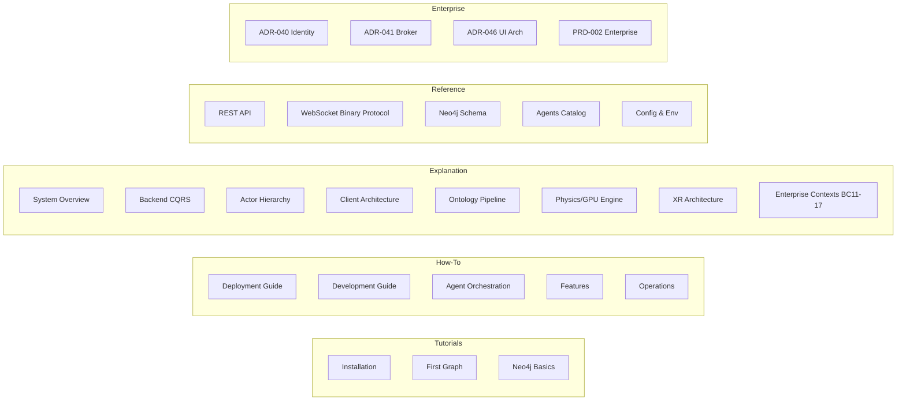

# VisionClaw Documentation

> **Real-time 3D knowledge graph exploration** powered by Rust, CUDA GPU physics, OWL 2 ontology reasoning, and a multi-agent AI mesh.

[← Back to Project](../README.md) | [Quick Start](#quick-start) | [API Reference](reference/rest-api.md) | [Architecture](explanation/system-overview.md)

---

## Quick Start

```bash
git clone https://github.com/DreamLab-AI/VisionClaw.git
cd VisionClaw && cp .env.example .env
docker-compose --profile dev up -d
```

Open [http://localhost:3001](http://localhost:3001) for the 3D graph interface, [http://localhost:4000/api](http://localhost:4000/api) for the REST API, and [http://localhost:7474](http://localhost:7474) for the Neo4j browser.

Full setup details: [Deployment Guide](how-to/deployment-guide.md)

> **Known Issues**: Before debugging unexpected behaviour, check [KNOWN_ISSUES.md](KNOWN_ISSUES.md) — it tracks active P1/P2 bugs including the Ontology Edge Gap (ONT-001) and V4 delta instability (WS-001).

---

## Sovereign Mesh Sprint (2026-04-19)

Recent ship: **Pod-backed knowledge graph sovereignty with Solid Pod integration, per-user Nostr identity, and Web Access Control**. Six architectural decisions landed on `main`:

- **Pod-First Ingest**: KGNode visibility + owner_pubkey + pod_url fields; private container default; Publish/Unpublish saga
- **NIP-98 Enterprise Auth**: Optional auth mode with AccessLevel, caller-aware filters, legacy session deprecation
- **Solid WAC Default**: /private, /public, /shared, /profile containers with double-gated writes

See [Sovereign Mesh ADRs](#sovereign-mesh-pod-integration-adr-028-ext-to-adr-052) below. New tutorials: [Power-User Bootstrap CLI](ops/power-user-bootstrap.md) (stable), [Nostr Server Identity](ops/server-nostr-identity.md) (pending), Sovereign Ingest (pending — not yet written).

---

## Documentation Map



---

## Tutorials

Step-by-step lessons that teach VisionClaw by doing.

| Tutorial | Description |
|----------|-------------|
| [What is VisionClaw?](tutorials/overview.md) | Platform overview and key concepts |
| [Installation](tutorials/installation.md) | Docker and native setup from zero |
| [Creating Your First Graph](tutorials/first-graph.md) | Build and explore your first knowledge graph |
| [Neo4j Basics](tutorials/neo4j-basics.md) | Query and navigate the graph database |

---

## How-To Guides

Practical task-oriented instructions. See [how-to/README.md](how-to/README.md) for the full index.

### Deployment & Infrastructure

| Guide | Description |
|-------|-------------|
| [Deployment Guide](how-to/deployment-guide.md) | Docker Compose production deployment with NVIDIA GPU |
| [Performance Profiling](how-to/performance-profiling.md) | GPU physics, WebSocket, render, and Neo4j bottleneck detection |
| [Quest 3 VR Setup](how-to/xr-setup-quest3.md) | Connect a Meta Quest 3 to VisionClaw's immersive XR mode |
| [Infrastructure Overview](how-to/infrastructure/goalie-integration.md) | Goalie integration and infra architecture |
| [Port Configuration](how-to/infrastructure/port-configuration.md) | Service port mapping and networking |
| [Infrastructure Tools](how-to/infrastructure/tools.md) | Container management and diagnostic tools |
| [Infrastructure Troubleshooting](how-to/infrastructure/troubleshooting.md) | Container and networking issues |

### Development

| Guide | Description |
|-------|-------------|
| [Development Guide](how-to/development-guide.md) | Rust/React setup, project structure, testing workflow |
| [REST API Integration Guide](how-to/rest-api-guide.md) | NIP-98 auth, common API workflows, WebSocket combination patterns |

### Agent Orchestration

| Guide | Description |
|-------|-------------|
| [Agent Orchestration](how-to/agent-orchestration.md) | Deploy, configure, and coordinate the multi-agent AI system |

### Features

| Guide | Description |
|-------|-------------|
| [3D Interface Controls](how-to/features/filtering-nodes.md) | 3D navigation, node selection, spatial interaction |
| [Filtering Nodes](how-to/features/filtering-nodes.md) | Graph node and edge filtering |
| [Intelligent Pathfinding](how-to/features/intelligent-pathfinding.md) | Semantic shortest-path traversal |
| [Natural Language Queries](how-to/features/natural-language-queries.md) | Plain-English graph search |
| [Semantic Forces](how-to/features/stress-majorization-guide.md) | Stress-majorisation layout algorithm |
| [Voice Routing](how-to/features/voice-routing.md) | 4-plane voice architecture with LiveKit |
| [Voice Integration](how-to/features/voice-integration.md) | STT/TTS pipeline setup |
| [Nostr Auth](how-to/features/nostr-auth.md) | NIP-07/NIP-98 authentication |
| [Auth & User Settings](how-to/features/auth-user-settings.md) | User settings and session management |
| [Ontology Parser](how-to/features/ontology-parser.md) | OWL 2 parsing from Logseq Markdown |
| [Hierarchy Integration](how-to/features/hierarchy-integration.md) | Class hierarchy visualisation |
| [Local File Sync](how-to/features/local-file-sync-strategy.md) | GitHub-to-local file synchronisation |
| [ComfyUI Setup](how-to/comfyui-sam3d-setup.md) | ComfyUI SAM3D integration setup |
| [System Health Monitoring](how-to/features/monitoring.md) | System health monitoring — HealthDashboard, physics status, MCP relay controls |
| [Welcome Tour](how-to/features/onboarding.md) | Welcome tour configuration — steps, flows, skip behaviour, localStorage persistence |
| [Workspace Management](how-to/features/workspace.md) | Workspace management — save/restore graph configurations, favourites, real-time sync |
| [Command Palette](how-to/features/command-palette.md) | Command palette — Ctrl+K, fuzzy search, custom command registration |

### Operations & Integration

| Guide | Description |
|-------|-------------|
| [Configuration](how-to/operations/configuration.md) | Environment variables and runtime settings |
| [Troubleshooting](how-to/operations/troubleshooting.md) | Common issues and diagnostic steps |
| [Security](how-to/operations/security.md) | Authentication, secrets management, and hardening |
| [Telemetry & Logging](how-to/operations/telemetry-logging.md) | Observability and log configuration |
| [Pipeline Admin API](how-to/operations/pipeline-admin-api.md) | Admin endpoints for pipeline management |
| [Operator Runbook](how-to/operations/pipeline-operator-runbook.md) | Production operations playbook |
| [Maintenance](how-to/operations/maintenance.md) | Routine maintenance and upkeep tasks |
| [Power-User Bootstrap CLI](ops/power-user-bootstrap.md) | CLI tool to bootstrap power-user accounts with GitHub credentials |
| [Nostr Server Identity](ops/server-nostr-identity.md) | Per-server Nostr identity + WebID discovery via NIP-39 |
| [Neo4j Integration](how-to/integration/neo4j-integration.md) | Neo4j database connection and migration |
| [Solid Integration](how-to/integration/solid-integration.md) | Solid Pod integration overview |
| [Solid Pod Creation](how-to/integration/solid-pod-creation.md) | Creating and managing user Solid Pods |
| Sovereign Ingest (pending) | Pod-first ingest saga with Neo4j fallback and crash-safe markers |
| [ComfyUI Service](how-to/integration/comfyui-service-integration.md) | ComfyUI Docker service integration |

---

## Explanation

Conceptual deep-dives that build understanding of how and why VisionClaw works.

| Document | What it explains |
|----------|-----------------|
| [System Overview](explanation/system-overview.md) | End-to-end architectural blueprint — all layers and their interactions |
| [Backend CQRS Pattern](explanation/backend-cqrs-pattern.md) | Hexagonal architecture with 9 ports, 12 adapters, 114 command/query handlers |
| [Actor Hierarchy](explanation/actor-hierarchy.md) | 21-actor Actix supervision tree — roles, message protocols, failure strategies |
| [Client Architecture](explanation/client-architecture.md) | React + Three.js component hierarchy, WebGL rendering pipeline, WASM integration |
| [DDD Bounded Contexts](explanation/ddd-bounded-contexts.md) | Domain-Driven Design context map and aggregate boundaries |
| [DDD Identity Contexts](explanation/ddd-identity-contexts.md) | DID/Nostr + PodKey + Passkey identity bounded contexts |
| [DDD Semantic Pipeline](explanation/ddd-semantic-pipeline.md) | Semantic pipeline domain model and context boundaries |
| [Ontology Pipeline](explanation/ontology-pipeline.md) | GitHub Markdown → OWL 2 → Whelk reasoning → Neo4j → GPU constraints |
| [Physics & GPU Engine](explanation/physics-gpu-engine.md) | CUDA force-directed physics, semantic forces, 55× GPU speedup |
| [XR Architecture](explanation/xr-architecture.md) | Godot 4.3 + godot-rust + OpenXR native Quest 3 APK, spatial collaboration |
| [Security Model](explanation/security-model.md) | Nostr DID auth, Solid Pod sovereignty, CQRS authorization, audit trail |
| [Solid Sidecar Architecture](explanation/solid-sidecar-architecture.md) | JSON Solid Server sidecar for user Pod storage |
| [User-Agent Pod Design](explanation/user-agent-pod-design.md) | Per-user Solid Pod isolation for agent memory |
| [Technology Choices](explanation/technology-choices.md) | Rationale for Rust, CUDA, Neo4j, OWL 2, and Three.js selections |
| [RuVector Integration](explanation/ruvector-integration.md) | RuVector PostgreSQL as AI agent memory substrate |
| [Blender MCP Architecture](explanation/blender-mcp-unified-architecture.md) | Blender remote-control via WebSocket RPC + MCP tools |
| [Deployment Topology](explanation/deployment-topology.md) | Multi-container service map, network architecture, dependency chain, scaling |
| [Agent-Physics Bridge](explanation/agent-physics-bridge.md) | How AI agent lifecycle states synchronise to the 3D physics simulation |
| [DDD Enterprise Contexts (BC11–BC17)](explanation/ddd-enterprise-contexts.md) | Judgment Broker, Workflow Lifecycle, Insight Discovery, Enterprise Identity, KPI Observability, Connector Ingestion, Policy Engine bounded contexts |
| [DDD Insight Migration Context](explanation/ddd-insight-migration-context.md) | Insight Migration DDD context — MigrationCandidate aggregate in BC13, MigrationCase subtype in BC11, promotion lifecycle |

---

## Reference

Technical specifications for APIs, schemas, protocols, and configuration.

Full reference index: [reference/INDEX.md](reference/INDEX.md)

| Reference | Contents |
|-----------|----------|
| [REST API](reference/rest-api.md) | All HTTP endpoints — graph, settings, ontology, auth, pathfinding, Solid |
| [WebSocket Binary Protocol](reference/websocket-binary.md) | Unified binary protocol (24B/node), connection lifecycle, client implementation |
| [Neo4j Schema](reference/neo4j-schema-unified.md) | Graph node/edge types, ontology nodes, Solid Pod records, indexes |
| [Agents Catalog](reference/agents-catalog.md) | Complete catalog of specialist agent skills by domain |
| [Error Codes](reference/error-codes.md) | AP-E, DB-E, GR-E, GP-E, WS-E error code hierarchy with solutions |
| [Glossary](reference/glossary.md) | Definitions for domain terms used throughout the documentation |
| [Physics Parameters](reference/physics-parameters.md) | UI slider → settings key → CUDA kernel mapping, effective ranges, FastSettle vs Continuous |
| [Performance Benchmarks](reference/performance-benchmarks.md) | GPU physics, WebSocket, and API performance metrics |
| [Environment Variables](reference/configuration/environment-variables.md) | All `.env` variables with types, defaults, and descriptions |
| [Docker Compose Options](reference/configuration/docker-compose-options.md) | Service profiles, volumes, and compose file structure |
| [MCP Protocol](reference/protocols/mcp-protocol.md) | Model Context Protocol specification for agent orchestration |
| [Protocol Matrix](reference/protocols/protocol-matrix.md) | Transport protocol comparison — WebSocket, REST, MCP |
| [Cargo Commands](reference/cli/cargo-commands.md) | Rust build, test, and lint commands |
| [Docker Commands](reference/cli/docker-commands.md) | Docker and docker-compose operational commands |

---

## Architecture Decision Records

Design decisions recorded as ADRs in [docs/adr/](adr/).

> ADR-015 through ADR-026 are not in this repository — those numbers were assigned to decisions that predated the current ADR process and were not backfilled.

### Core Platform (ADR-011 to ADR-014)

| ADR | Title |
|-----|-------|
| [ADR-011](adr/ADR-011-auth-enforcement.md) | Authentication Enforcement |
| [ADR-012](adr/ADR-012-websocket-store-decomposition.md) | WebSocket Store Decomposition |
| [ADR-013](adr/ADR-013-render-performance.md) | Render Performance Strategy |
| [ADR-014](adr/ADR-014-semantic-pipeline-unification.md) | Semantic Pipeline Unification |

### Solid / Pod Integration (ADR-027 to ADR-030)

| ADR | Title |
|-----|-------|
| [ADR-027](adr/ADR-027-pod-backed-graph-views.md) | Pod-Backed Graph Views |
| [ADR-028](adr/ADR-028-sparql-patch-ontology.md) | SPARQL PATCH for Ontology Mutations |
| [ADR-029](adr/ADR-029-type-index-discovery.md) | Type Index Discovery |
| [ADR-030](adr/ADR-030-agent-memory-pods.md) | Agent Memory Pods |

### Sovereign Mesh: Pod Integration (ADR-028-ext to ADR-052)

| ADR | Title | Description |
|-----|-------|-------------|
| [ADR-028-ext](adr/ADR-028-ext-optional-auth.md) | NIP-98 Optional Enterprise Auth | AccessLevel::Optional + caller-aware filter + legacy session deprecation path |
| [ADR-030-ext](adr/ADR-030-ext-github-creds-in-pod.md) | Pod-Stored GitHub Credentials | Per-user GitHub creds in Pod ./private/config/github + power-user bootstrap CLI |
| [ADR-050](adr/ADR-050-pod-backed-kgnode-schema.md) | Pod-Backed KGNode Schema | KGNode visibility/owner_pubkey/opaque_id/pod_url fields + PRIVATE_OPAQUE_FLAG + HMAC opaque IDs |
| [ADR-051](adr/ADR-051-visibility-transitions.md) | Publish/Unpublish Saga | Visibility state machine: MOVE between /public and /private containers, 410 Gone, cache invalidation |
| [ADR-052](adr/ADR-052-pod-default-wac-public-container.md) | Pod Default WAC + Container Layout | Default-private root ACL + /private, /public, /shared, /profile + double-gated writes |

### Platform Consolidation (ADR-031 to ADR-039)

| ADR | Status | Title |
|-----|--------|-------|
| [ADR-031](adr/ADR-031-layout-mode-system.md) | Accepted | Layout Mode System |
| ADR-032 (deleted) | **Superseded** | ~~RATK Integration for WebXR~~ → ADR-071 |
| ADR-033 (deleted) | **Superseded** | ~~Vircadia SDK Decoupling~~ → ADR-071 |
| [ADR-034](adr/ADR-034-needle-bead-provenance.md) | Accepted | NEEDLE Bead Provenance System |
| [ADR-036](adr/ADR-036-node-type-consolidation.md) | Accepted | Node Type System Consolidation |
| [ADR-037](adr/superseded/ADR-037-binary-protocol-consolidation.md) | Superseded by ADR-061 | Binary Protocol Consolidation |
| [ADR-038](adr/ADR-038-position-flow-consolidation.md) | Partially superseded by ADR-061 | Position Data Flow Consolidation |
| [ADR-039](adr/ADR-039-settings-consolidation.md) | Accepted | Settings/Physics Object Consolidation |

> ADR-035 is absent — the content was renumbered to ADR-037 (`ADR-037-binary-protocol-consolidation.md` carries the ADR-035 internal heading, a known inconsistency).

### Enterprise Governance (ADR-040 to ADR-049)

| ADR | Status | Title |
|-----|--------|-------|
| [ADR-040](adr/ADR-040-enterprise-identity-strategy.md) | Proposed | Enterprise Identity Strategy (OIDC + Nostr) |
| [ADR-041](adr/ADR-041-judgment-broker-workbench.md) | Proposed | Judgment Broker Workbench Architecture |
| [ADR-042](adr/ADR-042-workflow-proposal-object-model.md) | Proposed | Workflow Proposal Object Model |
| [ADR-043](adr/ADR-043-kpi-lineage-model.md) | Proposed | KPI Lineage Model |
| [ADR-044](adr/ADR-044-connector-governance-privacy.md) | Proposed | Connector Governance and Privacy Boundaries |
| [ADR-045](adr/ADR-045-policy-engine-approach.md) | Proposed | Policy Engine Approach |
| [ADR-046](adr/ADR-046-enterprise-ui-architecture.md) | **Accepted** | Enterprise UI Architecture |
| [ADR-047](adr/ADR-047-wasm-visualization-components.md) | Proposed | WASM Visualization Components |
| [ADR-048](adr/ADR-048-dual-tier-identity-model.md) | Proposed | Dual-Tier Identity Model (KGNode + OntologyClass) |
| [ADR-049](adr/ADR-049-insight-migration-broker-workflow.md) | Proposed | Insight Migration Broker Workflow |

> Six of eight enterprise ADRs are Proposed — the features are built and operational but the decisions are pending formal ratification.

### Sovereign Crate & Solid Alignment (ADR-053 to ADR-056)

| ADR | Status | Title |
|-----|--------|-------|
| [ADR-053](adr/ADR-053-solid-pod-rs-crate-extraction.md) | Ratified | solid-pod-rs Crate Extraction |
| [ADR-054](adr/ADR-054-urn-solid-and-solid-apps-alignment.md) | Ratified | URN-Solid + Solid-Apps Ecosystem Alignment |
| [ADR-055](adr/ADR-055-sovereign-debt-payoff-sprint.md) | Ratified | Sovereign Debt Payoff + Phase 2 Sprint |
| [ADR-056](adr/ADR-056-jss-parity-migration.md) | Ratified | JSS Parity Migration Architecture |

### Contributor & Agentbox (ADR-057 to ADR-058)

| ADR | Status | Title | Related PRD |
|-----|--------|-------|-------------|
| [ADR-057](adr/ADR-057-contributor-enablement-platform.md) | Proposed | Contributor Enablement Platform | PRD-003 |
| [ADR-058](adr/ADR-058-mad-to-agentbox-migration.md) | Accepted | MAD→Agentbox Migration | PRD-004 |

### URI Federation & Binary Protocol (ADR-059 to ADR-063)

| ADR | Status | Title | Related PRD |
|-----|--------|-------|-------------|
| [ADR-059](adr/ADR-059-bidirectional-agent-channel-server.md) | Proposed | Bi-directional Agent Activity Channel | PRD-006 |
| [ADR-060](adr/ADR-060-pubkey-filtered-binary-encoder.md) | Proposed | Owner-Pubkey-Filtered Binary Encoder | PRD-006 |
| [ADR-061](adr/ADR-061-binary-protocol-unification.md) | Accepted | Binary Protocol Unification (single wire, no versioning) | PRD-007 |
| [ADR-062](adr/ADR-062-qe-prd-adr-ddd-graph-scaffolding.md) | Accepted | QE Graph Scaffolding (PRD/ADR/DDD Traceability) | PRD-QE-001 |
| [ADR-063](adr/ADR-063-urn-traced-operations.md) | Accepted | URN-Traced Operations Across All Subsystems | PRD-006 |

### Graph Cognition Platform (ADR-064 to ADR-070)

| ADR | Status | Title | Related PRD |
|-----|--------|-------|-------------|
| [ADR-064](adr/ADR-064-typed-graph-schema.md) | Implementing | Typed Graph Schema (UA-Aligned, URN-Bound) | PRD-005 |
| [ADR-065](adr/ADR-065-rust-code-analysis-pipeline.md) | Proposed | Rust-Native Code Analysis Pipeline | PRD-005 |
| [ADR-066](adr/ADR-066-pod-federated-graph-storage.md) | Proposed | Pod-Federated Graph Storage | PRD-005 |
| [ADR-067](adr/ADR-067-ontobricks-mcp-bridge.md) | Proposed | Ontobricks MCP Bridge & Reasoning Federation | PRD-005 |
| [ADR-068](adr/ADR-068-logseq-block-level-fidelity.md) | Implementing | Logseq Block-Level Fidelity | PRD-005 |
| [ADR-069](adr/ADR-069-force-preset-system.md) | Implementing | Force-Preset System & Per-Edge-Category Forces | PRD-005 |
| [ADR-070](adr/ADR-070-cuda-integration-hardening.md) | Implementing | CUDA Integration Hardening | PRD-005 |

### XR Godot Replacement (ADR-071)

| ADR | Status | Title | Related PRD |
|-----|--------|-------|-------------|
| [ADR-071](adr/ADR-071-godot-rust-xr-replacement.md) | Accepted | Godot 4 + godot-rust + OpenXR Native APK | PRD-008 |

### Superseded ADRs (removed — historical only)

| ADR | Superseded By | Reason |
|-----|---------------|--------|
| ADR-032 (RATK Integration) | ADR-071 + PRD-008 | WebXR/Vircadia stack removed |
| ADR-033 (Vircadia Decoupling) | ADR-071 + PRD-008 | Vircadia fully replaced by Godot XR |
| [ADR-037](adr/superseded/ADR-037-binary-protocol-consolidation.md) | ADR-061 | V3/V5 wire format replaced by unified 24B protocol |

### RuVector Federation

| Document | Title |
|----------|-------|
| [RVF Integration AFD](adr/rvf-integration-afd.md) | RuVector Federation Architecture Feature Design |
| [RVF Integration DDD](adr/rvf-integration-ddd.md) | RuVector Federation Domain-Driven Design |
| [RVF Integration PRD](adr/rvf-integration-prd.md) | RuVector Federation Product Requirements |

---

## Design Documents

Exploratory design documents in [docs/design/](design/).

- [Nostr Relay Integration](design/nostr-relay-integration.md) — Architecture for VisionClaw ↔ Nostr relay bridging
- [Nostr Solid Browser Extension](design/nostr-solid-browser-extension.md) — Browser extension design for Nostr + Solid identity
- [Enterprise Drawer UI](design/2026-04-17-enterprise-drawer.md) — Full specification for the enterprise slide-out drawer: geometry, WASM ambient effects, Zustand store, keyboard shortcut, ARIA, graph dimming, rollback plan
- [Insight Migration Loop](design/2026-04-18-insight-migration-loop/) — Research corpus for the tacit→explicit knowledge bridging workflow (prior art, bridge theory, physics mapping, acceptance tests, scoring)

---

## Lifecycle Documents

This section indexes the three lifecycle document types that govern VisionClaw's evolution. Each PRD defines what to build, companion ADRs record architectural decisions, and DDD documents model bounded contexts. Forward/back links exist within each document.

### Product Requirements Documents (PRDs)

| # | Document | Status | Companion ADRs | DDD Context |
|---|----------|--------|----------------|-------------|
| 001 | [PRD-001: Pipeline Alignment](PRD-001-pipeline-alignment.md) | Draft (wire-format superseded) | ADR-037, ADR-038, ADR-061 | [Binary Protocol](ddd-binary-protocol-context.md) |
| 002 | [PRD-002: Enterprise UI](PRD-002-enterprise-ui.md) | Proposed | ADR-040–049 | [Enterprise Contexts](explanation/ddd-enterprise-contexts.md) |
| 003 | [PRD-003: Contributor AI Support Stratum](PRD-003-contributor-ai-support-stratum.md) | Proposed | ADR-057 | [Contributor Enablement](explanation/ddd-contributor-enablement-context.md) |
| 004 | [PRD-004: Agentbox/VisionClaw Integration](PRD-004-agentbox-visionclaw-integration.md) | Draft v4 | ADR-058 | [Agentbox Integration (BC20)](ddd-agentbox-integration-context.md) |
| 005 | [PRD-005: Graph Cognition Platform](PRD-005-graph-cognition-platform.md) | Draft v2 | ADR-064–070 | [Graph Cognition](ddd-graph-cognition-context.md) |
| 005-b | [PRD-005: Benefit Estimates](PRD-005-benefit-estimates.md) | Draft v1 | (companion to PRD-005) | — |
| 006 | [PRD-006: URI/JSON-LD Federation](PRD-006-visionclaw-agentbox-uri-federation.md) | Draft | ADR-059, ADR-060, ADR-062, ADR-063 | [Agentbox Integration (BC20)](ddd-agentbox-integration-context.md), [QE Traceability](ddd-qe-traceability-graph-context.md) |
| 007 | [PRD-007: Binary Protocol Unification](PRD-007-binary-protocol-unification.md) | Draft | ADR-061 | [Binary Protocol](ddd-binary-protocol-context.md) |
| 008 | [PRD-008: XR Godot Replacement](PRD-008-xr-godot-replacement.md) | In Progress | ADR-071 | [XR Godot (BC22)](ddd-xr-godot-context.md) |
| QE-001 | [PRD-QE-001: Integration Quality Engineering](PRD-QE-001-integration-quality-engineering.md) | Draft | ADR-062 | [QE Traceability (BC21)](ddd-qe-traceability-graph-context.md) |
| QE-002 | [PRD-QE-002: XR Godot Quality Engineering](PRD-QE-002-xr-godot-quality-engineering.md) | In Progress | ADR-071 | [XR Godot (BC22)](ddd-xr-godot-context.md) |
| — | [PRD: Agent Orchestration Improvements](PRD-agent-orchestration-improvements.md) | Accepted | ADR-031 | — |
| — | [PRD: Bead Provenance Upgrade](prd-bead-provenance-upgrade.md) | Implemented | ADR-034 | [Bead Provenance](ddd-bead-provenance-context.md) |
| — | [PRD: Insight Migration Loop](prd-insight-migration-loop.md) | Draft | ADR-049 | [Insight Migration](explanation/ddd-insight-migration-context.md) |
| — | [PRD: v2 Pipeline Refactor](PRD-v2-pipeline-refactor.md) | Draft | ADR-014 | [Semantic Pipeline](explanation/ddd-semantic-pipeline.md) |
| — | [PRD: RVF Integration](adr/rvf-integration-prd.md) | Draft | — | [RVF Integration DDD](adr/rvf-integration-ddd.md) |
| — | [PRD: JSS Parity Migration](prd/jss-parity-migration.md) | Active | ADR-056 | — |

#### Superseded PRDs

| Document | Superseded By | Date |
|----------|---------------|------|
| PRD: XR Modernisation (deleted) | PRD-008, ADR-071 | 2026-05-02 |

### Domain-Driven Design (DDD) Documents

| Context | BC# | Document | Status | Linked PRD |
|---------|-----|----------|--------|------------|
| Core Bounded Contexts | BC1–10 | [DDD Bounded Contexts](explanation/ddd-bounded-contexts.md) | Active | — |
| Identity | — | [DDD Identity Contexts](explanation/ddd-identity-contexts.md) | Active | — |
| Semantic Pipeline | — | [DDD Semantic Pipeline](explanation/ddd-semantic-pipeline.md) | Active | PRD-v2-pipeline-refactor |
| Enterprise (BC11–17) | BC11–17 | [DDD Enterprise Contexts](explanation/ddd-enterprise-contexts.md) | Active | PRD-002 |
| Contributor Enablement | BC18–19 | [DDD Contributor Enablement](explanation/ddd-contributor-enablement-context.md) | Active | PRD-003 |
| Insight Migration | (within BC13/BC11) | [DDD Insight Migration](explanation/ddd-insight-migration-context.md) | Active | PRD: Insight Migration Loop |
| Agentbox Integration | BC20 | [DDD Agentbox Integration](ddd-agentbox-integration-context.md) | Active | PRD-004, PRD-006 |
| Bead Provenance | — | [DDD Bead Provenance](ddd-bead-provenance-context.md) | Active | PRD: Bead Provenance Upgrade |
| Binary Protocol | — | [DDD Binary Protocol](ddd-binary-protocol-context.md) | Active | PRD-007 |
| QE Traceability Graph | BC21 | [DDD QE Traceability](ddd-qe-traceability-graph-context.md) | Draft | PRD-QE-001 |
| Graph Cognition | BC-GC | [DDD Graph Cognition](ddd-graph-cognition-context.md) | Active | PRD-005 |
| XR Godot | BC22 | [DDD XR Godot](ddd-xr-godot-context.md) | Implemented | PRD-008 |

#### Superseded DDD Documents

| Document | Superseded By | Date |
|----------|---------------|------|
| DDD XR Bounded Context (deleted) | [DDD XR Godot (BC22)](ddd-xr-godot-context.md) | 2026-05-02 |

---

## Audits

QE audit reports in [docs/audits/](audits/).

| Report | Description |
|--------|-------------|
| [QE Enterprise Audit](qe-enterprise-audit-report.md) | Enterprise feature security, accessibility, and test coverage audit (2026-04) |
| [2026-04-17 Master Report](audits/2026-04-17/00-master.md) | Full QE fleet audit — frontend graph loading, backend settings routing, failure patterns, regression risk |
| [Frontend Graph Loading](audits/2026-04-17/01-frontend-graph-loading.md) | Graph worker, WebSocket, binary protocol analysis |
| [Backend Settings Routing](audits/2026-04-17/02-backend-settings-routing.md) | Settings PUT pipeline and actor routing audit |
| [Similar Failure Patterns](audits/2026-04-17/03-similar-failure-patterns.md) | Cross-system failure pattern catalogue |
| [Regression Risk](audits/2026-04-17/04-regression-risk.md) | Risk matrix for recent physics/WebSocket changes |
| [Regression Tests](audits/2026-04-17/05-regression-tests.md) | Regression test specifications |

---

## Use Cases

Industry applications and positioning in [docs/use-cases/](use-cases/).

| Document | Description |
|----------|-------------|
| [Use Case Overview](use-cases/OVERVIEW.md) | Cross-industry application summary |
| [Industry Applications](use-cases/industry-applications.md) | Sector-specific use cases (creative, research, enterprise) |
| [Competitive Analysis](use-cases/competitive-analysis.md) | Positioning against alternative approaches |
| [Quick Reference](use-cases/quick-reference.md) | One-page capability and positioning card |

---

## Other

| Document | Description |
|----------|-------------|
| [Testing Guide](testing/TESTING_GUIDE.md) | Unit, integration, and E2E testing strategy |
| [Security Model](explanation/security-model.md) | NIP-98 auth, Solid Pod sovereignty, CQRS authorization, threat model |
| [Infrastructure Inventory](infrastructure-inventory.md) | Container services, ports, and environment inventory |
| [Contributing](CONTRIBUTING.md) | Contribution workflow, branching conventions, code standards |
| [Changelog](CHANGELOG.md) | Version history and release notes |
| [Use Cases](use-cases/README.md) | Industry use cases and case studies |
| [Git Support](git-support.md) | Git workflow and branching strategy |

---

*Maintained by DreamLab AI — [Issues](https://github.com/DreamLab-AI/VisionClaw/issues) | [Discussions](https://github.com/DreamLab-AI/VisionClaw/discussions)*
