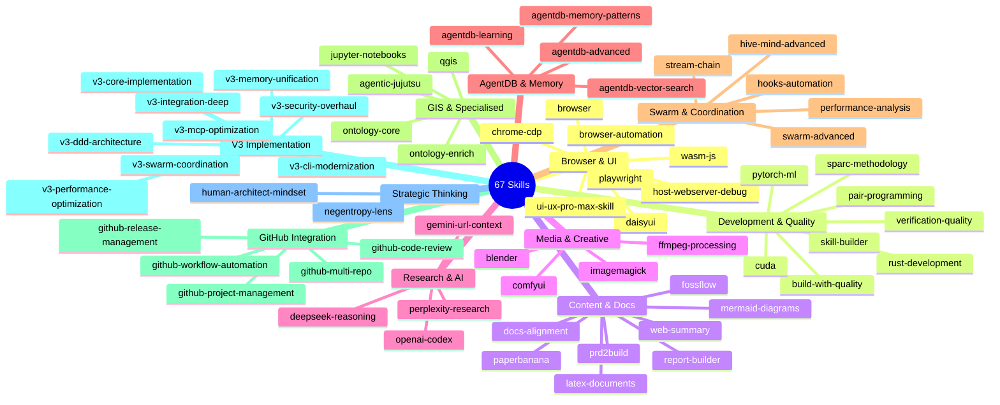
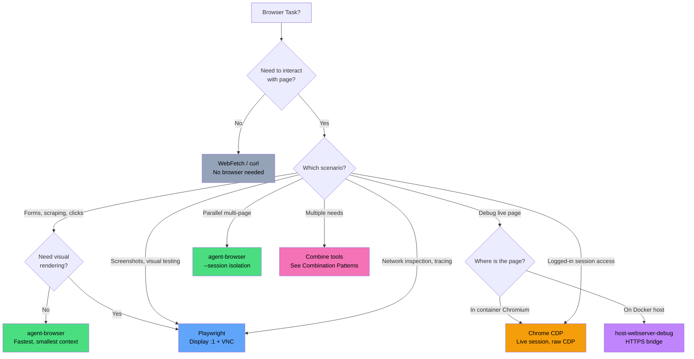

# Skills Portfolio

67 skills organised across 11 categories. 5 deprecated redirects. All skills have YAML frontmatter, description, and "When Not To Use" sections.

## Portfolio Map

## Browser Automation Decision Tree

## Skill Categories

| Category | Count | Key Skills |
|----------|-------|------------|
| Browser & UI | 8 | browser-automation (meta), playwright, chrome-cdp, daisyui |
| Development & Quality | 8 | build-with-quality, sparc-methodology, cuda, pytorch-ml |
| Content & Docs | 8 | report-builder, mermaid-diagrams, latex-documents, paperbanana |
| Media & Creative | 4 | ffmpeg-processing, comfyui, blender, imagemagick |
| Research & AI | 4 | perplexity-research, gemini-url-context, deepseek-reasoning |
| AgentDB & Memory | 4 | agentdb-vector-search, agentdb-learning, agentdb-memory-patterns |
| Swarm & Coordination | 5 | swarm-advanced, hive-mind-advanced, hooks-automation |
| GIS & Specialised | 5 | qgis, ontology-core, jupyter-notebooks |
| GitHub Integration | 5 | github-code-review, github-release-management |
| V3 Implementation | 9 | v3-core-implementation, v3-security-overhaul |
| Strategic Thinking | 2 | negentropy-lens, human-architect-mindset |
| Deprecated (redirects) | 5 | agentdb-optimization, perplexity, swarm-orchestration |

## Conformance

All 67 skills pass:
- SKILL.md present with YAML frontmatter
- `name:` and `description:` fields
- "When Not To Use" section (non-deprecated)
- Live ↔ Mirror sync (multi-agent-docker/skills/)

## Invocation

| Method | Example |
|--------|---------|
| Slash command | `/browser-automation` |
| Natural language | "I need to scrape a website" (auto-triggers browser skill) |
| Direct tool | `agent-browser open https://example.com` |
