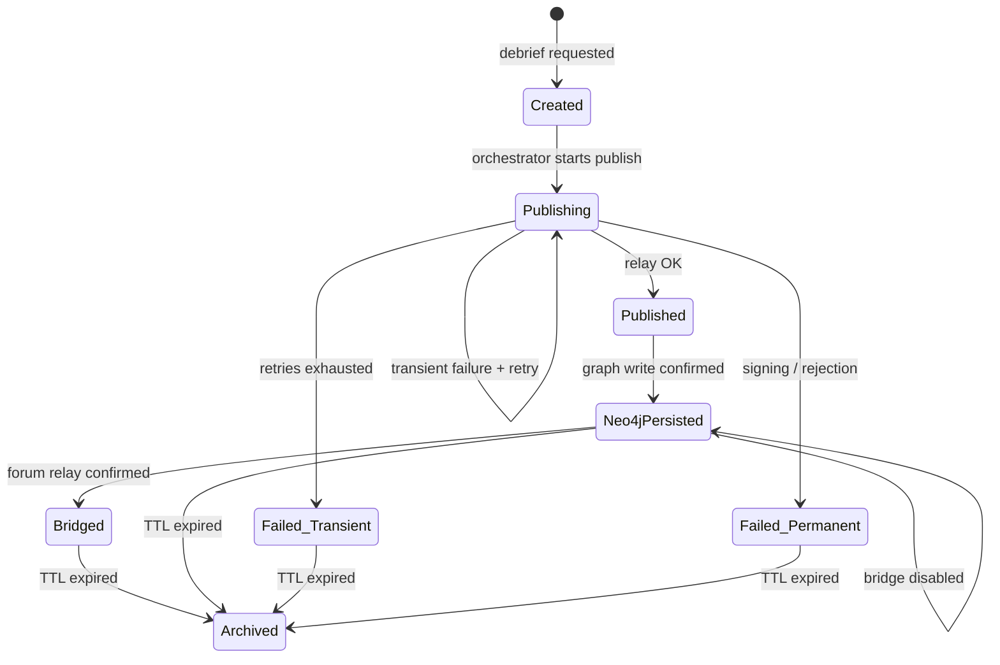

# ADR-034: Adopt NEEDLE Patterns for Bead Provenance System

## Status

Accepted — Implemented 2026-04-13

## Related Documents

- **PRD**: [Bead Provenance Upgrade](../prd-bead-provenance-upgrade.md)
- **DDD**: [Bead Provenance Bounded Context](../ddd-bead-provenance-context.md)
- **Schema**: [Neo4j Schema — §2d](../reference/neo4j-schema-unified.md#2d-provenance-context-nostr-beads)
- **Config**: [Operations — Bead Provenance](../how-to/operations/configuration.md#nostr-bead-provenance)
- **Upstream**: [jedarden/NEEDLE](https://github.com/jedarden/NEEDLE)

## Date

2026-04-13

## Context

VisionClaw's bead provenance system records immutable audit trails as Nostr NIP-33 events
(kind 30001) persisted to Neo4j. Every brief→debrief cycle emits a cryptographically signed
bead linking the briefing, consolidated debrief, and acting user. The system works but has
critical gaps:

- **Fire-and-forget publishing**: `briefing_handler.rs:88` spawns `publish_bead_complete()`
  via `tokio::spawn` with no error propagation. Relay failures are logged but provenance is
  silently lost.
- **No lifecycle tracking**: Beads are created once in Neo4j with no state field. There is
  no way to query which beads published successfully vs which failed.
- **Zero test coverage**: No unit or integration tests exist for `nostr_bead_publisher.rs`
  (186 lines) or `nostr_bridge.rs` (222 lines).
- **No outcome classification**: Success and all failure modes (timeout, rejection, connection
  failure, signing error) are handled identically — log and continue.
- **Hardcoded parameters**: 5-second relay timeout, 30-second bridge reconnect, single signing
  key — all without configuration or retry logic.

[jedarden/NEEDLE](https://github.com/jedarden/NEEDLE) is a Rust-based deterministic task
orchestrator that uses a "bead" abstraction for work units with an exhaustive 12-state FSM.
NEEDLE's core design principle — "If an outcome can happen, it has a handler" — directly
addresses VisionClaw's fire-and-forget gap. Key patterns relevant to provenance:

1. **Exhaustive outcome classification**: Exit codes map deterministically to typed outcomes
   with no wildcard match arms.
2. **`BeadStore` async trait**: 15-method interface abstracting bead storage, enabling
   backend swaps without changing coordination logic.
3. **Structured learning capture**: Post-task retrospectives with `what_worked`, `what_failed`,
   `reusable_pattern` fields, cross-workspace promotion, and 90-day staleness.
4. **Health monitoring**: Heartbeat-based worker health with configurable intervals.
5. **Hierarchical error handling**: `NeedleError` with Transient/BeadScoped/WorkerScoped tiers.

## Decision Drivers

- **Provenance reliability**: Every debrief must produce a verifiable audit record, or the
  failure must be visible and classified.
- **Testability**: The bead system must be testable without a running Nostr relay or Neo4j.
- **Operational visibility**: Platform operators need bead health status without reading logs.
- **Extension path**: Future integrations (Solid Pod sync, NEEDLE task consumption) require
  a clean storage abstraction.
- **Minimal disruption**: The upgrade must not change the REST API contract or Nostr event schema.

## Decision

Adopt NEEDLE's trait-based architecture and exhaustive outcome patterns for VisionClaw's bead
provenance system. Specifically:

### 1. Introduce `BeadStore` Trait with Neo4j Implementation

Define an `async_trait` `BeadStore` inspired by NEEDLE's storage abstraction:

```rust
#[async_trait]
pub trait BeadStore: Send + Sync {
    async fn create(&self, metadata: &BeadMetadata) -> Result<(), BeadStoreError>;
    async fn update_state(&self, bead_id: &str, state: BeadState) -> Result<(), BeadStoreError>;
    async fn update_outcome(&self, bead_id: &str, outcome: BeadOutcome) -> Result<(), BeadStoreError>;
    async fn get(&self, bead_id: &str) -> Result<Option<BeadMetadata>, BeadStoreError>;
    async fn list_by_state(&self, state: BeadState) -> Result<Vec<BeadMetadata>, BeadStoreError>;
    async fn list_failed(&self) -> Result<Vec<BeadMetadata>, BeadStoreError>;
    async fn count_by_state(&self) -> Result<HashMap<String, u64>, BeadStoreError>;
    async fn store_learning(&self, learning: &BeadLearning) -> Result<(), BeadStoreError>;
    async fn get_learnings(&self, bead_id: &str) -> Result<Vec<BeadLearning>, BeadStoreError>;
    async fn archive_before(&self, cutoff: DateTime<Utc>) -> Result<u64, BeadStoreError>;
    async fn health_check(&self) -> Result<BeadHealthStatus, BeadStoreError>;
}
```

`Neo4jBeadStore` implements this against the existing `Arc<neo4rs::Graph>` connection pool.
Unit tests use a `MockBeadStore` implementing the same trait.

### 2. Exhaustive Bead Outcome Classification

Replace the implicit success/log-failure pattern with a typed `BeadOutcome` enum:

```rust
pub enum BeadOutcome {
    Success,
    RelayTimeout { attempts: u8 },
    RelayRejected { reason: String },
    RelayUnreachable { error: String },
    SigningFailed { error: String },
    Neo4jWriteFailed { error: String },
    BridgeFailed { error: String },
}
```

Every `publish_bead_complete()` call returns a `BeadOutcome`. The lifecycle orchestrator
records it in the store. No outcome path uses wildcard matching.

### 3. Bead Lifecycle State Machine

Beads transition through explicit states:



State transitions are recorded in Neo4j with timestamps. The `BeadLifecycleOrchestrator`
replaces the fire-and-forget `tokio::spawn` in `briefing_handler.rs`.

### 4. Configurable Retry with Exponential Backoff

Replace the hardcoded 5-second timeout with configurable retry:

- `BEAD_RETRY_MAX_ATTEMPTS` (default: 3)
- `BEAD_RETRY_BASE_DELAY_MS` (default: 1000)
- `BEAD_RETRY_BACKOFF_MULTIPLIER` (default: 2.0)
- `BEAD_RETRY_MAX_DELAY_MS` (default: 10000)

Retry applies only to transient failures (timeout, connection error). Permanent failures
(signing error, relay rejection) fail immediately.

### 5. Learning Capture

Post-bead structured entries stored as `(:BeadLearning)` nodes in Neo4j, linked via
`(:Bead)-[:HAS_LEARNING]->(:BeadLearning)`. Fields: `what_worked`, `what_failed`,
`reusable_pattern`, `confidence` score.

### 6. Health Monitoring

Relay liveness check on configurable interval (default 60s). Status exposed via
`BeadStore::health_check()` returning connection state, last publish time, outcome
distribution, and relay latency.

## Consequences

### Positive

- **Every failure is visible**: No more silent provenance loss. Operators can query failed
  beads and their classified failure causes.
- **Testable without infrastructure**: `MockBeadStore` enables unit testing of the full
  lifecycle without Nostr relays or Neo4j.
- **Retry recovers transient failures**: ~90% of network-induced failures should self-heal
  within 3 attempts.
- **Operational dashboard ready**: `count_by_state()` and `health_check()` provide the
  data for monitoring without custom queries.
- **Extension path open**: Implementing `BeadStore` for a different backend (e.g., Solid
  Pod, PostgreSQL, NEEDLE's SQLite) requires zero changes to publisher/bridge/lifecycle code.
- **Audit completeness**: Lifecycle timestamps + learning entries give auditors the full
  chain from brief submission to provenance record.

### Negative

- **More code**: ~4 new files (~800 lines estimated) vs current 2 files (~408 lines).
  Justified by the test coverage and reliability gains.
- **Neo4j schema extension**: New properties on `:Bead` nodes and new `:BeadLearning` label.
  Migration is additive (MERGE-based, no destructive changes).
- **Slight publish latency increase**: Retry adds up to ~7 seconds worst-case for transient
  failures. Acceptable because publishing is already async (not on the HTTP response path).
- **Learning capture overhead**: One additional Neo4j write per bead. Negligible given
  debriefs are infrequent (order of magnitude: 10s per day, not 1000s).

### Neutral

- REST API contract unchanged — beads are still created via `POST /api/briefs/{id}/debrief`.
- Nostr event schema unchanged — kind 30001, same tag structure.
- Bridge forwarding unchanged — still re-signs and publishes kind 9 to forum relay.
- Environment variables are additive — existing `VISIONCLAW_NOSTR_PRIVKEY` and
  `JSS_RELAY_URL` remain, new variables have sensible defaults.

## Alternatives Considered

### 1. Minimal fix: Add retry to existing publisher

Add retry loop to `send_to_relay()` without architectural changes. Rejected because it
doesn't address lifecycle tracking, outcome classification, testability, or learning capture.
Fixes the symptom (transient failures) without the systemic improvement.

### 2. Full NEEDLE integration: Consume NEEDLE beads as task queue

Implement `BeadStore` against NEEDLE's SQLite-backed `br` CLI, making VisionClaw consume
NEEDLE work units directly. Deferred — requires NEEDLE as a runtime dependency and the
projects serve different purposes (task orchestration vs provenance). The trait abstraction
preserves this as a future option.

### 3. Replace Nostr with W3C PROV

Migrate from Nostr events to W3C PROV-O ontology for provenance. Rejected — Nostr provides
cryptographic signing, relay federation, and existing infrastructure. W3C PROV could be
layered on top of the Nostr events via OWL mapping in future.

## Related Decisions

- ADR-048: Dual-tier identity model — emits a provenance bead for every BRIDGE_TO edge kind transition
