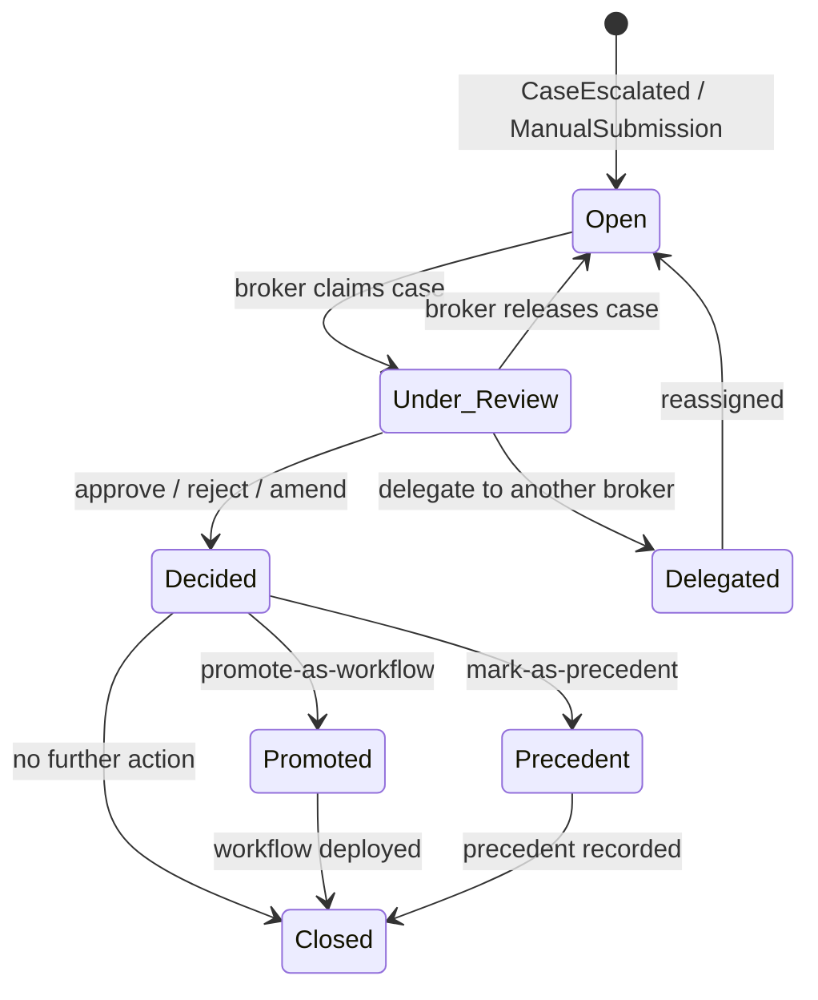

# ADR-041: Judgment Broker Workbench Architecture

## Status

Implemented 2026-04-20

## Date

2026-04-14 (accepted) / 2026-04-20 (implemented)

## Implementation Notes (2026-04-20)

Backend BC11 landed under `src/domain/broker/` (`BrokerCase` aggregate with
`CaseCategory::ContributorMeshShare` + `SubjectKind` discriminator per ADR-057
reconciliation), `DecisionOrchestrator` service, and `ShareIntentBrokerAdapter`
scaffold. Six canonical `DecisionOutcome` variants (Approve, Reject, Amend,
Delegate, Promote, Precedent) enforce append-only `DecisionHistory`, no
self-review, and forward-only share-state transitions (Private → Team → Mesh).
`BrokerActor` (supervised) owns the in-process inbox cache + WebSocket
broadcast (`broker:new_case`, `broker:case_decided`, `broker:case_claimed`).
REST routes: `GET /api/broker/inbox`, `GET /api/broker/cases/:id`,
`POST /api/broker/cases`, `POST /api/broker/cases/:id/decide`,
`GET /api/broker/cases/:id/history`, `GET /api/broker/subscribe`. Tests in
`tests/broker_tests.rs` cover approval, self-review, delegation, terminal
idempotency, and six-variant coverage. `ShareOrchestratorActor` (C4) owns
actual share-state transition execution; `ShareIntentBrokerAdapter` only
produces the intent case.

## Context

The Coordination Collapse thesis positions the Judgment Broker as the central human role in a governed agentic organisation. The broker reviews edge cases that the agentic mesh cannot safely resolve, validates or rejects discovered workflows, resolves cross-functional conflicts, and maintains trust in the automated layer.

VisionClaw has no first-class product surface for this role. The existing platform provides ontology exploration, graph visualisation, and agent orchestration, but no inbox, no decision canvas, no structured decision workflow. Without a broker workbench, the thesis remains theoretical.

The PRD (Workstream 3) defines four broker surfaces: Broker Inbox, Decision Canvas, Decision Actions, and Broker Timeline. The cold-start problem (PRD analysis, risk B) means the workbench must support both automated escalations from the discovery engine and manual workflow submissions from human contributors from day one.

### Architectural Constraints

- The workbench is a new bounded context (BC11) because it has its own aggregate root (`BrokerDecision`), its own lifecycle, and its own invariants distinct from existing contexts
- It consumes events from multiple upstream contexts: Graph Data (BC2), Ontology (BC7), Agent/Bot (BC8), and the future Insight Ingestion Loop
- It produces provenance events consumed by Analytics (BC6) and the KPI layer (ADR-043)
- Real-time inbox updates require WebSocket integration (BC4)
- Authentication and role enforcement depend on ADR-040 (enterprise identity, Broker role)
- All broker decisions must be cryptographically signed (Nostr, per ADR-034/ADR-040)

## Decision Drivers

- The Judgment Broker role is the highest-priority new user surface in the PRD
- The workbench must keep humans cognitively engaged, not just approving defaults
- Broker decisions are high-stakes: they approve workflows, set precedents, and resolve conflicts
- Every decision must be auditable with full provenance
- The inbox must not create alert fatigue; only meaningful escalations should appear
- The cold-start problem requires manual submission support from day one
- Performance: inbox load under 2 seconds, decision view under 3 seconds (NFR-3)

## Considered Options

### Option 1: New bounded context (BC11) with event-driven inbox (chosen)

Introduce `BrokerWorkbench` as BC11 with `BrokerDecision` as the aggregate root. The inbox is populated by domain events (`CaseEscalated`, `WorkflowProposalSubmitted`, `TrustDriftDetected`, `PolicyExceptionRequested`). Decisions emit `BrokerDecisionMade` events consumed by provenance and KPI contexts. REST API for CRUD operations, WebSocket subscription for real-time inbox updates.

- **Pros**: Clean domain boundary. Event-driven decoupling from upstream sources. Independently deployable and testable. Aligns with existing DDD architecture.
- **Cons**: New bounded context adds architectural surface area. Requires event infrastructure (already present via existing actor model).

### Option 2: Extend Analytics context (BC6) with broker views

Add broker-specific views and actions to the existing Analytics & Monitoring context.

- **Pros**: No new bounded context. Reuses existing analytics infrastructure.
- **Cons**: Violates single responsibility. Analytics observes; the broker acts. Mixing read-heavy analytics with write-heavy decisions creates coupling. Different scaling profiles. Different access patterns (dashboard vs inbox workflow).

### Option 3: Client-only workbench with direct API calls

Build the workbench entirely in the TypeScript client, composing existing API endpoints without a dedicated backend service.

- **Pros**: No new backend code initially.
- **Cons**: Business logic leaks into the client. No server-side enforcement of decision workflows. No event emission for provenance. Cannot enforce invariants (e.g., a case cannot be approved twice). Does not scale to multiple broker clients.

## Decision

**Option 1: New bounded context BC11 (Broker Workbench) with `BrokerDecision` aggregate root and event-driven inbox.**

### Domain Model

```
BC11: Broker Workbench
  Aggregate Root: BrokerDecision
  Entities: BrokerCase, DecisionAction, CaseEvidence
  Value Objects: CasePriority, CaseCategory, DecisionOutcome, EvidenceRef
  Domain Events:
    - CaseEscalated
    - BrokerDecisionMade
    - CaseDelegated
    - WorkflowPromoted
    - PrecedentMarked
  Services: BrokerInboxService, DecisionOrchestrator, EvidenceAggregator
  Ports: BrokerCaseRepository (Neo4j), BrokerEventPublisher
```

### BrokerCase Lifecycle



### Decision Actions

| Action | Description | Emitted Event |
|--------|-------------|--------------|
| `approve` | Accept the proposal or resolution as-is | `BrokerDecisionMade { outcome: Approved }` |
| `reject` | Reject with reasoning (preserved for learning) | `BrokerDecisionMade { outcome: Rejected, reasoning }` |
| `amend` | Modify the proposal and approve the amended version | `BrokerDecisionMade { outcome: Amended, diff }` |
| `delegate` | Reassign to another broker (e.g., domain expert) | `CaseDelegated { from_broker, to_broker, reason }` |
| `promote-as-workflow` | Approve and promote to a reusable WorkflowPattern | `WorkflowPromoted { proposal_id, pattern_id }` |
| `mark-as-precedent` | Flag this decision as a policy precedent for future cases | `PrecedentMarked { decision_id, scope }` |

### Inbox Population

The inbox aggregates items from multiple event sources:

| Source Event | Case Category | Priority Calculation |
|-------------|---------------|---------------------|
| `CaseEscalated` (from policy engine) | Escalation | Based on policy severity + confidence gap |
| `WorkflowProposalSubmitted` (from Insight Loop) | Workflow Review | Based on scope, affected teams, novelty |
| `TrustDriftDetected` (from KPI engine) | Trust Alert | Based on drift magnitude + affected workflows |
| `PolicyExceptionRequested` (from policy engine) | Policy Exception | Based on policy criticality + requester role |
| `ManualSubmission` (from contributor UI) | Manual Proposal | Default medium; broker can reprioritise |

### REST API

```
GET    /api/broker/inbox                    # List open cases for current broker
GET    /api/broker/inbox?status=open&sort=priority&limit=50
GET    /api/broker/cases/{id}               # Full case detail with evidence
POST   /api/broker/cases/{id}/claim         # Broker claims a case
POST   /api/broker/cases/{id}/release       # Release claimed case back to pool
POST   /api/broker/cases/{id}/decide        # Submit decision action
  Body: { action: "approve"|"reject"|"amend"|"delegate"|"promote"|"precedent",
          reasoning: string,
          amendments?: object,
          delegate_to?: string }
GET    /api/broker/cases/{id}/evidence      # Evidence chain for case
GET    /api/broker/cases/{id}/similar       # Similar past decisions
GET    /api/broker/timeline                 # Broker's decision history
GET    /api/broker/stats                    # Decision quality, workload, response times
POST   /api/broker/submit                   # Manual workflow proposal submission
```

All endpoints require the `Broker` role (ADR-040). Auditor role gets read-only access to all endpoints except `claim`, `release`, `decide`, and `submit`.

### WebSocket Subscription

Real-time inbox updates via the existing WebSocket infrastructure (BC4):

```json
{
  "type": "broker:subscribe",
  "channels": ["inbox", "case:{id}"]
}
```

Events pushed to subscribed brokers:
- `broker:new_case` — new item in inbox
- `broker:case_updated` — case status changed (by another broker or system)
- `broker:case_claimed` — case claimed by another broker (remove from available pool)
- `broker:priority_changed` — case priority recalculated

### Neo4j Schema

```cypher
// BrokerCase node
CREATE (c:BrokerCase {
  id: randomUUID(),
  category: "escalation",       // escalation | workflow_review | trust_alert | policy_exception | manual
  status: "open",               // open | under_review | decided | delegated | closed
  priority: 75,                 // 0-100, computed
  title: "...",
  summary: "...",
  source_event_id: "...",
  assigned_broker: null,         // pubkey of claiming broker
  created_at: datetime(),
  updated_at: datetime()
})

// BrokerDecision node (immutable once created)
CREATE (d:BrokerDecision {
  id: randomUUID(),
  case_id: "...",
  action: "approve",
  reasoning: "...",
  broker_pubkey: "...",          // Nostr pubkey of deciding broker
  signature: "...",              // Nostr signature over decision content
  decided_at: datetime()
})

// Relationships
(c:BrokerCase)-[:DECIDED_BY]->(d:BrokerDecision)
(c:BrokerCase)-[:ESCALATED_FROM]->(source)       // Insight, WorkflowProposal, etc.
(c:BrokerCase)-[:EVIDENCE]->(e:Node)             // Any graph entity as evidence
(d:BrokerDecision)-[:PROMOTES]->(w:WorkflowPattern)
(d:BrokerDecision)-[:SETS_PRECEDENT_FOR]->(scope)
(d:BrokerDecision)-[:SIGNED_BY]->(u:User)
```

### Evidence Aggregation

The Decision Canvas presents aggregated evidence for each case:

1. **Provenance chain**: bead lifecycle trail from the originating event (ADR-034)
2. **Graph context**: subgraph of related nodes and edges from BC2
3. **Policy evaluations**: which policies were evaluated and their results (ADR-045)
4. **Similar past decisions**: semantic similarity search against previous `BrokerDecision` nodes
5. **Agent activity**: relevant agent actions from BC8
6. **Suggested decision**: confidence-weighted recommendation (system suggests, broker decides)

Evidence is assembled server-side by `EvidenceAggregator` and returned as part of the case detail endpoint to meet the 3-second load target.

## Consequences

### Positive

- The Judgment Broker role becomes a real, operational product surface
- Clean bounded context with clear aggregate boundary enables independent development and testing
- Event-driven inbox decouples the workbench from upstream sources; new case sources can be added without modifying the workbench
- Decision provenance is cryptographically signed and immutable
- Manual submission solves the cold-start problem
- WebSocket subscription enables multi-broker real-time coordination
- Similar-past-decisions feature compounds organisational learning over time

### Negative

- New bounded context (BC11) adds architectural surface area: new Rust module, new API routes, new Neo4j labels
- Evidence aggregation across multiple contexts may be slow for complex cases. Mitigation: pre-compute and cache evidence when case is created; refresh on broker access
- Multiple brokers claiming the same case creates contention. Mitigation: optimistic locking with `claim` returning 409 if already claimed
- The suggested-decision feature risks automation bias (brokers rubber-stamping suggestions). Mitigation: hide suggestion until broker has spent configurable minimum review time; track override rate as a KPI

### Neutral

- Existing bounded contexts (BC1-BC10) are not modified, only consumed via events
- WebSocket infrastructure (BC4) is reused with a new subscription channel
- Neo4j remains the primary store; no new database technology introduced
- Client rendering (BC9) gains a new view but the rendering pipeline is unchanged

## Related Decisions

- ADR-040: Enterprise Identity Strategy (Broker role definition and auth)
- ADR-034: Needle Bead Provenance (provenance signing for decisions)
- ADR-042: Workflow Proposal Object Model (WorkflowProposal consumed as case source)
- ADR-043: KPI Lineage Model (BrokerDecisionMade events feed HITL Precision KPI)
- ADR-045: Policy Engine Approach (PolicyExceptionRequested events feed the inbox)
- ADR-049: Insight-migration broker workflow — extends the Judgment Broker Workbench with a migration-candidate lane

## References

- PRD Workstream 3: Judgment Broker Workbench
- PRD FR1: Broker Inbox
- PRD FR2: Decision Provenance View
- PRD Section 7.1: Judgment Broker user profile
- PRD Section 14: UX Requirements (Broker Home, Escalation Case Detail)
- `docs/explanation/ddd-bounded-contexts.md`
- `docs/explanation/security-model.md`
