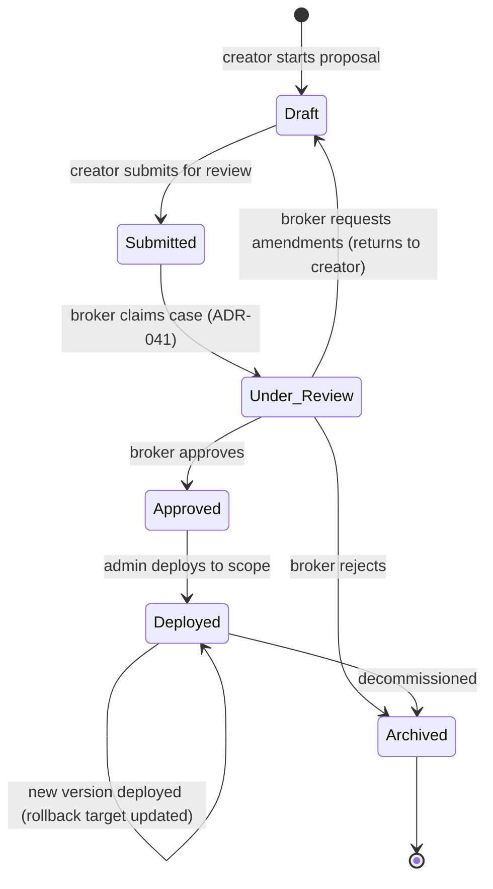

# ADR-042: Workflow Proposal Object Model

## Status

Accepted

## Date

2026-04-14

## Context

The Insight Ingestion Loop (PRD Workstream 4) converts discovered patterns into structured, reviewable, deployable workflows. The loop requires a first-class `WorkflowProposal` entity that tracks a proposal from initial discovery or manual submission through broker review, approval, deployment, and potential rollback.

VisionClaw currently has no workflow abstraction. The ontology layer (BC7) manages OWL classes and properties. The agent layer (BC8) orchestrates task execution. Neither has a concept of a versioned, reviewable, promotable workflow definition that can be diffed, rolled back, and propagated across teams.

The PRD (FR3) specifies: "Proposal has unique ID, source, status, owner, history, risk score, expected benefit. Proposal can be versioned and diffed. Proposal supports comments, amendments, and final decision."

### Design Constraints

- Neo4j is the primary store for graph entities (PRD Section 12: Storage Strategy)
- Proposals must link to existing graph entities (Insights, Users, Agents, OWL classes)
- Version history must be append-only for auditability
- The model must support the Broker Workbench (ADR-041) as the review surface
- Proposals originate from two sources: automated discovery and manual human submission
- Deployed workflows must be rollbackable (FR4)

## Decision Drivers

- Workflow proposals are the central artefact of the Insight Ingestion Loop
- Versioning is mandatory for auditability and broker review of changes
- Diffability enables brokers to understand what changed between versions
- Rollback support is a hard requirement for enterprise deployments
- The data model must support lineage (which Insight led to which Proposal, which Decision approved it, which Pattern resulted)
- Schema must be compatible with the existing Neo4j graph and queryable via Cypher

## Considered Options

### Option 1: Neo4j entity with append-only version chain via SUPERSEDES edges (chosen)

`WorkflowProposal` is a Neo4j node with a status lifecycle. Each edit creates a new `WorkflowVersion` node linked to the proposal. Versions form a chain via `SUPERSEDES` edges. The workflow steps are stored as a structured JSON property on each version node, enabling semantic diffing.

- **Pros**: Native graph relationships to all other entities (Insights, Users, Patterns). Append-only version chain is auditable. SUPERSEDES edges make version history a graph traversal. JSON step representation enables structured diff.
- **Cons**: Large JSON blobs in Neo4j properties are not ideal for full-text search. Diffing logic must be implemented in the application layer.

### Option 2: Relational model in PostgreSQL (RuVector)

Store proposals and versions in PostgreSQL tables with JSONB columns for workflow steps.

- **Pros**: Better JSONB query support. Familiar relational versioning patterns. JSONB diff functions exist.
- **Cons**: Breaks the "Neo4j is primary for graph entities" storage strategy. Proposals must link to graph nodes (Insights, Users, Patterns) which are in Neo4j; cross-database joins are not possible. Duplicates relationship management across two stores.

### Option 3: Git-backed workflow definitions

Store workflow definitions as YAML/JSON files in a Git repository. Use Git commits for versioning and Git diff for diffability.

- **Pros**: Excellent diffing and version history. Familiar developer tooling.
- **Cons**: Completely separate from the graph data model. No relationship traversal. Requires Git infrastructure. Broker review UX would need to wrap Git operations. Overkill for structured workflow steps; Git excels at text files, not semantic diffing of structured data.

## Decision

**Option 1: Neo4j entity with append-only version chain via SUPERSEDES edges.**

### Node Labels and Schema

```cypher
// WorkflowProposal — the persistent identity of a workflow through its lifecycle
CREATE (wp:WorkflowProposal {
  id: randomUUID(),
  title: "Cross-functional regulatory review",
  status: "draft",               // draft | submitted | under_review | approved | deployed | archived
  source_type: "discovery",      // discovery | manual
  risk_score: 0.0,               // 0.0-1.0, computed
  expected_benefit: "...",
  scope: "team:regulatory-affairs",
  owner_pubkey: "...",           // Nostr pubkey of the proposal creator
  created_at: datetime(),
  updated_at: datetime()
})

// WorkflowVersion — immutable snapshot of the workflow definition at a point in time
CREATE (wv:WorkflowVersion {
  id: randomUUID(),
  proposal_id: "...",
  version_number: 1,             // monotonically increasing per proposal
  steps_json: '...',             // structured JSON of workflow steps (see below)
  change_summary: "Initial draft",
  author_pubkey: "...",
  signature: "...",              // Nostr signature over steps_json
  created_at: datetime()
})

// WorkflowPattern — an approved, deployed, reusable workflow template
CREATE (pat:WorkflowPattern {
  id: randomUUID(),
  title: "...",
  active_version_id: "...",      // points to the currently deployed WorkflowVersion
  deployed_at: datetime(),
  deployment_scope: "org-wide",  // team | department | org-wide
  rollback_version_id: null,     // previous version for rollback
  usage_count: 0,
  created_at: datetime()
})
```

### Relationships

```cypher
// Version chain
(wv2:WorkflowVersion)-[:SUPERSEDES]->(wv1:WorkflowVersion)

// Proposal to versions
(wp:WorkflowProposal)-[:HAS_VERSION]->(wv:WorkflowVersion)
(wp:WorkflowProposal)-[:CURRENT_VERSION]->(wv:WorkflowVersion)

// Lineage
(wp:WorkflowProposal)-[:DISCOVERED_FROM]->(i:Insight)
(wp:WorkflowProposal)-[:REVIEWED_BY]->(u:User)
(wp:WorkflowProposal)-[:PROMOTED_TO]->(pat:WorkflowPattern)

// Broker decisions link
(d:BrokerDecision)-[:DECIDES_ON]->(wp:WorkflowProposal)

// Pattern deployment
(pat:WorkflowPattern)-[:ACTIVE_VERSION]->(wv:WorkflowVersion)
(pat:WorkflowPattern)-[:ROLLBACK_TARGET]->(wv_prev:WorkflowVersion)

// Cross-references
(wp:WorkflowProposal)-[:INVOLVES]->(n:Node)       // affected graph entities
(wp:WorkflowProposal)-[:USES_AGENT]->(a:AgentNode) // agents involved in the workflow
```

### Status Lifecycle



Status transitions emit domain events:
- `WorkflowProposalSubmitted` -> feeds Broker Inbox (ADR-041)
- `WorkflowProposalApproved` -> triggers deployment eligibility
- `WorkflowDeployed` -> updates WorkflowPattern, records provenance
- `WorkflowRolledBack` -> reverts to previous version, records provenance

### Structured Step Representation

Workflow steps are stored as a JSON array on `WorkflowVersion.steps_json`:

```json
{
  "steps": [
    {
      "id": "step-1",
      "type": "agent_task",
      "agent_type": "researcher",
      "description": "Gather regulatory documents from connected sources",
      "inputs": ["connector:jira:regulatory-board"],
      "outputs": ["evidence_bundle"],
      "timeout_seconds": 3600,
      "escalation_policy": "auto_escalate_on_timeout"
    },
    {
      "id": "step-2",
      "type": "human_review",
      "role": "broker",
      "description": "Review gathered evidence for completeness",
      "inputs": ["evidence_bundle"],
      "outputs": ["review_decision"],
      "sla_hours": 24
    },
    {
      "id": "step-3",
      "type": "conditional",
      "condition": "review_decision == 'approved'",
      "on_true": "step-4",
      "on_false": "step-1"
    }
  ],
  "metadata": {
    "estimated_duration_hours": 48,
    "required_roles": ["researcher", "broker"],
    "required_connectors": ["jira"]
  }
}
```

This structured representation enables semantic diffing: compare step arrays element-by-element, detect added/removed/modified steps, and present changes to the broker as a structured diff rather than a raw text diff.

### Diffing

The application layer computes diffs between two `WorkflowVersion` nodes:

1. Retrieve `steps_json` from both versions
2. Compute structural diff: added steps, removed steps, modified steps (by step ID)
3. For modified steps, compute field-level diff
4. Return as a structured diff object for the Broker Decision Canvas (ADR-041)

### Rollback

When a deployed `WorkflowPattern` needs to revert:

1. The current `ACTIVE_VERSION` becomes the `ROLLBACK_TARGET` of the revert
2. The previous `ROLLBACK_TARGET` becomes the new `ACTIVE_VERSION`
3. A `WorkflowRolledBack` event is emitted with full provenance
4. The rollback decision is recorded as a `BrokerDecision` with action `amend`

Multiple rollback levels are supported by traversing the `SUPERSEDES` chain.

## Consequences

### Positive

- Workflow proposals are first-class graph citizens with full relationship traversal to Insights, Users, Agents, and Patterns
- Append-only version chain provides complete audit trail; no version is ever deleted
- SUPERSEDES edges make version history a native graph query
- Structured JSON steps enable semantic diffing and programmatic comparison
- Rollback is a graph operation (change pointer), not a destructive data operation
- Lineage from Insight -> Proposal -> Pattern is a single Cypher traversal
- Schema is compatible with the existing Neo4j-based architecture

### Negative

- Large JSON blobs in Neo4j node properties are suboptimal for complex queries against step internals. Mitigation: keep step-level queries in the application layer; Neo4j handles relationship traversal and lifecycle queries.
- Diffing logic must be implemented in Rust. Mitigation: the `serde_json` + custom diff logic is straightforward for structured step arrays; this is simpler than unstructured text diffing.
- Schema migration adds three new node labels and multiple relationship types to Neo4j. Mitigation: all changes are additive (CREATE, not destructive).

### Neutral

- Existing Neo4j schema for OWL classes, Beads, and Agent nodes is unaffected
- The client rendering layer (BC9) gains a new proposal view but no rendering pipeline changes
- Solid Pods are not involved in proposal storage (proposals are organisational, not user-owned)

## Related Decisions

- ADR-041: Judgment Broker Workbench (consumes WorkflowProposalSubmitted, displays proposals in Decision Canvas)
- ADR-043: KPI Lineage Model (WorkflowPromotion events feed Mesh Velocity KPI)
- ADR-044: Connector Governance (Insights from connectors become DISCOVERED_FROM sources)
- ADR-034: Needle Bead Provenance (proposal lifecycle events recorded as provenance)
- ADR-049: Insight-migration broker workflow — produces a WorkflowProposal-like artefact for the ontology-mutation PR

## References

- PRD Workstream 4: Insight Ingestion Loop
- PRD FR3: Workflow Proposal Model
- PRD FR4: Promotion and Propagation
- PRD Section 12: Proposed Data Model Additions
- `docs/reference/neo4j-schema-unified.md`
