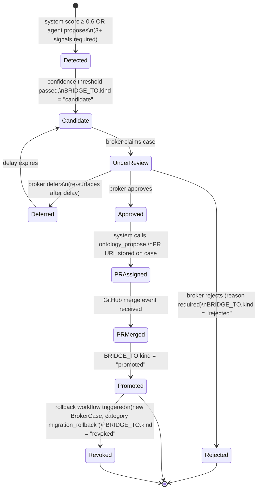

# ADR-049: Insight Migration Broker Workflow

## Status

Proposed

## Date

2026-04-18

## Context

The Judgment Broker Workbench (ADR-041) handles escalation Cases: policy exceptions,
trust drift alerts, and workflow proposals. Its inbox aggregates `BrokerCase` nodes
populated by domain events (`CaseEscalated`, `WorkflowProposalSubmitted`, etc.).

The Insight Migration Loop introduces a parallel stream of work that the existing
Case model cannot absorb cleanly. A **migration candidate** is a KG note (a Logseq
page or graph entity) that one or more signals have nominated for promotion into the
formal OWL ontology as a named class or property. The candidate carries:

- a target ontology IRI (where it would live in the OWL schema),
- a confidence score (0.0–1.0, weighted across signal sources),
- a source attribution (agent-generated vs system-detected), and
- a dual-tier identity edge (`BRIDGE_TO` with `kind: candidate`) per ADR-048.

Why a migration candidate cannot be a plain Case:

1. **Review content differs.** A Case broker reviews evidence chains and policy
   evaluations. A migration broker compares a KG note's Markdown content to a
   proposed OWL class definition side-by-side. The DecisionCanvas must show both
   panes simultaneously; this is a different affordance, not a supertype.
2. **Approval has a mandatory downstream effect.** Approving a Case records a
   `BrokerDecisionMade` event. Approving a migration candidate must also trigger an
   automated GitHub PR against the ontology repository via `ontology_propose`. This
   PR creation is a business invariant, not optional post-processing.
3. **Noise level is higher.** The discovery engine generates candidates continuously.
   Without a confidence threshold, the broker inbox would be flooded. Cases are
   generated by deliberate escalation events; candidates are generated by pattern
   matching and may number in the hundreds per day.
4. **Identity lifecycle is different.** Candidate state transitions must update the
   `BRIDGE_TO` edge `kind` field (ADR-048): `candidate → promoted | rejected |
   revoked`. Cases are resolved through `BrokerDecision` nodes with no graph edge
   mutation.

## Decision Drivers

- Broker must compare a KG note to a candidate ontology class without leaving the
  workbench.
- Agent-generated candidates must be distinguishable from system-detected ones so
  brokers can calibrate trust in the source.
- Approval must trigger an auto-generated GitHub PR (non-blocking; broker continues
  working while the PR is opened).
- Rollback (revocation of a promoted class) must be possible but is not a routine
  path; it generates a new broker case rather than a state rewind.
- Candidates below confidence threshold 0.6 must not surface; cold-start suppression
  until 3+ signals converge.

## Considered Options

### Option A: MigrationCase as a new Case subtype under `/api/broker/cases` (chosen)

Extend the `BrokerCase` aggregate with a discriminated union:
`category: "migration_candidate"`. Add a `MigrationPayload` embedded document to
`BrokerCase` nodes for candidate-specific fields (ontology IRI, confidence score,
signal sources, PR link). The existing lifecycle machinery (claim, decide, release,
provenance) is inherited. The Broker Inbox renders migration candidates in a distinct
UI lane.

- **Pros**: Single aggregate root (`BrokerCase`) preserves persistence and provenance
  uniformity. Decision history is queryable across all case categories with one
  Cypher query. Existing `BrokerDecision` nodes record migration decisions with full
  signatures. No new backend service or database label required.
- **Cons**: `BrokerCase` grows a nullable `MigrationPayload` field, adding schema
  complexity. The aggregate must enforce migration-specific invariants (PR must be
  triggered on approve) in addition to base invariants.

### Option B: Separate endpoint `/api/broker/migration-candidates` with own lifecycle

Introduce a `MigrationCandidate` aggregate in BC11 as a peer of `BrokerCase` with
its own Neo4j label, its own REST routes, and its own lifecycle.

- **Pros**: No contamination of the Case aggregate. Migration-specific invariants are
  cleanly isolated.
- **Cons**: Duplicates the claim/release/decide machinery, provenance signing,
  WebSocket subscription, and broker stats. Creates two separate inbox-population
  paths. Brokers would need two separate views to see their full workload.

### Option C: Case-lite — different UI lanes, same aggregate without migration payload

Route migration candidates through the Case aggregate as-is, using `summary` and
`evidence` fields to carry candidate context. Differentiate only in the UI.

- **Pros**: Zero aggregate changes.
- **Cons**: Approval cannot safely trigger PR creation because the aggregate has no
  structured payload to drive `ontology_propose`. The PR-trigger invariant would have
  to live in the API handler, leaking business logic out of the domain model.

## Decision

**Option A: MigrationCase as a new `BrokerCase` category with dedicated UI lane and
`MigrationPayload` embedded document.**

Rationale: preserves existing persistence (Neo4j `BrokerCase` nodes), provenance
signing (`BrokerDecision` with Nostr signature), WebSocket subscription, broker stats,
and timeline in one aggregate root. The `MigrationPayload` carries the fields needed
to drive the PR invariant. The UI lane gives brokers a visually separate stream
without duplicating domain machinery. The additional complexity in the aggregate is
bounded and testable.

The `ontology_propose` call (GitHub PR creation) is triggered synchronously by the
`DecisionOrchestrator` on approve but is non-blocking: the PR URL is written back to
the case and surfaced in the BrokerTimeline asynchronously.

## Lifecycle



Revocation is handled by creating a new `BrokerCase` with
`category: "migration_rollback"` referencing the original candidate ID. The broker
reviews the rollback case separately; approval mutates the `BRIDGE_TO` edge to
`kind: "revoked"` and closes the ontology class in the OWL schema via a second PR.

## UI Affordances

All components build on existing `client/src/features/broker/components/`.

### Inbox Lane: Migration Candidates

- A distinct lane header "Migration Candidates" rendered alongside the existing
  "Escalations" lane in `BrokerInbox`.
- Lane respects the same sort-by-priority and claim interactions as Escalations.
- Lane is hidden if broker's role scope excludes ontology write (`ontology:write`
  claim per ADR-040/ADR-048).

### Candidate Card

Each card in the lane displays:
- KG note label (page title from Logseq / graph node label)
- Candidate ontology IRI (abbreviated, full on hover)
- Confidence score as a numeric badge (e.g., `0.84`) with colour gradient
  (green ≥ 0.8, amber 0.6–0.79)
- Wikilink count (signals; higher count = more KG references)
- Source badge: "Agent" (agent-proposed) or "System" (auto-detected); agent name if
  available
- Last-updated recency (relative timestamp)

### DecisionCanvas Additions

The existing `DecisionCanvas` gains a split-pane layout when the case category is
`migration_candidate`:

- **Left pane**: KG note rendered as Markdown (fetched from BC13 Insight Discovery
  via `GET /api/insights/:id/markdown`).
- **Right pane**: Proposed OntologyClass preview — label, IRI, parent class, defined
  properties, extracted from the ontology service (BC7).
- **Diff strip** (below both panes): proposed OWL delta shown as a structured diff
  (`+` class declaration, `+` subClassOf, `+` rdfs:label). Diff is pre-computed
  server-side by `EvidenceAggregator` when the case is claimed.

### Action Controls

- **Approve** button (primary): one-click. Triggers `POST /api/broker/migration-candidates/:id/approve`. PR link appears in BrokerTimeline within seconds.
- **Reject** button: requires reason field (min 10 chars, enforced client-side). Triggers `POST /api/broker/migration-candidates/:id/reject`.
- **Defer** control: date-picker or quick options (24 h / 7 d / 30 d). Triggers `POST /api/broker/migration-candidates/:id/defer` with `delay_seconds`.
- PR link chip: appears in the timeline entry once `PRAssigned`; links directly to GitHub PR.

## API Surface

All endpoints require `Broker` role. Auditor role gets read-only access to `GET` endpoints.

```
GET  /api/broker/migration-candidates
     Query: status=candidate|under_review|approved|deferred, sort=confidence|updated, limit=50
     Response: { items: MigrationCandidateSummary[], total: number }

GET  /api/broker/migration-candidates/:id
     Response: MigrationCandidateDetail (KG content, ontology preview, OWL delta)

POST /api/broker/migration-candidates/:id/approve
     Body: {}
     Response: { case_id, pr_url: string | null, status: "pr_assigned" }

POST /api/broker/migration-candidates/:id/reject
     Body: { reason: string }   // min 10 chars
     Response: { case_id, status: "rejected" }

POST /api/broker/migration-candidates/:id/defer
     Body: { delay_seconds: number }   // 86400 | 604800 | 2592000
     Response: { case_id, resurface_at: datetime, status: "deferred" }

POST /api/broker/migration-candidates/:id/revoke
     Body: { reason: string }   // initiates rollback case; only valid from "promoted"
     Response: { rollback_case_id: string, status: "revoke_pending" }

GET  /api/broker/migration-candidates/:id/provenance
     Response: { beads: BeadRef[], bridge_to_history: BridgeToEdgeHistory[] }
```

Example approve response:

```json
{
  "case_id": "mc-3f9a1c",
  "pr_url": "https://github.com/org/ontology/pull/142",
  "status": "pr_assigned",
  "decided_at": "2026-04-18T14:22:05Z",
  "broker_pubkey": "npub1..."
}
```

Example reject body:

```json
{ "reason": "Concept duplicates owl:Person subclass already present in schema." }
```

## Scoring and Suppression

Confidence score is computed by the discovery engine (BC13) as a weighted sum over
signal types:

| Signal Type | Weight |
|---|---|
| Wikilink count (normalised) | 0.30 |
| Agent-explicit nomination | 0.35 |
| Co-occurrence with existing OWL class | 0.20 |
| Semantic embedding similarity to OWL label | 0.15 |

Surfacing rules:
- Threshold: `confidence >= 0.6`. Candidates below threshold remain in BC13; they do
  not generate `BrokerCase` nodes.
- Cold-start suppression: a candidate that has fewer than 3 distinct signal sources
  is held in BC13 regardless of score. Prevents single-agent hallucinations from
  reaching the inbox.
- Broker force-surface: an agent (or admin) may issue `POST /api/broker/migration-candidates/force-surface` with `{ kg_note_id, override_reason }` to bypass threshold and cold-start suppression. Recorded in provenance.
- Duplicate suppression: if a candidate's target IRI already has a `BRIDGE_TO` edge
  with `kind: promoted`, the discovery engine does not regenerate a candidate node.

## Persistence

`MigrationCandidate` is not a separate aggregate. It is a `BrokerCase` node in Neo4j
(BC11) with `category: "migration_candidate"` and an embedded `MigrationPayload`
sub-document stored as a JSON property.

```
BrokerCase {
  ...base fields from ADR-041...,
  category:           "migration_candidate",
  migration_payload: {
    kg_note_id:        string,         // BC13 Insight node ID
    kg_note_label:     string,
    ontology_iri:      string,         // target class IRI
    confidence:        float,          // 0.6–1.0
    signal_sources:    string[],       // list of signal type labels
    agent_source:      string | null,  // agent ID if agent-proposed
    owl_delta_json:    string,         // pre-computed OWL delta
    pr_url:            string | null,  // populated on PRAssigned
    defer_until:       datetime | null
  }
}
```

Invariants enforced by `DecisionOrchestrator`:
- `approve` is only valid when `status = under_review`.
- `approve` must call `ontology_propose` and write `pr_url` to `migration_payload`
  before emitting `BrokerDecisionMade`.
- `reject` requires non-empty `reason`.
- `revoke` is only valid when `status = promoted`; it creates a new
  `BrokerCase { category: "migration_rollback" }`.

Relationship to BC13:

```cypher
(bc:BrokerCase { category: "migration_candidate" })-[:MIGRATION_SOURCE]->(n:Insight)
(bc:BrokerCase)-[:BRIDGE_EDGE]->(be:BridgeToEdge)
```

The `BRIDGE_TO` edge `kind` field is mutated by the `DecisionOrchestrator` (not the
broker client) on state transitions to maintain the single-source-of-truth in
ADR-048.

## Consequences

### Positive

- Migration review is integrated into the existing Broker Workbench surface without a
  new product screen; brokers have one inbox for all judgment work.
- The PR-trigger invariant lives inside the `BrokerCase` aggregate, ensuring it
  cannot be bypassed by direct API calls that skip the domain model.
- Confidence threshold and cold-start suppression keep broker signal-to-noise high
  from day one.
- Decision provenance (Nostr-signed `BrokerDecision` nodes) extends to migration
  decisions with no additional infrastructure.
- Rollback as a new case (rather than a state rewind) preserves auditability: every
  revocation has a broker decision record.

### Negative

- `BrokerCase` aggregate gains a nullable `MigrationPayload` property; aggregate
  invariants grow in number, increasing test surface.
- `EvidenceAggregator` must now call BC7 (ontology service) and BC13 (insight
  discovery) to pre-compute the OWL delta on claim; this adds latency to the claim
  operation. Mitigation: pre-compute delta at candidate creation time; refresh only
  if the KG note or ontology schema has changed since last computation.
- PR creation introduces an external dependency (GitHub API) inside a synchronous
  decision flow. Mitigation: `ontology_propose` is fire-and-forget via an async task;
  the broker receives a `pr_pending` status immediately and the PR URL is pushed via
  WebSocket when available.

### Neutral

- BC13 (Insight Discovery) is a read-only dependency of BC11 for this feature; no
  events flow from BC11 back to BC13 except the `BRIDGE_TO` edge mutation.
- ADR-041 BrokerCase base lifecycle is unchanged; migration candidates reuse all
  existing claim/release/timeline machinery.
- ADR-042 WorkflowProposal is unaffected; workflow and migration are distinct case
  categories with separate inbox lanes.
- ADR-045 policy engine governs the confidence threshold rule (surfacing gate) using
  an existing `ThresholdRule` implementation; no new rule type is required.
- ADR-048 `BRIDGE_TO` edge `kind` transitions are the authoritative identity state;
  the `BrokerCase.status` field is the workflow state. The two are kept in sync by
  `DecisionOrchestrator`.

## Open Questions

1. **Multi-broker conflict on migration approval.** If two brokers simultaneously
   claim different candidates that map to overlapping OWL IRIs (e.g., both propose
   `ex:Person` from different KG notes), should the second PR be blocked or submitted
   in parallel? Current design submits both; ontology maintainers resolve via PR
   review. Is this acceptable, or should a lock be held on the target IRI during
   `UnderReview`?

2. **Confidence score decay.** Should a candidate's confidence score decay over time
   if no new signals arrive? A stale high-confidence candidate may no longer reflect
   the current state of the KG. Decay policy is not defined in this ADR.

3. **Broker ontology expertise.** Not all brokers have sufficient ontology knowledge
   to evaluate a proposed OWL class. Should migration candidates require a broker
   with `ontology:write` claim, or is `broker` role sufficient with the ontology
   preview pane providing enough context?

4. **PR merge webhook reliability.** The `PRMerged → Promoted` transition depends on
   receiving a GitHub webhook. If the webhook is missed (e.g., during downtime), the
   `BRIDGE_TO` edge remains `candidate` indefinitely despite the ontology being live.
   A reconciliation job or manual `promote` override endpoint may be needed.

5. **Deferral interaction with score changes.** If a candidate is deferred and its
   confidence score drops below 0.6 before the deferral expires, should it be silently
   suppressed on resurface or presented to the broker with a warning badge? The
   current spec resurfaces it regardless; this may cause confusion.

## Related Decisions

- ADR-041: Judgment Broker Workbench (base aggregate, lifecycle machinery, provenance)
- ADR-042: Workflow Proposal Object Model (parallel case category, distinct from migration)
- ADR-045: Policy Engine Approach (threshold rules govern surfacing gate)
- ADR-048: Dual-Tier Identity Model (BRIDGE_TO edge kinds that this ADR mutates)

## References

- PRD Workstream 3: Judgment Broker Workbench
- PRD Workstream 4: Insight Ingestion Loop
- `docs/adr/ADR-041-judgment-broker-workbench.md`
- `docs/adr/ADR-042-workflow-proposal-object-model.md`
- `docs/adr/ADR-045-policy-engine-approach.md`
- `docs/explanation/ddd-bounded-contexts.md` (BC11 Judgment Broker, BC13 Insight Discovery)
- `client/src/features/broker/components/` (BrokerInbox, DecisionCanvas, BrokerTimeline)
