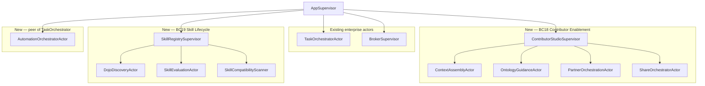
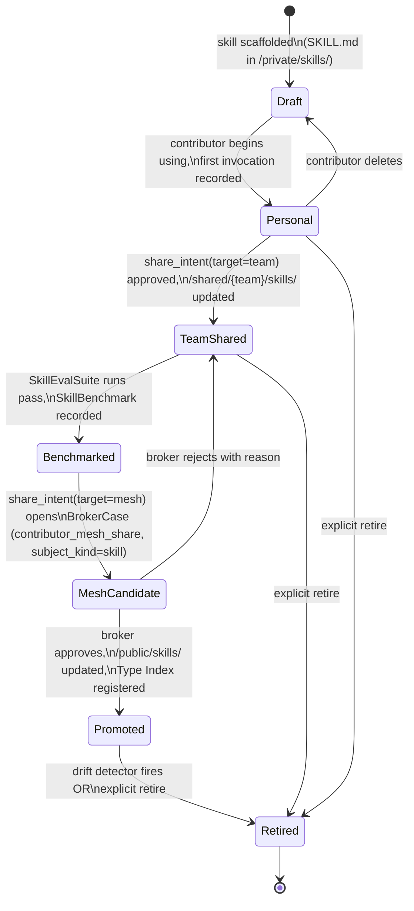

# ADR-057: Contributor Enablement Platform

## Status

Proposed

## Date

2026-04-20

## Context

VisionClaw today has a strong substrate layer (BC1-BC10: authentication, graph
data, physics, WebSocket, settings, analytics, ontology, agents, rendering,
binary protocol) and a rapidly-maturing management mesh (BC11 Judgment Broker,
BC12 Workflow Lifecycle, BC13 Insight Discovery, BC14 Enterprise Identity,
BC15 KPI Observability, BC16 Connector Ingestion, BC17 Policy Engine). Those
two strata answer, respectively, "what is the system made of?" and "how is
its output governed?".

The layer in between — **the everyday workspace in which a human plus an AI
partner produces a unit of judgmental work** — does not exist as a first-class
product. Contributors today improvise across Logseq, the terminal, the MCP
command palette, the graph view, and their Pod. Each of those surfaces is
individually capable; stitched together manually they produce individual
productivity but no institutional compounding. A skill a contributor develops
on Monday is effectively invisible on Tuesday to anyone else. A routine they
stabilise is a private shell alias. An insight they harvest from their Pod
memory is trapped in their screen.

The evidence annex at
`docs/design/2026-04-20-contributor-studio/evidence-annex.md` catalogues three
external signals that converge on the same gap:

- **Ramp Glass**: the differentiator is the harness, not the model; invisible
  complexity; "one person's breakthrough becomes everyone's baseline"; memory
  by default; workspace, not chat window; everything connected from day 1.
- **a16z institutional AI**: coordination beats individual productivity;
  unprompted discovery is the step-change; reducing organisational slop is a
  measurable outcome.
- **Anthropic skill-creator v2**: skills have a lifecycle (create → install →
  eval → share → benchmark → retire), and that lifecycle must be enforced by
  tooling, not documentation.

BC11-BC17 solve governance. They do not solve daily creation. Without a
contributor-facing stratum, BC11 becomes a bottleneck: every good idea either
escalates to the broker or dies locally. With a contributor-facing stratum,
the broker sees only the cases that genuinely require judgment, and the
upstream funnel (Private → Team → Mesh) does most of the filtering without
human intervention.

This ADR therefore proposes the **Contributor Enablement Platform**: the layer
that sits above the substrate, below the management mesh, and around everyday
knowledge work. It consists of two new bounded contexts and a new primary
product surface (Contributor Studio) that is a peer of `/broker`, not a tab
within it.

Companion artefacts (to be produced alongside this ADR; not duplicated here):

- PRD-003: Contributor AI Support Stratum (product requirements)
- `docs/explanation/contributor-support-stratum.md` (conceptual framing)
- `docs/explanation/ddd-contributor-enablement-context.md` (full domain model)
- `docs/design/2026-04-20-contributor-studio/*` (UI/UX design pack and
  acceptance tests)

## Decision Drivers

- **Sovereign-first.** Every artefact a contributor produces must land in
  their Pod under the ADR-052 WAC model. No contributor artefact is born on
  the backend. The backend is an indexer; the Pod is the write-master.
- **Compounding by default.** One person's breakthrough must be able to
  become everyone's baseline through an explicit, policy-governed funnel —
  not accidentally and not never.
- **Governable without being the broker workbench.** The broker (BC11) is
  the final reviewer. The contributor layer must not pollute the broker's
  inbox with low-stakes work; it must do the pre-filtering.
- **Model-routed by tier.** Per ADR-026, routine contributor-assist calls
  (Sensei nudges, skill-lookup) should land on Tier 2 Haiku; reasoning-heavy
  calls (share-intent rationale, eval synthesis) on Tier 3; deterministic
  transforms (skill scaffolding) on Tier 1 Agent Booster.
- **Testable skill lifecycle.** A skill has state (Draft, Personal, Team,
  Benchmarked, Mesh Candidate, Promoted, Retired) and measurable quality
  (eval pass rate, benchmark score). The lifecycle must be enforced by the
  aggregate, not by convention.
- **Proactive, not reactive.** The layer must surface relevant skills,
  ontology neighbours, and prior workspace state before the contributor asks
  — Ramp Glass "memory by default".
- **Zero-setup day-1 onboarding.** A new contributor with a Pod should see a
  working Studio with context from their existing Pod within one session.
- **Do not fork governance.** Share-state transitions and cross-boundary
  promotions reuse the policy engine (ADR-045) and broker workbench
  (ADR-041/049); this ADR does not invent a parallel governance layer.

## Considered Options

### Option 1: New core bounded context BC18 Contributor Enablement, plus supporting BC19 Skill Lifecycle, surfaced as `/studio` (CHOSEN)

Introduce two bounded contexts:

- **BC18 Contributor Enablement (core domain)** — owns the daily contributor
  experience, the multi-pane workspace, the pod-context assembly, the
  ontology guidance rail, the share-intent workflow, and the inbox of
  agent-delivered briefs. Aggregate roots: `ContributorWorkspace`,
  `GuidanceSession`, `ShareIntent`, `WorkArtifact`.

- **BC19 Skill Lifecycle (supporting domain)** — owns the full lifecycle of
  a reusable skill package, from scaffold to retirement. Aggregate roots:
  `SkillPackage`, `SkillVersion`, `SkillEvalSuite`, `SkillBenchmark`,
  `SkillDistribution`.

BC18 is surfaced as the `/studio` route family on top of the ADR-046 router
+ sidebar model — a peer of `/broker`, not a sub-tab. Skill Lifecycle is
consumed by Contributor Studio (install, run, share, benchmark) and by the
Judgment Broker (review of Mesh-Candidate skills).

Upward integration:

- Contributor work that has been repeatedly reused across a team is an
  `Insight` candidate (BC13), not a `WorkflowProposal` (BC12) until it has
  been explicitly shaped as one. BC18 emits `InsightCandidateDetected` to
  BC13; it does not write to BC12 directly.
- Mesh promotion of any contributor artefact (skills, work artifacts,
  ontology terms, workflows, graph views) is a `WorkflowProposalSubmitted`
  equivalent handled by BC11 via a dedicated **`contributor_mesh_share`**
  case category with a `subject_kind` discriminator. BC18 emits
  `MeshShareCandidateRaised` to BC11; the broker approves or rejects.
  `subject_kind=ontology_term` further delegates to ADR-049
  `migration_candidate` downstream on approve.
- Role gates for Studio access come from BC14 (Contributor role at minimum).
- Share-state transitions (Private → Team → Mesh) invoke the BC17 policy
  engine for each transition.
- KPI counters (activation, time-to-first-result, reuse, share-to-mesh
  conversion) feed BC15.

**Pros**

- Clean domain boundaries: contributor-creation is distinct from
  broker-adjudication, and skill-lifecycle is distinct from workflow-
  lifecycle.
- Reuses every governance primitive already paid for in BC11/BC13/BC15/BC17.
- Deliverable incrementally (phase plan below).
- Works with both the Nostr-native and OIDC-delegated identity paths
  (ADR-040) without modification.
- The `/studio` surface is a first-class route under the ADR-046 router;
  lazy-loaded; does not degrade the graph-only experience.

**Cons**

- Two new bounded contexts add architectural surface area (new Rust modules,
  new Neo4j labels, new MCP tools, new pod containers). This is the price of
  doing it properly.
- Eval infrastructure for skills is a real cost: BC19 must run bounded
  sandboxes, record results, compute pass rates, and surface benchmarks.
- Share-state transition rules must be kept in sync between the policy
  engine, the Pod WAC layer, and the UI.

### Option 2: Extend BC11 Judgment Broker with a contributor-facing lane

Treat contributor work as additional `BrokerCase` categories under the
existing workbench (as ADR-049 did for migration candidates).

**Rejected because**:

- BC11 is a governance surface. Its purpose is to act on cases that require
  judgment. Mixing "help a contributor do their day's work" into the broker
  aggregate violates single responsibility and creates alert fatigue for the
  broker. The broker inbox should contain a handful of high-stakes cases per
  day, not hundreds of workspace events per contributor.
- Contributors and brokers have different permission envelopes, different
  latency expectations (seconds vs minutes), and different UX affordances
  (multi-pane creation vs single-case adjudication).
- A contributor's `ShareIntent` flowing through the broker's escalation
  lifecycle would slow every share to broker-response time. The funnel must
  short-circuit the broker for Private → Team transitions.

### Option 3: Ship as a pure client-side shell over existing MCP tools

Build the Studio as a React feature module that composes existing MCP tools
(graph, memory, agent) with no new backend context.

**Rejected because**:

- Business logic would leak to the client. Share-state invariants (a
  `public:: true` artefact targeting `/public/` must update Type Index,
  emit a domain event, trigger WAC propagation) cannot be enforced from the
  browser alone.
- No server-side place to emit KPI events (BC15) means contributor activation
  and skill reuse become unmeasurable.
- Skill eval suites require a sandboxed, server-side runner with resource
  accounting, result persistence, and actor supervision; they cannot run in
  the browser.
- Pod-to-backend cache coherence for workspace context (ADR-052 notification
  channel + polling fallback) requires a server-side subscriber; the client
  cannot maintain the subscription across sessions and devices.

### Option 4: Treat the Studio as a palette/feature flag on the existing `/graph` view

Add a "contributor mode" toggle to the existing graph visualisation, with
panels sliding in over the canvas.

**Rejected because**:

- Fails the Ramp Glass "workspace, not chat window" principle. The graph
  canvas is an exploration surface, not a production surface; overlaying
  production work on top of it confuses both.
- No room for dense multi-pane interaction (editor, AI lane, ontology rail,
  skill palette, inbox) without cannibalising the canvas.
- The settings-panel precedent (`IntegratedControlPanel`) has already shown
  that a 320-400px side panel cannot carry a workspace; data-dense tabular
  work needs full-width layout. ADR-046 explicitly rejected this approach
  for the enterprise surfaces; the same reasoning applies here.
- Contributors would continue bouncing between tools because the graph view
  would not own the "place where work happens" concept.

## Decision

**Option 1. Introduce BC18 (Contributor Enablement) as a core bounded context
and BC19 (Skill Lifecycle) as a supporting bounded context. Surface as the
`/studio` route family with a multi-pane Contributor Studio on top of the
ADR-046 router + sidebar model.**

### Domain Model (summary)

Full domain model — aggregate roots, entities, value objects, ports, domain
events, invariants, context-map relationships — lives in
`docs/explanation/ddd-contributor-enablement-context.md`. The ADR-level
summary:

**BC18: Contributor Enablement (core)**

| Aggregate | Purpose |
|-----------|---------|
| `ContributorWorkspace` | A named multi-pane session: active artefact, open panes, pod-context snapshot, recent history. One per route instance. |
| `GuidanceSession` | A time-bounded "Sensei" interaction: nudge stream, accepted/dismissed counts, feedback trail. Reset per workspace session. |
| `ShareIntent` | A contributor's explicit intent to move an artefact across a share-state boundary (Private → Team → Mesh). Carries target scope, rationale, policy-engine evaluation. |
| `WorkArtifact` | The unit of work being produced: a page draft, an agent prompt, a skill scaffold, a routine. Pod-resident; backend indexed. |

**BC19: Skill Lifecycle (supporting)**

| Aggregate | Purpose |
|-----------|---------|
| `SkillPackage` | A named, versioned capability that the contributor (or a peer) has published. Has an `SKILL.md`, tool-sequence manifest, and state. |
| `SkillVersion` | An immutable snapshot of a `SkillPackage` at a point in time; benchmark anchor. |
| `SkillEvalSuite` | A set of deterministic tests for a skill. Belongs to a version. |
| `SkillBenchmark` | A recorded run of an eval suite on a version, producing pass rate and model-tier cost figures. |
| `SkillDistribution` | A record of who installed which version where (pod, team, mesh). Drives reuse metrics and retirement nudges. |

### Actor Topology

New actors joining the existing supervision tree (peer of the enterprise
actors from ADR-041/ADR-046):



Responsibilities:

- `ContextAssemblyActor` — assembles a workspace's pod context (active
  artefact, ontology neighbours, recent edits, collaborators) on demand and
  on Pod notification events. Feeds the `GET /api/studio/workspaces/:id/context`
  endpoint.
- `OntologyGuidanceActor` — "Sensei"; on workspace focus change, computes
  three candidate skills + three related pages + one ontology tension, with
  a bounded recompute budget.
- `PartnerOrchestrationActor` — routes AI-partner calls across ADR-026
  tiers; maintains the per-workspace conversation scaffold.
- `ShareOrchestratorActor` — drives the Private → Team → Mesh transitions;
  interacts with BC17 policy engine, ADR-052 Pod WAC, BC11 broker, and
  Type Index.
- `DojoDiscoveryActor` — walks peer pods via the ADR-029 Type Index to
  surface installable skills; runs on a polite schedule and on explicit
  user request.
- `SkillEvaluationActor` — runs a `SkillEvalSuite` against a `SkillVersion`
  in a sandbox; records `SkillBenchmark`. Uses the ADR-026 tier router for
  eval-generation calls.
- `SkillCompatibilityScanner` — on skill install/update, verifies tool-
  availability and version bounds against the current environment.
- `AutomationOrchestratorActor` — peer of `TaskOrchestratorActor`; executes
  contributor-owned scheduled routines from `/private/automations/` and
  delivers results to `/inbox/` for human review.

### MCP Tool Additions

The new MCP tools below are proposed by this ADR; any disputed surface is
listed in **Open Questions** rather than silently invented.

| Tool | Purpose |
|------|---------|
| `skill_publish(description, tool_sequence, target_scope)` | Writes `SKILL.md` to `/public/skills/` (or `/shared/skills/` for Team scope), updates Type Index, emits `SkillPublished`. |
| `skill_install(skill_uri, version?)` | Clones a peer skill into `/private/skills/` with version pin; runs compatibility scan; emits `SkillInstalled`. |
| `skill_eval_run(skill_id, suite_id)` | Dispatches `SkillEvaluationActor`; returns a benchmark handle. |
| `studio_context_assemble(workspace_id)` | Returns the pod context + ontology neighbours + recent work for a workspace; cached and notification-invalidated. |
| `sensei_nudge(workspace_id, current_focus)` | Returns three recommended skills + three related pages + one ontology tension for the current focus. Tier 2 by default. |
| `share_intent_create(artifact_ref, target_scope, rationale)` | Opens a `ShareIntent` via `ShareOrchestratorActor`; triggers policy evaluation and WAC mutation. |
| `automation_schedule(routine_spec)` | Installs a cron definition to `/private/automations/`; registers with `AutomationOrchestratorActor`. |
| `inbox_ack(brief_id, disposition)` | Marks a contributor inbox brief as reviewed, with one of `accept | defer | dismiss | escalate_to_broker`. |

### Pod Layout Extensions (on top of ADR-052)

Extending the ADR-052 tree without changing any of its invariants:

```
/
├── .acl                          (unchanged — owner-only)
├── private/
│   ├── .acl                      (unchanged — owner-only, acl:default)
│   ├── kg/                       (unchanged)
│   ├── config/                   (unchanged)
│   ├── bridges/                  (unchanged — ADR-048)
│   ├── contributor-profile/      NEW: profile.ttl, goals.jsonld,
│   │                                   collaborators.jsonld,
│   │                                   communication-prefs.jsonld
│   ├── automations/              NEW: *.json — scheduled routine specs
│   ├── skill-evals/              NEW: *.jsonl — personal eval runs,
│   │                                   benchmark history
│   ├── workspaces/               NEW: *.jsonld — ContributorWorkspace
│   │                                   snapshots
│   └── skills/                   NEW: installed skill packages (pinned
│                                       versions, local tool-sequences)
├── public/
│   ├── .acl                      (unchanged — foaf:Agent Read,
│   │                                    owner Write/Control, acl:default)
│   ├── kg/                       (unchanged)
│   ├── skills/                   NEW: {skill-name}.md — SKILL.md for
│   │                                   every Mesh-published skill
│   └── workspaces/               NEW: {template}.jsonld — opt-in shared
│                                       workspace templates
├── shared/
│   ├── .acl                      (unchanged — owner-only; Wave-2 named-
│   │                                   group WAC)
│   └── skills/                   NEW: team-scoped skill packages (Team
│                                       share-state); WAC via ADR-052
│                                       named-group pattern
├── inbox/                        NEW: *.jsonld — agent-delivered briefs
│                                       awaiting contributor review
└── profile/                      (unchanged)
```

All new containers respect ADR-052 private-by-default. `/shared/skills/`
uses the ADR-052 named-group WAC pattern (one group per team). `/inbox/` is
owner-only; `AutomationOrchestratorActor` writes via NIP-26 delegated key.

### REST/WebSocket Surface

New endpoints, all behind the `STUDIO_ENABLED` feature flag and requiring
the `Contributor` role (ADR-040) at minimum:

```
POST   /api/studio/workspaces                         create a workspace
GET    /api/studio/workspaces/:id                     get metadata
GET    /api/studio/workspaces/:id/context             assembled context
PATCH  /api/studio/workspaces/:id                     update open panes etc.
DELETE /api/studio/workspaces/:id                     archive

GET    /api/studio/sensei/nudge?workspace_id=...&focus=...
                                                      3 skills + 3 pages
POST   /api/studio/sensei/feedback                    accept/dismiss signal

POST   /api/studio/share-intents                      open a ShareIntent
GET    /api/studio/share-intents/:id                  status + policy trail
POST   /api/studio/share-intents/:id/approve          contributor confirms
POST   /api/studio/share-intents/:id/cancel

POST   /api/skills/publish                            publish a skill
POST   /api/skills/:id/install                        install from peer pod
GET    /api/skills/:id                                metadata + SKILL.md
GET    /api/skills/:id/benchmarks                     list benchmark history
POST   /api/skills/:id/evals/run                      run an eval suite
POST   /api/skills/:id/retire                         explicit retirement

POST   /api/automations                               schedule a routine
GET    /api/automations                               list own routines
DELETE /api/automations/:id                           remove

GET    /api/inbox                                     pending briefs
POST   /api/inbox/:id/ack                             accept/defer/dismiss/
                                                      escalate_to_broker

WebSocket /api/ws/studio
  channels:
    - studio:workspace:{id}         context and pod-notification deltas
    - studio:sensei:{workspace_id}  proactive Sensei pushes
    - studio:inbox                  new/changed briefs
    - skills:registry               publish / retire events
```

The WebSocket channel reuses the existing ADR-046 subscription pattern; no
new socket infrastructure.

### Share-State Transition Rules

Three share states with five governed transitions. Each transition is
mediated by `ShareOrchestratorActor`, evaluated by BC17, and has an explicit
WAC side effect under ADR-052.

| From | To | Trigger | Policy check (ADR-045) | Emitted event | WAC mutation | Notification |
|------|----|---------|------------------------|---------------|--------------|--------------|
| Private | Team | Contributor opens `ShareIntent` with `target_scope=team:{name}` | `separation_of_duty` (not required), `rate_limit`, team-membership check | `ArtifactSharedToTeam` | Move into `/shared/{team}/`; apply named-group Read ACL | Team channel + author ack |
| Team | Private | Contributor revokes | None mandatory; `rate_limit` | `ArtifactUnshared` | Move back to `/private/`; clear named-group ACL | Author only |
| Private or Team | Mesh | `ShareIntent` with `target_scope=mesh`; requires broker review | `escalation_threshold`, `domain_ownership`, `separation_of_duty` (Contributor ≠ Broker) | `MeshShareCandidateRaised` → BC11 case of category `contributor_mesh_share` (with `subject_kind` discriminator: `skill` \| `work_artifact` \| `ontology_term` \| `workflow` \| `graph_view`) | No WAC change yet; staged | Broker inbox |
| Mesh-candidate | Mesh (promoted) | Broker approves case | Policy-engine re-evaluation with broker identity | `ArtifactPromotedToMesh` | Move into `/public/skills/`; update Type Index; register in `SkillRegistry` | Author, broker, all subscribers |
| Mesh | Retired | Scheduled drift check OR explicit author retirement | `rate_limit` | `SkillRetired` | Move out of `/public/skills/` to `/private/skills/archive/`; remove Type Index entry | Subscribers |

Two invariants enforced by `ShareOrchestratorActor`:

- A `ShareIntent` cannot skip a state. Private → Mesh transitions still
  create the intermediate Mesh-candidate `BrokerCase`.
- The content flag discipline from ADR-052 (double-gate: `public:: true`
  + target under `/public/`) applies to Mesh promotion as well.

### Skill Lifecycle State Machine



Guard conditions:

- `Personal → TeamShared` requires at least one `SkillDistribution` record
  (the skill has been invoked) to discourage shipping untested scaffolds.
- `TeamShared → Benchmarked` requires a `SkillEvalSuite` with at least one
  passing run.
- `Benchmarked → MeshCandidate` requires benchmark pass rate ≥ configurable
  threshold (default 0.8) and team adoption count ≥ N (default 3) distinct
  contributors.
- `Promoted → Retired` via drift detector fires when either (a) benchmark
  pass rate drops below 0.6 across two consecutive runs, or (b) the skill
  has had zero `SkillDistribution` events in a configurable window.

### Integration Points

Every downstream context consumed by, or consuming from, BC18/BC19:

| Context | Direction | Event(s) | ACL / Adapter | Notes |
|---------|-----------|----------|---------------|-------|
| BC11 Judgment Broker | BC18 → BC11 | `MeshShareCandidateRaised` opens a `BrokerCase` of category `contributor_mesh_share` with a `subject_kind` discriminator (`skill` \| `work_artifact` \| `ontology_term` \| `workflow` \| `graph_view`) | `ShareOrchestratorActor` is the adapter; reuses ADR-049 case-category extension pattern | Broker reviews and approves/rejects as a peer of migration candidates; `subject_kind=ontology_term` further delegates to ADR-049 `migration_candidate` downstream on approve |
| BC12 Workflow Lifecycle | BC18 → BC12 (one-way, optional) | `WorkArtifact` patterns of type "multi-step routine" may be nominated for `WorkflowProposalSubmitted` | Explicit contributor action only; not automatic | Most skills remain skills; only those representing durable cross-role workflows become `WorkflowProposal`s |
| BC13 Insight Discovery | BC18 → BC13 | `InsightCandidateDetected` when repeated artefact patterns are observed across contributors | `WorkArtifactObserver` service in BC18 (no direct write to BC13) | Reuses BC13's confidence-threshold surfacing |
| BC14 Enterprise Identity | BC14 → BC18 | `Contributor` role gate; OIDC-delegated ephemeral keys used for pod writes | Standard middleware; no new adapter | Nostr-native users use NIP-07 directly |
| BC15 KPI Observability | BC18/BC19 → BC15 | `ContributorActivated`, `SkillReused`, `ShareToMeshConverted`, `SenseiHit`, `SenseiDismissed`, `RedundantSkillRetired` | KPI service subscribes via existing `EventSourcePort` | New metrics: contributor activation rate, time-to-first-result, skill-reuse per contributor, share-to-mesh conversion rate, Sensei hit rate, redundant-skill retirement count |
| BC17 Policy Engine | BC18 → BC17 | All share-state transitions; skill-publish to Mesh | `ShareOrchestratorActor` and `SkillRegistrySupervisor` are the callers | Reuses built-in rule types (escalation_threshold, separation_of_duty, rate_limit, domain_ownership) |
| ADR-052 Pod WAC | BC18 ↔ Pod | Share-state transitions drive Pod MOVE + ACL updates | `PodWriteAdapter` | Double-gate discipline preserved |
| ADR-029 Type Index | BC18/BC19 ↔ Pod | `skill_publish` and `share_intent_create(mesh)` update the Type Index; `DojoDiscoveryActor` reads peer Type Indices | Reuses `ensurePublicTypeIndex` / `registerAgentInTypeIndex` | No new discovery protocol |
| ADR-030 Agent Memory Pods | BC18 reuses | `GuidanceSession` state writes to `/agents/sensei/memory/` per the ADR-030 pattern | Existing API | No schema change |

## Consequences

### Positive

- **Compounding loop closed.** A skill that one contributor ships on
  Monday is discoverable (via peer Type Index), installable, evaluable,
  and — with broker approval — promotable to the mesh by Friday. "One
  breakthrough becomes everyone's baseline" is a mechanism, not a slogan.
- **Sovereign by default.** Every contributor artefact lives in their Pod
  under the ADR-052 default-private WAC. No contributor work is backend-
  resident. Walk-away remains preserved end-to-end.
- **Observable adoption.** Six new BC15 metrics make contributor-layer
  impact quantifiable. Without them, we could ship the Studio and still
  not know whether it was used.
- **Measurable skill quality.** `SkillEvalSuite` + `SkillBenchmark` make
  skill quality a number, not a reputation. Drift detection is automatic.
- **Reduced broker bottleneck.** Private → Team transitions short-circuit
  the broker. The broker sees only Mesh-candidate cases, which is where
  their judgment is actually needed.
- **Ramp Glass-style invisible complexity.** The Sensei, Pod-context
  assembly, and share-intent UI hide all of the above from the contributor
  until the contributor wants to see it.

### Negative

- **Two new bounded contexts** add architectural surface area: new Rust
  modules, new Neo4j labels, new MCP tools, new pod containers, and new
  WebSocket channels. Mitigation: the phased rollout below.
- **Eval infrastructure is a real cost.** `SkillEvaluationActor` needs a
  sandboxed runner with resource accounting, failure isolation, and tier-
  aware model routing. Mitigation: reuse the existing actor supervision
  and ADR-026 tier router; cap eval runs per contributor per day.
- **Pod-to-backend cache coherence surface widens.** Every new pod
  container (`/inbox/`, `/private/automations/`, `/shared/skills/`) is a
  new subscription target. Mitigation: the ADR-052 Solid Notifications +
  polling-fallback model extends without modification; add notification
  health checks per new container to the admin dashboard.
- **Risk of nagware.** If the `OntologyGuidanceActor` nudges too often or
  surfaces low-quality suggestions, the Studio will feel like Clippy.
  Mitigation: per-workspace nudge-rate limit; Sensei dismiss signals feed
  back into its own relevance model; "quiet mode" preference in
  `/private/contributor-profile/communication-prefs.jsonld`.

### Neutral

- **Model routing under ADR-026.** Tier 2 Haiku handles the bulk of
  Sensei nudges and skill-lookup responses (~500 ms, $0.0002 per call).
  Tier 3 Sonnet/Opus handles share-intent rationale generation and eval
  synthesis (2-5 s, $0.003-0.015). Tier 1 Agent Booster handles
  deterministic skill-scaffold transforms. No new tier is introduced.
- **Existing enterprise surfaces unaffected.** BC11-BC17 and the `/broker`,
  `/workflows`, `/kpi`, `/connectors`, `/policy` surfaces continue working
  unchanged.
- **Existing graph experience unchanged.** The `/studio` route is lazy-
  loaded per ADR-046; it does not initialise the R3F canvas.

## Migration / Rollout

- **Feature flag `STUDIO_ENABLED`**, default `false`. All new routes and
  actors are disabled behind this flag.
- **Phase 0 dependency**: the enterprise mesh wire/auth gaps catalogued in
  `qe-enterprise-audit-report.md` (15+ endpoints missing auth per the
  CQRS gap analysis) must be closed before Studio rollout, because the
  Studio endpoints inherit the same authentication middleware.
- **Phase 1 (2 wks)** — Contributor Studio MVP: route shell, pod-context
  assembly, ontology rail, basic AI lane. Single-contributor use only; no
  sharing. No skill lifecycle yet.
- **Phase 2 (3 wks)** — Skill Dojo: skill discover/install/publish with
  Private and Team share states; peer pod discovery via Type Index.
- **Phase 3 (3 wks)** — Share-to-mesh funnel: Mesh share state; BC11 case
  category `contributor_mesh_share` with `subject_kind` discriminator;
  broker UI lane per ADR-049 pattern.
- **Phase 4 (3 wks)** — Evals, automations, proactive Sensei:
  `SkillEvalSuite`/`SkillBenchmark`, `AutomationOrchestratorActor`, full
  `OntologyGuidanceActor` with nudge-rate limiting.
- **Pilot**: five internal contributors at Phase 1 ship; broaden to full
  contributor population after Phase 3 ships and BC15 metrics are green.

## Related ADRs

| ADR | Relationship |
|-----|--------------|
| ADR-026 | 3-tier model routing — `PartnerOrchestrationActor` is a direct consumer; Tier 2 is the default Sensei tier |
| ADR-027 | Pod-backed graph views — Studio artefact provenance relies on Pod-as-write-master |
| ADR-029 | Type Index discovery — `DojoDiscoveryActor` and skill publish both extend Type Index usage |
| ADR-030 | Agent Memory Pods — `GuidanceSession` reuses the `/agents/{id}/memory/` container pattern |
| ADR-034 | Needle Bead Provenance — Mesh skill promotion emits signed provenance events |
| ADR-040 | Enterprise Identity — `Contributor` role is the minimum Studio role; OIDC-delegated keys sign Pod writes |
| ADR-041 | Judgment Broker Workbench — Mesh promotion routes through a new case category, peer of migration candidates |
| ADR-042 | Workflow Proposal Object Model — optional promotion path for durable cross-role routines |
| ADR-043 | KPI Lineage Model — six new contributor metrics feed BC15 |
| ADR-045 | Policy Engine — every share-state transition is a policy evaluation |
| ADR-046 | Enterprise UI Architecture — `/studio` is a lazy-loaded peer route |
| ADR-048 | Dual-Tier Identity Model — contributor artefact promotion preserves the KG-vs-ontology tier distinction |
| ADR-049 | Insight Migration Broker Workflow — case-category extension pattern is reused for `contributor_mesh_share`; `subject_kind=ontology_term` further delegates to ADR-049 `migration_candidate` downstream |
| ADR-052 | Pod Default WAC — all new pod containers respect the default-private + `/public/` + `/shared/` + `/inbox/` model |

## Open Questions

1. **MCP tool naming and ownership.** The tool set listed above is the
   minimum to deliver the decision; exact names (`sensei_nudge` vs
   `studio_nudge`, `skill_publish` vs `skill_registry_publish`) and whether
   they live under `studio_*`, `skills_*`, or a mix should be agreed with
   the MCP conventions owner before Phase 1 lands.
2. **Automation execution guarantees.** Should
   `AutomationOrchestratorActor` guarantee at-most-once, at-least-once, or
   exactly-once delivery of the resulting brief to `/inbox/`? Exactly-once
   requires idempotency keys on Pod writes; at-least-once is simpler but
   can produce duplicate inbox items.
3. **Sensei tuning feedback loop.** Should Sensei dismiss signals feed a
   per-contributor relevance model (BC18-local) or a shared ontology-
   guidance model (BC19-supporting)? Per-contributor is easier to reason
   about; shared produces faster collective improvement at the cost of a
   training pipeline.
4. **Benchmark cost accounting.** `SkillBenchmark` runs consume tier-2/3
   model budget. Who pays — the publishing contributor's budget, the
   consuming contributor's budget, or a platform pool? This affects
   `rate_limit` policy configuration and admin cost visibility.
5. **Mesh retirement automation.** The drift detector in the skill
   lifecycle fires on pass-rate drop OR zero-distribution. Should it (a)
   auto-retire after N consecutive drift firings, (b) auto-open a
   `BrokerCase` for retirement review, or (c) only surface a Sensei nudge
   to the author? The current ADR is ambiguous; each option has different
   alert-fatigue implications.
6. **Per-contributor storage quotas.** `/private/skill-evals/` and
   `/private/workspaces/` grow unbounded. Do we adopt the same 60 s
   polling / notification health checks that ADR-052 uses for public
   containers, plus a per-container size cap? The answer bleeds into
   admin tooling.

## Implementation Log

### 2026-04-20 — BC19 Skill Lifecycle (Rust) — agent C2 / worktree `agent-a9dc6e5c`

**Scope delivered.** BC19 aggregates, value objects, lifecycle state machine,
and the supporting actor tree. Scaffolding only — MCP glue (`skill_publish`,
`skill_install`, `skill_eval_run`) is agent X1's remit, the `DojoDiscoveryActor`
is P2's, and the React Dojo UI is C3's.

**Files added.**

- `src/domain/mod.rs` — new domain layer root.
- `src/domain/skills/{mod.rs, lifecycle.rs, skill_package.rs, skill_version.rs,
  skill_eval_suite.rs, skill_benchmark.rs, skill_distribution.rs}` — aggregate
  root + entities + value objects.
- `src/actors/skill_registry_supervisor.rs` — supervisor plus `SkillPackage`
  registry handlers (`RegisterPackage`, `GetPackage`, `TransitionPackage`,
  `AttachBenchmark`, `TriggerConfigChangeScan`, `RunSkillEval`).
- `src/actors/skill_evaluation_actor.rs` — per-§8.2 FSM
  (`Idle → Allocating → Running → Grading → Analysing → Recording`).
- `src/actors/skill_compatibility_scanner.rs` — bounded-concurrency fan-out
  via `tokio::sync::Semaphore` (PRD-003 §14 R12); default permit count **8**;
  `BenchmarkDispatcher` trait injection point for the MCP runner.
- `tests/bc19_tests.rs` — 14 tests covering lifecycle transitions, gates,
  aggregate invariants, version immutability, benchmark baseline rule, and
  the scanner's semaphore cap.

**Invariants enforced in code.**

1. `SkillVersion` is immutable after `mark_benchmarked(...)`
   (`SkillVersionError::ImmutableAfterBenchmark`).
2. `TeamShared` requires ≥ 1 passing benchmark within the last 30 days.
3. `MeshCandidate` requires ≥ 3 passing benchmarks within 30 days **and** a
   `broker_review_ok` marker, **and** an external `share_intent_present` flag
   (BC19 inv. 4 — self-promotion forbidden).
4. `Retired` is terminal; entry requires `successor_ref` or
   `base_model_absorbed` (BC19 inv. 2).
5. Distribution widening (`Personal → Team → Company → Public`) requires
   policy approval (BC19 inv. 5).
6. `SkillFingerprint` mismatch on install is detected at the aggregate
   (BC19 inv. 6).
7. Non-initial `SkillBenchmark` without `BaselineComparison` is rejected
   (BC19 inv. 7).

**Follow-up wiring (not owned by this agent).**

- MCP tool dispatch: agent X1 replaces `NoopBenchmarkDispatcher` with an
  `SkillEvalRunDispatcher` that calls `skill_eval_run`.
- `DojoDiscoveryActor` attaches as a sibling of the scanner under
  `SkillRegistrySupervisor` (P2).
- HTTP handlers under `/api/skills/*` (C3's Studio wires REST through the
  supervisor; routing lives in `src/handlers/skills_handler.rs`, not yet
  created).
- KPI forwarder: BC15 adapter consumes `SkillBenchmarkCompleted` /
  `SkillPromoted` / `SkillRetired` domain events — currently struct-only,
  no event bus emission. Event-bus integration pairs with C4.

**Verification.** `cargo check -p webxr --tests` locally; test count = 14
unit + integration tests in `tests/bc19_tests.rs`.

## References

- Strategic brief: `project-state/contributor-nexus-strategic-brief-2026-04-20`
  (RuVector memory)
- Evidence annex:
  `docs/design/2026-04-20-contributor-studio/evidence-annex.md`
- PRD: `docs/PRD-003-contributor-ai-support-stratum.md`
- Domain model: `docs/explanation/ddd-contributor-enablement-context.md`
- Conceptual framing: `docs/explanation/contributor-support-stratum.md`
- Design pack: `docs/design/2026-04-20-contributor-studio/*`
- QE dependency: `docs/qe-enterprise-audit-report.md`
- Ramp Glass thesis notes; a16z institutional AI; Anthropic skill-creator v2
  (full citations in evidence annex)
