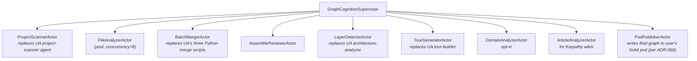

# ADR-065: Rust-Native Code Analysis Pipeline

**Status:** Proposed
**Date:** 2026-05-01
**Deciders:** jjohare, VisionClaw platform team
**Supersedes:** None
**Implements:** PRD-005 §6 Epic B, Epic C
**Threat-modelled:** PRD-005 §19 (R-24 tree-sitter crash, R-28 secret leak, R-29 LLM provider retention, F-06 LLM non-JSON, F-17 context overflow)

## Context

PRD-005 mandates a code-analysis capability comparable to Understand-Anything (UA) but with Rust-only runtime. UA is TypeScript + Python + Node-tree-sitter; we will not embed any of those in production. The analyzer must produce typed graphs (per ADR-064) for arbitrary repositories, multi-language, with LLM-augmented semantic enrichment.

QE flagged five operational concerns:

1. **R-24 tree-sitter crash via fuzzed input** — adversarial source crashes the parser, supervisor restart loop.
2. **R-28 secret leak to LLM** — regex-only scrubbing has known false-negatives on AWS gov keys, multi-line PEM, base64-split tokens.
3. **R-29 LLM provider retention** — sending source to providers without zero-retention contract is a data-exfil pathway.
4. **F-06 LLM returns non-JSON** — pipeline hangs.
5. **F-17 context window exceeded** — naive batching truncates silently.

## Decision

**Implement the analyzer as six new Rust crates under `crates/graph-cognition-*`. Wrap tree-sitter in a sandboxed subprocess. Default LLM to local Ollama. Sanitise prompts via defence-in-depth.**

### D1 — Crate decomposition

```
crates/graph-cognition-core/      ← types, kind enums, URN constructors  (depends on: agent-db domain types only)
crates/graph-cognition-extract/   ← tree-sitter wrappers, per-language extractors  (sandboxed)
crates/graph-cognition-merge/     ← dedup, normalize, alias-rewrite (no Python; replaces UA's merge scripts)
crates/graph-cognition-enrich/    ← LLM client trait + entity dedup + prompt sanitiser
crates/graph-cognition-actor/     ← Actix actors orchestrating the pipeline
crates/graph-cognition-cli/       ← `vc analyze` binary (thin wrapper)
```

No top-level `Cargo.toml` member is renamed; new crates added to existing workspace.

### D2 — Tree-sitter sandboxing

Each `LanguageExtractor` runs in a per-file subprocess invoked from a pooled worker (configurable concurrency, default=8). The subprocess:

- Has `seccomp` filter limiting syscalls to `read/write/mmap/munmap/exit_group/rt_sigreturn` plus what tree-sitter actually needs.
- Has wall-clock timeout 30s and RSS limit 256MB enforced via `prlimit`.
- On crash/timeout, the parent records `parse_failed: true` for that file with cause attribute and continues. The file is quarantined in `${session_dir}/parse-quarantine/` and a degraded regex-based extractor produces a minimal node with `extraction_quality: degraded`.

Rationale: tree-sitter parsers have known crash CVEs and adversarial inputs are part of the threat surface (R-24).

### D3 — LLM provider default + retention gate

The `LLMClient` trait (in `graph-cognition-enrich`) abstracts over Ollama, Anthropic, OpenAI, Gemini, local llama.cpp. **Default provider is Ollama with `llama3:70b-instruct`** (local, zero-retention by construction).

Switching to a non-local provider requires:
- An explicit `data_retention_policy: ZeroRetention | TimeLimited(Duration) | Unrestricted` setting per provider in the user's config.
- A first-time-send confirmation prompt showing the policy.
- A CI invariant test: `LLMClient::send` refuses to transmit source to a provider whose policy is `Unrestricted` unless `--allow-unrestricted-providers` flag is set explicitly per-session.

This is a defence-in-depth complement to ADR-064's URN integrity story.

### D4 — Prompt sanitisation (defence-in-depth)

Before any source body enters an LLM prompt, the prompt sanitiser runs **all four** of:

1. **Entropy detector** — Shannon entropy ≥4.5 over ≥20-char tokens.
2. **Trufflehog rule pack** — pinned rules version, refreshed weekly via CI.
3. **`aidefence_scan` MCP** — VC's existing PII/secret scanner.
4. **Repo-allowlist** — known-non-secret high-entropy tokens (e.g., test fixture hashes) configured per repo.

A token flagged by ≥1 detector triggers a user approval pane showing the redacted prompt. The user can: approve once, approve always for this token, or reject. Audit log records every flagged token + resolution.

Quarterly red-team golden corpus of 200 known secret formats — block ≥99%; CI fails if FN >1%.

### D5 — Robust LLM call protocol

Every `LLMClient::send` call:

- Hard timeout 90s via `tokio::time::timeout`.
- On parse failure (non-JSON despite `response_format=json`), one repair pass with a `<repair-json>` system prompt. On second failure, mark the entity `summary_unavailable=true` and continue.
- Pre-flight token-count via `tiktoken`-equivalent; auto-shard batches to fit `model_context − response_budget − safety_margin`. Never retry full batch on truncation; binary-split.
- Per-session token budget (input + output); kill-switch at 80% reached with user prompt.
- Per-call audit row: `prompt_sha256`, `response_sha256`, `model_id`, `tokens_in`, `tokens_out`, `redaction_rule_version`, `provenance_session_urn`.

### D6 — Actor topology and resume

Pipeline runs under `GraphCognitionSupervisor` (sibling to `PhysicsOrchestratorSupervisor`):



State checkpoints land in AgentDB keyed by `(session_urn, phase, batch_id)`. An interrupted analysis resumes via `ResumeAnalysis { session_urn }`. UA's `intermediate/` JSON dir is replaced.

### D7 — Kill-9 survival

Per AC-C.1: any single actor's hard kill triggers supervisor restart and resume-from-checkpoint. Resume must complete the run; integration test injects kill-9 between every consecutive phase pair.

## Consequences

### Positive

- No Python in runtime. UA's three merge scripts and one Python parser become Rust crates with property tests and ≥80% mutation score (Epic B AC).
- Adversarial source cannot crash the analyzer; sandbox limits blast radius to one file.
- Default-local LLM eliminates the most dangerous data-exfil pathway by default.
- Prompt sanitiser defence-in-depth meaningfully closes the secret-leak gap.
- Pipeline survives kill-9; resumability reduces re-cost on long analyses.

### Negative

- Ollama with `llama3:70b` requires significant VRAM (~40 GB) — users without that fall back to `llama3:8b` with reduced quality, or opt into a hosted provider with explicit retention attestation.
- Sandbox subprocess overhead adds ~5-15ms per file vs. in-process tree-sitter. Acceptable per AC-B.3 (≥50 files/sec target retained on rayon-parallelized pool).
- Six-crate workspace adds compile-time overhead.

### Risks

- LLM provider lock-in via prompt-template differences. Mitigated by `LLMClient` trait + PR-review enforcement of no-direct-SDK.
- Sandbox seccomp filter too strict, breaks tree-sitter for new languages. Mitigated by per-language sandbox profile (defined by extractor crate).

## References

- PRD-005 §6 Epic B, Epic C, §7.4 Security
- UA: `understand-anything-plugin/skills/understand-knowledge/parse-knowledge-base.py` (semantics ported, language replaced)
- UA: `understand-anything-plugin/agents/file-analyzer.md` (capabilities; reframed as actor)
- ADR-064 (Typed Graph Schema)
- ADR-066 (Pod-Federated Graph Storage — receiver of pipeline output)
