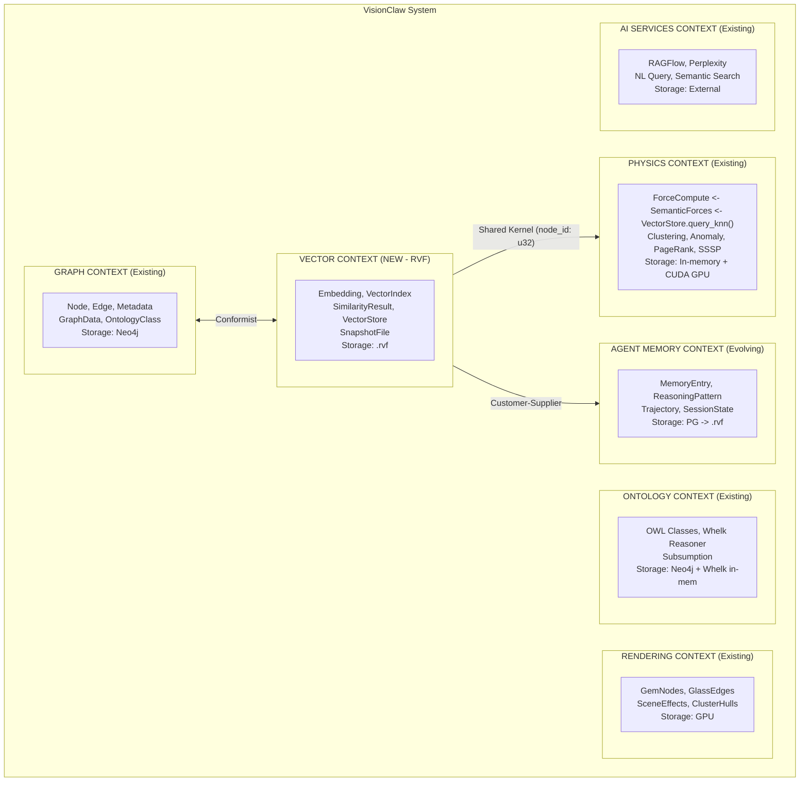
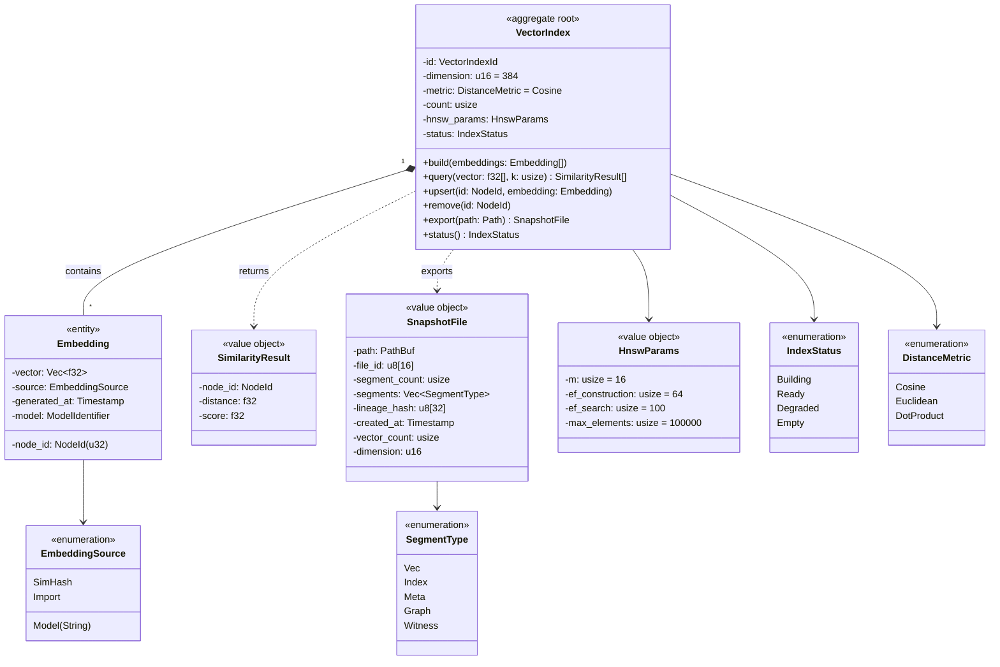
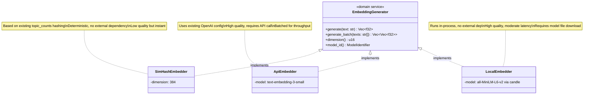
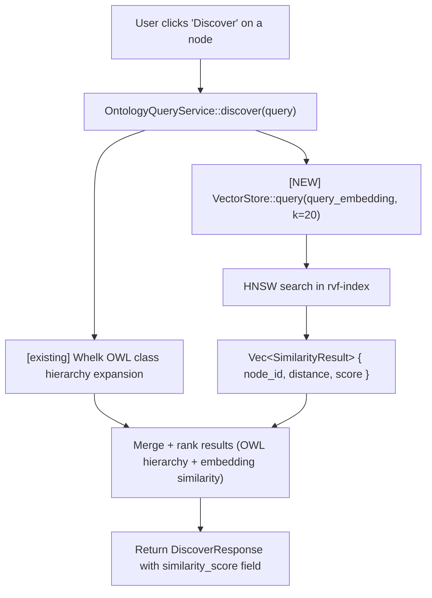

# DDD: RVF Integration Domain-Driven Design

**Status**: Draft
**Date**: 2026-02-14
**Scope**: Bounded contexts, aggregates, and domain model for RVF integration

---

## 1. Strategic Design: Bounded Context Map



### 1.1 Context Relationships

| Upstream | Downstream | Relationship | Integration Pattern |
|----------|------------|-------------|-------------------|
| Graph Context | Vector Context | **Conformist** | Vector Context accepts Graph's node_id (u32) as identity. Embeddings are keyed by node_id. |
| Vector Context | Physics Context | **Open Host Service** | VectorStore port exposes `query_knn(node_id, k)` consumed by SemanticForcesActor |
| Vector Context | Rendering Context | **Published Language** | .rvf file served via REST, consumed by client WASM bridge |
| Graph Context | Ontology Context | **Shared Kernel** | Both share Neo4j as source of truth for structure |
| Vector Context | Agent Memory Context | **Customer-Supplier** | Agent memory migrates to .rvf storage; Vector Context provides the storage engine |
| Vector Context | AI Services Context | **Open Host Service** | Semantic search augments RAGFlow/NL Query with embedding-based retrieval |

---

## 2. Core Domain: Vector Context

### 2.1 Domain Model



### 2.2 Aggregate Invariants

1. **Dimension consistency**: All embeddings in a VectorIndex must have the same dimension. Violations are rejected at `upsert()`.
2. **Index coherence**: After `build()`, every embedding has a corresponding HNSW entry. `upsert()` on a built index triggers incremental insertion.
3. **NodeId uniqueness**: Each node_id appears at most once in the index. `upsert()` replaces existing entries.
4. **Export completeness**: `export()` produces a .rvf file containing all segments needed for standalone operation (VEC_SEG + INDEX_SEG + META at minimum).

---

## 3. Supporting Domain: Embedding Pipeline

### 3.1 Domain Model



### 3.2 Embedding Trigger Points

| Trigger | When | Source Text | Priority |
|---------|------|-------------|----------|
| Graph load from Neo4j | `FileService::load_graph_from_files_into_neo4j` | Node label + definition + content | P0 |
| Node creation via mutation | `OntologyMutationService::propose_amendment` | Note content | P1 |
| Graph data request | `GET /graph/data` (if embeddings stale) | Cached or re-generate | P0 |
| Manual re-index | New admin endpoint | All nodes | P2 |

---

## 4. Anti-Corruption Layer: Graph ↔ Vector

The Graph Context uses `Node` with `HashMap<String, String>` metadata. The Vector Context uses `Embedding` with typed `Vec<f32>`. An Anti-Corruption Layer translates between them:

```rust
// src/services/vector_sync_service.rs

pub struct VectorSyncService {
    graph_repo: Arc<dyn KnowledgeGraphRepository>,
    vector_store: Arc<dyn VectorStore>,
    embedder: Arc<dyn EmbeddingGenerator>,
}

impl VectorSyncService {
    /// Sync graph nodes to vector index
    pub async fn sync_from_graph(&self) -> Result<SyncReport> {
        let graph_data = self.graph_repo.get_graph_data().await?;

        let texts: Vec<String> = graph_data.nodes.iter()
            .map(|n| self.node_to_text(n))
            .collect();

        let embeddings = self.embedder.generate_batch(&texts).await?;

        let ids: Vec<u32> = graph_data.nodes.iter()
            .map(|n| n.id)
            .collect();

        self.vector_store.upsert(&ids, &embeddings).await?;

        Ok(SyncReport {
            nodes_synced: ids.len(),
            dimension: self.embedder.dimension(),
        })
    }

    /// Extract searchable text from a node
    fn node_to_text(&self, node: &Node) -> String {
        let mut text = node.label.clone();
        if let Some(def) = node.metadata.get("definition") {
            text.push(' ');
            text.push_str(def);
        }
        if let Some(domain) = node.metadata.get("source_domain") {
            text.push(' ');
            text.push_str(domain);
        }
        text
    }
}
```

---

## 5. Domain Events

### 5.1 Event Catalog

| Event | Published By | Consumed By | Payload |
|-------|-------------|-------------|---------|
| `VectorIndexBuilt` | VectorIndex | SemanticForcesActor, Export Pipeline | index_id, count, dimension, build_time_ms |
| `EmbeddingsGenerated` | EmbeddingGenerator | VectorIndex | node_ids, dimension, source, count |
| `SnapshotExported` | VectorIndex | REST handler (serves file) | path, file_id, size_bytes, vector_count |
| `SimilarityQueried` | VectorIndex | Telemetry | query_node_id, k, latency_us, result_count |
| `NodeEmbeddingStale` | GraphContext (on mutation) | VectorSyncService | node_id, reason |
| `IndexDegraded` | VectorIndex | HealthIndicator | index_id, reason, degraded_count |

### 5.2 Event Flow for Semantic Discovery



---

## 6. Ubiquitous Language

| Term | Definition | Context |
|------|-----------|---------|
| **Embedding** | A fixed-dimension dense vector (f32[384]) representing the semantic content of a graph node | Vector Context |
| **VectorIndex** | An HNSW index over node embeddings enabling sub-millisecond k-nearest-neighbor queries | Vector Context |
| **Similarity Score** | 1.0 minus the cosine distance between two embeddings; 1.0 = identical, 0.0 = orthogonal | Vector Context |
| **Snapshot File** | A `.rvf` binary file containing embeddings, HNSW index, metadata, and graph topology as a portable artifact | Vector Context |
| **SimHash** | A locality-sensitive hash that projects variable-length text into a fixed-dimension binary vector | Embedding Pipeline |
| **Progressive Loading** | The ability to answer queries at reduced accuracy while the full HNSW index is still being constructed | Vector Context |
| **Semantic Force** | A physics simulation force that pushes semantically similar nodes together and dissimilar nodes apart, proportional to embedding distance | Physics Context |
| **Vector Sync** | The process of generating or updating embeddings for graph nodes when the underlying content changes | Anti-Corruption Layer |
| **k-NN Query** | A query that returns the k nodes whose embeddings are closest to a given query vector | Vector Context |
| **RVF Segment** | A typed section within a `.rvf` file (VEC_SEG for embeddings, INDEX_SEG for HNSW, META for metadata, etc.) | Vector Context |

---

## 7. Module Structure (Proposed)

```
src/
├── ports/
│   ├── vector_store.rs          # NEW: VectorStore trait
│   ├── embedding_generator.rs   # NEW: EmbeddingGenerator trait
│   └── ... (existing ports)
│
├── adapters/
│   ├── rvf_vector_store.rs      # NEW: rvf-index backed implementation
│   ├── simhash_embedder.rs      # NEW: SimHash embedding generator
│   ├── api_embedder.rs          # NEW: OpenAI API embedding generator
│   └── ... (existing adapters)
│
├── services/
│   ├── vector_sync_service.rs   # NEW: Graph → Vector sync orchestration
│   └── ... (existing services)
│
├── handlers/
│   ├── vector_handler.rs        # NEW: /api/graph/vectors.rvf endpoint
│   └── ... (existing handlers)
│
└── domain/
    └── vector/
        ├── mod.rs               # NEW: Vector context module
        ├── embedding.rs         # NEW: Embedding entity
        ├── similarity.rs        # NEW: SimilarityResult value object
        ├── snapshot.rs          # NEW: SnapshotFile value object
        └── events.rs            # NEW: Domain events
```

---

## 8. Consistency Boundaries

### 8.1 Transactional Boundaries

| Operation | Scope | Consistency |
|-----------|-------|-------------|
| `VectorIndex.build()` | VectorIndex aggregate | Strong -- index is rebuilt atomically |
| `VectorIndex.upsert()` | Single embedding | Eventual -- HNSW insertion is lock-free |
| `VectorIndex.query()` | Read-only | Eventual -- may not see in-flight upserts |
| `VectorSyncService.sync_from_graph()` | Cross-context | Eventual -- graph may change during sync |
| `SnapshotFile.export()` | Point-in-time | Strong -- snapshot is consistent at export time |

### 8.2 Data Ownership

| Data | Owner | Authoritative Source | Sync Direction |
|------|-------|---------------------|----------------|
| Node content + metadata | Graph Context | Neo4j | Graph → Vector (one-way) |
| Node embeddings | Vector Context | .rvf file / in-memory | Generated from Graph data |
| HNSW index | Vector Context | In-memory (rvf-index) | Rebuilt from embeddings |
| Similarity relationships | Vector Context | Computed at query time | Transient (not stored) |
| Node positions | Physics Context | GPU memory | Independent of Vector |
| OWL class hierarchy | Ontology Context | Whelk reasoner | Independent of Vector |

---

## 9. Testing Strategy

### 9.1 Unit Tests (Vector Context)

| Test | Validates |
|------|----------|
| `VectorIndex::build` with known vectors | HNSW construction correctness |
| `VectorIndex::query` returns correct k-NN | Search accuracy (recall@k) |
| `VectorIndex::upsert` on built index | Incremental insertion |
| `Embedding` dimension validation | Invariant: all same dimension |
| `SnapshotFile::export` + load round-trip | Serialization fidelity |
| `SimHashEmbedder` determinism | Same input → same output |

### 9.2 Integration Tests

| Test | Validates |
|------|----------|
| `VectorSyncService` with mock graph repo | ACL translation correctness |
| `discover()` with Vector + Whelk | Merged ranking quality |
| `.rvf` served via REST → client loads | End-to-end data flow |
| `ruvectorEnabled=false` | Zero behavior change (regression) |
| `ruvectorEnabled=true` + empty index | Graceful degradation |

### 9.3 Property-Based Tests

| Property | Generator |
|----------|-----------|
| k-NN recall > 95% for random vectors | Random f32[384] vectors |
| Build + export + load + query = build + query | Random datasets |
| Upsert idempotent (same id, same result) | Repeated upserts |
| Cosine similarity in [0, 2] range | Random vector pairs |
