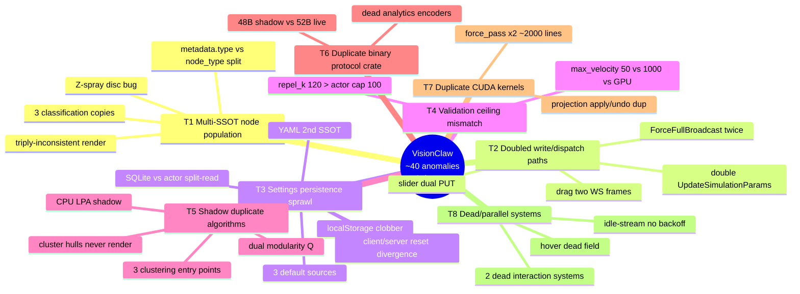
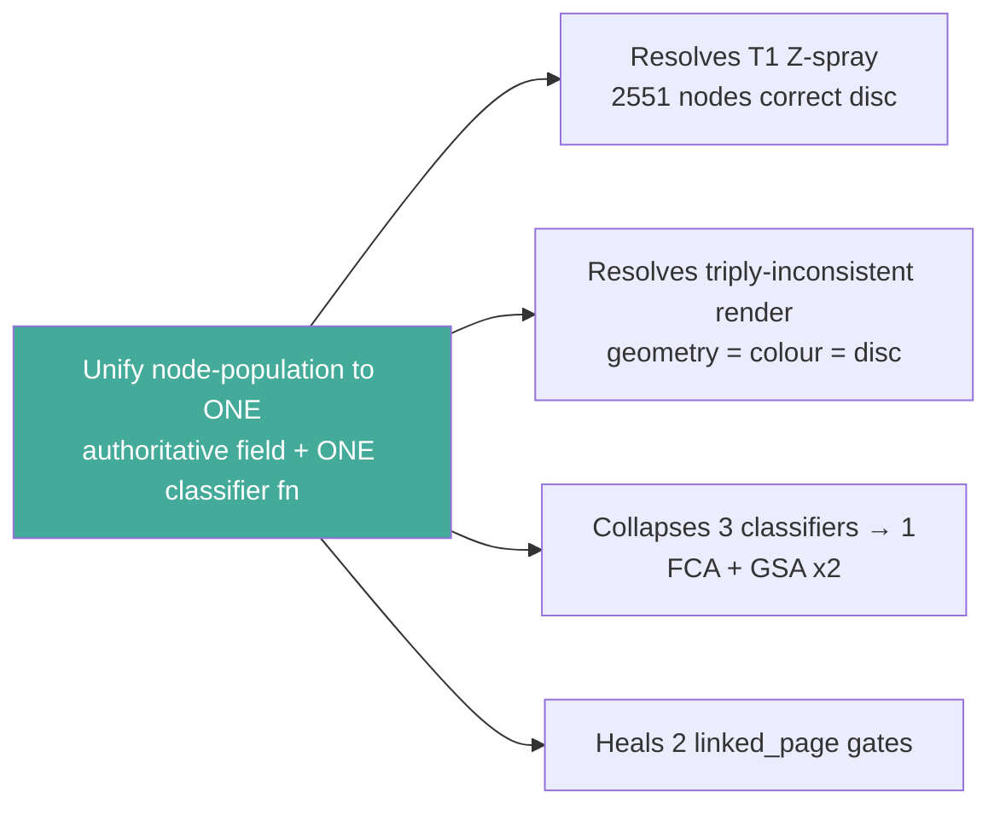

# 00 — VisionClaw System Anomaly Register

**Generated 2026-06-03** | Synthesis of cartography diagrams 01–07 + git archaeology.
Read-only audit. No source edited. Ranking = user-facing impact × blast radius.

---

## Resolution Status (updated 2026-06-03)

| Theme | Status | Resolution summary | Single-path diagram |
|-------|--------|--------------------|---------------------|
| **T1** | ✅ RESOLVED 2026-06-03 | One authoritative field: `Node::population_type()` reads `metadata["type"]` first, `node_type` only as legacy fallback; `Node::population()` is the single classifier. GPU disc (`force_compute_actor`), server filter (`client_filter`), `graph_state_actor`, and the client visual/filter hooks all route through it. `node_type="ontology_node"` fake-elevation write removed from `ontology_enrichment_service.rs`. | `02-population-handoff.md` |
| **T2** | ✅ RESOLVED 2026-06-03 | One persistence owner (debounced `autoSaveManager`); `notifyPhysicsUpdate` no longer fires an immediate PUT. One GPU dispatch path (orchestrator `state.graph_service_addr` → PhysicsOrchestratorActor); direct-GPU send removed from `physics.rs` + dead `enhanced.rs` fn delegates. Drag sends one canonical JSON frame; legacy binary block removed. | `01-settings-flow.md`, `04-updates-backoff.md` |
| **T4** | ✅ RESOLVED 2026-06-03 | Single source of truth `src/actors/gpu/physics_bounds.rs` `(MIN,MAX)` consts; `optimized_settings_actor` path-patterns and `validate_physics_settings` both read it. Canonical defaults (repelK 120, maxVelocity 100, springK 12, maxForce 150) now sit inside the unified ceilings; max_velocity ceiling held equal to the GPU backstop (1000). | `qe-T2-T4-writepaths-ceilings.md` |
| **T5** | ✅ RESOLVED 2026-06-03 | Single modularity (`modularity_csr`, `community.rs`); shadow `calculate_modularity` deleted, stats reuse the canonical Q. Single `node_analytics` writer: `ClusteringActor` via new `WriteClusterAnalytics` message (GPUManager → AnalyticsSupervisor → ClusteringActor), sent after `perform_clustering` for both GPU and CPU branches, so hulls populate. | `07-analysis-clustering.md` |
| T6 / T7 / T8 | ⏸ DEFERRED | Per git-archaeology triage below — reconcile/delete-forward, not urgent. | — |

---

## Theme Map



---

## Ranked Theme Register

### RANK 1 — T1: Multi-source-of-truth for node population *(CRITICAL — root cause)* — ✅ RESOLVED 2026-06-03

The single highest-impact defect. Three classification sites, two write fields that desync, three readers that disagree. **2,551 / 10,676 nodes (23.9%) render wrong**: GPU places them on the Knowledge disc (`z=−sep`) while the client paints Ontology geometry on top — the visible "Z-spray".

| Sub | File:line | Defect |
|-----|-----------|--------|
| T1.1 root | `ontology_enrichment_service.rs:240` | sets `node_type="ontology_node"`, never updates `metadata["type"]` |
| T1.2 root | `knowledge_graph_parser.rs:109,152` | `metadata["type"]` hardcoded `"page"`; `node_type` may be `ontology_node` |
| T1.3 | `force_compute_actor.rs:607` | classifier #1 reads `metadata.type` first → disc Z |
| T1.4 | `graph_state_actor.rs:239,284` | classifiers #2 + #3 (dup policy) → NodeTypeArrays/wire flags |
| T1.5 | `useGraphVisualState.ts:146` | client reads **top-level** `type` → ontology geometry |
| T1.6 | `GemNodes.tsx:462,473` | client colour reads `metadata.type` → blue (disagrees with T1.5) |
| T1.7 | `client_filter.rs:44` / `useGraphFiltering.ts:101` | two `linked_page` gates both on elevated field |

Backend declares `metadata["type"]` authoritative (`force_compute_actor.rs:603`); client priority-2 reads `node.type`, contradicting it.

### RANK 2 — T5: Shadow CPU/GPU duplicate algorithms *(HIGH — cluster hulls never render)* — ✅ RESOLVED 2026-06-03

User-visible: **convex hulls never draw in a default deployment.**

- **T5.1 (the render bug)**: `POST /analytics/clustering/run` → `clustering_handlers.rs:323` takes the CPU-MCP agent path and **never writes `node_analytics`**; auto-trigger is off by default (`graph_service_supervisor.rs:185`, CUDA poison interlock). Store stays null → `ClusterHulls.tsx` empty branch. Chain of three independent causes.
- **T5.2**: dual modularity — GPU `modularity_csr()` (`community.rs:24`) gates; CPU shadow `calculate_modularity()` (`clustering_actor.rs:835`) is what the **HTTP response returns**. Callers read the wrong Q.
- **T5.3**: CPU LPA shadow (`clustering_handlers.rs:587`) duplicates GPU LPA wholesale.
- **T5.4/5.5**: 3 clustering entry points, 2 DBSCAN routes, 2 anomaly subsystems under one prefix.

### RANK 3 — T2: Doubled write / dispatch paths *(HIGH — races + wasted round-trips)* — ✅ RESOLVED 2026-06-03

- **T2.1** `physicsSlice.ts:116` (debounced) **+** `:130` `notifyPhysicsUpdate` (immediate) → every slider fires two write pipelines; each does client GET-then-PUT (`endpoints.ts:85`) → 2 GET + 2 PUT, possibly out of order. Cross-confirmed by diagram 03.
- **T2.2** double `UpdateSimulationParams`: `settings_handler/enhanced.rs:546` direct **and** orchestrator `:1479` forwarded.
- **T2.3** drag sends two WS frames per tick: JSON `nodeDragUpdate` + legacy binary (`useGraphEventHandlers.ts:60-76`).
- **T2.4** `ForceFullBroadcast` sent twice on FastSettle cap-exhaustion (orchestrator `:1929`).
- **T2.5** TOCTOU: client GET-before-PUT (`endpoints.ts:85-91`) opens a second race window; concurrent PUTs lose writes.

### RANK 4 — T3: Settings persistence SSOT sprawl *(MEDIUM-HIGH — stale settings)*

- **T3.1** three defaults (`defaults.ts`, `physics_config.rs:328`, `data/settings.yaml`) — currently equal, **no byte-equality test**.
- **T3.2** split-read: `GET /settings/physics` SQLite-first; generic `UpdateSettings` (`write_handlers.rs`) updates actor not SQLite → next GET returns **stale SQLite** (`settings_routes.rs:262-303`).
- **T3.3** `POST /settings/save` writes YAML directly = 2nd post-boot SSOT (`write_handlers.rs:323`).
- **T3.4** `notifyPhysicsUpdate` drops `graphName` (`physicsSlice.ts:130`) → `visionclaw`-graph physics silently lost via that path.
- **T3.5** localStorage overlays server by default; re-overlay only if server physics truthy (`coreSlice.ts:97-120`).
- **T3.6** client reset → `defaults.ts`; server reset → `AppFullSettings::new()` YAML (`endpoints.ts:461` vs `POST /settings/reset`). Different default sources.

### RANK 5 — T4: Validation-ceiling mismatches *(MEDIUM — latent rejects, GPU clamp inversion)* — ✅ RESOLVED 2026-06-03

- **T4.1** `repel_k` default 120 > actor path-validator ceiling 100 (`physics_config.rs:351`/`defaults.ts:23` vs `optimized_settings_actor.rs:228`). Boot value the actor would reject via path API.
- **T4.2** `max_velocity` default 100, actor cap 50, route validator 1000 (`optimized_settings_actor.rs:237` vs `settings_routes.rs:132`).
- **T4.3 (the teeth)**: connects to GPU. `max_velocity > 1000` → GPU clamp (`c_params.max_velocity`) looser than Rust backstop `MAX_VELOCITY_MAGNITUDE=1000` → divergence guard flags **every** frame OOB even for a healthy layout (diagram 06). Three uncoordinated velocity-clamp systems.

### RANK 6 — T6: Duplicate binary protocol crate *(MEDIUM — latent wire corruption)*

- **T6.1 CRITICAL-if-linked**: live `src/utils/binary_protocol.rs` = **52B** (centrality@48); shadow `crates/visionclaw-protocol/src/binary_protocol.rs` = **48B** (no centrality). Shadow decoder reads 48B chunks (`WIRE_V3_ITEM_SIZE=48`, `:631`) against a 52B stream. **Mitigant (verified): the shadow analytics encoders have zero callers** (only self-exported in `lib.rs:49-50`); `src/` uses its own local module. Dead, not active corruption — but a live footgun for any future import.
- Live server↔client agree at 52B (golden test passes). `cluster_id/community_id` dup-write already removed.

### RANK 7 — T7: Duplicate CUDA kernels *(MEDIUM — maintenance hazard, not user-facing)*

- **T7.1** `force_pass_kernel` vs `force_pass_with_stability_kernel` = ~2000 lines duplicated CUDA (`visionclaw_unified.cu:252,:2029`). Both **live** (selected by `stability_threshold`). Any fix must be mirrored.
- **T7.2** disc projection duplicated: main loop (`:1816-1831`) + `ForceFullBroadcast` (`:2293-2335`) re-implement it independently; applied/undone every step (3× O(N) on the actor thread). Confirms diagram 04. **Verdict: projection-as-force refactor is the clean fix but NOT drop-in** (Z-spring must be re-calibrated against 56k cross-link springs).
- **T7.3** recovery (`:1221`) + reset (`:2943`) lock the GPU Mutex on the actor thread, not `spawn_blocking` — violates `shared.rs:104-118`.

### RANK 8 — T8: Dead / parallel non-coordinated systems *(LOW — confusion, minor waste)*

- **T8.1** two dead interaction systems: `InteractionManager.ts:28`, `useNodeInteraction.ts:25` (live = `useGraphEventHandlers`). Verified zero imports.
- **T8.2** hover dead: `animationStateRef.hoveredNode` never written in live path (diagram 03 §3).
- **T8.3** `subscribe_position_updates` no idle backoff — streams full snapshots at 60ms forever post-settle (`position_updates.rs:433`).
- **T8.4** `UploadPositions` no `is_computing` guard (`:2417`); three convergence detectors, one (`:2634` abs-KE floor) latent/dead.
- **T8.5** three raycast strategies (diagram 03 §5) — two live by GPU/WebGL branch, acceptable.

---

## Single Highest-Leverage Root Fix



**Fix T1 by normalising at the write boundary**: make `metadata["type"]` and `node_type` the *same value*, set through one helper (`ontology_enrichment_service.rs:240` and `knowledge_graph_parser.rs:109` are the two divergence sources), then collapse the three classifiers (`force_compute_actor.rs:607`, `graph_state_actor.rs:239,284`) into one function reading the single authoritative field, and fix the client to read it (`useGraphVisualState.ts:146`). This single change resolves the Z-spray **and** the triply-inconsistent render — the largest user-facing defect by node count. No magic factors; one SSOT, per the holistic refactor directive.

---

## Git Archaeology — Revert vs Reconcile

| Fork | Introduced (commit / date) | Origin verdict | Recommendation |
|------|---------------------------|----------------|----------------|
| **Shadow 48B protocol crate** (T6) | `ddbeee3b` 2026-05-27 (ADR-090 A5 "extract visionflow-protocol"); renamed `e600c8f4` 2026-05-28. Live gained centrality 52B later: `07ebd2e9` 2026-06-02 | Crate is a **later copy** of `src/`; diverged by post-extraction drift (never got centrality). Dead — zero callers. | **RECONCILE-forward, no revert.** ADR-090 extraction is intentional architecture; reverting unwinds the whole crate split. Either delete the 4 dead 48B encoders/decoders or bump the crate to 52B and make `src/` delegate to it. Cheap; reconciliation wins. |
| **Dual-type write split** (T1) | `1701531b` 2025-11-03 ("braingrid", enrichment sets `node_type` only); reinforced `6bccff90` 2026-05-23 (parser hardcode) | Divergence **introduced** by braingrid, not a copy. But 7 months of dependent code sits on top. | **RECONCILE-forward.** Reverting `1701531b` discards the entire ontology-enrichment feature. Add `metadata["type"]` write at the two sources + unify classifiers. This is the Rank-1 fix. |
| **Duplicate CUDA force kernels** (T7.1) | `c1aa02e1` 2025-09-18 (both kernels predate all renames) | **Old by-design** dual kernel (stability vs plain). Not a recent fork. | **RECONCILE-forward (defer).** No clean revert target — both live by flag for 8 months. Long-term: merge via a single templated kernel + `#ifdef`/runtime branch. Not urgent; no user-facing defect. |
| **Projection apply/undo + ForceFullBroadcast dup** (T7.2) | grown across `8fac21e0` 2026-04-12 → `743a4f82` 2026-05-28 → `cf5b52e0` 2026-06-01 | Incremental accretion, no single introducer. `26a040a6` ("kill magic scales") already aligned settings↔GPU 1:1. | **RECONCILE-forward (projection-as-force).** Aligns with the no-magic-scales directive. NOT drop-in — re-calibrate Z-spring vs cross-link springs. Schedule, don't revert. |
| **Dead interaction systems** (T8.1) | `useNodeInteraction.ts` `ab6e6b67` 2025-09-25 (born dead beside live handler); `InteractionManager.ts` `010b1925` 2025-12-25 | Born-dead duplicates; never wired. | **DELETE-forward (no revert).** No introducing-divergence commit to revert — they were never live. Plain dead-code removal. |

**Net**: no fork warrants reverting to an earlier clean commit — every divergence is either (a) intentional architecture (ADR-090 crate, dual kernels) layered with months of dependent work, or (b) born-dead code that is cheaper to delete forward. The 2026-06-03 revert sanction does not apply here; forward reconciliation is cleaner in all five cases.

---

## QE-Fleet Investigation Triage

| Theme | Warrants QE fleet? | What QE agents must verify |
|-------|-------------------|----------------------------|
| **T1 population** | **YES — top priority** | Reproduce 2,551-node divergence: load corpus, assert `metadata.type == node_type` for every node post-enrichment; regression test asserting GPU disc == client visual-mode == colour scheme for owl_class/ontology_node nodes. Golden render snapshot. |
| **T5 hulls** | **YES** | Reproduce empty-hull default deployment; assert `node_analytics` populated after `POST /analytics/clustering/run`; assert HTTP-returned `modularity` == gate Q (`modularity_csr`). |
| **T2 doubled writes** | **YES** | Network capture: assert one slider drag → one PUT pipeline; assert single `UpdateSimulationParams` per change; TOCTOU concurrency test (two rapid sliders, last-write-wins regression). |
| **T3 settings SSOT** | **YES** | Byte-equality test across 3 default sources (T3.1); stale-read test (generic UpdateSettings then GET physics); cold-boot YAML-vs-SQLite divergence test. |
| **T4 validation** | **YES (targeted)** | Boundary test: set `max_velocity=1500`, assert divergence guard does NOT flag a healthy layout every frame (T4.3); assert actor/route/GPU ceilings reconciled. |
| **T6 protocol crate** | **YES (guard-only)** | Static assertion: no `src/` caller links shadow 48B encoders; add CI guard so the crate can never be wired without a 52B bump. |
| **T7 CUDA / projection** | **NO (defer to refactor PR)** | Not QE-fleet — needs a calibration spike (Z-spring vs cross-link), not reproduction. |
| **T8 dead systems** | **NO** | Dead-code deletion; lint/coverage confirms zero references. No reproduction needed. |

---

## Proposed `diagrams/README.md` index entries

```
| 00 | Anomaly Register | Ranked cross-cutting defect register + git archaeology + QE triage |
| 01 | Settings Flow | Physics settings write/hydration end-to-end, multi-SSOT map |
| 02 | Population Handoff | Dual-graph node classification, metadata.type divergence, Z-spray root cause |
| 03 | Interaction Events | Selection/drag/hover/NL-command paths; dead interaction systems |
| 04 | Updates & Backoff | Param→settle→idle lifecycle, dual convergence detectors, broadcast paths |
| 05 | Wire & Analytics Types | 52B V3 record layout, encoder/decoder inventory, 48B shadow crate |
| 06 | GPU Physics | One physics step, shared-Mutex poison risk, projection apply/undo, dup kernels |
| 07 | Analysis & Clustering | Trigger paths, dual modularity, cluster-hull non-render root cause |
```
