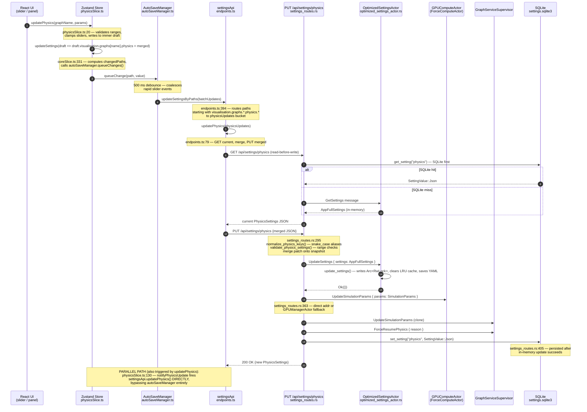
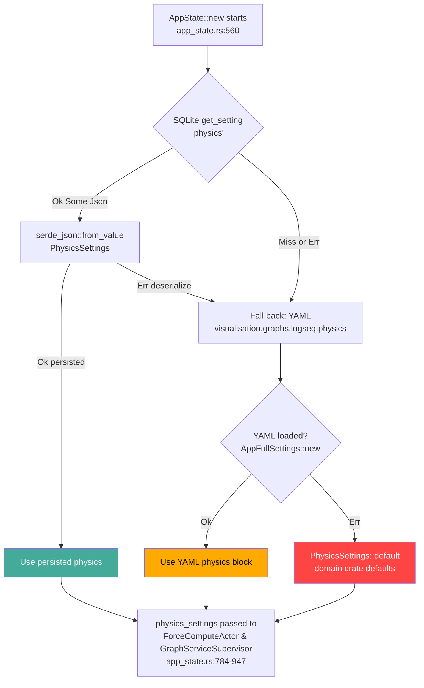
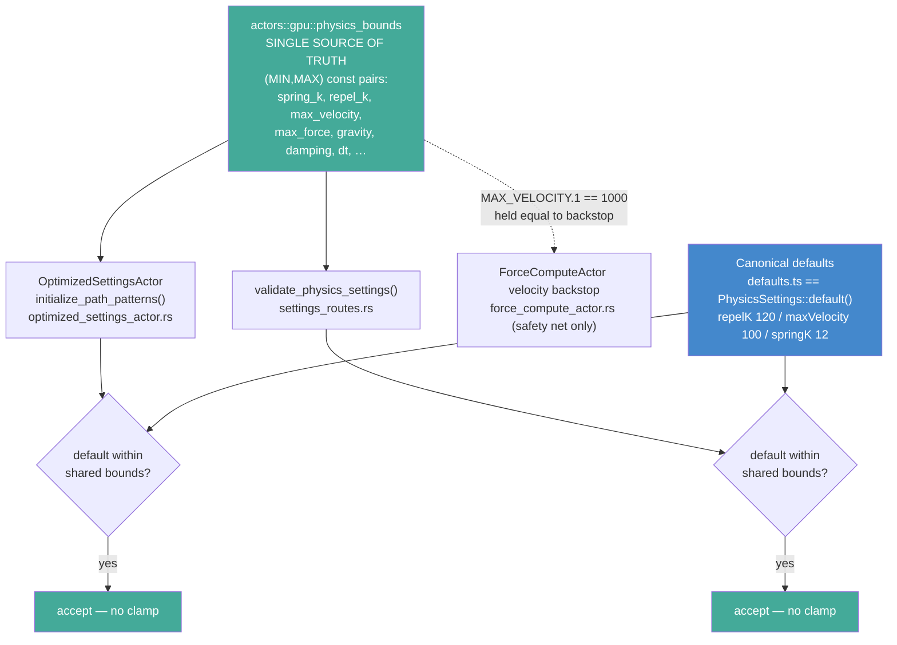

# Settings Flow — VisionClaw Physics Settings End-to-End

Generated by static code analysis, 2026-06-03.  
Covers the write path (client slider change → DB) and the read/hydration path (client connect → store).

---

## 1. Write Path: Physics Settings Change



---

## 2. Reverse Hydration Path: Client Connect

```mermaid
sequenceDiagram
    autonumber
    participant App as AppInitializer.tsx
    participant ZS as Zustand Store<br/>coreSlice.ts::initialize()
    participant LS as localStorage<br/>(graph-viz-settings-v2)
    participant SApi as settingsApi.getSettingsByPaths()
    participant REST_ALL as GET /api/settings/all<br/>settings_routes.rs
    participant OSA as OptimizedSettingsActor
    participant SQLite as SQLite<br/>settings.sqlite3

    App->>ZS: initialize()
    Note over ZS: coreSlice.ts:72 — waitForAuthReady(),<br/>then getSettingsByPaths(ESSENTIAL_PATHS)
    Note over ZS: ESSENTIAL_PATHS (settingsHelpers.ts:8):<br/>includes visualisation.graphs.logseq.physics<br/>and clientTweening, qualityGates, etc.
    ZS->>SApi: getSettingsByPaths(ESSENTIAL_PATHS)
    Note over SApi: endpoints.ts:269 — 2 s in-memory cache;<br/>fetches GET /api/settings/all, then<br/>calls transformApiToClientSettings()
    SApi->>REST_ALL: GET /api/settings/all
    REST_ALL->>OSA: GetSettings (actor mailbox)
    OSA-->>REST_ALL: AppFullSettings (in-memory RwLock)
    REST_ALL->>SQLite: get_setting("physics")
    SQLite-->>REST_ALL: SettingValue::Json or miss
    REST_ALL->>SQLite: get_setting("constraints")
    REST_ALL->>SQLite: get_setting("node_filter")
    REST_ALL->>SQLite: get_setting("quality_gates")
    REST_ALL->>SQLite: get_setting("visual")
    Note over REST_ALL: settings_routes.rs:1060 — SQLite wins over<br/>actor for physics; rendering comes from actor only
    REST_ALL-->>SApi: AllSettings { physics(SQLite), rendering(actor), ... }
    SApi-->>ZS: Record<string, unknown> (full settings)
    ZS->>LS: read persisted partialSettings (zustand persist middleware)
    Note over ZS: coreSlice.ts:97 — deepMergeSettings:<br/>server response is BASE, localStorage is OVERLAY<br/>(localStorage wins for visual settings)
    Note over ZS: coreSlice.ts:118 — EXCEPTION: physics and tweening<br/>are server-authoritative — server values re-overlaid<br/>on top of localStorage after initial merge
    ZS->>ZS: set({ settings: merged, initialized: true })
    ZS->>App: autoSaveManager.setInitialized(true)
    App->>App: initializeWebSocket(settings)
    Note over App: AppInitializer.tsx:296 — sends<br/>subscribe_position_updates{binary,interval}<br/>exactly once per connection (idempotency guard)
```

---

## 3. Server Boot Physics Resolution



---

## 3a. Physics Validation — Single Source of Truth (Resolved 2026-06-03)

Both server validators now read every `(MIN, MAX)` range from the shared
`actors::gpu::physics_bounds` module, so the actor path-pattern caps and the
route validator can no longer diverge, and the canonical client defaults
(`repelK 120`, `maxVelocity 100`, `springK 12`) are accepted rather than
clamped. Previously the actor caps (`repel_k 100`, `max_velocity 50`,
`spring_k 10`) sat below the defaults and the route validator used a third,
wider set — three divergent caps that triggered a spurious "divergence" and
silent clamping (see resolved ANOMALY-3 / ANOMALY-4).



> **Resolved 2026-06-03 (T4 ceiling-consistency fix).** The three divergent
> caps are unified behind `actors::gpu::physics_bounds`. Regression guard:
> `tests/repro_t4_ceiling_consistency.rs` (`t4_actor_and_route_ceilings_agree`,
> `t4_canonical_defaults_accepted_by_unified_ceilings`) plus the in-module
> `canonical_defaults_are_within_bounds` test.

---

## 4. Multiple Write Paths (Anomaly Map)

```mermaid
flowchart LR
    subgraph CLIENT
        A1[UI slider] -->|updatePhysics| B1[physicsSlice\nvalidate + immer]
        B1 -->|updateSettings| B2[coreSlice\nchangedPaths]
        B2 -->|queueChanges| C1[autoSaveManager\n500 ms debounce]
        B1 -->|notifyPhysicsUpdate\nPARALLEL| C2[settingsApi.updatePhysics\nDIRECT — no debounce]
    end

    subgraph WIRE
        C1 -->|updateSettingsByPaths\nbatch routing| D1[PUT /api/settings/physics]
        C2 -->|GET current + PUT merged| D1
        A2[/settings/path PUT] -->|update_setting_by_path\nroutes.rs:99| D2[settings_addr UpdateSettings\nthen propagate_physics_to_gpu]
        A3[POST /settings\nwrite_handlers.rs] -->|update_settings| D2
    end

    subgraph SERVER
        D1 --> E1[OptimizedSettingsActor\nUpdateSettings]
        D2 --> E1
        E1 --> F1[GPUComputeActor\nUpdateSimulationParams]
        E1 --> F2[GraphServiceSupervisor\nUpdateSimulationParams]
        E1 --> F3[SQLite\nset_setting physics]
    end

    style C2 fill:#f84,color:#000
    style A2 fill:#f84,color:#000
    style A3 fill:#f84,color:#000
```

---

## Anomalies Found (with file:line)

### ANOMALY-1: Dual simultaneous write paths from a single slider event

`physicsSlice.ts:116` calls `state.updateSettings(draft => ...)` — which routes through `autoSaveManager.queueChanges()` (500 ms debounced batch).

`physicsSlice.ts:130` — `notifyPhysicsUpdate()` also calls `settingsApi.updatePhysics()` **directly and immediately**, bypassing the debounce entirely.

Result: every slider drag fires **two concurrent write pipelines** to `PUT /api/settings/physics`.  The `updatePhysics` path itself does a GET-then-PUT (`endpoints.ts:85–91`), so a single drag gesture generates at least two GET + two PUT round trips, potentially out of order.

### ANOMALY-2: Three independent default sources that do not fully agree

| Field | client defaults.ts | Rust PhysicsSettings::default() | YAML settings.yaml |
|---|---|---|---|
| `repelK` / `repel_k` | 120.0 (line 22) | 120.0 (physics_config.rs:351) | 120.0 (line 164) — agree |
| `springK` / `spring_k` | 12.0 (line 21) | 12.0 (physics_config.rs:352) | 12.0 (line 165) — agree |
| `maxVelocity` / `max_velocity` | 100.0 (line 26) | 100.0 (physics_config.rs:348) | 100.0 (line 162) — agree |
| `maxForce` / `max_force` | 150.0 (line 27) | **150.0** (physics_config.rs:350) | 150.0 (line 163) — agree |
| `globalSpeed` / `global_speed` | 0.4 (line 18) | 0.4 (physics_config.rs:386) | 0.4 (line 166) — agree |
| `autoBalance` | false (line 12) | false (physics_config.rs:331) | false (yaml:autoBalance) — agree |

Numeric values are presently consistent across all three, **but the three sources are structurally independent** with no enforced test asserting byte equality (the adapter file comments at `sqlite_settings_repository.rs:49` note "a unit test in Phase 2 will assert byte equality" for the schema constant — analogous guard for physics defaults does not yet exist).

### ANOMALY-3: `repelK` default (120.0) exceeds the validation ceiling defined in `OptimizedSettingsActor` — RESOLVED 2026-06-03

~~`optimized_settings_actor.rs:228–231` defines the `repel_k` path pattern with `max = 100.0`.~~

**Resolved 2026-06-03 (T4 fix).** Both the actor path-pattern validator and `validate_physics_settings()` now read `repel_k`'s `(MIN, MAX)` from `actors::gpu::physics_bounds::REPEL_K = (0.0, 500.0)`, which comfortably contains the canonical default of 120.0. The actor no longer carries an inline `max = 100.0` literal; the shared module is the single source of truth. Regression guard: `tests/repro_t4_ceiling_consistency.rs`.

### ANOMALY-4: `max_velocity` validation ceiling mismatch between the two server validators — RESOLVED 2026-06-03

~~`optimized_settings_actor.rs:234–237`: `max_velocity` path pattern max = `50.0`. `settings_routes.rs:132`: allows up to `1000.0`.~~

**Resolved 2026-06-03 (T4 fix).** Both validators now read `actors::gpu::physics_bounds::MAX_VELOCITY = (0.1, 1000.0)`. The previous actor cap of 50.0 (below the 100.0 default) and the route cap of 1000.0 were two of the three divergent caps; they are now one shared constant. `MAX_VELOCITY.1` is deliberately held equal to the `ForceComputeActor` velocity backstop (1000.0) so the backstop only ever fires on genuinely divergent frames, never on a healthy default. Regression guard: `tests/repro_t4_ceiling_consistency.rs`.

### ANOMALY-5: `GET /api/settings/physics` has a split read source (SQLite vs actor) without clear winner

`settings_routes.rs:262–288`: tries SQLite first; if miss, falls through to `GetSettings` actor message which returns `logseq.physics` from the in-memory `AppFullSettings`.

`get_all_from_actor()` at `settings_routes.rs:1060`: same pattern — SQLite wins for physics, actor wins for rendering.

The actor's in-memory state is loaded from the repository (`load_all_settings`) at boot (`optimized_settings_actor.rs:736–784`), but the actor also has its own YAML-file fallback (`AppFullSettings::new()` in `OptimizedSettingsActor::new()`). After a `PUT /api/settings/physics`, SQLite is updated but the actor's RwLock in-memory state is also updated atomically in the same handler. After an `UpdateSettings` through the generic handler (`write_handlers.rs`) that does NOT touch SQLite, SQLite and the actor can diverge: the actor's RwLock holds the new value but SQLite still has the old one. The next `GET /api/settings/physics` then returns the stale SQLite value.

### ANOMALY-6: `localStorage` can clobber server physics on first page load for returning users

`settingsStore.ts:62` — zustand persist middleware `merge()` function sets `settings: persistedSettings` (the raw localStorage blob) before `initialize()` runs.

`coreSlice.ts:101–120` — `initialize()` does `deepMergeSettings(serverResponse, state.partialSettings)` with **localStorage as overlay**, meaning localStorage wins for most fields. It then re-overlays server physics on top. But the re-overlay (`coreSlice.ts:119`) only fires if `essGraphs?.logseq?.physics` is truthy in the server response. If the server returns an empty physics object (empty SQLite row on first boot), the localStorage stale values remain as the effective settings.

### ANOMALY-7: `updatePhysics` in `endpoints.ts` does a GET-then-PUT that can cause TOCTOU races

`endpoints.ts:85–91`: `updatePhysics` fetches `GET /api/settings/physics` before every PUT to perform a client-side merge. Two concurrent slider events (e.g., fast drag + debounced flush) can both GET the same baseline, each merge a different field, and the second PUT silently loses the first PUT's change. The server-side `PUT /api/settings/physics` handler (`settings_routes.rs:303`) also does its own GET-then-merge via `GetSettings`, but the client-side re-GET creates a second race window that is entirely in the client's hands.

### ANOMALY-8: `notifyPhysicsUpdate` ignores `graphName` — always sends flat params to `PUT /api/settings/physics`

`physicsSlice.ts:130`: `notifyPhysicsUpdate(_graphName, params)` — `graphName` is accepted but **not forwarded**. `settingsApi.updatePhysics(params)` sends to `PUT /api/settings/physics`, which only updates `logseq.physics` (`settings_routes.rs:355`). Changes to `visionclaw` graph physics are silently dropped at the API layer when coming through this path. The generic `POST /settings` write handler (`write_handlers.rs`) propagates to both graphs.

### ANOMALY-9: `save_settings` (`POST /settings/save`) writes to YAML file, bypassing SQLite

`write_handlers.rs:323`: `app_settings.save()` writes the full `AppFullSettings` to the YAML file on disk. This is the only path that touches the YAML file post-boot. After this write, the YAML file and SQLite can diverge (SQLite holds per-key values updated by `PUT /api/settings/physics`; the YAML file now holds whatever was in the actor at save time). On next boot, `AppState::new` tries SQLite first and YAML second, so the divergence is masked at boot — but the YAML file is now a stale secondary that `AppFullSettings::new()` would load for a cold boot where SQLite is wiped.

### ANOMALY-10: `resetSettings` on the client resets to `DEFAULT_PHYSICS_SETTINGS` in `defaults.ts`, not to server defaults

`endpoints.ts:461–477`: `resetSettings()` clears localStorage and sends `updatePhysics(defaultPhysics)` using `DEFAULT_PHYSICS_SETTINGS` from `defaults.ts`. This bypasses `POST /settings/reset`, which calls `AppFullSettings::new()` on the server. The client and server reset procedures target different default sources.
