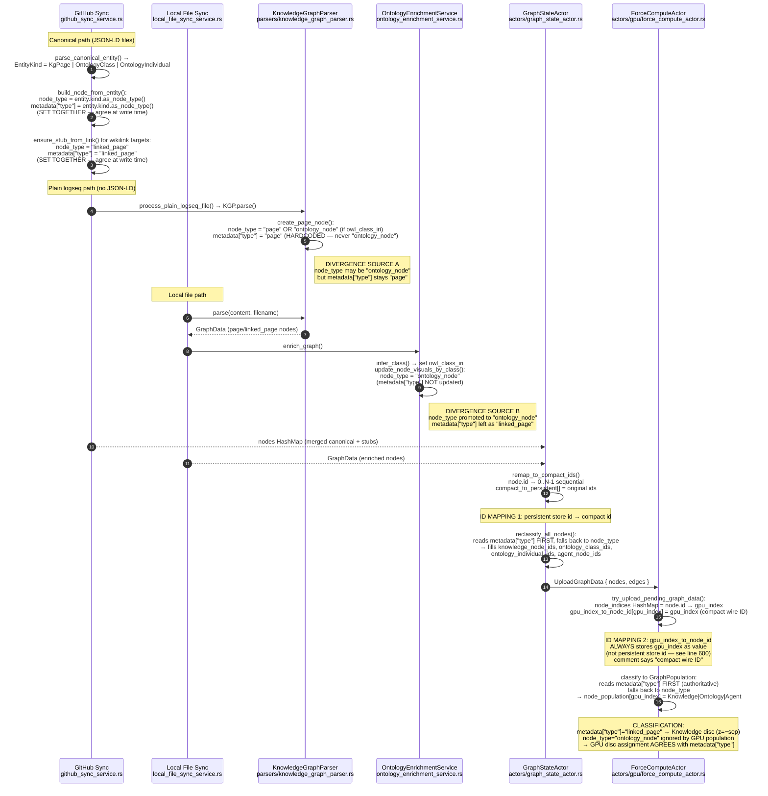
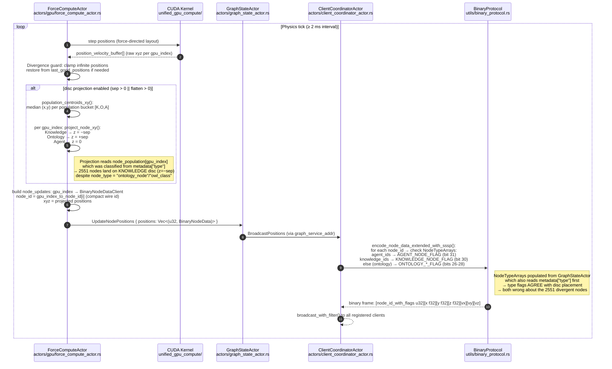
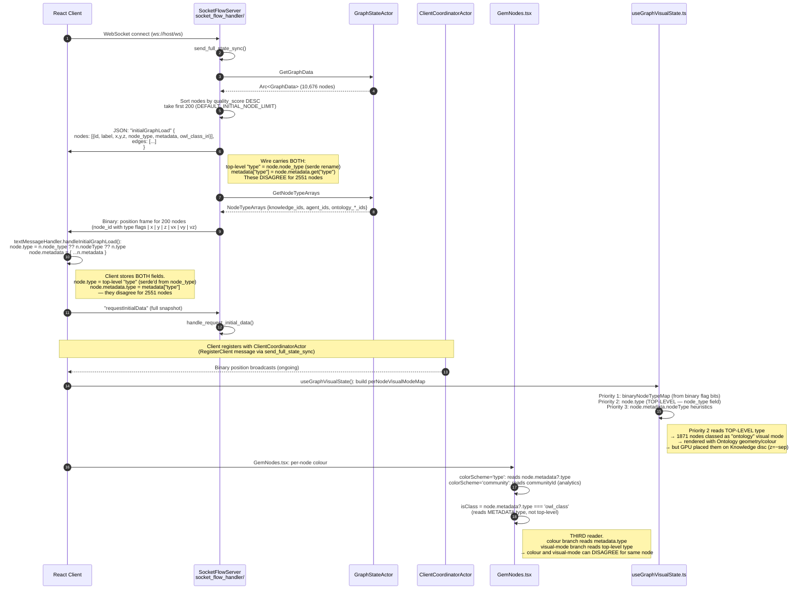
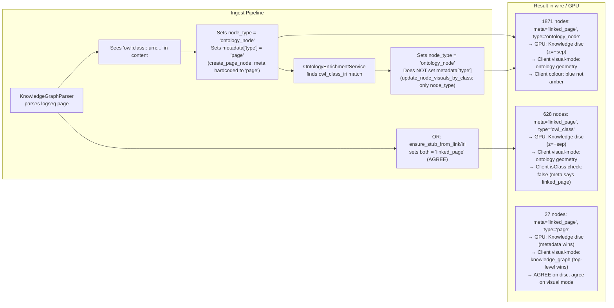
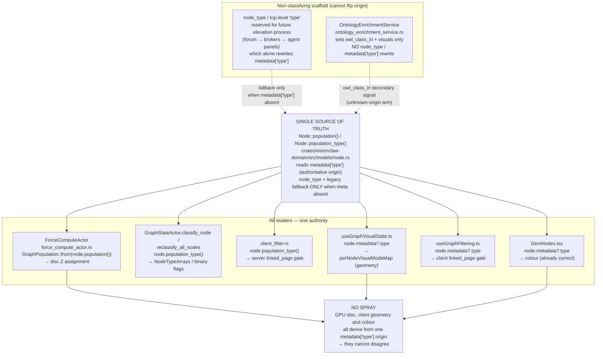

# VisionClaw — Dual-Graph Population & WebSocket Handoff

> Static analysis: 2026-06-03 | Backend root: `src/` | Client root: `client/src/`
> Live verification: GET /api/graph/data → 10,676 nodes, 2,551 divergent (23.9%)

> **RESOLVED 2026-06-03 (QE-T1 SSOT collapse).** The two parallel classification
> authorities have been collapsed into ONE. `metadata["type"]` is now the single
> authoritative origin for population, exposed by the centralised helper
> `Node::population()` / `Node::population_type()` in
> `crates/visionclaw-domain/src/models/node.rs`. Every reader — the GPU disc
> projection (`force_compute_actor.rs`), both `GraphStateActor` classifiers, the
> server filter gate (`client_filter.rs`), the client visual-mode resolver
> (`useGraphVisualState.ts`) and the client filter (`useGraphFiltering.ts`) — now
> reads through this one authority; `node_type` / top-level `type` is demoted to
> non-classifying elevation scaffold (a legacy fallback only when `metadata["type"]`
> is absent). The premature fake-elevation writer in
> `ontology_enrichment_service.rs` no longer rewrites `node_type` to spoof ontology
> origin. With one authority feeding all readers, GPU disc placement and client
> geometry/colour can no longer disagree, so the ~23.5% "Z-spray" is eliminated.
> The forked-authority flows below are kept for historical context; the collapsed
> model is in §7.

---

## 1. Graph Data Load → GPU Upload → Classification



---

## 2. Physics Loop → Disc Projection → Position Broadcast



---

## 3. Client WebSocket Connect → Initial Load → Render



---

## 4. Single-Source-of-Truth Violation Map

```mermaid
flowchart TD
    subgraph WRITE["Write Sites — where node_type and metadata.type are set"]
        W1["KnowledgeGraphParser.create_page_node()<br/>parsers/knowledge_graph_parser.rs:109,152<br/>node_type = 'page'|'ontology_node'<br/>metadata['type'] = 'page' only (NEVER ontology_node)"]
        W2["KnowledgeGraphParser.extract_links() / stub nodes<br/>parsers/knowledge_graph_parser.rs:258,279<br/>node_type = 'linked_page'<br/>metadata['type'] = 'linked_page' — AGREE"]
        W3["build_node_from_entity() canonical path<br/>github_sync_service.rs:122,130<br/>node_type = entity.kind.as_node_type()<br/>metadata['type'] = entity.kind.as_node_type() — AGREE"]
        W4["ensure_stub_from_link() / ensure_stub_from_iri()<br/>github_sync_service.rs:190-191, 223-224<br/>node_type = 'linked_page'|'owl_class'<br/>metadata['type'] = same — AGREE"]
        W5["OntologyEnrichmentService.update_node_visuals_by_class()<br/>ontology_enrichment_service.rs:240<br/>node_type = 'ontology_node'<br/>metadata['type'] NOT UPDATED — DIVERGES"]
        W6["FileService.load_graph_data_with_metadata()<br/>file_service.rs:1194,1198<br/>node_type = 'ontology_node'|'page'<br/>metadata['type'] NOT SET HERE"]
        W7["OxigraphGraphRepository read path<br/>adapters/oxigraph_graph_repository.rs:1315-1323<br/>node_type = from vc:nodeType triple<br/>metadata = from vc:meta key=val pairs (independent)"]
    end

    subgraph READ["Read Sites — who reads which field"]
        R1["ForceComputeActor.try_upload_pending_graph_data()<br/>force_compute_actor.rs:607-608<br/>READS: metadata['type'] first, falls back to node_type<br/>OUTPUT: node_population[gpu_index] = K|O|A<br/>→ disc Z assignment"]
        R2["GraphStateActor.classify_node() / reclassify_all_nodes()<br/>graph_state_actor.rs:239-240, 284<br/>READS: metadata['type'] first, falls back to node_type<br/>OUTPUT: knowledge_node_ids, ontology_class_ids, ...<br/>→ binary protocol type flags"]
        R3["client_filter.rs:44<br/>READS: node_type (top-level only)<br/>OUTPUT: linked_page visibility gate<br/>ANOMALY: if node_type='linked_page' but meta='ontology_node',<br/>the gate hides it (wrong direction rarely occurs)"]
        R4["useGraphVisualState.ts:146-151<br/>READS: node.type (top-level, from node_type field)<br/>OUTPUT: perNodeVisualModeMap (knowledge|ontology|agent)<br/>→ Three.js geometry tier selection"]
        R5["GemNodes.tsx:462,473<br/>colorScheme='type': reads node.metadata?.type<br/>isClass check: reads node.metadata?.type<br/>OUTPUT: RGB colour"]
        R6["api_handler/graph/mod.rs:163-172<br/>READS: node_type (top-level) + metadata key presence<br/>OUTPUT: graph_type filter (knowledge|ontology|agent)<br/>for GET /api/graph/data?graph_type=X"]
        R7["useGraphFiltering.ts:101<br/>READS: nodeType (top-level field mapped as node.type)<br/>OUTPUT: linked_page visibility gate (client side)"]
    end

    W1 -- "DIVERGENCE: owl:class pages get<br/>node_type=ontology_node but meta stays page" --> R1
    W5 -- "DIVERGENCE: enriched stubs get<br/>node_type=ontology_node but meta stays linked_page" --> R1
    W3 --> R1
    W4 --> R1
    W1 -- same divergence" --> R2
    W5 -- "same divergence" --> R2
    R2 -- "NodeTypeArrays used for<br/>binary wire flags" --> R4
    R4 -- "visual mode = 'ontology'<br/>for 2551 nodes on Knowledge disc" --> CONFLICT

    R1 -- "disc = Knowledge z=−sep<br/>for 2551 divergent nodes" --> CONFLICT

    R5 -- "colour from metadata.type='linked_page'<br/>→ blue (#4FC3F7) not amber/violet" --> CONFLICT

    CONFLICT["VISIBLE ANOMALY<br/>2551 nodes:<br/>• GPU disc: Knowledge (z=−sep)<br/>• Visual mode: 'ontology' geometry<br/>• Colour (type scheme): blue (linked_page)<br/>• Binary flag: ONTOLOGY_*_FLAG<br/>→ Z-spray: Ontology geometry<br/>floating on Knowledge disc"]
```

---

## 5. Parallel Implementation Inventory

| Concern | Implementation 1 | Implementation 2 | Implementation 3 |
|---------|-----------------|-----------------|-----------------|
| **Population classification** | `ForceComputeActor::try_upload_pending_graph_data` (line 607) | `GraphStateActor::classify_node` (line 239) | `GraphStateActor::reclassify_all_nodes` (line 284) |
| **"metadata.type first" policy** | `force_compute_actor.rs:607` | `graph_state_actor.rs:239-240` | `graph_state_actor.rs:284` — policy comment duplicated |
| **node_type write** | `knowledge_graph_parser.rs:152` | `ontology_enrichment_service.rs:240` | `github_sync_service.rs:122` + `file_service.rs:1194` |
| **metadata["type"] write** | `knowledge_graph_parser.rs:109,258` | `github_sync_service.rs:130,191,224` | NOT written by enrichment service or file_service |
| **ID mapping** | `gpu_index_to_node_id` (force_compute_actor) — gpu_index→compact_wire_id | `compact_to_persistent` (graph_state_actor) — compact→original_store_id | `node_indices` HashMap (force_compute, local) — node.id→gpu_index |
| **Position upload** | `try_upload_pending_graph_data` (initial) | `UpdateNodePositions` message handler | `send_full_state_sync` binary frame (types.rs:401) |
| **First broadcast path** | `send_full_state_sync` JSON InitialGraphLoad (200 nodes) | `send_full_state_sync` binary position frame (same 200) | GPU tick → `UpdateNodePositions` → `BroadcastPositions` |
| **linked_page visibility gate** | `client_filter.rs:44` (server, reads `node_type`) | `useGraphFiltering.ts:101` (client, reads mapped `node.type`) | `bots_visualization_handler.rs:377` (reads `node_type`) |
| **Ontology filter** | `api_handler/graph/mod.rs:167-168` (reads `node_type` OR `metadata.contains_key("owl_class_iri")`) | `useGraphVisualState.ts:147` (reads top-level `node.type`) | Binary flag path via `NodeTypeArrays` |

---

## 6. Root Cause: The Divergence Mechanism



### Authoritative field decision

The backend comments at `force_compute_actor.rs:603` and `graph_state_actor.rs:236` explicitly declare `metadata["type"]` as **authoritative** (ABox/TBox origin truth). The GPU disc assignment and NodeTypeArrays both honour this. The client's `useGraphVisualState.ts` priority-2 path reads the **top-level `type`** field (which serde renames from `node_type`), contradicting the declared authority.

**The fix** (applied 2026-06-03) took option 3, generalised into a single source of
truth: every reader now classifies through `Node::population()`, which reads the
authoritative `metadata["type"]`. The client `useGraphVisualState.ts` and
`useGraphFiltering.ts` read `node.metadata?.type` first (mirroring the server's
`population_type` legacy fallback to top-level `type`); the server
`client_filter.rs` reads `Node::population_type()`; the GPU maps `Node::population()`
into its local `GraphPopulation`. The fake-elevation writer in
`ontology_enrichment_service.rs:240` no longer sets `node_type` — a node's ontology
signal travels in `owl_class_iri`, and origin migration is left to the future
elevation process (which alone may rewrite `metadata["type"]`).

---

## 7. Resolved Model — Single `metadata.type` Authority (2026-06-03)



---

## References

| File | Lines | Concern |
|------|-------|---------|
| `src/actors/gpu/force_compute_actor.rs` | 24-113 | GraphPopulation enum, centroid/projection helpers |
| `src/actors/gpu/force_compute_actor.rs` | 595-633 | GPU upload + population classification |
| `src/actors/gpu/force_compute_actor.rs` | 1810-1831 | Disc projection before broadcast |
| `src/actors/graph_state_actor.rs` | 233-325 | classify_node / reclassify_all_nodes (dual impl) |
| `src/actors/graph_state_actor.rs` | 170-178 | get_node_type_arrays → binary protocol flags |
| `src/handlers/socket_flow_handler/types.rs` | 276-434 | send_full_state_sync (JSON + binary initial load) |
| `src/handlers/api_handler/graph/mod.rs` | 31-58, 130-177 | NodeWithPosition wire struct + graph_type filter |
| `crates/visionclaw-protocol/src/socket_flow_messages.rs` | 180-199 | InitialNodeData (carries both node_type and metadata) |
| `src/services/parsers/knowledge_graph_parser.rs` | 107-152, 257-293 | Divergence source A (page vs ontology_node + meta) |
| `src/services/ontology_enrichment_service.rs` | 220-241 | Divergence source B (node_type only, no meta update) |
| `src/services/github_sync_service.rs` | 111-196 | Canonical path (agree) + stubs (agree) |
| `src/utils/binary_protocol.rs` | 16-27, 137-225 | Flag constants and set_*_flag helpers |
| `src/actors/client_coordinator_actor.rs` | 343-413 | Binary broadcast with NodeTypeArrays flags |
| `client/src/store/websocket/textMessageHandler.ts` | 70-148 | Client initial graph load decode |
| `client/src/features/graph/hooks/useGraphVisualState.ts` | 135-179 | Top-level type for visual-mode (Priority 2) |
| `client/src/features/graph/components/GemNodes.tsx` | 456-478 | metadata.type for colour (different field from above) |
| `client/src/features/graph/hooks/useGraphNodeColors.ts` | 100-121 | TYPE_THREE_COLORS palette |
| `client/src/features/graph/hooks/useGraphFiltering.ts` | 93-101 | linked_page visibility gate (client) |
| `src/actors/client_filter.rs` | 22-44 | linked_page visibility gate (server) |
| `crates/visionclaw-domain/src/models/canonical_entity.rs` | 24-44 | EntityKind::as_node_type() mapping |
