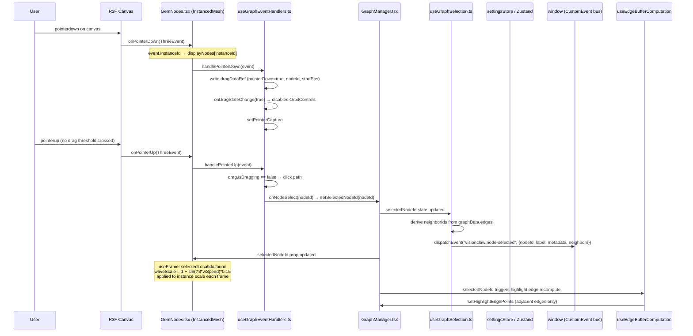
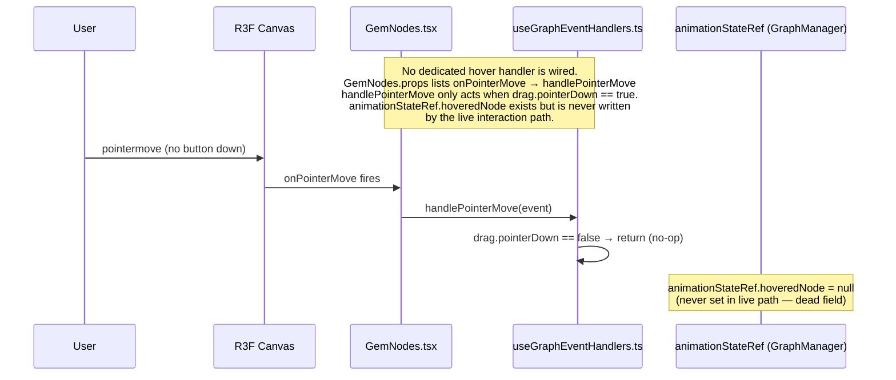
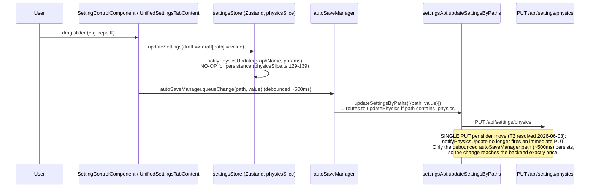

# 03 — Interaction Events: VisionClaw Graph

Generated: 2026-06-03  
Scope: all user-interaction paths that affect the graph or physics simulation.

---

## 1. Node Selection + Highlight



---

## 2. Node Drag (Live Position Write to GPU)

```mermaid
sequenceDiagram
    participant User
    participant R3F as R3F Canvas
    participant GemNodes as GemNodes.tsx
    participant Handlers as useGraphEventHandlers.ts
    participant GI as useGraphInteraction.ts
    participant WS as WebSocketService
    participant Server as Actix/SocketFlowServer (Rust)
    participant Physics as ForceComputeActor / GPU kernel

    User->>R3F: pointermove (after pointerdown)
    R3F->>GemNodes: onPointerMove(ThreeEvent)
    GemNodes->>Handlers: handlePointerMove(event)

    alt distance < DRAG_THRESHOLD (5px)
        Handlers->>Handlers: no-op
    else drag threshold crossed
        Handlers->>Handlers: drag.isDragging = true
        Handlers->>WS: sendMessage("nodeDragStart", {nodeId, position})
        WS->>Server: JSON WS frame "nodeDragStart"
        Server->>Physics: NodeInteractionMessage(Dragged)<br/>pins node at client position
    end

    Note over Handlers: Camera-plane raycast:<br/>Plane(cameraDirection, -dot(dir, startPos))<br/>ray.intersectPlane → intersection point
    Handlers->>Handlers: drag.currentNodePos3D.copy(intersection)
    Handlers->>GI: updateNodePosition(nodeId, pos)
    Handlers->>Handlers: throttledWebSocketUpdate (100ms)

    Handlers->>WS: sendMessage("nodeDragUpdate", {nodeId, position, timestamp})
    Note over Handlers: Single send per throttle tick (T2 resolved 2026-06-03):<br/>JSON "nodeDragUpdate" only. The legacy binary frame<br/>(sendNodePositionUpdates) was removed —<br/>useGraphEventHandlers.ts:60-68 — it sent a redundant<br/>SECOND frame per drag move.

    WS->>Server: WS frames received
    Server->>Physics: UpdateNodePosition (server-authoritative pin)

    Note over GemNodes: useFrame(-1) each render frame:<br/>dragLocalIdx = currentNodes.findIndex(n.id == drag.nodeId)<br/>if i == dragLocalIdx → use drag.currentNodePos3D<br/>else → read SAB (nodePositionsRef) from physics

    Note over GemNodes: GPU path (WebGPU): write xformBuf[i*4..i*4+3]<br/>WebGL path: _mat.makeScale(s,s,s); _mat.setPosition(x,y,z)<br/>setMatrixAt(i,_mat)

    User->>R3F: pointerup
    GemNodes->>Handlers: handlePointerUp
    Handlers->>GI: flushPositionUpdates()
    Handlers->>WS: sendMessage("nodeDragEnd", {nodeId})
    WS->>Server: "nodeDragEnd"
    Server->>Physics: Unpin node, resume settling
    Handlers->>Handlers: onDragStateChange(false) → re-enable OrbitControls
    Handlers->>Handlers: reset dragDataRef (all null/false)
```

---

## 3. Node Hover



---

## 4. NL Command Box: "separate and flatten" → PUT /api/settings/physics

```mermaid
sequenceDiagram
    participant User
    participant CI as CommandInput.tsx
    participant Parse as parseCommandToActions()
    participant Exec as executeAction()
    participant UAC as unifiedApiClient
    participant Server as Actix settings_routes.rs (PUT /api/settings/physics)
    participant SA as OptimizedSettingsActor
    participant SC as SimulationParams conversion
    participant GPU as ForceComputeActor / GPU kernel

    User->>CI: type "separate and flatten the two graphs" → submit
    CI->>CI: validateCommand() — blocklist word-boundary check (pass)
    CI->>Parse: parseCommandToActions(cmd)

    Note over Parse: lower.includes('separat') → discBody.graphSeparationX = 250<br/>lower.includes('flatten') → discBody.axisCompressionZ = 0.9<br/>lower.includes('reset')? No → toZero = false

    Parse-->>CI: [{description:"Dual-graph discs: separation→250, flatten→0.9",<br/>endpoint:"/api/settings/physics", method:"PUT",<br/>body:{graphSeparationX:250, axisCompressionZ:0.9}}]

    Note over CI: No "reset"/"default" keyword, and "separat"/"flatten" present<br/>→ reset action (lines 322–330) is SKIPPED

    CI->>Exec: executeAction(action)
    Exec->>UAC: request("PUT", "/settings/physics", {graphSeparationX:250, axisCompressionZ:0.9})
    Note over UAC: strips leading /api; NIP-98 auth injected

    UAC->>Server: PUT /api/settings/physics<br/>body: {graphSeparationX: 250, axisCompressionZ: 0.9}

    Server->>Server: normalize_physics_keys() — camelCase pass-through (no alias match)
    Server->>Server: GET current settings → merge patch over current PhysicsSettings
    Server->>Server: validate_physics_settings() — graphSeparationX/axisCompressionZ<br/>are serde(default) fields: checked for finiteness only
    Server->>SA: UpdateSettings {full_settings with merged physics}
    SA-->>Server: Ok(())

    Server->>Server: SimulationParams::from(&new_physics)<br/>graph_separation_x = settings.graph_separation_x (conversions.rs:231)
    Server->>GPU: UpdateSimulationParams {params}
    GPU->>GPU: force_compute_actor: separation/flatten applied<br/>to per-node position projection each physics tick

    Server-->>UAC: 200 OK
    UAC-->>CI: resolved
    CI->>CI: addStatus("Configuration applied")
```

---

## 4b. NL Command: "reset" (full physics reset)

```mermaid
sequenceDiagram
    participant User
    participant CI as CommandInput.tsx
    participant Parse as parseCommandToActions()
    participant UAC as unifiedApiClient
    participant Server as settings_routes.rs

    User->>CI: type "reset" → submit
    CI->>Parse: parseCommandToActions("reset")

    Note over Parse: lower.includes('reset') = true<br/>NOT lower.includes('separat') = true<br/>NOT lower.includes('flatten') = true<br/>→ reset action FIRES

    Parse-->>CI: [{endpoint:"/api/settings/physics", method:"PUT",<br/>body:{repelK:200, springK:2.0, damping:0.5,<br/>restLength:80, maxVelocity:200}}]

    CI->>UAC: PUT /settings/physics {repelK,springK,damping,restLength,maxVelocity}
    UAC->>Server: PUT /api/settings/physics
    Note over Server: graphSeparationX and axisCompressionZ<br/>are NOT in the reset body — they survive the reset
    Server->>Server: merge onto current; separation/flatten unchanged
    Server-->>UAC: 200 OK
```

---

## 4c. Slider Physics Write (Control Panel path)



---

## 5. Custom Raycast: instanceMatrix vs. xformBuf Picking

```mermaid
sequenceDiagram
    participant R3F as @react-three/fiber raycaster
    participant IM as InstancedMesh.raycast (patched in GemNodes useMemo)
    participant XB as xformBufRef (Float32Array, stride 4: x,y,z,scale)
    participant IMatrix as instanceMatrix (default Three.js path)

    R3F->>IM: raycast(raycaster, intersects)

    alt gpuTransformRef.current == true (WebGPU)
        Note over IM: Custom sphere test over xformBufRef<br/>baseR = geomRadius; sphere.radius = baseR * buf[i*4+3]<br/>sphere.center = (buf[i*4], buf[i*4+1], buf[i*4+2])<br/>reads SAME buffer GPU samples via positionNode
        IM->>XB: read (x,y,z,scale) per visible instance
        IM->>IM: ray.intersectSphere → push {distance, instanceId}
    else gpuTransformRef.current == false (WebGL)
        IM->>IMatrix: THREE.InstancedMesh.prototype.raycast (default)
        Note over IMatrix: reads instanceMatrix (mat4 per instance)<br/>set by _mat.makeScale + _mat.setPosition in useFrame
    end
```

---

## Sources

| File | Role |
|------|------|
| `client/src/features/visualisation/components/CommandInput.tsx` | NL command parsing, physics PUT dispatch |
| `client/src/features/graph/components/GemNodes.tsx` | InstancedMesh render, custom raycast, drag position override |
| `client/src/features/graph/components/GraphManager.tsx` | Orchestrator, useFrame SAB read, event handler wiring |
| `client/src/features/graph/hooks/useGraphEventHandlers.ts` | pointerDown/Move/Up, drag→WS, click→select |
| `client/src/features/graph/hooks/useGraphSelection.ts` | selectedNodeId state, visionclaw:node-selected dispatch |
| `client/src/features/graph/interactions/InteractionManager.ts` | Mouse/touch/XR abstraction class (unused in live path) |
| `client/src/features/visualisation/hooks/useNodeInteraction.ts` | Interaction hook (unused in live path) |
| `client/src/features/visualisation/hooks/useGraphInteraction.ts` | Position update coordination (used by useGraphEventHandlers) |
| `client/src/store/settings/physicsSlice.ts` | updatePhysics → notifyPhysicsUpdate → settingsApi.updatePhysics |
| `client/src/store/autoSaveManager.ts` | Debounced batch settings flush |
| `client/src/api/settings/endpoints.ts` | PUT /api/settings/physics, updateSettingsByPaths routing |
| `src/settings/api/settings_routes.rs` | Physics PUT handler, normalize_physics_keys, validate, SimulationParams push |
| `src/handlers/socket_flow_handler/position_updates.rs` | nodeDragStart/Update/End WS handlers |
| `src/actors/gpu/force_compute_actor.rs` | Applies graph_separation_x, axis_compression_z to GPU kernel |
| `src/handlers/settings_handler/conversions.rs` | PhysicsSettings → SimulationParams (graph_separation_x:231) |
