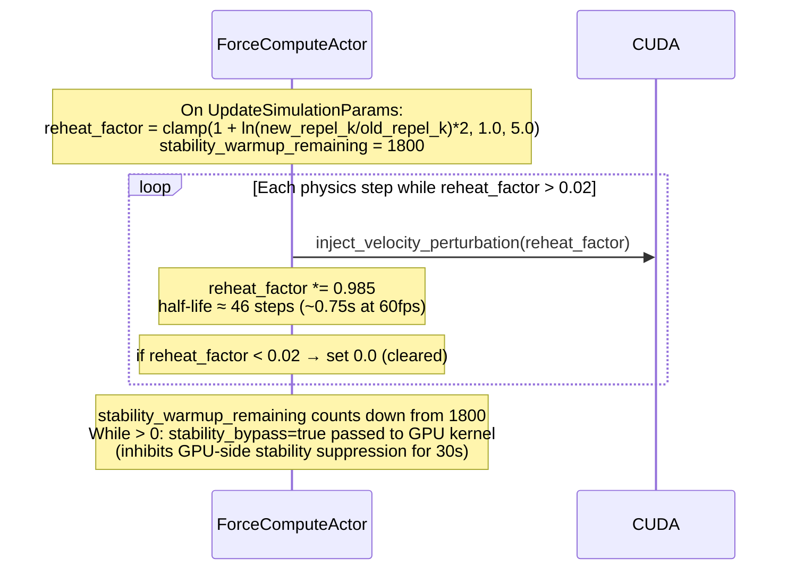
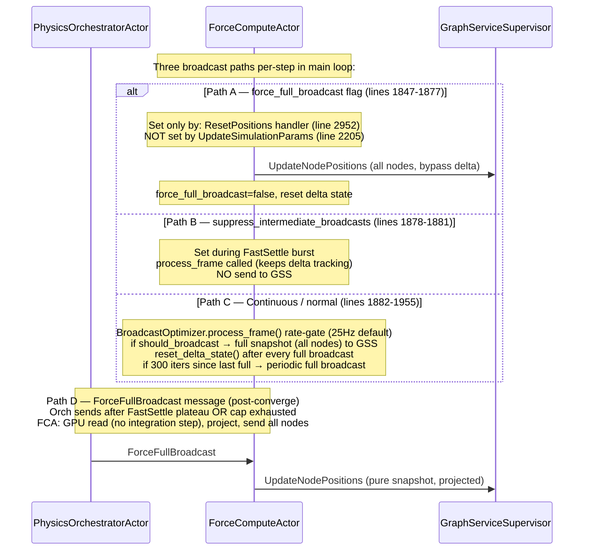
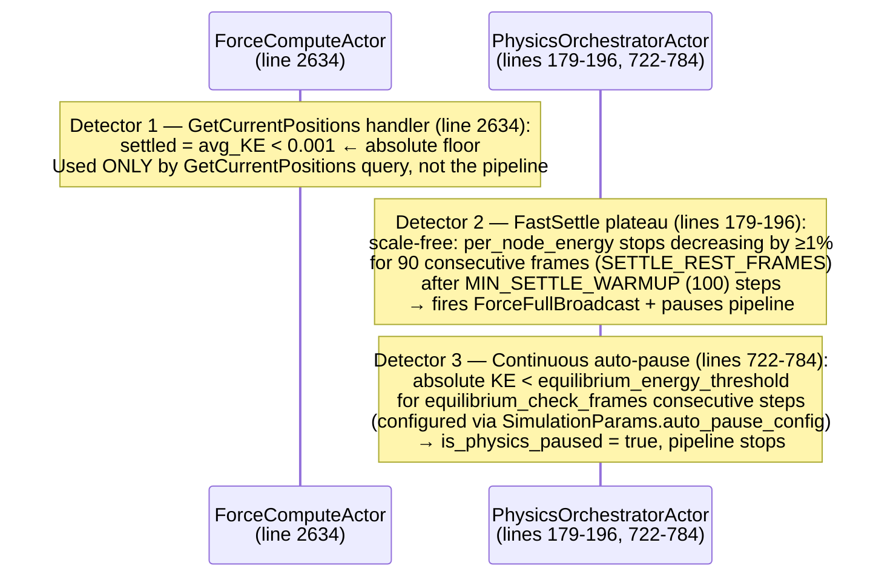

# VisionClaw: Parameter Update and Backoff Cadence

Traces the full lifecycle from a `PUT /api/settings/physics` call through GPU force
computation, energy-plateau convergence, `ForceFullBroadcast` snapshot, and final
server-idle state.  Also documents the parallel broadcast paths, dual convergence
detectors, and display-only projection apply/undo cycle.

> **Resolved 2026-06-03 — collapsed duplicated settings write-path.** A single
> physics-settings change previously persisted TWICE and dispatched
> `UpdateSimulationParams` TWICE (each resetting warmup to 1800 frames and
> reheating), and a node drag emitted TWO frames. Now there is exactly ONE of
> each:
> 1. **Persistence** — sole owner is the debounced `autoSaveManager`
>    (`UnifiedSettingsTabContent.tsx` → `autoSaveManager.queueChange` →
>    `updateSettingsByPaths` → `settingsApi.updatePhysics`). The immediate
>    persist that used to fire from `physicsSlice.notifyPhysicsUpdate` was
>    removed; the slice now only mutates local store state.
> 2. **`UpdateSimulationParams` dispatch** — sole dispatcher is the
>    `PhysicsOrchestratorActor`. `propagate_physics_to_gpu` (settings_handler/physics.rs)
>    no longer dispatches directly to the GPU compute actor; it sends only via
>    `GraphServiceSupervisor → PhysicsOrchestratorActor`, which owns the warmup
>    reset + reheat and forwards to the `ForceComputeActor`.
> 3. **Node drag** — sends ONE canonical `nodeDragUpdate` JSON frame
>    (`useGraphEventHandlers.ts`); the legacy binary `sendNodePositionUpdates`
>    frame was removed.

---

## Diagram 1 — Happy Path: param change → settle → idle

```mermaid
sequenceDiagram
    autonumber
    participant Client as React Client
    participant SH as Settings handler<br/>(settings_handler/physics.rs:<br/>propagate_physics_to_gpu)
    participant GSS as GraphServiceSupervisor
    participant Orch as PhysicsOrchestratorActor<br/>(physics_orchestrator_actor.rs)
    participant FCA as ForceComputeActor<br/>(force_compute_actor.rs)
    participant GPU as CUDA / UnifiedCompute
    participant WS as SocketFlowServer<br/>(position_updates.rs)

    Note over Client: Settings persistence has ONE path:<br/>debounced autoSaveManager.queueChange →<br/>updateSettingsByPaths → PUT /api/settings/physics<br/>(immediate persist in physicsSlice removed 2026-06-03)
    Client->>SH: PUT /api/settings/physics
    Note over SH: validate & persist settings

    Note over SH: UpdateSimulationParams has ONE dispatcher:<br/>send only via graph_service_addr (supervisor → orchestrator).<br/>Direct GPU dispatch removed 2026-06-03.
    SH->>GSS: UpdateSimulationParams (graph_service_addr)
    GSS->>Orch: UpdateSimulationParams (forwarded, line 1683)

    Note over Orch: Handler (line 1431-1472):<br/>settle_mode_changed → reset fast_settle state<br/>unpause if paused, re-kick pipeline
    Orch->>FCA: UpdateSimulationParams (forwarded, line 1478-1479)

    Note over FCA: Handler (lines 2061-2218):<br/>idempotency check (21-field epsilon compare)<br/>param-change detected:<br/>• spring_scale re-upload if pop springs changed<br/>• divergence recovery if sim_halted<br/>• broadcast_optimizer.reset_delta_state()<br/>• stability_warmup_remaining = 1800<br/>• reheat_factor = clamp(1+ln(ratio)*2, 1.0, 5.0)<br/>• suppress_intermediate_broadcasts = false<br/>• force_full_broadcast = false

    loop Per-step pipeline (FastSettle: 0ms delay; Continuous: 16ms)
        Orch->>FCA: ComputeForces
        Note over FCA: Step loop (lines 1484-2007):<br/>1. stability_warmup_remaining -= 1 (stability_bypass=true for 1800 steps)<br/>2. inject_velocity_perturbation(reheat_factor) if reheat > 0<br/>3. execute_physics_step_with_bypass(sim_params, stability_bypass)<br/>4. get_node_positions() + get_node_velocities() from GPU
        FCA->>GPU: inject_velocity_perturbation + execute_physics_step
        GPU-->>FCA: raw positions + velocities
        Note over FCA: Divergence guard (lines 1686-1714):<br/>NaN/Inf, OOB, KE > MAX — if bad: re-broadcast last_good_positions
        Note over FCA: Apply display-only projection (lines 1816-1831):<br/>graph_separation_x + axis_compression_z flattening<br/>centroid-centred per-population Y offset<br/>(mutates broadcast buffer only, NOT GPU state)
        Note over FCA: Broadcast path (lines 1844-1955):<br/>• force_full_broadcast=true → FINAL full broadcast<br/>• suppress_intermediate_broadcasts → process_frame only (no send)<br/>• else → BroadcastOptimizer.process_frame() rate-gate (25 Hz default)<br/>  → full snapshot (all nodes) if should_broadcast<br/>  → OR periodic full at every 300 iters for late clients
        FCA->>GSS: UpdateNodePositions (all nodes, projected)
        Note over FCA: Undo projection (lines 1964-1968):<br/>restore position_velocity_buffer from last_good_positions<br/>(integrator never sees projected offsets)
        Note over FCA: Decay reheat_factor *= 0.985 (~46-step half-life)<br/>Send PhysicsStepCompleted{kinetic_energy, iteration, ...}
        FCA->>Orch: PhysicsStepCompleted

        Note over Orch: Handler (lines 1716-1957):<br/>update physics_stats.kinetic_energy<br/>check GPU failure circuit-breaker (MAX=5)

        alt FastSettle mode convergence check (lines 1836-1950)
            Note over Orch: fast_settle_iteration_count++<br/>past_warmup = iteration >= MIN_SETTLE_WARMUP (100)<br/>note_settle_energy(energy, node_count, past_warmup)<br/>→ per_node_energy < ref * (1 - 0.01)? reset ref, settle_rest_run=0<br/>→ else settle_rest_run++<br/>→ converged = settle_rest_run >= SETTLE_REST_FRAMES (90)
            Orch->>FCA: ForceFullBroadcast (line 1891)
            Note over FCA: ForceFullBroadcast handler (lines 2232-2347):<br/>GPU read — NO physics step<br/>apply same projection as main loop<br/>send UpdateNodePositions (all nodes)
            FCA->>GSS: UpdateNodePositions (pure snapshot, projected)
            Note over Orch: fast_settle_complete = true<br/>is_physics_paused = true<br/>restore pre_settle_damping<br/>broadcast_physics_paused() → log only
            Note over Orch: Pipeline stops (no next step scheduled)
        else FastSettle cap exhausted (lines 1897-1932)
            Note over Orch: Transition to Continuous mode (16ms cadence)<br/>restore damping via UpdateSimulationParams<br/>send second ForceFullBroadcast (line 1929)<br/>fall through to schedule_next_pipeline_step
        else Continuous mode auto-pause (lines 722-784)
            Note over Orch: check_equilibrium_and_auto_pause():<br/>absolute KE < equilibrium_energy_threshold<br/>for equilibrium_check_frames consecutive steps<br/>→ is_physics_paused = true, broadcast_physics_paused()
        end
    end

    Note over Orch,FCA: Server idle — no pipeline steps scheduled

    loop Client position streaming (position_updates.rs:518-637)
        WS->>GSS: GetGraphData (every actual_interval ms, default 60ms)
        GSS-->>WS: nodes with current positions
        WS->>Client: binary frame (full snapshot, all nodes)<br/>re-schedule via run_later(actual_interval)
    end

    Client->>SH: PUT /api/settings/physics (next change)
    Note over Orch: UpdateSimulationParams → unpause, reset settle state<br/>pipeline re-kicked → new settle cycle begins
```

---

## Diagram 2 — Reheat Decay Detail



---

## Diagram 3 — ForceFullBroadcast vs Periodic Full vs Continuous Full



---

## Diagram 4 — Dual Convergence Detectors



---

## Notes on Subscribe_Position_Updates Streaming

`subscribe_position_updates` (socket_flow_handler/position_updates.rs:433) is a
client-driven WebSocket polling loop, **independent of the GPU physics pipeline**:

- Client sends the message with `data.interval` (default 60 ms).
- Server clamps to rate limit, confirms with `subscription_confirmed`.
- A self-perpetuating `run_later` loop fetches current positions from
  `GraphServiceSupervisor` every `actual_interval` ms and sends a full binary frame.
- The loop runs regardless of physics state (running, paused, or settled).
- Generation counter (`position_sub_generation`) collapses duplicate subscriptions.
- On empty graph, the loop reschedules itself to self-heal.

This path reads **from GSS** (which holds positions last pushed by `UpdateNodePositions`),
not from the GPU directly. When physics is settled, GSS holds the final projected
snapshot and the WebSocket loop continues to serve it at the configured interval.
