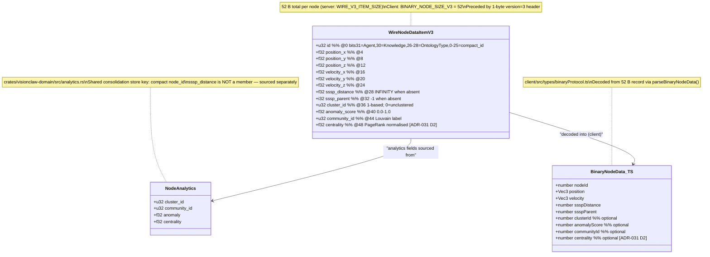

# 05 — VisionClaw Extended Analytics Wire Types (V3, 52 B)

ADR-031 Analytics Extension. Protocol version byte = `3` (PROTOCOL_V3). All fields little-endian.

---

## A. Binary wire layout — 52-byte per-node record

```
┌─────────────────────────────────────────────────────────────────────────────┐
│  V3 NODE RECORD  —  52 bytes, little-endian, one record per node            │
├────────┬──────┬──────┬──────────────────────────────────────────────────────┤
│ Offset │ Size │ Type │ Field                                                 │
├────────┼──────┼──────┼──────────────────────────────────────────────────────┤
│  @0    │  4 B │ u32  │ node_id  (bits 31=Agent, 30=Knowledge, 26-28=Ontology │
│        │      │      │          type, bits 0-25 = compact node id)           │
├────────┼──────┼──────┼──────────────────────────────────────────────────────┤
│  @4    │ 12 B │ f32× │ position  [x, y, z]                                  │
│        │      │    3 │                                                        │
├────────┼──────┼──────┼──────────────────────────────────────────────────────┤
│  @16   │ 12 B │ f32× │ velocity  [vx, vy, vz]                               │
│        │      │    3 │                                                        │
├────────┼──────┼──────┼──────────────────────────────────────────────────────┤
│  @28   │  4 B │ f32  │ sssp_distance  (INFINITY if no SSSP result)          │
├────────┼──────┼──────┼──────────────────────────────────────────────────────┤
│  @32   │  4 B │ i32  │ sssp_parent    (-1 if no SSSP result)                │
├────────┼──────┼──────┼──────────────────────────────────────────────────────┤
│  @36   │  4 B │ u32  │ cluster_id     (1-based; 0 = unclustered)            │
│        │      │      │  written by: ClusteringActor (K-means/DBSCAN)        │
├────────┼──────┼──────┼──────────────────────────────────────────────────────┤
│  @40   │  4 B │ f32  │ anomaly_score  (LOF / z-score, 0.0–1.0)             │
│        │      │      │  written by: AnomalyDetectionActor                   │
├────────┼──────┼──────┼──────────────────────────────────────────────────────┤
│  @44   │  4 B │ u32  │ community_id   (Louvain partition label)             │
│        │      │      │  written by: ClusteringActor (community detection)   │
├────────┼──────┼──────┼──────────────────────────────────────────────────────┤
│  @48   │  4 B │ f32  │ centrality     (PageRank, normalised)                │
│        │      │      │  written by: PageRankActor  [ADR-031 D2]             │
└────────┴──────┴──────┴──────────────────────────────────────────────────────┘
  Total = 52 B.  Preceded by a 1-byte protocol-version header (value = 3).
  V5 frames add an 8-byte broadcast-sequence prefix before the V3 node data.
```



---

## B. Analytics data-flow — GPU kernels to render channel

```mermaid
sequenceDiagram
    participant PR   as PageRankActor<br/>(GPU)
    participant CL   as ClusteringActor<br/>(GPU)
    participant AD   as AnomalyDetectionActor<br/>(GPU)
    participant MAP  as node_analytics<br/>Arc<RwLock<HashMap<u32,NodeAnalytics>>>
    participant CC   as ClientCoordinatorActor<br/>(READER — broadcast encoder, NOT a writer)
    participant ENC  as encode_node_data_extended_with_sssp()<br/>src/utils/binary_protocol.rs
    participant WS   as WebSocket<br/>(V5 frame)
    participant DEC  as parseBinaryNodeData()<br/>client/src/types/binaryProtocol.ts
    participant WRK  as graph.worker.ts<br/>binary-processor.ts
    participant GEM  as GemNodes.tsx<br/>(render channel)

    Note over PR,AD: GPU kernel results read back to CPU.<br/>WRITE OWNERSHIP: each analytics actor is the sole writer of its OWN<br/>field(s) into node_analytics. ClusteringActor owns cluster_id +<br/>community_id (ADR-031 D3 single writer, write_cluster_id_from_assignments);<br/>PageRankActor owns centrality; AnomalyDetectionActor owns anomaly.<br/>ClientCoordinatorActor does NOT write — it only reads at broadcast time.
    PR  ->> MAP: write entry.centrality = normalised_pagerank<br/>(sole writer of centrality, resets stale nodes to 0.0)
    CL  ->> MAP: write entry.cluster_id (1-based, 0=unclustered)<br/>write entry.community_id (Louvain)<br/>(sole writer of cluster_id + community_id)
    AD  ->> MAP: write entry.anomaly (LOF/z-score, 0.0–1.0)<br/>(sole writer of anomaly)

    Note over CC: Physics tick broadcast — CC READS only
    CC  ->> MAP: node_analytics.read().ok()<br/>(client_coordinator_actor.rs:813,954,1491 — reader)
    MAP -->> CC: Option<&HashMap<u32, NodeAnalytics>>
    CC  ->> ENC: encode_node_data_extended_with_sssp(<br/>  nodes, …, sssp_data=None, analytics_data)
    Note over ENC: Writes 52 B per node into Vec<u8>.<br/>Strips flag bits from node_id before<br/>HashMap lookup (base_id = id & NODE_ID_MASK).
    ENC -->> CC: Vec<u8> (V3 body)
    CC  ->> WS: [version=5][8B seq][V3 node data]<br/>(V5 frame = V3 + broadcast sequence prefix)

    WS  -->> DEC: ArrayBuffer (browser)
    Note over DEC: Reads version byte.<br/>V5→strip 8B seq→re-wrap as V3.<br/>stride = BINARY_NODE_SIZE_V3 = 52.<br/>Reads @36 clusterId, @40 anomalyScore,<br/>@44 communityId, @48 centrality.
    DEC -->> WRK: BinaryNodeData[] (all fields populated)
    WRK ->> WRK: analyticsBuffer[nodeIndex*5 + 0..4]<br/>= [clusterId, anomalyScore, communityId,<br/>   centrality, ssspDistance]
    Note over WRK: WORKER_ANALYTICS_STRIDE = 5 (Float32Array)
    WRK -->> GEM: analyticsBuffer (SharedArrayBuffer)

    Note over GEM: Per-frame render loop
    GEM ->> GEM: a = nodeIndex * ANALYTICS_STRIDE (=5)<br/>clusterId   = buf[a + 0]<br/>anomalyScore= buf[a + 1]<br/>communityId = buf[a + 2]<br/>centrality  = buf[a + 3]<br/>ssspDistance= buf[a + 4]
    GEM ->> GEM: colorScheme=='community' → hue from communityId<br/>colorScheme=='cluster'    → hue from clusterId<br/>colorScheme=='centrality' → blue-red ramp (PageRank)<br/>colorScheme=='sssp'       → distance ramp<br/>showAnomalies → red overlay (anomalyScore intensity)<br/>glow → emissiveIntensity from settings
```

---

## C. Encoder / decoder inventory

> **Investigated 2026-06-03 — no change.** The two binary wire-protocol
> implementations were audited for deadness. Result: the live 52 B broadcast
> encoder is `src/utils/binary_protocol.rs::encode_node_data_extended_with_sssp`
> (reached via `encode_node_data_with_live_analytics` from the `/wss` path —
> `position_updates.rs`, `fastwebsockets_handler.rs`, `actor_messages.rs`,
> `client_coordinator_actor.rs`). The crate copy in
> `crates/visionclaw-protocol/src/binary_protocol.rs` is the 48 B shadow
> (`WIRE_V3_ITEM_SIZE = 48`, no centrality@48 slot) with **zero callers outside
> its own crate/tests**. It was **not deleted**: the `visionclaw-protocol` crate
> is a live dependency of the server — `src/utils/socket_flow_messages.rs`
> re-exports `visionclaw_protocol::socket_flow_messages`, and the crate's
> `BinaryV3Frame`/`NodeRow` 28 B frame is the `BroadcastActor` hot path
> (`src/actors/broadcast_actor.rs`). `lib.rs` re-exports the whole
> `binary_protocol` module, so the shadow encoders cannot be excised without
> editing the crate's public surface. Deleting the crate or the live module
> would break the wire types — neither implementation is provably removable.
> A future cleanup may prune just the unused crate-internal `encode_*` fns once
> the crate's public API is narrowed; that is out of scope for a dead-code
> deletion.

| File | Function / path | Role | Status |
|------|----------------|------|--------|
| `src/utils/binary_protocol.rs` | `encode_node_data_extended_with_sssp()` | **LIVE** — sole full-feature 52 B writer (main crate) | Active |
| `src/utils/binary_protocol.rs` | `encode_node_data_with_live_analytics()` | Thin wrapper → `encode_node_data_extended_with_sssp` | Active |
| `src/utils/binary_protocol.rs` | `encode_node_data_with_types()`, `encode_node_data_extended()`, `encode_node_data()`, `encode_node_data_with_flags()` | Wrappers with `None` analytics — all delegate to live writer | Active |
| `src/utils/binary_protocol.rs` | `encode_node_data_with_analytics`, `encode_node_data_with_all` | **REMOVED** (task #70 D8b) — confirmed absent from `src/` | Deleted |
| `crates/visionclaw-protocol/src/binary_protocol.rs` | `encode_node_data_with_analytics()` | Shadow — encodes only 48 B (no centrality) | Unreachable (0 external callers); crate retained — see §C note 2026-06-03 |
| `crates/visionclaw-protocol/src/binary_protocol.rs` | `encode_node_data_with_all()` | Shadow — encodes only 48 B (no centrality) | Unreachable (0 external callers); crate retained — see §C note 2026-06-03 |
| `crates/visionclaw-protocol/src/binary_protocol.rs` | `encode_node_data_extended_with_sssp()` | Protocol-crate copy — encodes 48 B (no centrality) | Reachable only via crate-internal delegation; not invoked from `src/` |
| `crates/visionclaw-protocol/src/protocol/v3_frame.rs` | `BinaryV3Frame::encode_slice()` | 28 B frame (`V3_NODE_BYTES=28`) — `BroadcastActor` hot path | **LIVE** (separate broadcast channel; not the 52 B analytics path) |
| `src/utils/binary_protocol.rs:decode_node_data_v3()` | server-side decoder | Reads 52 B; centrality parsed but discarded (prefixed `_`) | Active |
| `crates/visionclaw-protocol/src/binary_protocol.rs:decode_node_data_v3()` | protocol-crate decoder | Reads 48 B chunks (`WIRE_V3_ITEM_SIZE=48`) — no centrality slot | Active within crate |
| `client/src/types/binaryProtocol.ts:parseBinaryNodeData()` | client decoder | Reads 52 B; all nine fields including centrality@48 | Active |
| `client/src/app/AppInitializer.tsx` | debug size probe | Uses magic number `nodeSize = 26` for logging only | Debug-only stale value |
