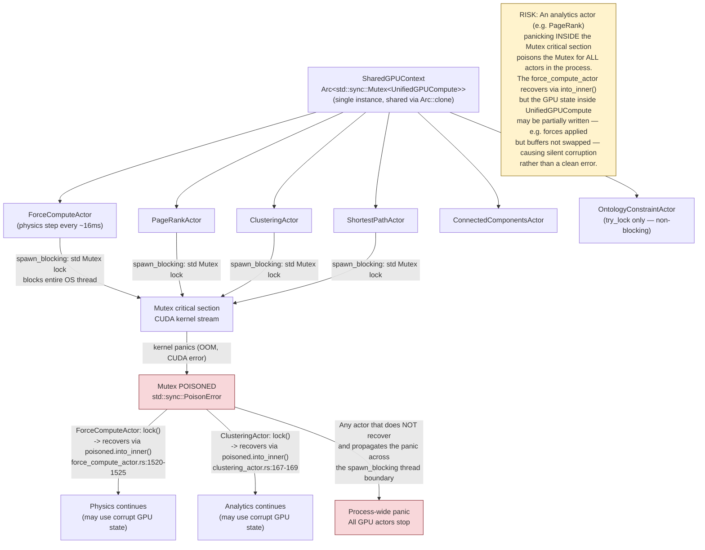
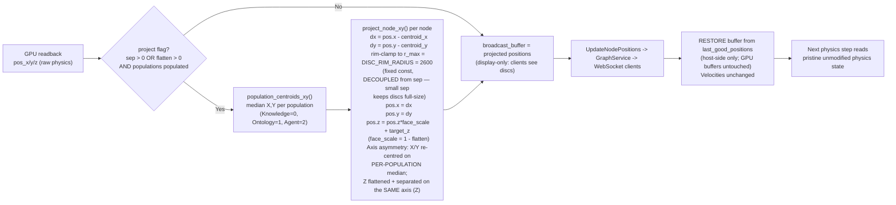

# GPU Physics Pipeline — VisionClaw

**Scope:** One physics step end-to-end, from ForceComputeActor tick through CUDA
kernel execution, divergence hardening, display-only disc projection, and broadcast.
Covers the shared `Arc<Mutex<UnifiedGPUCompute>>` context that ALL GPU actors
(physics + analytics) contend on, and explains why an analytics panic poisons
the physics process.

---

## Sequence Diagram: One Physics Step

```mermaid
sequenceDiagram
    autonumber
    participant Orch as PhysicsOrchestratorActor
    participant FCA  as ForceComputeActor
    participant BT   as spawn_blocking thread
    participant GPU  as UnifiedGPUCompute<br/>(Arc<Mutex>)
    participant CUDA as CUDA kernels<br/>(visionclaw_unified.cu)
    participant GS   as GraphServiceSupervisor

    Orch->>FCA: ComputeForces
    note over FCA: circuit-breaker check<br/>simulation_halted? -> skip
    note over FCA: apply_ontology_forces()<br/>try_lock -> upload_constraints()

    FCA->>BT: tokio::task::spawn_blocking
    note over BT: prevents Tokio executor<br/>starvation from std Mutex

    BT->>GPU: unified_compute_arc.lock()<br/>[std::sync::Mutex — blocks thread]
    note over GPU: SINGLE shared context<br/>PageRankActor, ClusteringActor,<br/>ShortestPathActor all lock SAME Mutex

    opt reheat_factor > 0
        BT->>GPU: inject_velocity_perturbation(factor)
        GPU->>CUDA: host copy vel±rand, upload
    end

    BT->>GPU: execute_physics_step_with_bypass(params, stability_bypass)
    GPU->>CUDA: copy c_params to device constant memory

    alt stability_threshold > 0 AND NOT stability_bypass
        GPU->>CUDA: calculate_kinetic_energy_kernel<<<>>>
        GPU->>CUDA: check_system_stability_kernel<<<>>>
        GPU->>GPU: copy should_skip_physics -> host
        note over GPU: if skip==1: increment iteration, return Ok
    end

    GPU->>CUDA: compute_aabb_reduction_kernel<<<>>>
    GPU->>GPU: copy aabb_block_results -> host, compute AABB
    note over GPU: auto-tune cell_size;<br/>cap to max_allowed_grid_cells<br/>to prevent out-of-bounds hash

    GPU->>CUDA: build_grid_kernel<<<>>>
    note over CUDA: assigns spatial hash cell key per node

    GPU->>CUDA: thrust_sort_key_value (FFI)
    note over CUDA: sort nodes by cell key -> sorted_node_indices

    GPU->>CUDA: compute_cell_bounds_kernel<<<>>>
    note over CUDA: writes cell_start/cell_end arrays

    alt stability_threshold > 0
        GPU->>CUDA: force_pass_with_stability_kernel<<<>>><br/>(skips stationary nodes via per-node vel check)
    else
        GPU->>CUDA: force_pass_kernel<<<>>><br/>(all nodes)
    end
    note over CUDA: Repulsion path (c_params.lin_log_mode):<br/>  lin_log_mode=1 + node_degrees != null<br/>    -> FA2 degree-scaled: scaling_ratio*(d_i+1)*(d_j+1)/dist<br/>  else<br/>    -> Classic: repel_k / (dist_sq + epsilon)<br/>Spring path (c_params.lin_log_mode):<br/>  lin_log_mode=1 -> log1p(dist)*edge_weight*spring_scale<br/>  lin_log_mode=0 -> spring_k*(dist-rest_length)*edge_weight*spring_scale<br/>Both paths share single force_pass_kernel, selected by c_params.lin_log_mode flag

    opt max_clusters > 0
        GPU->>CUDA: cluster_cohesion_kernel<<<>>>
    end
    opt degree_weights_available AND center_gravity_k > 0
        GPU->>CUDA: degree_weighted_gravity_kernel<<<>>>
    end

    GPU->>CUDA: integrate_pass_kernel<<<>>><br/>pos_in+vel_in+force -> pos_out+vel_out
    note over CUDA: Velocity clamping (GPU side, c_params.max_velocity):<br/>  FA2 adaptive_speed=1: vel = force*speed/mass; vec3_clamp(vel, max_velocity)<br/>  Classic Verlet: vel = (vel + force*dt/mass)*damping; vec3_clamp(vel, max_velocity)<br/>  Temperature jitter: vel += rand*effective_temp; vec3_clamp(vel, max_velocity)

    GPU->>GPU: record completion_event, poll until Ready
    GPU->>GPU: swap_buffers() — pos_out/vel_out become pos_in/vel_in

    BT->>GPU: get_node_positions() — host copy pos_in_x/y/z (allocated_nodes, truncate to num_nodes)
    BT->>GPU: get_node_velocities() — host copy vel_in_x/y/z

    BT-->>FCA: (gpu_result, positions_result, velocities_result)

    note over FCA: Divergence guard (post-readback, Rust side):<br/>  1. NaN/Inf in pos or vel -> bad frame<br/>  2. pos.abs() > MAX_COORD (100_000) -> bad frame<br/>  3. vel.length() > MAX_VELOCITY_MAGNITUDE (1_000) -> bad frame<br/>  4. avg kinetic energy > MAX_KINETIC_ENERGY (1e9) -> bad frame<br/>  bad frames: re-broadcast last_good_positions<br/>  >= MAX_CONSECUTIVE_BAD_FRAMES (5): circuit breaker trips

    note over FCA: Good frame:<br/>  Clamp positions to MAX_COORD, velocities to MAX_VELOCITY_MAGNITUDE<br/>  Reset consecutive_bad_frames = 0<br/>  Snapshot -> last_good_positions (pristine physics state)

    note over FCA: DISC PROJECTION (display-only, applied to broadcast buffer):<br/>  population_centroids_xy(): per-population median X,Y<br/>  project_node_xy() per node:<br/>    dx=pos.x-cx, dy=pos.y-cy; rim-clamp to r_max=DISC_RIM_RADIUS=2600 (fixed, DECOUPLED from sep)<br/>    pos.x = dx, pos.y = dy  (re-centred around population median)<br/>    pos.z = pos.z*face_scale + target_z  (flatten Z, offset by ±sep)<br/>  Knowledge: target_z=-sep  Ontology: target_z=+sep  Agent: target_z=0

    FCA->>GS: UpdateNodePositions (projected broadcast positions)

    note over FCA: PROJECTION UNDO (restore physics buffer):<br/>  position_velocity_buffer[i] = last_good_positions[i]<br/>  Velocity unchanged. Buffer now equals pristine physics state.<br/>  GPU buffers are NOT touched — undo is host-only.

    FCA->>Orch: PhysicsStepCompleted(duration, nodes, iteration, kinetic_energy)
    note over Orch: note_settle_energy() plateau tracker<br/>-> if settled: send ForceFullBroadcast<br/>-> reschedule next ComputeForces
```

---

## Flowchart: Shared Context and Analytics Poison Risk



---

## Flowchart: Disc Projection — Applied / Undone Per Step



---

## Architectural Tradeoff: Projection-as-Display vs Projection-as-Force

### Current design (display-only, apply-then-undo per step)

The projection is applied to the broadcast buffer after readback and undone before
the next step. The GPU physics state never sees the disc offsets.

**Why this is necessary:** The 56k KG-to-Ontology cross-links have a rest length
calibrated to the raw 3-D physics layout (approximately 30 units). If the projected
positions (which place Knowledge at Z=-sep, Ontology at Z=+sep) were fed back into
the GPU buffer, every spring would span the full separation gap each frame and exert
a large restoring force that collapses both populations back toward the centre. The
discs would never stabilise.

**Costs of the current design:**
- Every step allocates and reads `last_good_positions` (O(N) clone, host memory).
- The projection is computed a third time when a divergent frame falls back to
  `last_good_positions` (lines 1744-1779). As of 2026-06-03 the fallback calls the
  SAME `project_node_xy` (Z-separation + per-population median re-centre +
  `DISC_RIM_RADIUS` rim-clamp) as the main path. It previously separated on the
  Y axis with no centroid/rim-clamp, so a bad frame briefly re-oriented the discs
  onto a different axis — that inconsistency is now removed.
- `ForceFullBroadcast` must independently re-implement the same projection
  (near line 2327, `let r_max = DISC_RIM_RADIUS`), creating a second code path
  that must stay in sync.
- Population classification from `metadata["type"]` is a string-match at graph
  upload time (lines 607-633); the result is cached in `node_population` but
  is not re-verified if metadata changes without a graph reload.

### Projection-as-force refactor (considered, not implemented)

One alternative is to add a per-population Z-target spring to the CUDA force
kernel: each node experiences a weak spring pulling it toward its population's
target Z (`-sep`, `+sep`, or `0`), leaving X/Y free for the physics layout. This
would eliminate the apply/undo cycle and keep a single source of truth in the GPU.

**Tradeoff:**

| Dimension | Current (display-only) | Z-target force |
|-----------|------------------------|----------------|
| GPU state consistency | Physics never sees projection; display is a read-only view | Physics internalises the Z separation; no undo needed |
| Cross-link interference | Avoided: spring rest lengths are calibrated to the unmodified layout | Avoided differently: Z-force vs. spring equilibrium must be balanced |
| Code paths | Two (main loop + ForceFullBroadcast); risk of divergence | One: force kernel |
| Tuning complexity | `sep` and `flatten` are post-hoc display params, easy to adjust | Z-spring strength must be tuned to compete with existing cross-link springs |
| Population drift | X/Y median re-centering corrects physics drift at broadcast time only | Z is continuously pulled to target; X/Y drift uncorrected unless a separate centring force is added |
| Fallback simplicity | Divergent-frame fallback re-applies projection from `last_good_positions` | Divergent-frame fallback is unchanged; no special projection step |

**Verdict:** The projection-as-force refactor is the cleaner long-term design (single source of truth, eliminates the apply/undo per-step cost and the duplicate `ForceFullBroadcast` code path), but it requires re-calibrating the Z-spring coefficient against the existing cross-link spring forces, and separately addressing X/Y population drift. The current display-only approach is a pragmatic working solution that correctly avoids the spring-collapse problem at the cost of per-step O(N) buffer clones and two divergent code paths.

---

## Parallel Implementations and Anomalies

### Force kernel path duplication

**`force_pass_kernel` vs `force_pass_with_stability_kernel`**
File: `crates/visionclaw-gpu/src/cuda_sources/visionclaw_unified.cu` lines 252 and 2029.

Two full force kernel implementations exist. Both contain the same LinLog/Hooke
spring branch and the same FA2/classic repulsion branch. Selection in Rust is at
`execution.rs:433-436`: `force_pass_with_stability_kernel` is used when
`stability_threshold > 0`, otherwise `self.force_pass_kernel_name` (hardcoded to
`"force_pass_kernel"` at `construction.rs:429`). The stability variant adds a
per-node early-exit for nodes whose velocity is below `min_velocity_threshold`
(lines 2070-2082) and takes extra `vel_in_*` velocity buffers plus a
`should_skip_all_physics` gate; the base variant instead takes ontology
`class_id/class_charge/class_mass` metadata — the two kernels have genuinely
different signatures (visible in the two launch arms at `execution.rs:472-536`).
Neither kernel is dead code: both are live depending on the
`stability_threshold` param. However, keeping the shared logic (repulsion, springs,
constraints, centering) duplicated across 2000+ lines of CUDA is a maintenance
hazard — any bug fix to one kernel must be mirrored to the other.

**Investigated, no change — 2026-06-03.** A suspected dead-duplicate deletion of
`force_pass_with_stability_kernel` was evaluated and rejected. Proof both kernels
are launched: the live force step looks up the kernel name at `execution.rs:433`
where `force_kernel_name = "force_pass_with_stability_kernel"` when
`params.stability_threshold > 0.0`, else `force_pass_kernel`. The default
`stability_threshold` is `1e-4` (`dev_config.rs:229`), so the stability variant is
in fact the *default* live path; the base kernel runs only when the threshold is
forced to `0.0` by the warmup bypass (`execution.rs:721-722`). The LinLog-vs-Hooke
claim is true but does not make either kernel a duplicate: `c_params.lin_log_mode`
(CUDA line 73) is read *inside both* kernels (lines 346/419 and 2136/2183) to pick
the spring law at runtime; the two kernels are differentiated by velocity/stability
gating, not by spring law. Deletion would break the default GPU physics path.
Nothing was removed from the `.cu` or from the PTX expected-name lists
(`gpu_diagnostics.rs:44-50`, `:217-223`), which list `force_pass_kernel` only —
no stale name to clean up.

### LinLog vs Hooke: same kernel, runtime flag

**Not separate kernels.** The `c_params.lin_log_mode` flag (line 73 of the CUDA
source, `unsigned int lin_log_mode`) selects the attraction path inside each force
kernel at runtime (lines 419-439 and 2183-2198). `lin_log_mode=1` gives
`log1p(dist)*edge_weight*spring_scale` (LinLog / FA2 attraction);
`lin_log_mode=0` gives `spring_k*(dist-rest_length)*edge_weight*spring_scale`
(Hooke). The Rust param `SimulationParams::lin_log_mode` (mapped via
`to_sim_params()`) controls this. Both paths are live and the choice is a
per-step runtime decision, not a compile-time specialisation.

### Multiple position-upload paths

`upload_positions` is called from four distinct sites:

- `memory.rs:697` — inside `initialize_graph()`, initial graph load
- `memory.rs:713` — inside `update_positions_only()`, position-only update
- `force_compute_actor.rs:1221` — divergence recovery (`recover_from_divergence`),
  restores last-known-good positions to GPU
- `force_compute_actor.rs:2943` — `ResetPositions` handler, uploads random sphere

All four go through the same `upload_positions` function (`memory.rs:51`), which
does a safe size-checked `copy_from` to `pos_in_x/y/z`. No path bypasses the
safety check, but recovery path (1221) and reset path (2943) both lock the
`unified_compute` Mutex directly on the actor thread (not inside `spawn_blocking`),
which blocks the Tokio executor — the same anti-pattern the inline comment
at `shared.rs:104-118` warns against.

### Velocity clamping: three independent systems

Three velocity-limit mechanisms exist and are not coordinated:

1. **GPU kernel (`c_params.max_velocity`):** `integrate_pass_kernel` calls
   `vec3_clamp(vel, c_params.max_velocity)` at lines 745, 757, and 779 —
   for FA2 integration, classic Verlet integration, and temperature jitter
   respectively. `max_velocity` comes from `SimulationParams::max_velocity`
   (user-configurable).

2. **Post-readback Rust backstop (`MAX_VELOCITY_MAGNITUDE = 1_000.0`):** Applied
   to the host-side `position_velocity_buffer` at `force_compute_actor.rs:1787-1790`
   after the divergence guard passes. This is a hard cap applied regardless of the
   user's `max_velocity` setting.

3. **Divergence guard velocity check:** A velocity exceeding `MAX_VELOCITY_MAGNITUDE`
   on any node marks the frame as bad (`oob_count += 1` at line 1694), triggering
   the circuit breaker path.

Systems 1 and 2 use different thresholds (`max_velocity` is user-configurable;
`MAX_VELOCITY_MAGNITUDE` is a compile-time constant at 1_000). If the user sets
`max_velocity > 1_000`, the GPU clamp is looser than the Rust backstop, and the
divergence guard will flag every frame as out-of-bounds even for a healthy layout.

### Multiple settle detectors

Two independent convergence/settle systems run in parallel:

1. **GPU stability kernel** (`check_system_stability_kernel`, `execution.rs:144-175`):
   computes kinetic energy on-GPU and sets `should_skip_physics=1` if the system
   is stable. Bypassed when `stability_bypass=true` (controlled by
   `stability_warmup_remaining`). When triggered, the step returns `Ok(())` without
   executing force or integration passes.

2. **Orchestrator plateau tracker** (`physics_orchestrator_actor.rs:179-194`):
   `note_settle_energy()` tracks per-node kinetic energy across steps and declares
   rest after `SETTLE_REST_FRAMES=90` consecutive frames without a 1% relative
   drop. Triggers `ForceFullBroadcast` and transitions the pipeline mode.

The GPU stability kernel can suppress a step entirely (no forces, no integration),
while the orchestrator plateau tracker still receives `PhysicsStepCompleted` with
`kinetic_energy=f64::MAX` for skipped steps (`skipped: true`). The plateau tracker
guards against this by treating `f64::MAX` as non-finite and resetting the
reference energy — but this means a burst of GPU-skipped steps resets the plateau
counter and delays convergence detection.

### Projection per-step apply/undo cost

The disc projection at `force_compute_actor.rs:1829-1846` and the restore at
`1979-1984` both iterate over all nodes (O(N)) on the hot path every frame that
has `project=true`. The `last_good_positions.clear()` and rebuild at `1811-1821`
also copies all N `(node_id, Vec3, Vec3)` triples. For graphs with tens of
thousands of nodes this is three O(N) passes per frame on the Tokio actor thread
(not offloaded to `spawn_blocking`), adding CPU-side latency to the
broadcast-critical path. The `ForceFullBroadcast` handler (around line 2327)
performs its own independent projection pass with a separate
`population_centroids_xy` call, duplicating the computation outside the main loop.
