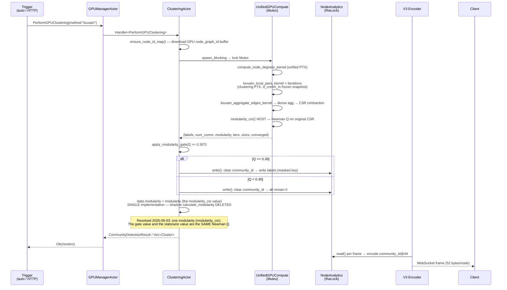
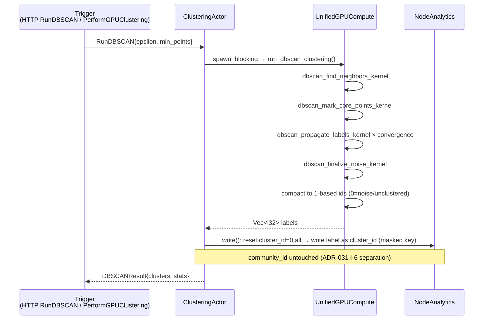
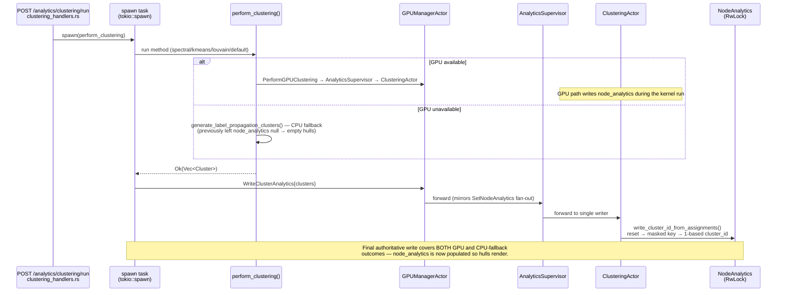
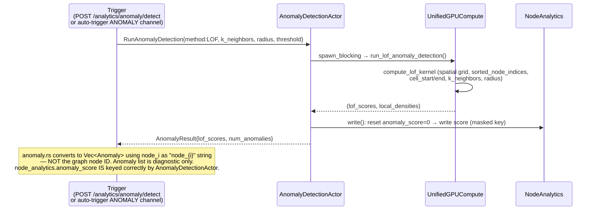
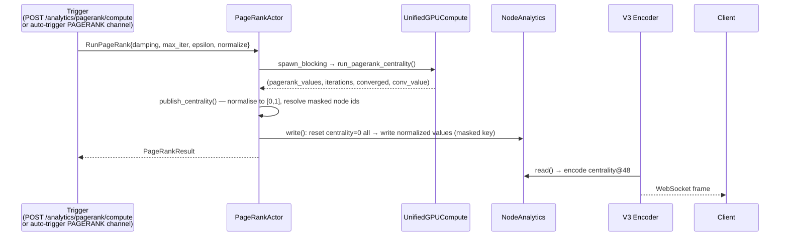
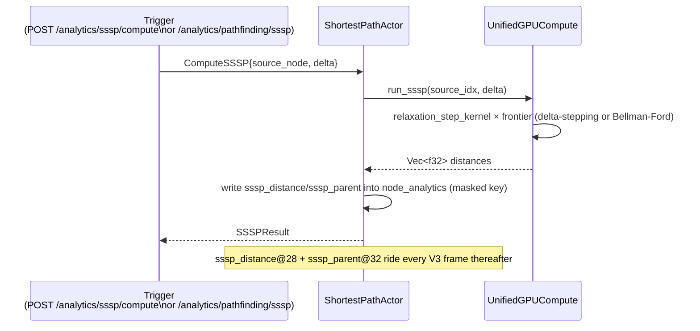
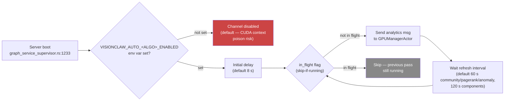
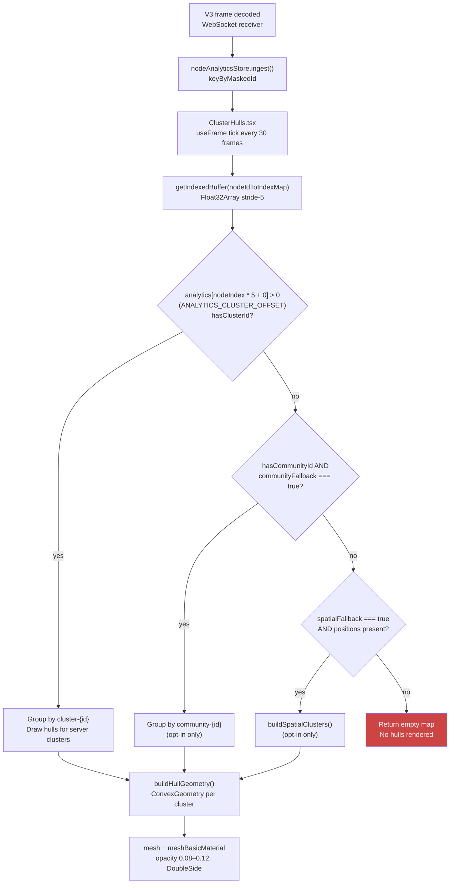

# 07 — Analysis & Clustering Pipeline

**VisionClaw backend (Rust/actix + CUDA) — static analysis snapshot 2026-06-03**

---

## 1. System flowchart — trigger paths and data flow

```mermaid
flowchart TD
    %% ── Trigger sources ──────────────────────────────────────────────────────
    subgraph TRIGGERS["Trigger sources"]
        direction TB
        AUTO["Auto-trigger loop\n(graph_service_supervisor.rs)\nADR-031 D5\nOPT-IN — disabled by default\nunless VISIONCLAW_AUTO_&lt;ALGO&gt;_ENABLED is set\n(CUDA primary-context poison risk)"]
        HTTP_CLUSTER["POST /clustering/start\nclustering_handler.rs"]
        HTTP_ANALYTICS["POST /analytics/clustering/run\nanalytics/mod.rs → clustering_handlers.rs"]
        HTTP_COMMUNITY["POST /analytics/community/detect\nanalytics/mod.rs → community.rs\n(label_propagation only — Louvain NOT exposed here)"]
        HTTP_ANOMALY["POST /analytics/anomaly/detect\nanalytics/mod.rs → anomaly.rs\nLOF or Z-score"]
        HTTP_PAGERANK["POST /analytics/pagerank/compute\npagerank_handlers.rs"]
        HTTP_SSSP["POST /analytics/sssp/compute\nsssp_handlers.rs\nPOST /analytics/pathfinding/sssp\npathfinding.rs"]
        HTTP_DBSCAN_STANDALONE["POST /clustering/dbscan\nclustering_handler.rs\nPOST /analytics/clustering/dbscan\nclustering_handlers.rs"]
    end

    %% ── Actor mesh ───────────────────────────────────────────────────────────
    subgraph ACTORS["GPU Actor Mesh"]
        GPUMgr["GPUManagerActor\n(routes PerformGPUClustering /\nRunDBSCAN / RunAnomalyDetection /\nRunPageRank → AnalyticsSupervisor)"]
        AnaSuper["AnalyticsSupervisor\n(graph_analytics_supervisor.rs)"]
        ClustActor["ClusteringActor\n(clustering_actor.rs)\nHandles: RunKMeans, RunCommunityDetection,\nRunDBSCAN, PerformGPUClustering,\nWriteClusterAnalytics (single cluster_id writer)"]
        PRankActor["PageRankActor\n(pagerank_actor.rs)\nSole writer of centrality@48"]
        AnomalyActor["AnomalyDetectionActor\n(anomaly_detection_actor.rs)\nSole writer of anomaly_score@40"]
        SSSPActor["ShortestPathActor\n(shortest_path_actor.rs)"]
    end

    %% ── GPU compute ──────────────────────────────────────────────────────────
    subgraph GPU["GPU Compute (UnifiedGPUCompute — Mutex-guarded)"]
        LPA["run_community_detection()\nlabel-propagation\ncommunity.rs"]
        LOUVAIN["run_louvain_community_detection()\nmulti-level Louvain\ncommunity.rs"]
        KMEANS["run_kmeans_clustering_with_metrics()\nclustering.rs"]
        DBSCAN_GPU["run_dbscan_clustering()\nclustering.rs"]
        LOF_GPU["run_lof_anomaly_detection()\nclustering.rs"]
        ZSCORE_GPU["run_zscore_anomaly_detection()\nclustering.rs"]
        PAGERANK_GPU["run_pagerank_centrality()\nexecution.rs"]
        SSSP_GPU["run_sssp()\nsssp.rs"]
        MOD_HOST["modularity_csr() — CPU host\ncommunity.rs:24\nNewman Q, global sigma_tot² null model\ncalled by BOTH LPA and Louvain paths"]
    end

    %% ── Analytics store ──────────────────────────────────────────────────────
    subgraph STORE["Shared Node Analytics\n(Arc<RwLock<HashMap<u32,NodeAnalytics>>>)"]
        NA_CLUSTER["cluster_id : u32\n1-based (0=unclustered)\nsingle writer: ClusteringActor\n(K-means, DBSCAN, and the\n/analytics/clustering/run spawn task\nvia WriteClusterAnalytics)"]
        NA_COMMUNITY["community_id : u32\n0-based from GPU labels\nsingle writer: ClusteringActor\ngate: modularity >= 0.30"]
        NA_ANOMALY["anomaly_score : f32\nsingle writer: AnomalyDetectionActor"]
        NA_CENTRALITY["centrality : f32\nsingle writer: PageRankActor"]
        NA_SSSP["sssp_distance : f32\nsssp_parent : i32\nsingle writer: ShortestPathActor"]
    end

    %% ── Wire encoder ─────────────────────────────────────────────────────────
    subgraph WIRE["V3 Binary Encoder (52 bytes/node)\nbinary_protocol.rs"]
        V3ENC["id@0 pos@4 vel@16 sssp_dist@28 sssp_parent@32\ncluster_id@36 anomaly_score@40 community_id@44 centrality@48\nKey: NODE_ID_MASK applied before map lookup"]
    end

    %% ── Client ───────────────────────────────────────────────────────────────
    subgraph CLIENT["Client (React/Three.js)"]
        WSRX["WebSocket receiver\ndecodes V3 frames"]
        NASTORE["nodeAnalyticsStore.ts\nbyMaskedId: Map(maskedId→record)\nstride-5 Float32Array\n[clusterId, anomalyScore, communityId,\ncentrality, ssspDistance]"]
        HULLS["ClusterHulls.tsx\nRenders ONLY server cluster_id > 0\ncommunityFallback: default OFF\nspatialFallback: default OFF"]
        GEMNODES["GemNodes — per-node colour\ncolorScheme: cluster/community/centrality"]
    end

    %% ── Trigger wiring ───────────────────────────────────────────────────────
    AUTO -->|"COMMUNITY channel\nRunCommunityDetection{Louvain}"| GPUMgr
    AUTO -->|"PAGERANK channel\nRunPageRank"| GPUMgr
    AUTO -->|"ANOMALY channel\nRunAnomalyDetection{LOF}"| GPUMgr
    AUTO -->|"COMPONENTS channel\nConnectedComponents"| GPUMgr

    HTTP_CLUSTER -->|"PerformGPUClustering\n(louvain/kmeans/dbscan)"| GPUMgr
    HTTP_ANALYTICS -->|"PerformGPUClustering"| GPUMgr
    HTTP_COMMUNITY -->|"RunCommunityDetection\n{LabelPropagation only}"| GPUMgr
    HTTP_ANOMALY -->|"RunAnomalyDetection{LOF|ZScore}"| GPUMgr
    HTTP_PAGERANK -->|"RunPageRank"| GPUMgr
    HTTP_SSSP --> SSSPActor
    HTTP_DBSCAN_STANDALONE -->|"RunDBSCAN"| GPUMgr

    GPUMgr --> AnaSuper
    AnaSuper --> ClustActor
    AnaSuper --> PRankActor
    AnaSuper --> AnomalyActor

    ClustActor -->|"LabelPropagation"| LPA
    ClustActor -->|"Louvain"| LOUVAIN
    ClustActor -->|"K-means"| KMEANS
    ClustActor -->|"DBSCAN"| DBSCAN_GPU
    PRankActor --> PAGERANK_GPU
    AnomalyActor -->|"LOF"| LOF_GPU
    AnomalyActor -->|"Z-score"| ZSCORE_GPU
    SSSPActor --> SSSP_GPU

    LPA --> MOD_HOST
    LOUVAIN --> MOD_HOST

    LPA -->|"labels + modularity"| ClustActor
    LOUVAIN -->|"labels + modularity"| ClustActor
    KMEANS -->|"assignments"| ClustActor
    DBSCAN_GPU -->|"labels (1-based)"| ClustActor
    LOF_GPU -->|"lof_scores"| AnomalyActor
    ZSCORE_GPU -->|"zscore_values"| AnomalyActor
    PAGERANK_GPU -->|"pagerank_values"| PRankActor

    ClustActor -->|"cluster_id write (K-means/DBSCAN)"| NA_CLUSTER
    ClustActor -->|"community_id write (LPA/Louvain)\nmodularity gate Q>=0.30"| NA_COMMUNITY
    PRankActor -->|"centrality write"| NA_CENTRALITY
    AnomalyActor -->|"anomaly_score write"| NA_ANOMALY
    SSSPActor -->|"sssp_distance/parent write"| NA_SSSP

    NA_CLUSTER --> V3ENC
    NA_COMMUNITY --> V3ENC
    NA_CENTRALITY --> V3ENC
    NA_ANOMALY --> V3ENC
    NA_SSSP --> V3ENC

    V3ENC -->|"WebSocket 60 Hz"| WSRX
    WSRX -->|"ingest(nodes)"| NASTORE
    NASTORE -->|"getIndexedBuffer()"| HULLS
    NASTORE -->|"getIndexedBuffer()"| GEMNODES
```

---

## 2. Louvain trigger→compute→store sequence

---

## 3. DBSCAN / K-means trigger→compute→store sequence

---

## 3b. /analytics/clustering/run spawn-task write-back (Resolved 2026-06-03)

---

## 4. LOF anomaly trigger→compute→store sequence

---

## 5. PageRank trigger→centrality→wire sequence

---

## 6. SSSP trigger→store→wire

---

## 7. Topology auto-trigger (ADR-031 D5)

---

## 8. Client hull render chain

---

## Known parallel implementations / anomalies

**PARALLEL-1 — Dual modularity computation — RESOLVED 2026-06-03**

- `modularity_csr()` at `src/utils/unified_gpu_compute/community.rs:24–68`: Newman Q with global sigma_tot² null model. Used by BOTH LPA (`run_community_detection`) and Louvain (`run_louvain_community_detection`). This is now the SOLE implementation — the authoritative gate value AND the stats/wire value.
- `ClusteringActor::calculate_modularity()` (formerly the edge-count shadow heuristic at clustering_actor.rs) has been **DELETED**. `CommunityDetectionResult.stats.modularity` now reuses the `modularity_csr` value the detection path already returns (`let actual_modularity = modularity;`), so the gate and the reported Q are identical.
- The regression test `tests/qe_t5_shadow_modularity.rs` pins the canonical Q on BARBELL_K3 (5/14 ≈ 0.3571) and asserts the system no longer reports the old shadow value (≈ 0.25).

**PARALLEL-2 — Three HTTP clustering entry points routing to the same actor**

- `POST /clustering/start` — `src/handlers/clustering_handler.rs:127` → `PerformGPUClustering` → ClusteringActor.
- `POST /analytics/clustering/run` — `src/handlers/api_handler/analytics/clustering_handlers.rs:21` → `perform_clustering()` in the same file. The GPU branch routes `PerformGPUClustering` through GPUManagerActor → ClusteringActor; the CPU branch falls back to label-propagation. **RESOLVED 2026-06-03**: regardless of branch, the spawn task now routes the finished `Vec<Cluster>` back through the single writer via `WriteClusterAnalytics` (GPUManagerActor → AnalyticsSupervisor → ClusteringActor), so `node_analytics.cluster_id` is written and hulls render on explicit user trigger.
- `POST /analytics/community/detect` — `src/handlers/api_handler/analytics/mod.rs:183` → `community::run_gpu_community_detection()` → `RunCommunityDetection{LabelPropagation}` via the GPU actor chain. Only exposes `label_propagation`; Louvain is not reachable from this route (see `community.rs:68–76`).

**PARALLEL-3 — cluster_id vs community_id dual-write history / current state**

- ADR-031 D3 documents a prior violation where handlers wrote both. Current code: ClusteringActor is sole writer of `cluster_id` (K-means/DBSCAN path) and `community_id` (LPA/Louvain path). The writes are now separated by field — community detection never touches `cluster_id` and vice versa (`src/actors/gpu/clustering_actor.rs:240–253` for cluster, `:379–393` for community). The duplicate-write bug is removed but the historical comments remain in-tree as evidence.

**PARALLEL-4 — Two DBSCAN entry points**

- `POST /clustering/dbscan` — `src/handlers/clustering_handler.rs:738` → `RunDBSCAN` → ClusteringActor.
- `POST /analytics/clustering/dbscan` — `src/handlers/api_handler/analytics/clustering_handlers.rs:202` → same `RunDBSCAN` message → same ClusteringActor path. Duplicate route, identical execution path.

**PARALLEL-5 — Two anomaly subsystems sharing the name "anomaly"**

- `POST /analytics/anomaly/detect` → GPU LOF/Z-score → `node_analytics.anomaly_score` (wire @40).
- `POST /analytics/anomaly/toggle` + `GET /analytics/anomaly/current` → agent-health heuristic from MCP telemetry → `ANOMALY_STATE` global (`src/handlers/api_handler/analytics/anomaly_handlers.rs`). These are namespaced but share the route prefix `/analytics/anomaly` with no visual distinction from the outside.

**PARALLEL-6 — CPU label-propagation fallback in clustering_handlers.rs**

- `generate_label_propagation_clusters()` at `src/handlers/api_handler/analytics/clustering_handlers.rs`: a full CPU label-propagation implementation (async, deterministic, weighted). Called by `perform_clustering()` for the Louvain/default branch when GPU is unavailable. This duplicates the GPU LPA path in `community.rs` on the CPU. **As of 2026-06-03** its output is no longer dropped: the spawn task routes the resulting `Vec<Cluster>` through `WriteClusterAnalytics`, so the CPU-fallback assignment reaches `node_analytics` via the single writer.

**PARALLEL-7 — Auto-trigger default-disabled (safety interlock)**

- `src/actors/graph_service_supervisor.rs:170–213`: all four channels (`COMMUNITY`, `PAGERANK`, `ANOMALY`, `COMPONENTS`) default to `enabled: false` unless the env var `VISIONCLAW_AUTO_<ALGO>_ENABLED` is explicitly set. Reason documented inline: the analytics `UnifiedGPUCompute` num_nodes/CSR mismatch (16014 vs 10676 at time of writing) and Louvain local-pass OOB can poison the shared CUDA primary context and freeze physics. This is the correct safety interlock but means **cluster hulls never auto-populate in a default deployment**.

---

## Cluster hull non-rendering — root cause + resolution (2026-06-03)

The hull layer (`ClusterHulls.tsx`) renders only when `nodeAnalyticsStore` returns a non-null buffer with at least one `cluster_id > 0` or `community_id > 0` entry. The store is fed exclusively from V3 binary frames. V3 frames carry non-zero cluster/community IDs only after a clustering pass has written to `node_analytics`.

**Original defect**: `POST /analytics/clustering/run` produced a `Vec<Cluster>` in its spawn task but never wrote `node_analytics` on the CPU-fallback branch (and the spawn task itself stored only `task.clusters`), so the store stayed null and hulls showed empty.

**Resolution**: the spawn task now sends `WriteClusterAnalytics{clusters}` to the single writer (ClusteringActor, ADR-031 D3) after `perform_clustering` returns, covering both the GPU and CPU-fallback branches. `ClusteringActor::write_cluster_id_from_assignments` applies the canonical masked-key / 1-based / stale-reset write — the same mechanism the K-means and DBSCAN paths use (now factored into one method, so there is no second writer).

**Auto-trigger unchanged**: `VISIONCLAW_AUTO_<ALGO>_ENABLED` remains opt-in and OFF by default (`graph_service_supervisor.rs`). The fix only makes the WRITE correct when clustering runs on an explicit user trigger; nothing auto-runs. Hulls render on explicit trigger, not at boot.
