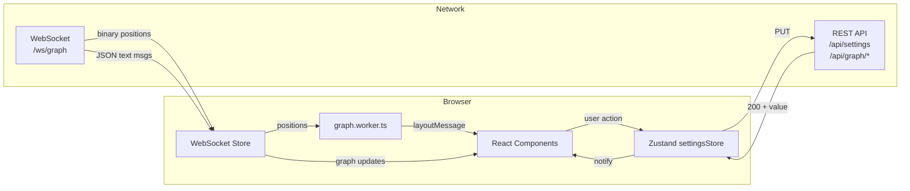
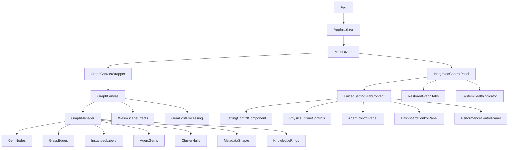

# VisionClaw TypeScript Client Architecture Map

> Generated: 2026-05-09 | Substrate: `/home/devuser/workspace/project/client/src/`
> Files: 468 | Lines: 106,778
> Last verified: 2026-06-03

**Verification note (2026-06-03):** Sections 8–11 below supersede the stale
descriptions in §§ 2–5 wherever they conflict. The diagrams in
`docs/architecture/diagrams/` are the authoritative verified source; this
document references them by relative path.

---

## 1. Module Dependency Graph

```mermaid
graph TD
    subgraph Entry["App Entry"]
        MAIN[app/main.tsx<br/>34 lines]
        APP[app/App.tsx<br/>245 lines]
        INIT[app/AppInitializer.tsx<br/>293 lines]
        LAYOUT[app/MainLayout.tsx<br/>118 lines]
    end

    subgraph Features["Feature Modules (23)"]
        F_GRAPH[graph/<br/>~12,500 lines]
        F_VIS[visualisation/<br/>~11,700 lines]
        F_BOTS[bots/<br/>~3,400 lines]
        F_PHYSICS[physics/<br/>~2,800 lines]
        F_ONTOLOGY[ontology/<br/>~3,600 lines]
        F_SETTINGS[settings/<br/>~4,600 lines]
        F_ANALYTICS[analytics/<br/>~2,200 lines]
        F_CONTRIB[contributor-studio/<br/>~1,800 lines]
        F_BROKER[broker/<br/>~1,700 lines]
        F_ENTERPRISE[enterprise/<br/>~1,300 lines]
        F_DESIGN[design-system/<br/>~3,200 lines]
        F_SOLID[solid/<br/>~1,300 lines]
        F_CMD[command-palette/<br/>~900 lines]
        F_ONBOARD[onboarding/<br/>~600 lines]
        F_HELP[help/<br/>~430 lines]
        F_KPI[kpi/<br/>~220 lines]
        F_MONITOR[monitoring/<br/>~420 lines]
        F_POLICY[policy/<br/>~270 lines]
        F_WORKFLOW[workflows/<br/>~310 lines]
        F_WORKSPACE[workspace/<br/>~470 lines]
        F_NODE[node/<br/>~210 lines]
        F_MIGRATION[migration/<br/>~260 lines]
    end

    subgraph Store["State Management"]
        S_SETTINGS[settingsStore.ts<br/>1358 lines]
        S_WS[websocket/<br/>~2,700 lines]
        S_ANALYTICS[analyticsStore.ts<br/>151 lines]
        S_AUTOSAVE[autoSaveManager.ts<br/>152 lines]
        S_RETRY[settingsRetryManager.ts<br/>210 lines]
        S_WORKER_ERR[workerErrorStore.ts<br/>77 lines]
    end

    subgraph Services["Services"]
        SVC_SOLID[SolidPodService.ts<br/>1670 lines]
        SVC_BINARY[BinaryWebSocketProtocol.ts<br/>782 lines]
        SVC_NOSTR[nostrAuthService.ts<br/>660 lines]
        SVC_PLATFORM[platformManager.ts<br/>452 lines]
        SVC_AUDIO_IN[AudioInputService.ts<br/>410 lines]
        SVC_VOICE_WS[VoiceWebSocketService.ts<br/>421 lines]
        SVC_LIVEKIT[LiveKitVoiceService.ts<br/>350 lines]
        SVC_PASSKEY[passkeyService.ts<br/>377 lines]
        SVC_REMOTE_LOG[remoteLogger.ts<br/>355 lines]
        SVC_INTERACT[interactionApi.ts<br/>376 lines]
        SVC_FLAGS[featureFlags.ts<br/>112 lines]
        SVC_UNIFIED[api/UnifiedApiClient.ts<br/>478 lines]
    end

    subgraph API["API Layer"]
        API_SETTINGS[settingsApi.ts<br/>1037 lines]
        API_ANALYTICS[analyticsApi.ts<br/>562 lines]
        API_EXPORT[exportApi.ts<br/>319 lines]
        API_WORKSPACE[workspaceApi.ts<br/>321 lines]
        API_OPTIM[optimizationApi.ts<br/>415 lines]
    end

    subgraph Workers["Web Workers"]
        W_GRAPH[graph.worker.ts<br/>1179 lines]
    end

    subgraph Rendering["Rendering"]
        R_GEM[GemPostProcessing.tsx<br/>301 lines]
        R_MATS[materials/ (4 files)<br/>~525 lines]
        R_TEXT[text/ (3 files)<br/>~370 lines]
        R_FACTORY[rendererFactory.ts<br/>237 lines]
    end

    subgraph WASM["WASM Modules"]
        WASM_SCENE[scene-effects-bridge.ts<br/>597 lines]
    end

    MAIN --> APP
    APP --> INIT
    APP --> LAYOUT

    INIT --> S_SETTINGS
    INIT --> S_WS

    LAYOUT --> F_GRAPH
    LAYOUT --> F_VIS

    F_GRAPH --> S_WS
    F_GRAPH --> W_GRAPH
    F_GRAPH --> R_GEM
    F_VIS --> WASM_SCENE
    F_SETTINGS --> S_SETTINGS
    F_SETTINGS --> API_SETTINGS
    F_BOTS --> S_WS
    F_PHYSICS --> API_SETTINGS
    F_ONTOLOGY --> S_WS
    F_ANALYTICS --> API_ANALYTICS
    F_SOLID --> SVC_SOLID

    S_WS --> SVC_BINARY
    SVC_NOSTR -->|NIP-07| F_GRAPH
```

## 2. Store-to-API-to-WebSocket Data Flow



## 3. Component Hierarchy



## 4. File Checklist

### features/ (23 feature modules, ~50,000 lines)

| Status | Module | Files | Lines | Key Components |
|--------|--------|-------|-------|----------------|
| [x] | graph/ | 32 | ~12,500 | GraphManager, GemNodes, GlassEdges, InstancedLabels, graph.worker |
| [x] | visualisation/ | 36 | ~11,700 | ControlPanel, AgentNodesLayer, WasmSceneEffects, SpacePilot |
| [x] | settings/ | 14 | ~4,600 | PhysicsEngineControls, AgentControlPanel, qualityPresets |
| [x] | ontology/ | 12 | ~3,600 | OntologyBrowser, InferencePanel, JssOntologyService |
| [x] | bots/ | 11 | ~3,400 | BotsVisualization, AgentTelemetryStream, BotsDataContext |
| [x] | design-system/ | 28 | ~3,200 | Button, Card, DataTable, Toast, WasmMiniGraph |
| [x] | physics/ | 7 | ~2,800 | PhysicsEngineControls, ConstraintBuilderDialog, presets |
| [x] | analytics/ | 6 | ~2,200 | SemanticAnalysisPanel, ShortestPathControls, analyticsStore |
| [x] | contributor-studio/ | 17 | ~1,800 | ContributorStudioRoot, PaneLayout, 5 stores |
| [x] | broker/ | 7 | ~1,700 | BrokerInbox, DecisionCanvas, CaseSubmitForm |
| [x] | enterprise/ | 10 | ~1,300 | EnterpriseDrawer, WASM drawer FX |
| [x] | solid/ | 7 | ~1,300 | PodBrowser, ResourceEditor, PodSettings |
| [x] | command-palette/ | 5 | ~900 | CommandPalette, CommandRegistry |
| [x] | onboarding/ | 5 | ~600 | OnboardingOverlay, defaultFlows |
| [x] | help/ | 4 | ~430 | HelpProvider, HelpTooltip |
| [x] | workspace/ | 1 | ~470 | WorkspaceManager |
| [x] | monitoring/ | 3 | ~420 | HealthDashboard |
| [x] | workflows/ | 2 | ~310 | WorkflowStudio |
| [x] | policy/ | 2 | ~270 | PolicyConsole |
| [x] | migration/ | 1 | ~260 | MigrationEventToast |
| [x] | kpi/ | 2 | ~220 | MeshKpiDashboard |
| [x] | node/ | 1 | ~210 | VisibilityControl |

### store/ (~5,100 lines)

| Status | File | Lines |
|--------|------|-------|
| [x] | settingsStore.ts | 1358 |
| [x] | websocket/index.ts | 678 |
| [x] | websocket/connectionManager.ts | 412 |
| [x] | websocket/binaryProtocol.ts | 322 |
| [x] | websocket/solidWebSocket.ts | 211 |
| [x] | websocket/textMessageHandler.ts | 161 |
| [x] | websocket/filterSync.ts | 134 |
| [x] | websocket/types.ts | 152 |
| [x] | websocket/serviceCompat.ts | 87 |
| [x] | settingsRetryManager.ts | 210 |
| [x] | autoSaveManager.ts | 152 |
| [x] | analyticsStore.ts | 151 |
| [x] | workerErrorStore.ts | 77 |
| [x] | websocketStore.ts | 36 |

### services/ (~7,600 lines)

| Status | File | Lines |
|--------|------|-------|
| [x] | SolidPodService.ts | 1670 |
| [x] | BinaryWebSocketProtocol.ts | 782 |
| [x] | nostrAuthService.ts | 660 |
| [x] | platformManager.ts | 452 |
| [x] | VoiceWebSocketService.ts | 421 |
| [x] | AudioInputService.ts | 410 |
| [x] | remoteLogger.ts | 355 |
| [x] | LiveKitVoiceService.ts | 350 |
| [x] | passkeyService.ts | 377 |
| [x] | interactionApi.ts | 376 |
| [x] | SpaceDriverService.ts | 322 |
| [x] | VoiceOrchestrator.ts | 229 |
| [x] | AudioOutputService.ts | 222 |
| [x] | api/UnifiedApiClient.ts | 478 |
| [x] | featureFlags.ts | 112 |

### hooks/ (~2,400 lines)

| Status | File | Lines |
|--------|------|-------|
| [x] | useWorkspaces.ts | 489 |
| [x] | useAnalytics.ts | 452 |
| [x] | useHybridSystemStatus.ts | 391 |
| [x] | useErrorHandler.tsx | 340 |
| [x] | useVoiceInteraction.ts | 192 |
| [x] | useKeyboardShortcuts.ts | 180 |
| [x] | useHeadTracking.ts | 158 |
| [x] | + 10 more hooks | ~200 |

---

## 5. PARALLEL Implementations

### P1: WebSocket Connection Management (2 stores)

| Location | Purpose |
|----------|---------|
| `store/websocket/index.ts` (678 lines) + `connectionManager.ts` (412 lines) | Primary WebSocket store (Zustand) |
| `store/websocketStore.ts` (36 lines) | Legacy thin wrapper, mostly re-exports |

### P2: Settings Persistence (2 patterns)

| Location | Pattern |
|----------|---------|
| `store/settingsStore.ts` (1358 lines) | Zustand store with auto-save, retry, undo/redo |
| `api/settingsApi.ts` (1037 lines) | Direct REST API calls with defaults |

Both manage settings state -- the store wraps the API but defaults are defined in both places.

### P3: Analytics Data Access (2 stores)

| Location | Purpose |
|----------|---------|
| `store/analyticsStore.ts` (151 lines) | Root-level Zustand analytics store |
| `features/analytics/store/analyticsStore.ts` (612 lines) | Feature-level analytics store with full implementation |

### P4: Broker UI (2 implementations)

| Location | Lines |
|----------|-------|
| `features/broker/BrokerInbox.tsx` | 458 |
| `features/broker/components/BrokerInbox.tsx` | 172 |

Both render a broker inbox. The feature-root version appears to be an earlier standalone version.

### P5: Solid Pod Hooks (2 sets)

| Location | Lines |
|----------|-------|
| `hooks/useSolidPod.ts` | 2 (re-export) |
| `hooks/useSolidResource.ts` | 2 (re-export) |
| `features/solid/hooks/useSolidPod.ts` | 133 |
| `features/solid/hooks/useSolidResource.ts` | 139 |

Root hooks are thin re-exports of feature hooks.

---

## 6. ISOLATED Code

| Location | Evidence |
|----------|----------|
| `features/graph/services/aiInsights.ts` (1109 lines) | Large AI insights service; unclear if wired to UI |
| `features/graph/services/advancedInteractionModes.ts` (862 lines) | Advanced modes; likely disconnected |
| `features/graph/services/graphComparison.ts` (677 lines) | Graph diff/comparison; no UI consumer found |
| `features/graph/services/graphSynchronization.ts` (276 lines) | Sync service; unclear usage |
| `features/graph/services/gnnPhysics.ts` (335 lines) | GNN-based physics; `gnnPhysicsConnector.ts` (51 lines) also unused |
| `features/graph/innovations/index.ts` (410 lines) | Innovation registry; experimental |
| `store/websocketStore.ts` (36 lines) | Legacy wrapper with minimal content |
| `enterprise-standalone.tsx` (48 lines) | Standalone enterprise entry; not used in main build |
| `xr/adapters/NullAdapter.ts` (30 lines) | XR null adapter, placeholder |
| `xr/adapters/XRNetworkAdapter.ts` (14 lines) | XR network adapter, placeholder |

---

## 7. STUBS and Incomplete Implementations

| Location | Type | Description |
|----------|------|-------------|
| `features/contributor-studio/components/WorkspaceCreateWizard.tsx` (24 lines) | Stub | "Thin stub until agent C1 wires the pod write path" |
| `features/contributor-studio/stores/studioWorkspaceStore.ts` (111 lines) | Stub | "actions stub API calls using placeholder bridges" |
| `features/contributor-studio/components/AutomationCreateWizard.tsx` (21 lines) | Stub | Minimal placeholder |
| `features/contributor-studio/components/ArtifactDetail.tsx` (33 lines) | Stub | Minimal placeholder |
| `features/contributor-studio/components/AutomationDetail.tsx` (31 lines) | Stub | Minimal placeholder |
| `features/contributor-studio/components/SkillDojo.tsx` (29 lines) | Stub | Minimal placeholder |
| `telemetry/index.ts:39` | Stub | "provides a stub interface for non-React usage" |
| `hooks/useSolidPod.ts` (2 lines) | Re-export | Nearly empty |
| `hooks/useSolidResource.ts` (2 lines) | Re-export | Nearly empty |

---

## 8. Node Population: Client Classification (verified 2026-06-03)

> Canonical diagram: [`diagrams/02-population-handoff.md`](diagrams/02-population-handoff.md)

### `metadata.type` is the classification authority (T1 resolved)

The client reads `node.metadata?.type` as the primary classification field,
mirroring the server's `metadata["type"]` authority. This applies to all three
classification consumers:

| Consumer | File | Reads | Output |
|----------|------|-------|--------|
| Visual geometry tier | `useGraphVisualState.ts` | `node.metadata?.type` | `perNodeVisualModeMap` (knowledge/ontology/agent) |
| Filter gate | `useGraphFiltering.ts` | `node.metadata?.type` | linked_page visibility |
| Colour | `GemNodes.tsx` | `node.metadata?.type` | RGB colour; `isClass` check |

Prior to T1 resolution, `useGraphVisualState.ts` read the top-level `node.type`
field (serde-renamed from `node_type`) at priority-2. This contradicted the
server's declared authority and caused ~2,551 nodes to receive ontology geometry
while sitting on the knowledge disc — the visible Z-spray. That priority-2
reader now also reads `node.metadata?.type`, matching the server's fallback
(`node_type` is legacy-only when `metadata["type"]` is absent).

The default `colorScheme` is `'community'` (Louvain community_id colouring).
The `'type'` scheme reads `metadata.type` for colour; `isClass` is true only
when `metadata.type === 'owl_class'`. Both use `metadata.type`, not top-level
`type`.

### Wire message carries both fields; only `metadata.type` is classifying

`initialGraphLoad` JSON carries both a top-level `type` (serde of `node_type`)
and `metadata["type"]`. After T1 the client classifies from `metadata.type`;
the top-level `type` field is retained on the wire for legacy fallback only.

---

## 9. Settings Hydration: Client Receives from Server (verified 2026-06-03)

> Canonical diagram: [`diagrams/01-settings-flow.md`](diagrams/01-settings-flow.md)

The client **never pushes physics settings to the server on connect**. It
hydrates from the server:

1. `AppInitializer.tsx::initialize()` calls `getSettingsByPaths(ESSENTIAL_PATHS)`.
2. `settingsApi` fetches `GET /api/settings/all` (2 s in-memory cache), which
   returns physics from SQLite (authoritative) and rendering from the actor.
3. `coreSlice.ts::deepMergeSettings` merges server response as BASE with
   localStorage as OVERLAY. Physics and tweening are then re-overlaid from the
   server on top of localStorage, making physics server-authoritative.
4. WebSocket is initialised after settings are merged; the initial
   `subscribe_position_updates` message is sent exactly once
   (idempotency guard in `AppInitializer.tsx:296`).

The stale description in §2 implied the client pushed settings on connect
("`STORE → PUT → REST`"). That flow applies only to subsequent user-initiated
changes, not to the connect handshake.

### Single debounced persistence path (T2 resolved)

Physics settings changes from the UI travel through one path only:

```
UI slider → physicsSlice.updatePhysics() [local store only]
         → coreSlice.autoSaveManager.queueChange() [500 ms debounce]
         → updateSettingsByPaths() → PUT /api/settings/physics
```

The immediate `notifyPhysicsUpdate` direct call that previously fired a second
PUT pipeline from `physicsSlice.ts:130` has been removed. The slice now only
mutates local store state; persistence is owned solely by `autoSaveManager`.

---

## 10. Binary Protocol Decode: 52-byte V3 (verified 2026-06-03)

> Canonical diagram: [`diagrams/05-wire-analytics-types.md`](diagrams/05-wire-analytics-types.md)

The client decoder `parseBinaryNodeData()` in `client/src/types/binaryProtocol.ts`
reads 52-byte records (`BINARY_NODE_SIZE_V3 = 52`). V5 frames (8-byte sequence
prefix) are detected by the version byte; the prefix is stripped before
per-node decoding. Analytics fields:

| Wire offset | Client field | Notes |
|-------------|-------------|-------|
| @36 | `clusterId` | 1-based; 0 = unclustered |
| @40 | `anomalyScore` | 0.0–1.0 |
| @44 | `communityId` | Louvain label |
| @48 | `centrality` | PageRank, normalised |

The graph worker (`graph.worker.ts`) writes decoded analytics into a
`Float32Array` at stride 5: `[clusterId, anomalyScore, communityId, centrality,
ssspDistance]`. `GemNodes.tsx` reads from this buffer in the per-frame render
loop.

The stale §2 description referenced `BinaryWebSocketProtocol.ts` and did not
mention analytics fields. The live decode path is `parseBinaryNodeData()` via
`binaryProtocol.ts` → `graph.worker.ts` → `analyticsBuffer`.

The debug probe at `AppInitializer.tsx` uses a stale magic number (`nodeSize = 26`)
for logging only; it does not affect decoding.

---

## 11. Cluster Hulls: Opt-in Only (verified 2026-06-03)

> Canonical diagram: [`diagrams/07-analysis-clustering.md`](diagrams/07-analysis-clustering.md)

`ClusterHulls.tsx` renders hull geometry when the `nodeAnalyticsStore` returns
at least one non-zero `cluster_id` or `community_id` entry. All three fallback
paths (`communityFallback`, `spatialFallback`) default to OFF. Hulls render
after an explicit clustering trigger (`POST /analytics/clustering/run` or
`POST /clustering/start`) — they do not auto-render at boot.

The `InteractionManager.ts` and `useNodeInteraction.ts` files exist in the
codebase but are dead (zero imports). The live interaction path is
`useGraphEventHandlers.ts`. See `docs/architecture/KNOWN_ISSUES.md` (T8).
