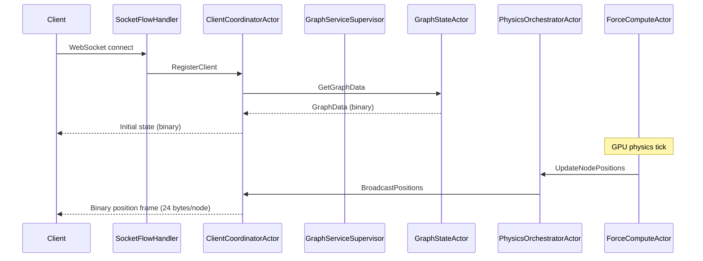
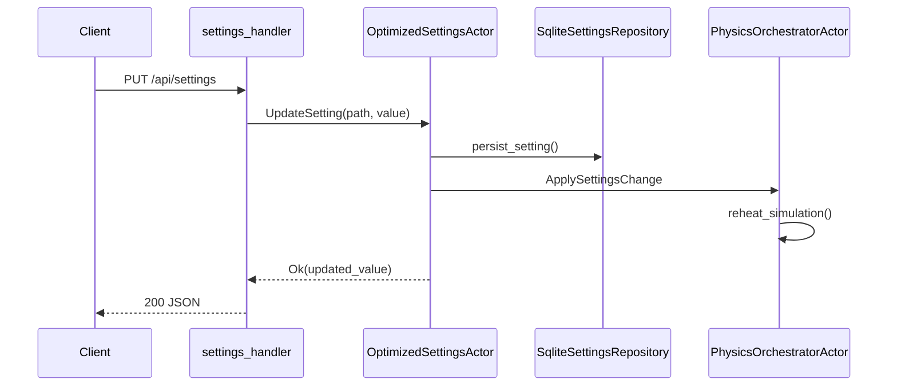
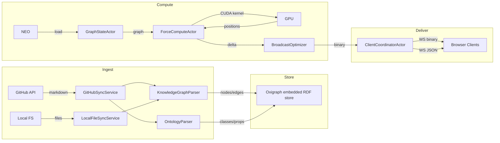

# VisionClaw Rust Backend Architecture Map

> Generated: 2026-05-09 | Substrate: `/home/devuser/workspace/project/src/`
> Files: 549 | Lines: 149,142 | Public functions: 3,144
> Last verified: 2026-06-03

**Verification note (2026-06-03):** Sections 8–11 below supersede the stale
descriptions in §§ 2–5 wherever they conflict. The diagrams in
`docs/architecture/diagrams/` are the authoritative verified source; this
document references them by relative path.

---

## 1. Module Dependency Graph

```mermaid
graph TD
    subgraph Entry["Entry Points"]
        MAIN[main.rs<br/>1028 lines]
        CLI[bin/vc_cli.rs<br/>559 lines]
        SYNC_GH[bin/sync_github.rs<br/>93 lines]
        SYNC_LOCAL[bin/sync_local.rs<br/>134 lines]
        GENTYPES[bin/generate_types.rs<br/>664 lines]
        LOAD_ONT[bin/load_ontology.rs<br/>106 lines]
    end

    subgraph Handlers["HTTP Handlers Layer"]
        H_API[api_handler/<br/>~6,500 lines]
        H_WS[socket_flow_handler/<br/>~2,700 lines]
        H_SETTINGS[settings_handler/<br/>~3,000 lines]
        H_GRAPH[graph_state_handler.rs<br/>435 lines]
        H_PHYSICS[physics_handler.rs<br/>427 lines]
        H_ONTOLOGY[ontology_handler.rs<br/>794 lines]
        H_BOTS[bots_handler.rs<br/>566 lines]
        H_DISCOVERY[discovery_handler.rs<br/>1093 lines]
        H_MCP_RELAY[mcp_relay_handler.rs<br/>608 lines]
        H_RAGFLOW[ragflow_handler.rs<br/>815 lines]
        H_SPEECH[speech_socket_handler.rs<br/>593 lines]
        H_SOLID[solid_pod_handler.rs<br/>500 lines]
        H_NOSTR[nostr_handler.rs<br/>364 lines]
        H_QUIC[quic_transport_handler.rs<br/>759 lines]
    end

    subgraph Actors["Actor System"]
        A_CLIENT[ClientCoordinatorActor<br/>2352 lines]
        A_GRAPH_STATE[GraphStateActor<br/>1695 lines]
        A_GRAPH_SVC[GraphServiceSupervisor<br/>1621 lines]
        A_PHYS_ORCH[PhysicsOrchestratorActor<br/>2161 lines]
        A_SEMANTIC[SemanticProcessorActor<br/>1829 lines]
        A_ONTOLOGY[OntologyActor<br/>1155 lines]
        A_SETTINGS[OptimizedSettingsActor<br/>1428 lines]
        A_BROKER[BrokerActor<br/>567 lines]
        A_NOSTR[ServerNostrActor<br/>1041 lines]
        A_MCP_VIZ[MultiMcpVisualizationActor<br/>1206 lines]
        A_WORKSPACE[WorkspaceActor<br/>626 lines]
        A_PRESENCE[PresenceActor<br/>721 lines]
        A_SUPERVISOR[SupervisorActor<br/>584 lines]
        A_LIFECYCLE[ActorLifecycleManager<br/>346 lines]
    end

    subgraph GPU["GPU Compute Actors"]
        G_FORCE[ForceComputeActor<br/>3208 lines]
        G_PHYSICS_SUP[PhysicsSupervisor<br/>1039 lines]
        G_ANALYTICS_SUP[AnalyticsSupervisor<br/>665 lines]
        G_CLUSTERING[ClusteringActor<br/>1317 lines]
        G_ANOMALY[AnomalyDetectionActor<br/>1312 lines]
        G_SEMANTIC_F[SemanticForcesActor<br/>1248 lines]
        G_PAGERANK[PagerankActor<br/>519 lines]
        G_ONTOLOGY_C[OntologyConstraintActor<br/>917 lines]
        G_GPU_MGR[GpuManagerActor<br/>851 lines]
        G_RESOURCE[GpuResourceActor<br/>732 lines]
    end

    subgraph Services["Service Layer"]
        S_GITHUB_SYNC[GitHubSyncService<br/>1266 lines]
        S_AGENT_VIZ[AgentVisualizationProtocol<br/>1454 lines]
        S_SPEECH[SpeechService<br/>1414 lines]
        S_OWL_VAL[OwlValidator<br/>1245 lines]
        S_KGE[KgeTrainer<br/>840 lines]
        S_BEAD_STORE[BeadStore<br/>1217 lines]
        S_SEMANTIC_TYPE[SemanticTypeRegistry<br/>1145 lines]
        S_INGEST_SAGA[IngestSaga<br/>986 lines]
        S_FILE_SVC[FileService<br/>1282 lines]
        S_NOSTR[NostrService<br/>742 lines]
        S_EMBED[EmbeddingService<br/>728 lines]
        S_NHOP[NhopMaterializer<br/>724 lines]
        S_SHARE_ORCH[ShareOrchestrator<br/>715 lines]
        S_PATHFINDING[Pathfinding<br/>896 lines]
    end

    subgraph Adapters["Adapter Layer (Ports/Adapters) — Oxigraph + SQLite, ADR-11"]
        AD_OXI_GRAPH[OxigraphGraphRepository<br/>embedded RDF store]
        AD_OXI_ONT[OxigraphOntologyRepository<br/>same store, ontology named graph]
        AD_SQLITE_SET[SqliteSettingsRepository<br/>embedded SQLite]
        AD_GPU_SEM[GpuSemanticAnalyzer<br/>531 lines]
        AD_PHYSICS[ActixPhysicsAdapter<br/>639 lines]
    end

    subgraph Parsers["Content Parsers"]
        P_KG[KnowledgeGraphParser<br/>1355 lines]
        P_ONT[OntologyParser<br/>1757 lines]
        P_BLOCK[BlockLevelParser<br/>455 lines]
    end

    MAIN --> H_API
    MAIN --> H_WS
    MAIN --> A_CLIENT
    MAIN --> A_GRAPH_SVC
    MAIN --> A_PHYS_ORCH

    H_API --> A_GRAPH_STATE
    H_API --> A_SETTINGS
    H_API --> A_ONTOLOGY
    H_WS --> A_CLIENT
    H_SETTINGS --> A_SETTINGS

    A_GRAPH_SVC --> A_GRAPH_STATE
    A_GRAPH_SVC --> A_PHYS_ORCH
    A_PHYS_ORCH --> G_FORCE
    A_PHYS_ORCH --> G_PHYSICS_SUP
    A_SEMANTIC --> G_SEMANTIC_F

    G_FORCE --> A_CLIENT
    A_CLIENT -->|binary positions| H_WS

    S_GITHUB_SYNC --> P_KG
    S_GITHUB_SYNC --> P_ONT
    S_GITHUB_SYNC --> AD_OXI_GRAPH
    P_KG --> AD_OXI_GRAPH
    P_ONT --> AD_OXI_ONT

    A_ONTOLOGY --> AD_OXI_ONT
    A_SETTINGS --> AD_SQLITE_SET
    A_GRAPH_STATE --> AD_OXI_GRAPH
```

## 2. Handler-to-Service-to-Actor Call Chains

## 3. Data Flow Diagram

## 4. File Checklist

### actors/ (68 files)

| Status | File | Lines |
|--------|------|-------|
| [x] | actors/agent_monitor_actor.rs | 496 |
| [x] | actors/automation_orchestrator_actor.rs | 707 |
| [x] | actors/broker_actor.rs | 567 |
| [x] | actors/client_coordinator_actor.rs | 2352 |
| [x] | actors/client_filter.rs | 300 |
| [x] | actors/code_analysis_actor.rs | 347 |
| [x] | actors/context_assembly_actor.rs | 152 |
| [x] | actors/contributor_studio_supervisor.rs | 286 |
| [x] | actors/dojo_discovery_actor.rs | 247 |
| [x] | actors/event_coordination.rs | 167 |
| [x] | actors/gpu/analytics_supervisor.rs | 665 |
| [x] | actors/gpu/anomaly_detection_actor.rs | 1312 |
| [x] | actors/gpu/clustering_actor.rs | 1317 |
| [x] | actors/gpu/connected_components_actor.rs | 319 |
| [x] | actors/gpu/constraint_actor.rs | 325 |
| [x] | actors/gpu/context_bus.rs | 228 |
| [x] | actors/gpu/cuda_stream_wrapper.rs | 44 |
| [x] | actors/gpu/force_compute_actor.rs | 3208 |
| [x] | actors/gpu/gpu_manager_actor.rs | 851 |
| [x] | actors/gpu/gpu_resource_actor.rs | 732 |
| [x] | actors/gpu/graph_analytics_supervisor.rs | 421 |
| [x] | actors/gpu/mod.rs | 85 |
| [x] | actors/gpu/ontology_constraint_actor.rs | 917 |
| [x] | actors/gpu/pagerank_actor.rs | 519 |
| [x] | actors/gpu/physics_supervisor.rs | 1039 |
| [x] | actors/gpu/resource_supervisor.rs | 491 |
| [x] | actors/gpu/semantic_forces_actor.rs | 1248 |
| [x] | actors/gpu/shared.rs | 570 |
| [x] | actors/gpu/shortest_path_actor.rs | 447 |
| [x] | actors/gpu/stress_majorization_actor.rs | 497 |
| [x] | actors/gpu/supervisor_messages.rs | 242 |
| [x] | actors/graph_service_supervisor.rs | 1621 |
| [x] | actors/graph_state_actor.rs | 1695 |
| [x] | actors/lifecycle.rs | 346 |
| [x] | actors/messages/ (8 files) | 2213 |
| [x] | actors/messaging/ (5 files) | 1155 |
| [x] | actors/metadata_actor.rs | 86 |
| [x] | actors/mod.rs | 137 |
| [x] | actors/multi_mcp_visualization_actor.rs | 1206 |
| [x] | actors/ontology_actor.rs | 1155 |
| [x] | actors/ontology_guidance_actor.rs | 161 |
| [x] | actors/optimized_settings_actor.rs | 1428 |
| [x] | actors/physics_orchestrator_actor.rs | 2161 |
| [x] | actors/presence_actor.rs | 721 |
| [x] | actors/protected_settings_actor.rs | 75 |
| [x] | actors/semantic_processor_actor.rs | 1829 |
| [x] | actors/server_nostr_actor.rs | 1041 |
| [x] | actors/share_orchestrator_actor.rs | 180 |
| [x] | actors/skill_compatibility_scanner.rs | 186 |
| [x] | actors/skill_evaluation_actor.rs | 114 |
| [x] | actors/skill_registry_supervisor.rs | 212 |
| [x] | actors/supervisor.rs | 584 |
| [x] | actors/task_orchestrator_actor.rs | 583 |
| [x] | actors/transient_edge_actor.rs | 139 |
| [x] | actors/voice_commands.rs | 303 |
| [x] | actors/workspace_actor.rs | 626 |

### handlers/ (52 files, ~17,700 lines)

| Status | File | Lines |
|--------|------|-------|
| [x] | handlers/api_handler/analytics/ (14 files) | ~4,200 |
| [x] | handlers/api_handler/graph/mod.rs | 899 |
| [x] | handlers/api_handler/ontology/mod.rs | 1451 |
| [x] | handlers/api_handler/settings/mod.rs | 419 |
| [x] | handlers/api_handler/semantic_forces.rs | 665 |
| [x] | handlers/api_handler/quest3/mod.rs | 742 |
| [x] | handlers/socket_flow_handler/ (7 files) | ~2,700 |
| [x] | handlers/settings_handler/ (8 files) | ~3,000 |
| [x] | handlers/discovery_handler.rs | 1093 |
| [x] | handlers/multi_mcp_websocket_handler.rs | 954 |
| [x] | handlers/clustering_handler.rs | 892 |
| [x] | handlers/ragflow_handler.rs | 815 |
| [x] | handlers/ontology_handler.rs | 794 |
| [x] | handlers/quic_transport_handler.rs | 759 |
| [x] | handlers/image_gen_handler.rs | 719 |
| [x] | handlers/fastwebsockets_handler.rs | 606 |
| [x] | handlers/mcp_relay_handler.rs | 608 |

### services/ (62 files, ~38,000 lines)

| Status | File | Lines |
|--------|------|-------|
| [x] | services/parsers/ (4 files) | 3,625 |
| [x] | services/github/ (5 files) | 1,304 |
| [x] | services/git_ingest/ (4 files) | 2,137 |
| [x] | services/agent_visualization_protocol.rs | 1454 |
| [x] | services/speech_service.rs | 1414 |
| [x] | services/github_sync_service.rs | 1266 |
| [x] | services/owl_validator.rs | 1245 |
| [x] | services/bead_store.rs | 1217 |
| [x] | services/semantic_type_registry.rs | 1145 |
| [x] | services/ingest_saga.rs | 986 |
| [x] | services/pathfinding.rs | 896 |
| [x] | services/kge_trainer.rs | 840 |
| [x] | services/nostr_service.rs | 742 |
| [x] | services/embedding_service.rs | 728 |
| [x] | services/nhop_materializer.rs | 724 |
| [x] | services/share_orchestrator.rs | 715 |
| [x] | services/migration_broker.rs | 716 |
| [x] | services/multi_mcp_agent_discovery.rs | 756 |
| [x] | + 44 more service files | ~19,500 |

### adapters/ (15 files, ~10,600 lines)
### config/ (13 files, ~3,800 lines)
### constraints/ (10 files, ~4,400 lines)
### cqrs/ (12 files, ~3,200 lines)
### domain/ (14 files, ~3,200 lines)
### events/ (12 files, ~2,800 lines)
### gpu/ (8 files, ~8,200 lines)
### physics/ (6 files, ~4,800 lines)

---

## 5. PARALLEL Implementations

### P1: Rate Limiting (3 implementations)

| Location | Mechanism | Used by |
|----------|-----------|---------|
| `middleware/rate_limit.rs` (423 lines) | `RateLimit` Transform middleware (actix_web) | `main.rs` route wiring (lines 914, 919) |
| `utils/validation/rate_limit.rs` (561 lines) | `RateLimiter` with `RateLimitConfig`, token-bucket | `utils/validation/middleware.rs` |
| `utils/validation/middleware.rs` (489 lines) | `RateLimit` Transform wrapping validation `RateLimiter` | `create_settings_middleware()`, `create_ragflow_middleware()` |

**Impact**: Two independent `RateLimit` types exist in the same binary. `middleware/rate_limit.rs` is used for top-level route wrapping in `main.rs`. `utils/validation/middleware.rs` wraps the `utils/validation/rate_limit.rs` token-bucket for endpoint-specific rate limiting. The types have colliding names (`RateLimit`) but live in different modules.

### P2: Auth / Access Control (5+ locations)

| Location | Purpose |
|----------|---------|
| `middleware/auth.rs` (241 lines) | `AuthGuard` middleware, `AccessLevel` enum, `get_authenticated_user()` |
| `middleware/enterprise_auth.rs` (603 lines) | `EnterpriseRole` extraction, `RequireRole` middleware, dual-path NIP-98 / header auth |
| `utils/auth.rs` (497 lines) | `verify_access()`, `verify_admin()`, etc. helper functions |
| `utils/nip98.rs` (640 lines) | NIP-98 token generation/validation |
| `settings/auth_extractor.rs` (234 lines) | Settings-specific `require_power_user()` |
| `handlers/socket_flow_handler/filter_auth.rs` (440 lines) | WebSocket auth + Nostr filter validation |

### P3: Error Handling (3+ error systems)

| Location | Pattern |
|----------|---------|
| `errors/mod.rs` (989 lines) | Monolithic `AppError` enum |
| `utils/validation/errors.rs` (539 lines) | `ValidationError` with `rate_limit_exceeded()` |
| `adapters/messages.rs` (269 lines) | Adapter-specific error types |
| `utils/result_helpers.rs` (422 lines) | Result extension traits |

### P4: Ontology Processing (4 overlapping services)

| Location | Purpose |
|----------|---------|
| `services/owl_validator.rs` (1245 lines) | OWL validation, `PropertyGraph`, `RdfTriple` |
| `ontology/services/owl_validator.rs` (723 lines) | Re-exports from services/owl_validator.rs |
| `services/ontology_reasoner.rs` | Reasoning engine |
| `services/ontology_enrichment_service.rs` | Enrichment orchestration |
| `services/ontology_reasoning_service.rs` | Higher-level reasoning wrapper |
| `reasoning/custom_reasoner.rs` (450 lines) | `CustomReasoner` implementing `OntologyReasoner` trait |
| `services/ontology_pipeline_service.rs` (477 lines) | Pipeline orchestrating all of the above |

### P5: WebSocket Handling (3 implementations)

| Location | Protocol |
|----------|----------|
| `handlers/socket_flow_handler/` (7 files, ~2,700 lines) | Primary binary protocol handler |
| `handlers/fastwebsockets_handler.rs` (606 lines) | Alternative WS using fastwebsockets crate |
| `handlers/multi_mcp_websocket_handler.rs` (954 lines) | MCP-specific WebSocket handler |

---

## 6. ISOLATED Code (defined but never/rarely called)

| Location | Evidence |
|----------|----------|
| `actors/context_assembly_actor.rs:150` | `fn _supervision_warn_placeholder()` — prefixed with `_`, dead |
| `actors/gpu/anomaly_detection_actor.rs` | 10 `#[allow(dead_code)]` annotations |
| `actors/ontology_actor.rs` | 3 `#[allow(dead_code)]` fields |
| `actors/physics_orchestrator_actor.rs` | 2 `#[allow(dead_code)]` fields |
| `actors/semantic_processor_actor.rs:163` | CPU-only stubs `#[allow(dead_code)]` |
| `events/middleware.rs:246-248` | 2 dead fields in `RetryMiddleware` |
| `cqrs/` entire directory (3,200 lines) | CQRS bus registered but handlers are no-ops per QE gap analysis |
| `services/owl_validator_stubs.rs` (80 lines) | Stub module |
| `handlers/user_interaction_handler.rs` (36 lines) | Near-empty handler |
| `handlers/utils.rs` (9 lines) | Trivial unused utils |
| `repositories/mod.rs` (8 lines) | Empty repository module |

---

## 7. STUBS and Incomplete Implementations

| Location | Type | Description |
|----------|------|-------------|
| `mcp/contributor_tools/` (3 files, ~700 lines) | Stub | All tool handlers return `ToolOutcome::NotImplemented` via `not_implemented_stub()` |
| `actors/ontology_guidance_actor.rs` (161 lines) | Stub | NudgeComposer returns hardcoded placeholder trio |
| `actors/context_assembly_actor.rs` | Stub | Uses stub adapters for Solid pod/BC2/BC7/BC30 |
| `actors/dojo_discovery_actor.rs` | Stub | Tick scheduler is a stub, `CrawlInterval` defaults 5 min |
| `actors/automation_orchestrator_actor.rs:574` | Placeholder | `async move { /* placeholder */ }` |
| `domain/contributor/context_assembly.rs` | Stub | 4 in-memory stub adapters: `PodContributorPort`, `GraphSelectionPort`, `OntologyNeighbourPort`, `EpisodicMemoryPort` |
| `handlers/mcp_relay_handler.rs:37` | Stub | "All stubs return ToolOutcome::NotImplemented until C1-C5 wire" |
| `adapters/tests/` | Removed | The former `neo4j_tests.rs` integration placeholders were deleted with the Neo4j adapters (ADR-11); Oxigraph adapter tests live alongside `oxigraph_graph_repository.rs` |
| `main.rs:275` | Fallback | "using disabled placeholder -- content API routes will return errors" |

---

## 8. Node Population and Dual-Graph Model (verified 2026-06-03)

> Canonical diagram: [`diagrams/02-population-handoff.md`](diagrams/02-population-handoff.md)

The backend maintains two logically distinct graphs that share a single node
store in `GraphStateActor`:

- **Knowledge graph** — working/wiki pages, logseq markdown, linked_page stubs.
  These are the nodes that participate in the force-directed layout on the
  Knowledge disc (`z = −separation`).
- **Ontology graph** — formal OWL classes and individuals derived from the
  knowledge graph via enrichment and the canonical JSON-LD ingest path.
  These land on the Ontology disc (`z = +separation`).

The two graphs share cross-edges but are never merged into one population.
Elevation — the process of migrating a knowledge-graph page into the ontology
via forum → brokers → agent panels — is future scaffolding not yet built.

### Single classification authority: `Node::population()` / `Node::population_type()`

Resolved T1 (2026-06-03). The only authoritative field for population
classification is `metadata["type"]`, accessed through the helper functions
`Node::population()` and `Node::population_type()` in
`crates/visionclaw-domain/src/models/node.rs`. Every reader routes through
these helpers:

| Reader | Location | Output |
|--------|----------|--------|
| GPU disc projection | `force_compute_actor.rs` — `GraphPopulation::from(node.population())` | disc Z assignment (K/O/A) |
| Binary wire flags | `graph_state_actor.rs` — `node.population_type()` in `classify_node` / `reclassify_all_nodes` | `NodeTypeArrays` / flag bits |
| Server filter gate | `client_filter.rs` — `node.population_type()` | linked_page visibility |

`node_type` / the top-level `type` wire field is demoted to a non-classifying
elevation scaffold. It is used as a legacy fallback only when `metadata["type"]`
is absent. `OntologyEnrichmentService` no longer rewrites `node_type` to spoof
ontology origin; ontology signal travels in `owl_class_iri` only.

The stale description in §2 of this document showed `ForceComputeActor`
reading node_type directly and used a 24 bytes/node wire frame — both are wrong.
The wire frame is 52 bytes (V3 layout, see §10). Disc assignment reads
`metadata["type"]` exclusively.

---

## 9. Physics Settings Flow (verified 2026-06-03)

> Canonical diagram: [`diagrams/01-settings-flow.md`](diagrams/01-settings-flow.md)

### Single write path (T2 resolved)

A physics settings change from the client goes through exactly one persistence
path and one GPU dispatch path:

1. **Persistence** — `autoSaveManager` (500 ms debounced) → `updateSettingsByPaths`
   → `PUT /api/settings/physics`. The immediate `notifyPhysicsUpdate` persist
   that previously fired in parallel from `physicsSlice.ts:130` has been removed.
2. **GPU dispatch** — `settings_routes.rs` → `GraphServiceSupervisor` →
   `PhysicsOrchestratorActor` → `ForceComputeActor` via `UpdateSimulationParams`.
   The direct-GPU send that previously existed in `settings_handler/enhanced.rs`
   and `physics.rs` has been removed.
3. **Node drag** — one canonical `nodeDragUpdate` JSON frame from
   `useGraphEventHandlers.ts`. The legacy binary `sendNodePositionUpdates` frame
   has been removed.

### Single physics-bounds SSOT (T4 resolved)

All validation ranges (`MIN`, `MAX` const pairs) for physics parameters are
defined in `src/actors/gpu/physics_bounds.rs` and imported by both:

- `OptimizedSettingsActor.initialize_path_patterns()` — the actor path-pattern
  validator.
- `validate_physics_settings()` in `settings_routes.rs` — the HTTP route
  validator.

Canonical defaults (`repelK 120`, `maxVelocity 100`, `springK 12`,
`maxForce 150`) fall within the unified bounds and are accepted without clamping.
`MAX_VELOCITY` upper bound is held equal to the `ForceComputeActor` velocity
backstop (1000) so the backstop only fires on genuinely divergent frames.
Regression tests: `tests/repro_t4_ceiling_consistency.rs`.

The stale description in §2 of this document showed `OSA → PO → ApplySettingsChange`
as the settings call chain. That is wrong. The verified path is
`settings_routes.rs → OSA (UpdateSettings) → GSS (UpdateSimulationParams) → Orch →
FCA`, with SQLite written by the route handler after the in-memory update succeeds.

---

## 10. Binary Wire Protocol (verified 2026-06-03)

> Canonical diagram: [`diagrams/05-wire-analytics-types.md`](diagrams/05-wire-analytics-types.md)

Each node in a position broadcast is encoded as a **52-byte V3 record**
(little-endian), preceded by a 1-byte protocol-version header (value `3`).
V5 frames add an 8-byte broadcast-sequence prefix before the V3 body.

| Offset | Size | Type | Field |
|--------|------|------|-------|
| @0 | 4 B | u32 | node_id (bit 31=Agent, bit 30=Knowledge, bits 26-28=Ontology type, bits 0-25=compact id) |
| @4 | 12 B | f32×3 | position [x, y, z] |
| @16 | 12 B | f32×3 | velocity [vx, vy, vz] |
| @28 | 4 B | f32 | sssp_distance (INFINITY if absent) |
| @32 | 4 B | i32 | sssp_parent (-1 if absent) |
| @36 | 4 B | u32 | cluster_id (1-based; 0=unclustered) |
| @40 | 4 B | f32 | anomaly_score (LOF/z-score, 0.0–1.0) |
| @44 | 4 B | u32 | community_id (Louvain label) |
| @48 | 4 B | f32 | centrality (PageRank, normalised) |

The live encoder is `src/utils/binary_protocol.rs::encode_node_data_extended_with_sssp()`.
The shadow crate `crates/visionclaw-protocol/src/binary_protocol.rs` encodes
only 48 B (no centrality field) and has zero external callers — it is dead but
not yet deleted (T6, under investigation, see `docs/architecture/KNOWN_ISSUES.md`).

The stale description in §2 of this document cited "24 bytes/node" — that was
the pre-ADR-031 V1 record size. The current protocol is 52 B.

---

## 11. Analytics and Clustering Pipeline (verified 2026-06-03)

> Canonical diagram: [`diagrams/07-analysis-clustering.md`](diagrams/07-analysis-clustering.md)

### Single node_analytics writer

`ClusteringActor` is the sole writer of `cluster_id` and `community_id` in the
shared `Arc<RwLock<HashMap<u32,NodeAnalytics>>>` store. All trigger paths —
`POST /clustering/start`, `POST /analytics/clustering/run` (both GPU and
CPU-fallback branches), and auto-trigger (when enabled) — ultimately route
through `WriteClusterAnalytics → GPUManagerActor → AnalyticsSupervisor →
ClusteringActor`.

Other analytics fields have their own sole writers:
- `centrality@48` — `PageRankActor`
- `anomaly_score@40` — `AnomalyDetectionActor`
- `sssp_distance/parent@28-32` — `ShortestPathActor`

### Single modularity implementation

`modularity_csr()` in `src/utils/unified_gpu_compute/community.rs:24` is the
sole Newman Q implementation. The shadow `ClusteringActor::calculate_modularity`
has been deleted. The gate value (Q >= 0.30 threshold) and the value reported
in stats/wire are identical. Regression test:
`tests/qe_t5_shadow_modularity.rs`.

### Cluster hulls render on explicit trigger only

`ClusterHulls.tsx` renders only when `node_analytics` contains at least one
`cluster_id > 0` or `community_id > 0` entry. The auto-trigger loop
(`graph_service_supervisor.rs`) defaults to OFF for all four channels
(`COMMUNITY`, `PAGERANK`, `ANOMALY`, `COMPONENTS`) unless
`VISIONCLAW_AUTO_<ALGO>_ENABLED` is explicitly set. Hulls populate and render
after an explicit `POST /analytics/clustering/run` or `POST /clustering/start`.
They do not auto-render at boot. See `docs/architecture/KNOWN_ISSUES.md` for
the T5 timing note.
