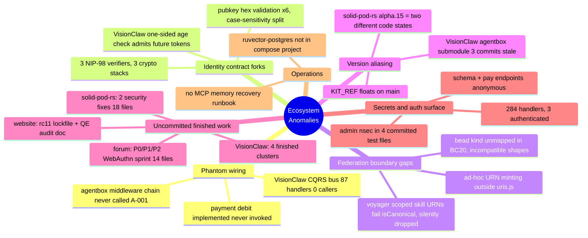

# Ecosystem Anomaly Register — 2026-06-09 Mega-Sprint

Queen synthesis of six cartography reports (build-with-quality Diagram-Driven Diagnosis,
ruflo mesh `swarm_1781038461338_ho3achb`). Source reports: `01`–`06` in this directory.
Prior-audit memory folded in: `security-audit-sovereign-mesh-2026-06`,
`visionclaw-production-audit-2026-05-28` (RuVector `patterns` namespace).

## Anomaly Themes

## Ranked Register

| # | Sev | Anomaly | Repo(s) | Evidence | Disposition |
|---|-----|---------|---------|----------|-------------|
| R-01 | P0 | Admin Nostr private key (`operator-jjohare`) committed in 4 test files; derives to live admin pubkey in `dreamlab.toml` | dreamlab-ai-website | report 05 §A1 | **Operator action**: rotate keypair on live infra. Sprint action: decouple test fixtures from live key |
| R-02 | P0 | Three independent NIP-98 verifiers on three crypto stacks; VisionClaw's (`src/utils/nip98.rs:234`) has one-sided age check → future-dated tokens accepted; no replay cache | visionclaw, solid-pod-rs, nostr-rust-forum | report 06 §A1, report 03 §2 | **Reconcile**: fix VisionClaw age check now (this sprint); extract shared crate as follow-on. Forum↔pod parity is an intentional wasm32 split (report 04), not a fork. **VC age check LANDED (b1023cbdd)**: symmetric ±tolerance window made explicit via dedicated `TokenFromFuture` error variant + two signed-token boundary tests; 19/19 nip98 tests green. Replay cache + shared `nostr-auth-kit` crate remain follow-on |
| R-03 | P0/CRITICAL | Adapter middleware chain (observability → privacy → JSON-LD) implemented + tested but `wrapDispatch` never called at any route site — all three documented guarantees are phantom | agentbox | report 02 §A-001, `management-api/adapters/index.js` | **Reconcile**: wire `wrapDispatch` at adapter resolution (this sprint) |
| R-04 | P0 | Sat-gating economically inert: WAC checks `payment_balance_sats` but `payments::debit()` is never called from `enforce_read`/`enforce_write` | solid-pod-rs | report 03 §5 | **Fix this sprint** with failing repro test first |
| R-05 | HIGH | Finished security work uncommitted in 3 repos: pod WAC over-inheritance + git read-auth bypass (18 files), forum WebAuthn P0/P1 sprint (14 files), VisionClaw OOM guard/CUDA/402 routes/ADR fixes | solid-pod-rs, nostr-rust-forum, visionclaw | reports 03 §6, 04 §6, 01 §4 | **Commit this sprint** (test-gated, separate commits per cluster) |
| R-06 | HIGH | 284 public handlers, 3 authenticated. Schema endpoints expose full OWL hierarchy anonymously; `pay_offers`/`pay_pool_get` unauthenticated; extractor already wired in AppState | visionclaw | report 01 §5-High | **Fix this sprint** (param-declaration pattern already proven in same files). **LANDED (426e934a0)**: `_auth: AuthenticatedUser` added to all 6 `schema_handler` fns; `extract_caller_pubkey` gate added to `pay_offers_handler` + `pay_pool_get_handler`. `cargo check --features solid-pod-embed` green. Remaining unauthenticated handlers (semantic/bots-viz/multi-mcp-ws) are follow-on |
| R-07 | HIGH | `bead` exists in both URN grammars but unmapped in BC20; agentbox beads not content-addressed vs VisionClaw `sha256-12` — beads silently dropped at federation boundary | agentbox ↔ visionclaw | report 06 §A3 | **Reconcile this sprint**: add bead to BC20 closed map (agentbox side) |
| R-08 | HIGH | Voyager scoped skill URNs (`mcp/voyager/verify-and-store.py:582`) carry an owner scope on a `ownerScope=false` kind → fail `isCanonical()` → BC20 silently drops every verified skill | agentbox | report 02 | **Fix this sprint** |
| R-09 | HIGH | `wrangler deploy` blocked: `REPLACE_WITH_NEW_ADMIN_KV_ID` placeholder in 2 wrangler.toml; `PRF_SERVER_SECRET` unvalidated → fresh deploys 500 on WebAuthn | dreamlab-ai-website | report 05 §A2 | KV ID is **operator data**; sprint adds startup validation + doc |
| R-10 | MED | `solid-pod-rs 0.4.0-alpha.15` aliases crates.io publish AND git HEAD `b81ce9f`; no git tag beyond alpha.11; forum hasn't absorbed NIP-98 minting changes | all consumers | report 06 §A4 | Tag + repin as follow-on; record in version-skew table |
| R-11 | MED | VisionClaw `agentbox` submodule pointer stale (11c8bc5d, 3 behind) and dirty | visionclaw | report 06 §A5 | **Bump after agentbox commits land** (this sprint, last step) |
| R-12 | MED | Dead code: `broadcast_actor.rs` (547 lines, never started) + `broadcast_messages.rs`; third URN validator in `visionclaw-xr-presence/src/types.rs` (room/avatar kinds unregistered in `src/uri/`) | visionclaw | report 01 | **Fix this sprint**: delete dead actor; register kinds |
| R-13 | MED | KIT_REF floats on `main` in 2 deploy workflows; `nostr-tools`/`ndk` in prod deps but test-only; CLOUDFLARE_WORKERS.md references deleted `community-forum-rs/` tree ×6 | dreamlab-ai-website | report 05 §A3-A5 | **Fix this sprint** |
| R-14 | MED | No operator recovery runbook for ruvector-postgres MCP memory failure; live incident today confirmed: container absent, not in compose project, bridge held stale fail state | agentbox | report 02 §6.3 + live incident | **Fix this sprint**: troubleshooting doc + compose note |
| R-15 | LOW | NIP-11 advertises NIP-17 without inbox routing; ad-hoc URN strings in `mcp/aci-shell/server.js`; BC20 drops logged to stderr only; pubkey-hex case split (2 of 6 sites accept mixed case) | forum, agentbox, all | reports 04, 02, 06 §A2 | Sprint where one-line; else follow-on. **forum: FIXED** — `nip11.rs` removes `17` from `supported_nips` (kept NIP-59 1059, which is implemented); verified no kind-14/kind-10050 inbox routing exists. Native `cargo check -p nostr-bbs-relay-worker` PASS. Committed on `main`. agentbox/case-split portions remain follow-on |

## Revert-vs-Reconcile (duplications)

| Duplication | Revert | Reconcile | Verdict |
|---|---|---|---|
| NIP-98 ×3 (pod `auth/nip98.rs`, forum `nip98.rs`, VC `utils/nip98.rs`) | n/a — all live | Shared crate (`nostr-auth-kit`), forum impl as seed (only one with replay cache) | **Reconcile**; interim: patch VC age check |
| pubkey-hex ×6 | n/a | One cased validator promoted; lowercase-only is the URN-layer law | **Reconcile** (follow-on) |
| URN tri-grammar (`urn:agentbox` / `urn:visionclaw` / `urn:ngm`) | — | BC20 is the sanctioned bridge; extend to `bead` | BC20/`bead`: **Reconcile**. `urn:ngm`: **Neither** — corrected to internal RDF graph vocabulary, orthogonal to the entity grammar (see Reconciliation Note → Finding 2). Not a legacy alias; not a revert candidate. |
| Forum↔pod NIP-98 parallel impls | — | — | **Neither**: intentional wasm32 platform split, documented (pod `Cargo.toml:121`) |
| VC CQRS bus (87 handlers, 0 callers) | Delete bus | Wire bus | Out of sprint scope; register only (already known from 05-28 audit) |

## Git Archaeology (key divergences)

- VC NIP-98 verifier divergence: introduced with `nostr_sdk`-based port; never absorbed forum's `abs_diff` age check or replay cache.
- BC20 bead gap: bridge written when only 3 kinds crossed the boundary; `bead` adapter slot added later without bridge update.
- alpha.15 aliasing: crates.io publish then continued commits (`0cf2d61`, `b81ce9f`) without version bump or tag.
- Middleware phantom: `wrapDispatch` landed with ADR-005 test suite; route integration step never executed — routes predate it and call adapters directly.

## Sprint Plan (Phase 3/4)

Fixers per repo, parallel, test-gated, committing as they go (no push):
1. **solid-pod-rs**: test-gate + commit dirty sprint; failing test → debit fix (R-04); NIP-98 URL-match note.
2. **nostr-rust-forum**: test-gate + commit WebAuthn sprint (R-05); NIP-17 claim fix (R-15).
3. **visionclaw**: commit finished clusters (R-05); handler auth (R-06); NIP-98 age check (R-02); dead actor deletion + URN kind registration (R-12).
4. **agentbox**: wire `wrapDispatch` (R-03); voyager skill URN fix (R-08); BC20 bead mapping (R-07); recovery runbook (R-14); aci-shell URNs (R-15).
5. **dreamlab-ai-website**: commit lockfile + QE doc; KIT_REF pin; dep hygiene; ghost-path doc fix (R-13); PRF_SERVER_SECRET validation (R-09); admin-key fixture decoupling note (R-01).
6. **meta**: bump agentbox submodule in VC after (4) lands (R-11).

Operator actions surfaced (cannot be done by agents): R-01 key rotation on live infra; R-09 real KV namespace ID; host-side: add ruvector-postgres to the agentbox compose project (currently a bare `docker run`).

## Sprint Status — dreamlab-ai-website fixer (2026-06-09)

Repo: `dreamlab-ai-website` @ branch `main` (committed, not pushed). Prior:
lockfile bump `3d008f4`, QE audit doc `35a55d9`.

| Item | Status | Commit | Notes |
|------|--------|--------|-------|
| R-13a | DONE | `5f1c580` | `KIT_REF` pinned to lockfile SHA `8d31f3a7…` in `deploy.yml` + `workers-deploy.yml`; clone switched to detached-SHA checkout. `rust-ci.yml` left floating (tests upstream HEAD by design). |
| R-13b | DONE | `fedc9ac` | `@nostr-dev-kit/ndk` moved to devDependencies (only repo reference was a prose mention; zero `src/` imports). `nostr-tools` already a devDep. |
| R-13c | DONE | `182cc23` | All 6 `community-forum-rs/` refs in `CLOUDFLARE_WORKERS.md` corrected to `kit/crates/nostr-bbs-*-worker/`. |
| R-09 | DONE (sprint part) | `a66c230` | New `forum-config::deploy_config` validator (placeholder scan + required-secret check) + CI test + `workers-deploy.yml` `wrangler secret list` gate + deployment-doc operator section. Real KV id + `PRF_SERVER_SECRET` remain **operator data**. |
| R-01 | DONE (sprint part) | `07ffb67` | Test fixtures in 4 files re-keyed to a throwaway keypair (`9ce0ddcb…`, ≠ live admin); SECURITY comments added. `dreamlab.toml` untouched; **live key rotation remains an operator action** (old key persists in git history), documented in `CLOUDFLARE_WORKERS.md` → Operator Actions. |

Tests: `cargo test -p dreamlab-forum-config` 25/25; vitest 51/51; clippy + fmt clean.

## Sprint Status — Queen final synthesis (2026-06-09, end of Phase 3)

All fixers complete. Per repo (all commits on `main`, none pushed):

| Repo | Landed | Commits |
|------|--------|---------|
| solid-pod-rs | R-04 debit wired into both `enforce_read` and `enforce_write`, fail-closed, +4 ledger tests (18/18 green); WAC/git-auth + sat-gating sprints were already committed pre-fixer (`75946cf`, `0cf2d61`) | `f7785d7` |
| nostr-rust-forum | R-15 forum portion: NIP-17 removed from relay-info `supported_nips` (NIP-59 kept — verified implemented); WebAuthn sprint pre-landed (`dcd6bed`) | `596f842` |
| visionclaw | R-02 `TokenFromFuture` variant + symmetric window tests (19/19); 402 pay surface committed cleanly apart from XR in-flight work; R-06 identity extractor on 6 schema + 2 pay read handlers; R-12 dead BroadcastActor deleted (−597 lines) + `room`/`avatar` kinds registered in `src/uri` (15/15); R-05 neutral clusters: stress-majorization OOM budget guard, CUDA adaptive-grid history depth | `b1023cbdd`, `b6283aaa7`, `426e934a0`, `88d2763db`, `29d550409`, `41caf3682` |
| agentbox | R-03 `wrapDispatch` wired at adapter resolution (all 3 middleware layers now live at every dispatch); R-07 `bead` in BC20 closed map + beads content-addressed (also fixes latent `MalformedUri` crash in both beads-adapter mint sites); R-08 voyager skill URNs unscoped (pass `isCanonical`); R-14 ruvector-postgres recovery runbook | `8088dc36`, `9da3a079`, `e413190f`, `bcc9119f` |
| dreamlab-ai-website | R-13a/b/c, R-09 sprint part, R-01 sprint part (see table above) | `5f1c580`, `fedc9ac`, `182cc23`, `a66c230`, `07ffb67` |

### Follow-on (next dedicated session)

1. **R-02 completion**: extract shared NIP-98 crate (`nostr-auth-kit`), forum impl as seed; add replay cache to VC verifier.
2. **R-10**: tag solid-pod-rs `b81ce9f` as a real version; repin forum off registry `alpha.15`.
3. **R-15 residue**: aci-shell URN delegation to `uris.js` is NOT one-line — `uris.mint()` makes `activity` content-addressed while code-as-harness documents readable `aci-<verb>-<id>` locals; needs an ADR-013 addendum decision first. Same tension exists in voyager `_emit_activity`. Pubkey-hex case unification (6 sites → 1 cased validator) also pending.
4. **A-004**: Prometheus counter for BC20 drops (stderr-only today).
5. ~~**VC CQRS bus** (87 handlers, 0 callers): delete-or-wire decision.~~ **WITHDRAWN** — the "0 callers" premise was false; handlers are dispatched at live routes/actors across every domain. See Reconciliation Note → Finding 1.
6. **xr-presence validators**: `RoomId`/`AvatarId` accept uppercase hex; converge on the lowercase-only URN-layer law once XR in-flight work lands (do not touch while in flight).

### Operator actions (cannot be performed by agents)

- R-01: rotate the live admin keypair (old key persists in git history even after fixture decoupling).
- R-09: provision the real admin KV namespace ID + `PRF_SERVER_SECRET` in Cloudflare.
- R-14: move ruvector-postgres from bare `docker run` into the compose project.
- R-11: after reviewing this sprint, push all five repos (nothing was pushed).
- **R-10** (alpha.15 aliasing — landed this session, see status block below): push
  solid-pod-rs `main` **and** the new annotated tag `v0.4.0-alpha.16`
  (`git push origin main --follow-tags`, or `git push origin v0.4.0-alpha.16`
  explicitly). Then, in nostr-rust-forum, run `cargo update -p solid-pod-rs`
  (resolves the git+tag pin now that the tag exists, regenerating the
  git-sourced Cargo.lock entry that was deliberately left at the alpha.15
  registry entry) and build. Finally, in agentbox, resolve the `lib.fakeHash`
  placeholder in `lib/solid-pod-rs.nix` via
  `./scripts/prefetch-hashes.sh --service solid-pod-rs` (the tarball hash could
  not be computed before the push). None of the three is buildable against the
  remote until the push completes — this is by design, not breakage.

## Reconciliation Note — CQRS bus & `urn:ngm` (2026-06-09, dedicated fixer)

A dedicated fixer session was tasked with executing the two deferred items
(follow-on #5 "delete the CQRS bus" and the Revert-vs-Reconcile `urn:ngm`
retirement, verdict "Both: retire as migration completes"). On exhaustive
verification **both items were found non-actionable as deletions/migrations**.
No code was changed; the verdicts are corrected here with evidence.

### Finding 1 — the CQRS application layer is NOT dead (audit "0 callers" was wrong)

The prior audits' "CQRS bus, 87 handlers, 0 callers" anomaly does not survive a
caller trace. There is no separate command/query *bus* object — the layer is
hexser `Directive`/`Query` handlers under `src/application/`, instantiated and
dispatched via `.handle(...)` at **live HTTP route handlers and actors** across
every domain:

| Domain | Live dispatch site (evidence) |
|---|---|
| graph (queries) | `src/handlers/api_handler/graph/mod.rs:156-163` (`get_graph_data/get_node_map/get_physics_state` → `.handle()`), `:299`, `:384`, `:527-528`; wired in `src/app_state.rs:683-698` (`GraphQueryHandlers`), consumed via `state.graph_query_handlers.*` |
| graph (shortest paths) | `src/actors/graph_state_actor.rs:1182`, `src/actors/semantic_processor_actor.rs:1765`, `src/handlers/semantic_handler.rs:182` |
| knowledge_graph | `src/handlers/graph_state_handler.rs:86-402` — `LoadGraph/AddNode/UpdateNode/RemoveNode/GetNode/AddEdge/UpdateEdge/BatchUpdatePositions/GetGraphStatistics` each `Handler::new(...).handle(...)` |
| ontology | `src/handlers/ontology_handler.rs` (20 `.handle()` dispatches), `src/handlers/api_handler/ontology/mod.rs:1026-1029` (`ListOwlClassesHandler.handle()`) |
| settings | `src/handlers/api_handler/mod.rs:39-42` (`LoadAllSettingsHandler::new(...).handle()`) |
| physics | `src/application/physics_service::PhysicsService` consumed by `src/handlers/physics_handler.rs:15`, `src/actors/event_coordination.rs:11` |

The actor message-passing path and the CQRS handler path **coexist by design**:
actors own the live simulation/broadcast loop; the hexser handlers are the
read/write façade the REST surface dispatches through (`execute_in_thread(move ||
handler.handle(...))`). The "0 callers" claim likely came from grepping for a
`CommandBus`/`QueryBus`/`dispatch` symbol that was never the chosen pattern —
there is no bus, so the symbol search returned empty and was misread as "no
callers". **Disposition: do NOT delete. Follow-on #5 is withdrawn.** The 88d2763db
BroadcastActor precedent does not apply — that actor had zero `::new()` sites;
these handlers have dozens of `.handle()` sites. If a leaner façade is wanted
later, it is a refactor (collapse handler-per-query into the services), not a
deletion, and must be driven by its own ADR.

### Finding 2 — every `urn:ngm` reference is load-bearing RDF vocabulary, not a migratable entity URN

The Revert-vs-Reconcile row scoped "~20 refs on VC main". That count was
`src/*.rs` only. The actual footprint spans two workspace crates and is the
**internal RDF named-graph + IRI vocabulary of the Oxigraph triplestore**, not a
set of stray legacy entity ids:

- Named-graph IRIs as typed constants (read+write, SPARQL `FROM`/`GRAPH`):
  `crates/visionclaw-adapters/src/oxigraph_ontology_repository.rs:46-53`
  (`GRAPH_ONTOLOGY`, `GRAPH_ONTOLOGY_INFERRED`, `GRAPH_KNOWLEDGE`, `GRAPH_AGENT`,
  `GRAPH_CACHE_SSSP`, `GRAPH_CACHE_APSP`),
  `crates/visionclaw-adapters/src/sparql_migrations.rs:44` (`GRAPH_MIGRATIONS`,
  ADR-101 D2), `crates/visionclaw-ontology/src/services/jsonld_ingest/triple_emitter.rs:50-53`.
- IRI minters for OWL class/property/axiom subjects (content-addressed for axioms):
  `oxigraph_ontology_repository.rs:106,116,132,1114,1135,1992,2399,2441`.
- Node/edge IRI minters + their read-side `STRSTARTS`/`strip_prefix` tolerance
  (round-trips persisted RDF subjects to `NodeId`):
  `src/adapters/oxigraph_graph_repository.rs:90,100,296,327,347,1016,1500`.
- Domain-root OWL class IRI mint + read tolerance:
  `src/services/github_sync_service.rs:664,1472`.
- JSON-LD `@id` scheme registry that **classifies `urn:ngm:` as a recognised
  IRI scheme** (`Graph`/`OwlClass`/`OwlProperty`/`Axiom`):
  `crates/visionclaw-ontology/src/services/jsonld_validator/iri.rs:107-113`;
  and the ingest validator that **explicitly accepts it as the *current* scheme**:
  `crates/visionclaw-ontology/src/services/jsonld_ingest/validator.rs:43,68-70`
  ("Accepts both legacy `urn:visionclaw:owl:class:` and **new** `urn:ngm:class:`").

The last point is decisive: in the ontology subsystem `urn:ngm:` is the **newer**
scheme and `urn:visionclaw:owl:class:` is the one being retired — so "migrating
`urn:ngm:` → `urn:visionclaw:`" would run the migration backwards.

There is also **no migration target** in the converged grammar. `src/uri/mod.rs`
`Kind` covers `concept/kg/bead/execution/group/room/avatar` — the
federation/entity-identity layer. It has no `node`, `edge`, `domain`, `graph`,
`class`, `property`, or `axiom` kind, because those are triplestore-internal RDF
IRIs, a disjoint concern. The two schemes are orthogonal by design, and the
parser's own negative tests assert the boundary:
`src/uri/mod.rs:647` (`parse("urn:ngm:node:42")` → `Err(NotVisionclaw)`),
`src/uri/mod.rs:682` (`cross_from_agentbox("urn:ngm:node:1")` → `None`). Those
tests are correct and must stay.

**Disposition: leave all `urn:ngm` references in place.** Read-side tolerance is
already present everywhere persisted data is loaded (`strip_prefix`/`STRSTARTS`/
the `iri.rs` scheme registry), so existing stored graphs deserialise correctly;
there is no write-side change to make because the write side already emits the
current internal vocabulary. The Revert-vs-Reconcile verdict is corrected from
"Both: retire `urn:ngm` as migration completes" to **"Neither — `urn:ngm:` is the
internal RDF graph vocabulary, orthogonal to the `urn:visionclaw:` entity grammar;
not a legacy alias of it."** If a true single-scheme convergence is ever wanted,
it is an ADR-scale data-migration project (rename every named graph + re-IRI every
stored subject + dual-read during cutover), not a find-replace, and the inverted
direction noted above must be resolved first (which of `urn:ngm:class:` vs
`urn:visionclaw:owl:class:` is canonical).

Both findings supersede follow-on #5 and the `urn:ngm` Revert-vs-Reconcile row.
Net code change this session: zero (verification-only). Scoped
`cargo check -p visionclaw-server --features solid-pod-embed` green at HEAD.

## Sprint Status — R-10 alpha.15 aliasing fixer (2026-06-09, follow-on session)

Follow-on #2 ("tag solid-pod-rs `b81ce9f` as a real version; repin forum off
registry `alpha.15`") executed. The tag was cut over the *current* solid-pod-rs
HEAD (`f7785d7`, which already carried the R-04 debit fix on top of `b81ce9f`)
via a version-bump commit, not over `b81ce9f` directly — `f7785d7` is the code
all consumers should converge on. All commits on `main`, nothing pushed.

| Repo | Item | Status | Commit / tag | Notes |
|------|------|--------|--------------|-------|
| solid-pod-rs | version bump 0.4.0-alpha.15 → alpha.16 | DONE | commit `6340a468`, annotated tag `v0.4.0-alpha.16` (object `20223fa`) | Workspace `version`, 7 member crates (via `version.workspace = true`), internal cross-crate path-dep pins, README/docs functional pins + per-crate Status headers, new CHANGELOG/RELEASE_NOTES alpha.16 entry. Cargo.lock is gitignored (library workspace), regenerated locally. `cargo check --workspace` green; wac filter 36 passed, payment filter 59 passed, debit filter 7 passed, 0 failed. First tag since `alpha.11`; cut to kill the aliasing. |
| nostr-rust-forum | repin off registry alpha.15 → git+tag | DONE | commit `b374317` | Workspace dep `solid-pod-rs` → `{ git = "https://github.com/DreamLab-AI/solid-pod-rs", tag = "v0.4.0-alpha.16", … }`; `deny.toml` comments refreshed (allow-git already present). Verified API-compatible via temporary local **path override** (NOT committed) + native `cargo check -p nostr-bbs-core` — green (solid-pod-rs 0.4.0-alpha.16, `core`). A `[patch]` was insufficient (cargo resolves the git tag before patching); wasm32 cross-check deferred to operator post-push. Cargo.lock left at the alpha.15 registry entry — regenerated by the operator's `cargo update -p solid-pod-rs`. |
| agentbox | repin `lib/solid-pod-rs.nix` onto alpha.16 | DONE | commit `2be8517f` | `version` → alpha.16, `rev` `b81ce9f` → `6340a468`, aliasing comment rewritten, vendored `solid-pod-rs.cargo-lock` 7 workspace versions → alpha.16 (version-only; closure unchanged). `srcHash` → `lib.fakeHash` placeholder (per troubleshooting.md) — the tarball hash cannot be computed before the operator pushes; `nix build` fails fast on the hash mismatch until resolved, rather than building stale alpha.15 code. Committed alongside, but NOT entangling, the repo's in-flight xr-runtime work (only the two solid-pod-rs files staged). |

**Disposition update for R-10**: from "Tag + repin as follow-on; record in
version-skew table" to **LANDED (this session)**, modulo the three operator
push/resolve actions now listed under "Operator actions" above. After those, the
version-skew matrix row for `solid-pod-rs 0.4.0-alpha.15` collapses: forum and
agentbox both build `v0.4.0-alpha.16` from the same git commit.

## Sprint Status — Forum system live-test (2026-06-09, Phase 5)

Live browser-sidecar testing of dreamlab-ai.com/community/ found the deployed
forum **backend-severed**: deploy.yml baked five branded custom-domain API
bases (relay./api./pods./search./preview.dreamlab-ai.com) into the client at
compile time, and none exist in DNS (apex is GitHub Pages). All five workers
are live and healthy on solitary-paper-764d.workers.dev with correct CORS for
the site origin; protocol-level validation from the page origin confirmed the
WebAuthn registration challenge (auth-worker 200) and relay REQ/EOSE with
NIP-42 AUTH (7 channel events). The window.__ENV__ runtime injection is dead
code in the deployed build — URLs are compile-time only.

Fixed: website 7096fea (API bases → workers.dev, dreamlab.toml pod URLs,
wrangler POD_BASE_URL mirrors, config-pin tests 25/25), b920bbf (sequence-
diagram cartography: docs/deployment/forum-flow-cartography.md with ranked
gap list). Gap remediation (static admin bootstrap, admin-source unification,
native-pod provisioning vars, fail-closed origin config, NIP-11 auth_required
truthfulness) delegated to the kit/consumer fixer. Operator: a Pages deploy +
worker redeploy after push activates the fix; custom-domain DNS provisioning
remains the documented end-state.
