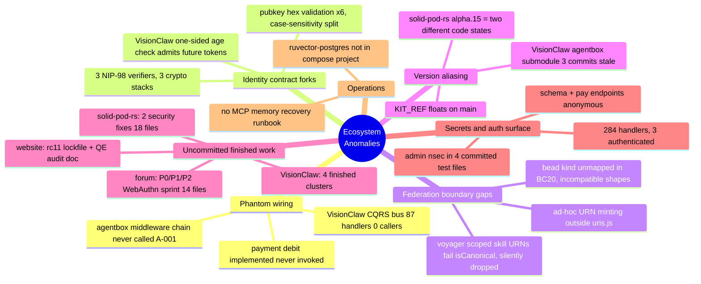

# Ecosystem Anomaly Register — 2026-06-09 Mega-Sprint

Queen synthesis of six cartography reports (build-with-quality Diagram-Driven Diagnosis,
ruflo mesh `swarm_1781038461338_ho3achb`). Source reports: `01`–`06` in this directory.
Prior-audit memory folded in: `security-audit-sovereign-mesh-2026-06`,
`visionclaw-production-audit-2026-05-28` (RuVector `patterns` namespace).

## Anomaly Themes

## Ranked Register

| # | Sev | Anomaly | Repo(s) | Evidence | Disposition |
|---|-----|---------|---------|----------|-------------|
| R-01 | P0 | Admin Nostr private key (`operator-jjohare`) committed in 4 test files; derives to live admin pubkey in `dreamlab.toml` | dreamlab-ai-website | report 05 §A1 | **Operator action**: rotate keypair on live infra. Sprint action: decouple test fixtures from live key |
| R-02 | P0 | Three independent NIP-98 verifiers on three crypto stacks; VisionClaw's (`src/utils/nip98.rs:234`) has one-sided age check → future-dated tokens accepted; no replay cache | visionclaw, solid-pod-rs, nostr-rust-forum | report 06 §A1, report 03 §2 | **Reconcile**: fix VisionClaw age check now (this sprint); extract shared crate as follow-on. Forum↔pod parity is an intentional wasm32 split (report 04), not a fork. **VC age check LANDED (b1023cbdd)**: symmetric ±tolerance window made explicit via dedicated `TokenFromFuture` error variant + two signed-token boundary tests; 19/19 nip98 tests green. Replay cache + shared `nostr-auth-kit` crate remain follow-on |
| R-03 | P0/CRITICAL | Adapter middleware chain (observability → privacy → JSON-LD) implemented + tested but `wrapDispatch` never called at any route site — all three documented guarantees are phantom | agentbox | report 02 §A-001, `management-api/adapters/index.js` | **Reconcile**: wire `wrapDispatch` at adapter resolution (this sprint) |
| R-04 | P0 | Sat-gating economically inert: WAC checks `payment_balance_sats` but `payments::debit()` is never called from `enforce_read`/`enforce_write` | solid-pod-rs | report 03 §5 | **Fix this sprint** with failing repro test first |
| R-05 | HIGH | Finished security work uncommitted in 3 repos: pod WAC over-inheritance + git read-auth bypass (18 files), forum WebAuthn P0/P1 sprint (14 files), VisionClaw OOM guard/CUDA/402 routes/ADR fixes | solid-pod-rs, nostr-rust-forum, visionclaw | reports 03 §6, 04 §6, 01 §4 | **Commit this sprint** (test-gated, separate commits per cluster) |
| R-06 | HIGH | 284 public handlers, 3 authenticated. Schema endpoints expose full OWL hierarchy anonymously; `pay_offers`/`pay_pool_get` unauthenticated; extractor already wired in AppState | visionclaw | report 01 §5-High | **Fix this sprint** (param-declaration pattern already proven in same files). **LANDED (426e934a0)**: `_auth: AuthenticatedUser` added to all 6 `schema_handler` fns; `extract_caller_pubkey` gate added to `pay_offers_handler` + `pay_pool_get_handler`. `cargo check --features solid-pod-embed` green. Remaining unauthenticated handlers (semantic/bots-viz/multi-mcp-ws) are follow-on |
| R-07 | HIGH | `bead` exists in both URN grammars but unmapped in BC20; agentbox beads not content-addressed vs VisionClaw `sha256-12` — beads silently dropped at federation boundary | agentbox ↔ visionclaw | report 06 §A3 | **Reconcile this sprint**: add bead to BC20 closed map (agentbox side) |
| R-08 | HIGH | Voyager scoped skill URNs (`mcp/voyager/verify-and-store.py:582`) carry an owner scope on a `ownerScope=false` kind → fail `isCanonical()` → BC20 silently drops every verified skill | agentbox | report 02 | **Fix this sprint** |
| R-09 | HIGH | `wrangler deploy` blocked: `REPLACE_WITH_NEW_ADMIN_KV_ID` placeholder in 2 wrangler.toml; `PRF_SERVER_SECRET` unvalidated → fresh deploys 500 on WebAuthn | dreamlab-ai-website | report 05 §A2 | KV ID is **operator data**; sprint adds startup validation + doc |
| R-10 | MED | `solid-pod-rs 0.4.0-alpha.15` aliases crates.io publish AND git HEAD `b81ce9f`; no git tag beyond alpha.11; forum hasn't absorbed NIP-98 minting changes | all consumers | report 06 §A4 | Tag + repin as follow-on; record in version-skew table |
| R-11 | MED | VisionClaw `agentbox` submodule pointer stale (11c8bc5d, 3 behind) and dirty | visionclaw | report 06 §A5 | **Bump after agentbox commits land** (this sprint, last step) |
| R-12 | MED | Dead code: `broadcast_actor.rs` (547 lines, never started) + `broadcast_messages.rs`; third URN validator in `visionclaw-xr-presence/src/types.rs` (room/avatar kinds unregistered in `src/uri/`) | visionclaw | report 01 | **Fix this sprint**: delete dead actor; register kinds |
| R-13 | MED | KIT_REF floats on `main` in 2 deploy workflows; `nostr-tools`/`ndk` in prod deps but test-only; CLOUDFLARE_WORKERS.md references deleted `community-forum-rs/` tree ×6 | dreamlab-ai-website | report 05 §A3-A5 | **Fix this sprint** |
| R-14 | MED | No operator recovery runbook for ruvector-postgres MCP memory failure; live incident today confirmed: container absent, not in compose project, bridge held stale fail state | agentbox | report 02 §6.3 + live incident | **Fix this sprint**: troubleshooting doc + compose note |
| R-15 | LOW | NIP-11 advertises NIP-17 without inbox routing; ad-hoc URN strings in `mcp/aci-shell/server.js`; BC20 drops logged to stderr only; pubkey-hex case split (2 of 6 sites accept mixed case) | forum, agentbox, all | reports 04, 02, 06 §A2 | Sprint where one-line; else follow-on. **forum: FIXED** — `nip11.rs` removes `17` from `supported_nips` (kept NIP-59 1059, which is implemented); verified no kind-14/kind-10050 inbox routing exists. Native `cargo check -p nostr-bbs-relay-worker` PASS. Committed on `main`. agentbox/case-split portions remain follow-on |

## Revert-vs-Reconcile (duplications)

| Duplication | Revert | Reconcile | Verdict |
|---|---|---|---|
| NIP-98 ×3 (pod `auth/nip98.rs`, forum `nip98.rs`, VC `utils/nip98.rs`) | n/a — all live | Shared crate (`nostr-auth-kit`), forum impl as seed (only one with replay cache) | **Reconcile**; interim: patch VC age check |
| pubkey-hex ×6 | n/a | One cased validator promoted; lowercase-only is the URN-layer law | **Reconcile** (follow-on) |
| URN tri-grammar (`urn:agentbox` / `urn:visionclaw` / legacy `urn:ngm` 20 refs on VC main) | Legacy `urn:ngm` refs are revert candidates post-migration | BC20 is the sanctioned bridge; extend to `bead` | **Both**: extend BC20 now, retire `urn:ngm` as migration completes |
| Forum↔pod NIP-98 parallel impls | — | — | **Neither**: intentional wasm32 platform split, documented (pod `Cargo.toml:121`) |
| VC CQRS bus (87 handlers, 0 callers) | Delete bus | Wire bus | Out of sprint scope; register only (already known from 05-28 audit) |

## Git Archaeology (key divergences)

- VC NIP-98 verifier divergence: introduced with `nostr_sdk`-based port; never absorbed forum's `abs_diff` age check or replay cache.
- BC20 bead gap: bridge written when only 3 kinds crossed the boundary; `bead` adapter slot added later without bridge update.
- alpha.15 aliasing: crates.io publish then continued commits (`0cf2d61`, `b81ce9f`) without version bump or tag.
- Middleware phantom: `wrapDispatch` landed with ADR-005 test suite; route integration step never executed — routes predate it and call adapters directly.

## Sprint Plan (Phase 3/4)

Fixers per repo, parallel, test-gated, committing as they go (no push):
1. **solid-pod-rs**: test-gate + commit dirty sprint; failing test → debit fix (R-04); NIP-98 URL-match note.
2. **nostr-rust-forum**: test-gate + commit WebAuthn sprint (R-05); NIP-17 claim fix (R-15).
3. **visionclaw**: commit finished clusters (R-05); handler auth (R-06); NIP-98 age check (R-02); dead actor deletion + URN kind registration (R-12).
4. **agentbox**: wire `wrapDispatch` (R-03); voyager skill URN fix (R-08); BC20 bead mapping (R-07); recovery runbook (R-14); aci-shell URNs (R-15).
5. **dreamlab-ai-website**: commit lockfile + QE doc; KIT_REF pin; dep hygiene; ghost-path doc fix (R-13); PRF_SERVER_SECRET validation (R-09); admin-key fixture decoupling note (R-01).
6. **meta**: bump agentbox submodule in VC after (4) lands (R-11).

Operator actions surfaced (cannot be done by agents): R-01 key rotation on live infra; R-09 real KV namespace ID; host-side: add ruvector-postgres to the agentbox compose project (currently a bare `docker run`).

## Sprint Status — dreamlab-ai-website fixer (2026-06-09)

Repo: `dreamlab-ai-website` @ branch `main` (committed, not pushed). Prior:
lockfile bump `3d008f4`, QE audit doc `35a55d9`.

| Item | Status | Commit | Notes |
|------|--------|--------|-------|
| R-13a | DONE | `5f1c580` | `KIT_REF` pinned to lockfile SHA `8d31f3a7…` in `deploy.yml` + `workers-deploy.yml`; clone switched to detached-SHA checkout. `rust-ci.yml` left floating (tests upstream HEAD by design). |
| R-13b | DONE | `fedc9ac` | `@nostr-dev-kit/ndk` moved to devDependencies (only repo reference was a prose mention; zero `src/` imports). `nostr-tools` already a devDep. |
| R-13c | DONE | `182cc23` | All 6 `community-forum-rs/` refs in `CLOUDFLARE_WORKERS.md` corrected to `kit/crates/nostr-bbs-*-worker/`. |
| R-09 | DONE (sprint part) | `a66c230` | New `forum-config::deploy_config` validator (placeholder scan + required-secret check) + CI test + `workers-deploy.yml` `wrangler secret list` gate + deployment-doc operator section. Real KV id + `PRF_SERVER_SECRET` remain **operator data**. |
| R-01 | DONE (sprint part) | `07ffb67` | Test fixtures in 4 files re-keyed to a throwaway keypair (`9ce0ddcb…`, ≠ live admin); SECURITY comments added. `dreamlab.toml` untouched; **live key rotation remains an operator action** (old key persists in git history), documented in `CLOUDFLARE_WORKERS.md` → Operator Actions. |

Tests: `cargo test -p dreamlab-forum-config` 25/25; vitest 51/51; clippy + fmt clean.

## Sprint Status — Queen final synthesis (2026-06-09, end of Phase 3)

All fixers complete. Per repo (all commits on `main`, none pushed):

| Repo | Landed | Commits |
|------|--------|---------|
| solid-pod-rs | R-04 debit wired into both `enforce_read` and `enforce_write`, fail-closed, +4 ledger tests (18/18 green); WAC/git-auth + sat-gating sprints were already committed pre-fixer (`75946cf`, `0cf2d61`) | `f7785d7` |
| nostr-rust-forum | R-15 forum portion: NIP-17 removed from relay-info `supported_nips` (NIP-59 kept — verified implemented); WebAuthn sprint pre-landed (`dcd6bed`) | `596f842` |
| visionclaw | R-02 `TokenFromFuture` variant + symmetric window tests (19/19); 402 pay surface committed cleanly apart from XR in-flight work; R-06 identity extractor on 6 schema + 2 pay read handlers; R-12 dead BroadcastActor deleted (−597 lines) + `room`/`avatar` kinds registered in `src/uri` (15/15); R-05 neutral clusters: stress-majorization OOM budget guard, CUDA adaptive-grid history depth | `b1023cbdd`, `b6283aaa7`, `426e934a0`, `88d2763db`, `29d550409`, `41caf3682` |
| agentbox | R-03 `wrapDispatch` wired at adapter resolution (all 3 middleware layers now live at every dispatch); R-07 `bead` in BC20 closed map + beads content-addressed (also fixes latent `MalformedUri` crash in both beads-adapter mint sites); R-08 voyager skill URNs unscoped (pass `isCanonical`); R-14 ruvector-postgres recovery runbook | `8088dc36`, `9da3a079`, `e413190f`, `bcc9119f` |
| dreamlab-ai-website | R-13a/b/c, R-09 sprint part, R-01 sprint part (see table above) | `5f1c580`, `fedc9ac`, `182cc23`, `a66c230`, `07ffb67` |

### Follow-on (next dedicated session)

1. **R-02 completion**: extract shared NIP-98 crate (`nostr-auth-kit`), forum impl as seed; add replay cache to VC verifier.
2. **R-10**: tag solid-pod-rs `b81ce9f` as a real version; repin forum off registry `alpha.15`.
3. **R-15 residue**: aci-shell URN delegation to `uris.js` is NOT one-line — `uris.mint()` makes `activity` content-addressed while code-as-harness documents readable `aci-<verb>-<id>` locals; needs an ADR-013 addendum decision first. Same tension exists in voyager `_emit_activity`. Pubkey-hex case unification (6 sites → 1 cased validator) also pending.
4. **A-004**: Prometheus counter for BC20 drops (stderr-only today).
5. **VC CQRS bus** (87 handlers, 0 callers): delete-or-wire decision.
6. **xr-presence validators**: `RoomId`/`AvatarId` accept uppercase hex; converge on the lowercase-only URN-layer law once XR in-flight work lands (do not touch while in flight).

### Operator actions (cannot be performed by agents)

- R-01: rotate the live admin keypair (old key persists in git history even after fixture decoupling).
- R-09: provision the real admin KV namespace ID + `PRF_SERVER_SECRET` in Cloudflare.
- R-14: move ruvector-postgres from bare `docker run` into the compose project.
- R-11: after reviewing this sprint, push all five repos (nothing was pushed).
