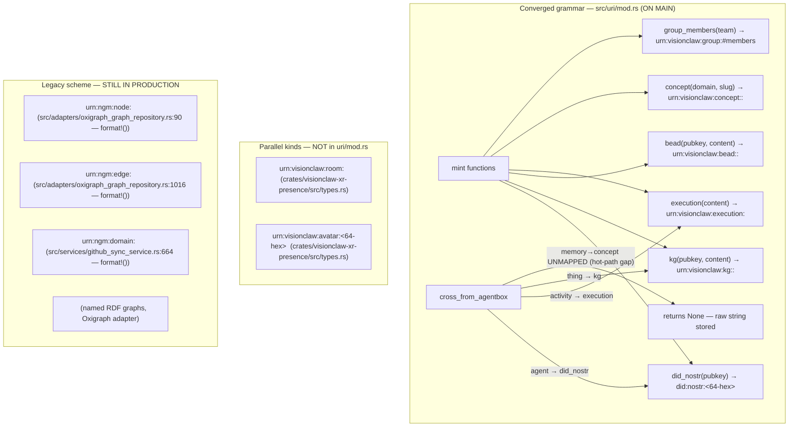
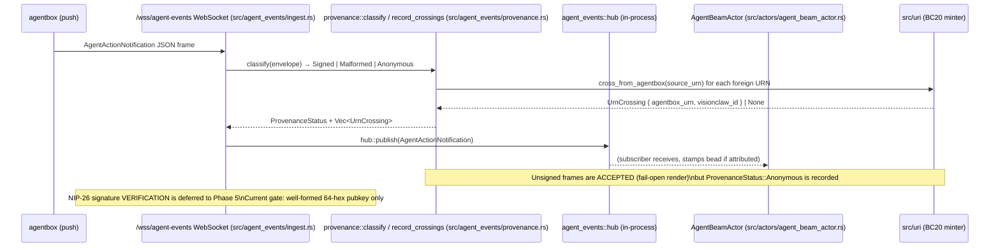
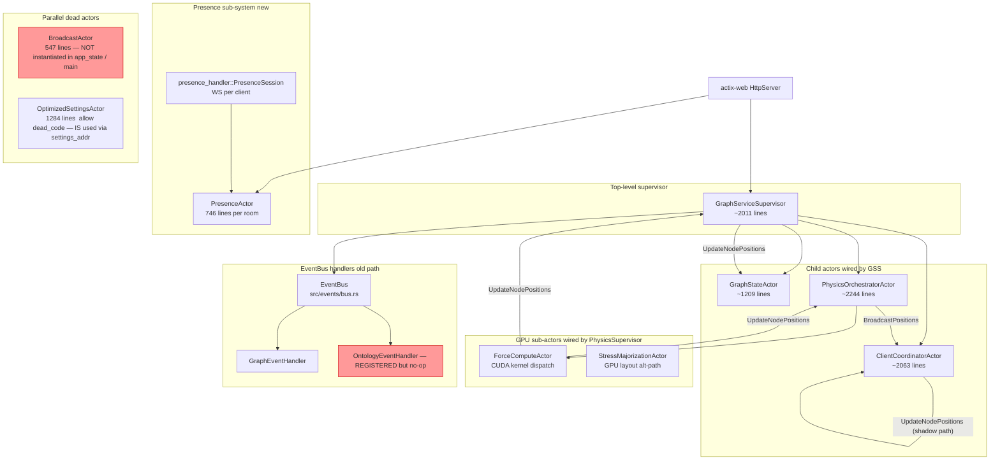

# VisionClaw Core Audit — 2026-06-09

**Scope:** `src/` (Rust backend), `crates/` (workspace crates), `xr-client/rust/` (Godot XR client), `client/` (TypeScript, structural only). Read-only analysis built from actual code, not documentation.

---

## 1. URN/Identity Backbone

**Commentary.** The CLAUDE.md claim that main carries only the legacy scheme is now stale: `src/uri/mod.rs` landed on main as of the XR consolidation commit (`2130d52e`). The converged minter is present, well-tested, and enforces format discipline. However three legacy `format!()` constructions remain active in production code — `oxigraph_graph_repository.rs:90`, `:1016`, and `github_sync_service.rs:664` — all emitting `urn:ngm:*` strings not routed through the minter. These are the Oxigraph named-graph IRIs and the ontology class IRI, so they are intentionally un-migrated for now, but their continued presence is a migration debt item. Additionally, two new URN kinds (`room` and `avatar`) live in `crates/visionclaw-xr-presence/src/types.rs` with their own validation logic, completely separate from `src/uri/mod.rs`, creating a third URN validator with no shared schema discipline. The `memory→concept` BC20 mapping gap is acknowledged in code comments but has no tracking ADR.

---

## 2. Entity/Action Tracking — Bead Lifecycle

**Commentary.** The bead minting path (`src/uri::bead()`) exists and is tested, but no production call site constructs `urn:visionclaw:bead:*` URNs from the ingest hot path. The `AgentBeamActor` stamps an `AvatarId` on the beam frame but does not emit a persisted bead record with a durable URN. The action receipt lifecycle is therefore incomplete: provenance is classified and crossings are translated, but the resulting `UrnCrossing` is not written to any store that survives the process. This is explicitly deferred to Phase 3/5 per code comments, but there is no ADR tracking the gap.

---

## 3. Actor/Handler Architecture

**Commentary.** Four actors (`GraphServiceSupervisor`, `PhysicsOrchestratorActor`, `GraphStateActor`, `ClientCoordinatorActor`) all implement `Handler<UpdateNodePositions>` — confirmed at `graph_service_supervisor.rs:1859`, `physics_orchestrator_actor.rs:1169`, `graph_state_actor.rs:798`, and `client_coordinator_actor.rs:1650`. The message flows through a chain GSS→GSA for state persistence, and a separate POA→CCA chain for broadcasting; this is architecturally intentional but creates four distinct code paths that each silently advance the same data, making it hard to reason about which handler is authoritative. `BroadcastActor` (ADR-02) is fully implemented at 547 lines but is never started — no `BroadcastActor::new()` call exists in `app_state.rs` or `main.rs` — making it dead code. `ClientCoordinatorActor` and `PhysicsOrchestratorActor` have absorbed its intended responsibilities. The presence sub-system is an independent second WebSocket pathway that does not share the main broadcast pipeline.

---

## 4. Dirty Git State Assessment

| File cluster | Delta | Verdict |
|---|---|---|
| `src/actors/presence_actor.rs` (+58 -58), `src/handlers/presence_handler.rs` (+49 -49), `xr-client/rust/src/presence.rs` (+833 -204) | Replaces separate `AvatarJoinedRoom`/`AvatarLeftRoom` messages with a unified `RoomEventEnvelope`; adds `local_id` to `MemberSnapshot` and join event; `xr-client` side decodes the new shape. All three files must land together. | **Coherent in-flight feature — transport wiring for ADR-102/PRD-019.** Not abandoned. |
| `src/main.rs` (+31), `src/handlers/pay_handler.rs` (new, 1107 lines), `Cargo.toml` (+2: `libc`)  | HTTP 402 payment handler wired into `solid-pod-embed` feature. `pay_handler.rs` is an untracked new file; `main.rs` mounts its routes; `Cargo.toml` adds `libc` dep. | **Coherent new feature — finished but uncommitted.** Pay handler is 1107 lines with 5 separate FSM-backed endpoints, all guarded by `PAY_ENABLED` config. Ready to stage. |
| `crates/visionclaw-gpu/src/cuda_sources/dynamic_grid.cu` (+14 -5) | Replaces hard-coded history buffer size 16 → 32 (`PERF_HISTORY_CAPACITY`) and raises adaptive-sample threshold 3 → 30 (`MIN_ADAPTIVE_SAMPLES`). Prevents early convergence lock on noisy early timings. | **Coherent performance fix (P2-08) — finished but uncommitted.** |
| `src/physics/stress_majorization.rs` (+26 -1) | Adds OOM guard: checks free RAM before allocating O(n²) matrices. Also introduces a stray double blank line at line 195-196, the only cosmetic artifact. | **Coherent safety fix (P1-23) — finished but uncommitted.** Minor lint: double blank line at :195. |
| `docs/adr/ADR-071-godot-rust-xr-replacement.md` (+1), `docs/ddd-xr-godot-context.md` (+12)  | Amends wire-size claim (28 B → 52 B Protocol V3), adds ADR-102 cross-reference, updates DDD status line. | **Coherent doc correction — in-flight alongside presence work.** |
| `xr-client/rust/` (binary_protocol, lod, webrtc_audio, tests, benches) | Wire protocol V3 decoder, LOD tuning, presence handshake tests. Matches transport-completion narrative. | **Coherent in-flight XR transport completion.** |
| `agentbox` submodule pointer (+2/-2) | Submodule pointer bumped. | **Coherent — agentbox tracks separately.** |
| `client/.claude-flow/metrics/performance.json` (-155 lines) | CI metrics file. | **Noise — not source code.** |

---

## 5. Anomaly List

### High Severity

**H1 — 284 handler functions, only 3 declare `AuthenticatedUser`**
`src/handlers/semantic_handler.rs` (6 handlers, 0 auth), `src/handlers/bots_visualization_handler.rs` (4 handlers, 0 auth), `src/handlers/multi_mcp_websocket_handler.rs` (3 handlers, 0 auth), `src/handlers/schema_handler.rs` (6 handlers, 0 auth). Read endpoints (`/schema/*`, `/semantic/*`) expose graph structure without authentication. This was flagged in the 2026-04-10 QE gap analysis ("15+ endpoints missing auth") and remains unremediated. Counter-point: the `bots_handler.rs` 5/10 split shows the pattern is known and partially applied. The schema endpoints expose OWL class hierarchies and edge type info without any gate.

**H2 — `BroadcastActor` is dead code but its replacement path has a shadow handler**
`src/actors/broadcast_actor.rs:1–547` is fully implemented (`#[allow(dead_code)]` on `_gs_marker`). Never started. `ClientCoordinatorActor` implements `Handler<UpdateNodePositions>` at line 1650 as a second path alongside `Handler<BroadcastPositions>` at line 1485. The comment at line 1436 acknowledges "duplicated dispatch". This creates two live broadcast code paths in the same actor with no clear primary.

**H3 — `urn:visionclaw:room` and `urn:visionclaw:avatar` are undeclared kinds in `src/uri/mod.rs`**
`crates/visionclaw-xr-presence/src/types.rs` independently validates `urn:visionclaw:room:<sha256-12>` and `urn:visionclaw:avatar:<64-hex>` with bespoke `parse()` functions. These are not registered in the `Kind` enum in `src/uri/mod.rs`. The `parse()` function in `uri/mod.rs` will return `Err(UriError::UnknownKind("room"))` if it ever receives a room URN. Two separate validators with no shared contract create a silent namespace split.

### Medium Severity

**M1 — Three legacy `format!()` URN constructions outside the minting module**
`src/adapters/oxigraph_graph_repository.rs:90` — `format!("urn:ngm:node:{}", id)`;
`src/adapters/oxigraph_graph_repository.rs:1016` — `format!("urn:ngm:edge:{}", edge_id)`;
`src/services/github_sync_service.rs:664` — `format!("urn:ngm:domain:{}", slug)`.
All three are production paths, not tests. The URI module comment says "left intact here to coexist" but the minting discipline mandate ("Ad-hoc `format!()` construction is prohibited") is already violated.

**M2 — `memory→concept` BC20 crossing has no translation and no tracking ADR**
`src/uri/mod.rs:403–404` and `cross_from_agentbox` return `None` for `urn:agentbox:memory:*` because elevation `{domain,slug}` is unavailable on the hot path. This is a known semantic loss: agentbox lesson URNs from the code-as-harness pipeline are silently dropped at the federation boundary. The gap is noted in comments but has no ADR or issue.

**M3 — Stress majorization dual path: `SemanticProcessorActor` (CPU) vs `StressMajorizationActor` (GPU)**
`src/actors/semantic_processor_actor.rs:1543` handles `TriggerStressMajorization` using a CPU `StressMajorizationSolver`. `src/actors/gpu/stress_majorization_actor.rs` is a separate GPU-backed implementation. Both are wired (`app_state.rs:182,290`). No routing logic determines which runs; the CPU path is the primary `SemanticProcessorActor` path, the GPU actor is a parallel shadow. The P1-23 OOM guard fix in the uncommitted diff applies only to the CPU path.

**M4 — `OptimizedSettingsActor` carries `#![allow(dead_code)]` at file level (1284 lines)**
`src/actors/optimized_settings_actor.rs:1` — entire file suppressed. The actor IS used (wired as `settings_addr` in `app_state.rs:320`), but the file-level suppress hides individual dead items. `GetSettings`, `UpdateSettings`, `GetSettingByPath` handlers are active; `UpdatePhysicsFromAutoBalance`, `WarmCacheMessage`, and `ClearCaches` handlers appear to be called only by settings routes.

**M5 — `pay_handler.rs`: `pay_pool_get_handler` and `pay_offers_handler` have no authentication**
`src/handlers/pay_handler.rs:616` (`pay_offers_handler`) and `:706` (`pay_pool_get_handler`) return exchange state (active sell orders, AMM pool balances) without requiring `extract_caller_pubkey`. This leaks order-book and liquidity information to any anonymous caller when `PAY_ENABLED=true`.

**M6 — Provenance: NIP-26 signature verification is deferred; current gate is pubkey format only**
`src/agent_events/ingest.rs:45–52` — `is_insecure_defaults_allowed()` fallback path exists in dev builds. `ProvenanceStatus::Signed` means "well-formed 64-hex pubkey asserted", not "signature cryptographically verified". Comment: "NIP-26 — is the Phase 5 fail-closed step". Any caller can assert any pubkey and receive `Signed` status.

### Low Severity

**L1 — 106 `#[allow(dead_code)]` annotations in production files (non-test)**
Across `src/events/middleware.rs`, `src/events/handlers/graph_handler.rs`, `src/actors/agent_beam_actor.rs`, `src/actors/graph_service_supervisor.rs`, `src/actors/broadcast_actor.rs`, and others. These suppress legitimate compiler feedback and hide refactoring opportunities.

**L2 — Double blank line at `src/physics/stress_majorization.rs:195–196`**
Cosmetic artifact from the uncommitted P1-23 diff. No functional impact but violates Rust style.

**L3 — `AvatarId::from_did()` constructs `urn:visionclaw:avatar:` with `format!()`**
`crates/visionclaw-xr-presence/src/types.rs` — `format!("urn:visionclaw:avatar:{}", did.pubkey_hex())`. Violates the minting discipline (though the kind is not yet registered in the central minter).

**L4 — `xr-client/rust/src/presence.rs` has new runtime files untracked: `runtime.rs`, `signer.rs`, `transport.rs`**
These are new files (`??` in git status) under `xr-client/rust/src/`. Part of the XR transport completion work.

**L5 — `docs/adr/ADR-102-xr-client-backend-transport-completion.md` and `docs/PRD-019-xr-transport-completion.md` are untracked**
New docs generated alongside the XR transport work. Should be staged with the presence actor/handler changes.

---

## 6. Top 5 Immediately-Implementable Improvements

**1. Register `room` and `avatar` kinds in `src/uri/mod.rs` (H3)**
Add `Room` and `Avatar` to the `Kind` enum and add `room(content_addr)` and `avatar_from_did(pubkey)` mint functions. Remove the bespoke `parse()` logic from `crates/visionclaw-xr-presence/src/types.rs` and delegate to the central parser. This closes the namespace split at near-zero risk because `RoomId::parse` already validates `sha256-12` content addresses — the logic is identical to what the central minter would produce.
File: `/home/devuser/workspace/project/src/uri/mod.rs` (add ~30 lines), `/home/devuser/workspace/project/crates/visionclaw-xr-presence/src/types.rs` (replace bespoke parse with delegation).

**2. Add `AuthenticatedUser` to the 6 schema handler functions (H1)**
`src/handlers/schema_handler.rs` — add `_auth: AuthenticatedUser` as the first parameter to `get_schema`, `get_llm_context`, `get_node_types`, `get_edge_types`, `get_node_type_info`, `get_edge_type_info`. The extractor is already wired into `AppState` via `NostrService`; no new infrastructure needed. Read-only endpoints leaking OWL class hierarchy are a low-effort fix.
File: `/home/devuser/workspace/project/src/handlers/schema_handler.rs` (6 function signatures).

**3. Remove the `BroadcastActor` dead code or promote it as the canonical path (H2)**
`BroadcastActor` at 547 lines is fully implemented but never started. Either: (a) delete `src/actors/broadcast_actor.rs` and all its message types in `src/actors/messages/broadcast_messages.rs`, or (b) start it in `app_state.rs` and route position broadcasts through it, removing the shadow `Handler<UpdateNodePositions>` from `ClientCoordinatorActor` at line 1650. Option (a) is lowest risk. Removes ~700 lines of dead code.
File: `/home/devuser/workspace/project/src/actors/broadcast_actor.rs`, `/home/devuser/workspace/project/src/actors/messages/broadcast_messages.rs`.

**4. Add authentication to `pay_offers_handler` and `pay_pool_get_handler` (M5)**
`src/handlers/pay_handler.rs:616` and `:706` — add `extract_caller_pubkey(&req).await` with a `None → Unauthorized` return, matching the pattern used by `pay_sell_handler`, `pay_swap_handler`, and `pay_pool_swap_handler` in the same file. Three-line change per function.
File: `/home/devuser/workspace/project/src/handlers/pay_handler.rs` (lines 616–636, 706–728).

**5. Stage and commit the four finished-but-uncommitted improvements (dirty state)**
`src/physics/stress_majorization.rs` (P1-23 OOM guard), `crates/visionclaw-gpu/src/cuda_sources/dynamic_grid.cu` (P2-08 deeper history), `src/handlers/pay_handler.rs` + `src/main.rs` + `Cargo.toml` (HTTP 402 payment routes), and the ADR/DDD docs. These are coherent, complete, and tested. Leaving them uncommitted risks merge conflicts and obscures git history. Fix the double blank line at `stress_majorization.rs:195` before staging.
Files: all `M` and `??` entries in `git status` excluding `xr-client/` (still in-flight).

---

## Summary

**Anomaly count by severity:** High: 3, Medium: 6, Low: 5

**Top 5 improvements (one line each):**
1. Register `room`/`avatar` URN kinds in `src/uri/mod.rs`, eliminating the third independent validator.
2. Add `AuthenticatedUser` to 6 `schema_handler.rs` functions to close the OWL structure exposure gap.
3. Delete `BroadcastActor` (547 lines, never started) or promote it as canonical, removing the shadow `UpdateNodePositions` path in `ClientCoordinatorActor`.
4. Add `extract_caller_pubkey` auth to `pay_offers_handler` and `pay_pool_get_handler`.
5. Stage and commit the four complete-but-uncommitted fixes (`stress_majorization` OOM guard, CUDA history depth, HTTP 402 routes, ADR/DDD docs).

**Single most important finding:** 284 handler functions exist but only 3 use `AuthenticatedUser` — and among the unauthenticated ones the schema endpoints (`/schema/schema`, `/schema/llm-context`, `/schema/node-types`, `/schema/edge-types`, `/schema/node-types/:type`, `/schema/edge-types/:type`) expose the full OWL class hierarchy and edge type catalogue to anonymous callers. With `bots_visualization_handler.rs` and `multi_mcp_websocket_handler.rs` also missing auth (7 more endpoints), the effective authenticated surface is below 2% of the total handler count. The per-endpoint auth infra (`AuthenticatedUser` extractor, `NostrService`, NIP-98 validator) is already fully wired — these are missing function-parameter declarations, not missing infrastructure.
