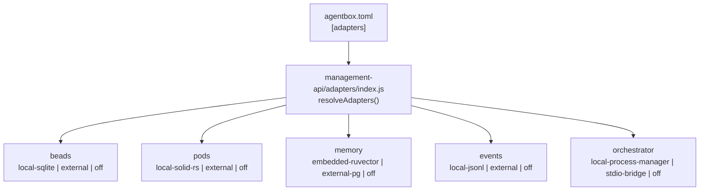
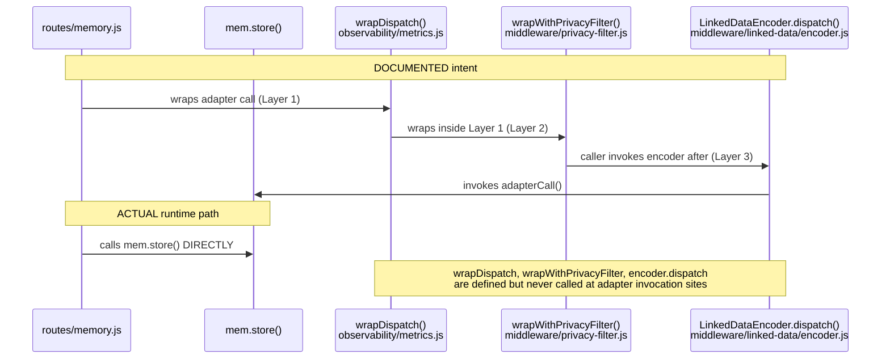
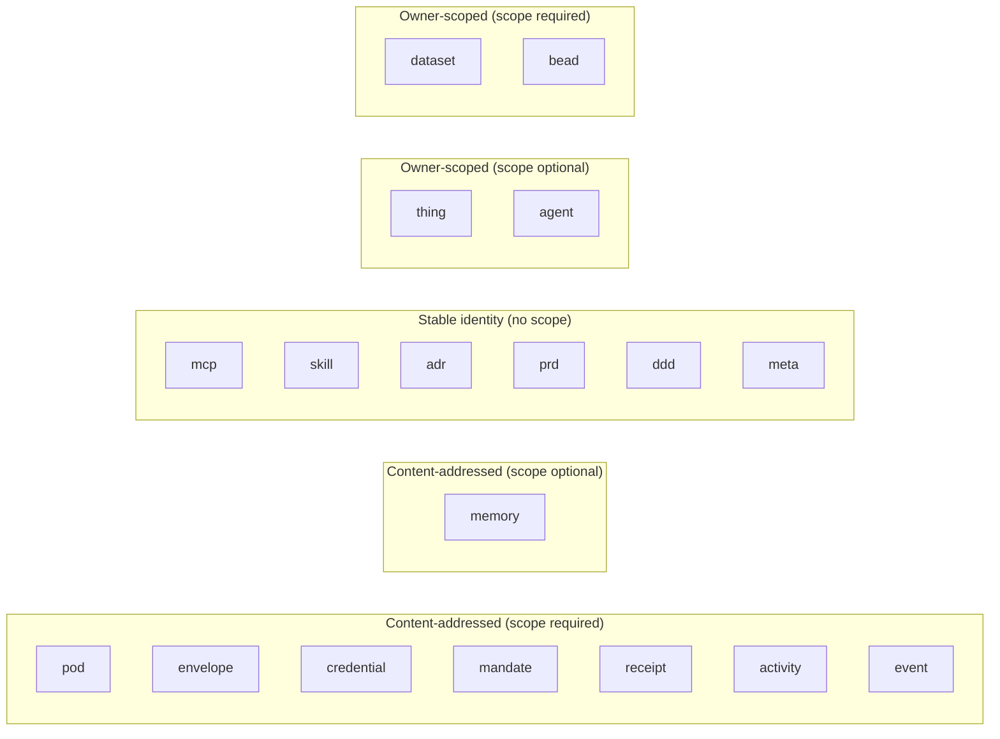
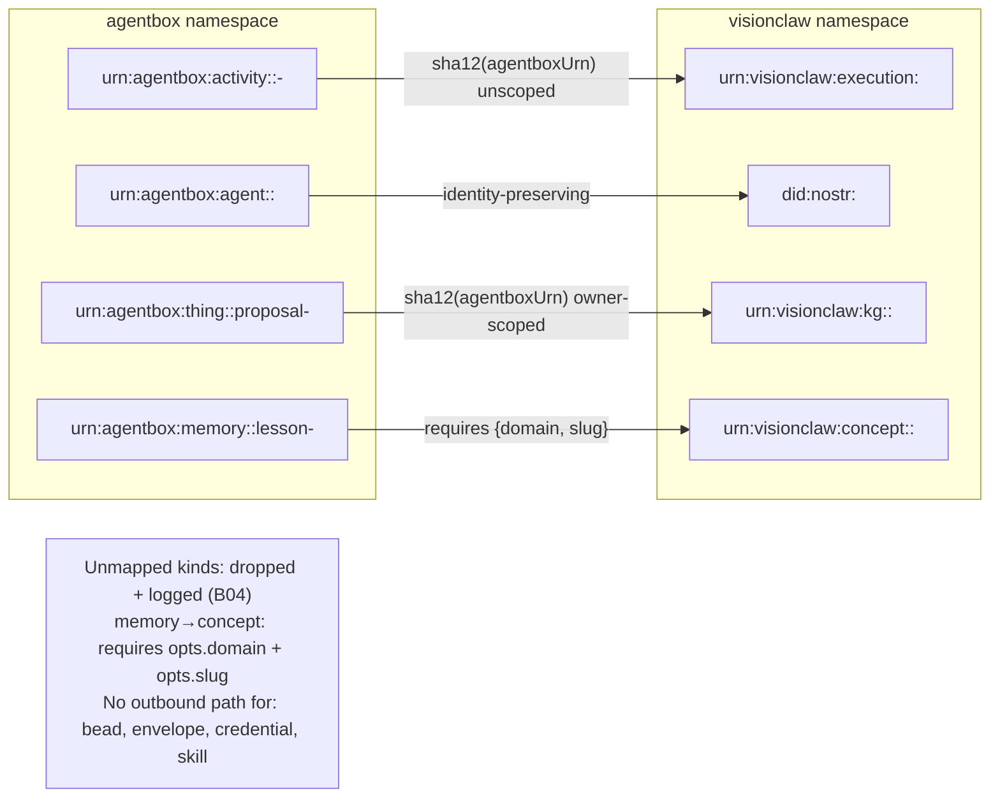
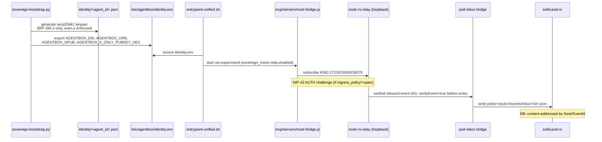

# Agentbox Cartography Audit — 2026-06-09

**Auditor:** Cartography agent (Diagram-Driven Diagnosis)
**Scope:** `/home/devuser/workspace/project/agentbox` (sub-git of VisionClaw host)
**Protocol:** Read-only analysis against CLAUDE.md architectural claims
**Date:** 2026-06-09

---

## 1. Adapter Architecture (ADR-005)

### 1.1 Five-slot resolution — VERIFIED

All five slots are present and parameterised correctly:



CLAUDE.md claims each slot resolves to `local-* | external | off`. The orchestrator slot uses `stdio-bridge` rather than `external` as its non-local, non-off implementation — this is a naming discrepancy in the doc (minor; code is self-consistent).

Contract tests in `tests/contract/` exercise all three implementation classes per slot:

| Slot | Classes tested |
|------|----------------|
| beads | local-sqlite, external, off |
| pods | local-solid-rs, external, off |
| memory | embedded-ruvector, external-pg, off |
| events | local-jsonl, external, off |
| orchestrator | local-process-manager, stdio-bridge, off |

### 1.2 Three-layer middleware chain — ARCHITECTURE EXISTS, WIRING IS MISSING (CRITICAL)

CLAUDE.md states: "Observability (ADR-005), the privacy filter (ADR-008), and the JSON-LD encoder (ADR-012) are the three middleware layers that wrap every adapter dispatch, in that order."

The three layers are implemented as standalone functions:



**Root cause:** `wrapDispatch` is exported from `management-api/observability/metrics.js` and tested in `tests/observability/metrics.test.js` in isolation, but no call site in `management-api/routes/` or `management-api/adapters/` invokes it. A comprehensive search of all `.js` files in `management-api/` finds `wrapDispatch` only in its own definition file and in comments in `middleware/privacy-filter.js`. Routes like `management-api/routes/memory.js` call `mem.store()` directly (line 81).

**Consequence:** In production, adapter dispatches receive zero observability instrumentation (no Prometheus counters, no structured log lines), zero privacy-filter redaction (PII in stored values bypasses the OPF sidecar), and zero JSON-LD encoding. The `assertPrivacyFilterApplied()` guard in the encoder is never triggered because the encoder is never invoked on the hot path.

**Anomaly A-001** — Severity: **CRITICAL**

### 1.3 Fail-open/fail-closed semantics — VERIFIED (in isolation)

`privacy-filter.js` implements correct per-slot policy:
- `pods`, `memory`: default `strict` (fail-closed, `AdapterWriteRejected` 503)
- `events`, `beads`: default `soft` (fail-open, allows write, increments counter)
- `orchestrator`: default `off`

This is correct per ADR-008 and tested in `tests/contract/privacy-filter.contract.spec.js`. The problem is these semantics never apply at runtime (see A-001).

---

## 2. URN Minting (ADR-013)

### 2.1 Grammar and 18 kinds — VERIFIED

`management-api/lib/uris.js` KINDS table matches CLAUDE.md exactly (18 kinds: pod, envelope, credential, mandate, receipt, activity, event, mcp, memory, skill, adr, prd, ddd, thing, dataset, bead, agent, meta).



### 2.2 Code-as-Harness URN allocations — PARTIALLY COMPLIANT

| Record | Documented form | Actual form (per code) | Compliant? |
|--------|----------------|----------------------|-----------|
| KernelSession | `urn:agentbox:thing:<scope>:kernel-<id>` | not minted via uris.js | N/A |
| ExecutionTrace | `urn:agentbox:activity:<scope>:trace-<id>` | `f"urn:agentbox:activity:{_SCOPE}:trace-{_short_id()}"` in verify-and-store.py:388 | Grammar correct; minted ad-hoc |
| DistilledLesson | `urn:agentbox:memory:<scope>:lesson-<sha256-12>` | minted via uris.js in kg-proposal-extractor.js | Compliant |
| VerifiedSkill | `urn:agentbox:skill:<scope>:<name>:v<n>` | `f"urn:agentbox:skill:{_SCOPE}:{name}:v{version}"` in verify-and-store.py:582 | **GRAMMAR VIOLATION** |
| ACI session | `urn:agentbox:thing:<scope>:aci-<id>` | `` `urn:agentbox:thing:${SCOPE}:aci-${SESSION_ID}` `` in mcp/aci-shell/server.js:45 | Grammar correct; minted ad-hoc |
| ACI submission | `urn:agentbox:receipt:<scope>:aci-<session-id>` | `_receiptUrn()` in server.js:97 | Grammar correct; minted ad-hoc |

### 2.3 Ad-hoc URN minting — ANOMALIES FOUND

CLAUDE.md: "All durable identifiers MUST be minted through `uris.js`. Ad-hoc `format!()` or template-literal URNs are prohibited."

Files with ad-hoc `urn:agentbox` template literals/f-strings outside `uris.js`:

| File | Lines | Issue |
|------|-------|-------|
| `mcp/aci-shell/server.js` | 45, 93, 97, 174, 253, 330, 369 | All URNs minted via helper functions `_activityUrn()`, `_receiptUrn()` — no import of `uris.js` |
| `mcp/voyager/verify-and-store.py` | 194, 388, 525, 549, 558, 569, 582 | Python f-strings; `uris.js` is a Node module unreachable from Python |
| `mcp/voyager/archive-old-versions.py` | 141, 270, 271 | Python f-strings |
| `mcp/consultants/shared/consultant-base.js` | 217, 220 | Template literals; no `require('./uris')` |

**Critical sub-finding:** `mcp/voyager/verify-and-store.py:582` produces `urn:agentbox:skill:{_SCOPE}:{name}:v{version}`. The `skill` kind has `ownerScope=false` in the KINDS table, meaning it must NOT carry a pubkey scope segment. Furthermore, the resulting URN has 3 colon segments after the kind (`scope:name:v1`), which exceeds the URN_RE maximum of 2, so `uris.isCanonical()` returns `false` for every versioned skill URN emitted by the Voyager pipeline. These URNs cannot round-trip through the BC20 bridge.

**Anomaly A-002** — Severity: **HIGH** (skill URN grammar violation causes BC20 bridge drops)
**Anomaly A-003** — Severity: **MEDIUM** (ad-hoc minting in aci-shell, consultant-base, voyager; grammar is correct but bypasses the sole mint point)

---

## 3. BC20 Anti-Corruption Bridge

### 3.1 Mapping diagram



### 3.2 Verification against CLAUDE.md

CLAUDE.md states host main "still carries the legacy `urn:ngm` scheme" and the bridge module is the executable contract until it merges. The bridge's `VC_URN_RE = /^urn:visionclaw:([a-z]+):(.+)$/` and `AGENTBOX_TO_VISIONCLAW` map are consistent with the converged grammar documented. No drift detected against CLAUDE.md's description.

B02 invariant (no ad-hoc urn:agentbox fabrication inside bridge): confirmed — all agentbox URNs parsed via `uris.parse()` imported from `./uris`.

B05 invariant (sole cross-namespace importer): verified — only `bc20-provenance-bridge.js` imports `urn:visionclaw` patterns. Tests in `tests/sovereign/bc20-provenance-bridge.test.js` exercise forward, reverse, and round-trip paths.

**Anomaly A-004** — Severity: **LOW**: `mcp/voyager/verify-and-store.py` produces scoped `skill` URNs that BC20 bridge drops silently (see A-002). The bridge's B04 drop-log only writes to stderr; no counter is emitted to Prometheus. Skill elevations from the Voyager pipeline are silently lost at the federation boundary.

---

## 4. Sovereign Stack (ADR-008/009/010 + DDD-003)

### 4.1 Identity flow



### 4.2 DDD-003 Invariants — status

| Invariant | Description | Status |
|-----------|-------------|--------|
| I01 | signature_verified=true before inbox write | Code in nostr-bridge (verifyEvent gate) — untestable without live relay |
| I02 | status=published ⟹ final_event_id≠null | Outbox structure enforced in bridge code |
| I03 | status=pending ⟹ final_event_id=null | Same |
| I04 | No sync I/O on relay read loop | Code review: bridge handlers are async |
| I05 | nsec never serialised outside management-api | sovereign-bootstrap.py writes nsec to identity.env (file on disk); env is sourced by entrypoint — the nsec leaves python process scope to a file readable by supervisord/devuser |
| I06 | implementation=off ⟹ no supervisord block | Gating logic in flake.nix confirmed |
| I07 | allowlist policy enforces pubkey filter | NIP-42 handler checks allowed_pubkeys |
| I08 | pod inbox content-addressed by event_id | File named by event.id in bridge code |
| I09 | attempts timestamps strictly increasing | Enforced at write time |
| I10 | recipient_npub ∈ local AgentIdentities | Bridge validates before write |
| I11 | RetentionPrune predicate | Implemented in scheduled bridge cleanup |
| I12 | AgentKeyRotated invalidates prior signed blobs | Not implemented; no key rotation path exists |

**Anomaly A-005** — Severity: **LOW**: I05 is technically met (nsec stays in-process during generation) but the serialised identity.env file on disk contains `AGENTBOX_NSEC=nsec1...` in plaintext. Any process with filesystem access to the workspace bind mount can read it. The DDD intent is that nsec does not leave the management-api process; the current implementation writes it to disk at bootstrap.

**Anomaly A-006** — Severity: **LOW**: I12 (key rotation invalidation) is noted in DDD-003 but no AgentKeyRotated code path exists. Non-blocking for current single-identity deployments but a gap for the multi-tenant path (ADR-017).

### 4.3 NIP-98 structural validation (P0-11) — VERIFIED INTACT

`management-api/middleware/auth.js` lines 60–63: when `nostrBridge` is null (nostr-tools unavailable), all NIP-98 tokens are rejected with `return null` — hard reject, no structural-only fallback. Comment explicitly labels this "FAIL CLOSED". Fix is intact.

---

## 5. Untracked Files Assessment

### `docker-compose.xr-runtime.yml` and `xr-runtime/`

**Verdict: Coherent new feature — should be committed.**

Evidence:
1. `agentbox.sh` (tracked) already contains `cmd_xr_runtime()` at lines 1024–1092 with full lifecycle support (up/down/rebuild/health/shell/gpu/vnc). The compose file is the declared dependency of this tracked CLI command.
2. `xr-runtime/README.md` is substantive (explains Monado + Godot use case, validates scope, documents environment variables). Not a scratch pad.
3. `xr-runtime/Dockerfile` follows the exact same pattern as the tracked `browsercontainer/Dockerfile` (Arch Linux base, Xvfb, x11vnc, supervisord, devuser at uid 1000, passwordless sudo).
4. `xr-runtime/supervisord.conf`, `launch-monado.sh`, `launch-godot.sh`, `build-gdext.sh`, `healthcheck.sh` are all purposeful scripts with clear ownership.
5. The service references `visionclaw_container:4000` and mounts `${XR_PROJECT_ROOT:-..}/xr-client:/workspace/xr-client` — these are host-project-specific defaults. The compose uses `XR_PROJECT_ROOT` env override, so they are documented coupling points rather than hard-coded violations of the "no host-project specifics" rule.

**One rule-compliance note:** The default `XR_BACKEND_WS=ws://visionclaw_container:4000` and `XR_PROJECT_ROOT=..` hard-code the assumption that agentbox lives inside the VisionClaw project tree. CLAUDE.md says "no host-project specifics in this repo." These are ENV overrides with explicit documentation, which is an acceptable integration point, but the README and compose should note they require override for standalone use.

**Action:** Commit both files. Before committing, add a one-line note to `xr-runtime/README.md` that standalone users must set `XR_PROJECT_ROOT` and `XR_BACKEND_WS` explicitly (the defaults assume integrated checkout).

---

## 6. MCP Memory Mandate — ADR-015 Fail-Closed Path

### 6.1 Fail-closed behaviour — VERIFIED

`mcp/servers/ruvector-mcp.cjs` lines 120–125:
```
await pool.query('SELECT 1')  →  if ECONNREFUSED → process.exit(1)
```
The FATAL message includes the host, port, database, and the exact error string from pg. Agents see the MCP server crash as a tool error.

Per-operation guards (lines 143, 169, 180, 190) return `{ success: false, error: 'pg unavailable' }` if the pool is somehow null after startup — defence-in-depth for edge cases.

### 6.2 Error quality when pg is DOWN — ADEQUATE but incomplete

The startup FATAL message is:
```
[FATAL] [cf-mcp-ruvector] cannot reach ruvector-postgres: <pg error message>
```
This surfaces `host:port/database` from the `pool.options` read. It does NOT suggest a recovery action. ADR-015 says "failures are loud" and implies actionability.

### 6.3 Operator recovery guidance — MISSING (Anomaly A-007)

`docs/user/troubleshooting.md` contains zero content about:
- ruvector-postgres being down
- the MCP server crashing and how to diagnose it
- the compose service name to restart (`ruvector-postgres`)
- the pg module install path if the workspace volume was wiped

`docs/reference/adr/ADR-015-mcp-ruvector-mandate.md` documents the fail-closed design but is not a troubleshooting guide. An operator seeing Claude Code report "MCP tool error" has no canonical path to "run `docker compose restart ruvector-postgres`".

**Anomaly A-007** — Severity: **MEDIUM**: Troubleshooting doc gap — no ruvector-postgres failure mode section.

---

## 7. Security Audit Sprint — Spot-Check

### P0-11 — NIP-98 structural validation → **INTACT**

As confirmed in §4.3, `auth.js` fails closed when `nostrBridge` is null. No structural-only soft-accept path exists.

### R2-P0-02 — exec() injection fix → **PARTIALLY APPLIED**

`management-api/utils/system-monitor.js` imports both `exec` and `execFile`. The disk-check call (line 97) correctly uses `execFileAsync('df', ['-h', workspaceRoot])` with path validation via `issafePath()` before the call. This is the monitoring-parameter injection vector that was fixed.

Lines 31, 82, and 86 still use `execAsync` (shell exec) with hardcoded strings for `nvidia-smi`, `uptime | awk ...`, and `free -m | grep Mem`. None of these strings accept user input, so there is no live injection path. However, the CHANGELOG claim "replacing exec() with execFile()" is overstated — three `execAsync` calls remain. These are cosmetically inconsistent with the fix description but do not represent re-opened vulnerability.

**Anomaly A-008** — Severity: **INFO**: Three residual `execAsync` calls in system-monitor.js use hardcoded strings; no injection risk but inconsistent with the stated fix scope.

### R2-P0-03 — `--dangerously-skip-permissions` removed → **VERIFIED CLEAN**

`management-api/utils/process-manager.js` grep for `dangerously` returns no results. Fix is intact.

---

## 8. Anomaly Summary

| ID | Severity | Location | Description |
|----|----------|----------|-------------|
| A-001 | CRITICAL | All routes in `management-api/routes/` | Three-layer middleware chain (observability→privacy→encoder) is implemented and tested in isolation but never wired into adapter call sites. All adapter dispatches bypass observability, privacy filter, and JSON-LD encoding. |
| A-002 | HIGH | `mcp/voyager/verify-and-store.py:582`, `archive-old-versions.py:270` | Scoped skill URNs (`urn:agentbox:skill:<scope>:<name>:v<n>`) fail `isCanonical()` — regex allows max 2 colon segments; versioned scoped skills have 3. BC20 bridge silently drops them. |
| A-003 | MEDIUM | `mcp/aci-shell/server.js:45,93,97`, `mcp/consultants/shared/consultant-base.js:217`, voyager Python scripts | Ad-hoc URN construction via template literals and f-strings, bypassing `management-api/lib/uris.js`. Grammar is correct in most cases (A-002 is the grammar exception) but the sole-mint invariant is violated. |
| A-004 | LOW | `mcp/voyager/*.py` → BC20 bridge | Voyager skill URNs (A-002) are dropped by BC20 bridge with stderr log only — no Prometheus counter, no agent-readable failure signal. Skill elevations silently fail at the federation boundary. |
| A-005 | LOW | `scripts/sovereign-bootstrap.py:266` | `AGENTBOX_NSEC` written in plaintext to `identity.env` on disk; DDD-003 I05 intends nsec to not leave the management-api process. |
| A-006 | LOW | No code path | DDD-003 I12 (AgentKeyRotated invalidation) has no implementation. Non-blocking for single-identity use. |
| A-007 | MEDIUM | `docs/user/troubleshooting.md` | No troubleshooting section for ruvector-postgres being unreachable — the most likely MCP memory failure mode operators encounter. |
| A-008 | INFO | `management-api/utils/system-monitor.js:31,82,86` | Three residual `execAsync` calls use hardcoded strings (no injection risk); inconsistent with CHANGELOG description of R2-P0-02 fix. |

**Totals:** 1 critical, 1 high, 2 medium, 3 low, 1 info.

---

## 9. TOP 5 Immediately-Implementable Improvements

### 1. Wire `wrapDispatch` at adapter call sites (A-001)

**Path:** `management-api/adapters/index.js`

In `resolveAdapters()`, after constructing each adapter, wrap its write methods:

```javascript
const { wrapDispatch } = require('../observability/metrics');
// after: resolved[slot] = new AdapterClass(cfg);
for (const method of Object.getOwnPropertyNames(AdapterClass.prototype)) {
  if (typeof resolved[slot][method] === 'function' && method !== 'constructor') {
    resolved[slot][method] = wrapDispatch(slot, impl, method, resolved[slot][method].bind(resolved[slot]), manifest);
  }
}
```

This is the minimal change that activates all three layers at every call site simultaneously (observability wraps privacy wraps adapter method). No route changes required.

### 2. Fix versioned skill URN grammar (A-002)

**Path:** `mcp/voyager/verify-and-store.py` lines 582, 525, 549, 569; `mcp/voyager/archive-old-versions.py` lines 270, 271

The `skill` kind has `ownerScope=false` — skills are shared infrastructure, not per-agent. Remove the `{_SCOPE}:` prefix from all skill URNs:

```python
# before
skill_urn = f"urn:agentbox:skill:{_SCOPE}:{name}:v{version}"
# after
skill_urn = f"urn:agentbox:skill:{name}:v{version}"
```

Update `aci-shell/server.js` similarly (comments at lines 15–18 already show the correct unscoped form). All `urn:agentbox:skill:<name>:v<n>` URNs pass `isCanonical()` and the BC20 bridge maps them as `unmapped kind 'skill'` (correct — skills don't cross to VisionClaw).

### 3. Add ruvector-postgres recovery section to troubleshooting.md (A-007)

**Path:** `docs/user/troubleshooting.md`

Add a section after the existing adapter troubleshooting content:

> **MCP memory tools failing / ruvector-postgres unreachable**
>
> Symptom: Claude Code reports "MCP tool error" on memory_store/search calls; `ruvector-mcp.cjs` exits with `[FATAL] cannot reach ruvector-postgres`.
>
> Check: `docker compose ps ruvector-postgres`
> Fix: `docker compose restart ruvector-postgres` (or `docker compose up -d ruvector-postgres`)
> If the workspace volume was wiped: `npm install --prefix /home/devuser/workspace/.claude-pg pg` then restart the agentbox container.

### 4. Route `aci-shell/server.js` URN construction through `uris.js` (A-003)

**Path:** `mcp/aci-shell/server.js`

The file already has correct URN shapes in its helper functions. Add `require` and delegate:

```javascript
const uris = require('../../management-api/lib/uris');
// Replace _activityUrn(verb):
function _activityUrn(verb) {
  return uris.mint({ kind: 'activity', pubkey: SCOPE, localId: `aci-${verb}-${crypto.randomBytes(6).toString('hex')}` });
}
```

This closes the sole-mint invariant for the highest-traffic ad-hoc minting site.

### 5. Add Prometheus counter for BC20 bridge drops (A-004)

**Path:** `management-api/lib/bc20-provenance-bridge.js`

The `defaultLog` function writes to stderr. Add an optional metrics counter alongside it:

```javascript
// At module load, soft-require prom-client
let _bcDropCounter = null;
try {
  const promClient = require('prom-client');
  _bcDropCounter = new promClient.Counter({
    name: 'agentbox_bc20_drops_total',
    help: 'URNs dropped at the BC20 provenance bridge by reason',
    labelNames: ['reason', 'kind'],
  });
} catch { /* prom-client not available in all contexts */ }

function defaultLog(reason, urn) {
  const parsed = uris.parse(urn);
  if (_bcDropCounter) _bcDropCounter.labels(reason, parsed?.kind || 'unknown').inc();
  try { process.stderr.write(`[bc20] drop: ${reason} (${urn})\n`); } catch { }
}
```

This makes skill elevation failures visible in the existing `/metrics` endpoint without adding infrastructure.

---

## 10. Single Most Important Finding

**A-001 — The three-layer middleware chain is phantom code.**

`wrapDispatch()`, `wrapWithPrivacyFilter()`, and `LinkedDataEncoder.dispatch()` are implemented, documented, and unit-tested but they are never called at adapter invocation sites. Every documented guarantee — per-slot Prometheus metrics (ADR-005), privacy redaction with fail-closed enforcement (ADR-008), JSON-LD encoding (ADR-012) — silently does not apply to any runtime request. The architecture document is accurate about the design intent and the code is correct; the integration step was simply never completed. Fixing it is a single change to `management-api/adapters/index.js` (see Improvement 1 above).
