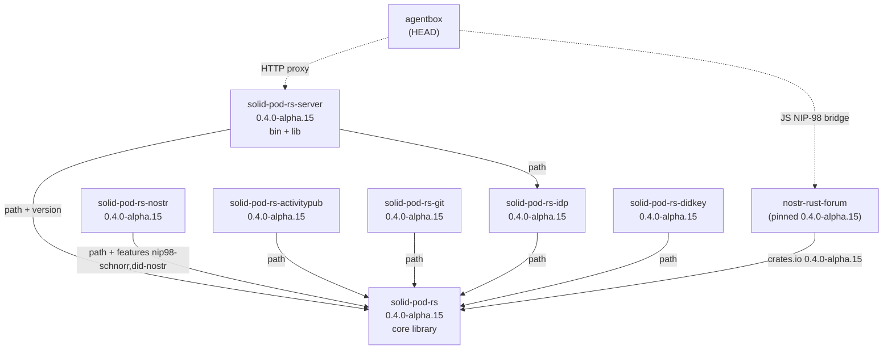
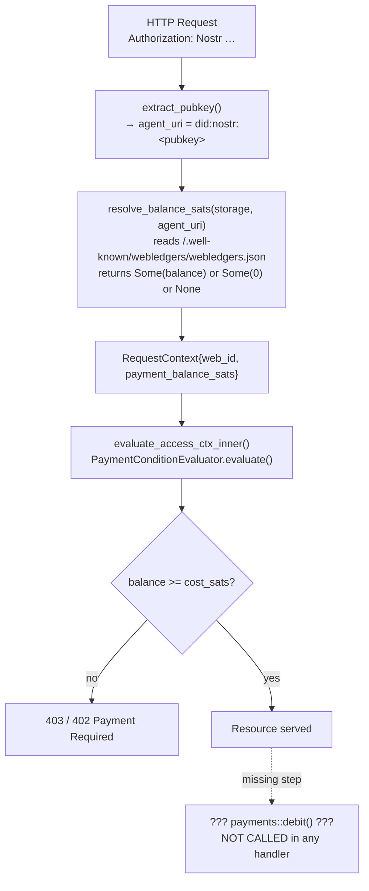

# Audit Slice 03: solid-pod-rs — 2026-06-09

Cartography agent, Diagram-Driven Diagnosis sprint. READ-ONLY analysis of
`/home/devuser/workspace/solid-pod-rs`.  
Workspace version: **0.4.0-alpha.15** (workspace root `Cargo.toml`; the version
field has not been bumped for the in-flight changes, so the dirty tree is still
alpha.15-dev).

---

## 1. WAC Authorization Decision Flow

### 1a. Static flow (committed code)

```mermaid
sequenceDiagram
    participant HTTP as HTTP Request
    participant Server as solid-pod-rs-server<br/>handle_get / handle_put…
    participant Resolver as StorageAclResolver<br/>wac/resolver.rs
    participant Storage as Storage backend
    participant Parser as parse_jsonld_acl /<br/>parse_turtle_acl
    participant Evaluator as evaluate_access_ctx_inner<br/>wac/evaluator.rs
    participant PayLedger as WebLedger<br/>payments.rs

    HTTP->>Server: GET /parent/child (Authorization: Nostr …)
    Server->>Server: extract_pubkey() → agent_uri
    Server->>PayLedger: resolve_balance_sats(storage, agent_uri)
    PayLedger-->>Server: Option<u64> balance
    Server->>Resolver: find_effective_acl("/parent/child")
    Resolver->>Storage: GET /parent/child.acl
    Storage-->>Resolver: 404 (not found)
    Note over Resolver: inherited = false on first probe
    Resolver->>Resolver: walk up: path = "/parent"
    Note over Resolver: inherited = true for ancestor ACLs (P2 fix, IN-FLIGHT)
    Resolver->>Storage: GET /parent.acl
    Storage-->>Resolver: 200 ACL body
    Resolver->>Parser: parse_jsonld_acl(body) or parse_turtle_acl(text)
    Parser-->>Resolver: AclDocument { inherited: true }
    Resolver-->>Server: Some(AclDocument)
    Server->>Evaluator: evaluate_access_ctx(doc, ctx{web_id, balance}, path, Read)
    Note over Evaluator: honour_access_to = !doc.inherited
    Note over Evaluator: inherited=true → skip accessTo rules; only default rules apply
    Evaluator-->>Server: bool granted
    alt denied
        Server-->>HTTP: 401 / 403
    else granted
        Server-->>HTTP: 200 resource body
    end
```

### 1b. What the uncommitted WAC diff does (P2 fix)

All 5 modified files in `crates/solid-pod-rs/src/wac/` implement a single,
coherent security fix for **WAC §4.2 ancestor-inheritance semantics**:

| File | Change |
|---|---|
| `document.rs` | Adds `inherited: bool` field (`#[serde(skip, default)]`) to `AclDocument`; derives `Default` |
| `resolver.rs` | Sets `inherited = true` after the first loop iteration (i.e. after the resource's own `.acl` is not found) and stamps the parsed doc with the flag |
| `evaluator.rs` | Gates the `accessTo` path-match block behind `let honour_access_to = !doc.inherited` |
| `parser.rs` | Explicitly sets `inherited: false` in the constructed doc (required because `Default` was not previously derived) |
| `mod.rs` | Updates internal `make_doc` helper to supply the new field |

**Verdict**: Coherent, finished security fix. The companion test in
`tests/wac_concurrent.rs` (`ancestor_access_to_does_not_inherit_to_child`)
exercises the exact regression path.  This is **not** a continuation of the
payment-ledger commit (`0cf2d61`) — it is an independent WAC spec-conformance
fix addressing a distinct security boundary (P2 severity: ancestor ACL leaks
grants to descendants).

---

## 2. NIP-98 Token Issuance and Validation

```mermaid
sequenceDiagram
    participant Client as Nostr Client / install CLI
    participant Mint as auth::nip98::mint()<br/>(solid-pod-rs, feature nip98-schnorr)
    participant Wire as HTTP Authorization header<br/>"Nostr <base64(json(event))>"
    participant Server as solid-pod-rs-server<br/>extract_pubkey()
    participant Verify as auth::nip98::verify_at_with_policy()
    participant Schnorr as k256::schnorr<br/>verify_schnorr_signature()

    Client->>Mint: url, method, privkey_hex, now
    Mint->>Mint: build Nip98Event{kind=27235, tags=[u,method,payload?]}
    Mint->>Mint: compute_event_id() → NIP-01 canonical SHA-256
    Mint->>Schnorr: sign(id_bytes, privkey) → sig (BIP-340, zero aux-rand)
    Mint-->>Client: base64(json(event))
    Client->>Server: HTTP request + Authorization: Nostr <token>
    Server->>Verify: verify_at_with_policy(header, url, method, body_hash, now, policy)
    Verify->>Verify: strip "Nostr " prefix; size gate (64 KiB)
    Verify->>Verify: base64-decode + serde_json parse
    Verify->>Verify: kind==27235, pubkey 64-hex, timestamp ±60s
    Verify->>Verify: URL match (Strict: normalize_url trims trailing /)<br/>or GitLenient (prefix match + * method)
    Verify->>Verify: method match (case-insensitive)
    Verify->>Verify: payload SHA-256 if body present
    Verify->>Schnorr: verify_schnorr_signature(event) [feature-gated]
    Schnorr-->>Verify: Ok / Err
    Verify-->>Server: pubkey string or PodError::Nip98
    Server->>Server: agent_uri = "did:nostr:<pubkey>"
```

### Duplicate implementation risk (flag for contracts agent)

Three independent NIP-98 verification implementations exist in the ecosystem:

| Location | Language | Schnorr? | Replay? | URL matching |
|---|---|---|---|---|
| `solid-pod-rs/src/auth/nip98.rs` | Rust | Yes (feature-gated `nip98-schnorr`) | No | `normalize_url` trims trailing `/` |
| `nostr-rust-forum/crates/nostr-bbs-core/src/nip98.rs` | Rust | Always (k256, unconditional) | Trait (`Nip98ReplayStore`) | **Exact string equality** — no normalization |
| `agentbox/management-api/middleware/auth.js` | JavaScript | Via `nostrBridge.verifyNip98()` (native module bridge, absent = reject all) | No (upstream) | Delegated to bridge |

**Divergence confirmed**: `nostr-bbs-core/src/nip98.rs` line 452 uses
`token_url != expected_url` (exact equality, no trimming). `solid-pod-rs`
normalizes trailing slashes via `normalize_url`. This means a token minted by
the `install` CLI (which calls `solid-pod-rs::mint`) for a URL ending in `/`
will be **rejected by nostr-bbs-core** but accepted by solid-pod-rs.
`nostr-bbs-core/docs/sprint/milestone-0-sso-parity.md` row 11 explicitly flags
this discrepancy as unresolved.

The nostr-bbs-core module's docstring claims to be the "single source of truth
for NIP-98 verification across the DreamLab ecosystem." That claim is false
while `solid-pod-rs` maintains its own independent implementation with
diverging URL-matching semantics.

---

## 3. Crate Topology



**Notes on the topology:**

- No circular dependencies detected. Workspace resolver v2 is used.
- `solid-pod-rs-nostr` depends on `solid-pod-rs` with pinned alpha.15 path dep
  plus feature flags `nip98-schnorr`, `did-nostr`, `security-primitives`. This
  is correct; it reuses core Schnorr primitives rather than reimplementing.
- `nostr-rust-forum` pins `solid-pod-rs` at `crates.io 0.4.0-alpha.15`, which
  means the dirty-tree changes (P2 WAC fix, P1-3 git read-auth fix, DPoP
  feature flag, `subtle` dep) are **not yet visible to NRF**. NRF must wait
  for an alpha.16 publish.
- `agentbox` depends on the server binary (HEAD/path), so it does see the
  in-flight changes once built.
- Feature flag of note: `solid-pod-rs-server/Cargo.toml` (dirty) adds
  `dpop-replay-cache` to the server's feature set and `subtle = "2.6"` for
  constant-time PSK comparison on `/_admin/provision`. These are security
  hardening additions.

---

## 4. JSS Parity Tracking

The project maintains two machine-readable tracking documents:

- `crates/solid-pod-rs/PARITY-CHECKLIST.md` — 207 rows, row-per-feature, pinned to JSS 0.0.204 (`9d29167`)
- `crates/solid-pod-rs/GAP-ANALYSIS.md` — categorical companion

**Current parity state (Sprint 16, 2026-05-30):**

| Metric | Value |
|---|---|
| Rows tracked | 207 |
| Present | 164 (79%) |
| Net-new (ours, not in JSS) | 20 |
| Partial-parity | 5 |
| Missing | 3 |
| Deferred | 6 |
| Won't fix | 3 |
| Strict parity (excluding deferred/wontfix) | ~96% |

Drift is detected by manually fast-forwarding the JSS local clone
(`/home/devuser/workspace/JavaScriptSolidServer/`) and adding rows. No
automated CI check compares against a live JSS version. The JSS comparator
pin advances each sprint via a manual docs commit. Three rows remain missing
and are potential silent divergence vectors.

---

## 5. Sat-Gating / Payment Loop



### Bypass vectors

1. **No debit after grant** (HIGH severity): `payments::WebLedger::debit()` 
   exists at `crates/solid-pod-rs/src/payments.rs:158` and `total_payment_cost()`
   is exported from `wac/payment.rs`. Neither is called in any HTTP handler
   (`handle_get`, `handle_put`, `enforce_read`, `enforce_write`) nor in the MCP
   tools layer. The WAC evaluator gate only checks the balance — it does not
   consume it. A caller with `1 sat` can satisfy a `cost_sats = 1` condition and
   make unlimited reads without ever being debited. The parity checklist row 181
   ("Pay-per-read auto-deduction") is marked `present` — that appears to be
   inaccurate; the function exists but is not wired into any request path.

2. **Ledger read failure defaults to `Some(0)`** (MEDIUM): If
   `/.well-known/webledgers/webledgers.json` is malformed, `resolve_balance_sats`
   returns `Some(0)`. Zero-cost conditions pass. This is intentionally
   fail-open for the zero-cost case but means a corrupt ledger doc silently
   removes payment gating for all `cost_sats > 0` conditions too (they fail
   closed at `0 < N`). The open-on-corrupt path for non-zero conditions is
   correct but the comment could be clearer.

3. **Anonymous `None` balance fails closed** (correct): When no auth header is
   present, `resolve_balance_sats` returns `None`, and
   `PaymentConditionEvaluator` returns `Denied` for any condition. Correct.

4. **`/pay/.deposit` write path**: Crediting is done by writing a new ledger
   body via PUT to the `WEBLEDGER_PATH`. This requires `acl:Write` on the
   webledger resource. No special payment handler enforces the credit amount
   against a real Lightning invoice settlement. The ledger is append-by-write,
   not verified against an external payment processor — anyone with Write access
   to `/.well-known/webledgers/webledgers.json` can self-credit arbitrary sats.

---

## 6. Dirty-State Assessment

### Summary table

| Modified file | Change type | State | Tests pass? |
|---|---|---|---|
| `wac/document.rs` | Adds `inherited` field | Finished | Yes (cargo check clean) |
| `wac/resolver.rs` | Tags ancestor docs `inherited=true` | Finished | Yes |
| `wac/evaluator.rs` | Skips `accessTo` for inherited docs | Finished | Yes |
| `wac/parser.rs` | Sets `inherited: false` in constructed doc | Finished | Yes |
| `wac/mod.rs` | Updates internal helper | Finished | Yes |
| `tests/wac_concurrent.rs` | Adds P2 regression test + `acl_default_body` helper | Finished | Yes |
| `tests/wac2_conditions.rs` | `inherited: false` in doc constructor | Mechanical (struct update) | Yes |
| `tests/wac2_conditions_sprint9.rs` | Same | Mechanical | Yes |
| `tests/wac_inheritance.rs` | Same | Mechanical | Yes |
| `tests/wac_validate_for_write.rs` | Same | Mechanical | Yes |
| `tests/wac_payment_condition.rs` | Same | Mechanical | Yes |
| `tests/cid_verifier_sprint11.rs` | Same | Mechanical | Yes |
| `tests/oidc_integration.rs` | Same | Mechanical | Yes |
| `solid-pod-rs-git/src/service.rs` | Adds `is_read()` + gates read traffic through auth | Finished | All 11 tests pass |
| `solid-pod-rs-git/tests/git_service_sprint10.rs` | 3 new tests for P1-3 read-auth gating | Finished | All 11 tests pass |
| `solid-pod-rs-server/Cargo.toml` | Adds `dpop-replay-cache` feature + `subtle` dep | Finished | Cargo check clean |
| `solid-pod-rs/src/provision.rs` | `inherited: false` in `build_public_type_index_acl` | Mechanical | Yes |

**Cargo check result**: `Finished dev profile [unoptimized + debuginfo] target(s) in 22.93s` — clean.

**Cargo test -p solid-pod-rs-git result**: `11 passed; 0 failed`.

### Dirty-state verdict

All 18 modified files form **two coherent, finished security fixes**:

1. **P2 WAC ancestor-inheritance fix** — 5 source + 8 test files. The
   `AclDocument::inherited` field is properly propagated through resolver,
   parser, evaluator, and all test constructors. The regression test is
   present. This is ready to commit as-is.

2. **P1-3 git read-auth fix** — 2 files (service.rs + sprint10 test). Closes a
   world-readable git clone hole. Backed by 3 targeted integration tests, all
   passing.

3. **Security hardening** — Cargo.toml additions (`dpop-replay-cache`,
   `subtle`) are independent and low-risk.

**Recommendation: commit as-is.** There is no unfinished or debris work. The
only reason to delay would be to run the full test suite (not just the git
crate) before committing, since ~8 test files have mechanical `inherited:
false` additions that haven't been verified to pass under the full suite.
Recommend running `cargo test -p solid-pod-rs` before committing.

---

## Anomalies

| # | Severity | File:Line | Description |
|---|---|---|---|
| A-1 | HIGH | `solid-pod-rs-server/src/lib.rs` (all handlers) | **Payment debit never called.** `PaymentConditionEvaluator` gate is wired; `payments::debit()` is never called in any handler after a successful PaymentCondition grant. Pay-per-read is a balance check, not a balance deduction. Parity row 181 is mis-marked `present`. |
| A-2 | HIGH | `nostr-bbs-core/src/nip98.rs:452` vs `solid-pod-rs/src/auth/nip98.rs:364-366` | **NIP-98 URL matching divergence.** NRF uses exact equality; solid-pod-rs trims trailing `/`. Tokens minted by `install` CLI for container URLs (trailing slash) will be accepted by the pod server but rejected by nostr-rust-forum's own verifier. Documented as unresolved in `milestone-0-sso-parity.md` row 11. |
| A-3 | MEDIUM | `crates/solid-pod-rs/src/auth/nip98.rs:187-199` | **Schnorr signature verification is feature-gated.** Without `nip98-schnorr`, structural checks run but the cryptographic signature is never verified — any structurally valid token with a forged signature passes. `solid-pod-rs-server/Cargo.toml` does not explicitly enable `nip98-schnorr` in its feature list; it is inherited transitively through the default feature chain only if the default features include it. Default feature set (`fs-backend, memory-backend, config-loader, legacy-notifications, dpop-replay-cache`) does not explicitly list `nip98-schnorr`. |
| A-4 | MEDIUM | `solid-pod-rs/src/payments.rs:158` | **No Lightning/invoice verification on deposit.** Anyone with `acl:Write` on `/.well-known/webledgers/webledgers.json` can PUT an arbitrary balance. There is no server-side enforcement that a deposit corresponds to a settled Lightning invoice. |
| A-5 | LOW | `solid-pod-rs/src/wac/mod.rs` (JSS parity) | **Three missing parity rows, no CI gate.** Parity tracking is purely manual (docs commit). No automated test compares against the live JSS repo. The three `missing` rows in PARITY-CHECKLIST.md are silent divergence vectors with no alerting. |
| A-6 | LOW | `crates/solid-pod-rs/src/auth/nip98.rs` (struct `Nip98Verified`) | **Replay protection absent.** `Nip98Verified` carries `created_at` but there is no replay cache in solid-pod-rs. A captured valid token can be replayed within the 60-second window. NRF has a `Nip98ReplayStore` trait; solid-pod-rs has none. |

---

## TOP 5 Immediately-Implementable Improvements

1. **Wire `payments::debit()` after successful PaymentCondition grant in
   `enforce_read` / `enforce_write`**: call `wac::total_payment_cost(conditions)`,
   read the current ledger, call `ledger.debit(agent_uri, cost)`, persist the
   updated ledger body via `storage.put(WEBLEDGER_PATH, …)`. Without this the
   entire payment-gating feature is a balance check with no deduction.

2. **Unconditionally enable `nip98-schnorr` in `solid-pod-rs-server`'s feature
   list**: add `"nip98-schnorr"` to the `solid-pod-rs` dependency features in
   `solid-pod-rs-server/Cargo.toml`. Signature verification should never be
   optional in a deployed server.

3. **Resolve the NIP-98 URL-matching divergence**: either adopt
   `nostr-bbs-core`'s exact-equality semantics in `solid-pod-rs` (align with
   the NIP-98 spec) or publish a shared normalization shim and have both crates
   depend on it. The current state causes cross-component token rejection.

4. **Add a replay cache to `solid-pod-rs` NIP-98 verification**: implement the
   same `Nip98ReplayStore` trait pattern used in `nostr-bbs-core`. A simple
   in-memory `HashSet<String>` with TTL pruning suffices for the server case
   (no D1 needed). This closes a 60-second replay window on every authenticated
   endpoint.

5. **Add a CI job that runs `cargo test -p solid-pod-rs`** (not just the git
   crate) against the current dirty-tree changes before merge. The 8
   mechanical `inherited: false` additions to test helpers are correct but
   untested by the `cargo test -p solid-pod-rs-git` invocation used to
   validate this PR batch.

---

## Single Most Important Finding

**Payment debit is never called (A-1).** The sat-gating loop has a functional
balance-check gate but zero deduction: a caller with 1 sat in their ledger can
make unlimited reads of any `cost_sats = 1` resource forever. This renders the
entire payment-gating feature economically inert. The `payments::debit()`
function and `total_payment_cost()` helper exist and are correct — they simply
need to be called from the handler layer after a successful WAC grant that
included a `PaymentCondition`.
