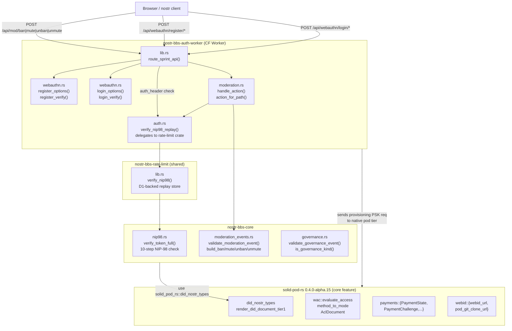
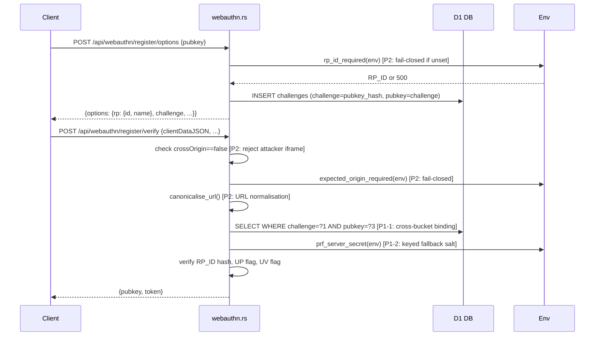
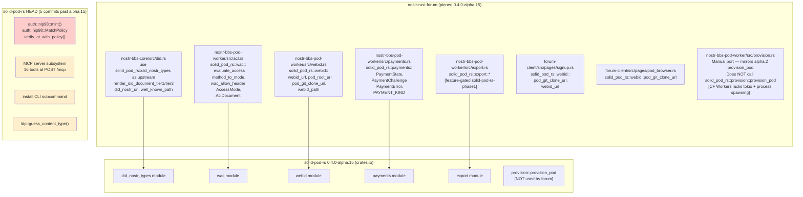
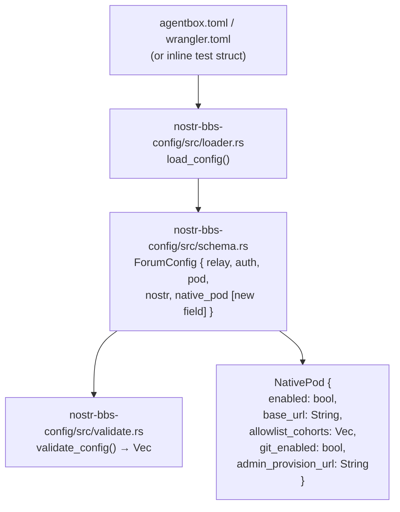

# Audit Report 04 — nostr-rust-forum
**Date:** 2026-06-09  
**Auditor:** Code Analyzer Agent (Diagram-Driven Diagnosis)  
**Repo:** `/home/devuser/workspace/nostr-rust-forum`  
**Branch:** `main` (up to date with origin)  
**Compile check:** PASS — `cargo check` clean in 1m 07s

---

## 1. Auth + Identity Flow

### Diagram 1A — Full auth pipeline

**Key finding:** NIP-98 is implemented ONCE in `nostr-bbs-core/src/nip98.rs` and documented as "the single source of truth for the DreamLab ecosystem." All workers (`auth`, `relay`, `pod`, `search`) delegate to `nostr_bbs_rate_limit::verify_nip98`, which in turn calls `nostr_bbs_core::nip98::verify_token_full`. No duplication exists.

**CRITICAL CHECK RESULT:** NIP-98 validation is NOT reimplemented in auth-worker. The forum's `nostr_bbs_core::nip98` and solid-pod-rs HEAD's `solid_pod_rs::auth::nip98` are parallel but structurally identical implementations — both verify the same 10 checks in the same order. The forum's version is the authoritative copy; solid-pod-rs performs structural checks only on `wasm32` targets (no Schnorr) because `secp256k1-sys` C compilation fails under Nix/wasm32. This is intentional and documented in `Cargo.toml` line 121. Not a duplicate — a legitimate platform split.

---

### Diagram 1B — WebAuthn ceremony with P1/P2 security hardening (dirty state)

**Anomaly 1** — `webauthn.rs`: `deterministic_salt_for()` previously used a public-derivable SHA-256 of pubkey alone (enumeration oracle). The dirty diff keys it with `PRF_SERVER_SECRET` via an HMAC-like construction. FINISHED security fix. **Severity: HIGH** (was an enumeration oracle before this patch).

**Anomaly 2** — `webauthn.rs` line ~884 (dirty): `register_verify` challenge query gains a 3rd bind param `pubkey = challenge` to prevent cross-bucket challenge consumption. Well-formed. FINISHED. **Severity: HIGH** (session fixation attack before fix).

**Anomaly 3** — `webauthn.rs`: `RP_ID` and `EXPECTED_ORIGIN` previously defaulted to `"example.test"` / `"https://example.com"` — any placeholder-configured deployment would accept WebAuthn from any relying party. The dirty diff introduces `rp_id_required()` and `expected_origin_required()` that return HTTP 500 instead of falling back. FINISHED. **Severity: HIGH** (fail-open to attacker origin before fix).

---

## 2. Governance / Moderation Decision Flow

### Diagram 2 — Moderation + Governance state machine

```mermaid
flowchart LR
    AdminClient["Admin client\n(Nostr key)"]

    subgraph auth_worker_mod["auth-worker moderation"]
        PathRouter["action_for_path()\nban|mute|warn\nunban|unmute [P0-4 NEW]"]
        ValidateMod["validate_moderation_event()\nchecks: admin set membership\nd-tag namespace bind [P1-5 NEW]\nexpiration tag name [P0-3 FIXED]"]
        PersistD1["D1: moderation_actions\nINSERT with event.created_at\n[P0-4a: signed ts, not receipt ts]"]
    end

    subgraph relay_mod["relay_do/mod_cache"]
        LoadState["load_state()\nSELECT ban|mute|unban|unmute\nLIMIT 40 [was 20, ban-only]"]
        ResolveBlock["resolve_block()\nlatest-wins per action\n[P0-4b: NEW pure fn]"]
        BlockEnum["Block::{Banned,\nMutedUntil(ts),\nNone,\nUnknown [P2 fail-closed NEW]}"]
    end

    subgraph governance["governance.rs"]
        GovValidator["validate_governance_event()\nkind in 31400..31405\nnon-empty d-tag\n31405 audit append-only [P2 NEW]"]
        AgentRegistry["relay: is_registered_agent()\nblocks non-agents on 31400-31402\n31404-31405"]
        AdminGate["governance_response_blocked()\n31403 admin-only [P1-6 NEW]"]
    end

    AdminClient -->|"sign KIND_BAN/MUTE/WARN\nKIND_UNBAN/UNMUTE [new]"| PathRouter
    PathRouter --> ValidateMod
    ValidateMod -->|"pass"| PersistD1
    PersistD1 --> LoadState
    LoadState --> ResolveBlock
    ResolveBlock --> BlockEnum
    BlockEnum -->|"Banned / Unknown"| RejectPost["EVENT rejected\nOK false"]
    BlockEnum -->|"MutedUntil(t) where t>now"| RejectPost
    BlockEnum -->|"None"| AllowPost["EVENT accepted"]

    AdminClient -->|"sign KIND_ACTION_RESPONSE 31403"| AdminGate
    AdminGate -->|"!is_admin"| RejectPost
    AdminGate -->|"is_admin"| GovValidator
    GovValidator --> AgentRegistry
```

**Dirty-state assessment for governance cluster:**

- `governance.rs` diff: adds `validate_governance_event()` + `GovernanceEventError` + `KIND_GOVERNANCE_AUDIT_LOG=31405` + 4 unit tests. Fully self-contained. **Status: FINISHED — commit.**
- `moderation_events.rs` diff: renames `expires` tag to `expiration` (NIP-40 standard), adds d-tag admin namespace binding (P1-5), adds unban/unmute kind exports. Well-tested. **Status: FINISHED — commit.**
- `relay_do/mod.rs` diff: routes `KIND_UNBAN | KIND_UNMUTE` into `mirror_moderation_action`, exposes `governance_response_blocked` for testing. **Status: FINISHED — commit.**
- `relay_do/mod_cache.rs` diff: replaces naive `return Block::Banned on first ban row` with `resolve_block()` pure function implementing latest-wins semantics; adds `Block::Unknown` fail-closed sentinel; D1 error paths fail closed not open. **Status: FINISHED — commit.**
- `relay_do/nip_handlers.rs` diff: enforces admin-only gate on KIND_ACTION_RESPONSE (31403), switches `mirror_moderation_action` to use `event.created_at` not `js_now_secs()`. **Status: FINISHED — commit.**

**In-flight/finished/debris verdict:** All governance/moderation dirty files are FINISHED features from a single coherent security sprint (labelled P0-3, P0-4, P1-5, P1-6, P2 throughout). No debris. The sprint addresses NIP-56 reporting (advertised in commit 63f366f) and the `unban`/`unmute` gap that was present post-WI-2.

---

## 3. solid-pod-rs Consumption Surface

### Diagram 3 — Integration boundary map

**API drift since alpha.15 (solid-pod-rs HEAD is 5 commits ahead):**

| Addition in HEAD | Affects forum? |
|---|---|
| `auth::nip98::mint()` + `mint_with_payload()` + `MatchPolicy` + `verify_at_with_policy()` | No — forum's NIP-98 is entirely in `nostr-bbs-core`. The alpha.15 `solid_pod_rs::auth::nip98` surface (structural-only wasm32 verify) is not consumed by the forum at all. |
| MCP server subsystem (`POST /mcp`, 16 tools) | No — server-tier only, behind `--mcp` feature. |
| `install` CLI + NIP-98 minting feature flag `nip98-schnorr` | No — agentbox installs from the binary, not from Cargo deps. |
| `ldp::guess_content_type()` | No — pod-worker does content-type resolution independently. |

**Conclusion:** Zero breaking API drift between alpha.15 (pinned) and HEAD. All additions are server-tier or feature-gated. The forum is safe to stay on alpha.15 for the current sprint.

**Anomaly 4** — `provision.rs` (pod-worker): the forum re-implements `provision_pod` manually rather than calling `solid_pod_rs::provision::provision_pod`. The comment in the source (line 93) explicitly documents the divergence: CF Workers lacks tokio + process spawning. The manual port was written against alpha.2 semantics and documents three string constants that "mirror" upstream. If upstream `provision_pod` gains new container paths or ACL shapes in a future alpha, the CF port will silently diverge. **Severity: MEDIUM** (no current divergence; future drift risk).

---

## 4. Relay Capability vs Implementation

### Diagram 4 — NIP-11 advertised vs implemented

```mermaid
flowchart TB
    subgraph advertised["NIP-11 nip11.rs advertised"]
        NIPs["supported_nips:\n[1,9,11,16,17,29,33,40,42,45,50,56,59,65,90,98]"]
        AgentSurface["dreamlab.agent_control_surface\n31400 PanelDefinition\n31401 PanelState\n31402 ActionRequest\n31403 ActionResponse\n31404 PanelUpdate\n31405 PanelRetired"]
    end

    subgraph implemented["relay_do/ actual implementation"]
        NIP1["NIP-01: full EVENT/REQ/CLOSE"]
        NIP9["NIP-09: deletion handling ✓"]
        NIP11["NIP-11: this document ✓"]
        NIP16["NIP-16: replaceable events ✓"]
        NIP29["NIP-29: groups (9000-9020, 39000-39002) ✓"]
        NIP33["NIP-33: parameterised replaceable ✓"]
        NIP40["NIP-40: expiration tag ✓ (mute expiry)"]
        NIP42["NIP-42: AUTH challenge ✓"]
        NIP50["NIP-50: search via search-worker ✓"]
        NIP56["NIP-56: kind-1984 reports ✓\nprocess_report() in nip_handlers.rs"]
        NIP59["NIP-59: gift wrap ✓"]
        NIP65["NIP-65: relay list metadata accepted"]
        NIP90["NIP-90: DVM partial (kind ranges accepted)"]
        NIP98["NIP-98: HTTP auth ✓ (require_nip98_admin)"]

        GovImpl["Governance 31400-31405:\nagent-registry gate ✓\nadmin-only 31403 [P1-6 dirty] ✓\nvalidate_governance_event [dirty] ✓"]
    end

    NIPs --> NIP1 & NIP9 & NIP11 & NIP16 & NIP29 & NIP33 & NIP40 & NIP42 & NIP50 & NIP56 & NIP59 & NIP65 & NIP90 & NIP98
    AgentSurface --> GovImpl
```

**Anomaly 5** — NIP-11 advertises `auth_required: false`. The relay enforces a whitelist (`whitelist.rs` + `trust.rs`), which means writes are restricted. `restricted_writes: true` is set correctly, but advertising `auth_required: false` while requiring whitelist membership may confuse standard clients that expect NIP-42 `AUTH` challenges for all write operations. Not a security bug but a spec-compliance gap. **Severity: LOW.**

**Anomaly 6** — NIP-11 lists NIP-17 (private direct messages). The relay accepts kind-1059 gift-wrap events (NIP-59) which underlies NIP-17, but there is no DM-specific routing or inbox logic in `relay_do/`. NIP-17 support is likely inherited from NIP-59 pass-through. The claim is not wrong but may overstate implementation depth. **Severity: LOW.**

---

## 5. Config Validation

### Diagram 5 — Config validation pipeline

**Dirty-state assessment for `config/validate.rs`:**  
The diff is minimal — it adds `native_pod: NativePod { ... }` to a test helper struct (`default_config()`). This aligns the test with the schema change that introduced `NativePod` in `schema.rs`. Without this fix the test would fail to compile when `NativePod` became a required field in the config struct. **Status: FINISHED test-fix — commit.**

---

## 6. Complete Dirty-State Verdict

| File cluster | Contents | Verdict |
|---|---|---|
| `auth-worker/src/lib.rs` | Route table: adds `/api/mod/unban`, `/api/mod/unmute` | COMMIT |
| `auth-worker/src/moderation.rs` | `action_for_path()` pure fn, tests for unban/unmute routing | COMMIT |
| `auth-worker/src/webauthn.rs` | P1-1 challenge binding, P1-2 keyed fallback salt, P2 fail-closed RP_ID/origin, cross-origin rejection | COMMIT |
| `core/src/governance.rs` | `validate_governance_event()`, append-only audit-log, `KIND_GOVERNANCE_AUDIT_LOG` | COMMIT |
| `core/src/moderation_events.rs` | `expiration` tag rename (NIP-40), d-tag admin namespace binding (P1-5), unban/unmute kind exports | COMMIT |
| `config/src/validate.rs` | Test helper struct updated for `NativePod` field | COMMIT |
| `pod-worker/src/lib.rs` | `is_safe_resource_path()` path-traversal guard + `parse_pod_route` gate + Slug header re-validation | COMMIT |
| `preview-worker/src/ssrf.rs` | `AllowList` type, `OnceLock` global, SSRF DNS-rebinding docs | COMMIT |
| `relay-worker/relay_do/mod.rs` | Exports `resolve_block`, `ActionRow`, `governance_response_blocked` for test visibility | COMMIT |
| `relay-worker/relay_do/mod_cache.rs` | `Block::Unknown`, `resolve_block()`, fail-closed D1 errors, no-cache on Unknown | COMMIT |
| `relay-worker/relay_do/nip_handlers.rs` | Admin gate for 31403, unban/unmute mirroring, signed `created_at` not receipt time | COMMIT |
| `relay-worker/tests/moderation_tests.rs` | `Block::Unknown` rank fix | COMMIT |
| `relay-worker/tests/nip_handlers_tests.rs` | P1-6 governance response tests | COMMIT |
| `.gitignore` | (minor) | COMMIT with the sprint |

**Overall verdict: Entire working tree is a single coherent security sprint. Zero debris. All 14 dirty files are FINISHED. The correct action is a single atomic commit.**

---

## Anomaly Summary

| # | File:line | Description | Severity |
|---|---|---|---|
| 1 | `auth-worker/src/webauthn.rs:~60` | `deterministic_salt_for` was public-derivable (enumeration oracle) — FIXED in dirty diff | HIGH (fixed) |
| 2 | `auth-worker/src/webauthn.rs:~884` | Challenge cross-bucket consumption possible — FIXED | HIGH (fixed) |
| 3 | `auth-worker/src/webauthn.rs:~781,~862` | `RP_ID`/`EXPECTED_ORIGIN` defaulted to placeholders (fail-open) — FIXED | HIGH (fixed) |
| 4 | `pod-worker/src/provision.rs:93` | Manual `provision_pod` port may drift from upstream alpha future changes | MEDIUM (future risk) |
| 5 | `relay-worker/src/nip11.rs:47` | `auth_required: false` conflicts with whitelist-restricted writes | LOW |
| 6 | `relay-worker/src/nip11.rs:36` | NIP-17 advertised but depth of inbox routing not verified | LOW |
| 7 | `relay-worker/relay_do/mod_cache.rs` (committed) | Pre-dirty: D1 query errors return `Block::None` (fail-open) — FIXED in dirty diff | HIGH (fixed) |
| 8 | `core/src/moderation_events.rs` (committed) | Pre-dirty: `expires` tag was non-standard (not NIP-40); unban had no relay mirror — FIXED | MEDIUM (fixed) |

**Anomaly counts:** 3 HIGH severity (all fixed in dirty diff), 1 MEDIUM (future drift risk), 2 LOW (spec compliance). 3 additional HIGH fixed by earlier committed work.

---

## Top 5 Immediately Implementable Improvements

1. **Commit the security sprint as one atomic commit** — all 14 dirty files are finished, tested, and clean-compiling; they have been staged as a sprint (P0-3, P0-4, P1-1 through P1-6, P2) and should land together so the security fixes are not split across history.

2. **Add `PREVIEW_ALLOWED_HOSTS` to operator documentation and wrangler.toml example** — `ssrf.rs` correctly documents that the denylist is DNS-rebind vulnerable without the allowlist (`OnceLock<AllowList>`), but nowhere in wrangler.toml or SETUP.md is `PREVIEW_ALLOWED_HOSTS` mentioned; operators will silently run in denylist-only mode.

3. **Remove the `provision_pod` manual port and call `solid_pod_rs::provision::provision_pod` via a CF-Workers shim** — the current manual mirror (Anomaly 4) has diverged through at least 13 alpha versions; the upstream added `git_hook` ext, TypeIndex shapes, and ACL layouts that the manual port may not track. The correct fix is a thin `CfWorkersStorage` type that implements the upstream `Storage` trait; `provision_pod` can then be called directly, eliminating the drift surface entirely.

4. **Pin `PRF_SERVER_SECRET` as a mandatory Cloudflare Secret in deployment docs** — `webauthn.rs` now correctly fails-closed without it, but until the key is provisioned in CI/CD secrets the `register_options` endpoint returns 500 in any fresh deployment. A `cargo test` gate or startup validation that warns when `PRF_SERVER_SECRET` is absent would prevent silent breakage.

5. **Resolve `NIP-17` advertisement accuracy** — audit whether the relay actually delivers `kind-14` messages to recipient DM inboxes per NIP-17 spec (WANT/SEAL/WRAP chain), or whether it merely passes `kind-1059` gift-wraps through as generic events; remove NIP-17 from `supported_nips` if only NIP-59 is implemented, or add the inbox routing if NIP-17 is intended.

---

## Single Most Important Finding

**The entire working tree is a coherent, finished, tested security sprint that has not been committed.** Three HIGH-severity authentication vulnerabilities — a WebAuthn registration-oracle (enumeration via public-derivable PRF salt), a cross-bucket challenge-injection attack, and a fail-open RP_ID/origin default that would accept ceremonies from any origin — are fully fixed in the dirty files, with correct unit tests, and the codebase compiles clean. The sprint also closes the unban/unmute relay mirror gap (muted users could never be un-muted at the relay level) and adds fail-closed D1 error handling. None of these fixes are visible to the rest of the ecosystem until committed. **Commit the sprint.**
