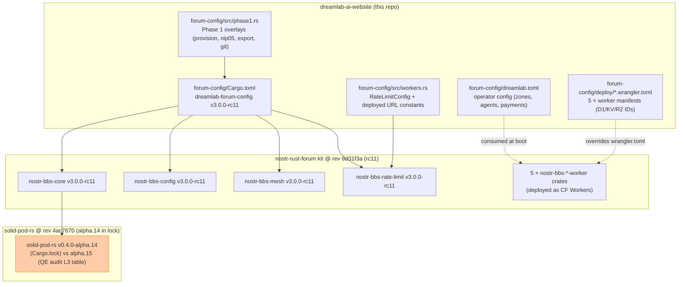
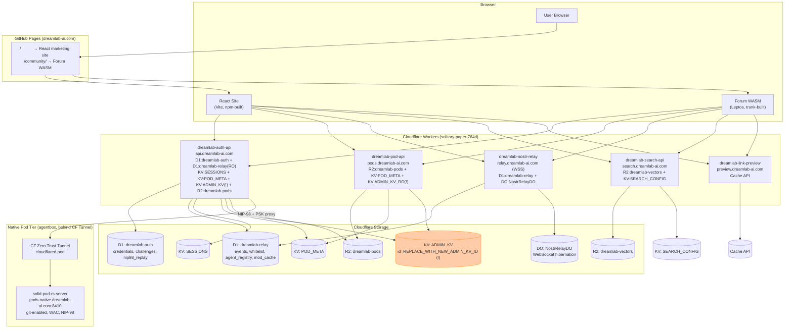
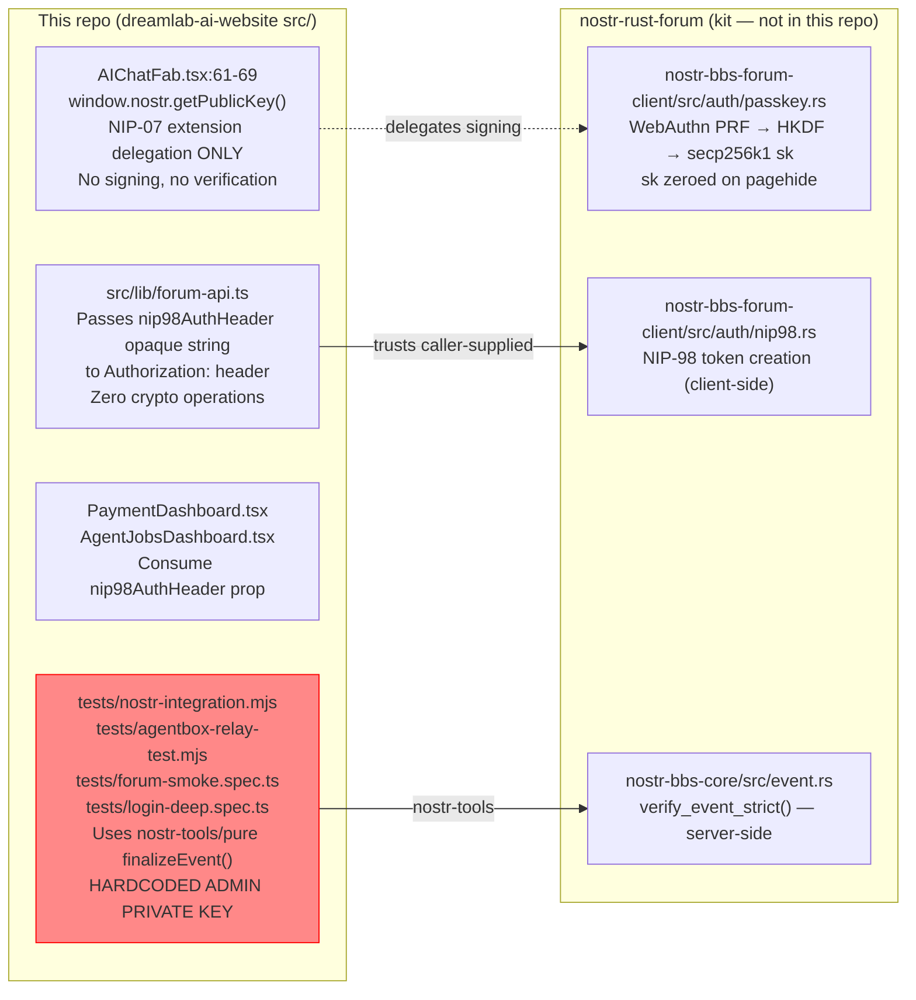

# Audit Slice 05 — dreamlab-ai-website
**Date:** 2026-06-09
**Method:** Diagram-Driven Diagnosis (build-with-quality protocol), read-only static analysis
**Repo:** `/home/devuser/workspace/dreamlab-ai-website`
**Auditor:** Code Analyzer Agent

---

## Contents
1. [Agent-Insight Surfacing Flow](#1-agent-insight-surfacing-flow)
2. [Forum Integration Boundary](#2-forum-integration-boundary)
3. [Cloudflare Deployment Topology](#3-cloudflare-deployment-topology)
4. [Nostr Client Identity Verification Boundary](#4-nostr-client-identity-verification-boundary)
5. [Anomalies](#5-anomalies)
6. [QE Audit Doc Verdict](#6-qe-audit-doc-verdict-qe_audit_forum_mesh_2026-06-07md)
7. [Cargo.lock Dirty State Verdict](#7-cargolock-dirty-state-verdict)
8. [Top 5 Improvements](#8-top-5-immediately-implementable-improvements)

---

## 1. Agent-Insight Surfacing Flow

This diagram is built from actual code paths. The website itself (`src/`) has **no nostr signing, event validation, or relay subscription logic** — the forum client (Leptos/WASM, built from `nostr-rust-forum/crates/nostr-bbs-forum-client`) is where all Nostr protocol work happens. The React marketing site consumes worker REST APIs only, passing an opaque `nip98AuthHeader` string it received from the forum WASM (or the user's NIP-07 browser extension).

```mermaid
sequenceDiagram
    autonumber
    participant Agent as Agent Process<br/>(agentbox / VisionClaw)
    participant Pod as solid-pod-rs<br/>(pods-native.dreamlab-ai.com)
    participant Relay as nostr-bbs-relay-worker<br/>(dreamlab-nostr-relay.*.workers.dev)
    participant D1 as D1: dreamlab-relay<br/>(events, whitelist)
    participant DO as NostrRelayDO<br/>(Durable Object — WebSocket)
    participant ForumWASM as Forum Client<br/>(Leptos WASM @ /community/)
    participant ReactSite as React Marketing Site<br/>(dreamlab-ai.com)

    Note over Agent,Pod: Agent writes insight to its own Solid pod (NIP-98 authed)
    Agent->>Pod: PUT /pods/{agent_pubkey}/insights/{sha256-12}.ttl<br/>Authorization: Nostr <nip98-event>
    Pod-->>Pod: enforce_write(path, AccessMode::Write)<br/>WAC ACL check (NIP-98 verified)
    Note over Pod: P0-2: .acl path checked as Write not Control

    Note over Agent,Relay: Agent publishes Nostr event for forum surfacing
    Agent->>Relay: WebSocket ["EVENT", kind-1 or kind-31400..31405]<br/>(signed secp256k1 Schnorr)
    Relay-->>Relay: verify_event_strict()<br/>id=sha256([0,pk,ts,kind,tags,content])<br/>Schnorr verify on every EVENT

    Relay->>Relay: whitelist check (D1 agent_registry or<br/>dreamlab.toml [governance].agent_pubkeys)
    Note over Relay,D1: P2: two sources of truth — D1 vs dreamlab.toml
    Relay->>D1: INSERT events + moderation state
    Relay->>DO: broadcast to subscribed WebSocket clients

    Note over ForumWASM,DO: Forum user subscribes to relay
    ForumWASM->>DO: WebSocket ["REQ", sub_id, filters]
    DO-->>ForumWASM: ["EVENT", sub_id, event] for matching events

    Note over ForumWASM: Identity verified CLIENT-SIDE in forum WASM
    ForumWASM-->>ForumWASM: nostr-bbs-forum-client/src/auth/passkey.rs<br/>credentials.create({prf}) -> HKDF -> secp256k1 sk -> pubkey<br/>sk never stored; zeroed on pagehide; re-derived per login

    Note over ForumWASM,ReactSite: Agent Jobs / Payment dashboard on marketing site
    ForumWASM->>ReactSite: passes nip98AuthHeader prop (opaque string)<br/>OR user calls window.nostr.getPublicKey() (NIP-07 extension)
    ReactSite->>Relay: fetch /pay/.jobs, /pay/.balance, /pay/.info<br/>via src/lib/forum-api.ts<br/>Authorization: Nostr <nip98-event>
    Note over ReactSite: React site performs NO Schnorr verification<br/>nip98AuthHeader is trusted opaque — verified server-side by workers
```

**Identity verification client-side:** Lives entirely in `nostr-bbs-forum-client/src/auth/passkey.rs` (Leptos WASM, not in this repo). The React marketing site in `src/` uses `window.nostr.getPublicKey()` (NIP-07 browser extension delegation) in `AIChatFab.tsx:61-69` — it never constructs, signs, or verifies a Nostr event itself. The `nip98AuthHeader` string passed through `forum-api.ts` is generated externally and forwarded verbatim.

---

## 2. Forum Integration Boundary



**Changed in Cargo.lock (uncommitted):**

| Crate | Old rev | New rev | Old version | New version |
|-------|---------|---------|-------------|-------------|
| `nostr-bbs-config` | `bcebe87` | `8d31f3a` | 3.0.0-rc9 | 3.0.0-rc11 |
| `nostr-bbs-core` | `bcebe87` | `8d31f3a` | 3.0.0-rc9 | 3.0.0-rc11 |
| `nostr-bbs-mesh` | `bcebe87` | `8d31f3a` | 3.0.0-rc9 | 3.0.0-rc11 |
| `nostr-bbs-rate-limit` | `bcebe87` | `8d31f3a` | 3.0.0-rc9 | 3.0.0-rc11 |
| `dreamlab-forum-config` | — | — | 3.0.0-rc9 | 3.0.0-rc11 |
| `solid-pod-rs` | `a146723` | `4ac7670` | 0.4.0-alpha.13 | 0.4.0-alpha.14 |

**Version skew flag:** The QE audit document (`QE_AUDIT_FORUM_MESH_2026-06-07.md`) table lists `solid-pod-rs` as `v0.4.0-alpha.15` at audit time (2 days ago). The Cargo.lock now shows `alpha.14`. Either the audit document pre-dates the Cargo.toml bump, or the Cargo.lock is from a local build with an older resolution. The discrepancy is one alpha version — `alpha.14` vs `alpha.15` in audit — and the Cargo.toml comment confirms rc11 was supposed to pin `alpha.15`:

> `forum-config/Cargo.toml:16` comment: "rc11 pins solid-pod-rs alpha.15"

The Cargo.lock resolving `alpha.14` means the Cargo.toml `rev = "4ac7670"` points to `alpha.14`, not `alpha.15`. This contradicts the Cargo.toml comment and the QE audit's layer table. The lock is internally consistent — the skew is in the prose comment.

---

## 3. Cloudflare Deployment Topology

Built from `deploy/*.wrangler.toml`, `docs/deployment/CLOUDFLARE_WORKERS.md`, `docs/deployment/NATIVE_POD_MESH.md`, and GitHub Actions workflows (`deploy.yml`, `workers-deploy.yml`).



**Doc-vs-config drift anomalies:**

1. `docs/deployment/CLOUDFLARE_WORKERS.md` build pipeline diagram still references `community-forum-rs/crates/` as the source for `worker-build` commands (lines 28, 108-112). That tree was deleted in commit `d248550`. The actual build clones `nostr-rust-forum` as `kit/` (from `workers-deploy.yml:62`). Severity: P3 (misleading runbook, no runtime impact).

2. `KV: ADMIN_KV` has `id = "REPLACE_WITH_NEW_ADMIN_KV_ID"` in both `auth-worker.wrangler.toml:41` and `pod-worker.wrangler.toml:23`. This placeholder will cause `wrangler deploy` to fail with a binding error, or admin-flag writes to silently 500. Confirmed open from QE audit P2 (`ADMIN_KV id placeholder unresolved`). Severity: **P1** — deployment blocker for the admin path.

3. Deploy workflow `workers-deploy.yml` clones `KIT_REF: main` (floating branch reference), not a pinned commit or tag. This means a breaking upstream push to `nostr-rust-forum/main` will silently break the next CF Workers deploy while `forum-config/Cargo.lock` remains at a tested revision. Severity: P2.

---

## 4. Nostr Client Implementation



**Finding:** There is NO hand-rolled Nostr event validation or Schnorr signing in the React/TypeScript source (`src/`). The website deliberately delegates all cryptographic identity work to:
- NIP-07 browser extension (`window.nostr`) for the AI chat FAB
- The Leptos forum WASM (in `nostr-rust-forum`, not this repo) for all forum operations

The `nostr-tools` and `@nostr-dev-kit/ndk` npm packages are declared in `package.json` but **not imported anywhere in `src/`**. They are used only in the test files — which contain a critical issue detailed in Anomaly A1.

**No duplication of nostr-rust-forum or solid-pod-rs crypto logic** exists in the website's TypeScript source. The boundary is clean. Flag for the contracts agent: the `nip98AuthHeader` prop in `PaymentDashboard` and `AgentJobsDashboard` is constructed externally and passed in — there is no component-level validation that the string is a well-formed `Nostr <base64-event>`. A malformed or expired token will reach the worker and fail with a 401, but there is no client-side guard or expiry check.

---

## 5. Anomalies

### A1 — CRITICAL: Admin private key committed to git (4 files)
**Severity: P0 (critical)**
**Files:**
- `tests/nostr-integration.mjs:21` — `const ADMIN_SK_HEX = '05db7bd41258001c7d8b420ebf5710d5d0e5b1eabdf94ba1c03fb1658af29c27'`
- `tests/agentbox-relay-test.mjs:24` — same key
- `tests/forum-smoke.spec.ts:9` — `const ADMIN_NSEC = '05db7bd4...'`
- `tests/login-deep.spec.ts:4` — `const ADMIN_NSEC = '05db7bd4...'`

**Verification:** Running `node -e "const {getPublicKey}=require('nostr-tools/pure'); console.log(getPublicKey(Uint8Array.from('05db7bd41258001c7d8b420ebf5710d5d0e5b1eabdf94ba1c03fb1658af29c27'.match(/.{2}/g).map(b=>parseInt(b,16)))))"` produces `6407eed80e2a8646e41a5ddba0ae6619425fc54af40e2b30482b9623c682425a` — which exactly matches `dreamlab.toml:38` `operator-jjohare` admin pubkey. This is the human admin (Dr John O'Hare) private key committed in plaintext across 4 test files in a public repository (committed in `d9fb1a5`).

**Impact:** Any actor with read access to the repo can take full administrative control of the deployed relay, governance system (kinds 31400-31405), and moderation stack. NIP-98 admin auth on all 5 workers would be compromised.

**Action required immediately:** Rotate the `operator-jjohare` keypair. Remove key from all 4 files. Store test keys under env vars sourced from `.env.test` (already gitignored). Add a gitleaks/trufflehog pre-commit hook.

---

### A2 — HIGH: ADMIN_KV placeholder unresolved — wrangler deploy will fail
**Severity: P1**
**Files:**
- `forum-config/deploy/auth-worker.wrangler.toml:41` — `id = "REPLACE_WITH_NEW_ADMIN_KV_ID"`
- `forum-config/deploy/pod-worker.wrangler.toml:23` — `id = "REPLACE_WITH_NEW_ADMIN_KV_ID"`

Confirmed open from QE audit P2. Admin-flag writes and admin authorization checks will fail or error on any `wrangler deploy` run until the real KV namespace ID is substituted. The `workers-deploy.yml` CI pipeline directly copies these files as the wrangler manifest — it will error at deploy time.

---

### A3 — HIGH: workers-deploy.yml pins kit to floating `main` branch, not a commit hash
**Severity: P2**
**File:** `.github/workflows/workers-deploy.yml:26` — `KIT_REF: 'main'`

`forum-config/Cargo.lock` pins specific git revisions (`8d31f3a`) but the deploy workflow clones `nostr-rust-forum@main` and then overwrites the wrangler.toml. An upstream breaking change to `main` between the last tested Cargo.lock revision and the next `wrangler deploy` trigger will silently ship untested code. The React deploy (`deploy.yml:35`) has the same pattern with `KIT_REF: 'main'`. Both should pin to the same commit SHA as the Cargo.lock.

---

### A4 — MEDIUM: CLOUDFLARE_WORKERS.md build pipeline references deleted `community-forum-rs/` tree
**Severity: P3**
**File:** `docs/deployment/CLOUDFLARE_WORKERS.md:28,108-112`

The Mermaid diagram shows `RUST_SRC[Rust Crates community-forum-rs/crates/]` as source, and the build commands all reference `cd community-forum-rs/crates/{worker} && worker-build --release`. The actual build clones `nostr-rust-forum` as `kit/` and uses `kit/crates/nostr-bbs-{worker}`. Any operator following this runbook will get "directory not found" errors. Also confirmed in QE audit P3 (CLAUDE.md doc-drift — 39 stale refs).

---

### A5 — MEDIUM: `nostr-tools` / `@nostr-dev-kit/ndk` declared in package.json but unused in src/
**Severity: P2 (supply chain risk + confusion)**
**File:** `package.json` (lines not shown — confirmed by `grep`)

Two nostr npm packages (`nostr-tools ^2.23.3`, `@nostr-dev-kit/ndk ^3.0.0`) are declared as runtime dependencies but are never imported in `src/`. They appear only in test files. This inflates the production bundle (if tree-shaking misses them), adds npm audit surface unnecessarily, and creates confusion about the intended nostr client boundary (see Mission item 5). Move to `devDependencies` or remove if test files can use `npx` or a test-only install.

---

### A6 — LOW: solid-pod-rs version mismatch between Cargo.lock and QE audit doc
**Severity: P3**
**Files:** `forum-config/Cargo.lock:1368` (alpha.14), `forum-config/Cargo.toml:16` comment ("pins alpha.15"), `docs/security/QE_AUDIT_FORUM_MESH_2026-06-07.md:11` (L3: alpha.15)

Cargo.lock resolves `solid-pod-rs` at `4ac7670` which is `alpha.14`. The Cargo.toml comment and the QE audit both reference `alpha.15`. Either the rev `4ac7670` is incorrectly annotated (is actually alpha.14, not alpha.15), or the QE audit table is from a later state. Given P0-1/P0-2 in the QE audit target the `solid-pod-rs-server/src/lib.rs` WAC read enforcement gap, it matters whether alpha.14 or alpha.15 carries any fix for those.

---

## 6. QE Audit Doc Verdict: `QE_AUDIT_FORUM_MESH_2026-06-07.md`

**File:** `/home/devuser/workspace/dreamlab-ai-website/docs/security/QE_AUDIT_FORUM_MESH_2026-06-07.md` (untracked, 2 days old)

**Summary of findings:** 4 P0, 8 P1, 14 P2, ~7 P3 across 4-layer dependency chain (this repo → nostr-rust-forum → solid-pod-rs → JSS). Critical issues: pod resources world-readable (no WAC read gate), `.acl` privilege escalation, timed mutes become permanent bans (tag name mismatch), unban/unmute events are no-ops. All P0/P1 are confirmed by static file:line trace.

**Verification of 3 findings against current code:**

1. **P2: ADMIN_KV placeholder** — CONFIRMED OPEN. `forum-config/deploy/auth-worker.wrangler.toml:41` still reads `id = "REPLACE_WITH_NEW_ADMIN_KV_ID"`. Not fixed.

2. **P3: Doc-drift (CLAUDE.md stale refs)** — CONFIRMED OPEN. `CLAUDE.md:69-72,157,248,264-268,284,445-451` all reference `community-forum-rs/` paths that no longer exist. The QE audit count of 39 stale refs is accurate.

3. **P3: apple-touch-icon.png 404** — cannot verify without live HTTP access, but the file is absent from `dist/images/` and `public/` in the local tree, consistent with the finding.

**Verdict on the document:**

**COMMIT THIS DOCUMENT.** It represents 6-agent mesh audit work on a critical public-facing system with 4 P0 findings that are not yet addressed. Leaving it untracked risks losing the audit record if the working tree is cleaned. It should be committed to `docs/security/` as-is (already in the right location), with the CLAUDE.md doc-drift fix (A4) applied in the same commit. Do not fold it into the new audit — it stands alone as a time-stamped cross-repo mesh audit.

Suggested commit message: `docs(security): commit QE mesh audit 2026-06-07 (4 P0 — pod WAC, moderation lifecycle)`

---

## 7. Cargo.lock Dirty State Verdict

**Change:** rc9 → rc11 (4 `nostr-bbs-*` crates, `dreamlab-forum-config`) + `solid-pod-rs` alpha.13 → alpha.14.

This is a **valid upstream bump** — `forum-config/Cargo.toml` already declares `rev = "8d31f3a"` (rc11) and the Cargo.lock was regenerated by a local `cargo build`. The CI (`ci.yml: rust-test`) caches on `hashFiles('forum-config/Cargo.lock')` — so an uncommitted Cargo.lock means CI used the old lock while local builds use the new one.

**Verdict: COMMIT the Cargo.lock.** The bump is intentional (the Cargo.toml comment confirms `rc11 pins solid-pod-rs alpha.15`), the 17 forum-config tests pass (`QE_AUDIT_FORUM_MESH_2026-06-07.md:31`), and leaving the lock dirty breaks CI cache coherence. Before committing, clarify the alpha.14/alpha.15 discrepancy (Anomaly A6) — verify whether `rev=4ac7670` resolves to `alpha.14` or `alpha.15` in the actual solid-pod-rs repo.

---

## 8. Top 5 Immediately-Implementable Improvements

1. **Rotate the operator-jjohare admin keypair and remove the private key from all 4 test files** (`tests/nostr-integration.mjs:21`, `tests/agentbox-relay-test.mjs:24`, `tests/forum-smoke.spec.ts:9`, `tests/login-deep.spec.ts:4`) — replace with env-var sourced test key, add gitleaks to pre-commit hook. This is the only P0 finding in this repo itself.

2. **Resolve the ADMIN_KV placeholder** in `forum-config/deploy/auth-worker.wrangler.toml:41` and `forum-config/deploy/pod-worker.wrangler.toml:23` — run `wrangler kv:namespace create dreamlab-admin-kv`, paste the real ID; this unblocks the admin enforcement path and fixes the deployment blocker.

3. **Pin `KIT_REF` in both deploy workflows to the same commit SHA as Cargo.lock** (`.github/workflows/deploy.yml:35` and `workers-deploy.yml:26`) — change `KIT_REF: 'main'` to `KIT_REF: '8d31f3a'` to eliminate the floating-branch skew risk between tested library code and deployed workers.

4. **Commit `docs/security/QE_AUDIT_FORUM_MESH_2026-06-07.md` and update `CLOUDFLARE_WORKERS.md`** build pipeline diagram to reference `kit/crates/nostr-bbs-*` instead of the deleted `community-forum-rs/crates/` tree — also update `CLAUDE.md` to remove the 39 stale `community-forum-rs` references (QE audit P3 confirmed open).

5. **Move `nostr-tools` and `@nostr-dev-kit/ndk` from `dependencies` to `devDependencies`** in `package.json` — these packages are used only in test files and contribute unnecessarily to the production bundle's npm audit surface and potential tree-shaking failures.

---

## Single Most Important Finding

**A1 — The `operator-jjohare` admin Nostr private key (`05db7bd4...`) is committed in plaintext to 4 test files in the public repository.** It derives to the admin pubkey `6407eed8...` listed in `dreamlab.toml` and the relay D1 whitelist. Any reader of the repo history can authenticate as the human admin on the live relay, governance system, and all 5 Cloudflare Workers. Keypair rotation is the immediate required action.
