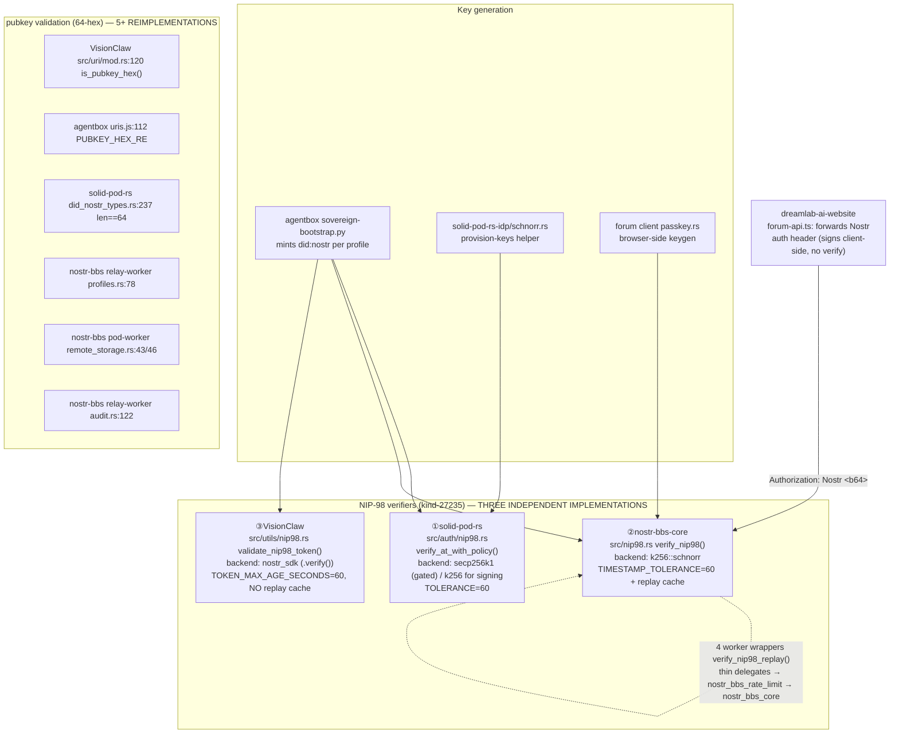
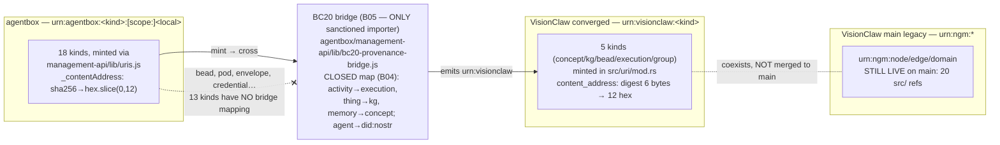

# 06 — Cross-Repo Contracts Cartography

**Audit**: 2026-06-09 DreamLab Ecosystem (Diagram-Driven Diagnosis / build-with-quality)
**Scope**: READ-ONLY. The contracts that bind VisionClaw, agentbox, solid-pod-rs, nostr-rust-forum, dreamlab-ai-website.
**Cartographer concern**: identity mesh, URN grammar convergence, version skew, beads, content addressing.

Repo states at audit time:

| Repo | Path | HEAD / version |
|---|---|---|
| VisionClaw | `/home/devuser/workspace/project` | branch `main`, submodule `agentbox` **dirty** (` M agentbox`) |
| agentbox | `…/project/agentbox` | HEAD `2130d52e` |
| solid-pod-rs | `…/solid-pod-rs` | HEAD `b81ce9f` (`Cargo.toml` says `0.4.0-alpha.15`; **untagged**, highest git tag is `alpha.11`) |
| nostr-rust-forum | `…/nostr-rust-forum` | consumed by website at rev `8d31f3a` (`3.0.0-rc11`) |
| dreamlab-ai-website | `…/dreamlab-ai-website` | consumer overlay (`forum-config/`) |

---

## (a.1) Identity Mesh — `did:nostr:<64-hex BIP-340 x-only>`

**Mesh participants (5 claimed in agentbox CLAUDE.md):**
solid-pod-rs (NIP-98 auth ①), nostr-rust-forum (event signing + NIP-98 ②), VisionClaw (graph governance + NIP-98 ③), dreamlab-ai-website (forum config; **signs only, never verifies** — correctly so), code-as-harness (mints via `uris.js`, no own crypto). The identity primitive (`did:nostr:<64-hex>`) is shared. The **verification logic is forked three ways**.

## (a.2) URN Tri-Grammar + BC20 Bridge

**State of VisionClaw main NOW**: BOTH grammars are live in `src/`. `urn:visionclaw` appears in **50** lines (converged minter `src/uri/mod.rs` is present and used); legacy `urn:ngm` appears in **20** lines. The CLAUDE.md claim that "main still carries the legacy scheme" is **half true** — the converged `src/uri/mod.rs` has already landed on main alongside the legacy refs. This is mid-migration drift, not a clean legacy state.

## (a.3) Version-Skew Matrix

| Consumer | Consumes | Pinned as | Actual code state | Skew |
|---|---|---|---|---|
| nostr-rust-forum | solid-pod-rs | crates.io `0.4.0-alpha.15` (checksum `a53804d0…`) | **published crate** | Pinned to *registry* alpha.15 |
| agentbox (`lib/solid-pod-rs.nix`) | solid-pod-rs | git rev `b81ce9f` (`srcHash sha256-mWsa…`) | **post-alpha.15 HEAD, untagged** | **Builds DIFFERENT code than the crate of the same version string** |
| dreamlab-ai-website `forum-config` | nostr-rust-forum | git rev `8d31f3a` (`3.0.0-rc11`) | nostr-bbs-* crates | pinned by rev (clean) |
| dreamlab-ai-website `forum-config` | solid-pod-rs (transitive) | via nostr-rust-forum alpha.15 | comments reference alpha.12 + alpha.15 | mixed-version comments |
| VisionClaw main | agentbox (submodule) | `11c8bc5d` | agentbox HEAD is `2130d52e` | **submodule pointer 3 commits behind + working tree dirty** |

**Worst skew**: `0.4.0-alpha.15` denotes **two different code states**. nostr-rust-forum builds the *published* crate `alpha.15` (`a53804d0…`); agentbox builds git HEAD `b81ce9f` which is *post-alpha.15* (`JSS 0.0.204 sync — MCP server, install CLI, NIP-98 minting + re-sync audit`) and carries the same version string. The `alpha.15` git tag **does not exist** — only `alpha.11` is the highest real tag. The `b81ce9f` delta over the published crate includes the NIP-98 minting path and a re-sync audit — these are auth-surface changes that the forum (the other NIP-98 producer) has not absorbed.

## (b) Ranked Anomaly List (duplicate implementations first)

### A1 — THREE independent NIP-98 verifiers (HIGHEST VALUE)
Three separate cryptographic verification implementations of the same kind-27235 contract, on three different crypto stacks. A bug or policy change in one (e.g. timestamp tolerance, payload-hash binding, replay handling) does not propagate.

- **Side 1**: `solid-pod-rs/crates/solid-pod-rs/src/auth/nip98.rs:83-190` (`verify_at_with_policy`, Schnorr/secp256k1 gated, `TIMESTAMP_TOLERANCE=60` line 23, **URL/method policy: `Strict` vs `GitLenient`** — unique to this impl)
- **Side 2**: `nostr-rust-forum/crates/nostr-bbs-core/src/nip98.rs:306` (`verify_nip98`, `k256::schnorr` line 55, `TIMESTAMP_TOLERANCE=60` line 65, **has replay cache** `REPLAY_CACHE_TTL_SECS` line 71)
- **Side 3**: `project/src/utils/nip98.rs:206` (`validate_nip98_token`, `nostr_sdk` line 11, `TOKEN_MAX_AGE_SECONDS=60` line 159, **NO replay cache**, uses `event.verify()` line 299)

Divergence already visible: only Side 2 has a replay cache; only Side 1 has the `GitLenient` URL-prefix/`*`-method policy. Side 3's age check (`age = now - created_at`, line 234) is **one-sided** — rejects old tokens but a clock-skewed future token (`created_at > now`) yields negative age that passes, whereas Sides 1&2 use `abs_diff`/symmetric windows. **That is a live divergence bug in VisionClaw's verifier.**

### A2 — pubkey validation (`64-hex`) reimplemented 5+ times
Same predicate (`len()==64 && all hex`), independently authored. Drift risk: case sensitivity. VisionClaw `is_pubkey_hex` (`src/uri/mod.rs:120`) accepts **lowercase only** (`b'a'..=b'f'`); nostr-bbs `profiles.rs:78` and pod-worker `remote_storage.rs:43` accept **mixed case** (`is_ascii_hexdigit()`). A pubkey valid in the forum can be rejected by VisionClaw's URN minter.

- `project/src/uri/mod.rs:120` (lowercase-only) vs
- `nostr-rust-forum/crates/nostr-bbs-relay-worker/src/profiles.rs:78` (mixed-case) and `…/nostr-bbs-pod-worker/src/remote_storage.rs:43,46`, `…/relay-worker/src/audit.rs:122` (mixed-case) vs
- `solid-pod-rs/crates/solid-pod-rs/src/did_nostr_types.rs:237` (`len()==64` only) vs
- `agentbox/management-api/lib/uris.js:112` `PUBKEY_HEX_RE = /^[0-9a-f]{64}$/` (lowercase-only)

### A3 — `bead` kind exists on both sides but is UNMAPPED in BC20 and the two representations are structurally incompatible
- agentbox: `uris.js:103` — `bead: { ownerScope:true, scopeRequired:true, contentAddressed:**false**, resolvableSurface:'beads' }` → mints `urn:agentbox:bead:<pubkey>:<slug-localId>`
- VisionClaw: `src/uri/mod.rs:52,66` — `bead` is `urn:visionclaw:bead:<pubkey>:<sha256-12>` → **content-addressed**
- BC20 bridge: `bc20-provenance-bridge.js` `AGENTBOX_TO_VISIONCLAW` map (lines 43-50) contains only `activity→execution, thing→kg, memory→concept` (+ `agent→did:nostr` special case). **`bead` is absent** — an agentbox bead crossing the federation boundary is dropped+logged (B04), never mapped. The two bead grammars also can't round-trip: agentbox beads use an opaque slug local; VisionClaw beads use a content hash. No deterministic conversion exists. **No third bead implementation found** in solid-pod-rs or nostr-rust-forum (only `is-envelope` test fixtures matched the regex — false positives).

### A4 — `0.4.0-alpha.15` version string aliases two code states
`solid-pod-rs/Cargo.toml` declares `0.4.0-alpha.15` at git HEAD `b81ce9f`, but the published crate `alpha.15` (checksum `a53804d0…`, consumed by nostr-rust-forum) is an *earlier* snapshot. agentbox's `lib/solid-pod-rs.nix:43-47` explicitly acknowledges this ("Pinned to public HEAD `b81ce9f`, post-alpha.15; Cargo.toml still labels 0.4.0-alpha.15"). Two consumers think they share a version; they build different auth code.

### A5 — VisionClaw submodule pointer stale + dirty
`git ls-tree HEAD agentbox` → `11c8bc5d`; agentbox HEAD → `2130d52e` (3 commits ahead: full stack update incl. solid-pod-rs HEAD bump, skill-tuning, nostr-pod-bridge identity wiring). Working tree shows ` M agentbox` (uncommitted submodule move). VisionClaw main is pinned to an agentbox that predates the solid-pod-rs `b81ce9f` bump — so the VisionClaw-pinned agentbox and the standalone agentbox disagree on which solid-pod-rs they build.

### A6 — content addressing: VERIFIED CONSISTENT (low risk, one caveat)
Truncation logic is byte-for-byte equal across the three minters: take SHA-256, first 6 bytes / first 12 lowercase-hex chars, prefix `sha256-12-`.
- VisionClaw `src/uri/mod.rs:124-135` (`content_address`, 6 bytes → 12 hex, lowercase nibble)
- agentbox `uris.js:275-284` (`_contentAddress`: `createHash('sha256')…digest('hex').slice(0,12)`)
- BC20 `bc20-provenance-bridge.js:57-58` (same `.slice(0,12)`)

**Caveat — pre-image divergence**: the *bytes hashed* differ. agentbox `_contentAddress` hashes `_stableStringify(payload)` (sorted-key JSON, explicitly "deterministic enough, not RFC 8785", uris.js:275 comment). VisionClaw `content_address` hashes raw caller-supplied bytes. The same logical object hashed on each side produces **different** `sha256-12` addresses unless the caller pre-canonicalises identically. Dedup is safe *within* each repo but **cross-repo content-address equality is not guaranteed** — and BC20's `execution`/`kg` crossings deliberately re-hash the agentbox URN string (`sha12(agentboxUrn)`, line 110) rather than the payload, side-stepping this but breaking content-identity (the VisionClaw `execution` address no longer equals a hash of the execution content).

## (c) TOP 5 Immediately-Implementable Cross-Repo Improvements

1. **Extract one NIP-98 verifier crate** (`dreamlab-nip98`), publish it, and have solid-pod-rs, nostr-bbs-core, and VisionClaw `src/utils/nip98.rs` all depend on it — collapsing A1's three forks. Immediate partial win: **fix VisionClaw's one-sided age check** (`src/utils/nip98.rs:234`) to use a symmetric `abs_diff` window matching the other two (a 1-line change that closes a future-timestamp replay gap today).

2. **Add `bead` to the BC20 closed map** and reconcile the representation: make agentbox `bead` `contentAddressed: true` (`uris.js:103`) so it matches VisionClaw's `bead:<pubkey>:<sha256-12>`, then add `bead↔bead` to `AGENTBOX_TO_VISIONCLAW` + reverse. Closes A3 (beads currently silently dropped at the boundary).

3. **Tag solid-pod-rs `b81ce9f` as a real version** (e.g. `v0.4.0-alpha.16` or `-rc`) and bump nostr-rust-forum off the registry `alpha.15` onto that git rev — so all consumers build identical auth code. Resolves A4 + the unabsorbed NIP-98-minting delta.

4. **Commit the VisionClaw submodule bump** to `2130d52e` (or deliberately pin + document why behind) so the dirty ` M agentbox` and the 3-commit lag are resolved; the lag currently means VisionClaw and standalone agentbox build different solid-pod-rs. (A5)

5. **Promote `is_pubkey_hex` to a shared validator and standardise case**: pick lowercase-only (BIP-340 canonical x-only hex is lowercase) and make the 6 reimplementations call it, OR at minimum normalise-to-lowercase before compare so the forum's mixed-case acceptance can't mint pubkeys VisionClaw rejects. (A2)

---

## RETURN SUMMARY

- **Duplicate-implementation count**: 3 independent NIP-98 verifiers (solid-pod-rs `secp256k1`, nostr-bbs-core `k256`, VisionClaw `nostr_sdk`) + pubkey-hex validation reimplemented in 6 places (2 of which accept mixed-case, diverging from the 4 lowercase-only). Content-addressing truncation is consistent but pre-image canonicalisation is NOT.
- **Worst version skew**: `solid-pod-rs 0.4.0-alpha.15` aliases two different code states — nostr-rust-forum builds the published crate (`a53804d0…`), agentbox builds post-alpha.15 git HEAD `b81ce9f` (which adds NIP-98 minting the forum hasn't absorbed). The `alpha.15` git tag doesn't even exist (highest is `alpha.11`).
- **Top 5 improvements**: (1) extract one shared NIP-98 crate + fix VisionClaw's one-sided age check now; (2) add `bead` to BC20 map and make agentbox beads content-addressed; (3) tag solid-pod-rs `b81ce9f` and repin the forum onto it; (4) commit the dirty/stale VisionClaw agentbox submodule pointer; (5) share one cased `is_pubkey_hex` validator.
- **Single most important finding**: There is **no single source of truth for NIP-98 verification** — the auth contract that underpins the entire `did:nostr` identity mesh is forked three ways across three crypto stacks, and they have already drifted (replay cache present in only one, `GitLenient` policy in only one, and a one-sided timestamp check in VisionClaw's that admits future-dated tokens). The identity mesh's keystone contract is its least-governed code.
