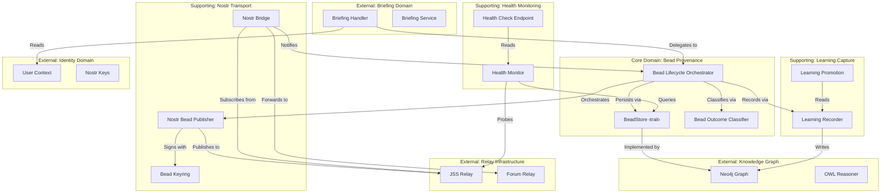
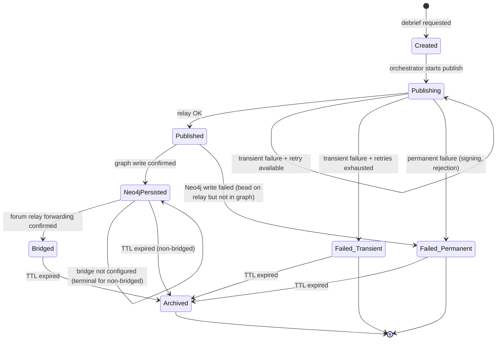

# DDD Analysis: Bead Provenance Bounded Context

## 1. Bounded Context Map



### Context Relationships

| Upstream | Downstream | Pattern | State |
|----------|-----------|---------|-------|
| Briefing Domain | Bead Provenance | Customer-Supplier | Handler calls orchestrator |
| Identity Domain | Bead Provenance | Conformist | Reads UserContext.pubkey directly |
| Bead Provenance | Knowledge Graph | Open Host Service | BeadStore trait abstracts Neo4j |
| Bead Provenance | Relay Infrastructure | ACL (Anti-Corruption Layer) | Publisher wraps raw WebSocket |
| Health Monitoring | Bead Provenance | Partnership | Health probes relay and store |
| Learning Capture | Knowledge Graph | Open Host Service | Writes :BeadLearning via store |

---

## 2. Aggregates

### Bead Aggregate (Root)

The `Bead` is the aggregate root. All state changes flow through it. External systems reference beads by `bead_id`.

```
Bead (Aggregate Root)
├── bead_id: BeadId (Value Object)
├── brief_id: BriefId (Value Object)
├── metadata: BeadMetadata (Entity)
├── state: BeadState (Value Object — FSM)
├── outcome: Option<BeadOutcome> (Value Object)
├── nostr_event: Option<NostrEventRef> (Value Object)
├── learnings: Vec<BeadLearning> (Entity collection)
└── timestamps: BeadTimestamps (Value Object)
```

**Invariants:**
- A bead cannot transition to `Published` without a valid `nostr_event_id`.
- A bead in `Failed(Permanent)` state cannot be retried.
- A bead cannot have learnings without first reaching `Published` state.
- `bead_id` is immutable after creation.
- State transitions must follow the FSM — no arbitrary jumps.

### BeadLearning Entity

Lives within the Bead aggregate. Created after successful publish when agent reasoning is available.

```
BeadLearning
├── bead_id: BeadId (foreign key to aggregate root)
├── what_worked: Option<String>
├── what_failed: Option<String>
├── reusable_pattern: Option<String>
├── confidence: Confidence (Value Object, 0.0..=1.0)
└── recorded_at: DateTime<Utc>
```

---

## 3. Value Objects

| Value Object | Type | Invariants |
|-------------|------|------------|
| `BeadId` | `String` | Non-empty, valid as Nostr `d` tag |
| `BriefId` | `String` | Non-empty, references existing brief |
| `BeadState` | Enum (7 variants) | FSM transitions enforced |
| `BeadOutcome` | Enum (7 variants) | Exhaustive — no wildcard |
| `BeadFailure` | Enum (2 variants) | `Transient` or `Permanent` |
| `Confidence` | `f32` | Clamped to `0.0..=1.0` |
| `NostrEventRef` | `{ id: String, pubkey: String }` | Valid hex, 64 chars |
| `BeadTimestamps` | Struct | `created_at` always set; others optional, monotonically increasing |
| `RetryConfig` | Struct | `max_attempts >= 1`, `base_delay_ms > 0` |

---

## 4. Domain Events

Events emitted by the Bead aggregate, consumed by other bounded contexts:

| Event | Trigger | Consumers |
|-------|---------|-----------|
| `BeadCreated { bead_id, brief_id, user_pubkey }` | Debrief requested | Store, Health Monitor |
| `BeadPublished { bead_id, nostr_event_id }` | Relay accepted event | Store, Bridge |
| `BeadPersisted { bead_id }` | Neo4j write confirmed | Health Monitor |
| `BeadBridged { bead_id }` | Forum relay accepted | Store |
| `BeadFailed { bead_id, outcome }` | Terminal failure | Store, Health Monitor, Alerting |
| `BeadRetrying { bead_id, attempt, delay_ms }` | Transient failure, retrying | Health Monitor |
| `BeadArchived { bead_id }` | TTL expired | Store |
| `BeadLearningRecorded { bead_id, confidence }` | Learning entry created | Store |

---

## 5. State Machine



**Transition Rules:**
- `Created → Publishing`: Only via `BeadLifecycleOrchestrator.publish()`
- `Publishing → Publishing` (retry): Only if `retry_count < config.max_attempts` AND failure is `Transient`
- `Publishing → Failed_Transient`: When `retry_count >= config.max_attempts` and all failures were transient
- `Publishing → Failed_Permanent`: Immediately on `SigningFailed` or `RelayRejected`
- `Published → Neo4jPersisted`: After successful `BeadStore::update_state()` call
- `Neo4jPersisted → Bridged`: Bridge notifies orchestrator via channel after forum relay confirms
- `* → Archived`: Background archival worker runs on configurable interval

---

## 6. Ports and Adapters

### Ports (Interfaces)

| Port | Direction | Interface |
|------|-----------|-----------|
| `BeadStore` | Driven (outbound) | Async trait — persistence abstraction |
| `BeadPublisher` | Driven (outbound) | Trait wrapping Nostr relay communication |
| `BeadBridge` | Driven (outbound) | Trait wrapping forum relay forwarding |
| `BeadHealthProbe` | Driven (outbound) | Trait for relay liveness checking |
| `BeadLifecycle` | Driving (inbound) | Orchestrator API called by briefing handler |
| `BeadHealthEndpoint` | Driving (inbound) | HTTP handler for `/api/health/beads` |

### Adapters

| Adapter | Implements | Technology |
|---------|-----------|------------|
| `Neo4jBeadStore` | `BeadStore` | `neo4rs::Graph` with Cypher MERGE |
| `NostrBeadPublisher` | `BeadPublisher` | `tokio-tungstenite` WebSocket to JSS relay |
| `NostrBridge` | `BeadBridge` | `tokio-tungstenite` WebSocket JSS → Forum |
| `WebSocketHealthProbe` | `BeadHealthProbe` | Periodic WebSocket ping to relay |
| `MockBeadStore` | `BeadStore` | In-memory `HashMap` for testing |
| `MockBeadPublisher` | `BeadPublisher` | Configurable success/failure for testing |

---

## 7. Module Structure

```
src/services/
├── bead_types.rs          # BeadState, BeadOutcome, BeadFailure, BeadMetadata, BeadLearning
├── bead_store.rs          # BeadStore trait + Neo4jBeadStore + MockBeadStore
├── bead_lifecycle.rs      # BeadLifecycleOrchestrator (coordinates publish flow)
├── nostr_bead_publisher.rs  # Upgraded: retry, outcomes, keyring (existing file, rewritten)
├── nostr_bridge.rs          # Upgraded: backoff, health, telemetry (existing file, rewritten)
└── mod.rs                   # Updated with new module declarations
```

```
src/handlers/
└── briefing_handler.rs    # Updated: delegates to BeadLifecycleOrchestrator instead of tokio::spawn
```

```
tests/
├── bead_types_test.rs     # FSM transition tests, value object invariants
├── bead_store_test.rs     # Neo4jBeadStore with testcontainers or MockBeadStore
├── bead_lifecycle_test.rs # Orchestrator with mock store + mock publisher
├── bead_publisher_test.rs # Publisher with mock WebSocket
└── bead_bridge_test.rs    # Bridge with mock relays
```

---

## 8. Ubiquitous Language

| Term | Definition |
|------|-----------|
| **Bead** | An immutable provenance record linking a brief, debrief, and acting user via a cryptographically signed Nostr event |
| **Bead Lifecycle** | The state machine a bead traverses: Created → Publishing → Published → Persisted → Bridged → Archived |
| **Bead Outcome** | The typed result of a publish attempt — one of 7 classified variants, never untyped |
| **Transient Failure** | A retryable failure (timeout, connection error) that may succeed on subsequent attempt |
| **Permanent Failure** | A non-retryable failure (signing error, relay rejection) that requires intervention |
| **Learning Entry** | A structured post-bead retrospective capturing what worked, what failed, and reusable patterns |
| **Bridge** | The component that subscribes to JSS relay events and forwards them to the forum relay for wider visibility |
| **Archival** | The process of marking old beads as archived after their TTL expires, with optional Neo4j cleanup |
| **Keyring** | A collection of signing keys supporting rotation — the active key signs, old keys remain for verification |
| **Health Check** | Periodic relay liveness probe reporting connection state, latency, and outcome distribution |

---

## 9. Anti-Corruption Layer Boundaries

### Nostr Transport ACL

The Nostr relay protocol (WebSocket JSON messages, NIP-33 parameterized replaceable events)
is encapsulated behind the `BeadPublisher` and `BeadBridge` traits. Domain code never
constructs raw Nostr events or WebSocket messages directly. This ensures:

- Relay protocol changes don't leak into domain logic
- Testing doesn't require Nostr infrastructure
- Alternative transports (HTTP relay, direct Neo4j, Solid Pod) can be added as adapters

### Neo4j Storage ACL

The Neo4j Cypher query language and `neo4rs` driver are encapsulated behind `BeadStore`.
Domain code operates on `BeadMetadata` and `BeadLearning` structs, never on `Query` objects
or graph traversal results. This ensures:

- Schema changes are localised to `Neo4jBeadStore`
- Testing uses `MockBeadStore` with zero Neo4j dependency
- Future migration to PostgreSQL or Solid Pod requires only a new adapter

### Briefing Domain ACL

The briefing handler passes `bead_id`, `brief_id`, `user_pubkey`, and `debrief_path` as
primitive strings to the lifecycle orchestrator. The provenance context does not import
briefing domain types (`BriefingRequest`, `BriefingService`). Communication is one-way:
briefing creates beads, beads don't influence briefing logic.
