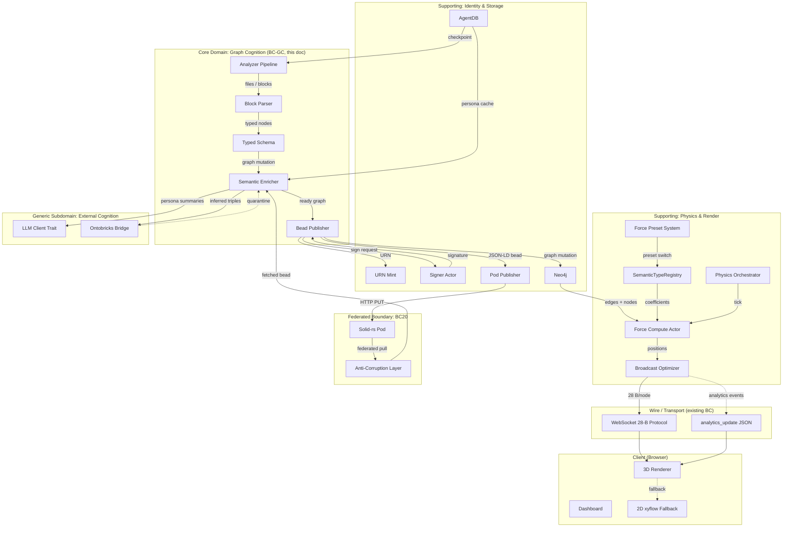
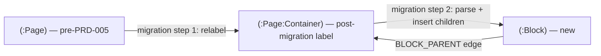

# DDD Analysis: Graph Cognition Bounded Context

> **Related**: [PRD-005](PRD-005-graph-cognition-platform.md) · [ADR-064](adr/ADR-064-typed-graph-schema.md) · [ADR-065](adr/ADR-065-rust-code-analysis-pipeline.md) · [ADR-066](adr/ADR-066-pod-federated-graph-storage.md) · [ADR-067](adr/ADR-067-ontobricks-mcp-bridge.md) · [ADR-068](adr/ADR-068-logseq-block-level-fidelity.md) · [ADR-069](adr/ADR-069-force-preset-system.md) · [ADR-070](adr/ADR-070-cuda-integration-hardening.md)
>
> **Adjacent contexts**: [Binary Protocol](ddd-binary-protocol-context.md) · [Bead Provenance](ddd-bead-provenance-context.md) · [Agentbox Integration (BC20)](ddd-agentbox-integration-context.md) · [QE Traceability Graph](ddd-qe-traceability-graph-context.md)

## 1. Bounded Context Map



## 2. Strategic Patterns

### 2.1 The Cognition Spine

The **Graph Cognition Bounded Context (BC-GC)** is a *cognitive pipeline*: input artifacts (source code, Logseq vaults, Karpathy wikis) flow through a Rust actor mesh and emerge as typed, signed, content-addressed beads in a Solid pod. The spine has six aggregates:

1. **AnalysisSession** — root aggregate of one analyzer run; identifies the work, holds checkpoints.
2. **TypedGraph** — an immutable snapshot of nodes, edges, layers, tour; identified by `urn:agentbox:bead:<owner>:<sha>`.
3. **Block** — Logseq-faithful block-level node aggregate; only coherent within a Logseq-source TypedGraph.
4. **Inference** — proposed triple from external reasoning (ontobricks); never directly authoritative.
5. **PersonaView** — a render-time projection of TypedGraph filtered by persona.
6. **ForcePreset** — physics parameters that govern visual layout; orthogonal to graph identity.

### 2.2 Aggregate boundaries (DDD invariants)

| Aggregate | Invariant | Enforced where |
|-----------|----------|---------------|
| `AnalysisSession` | URN minted at construction; never reused; session phase-state monotonic | `ProjectScannerActor` constructor; `AssembleReviewerActor` validation |
| `TypedGraph` | Every node has a URN; every edge references resolvable URNs; schemaVersion pinned | `SchemaValidatorActor` (ADR-064); JSON-LD validator at pod-write boundary |
| `TypedGraph` | Bead is content-addressed; mutation produces new URN, never overwrites | `BeadPublisherActor` two-phase commit (ADR-066) |
| `Block` | UUID is owner-scoped (`urn:visionclaw:concept:<owner>:block:<id>`); explicit `id::` salted | `LogseqBlockParser` (ADR-068) |
| `Inference` | Lives in `:Quarantine` namespace until user accepts | `OntobricksImporterActor` + UI accept-pane (ADR-067) |
| `PersonaView` | Render-only by default; sparse compute mask is opt-in | `ForceComputeActor` mask-coherence rule (ADR-069 D10, ADR-070 D3.1) |
| `ForcePreset` | Coefficients calibrated against canonical fixture before adoption | CI gate per ADR-069 D3 |

### 2.3 Context relationships

| Relationship | This BC ↔ Other BC | Pattern |
|--------------|-------------------|---------|
| BC-GC ↔ Binary Protocol | Customer / Supplier | BC-GC consumes the 28-B protocol; never proposes changes (ADR-061 invariants I01–I07 preserved) |
| BC-GC ↔ Bead Provenance | Conformist | BC-GC inherits bead grammar; URN minting flows through existing `mint_*` |
| BC-GC ↔ BC20 (Agentbox Federation) | Anti-Corruption Layer | BC20 translates `urn:agentbox:*` peer beads into BC-GC's typed-schema view; rejects unknown kinds from federated origins |
| BC-GC ↔ QE Traceability | Partner | Quality gates from QE BC traceability project apply per-Epic; QE BC publishes `:QualityGate` nodes that BC-GC reads at flag-flip time |
| BC-GC ↔ External Cognition (LLM, ontobricks) | Open-Host Service via trait + MCP | `LLMClient` trait + `ontobricks-bridge` are declared interfaces; provider details opaque |
| BC-GC ↔ XR Bounded Context | Customer / Supplier | XR consumes TypedGraph + PersonaView; supplies dashboard interactions back as `selectNode`, `togglePersona`, etc. |

### 2.4 Layered architecture within BC-GC

```
Application Layer (use cases)
  ├── Analyze project use case
  ├── Federate peer graph use case
  ├── Switch preset use case
  ├── Run incremental update use case
  └── Accept inferred triples use case
  
Domain Layer (aggregates + invariants)
  ├── AnalysisSession aggregate + repository
  ├── TypedGraph aggregate + repository
  ├── Block aggregate + repository
  ├── Inference aggregate (quarantine semantics)
  ├── PersonaView aggregate (read model)
  └── ForcePreset aggregate
  
Infrastructure Layer (adapters)
  ├── Tree-sitter sandboxed extractor
  ├── LLM provider adapters (Ollama, Anthropic, OpenAI, …) behind LLMClient trait
  ├── Ontobricks MCP client (TLS-pinned, allowlisted)
  ├── Solid-rs pod adapter (publishes & federates)
  ├── Neo4j repository (with batched migration)
  ├── AgentDB checkpoint store
  └── CUDA kernel bridge (cudarc + DynamicRelationshipBuffer)
```

## 3. Ubiquitous Language

| Term | Definition | Source |
|------|-----------|--------|
| **Analysis** | One execution of the analyzer pipeline producing a single TypedGraph | UA |
| **Bead** | Content-addressed graph snapshot in a Solid pod | Existing VC |
| **Block** | Logseq's atomic unit: a bullet with `:block/uuid`, parent, left, refs | Matryca |
| **Block-ref** | `((uuid))` reference syntax pointing at a specific block | Matryca |
| **Calibration** | Per-preset CI test ensuring force constants don't explode on canonical fixture | PRD-005 R-23 |
| **Compute mask** | GPU-side index list of nodes to evaluate this tick (sparse compute) | PRD-005 §13.5 |
| **Domain** | (UA term) Business area; e.g., "Order Management" | UA |
| **Drawer** | (Logseq/Org-mode) `:LOGBOOK:` ... `:END:` opaque metadata region | Matryca |
| **Edge category** | One of 8 buckets grouping the 35 edge kinds | UA |
| **Federated graph** | A peer's TypedGraph mounted via BC20 | PRD-005 |
| **Fingerprint** | Structural hash of a file for incremental update | UA |
| **Force preset** | Named tuning of physics constants (gravity, spring_k, damping, per-edge-kind coefficients) | PRD-005 |
| **Inference** | Triple proposed by ontobricks; lives in quarantine until user accepts | PRD-005 |
| **JSON-LD bead** | Canonicalised JSON-LD per RFC 8785 representing a TypedGraph snapshot | PRD-005 §D |
| **Karpathy wiki** | Three-layer (raw + wiki + schema) markdown wiki pattern | UA |
| **Layer (graph)** | Logical grouping of nodes (architectural; from layer-detector) | UA |
| **NodeKind** | One of 21 typed node variants | UA |
| **Path-refs** | Block-level: union of own refs and all ancestor refs (Datascript style) | Matryca |
| **Persona** | One of `non-technical | junior | experienced` controlling render detail | UA |
| **Provenance flag** | `inferred=true` or `inferred=false` plus origin annotations | PRD-005 |
| **Quarantine layer** | Neo4j namespace for proposed-but-not-accepted triples | PRD-005 / ADR-067 |
| **Repeater** | Logseq scheduled date recurrence (`+1d`, `++1w`, `.+3d`) | Matryca |
| **Tour step** | Ordered narration node sequence for guided graph walkthrough | UA |
| **Typed graph** | Graph conforming to the 21 node × 35 edge taxonomy | UA |
| **URN-owner binding** | Verification that `urn:...:<owner-hex>:...` is served from a pod authenticated as `<owner-hex>` | PRD-005 ADR-066 |

## 4. Aggregate Detail

### 4.1 AnalysisSession

```rust
pub struct AnalysisSession {
    pub urn: Urn,                       // urn:visionclaw:execution:<owner>:<session-id>
    pub root_path: PathBuf,             // local repo or vault root
    pub source_kind: SourceKind,        // Codebase | Logseq | KarpathyWiki
    pub config: AnalysisConfig,
    pub phase: SessionPhase,            // monotonic state machine
    pub checkpoints: Vec<Checkpoint>,   // resume points
    pub started_at: DateTime<Utc>,
    pub completed_at: Option<DateTime<Utc>>,
}

pub enum SessionPhase {
    Created,
    Scanning,
    Analyzing { batch_id: u32, total_batches: u32 },
    Merging,
    Reviewing,
    DetectingLayers,
    GeneratingTour,
    Publishing,
    Completed,
    Failed(FailureCause),
}
```

**Invariants:**
- `phase` only transitions to a higher state machine position (no backward transitions; resume re-enters the same phase).
- Every checkpoint persisted to AgentDB before phase advance.
- Resume uses checkpoints to continue from last-completed phase.

### 4.2 TypedGraph

```rust
pub struct TypedGraph {
    pub urn: Urn,                       // urn:agentbox:bead:<owner>:<sha256-12>
    pub kind: GraphKind,                // Codebase | Knowledge | Domain
    pub owner: DidNostr,                // sovereign identity
    pub schema_version: SchemaVersion,
    pub project_meta: ProjectMeta,
    pub nodes: Vec<TypedNode>,
    pub edges: Vec<TypedEdge>,
    pub layers: Vec<Layer>,
    pub tour: Vec<TourStep>,
    pub produced_at: DateTime<Utc>,
    pub produced_by: Urn,               // session URN
    pub signature: BeadSignature,       // anti-replay envelope
}
```

**Invariants:**
- All node URNs share `owner`.
- All edge `source`/`target` resolve to nodes within `nodes`.
- `signature.kid` matches `owner` (verified at validation).
- `urn` ≡ `urn:agentbox:bead:<owner-hex>:<sha256-12 of canonicalised body excluding signature>`.

### 4.3 Block

```rust
pub struct Block {
    pub urn: Urn,                       // urn:visionclaw:concept:<owner>:block:<id>
    pub logseq_uuid: String,            // raw value from id:: or fallback
    pub content: String,
    pub clean_text: String,             // stripped of properties, drawers, system
    pub parent_id: Option<Urn>,
    pub left_id: Option<Urn>,
    pub indent_level: u32,
    pub properties: BTreeMap<String, String>,
    pub refs: Vec<RefKind>,
    pub task_status: Option<TaskStatus>,
    pub scheduled: Option<JournalDay>,
    pub deadline: Option<JournalDay>,
    pub repeater: Option<Repeater>,
    pub journal_day: Option<JournalDay>,
    pub created_at: DateTime<Utc>,
    pub path_refs: Vec<RefKind>,        // computed: union of own + ancestors
}
```

**Invariants:**
- `parent_id` resolves to a block URN within the same TypedGraph.
- `left_id` either None (leftmost sibling) or another block URN.
- `path_refs` ⊇ `refs` ⊇ {self contributions}.
- `indent_level` ≥ parent's indent_level + 1.

### 4.4 Inference (quarantine semantics)

```rust
pub struct Inference {
    pub urn: Urn,                       // ephemeral local URN
    pub source_ontology_hash: Sha256,
    pub producing_axiom: TurtleSnippet,
    pub producing_call: Urn,            // session URN of reasoning call
    pub origin: InferenceOrigin,        // Self | Federated(peer-pubkey)
    pub proposed_triple: Triple,        // (subject, predicate, object)
    pub status: InferenceStatus,        // Proposed | Accepted | Rejected | Superseded
    pub proposed_at: DateTime<Utc>,
    pub user_decision_at: Option<DateTime<Utc>>,
}
```

**Invariants:**
- `Proposed` Inferences live in `:Quarantine` Neo4j namespace.
- Only `Accepted` Inferences enter the canonical graph and the next bead.
- `Federated` origin Inferences cannot transition to `Accepted` without explicit user gesture (no auto-accept).
- Status transitions are append-only audit-logged.

### 4.5 PersonaView

```rust
pub struct PersonaView {
    pub persona: Persona,                            // NonTechnical | Junior | Experienced
    pub graph_urn: Urn,                              // points at TypedGraph
    pub visible_kinds: HashSet<NodeKind>,
    pub edge_category_mask: HashMap<EdgeCategory, bool>,
    pub render_summaries: HashMap<Urn, String>,      // persona-graded
    pub created_at: DateTime<Utc>,
}
```

**Invariants:**
- `render_summaries` is precomputed at analysis time (one LLM call per node × persona); **zero new LLM calls on persona switch** (per Epic E.4 AC).
- A node not in `visible_kinds` is hidden in render but **always** part of physics compute (D10 frame-coherence rule from ADR-069), unless `physics.persona_aware_compute=true` is set, in which case the compute mask additionally hides nodes whose 1-hop neighbors are also all hidden.

### 4.6 ForcePreset

```rust
pub struct ForcePreset {
    pub id: PresetId,                   // Default | LogseqSmall | LogseqLarge | CodeRepo | ResearchWiki
    pub version: SemVer,
    pub global_params: SimParams,
    pub edge_kind_coefficients: HashMap<EdgeKind, EdgeCoefficient>,
    pub node_kind_coefficients: HashMap<NodeKind, NodeCoefficient>,
    pub stability_thresholds: StabilityConfig,
    pub calibration_factor: f32,        // recorded by CI calibration step
    pub calibration_metadata: CalibrationMetadata,
}
```

**Invariants:**
- All numeric fields finite, in valid ranges per `SimParams::validate()` (ADR-070 D1.1).
- `calibration_factor` ≠ 1.0 implies the preset was scaled from external constants (e.g., matryca's vis-network values); 1.0 means VC-native tuning.
- `version` increments on any coefficient change; downstream consumers cache by `(id, version)`.

## 5. Domain Events

Events emitted by BC-GC, consumed by infrastructure layer or other BCs:

| Event | Payload | Subscribers |
|-------|---------|-------------|
| `AnalysisStarted` | session_urn, source_kind, root_path | UI, telemetry |
| `AnalysisPhaseAdvanced` | session_urn, from_phase, to_phase | UI progress, telemetry |
| `AnalysisCompleted` | session_urn, graph_urn | UI, downstream subscribers |
| `AnalysisFailed` | session_urn, cause | UI, alerting |
| `GraphPublished` | graph_urn, owner | Pod publisher, federation broadcaster |
| `BlockMutated` | block_urn, kind (`Insert | Update | Delete`) | Indexer, fingerprinter |
| `InferenceProposed` | inference_urn, source | UI quarantine pane |
| `InferenceAccepted` | inference_urn, accepted_by | Graph mutation, audit log |
| `InferenceRejected` | inference_urn, reason | Audit log |
| `PersonaSwitched` | viewer, from_persona, to_persona | Render layer |
| `ForcePresetChanged` | from_preset, to_preset, calibration_factor | Physics, audit |
| `PhysicsNanDetected` | iter, nodes_affected | Operations, user banner |
| `BeadFederationFetched` | peer_pubkey, bead_urn | Federation telemetry |

## 6. Anti-Corruption Layer (ACL) with Federation

The boundary with peer-federated content (BC20) is enforced by a dedicated **FederationAcl** module:

```rust
pub trait FederationAcl {
    /// Verify a peer-published bead is owned by the URN's stated owner
    /// and not by anyone impersonating them.
    fn verify_urn_owner_binding(&self, bead: &PeerBead) -> Result<DidNostr, AclError>;

    /// Verify the anti-replay envelope: monotonic seq, expiry, prev_sha.
    fn verify_anti_replay(&self, bead: &PeerBead, prev_state: &PeerState) -> Result<(), AclError>;

    /// Translate peer's URN namespace into local. Reject unknown kinds.
    fn translate_urns(&self, peer_bead: PeerBead) -> Result<TypedGraph, AclError>;
}
```

The ACL **never** auto-aliases unknown peer kinds (closes T-3 from §19). Every translation produces an audit row; rejections appear in dashboard with reason.

## 7. Repository Patterns

| Repository | Backend | Notes |
|------------|---------|-------|
| `AnalysisSessionRepository` | AgentDB | Checkpoints, resume support |
| `TypedGraphRepository` | Neo4j (live) + Solid pod (snapshot) | Dual-store: Neo4j for queries, pod for federation |
| `BlockRepository` | Neo4j | Indexed by `(parent_urn, left_urn)` for traversal |
| `InferenceRepository` | Neo4j (`:Quarantine` namespace) | Separate from `:Triple` ensures isolation |
| `PersonaViewRepository` | Read model in Neo4j, cached in AgentDB | Materialized when persona summaries compute |
| `ForcePresetRepository` | TOML files in `crates/graph-cognition-physics-presets` + user overrides in pod | Versioned; CI-gated |

## 8. Boundaries with Existing Bounded Contexts

### 8.1 BC ↔ Binary Protocol (Customer / Supplier)

BC-GC produces position deltas for new typed nodes. Position deltas flow through the **existing** 28-B per-node frame format (ADR-061). No new wire format. Analytics events (`NodeKindAssigned`, `LayerComputed`, `TourGenerated`, `DiffOverlayReady`, `EnrichmentComplete`) ride the existing JSON `analytics_update` channel.

**Constraints inherited from Binary Protocol BC:**
- Sequence monotonicity (I03).
- 28 B/node fixed (I01).
- No version dispatch (I07) — BC-GC must extend via new endpoints, never new frame formats.

### 8.2 BC ↔ Bead Provenance (Conformist)

URN minting and bead grammar are inherited unchanged from the Bead Provenance BC. BC-GC adopts:
- `urn:agentbox:bead:<owner>:<sha>` for graph snapshots.
- `urn:visionclaw:concept:<owner>:<kind>:<local>` for typed nodes.
- `urn:visionclaw:execution:<owner>:<session>` for analysis sessions.

CI grep-gate inherited.

### 8.3 BC ↔ BC20 (Anti-Corruption Layer)

The BC20 ACL (existing) is extended with the FederationAcl module (§6 above). Peer-published beads are translated; unknown kinds rejected; replay/forgery defenses active.

### 8.4 BC ↔ Physics & Render (Customer / Supplier)

BC-GC supplies typed graphs into Neo4j; Force Compute Actor consumes from Neo4j. The shared kernel between these BCs is:
- The `SemanticTypeRegistry` (which BC-GC populates and Physics consumes).
- The `SimParams` schema (Physics owns; BC-GC's preset system populates).

Schema changes to either require dual-BC sign-off.

### 8.5 BC ↔ External Cognition (Open-Host Service)

The `LLMClient` trait and `ontobricks-bridge` are interfaces published by BC-GC. External providers (Ollama, Anthropic, etc.) and ontobricks instances are external services; their identity and retention policies are user-configurable.

## 9. Migration & Coexistence

The existing 998-page Logseq graph in Neo4j must coexist with new block-level data per ADR-068:



After migration:
- `(:Page)` label dropped (after one release of dual-existence, per ADR-064 D5).
- `(:Container)` is a sub-label of `(:Page)` indicating "page is a container, blocks are children".
- Existing federated peer references to page URNs continue to resolve.

## 10. Open Questions (linked to PRD-005 §16)

- **Q-09**: AgentDB vs RuVector PG for checkpoint state. Decision must precede ADR-065 implementation.
- **Q-12**: Block-level vs page-level default rendering. Affects whether ADR-068 ships behind a feature flag or as default.
- **Q-15**: Federation peer's preset choice on remote-mounted graphs. Affects ADR-069 cross-graph rendering invariants.

## 11. Validation Strategy

| Layer | Validator | Trigger |
|-------|----------|---------|
| Domain | `AnalysisSession::transition_phase()` | Every phase advance |
| Domain | `TypedGraph::validate()` | Pre-publish |
| Domain | `Block::validate()` | Per-block parse output |
| Schema | `SchemaValidatorActor` | Every graph mutation |
| Schema | JSON-LD `@context` validation | Pod-write boundary |
| Identity | `URN::validate()` | URN construction |
| Federation | `FederationAcl::verify_*` | Peer bead ingestion |
| Physics | `SimParams::validate()` | Pre-GPU upload |
| Physics | NaN scan kernel | Every 32 iterations |

## 12. Outcomes Tracking

This DDD context map is a **living document**. As Epic implementations land, capture deviations from this design here:

- [ ] Phase 0 (weeks 1–4): typed schema migration; URN integration verified
- [ ] Phase 1 (weeks 5–9): code analyzer; block parser; actor mesh
- [ ] Phase 2 (weeks 10–13): pod federation; force preset system
- [ ] Phase 3 (weeks 14–17): dashboard features; ontobricks bridge
- [ ] Phase 4 (weeks 18–19): incremental update; rollout

Each completed phase appends a §13.N retrospective subsection: what aggregates changed, which invariants we relaxed, which patterns held.
