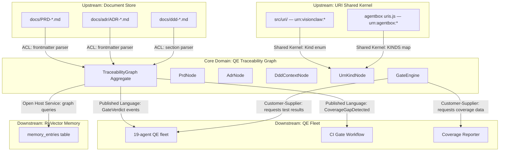

# DDD Analysis: QE Traceability Graph Bounded Context

> **Related**: [PRD-QE-001](PRD-QE-001-integration-quality-engineering.md) · [PRD-006](PRD-006-visionclaw-agentbox-uri-federation.md) · [ADR-061](adr/ADR-061-binary-protocol-unification.md) · [DDD BC20](ddd-agentbox-integration-context.md) · [DDD Binary Protocol](ddd-binary-protocol-context.md) · [DDD Bead Provenance](ddd-bead-provenance-context.md) · [DDD XR](ddd-xr-bounded-context.md) · agentbox [ADR-013](../agentbox/docs/reference/adr/ADR-013-canonical-uri-grammar.md)

**Context name:** `QeTraceabilityGraph` (BC21)
**Date:** 2026-05-01
**Author:** DDD / QE Architecture Agent
**Status:** Draft

---

## 1. Purpose

VisionClaw's documentation corpus contains 41 ADRs, 12 PRDs, and 4 DDD bounded
context documents (plus this one). Two parallel URI namespaces (`urn:visionclaw:*`
with 6 kinds and `urn:agentbox:*` with 18 kinds) define the addressable surface.
A 19-agent QE fleet generates and executes tests against this surface.

Today, no system tracks which PRD mandates which ADR, which ADR touches which DDD
context, which DDD context maps to which URN kinds, or whether each of those
relationships has test coverage. Engineers discover gaps by manual audit (as
documented in PRD-QE-001's inventory). CI gates enforce individual test pass/fail
but cannot answer "does ADR-061 have full coverage of the invariants it declares?"

This bounded context introduces a **traceability graph** that makes those
relationships explicit, queryable, and enforceable at QE gates.

### What this context is NOT

- It is not a test runner. It consumes test results from the QE fleet and CI.
- It is not a documentation generator. It reads existing markdown frontmatter.
- It is not a replacement for the URI libraries in `src/uri/` or
  `agentbox/management-api/lib/uris.js`. It references URN kinds; it does not
  mint URNs.

---

## 2. Bounded Context Map



### Context Relationships

| Upstream | Downstream | Pattern | Notes |
|----------|-----------|---------|-------|
| Document Store (markdown) | QE Traceability Graph | ACL | Frontmatter parser translates headers, `Related:` lines, and section anchors into structured nodes |
| URI Shared Kernel | QE Traceability Graph | Shared Kernel | `Kind` enum (Rust) and `KINDS` map (JS) are the authoritative lists of URN kinds; this context reads them but does not extend them |
| QE Traceability Graph | QE Fleet | Published Language | Domain events (`QeGatePassed`, `QeGateFailed`, `CoverageGapDetected`) drive fleet task dispatch |
| QE Traceability Graph | CI Pipeline | Customer-Supplier | CI gates block merge when the traceability graph reports unsatisfied invariants |
| QE Traceability Graph | RuVector Memory | Open Host Service | Graph state persists to `memory_entries` via MCP tools under namespace `qe-traceability` |

---

## 3. Aggregates

### 3.1 `TraceabilityGraph` (Aggregate Root)

The full PRD-to-ADR-to-DDD-to-URN directed acyclic graph. All mutations to
the graph's node and edge sets flow through this root to enforce cross-node
invariants.

```
TraceabilityGraph (Aggregate Root)
+-- graph_id: TraceabilityGraphId (Value Object)
+-- prd_nodes: Map<PrdUrn, PrdNode>
+-- adr_nodes: Map<AdrUrn, AdrNode>
+-- ddd_context_nodes: Map<DddUrn, DddContextNode>
+-- urn_kind_nodes: Map<UrnKindId, UrnKindNode>
+-- edges: Vec<TraceabilityEdge>
+-- snapshot_at: DateTime<Utc>
+-- gate_verdicts: Map<AdrUrn, GateVerdict>
```

**Invariants:**

| # | Invariant | Enforcement |
|---|---|---|
| T01 | Every `AdrNode` in the graph MUST reference at least one `PrdNode` via a `REQUIRES_ADR` back-edge OR be explicitly marked `prd_exempt: true`. | `register_adr()` rejects orphan ADRs without the exempt flag. |
| T02 | Every `DddContextNode` MUST reference at least one `AdrNode` via `IMPLEMENTS_CONTEXT`. | `map_ddd_context()` rejects unlinked contexts. |
| T03 | Every `UrnKindNode` from the Shared Kernel MUST appear in at least one `DddContextNode.mapped_urn_kinds`. | `rebuild()` emits `CoverageGapDetected` for unmapped kinds. |
| T04 | A `GateVerdict` for a given ADR is computed from the union of its downstream DDD contexts and their URN kind coverage. A single uncovered invariant produces a `FAIL` verdict. | `evaluate_gate()` is total over the ADR's declared invariants. |
| T05 | `edges` form a DAG. Cycles are rejected at insertion time. | `add_edge()` runs a reachability check before accepting. |
| T06 | The graph is rebuilt from source on every CI run; it is not incrementally patched. | `rebuild()` is the only public mutation entrypoint. |

**Allowed operations:**
- `rebuild(document_store, uri_shared_kernel) -> TraceabilityGraph` -- full reconstruction from markdown + URI source
- `evaluate_gate(adr_urn) -> GateVerdict` -- per-ADR gate assessment
- `evaluate_all_gates() -> Map<AdrUrn, GateVerdict>` -- batch assessment
- `coverage_gaps() -> Vec<CoverageGap>` -- all URN kinds missing test coverage
- `trace_prd_to_tests(prd_urn) -> Vec<TestRef>` -- follow edges from PRD through ADR/DDD to test files

**Forbidden:**
- Incremental edge mutation outside `rebuild()`. The graph is a projection, not a live-edited entity.
- Storing test results inside the graph. Test results are external facts consumed by `evaluate_gate()`.

### 3.2 `PrdNode`

An indexed PRD document.

```
PrdNode
+-- urn: PrdUrn (Value Object)          -- e.g. urn:agentbox:prd:QE-001
+-- title: String
+-- status: DocumentStatus               -- Draft | Active | Superseded | Withdrawn
+-- file_path: RelativePath              -- e.g. docs/PRD-QE-001-integration-quality-engineering.md
+-- dependent_adr_urns: Vec<AdrUrn>      -- forward edges: REQUIRES_ADR
+-- goals: Vec<PrdGoal>                  -- extracted from the Goals table
+-- phases: Vec<PrdPhase>                -- extracted from the Phased Rollout section
```

**Invariants:**
- `urn` is immutable after creation.
- `dependent_adr_urns` is derived from `Related:` frontmatter and in-body `ADR-NNN` references. Manual overrides are forbidden; fix the markdown instead.
- `goals` drive the gate granularity: each `PrdGoal` maps to one or more `AdrNode` invariants.

### 3.3 `AdrNode`

An indexed ADR document.

```
AdrNode
+-- urn: AdrUrn (Value Object)          -- e.g. urn:agentbox:adr:061
+-- title: String
+-- status: AdrStatus                    -- Proposed | Accepted | Superseded | Deprecated
+-- file_path: RelativePath
+-- parent_prd_urns: Vec<PrdUrn>         -- back-edges from REQUIRES_ADR
+-- downstream_ddd_urns: Vec<DddUrn>     -- forward edges: IMPLEMENTS_CONTEXT
+-- referenced_urn_kinds: Vec<UrnKindId>  -- URN kinds mentioned in the ADR body
+-- declared_invariants: Vec<InvariantRef> -- extracted from the Invariants table
+-- test_refs: Vec<TestRef>              -- test files/functions that exercise this ADR's invariants
+-- prd_exempt: bool                     -- true for infrastructure ADRs with no PRD parent
```

**Invariants:**
- `declared_invariants` is extracted from the "Invariants" or "Invariants (cross-aggregate)" section. ADRs without such a section have an empty invariant list and produce a `CoverageGapDetected` event (the invariant itself is "ADR declares no testable invariants").
- `test_refs` is populated by scanning `tests/` for files whose doc-comments or `#[doc]` attributes reference this ADR number.
- `prd_exempt` defaults to `false`. Only ADRs that predate the PRD process (ADR-011 through ADR-014) may set this.

### 3.4 `DddContextNode`

An indexed DDD bounded context document.

```
DddContextNode
+-- urn: DddUrn (Value Object)          -- e.g. urn:agentbox:ddd:binary-protocol
+-- name: String                         -- e.g. "Binary Protocol"
+-- bc_number: Option<u16>               -- e.g. 20 for BC20
+-- file_path: RelativePath
+-- aggregate_names: Vec<String>          -- names of aggregates declared in the DDD doc
+-- mapped_urn_kinds: Vec<UrnKindId>      -- URN kinds this context produces or consumes
+-- upstream_adr_urns: Vec<AdrUrn>        -- back-edges from IMPLEMENTS_CONTEXT
+-- invariant_count: u32                  -- total invariants declared across all aggregates
+-- test_coverage_ratio: f32              -- (covered invariants / total invariants), 0.0..=1.0
```

**Invariants:**
- `mapped_urn_kinds` is extracted from the DDD document's aggregate definitions and ubiquitous language section. A DDD context that handles URN-bearing entities but declares no `mapped_urn_kinds` triggers `CoverageGapDetected`.
- `test_coverage_ratio` is computed, not stored. It is recalculated on every `rebuild()`.

### 3.5 `UrnKindNode`

A URI kind definition drawn from the Shared Kernel.

```
UrnKindNode
+-- id: UrnKindId (Value Object)         -- composite: namespace + kind name
+-- namespace: UrnNamespace               -- Visionclaw | Agentbox
+-- kind_name: String                     -- e.g. "concept", "kg", "bead", "adr", "prd"
+-- grammar: String                       -- e.g. "urn:visionclaw:kg:<hex-pubkey>:<sha256-12-hex>"
+-- r_rule: RRule                          -- R1 (content-addressed) | R2 (owner-scoped) | R3 (stable-on-identity)
+-- owner_scoped: bool
+-- content_addressed: bool
+-- resolvable_surface: Option<String>     -- e.g. "docs", "pods", "agents"
+-- ddd_contexts_using: Vec<DddUrn>        -- back-edges from USES_URN_KIND
+-- test_coverage: KindCoverage            -- Covered | Partial | Uncovered
```

**Invariants:**
- The set of `UrnKindNode`s is the **union** of `src/uri/kinds.rs::Kind` (6 variants) and `agentbox/management-api/lib/uris.js::KINDS` (18 entries). Duplicates across namespaces (e.g. `bead` exists in both) are kept as separate nodes with distinct `UrnKindId`s.
- `r_rule` is derived from the source: Rust doc-comments for visionclaw kinds, `ownerScope`/`contentAddressed` flags for agentbox kinds. R-rule assignment: `R1` if `content_addressed && !owner_scoped`, `R1+R2` if `content_addressed && owner_scoped`, `R2` if `!content_addressed && owner_scoped`, `R3` if `!content_addressed && !owner_scoped`.
- `test_coverage` is computed by matching `UrnKindId` against test file references. A kind is `Covered` if at least one unit test and one contract/integration test reference it; `Partial` if only one tier; `Uncovered` otherwise.

---

## 4. Value Objects

| Value Object | Type | Invariants |
|---|---|---|
| `PrdUrn` | `String` | Matches `urn:agentbox:prd:<local>` grammar; `<local>` is a kebab-case slug derived from the PRD filename |
| `AdrUrn` | `String` | Matches `urn:agentbox:adr:<number>` grammar; `<number>` is a zero-padded 3-digit string |
| `DddUrn` | `String` | Matches `urn:agentbox:ddd:<slug>` grammar; `<slug>` is derived from the DDD filename stem after `ddd-` prefix |
| `UrnKindId` | `{ namespace: UrnNamespace, kind_name: String }` | Composite key; equality is `(namespace, kind_name)` tuple equality |
| `UrnNamespace` | Enum | `Visionclaw` or `Agentbox`; exhaustive |
| `RRule` | Enum | `R1`, `R1R2`, `R2`, `R3`; maps to agentbox ADR-013 classification |
| `TraceabilityEdge` | Struct | `{ source: NodeUrn, target: NodeUrn, edge_type: EdgeType }` — typed, directed |
| `EdgeType` | Enum | `RequiresAdr`, `ImplementsContext`, `UsesUrnKind`, `TestsInvariant`, `SupersededBy` |
| `GateVerdict` | Struct | `{ adr_urn: AdrUrn, passed: bool, evidence: Vec<EvidenceLink>, uncovered_invariants: Vec<InvariantRef>, evaluated_at: DateTime<Utc> }` |
| `EvidenceLink` | Struct | `{ test_ref: TestRef, result: TestResult, ci_run_url: Option<String> }` |
| `TestRef` | Struct | `{ file_path: RelativePath, function_name: Option<String>, test_type: TestType }` |
| `TestType` | Enum | `Unit`, `Property`, `Contract`, `Integration`, `E2e`, `Soak`, `Mutation` |
| `TestResult` | Enum | `Pass`, `Fail`, `Skip`, `Ignore { reason: String }` |
| `InvariantRef` | Struct | `{ source_doc: NodeUrn, invariant_id: String, description: String }` |
| `CoverageGap` | Struct | `{ node_urn: NodeUrn, gap_type: GapType, description: String }` |
| `GapType` | Enum | `NoTests`, `NoInvariantsDeclared`, `UrnKindUnmapped`, `PartialCoverage` |
| `DocumentStatus` | Enum | `Draft`, `Active`, `Superseded`, `Withdrawn` |
| `AdrStatus` | Enum | `Proposed`, `Accepted`, `Superseded`, `Deprecated` |
| `KindCoverage` | Enum | `Covered`, `Partial`, `Uncovered` |

---

## 5. Domain Events

| Event | Trigger | Consumers | Carrier |
|---|---|---|---|
| `PrdRegistered { prd_urn, title, goal_count, dependent_adr_count }` | `rebuild()` indexes a new or changed PRD | Traceability Graph (internal), RuVector | MCP `memory_store` under `qe-traceability` namespace |
| `AdrLinked { adr_urn, parent_prd_urns, downstream_ddd_urns, invariant_count }` | `rebuild()` resolves an ADR's upstream and downstream edges | Traceability Graph (internal), RuVector | MCP `memory_store` |
| `DddContextMapped { ddd_urn, aggregate_count, mapped_urn_kind_count }` | `rebuild()` indexes a DDD context and its URN kind mappings | Traceability Graph (internal), RuVector | MCP `memory_store` |
| `UrnKindIndexed { kind_id, namespace, r_rule, coverage }` | `rebuild()` indexes a URN kind from the Shared Kernel | Traceability Graph (internal) | Internal |
| `QeGatePassed { adr_urn, evidence_count, evaluated_at }` | `evaluate_gate()` determines all invariants for an ADR are covered | QE Fleet (task completion), CI Pipeline | Domain event bus |
| `QeGateFailed { adr_urn, uncovered_invariants, evaluated_at }` | `evaluate_gate()` finds at least one uncovered invariant | QE Fleet (task dispatch), CI Pipeline (merge block) | Domain event bus |
| `CoverageGapDetected { node_urn, gap_type, description }` | `rebuild()` or `evaluate_all_gates()` finds a structural gap | QE Fleet (generates test-writing tasks), CI Pipeline (advisory warning) | Domain event bus |
| `TraceabilityGraphRebuilt { node_count, edge_count, gap_count, rebuilt_at }` | `rebuild()` completes | RuVector, CI Pipeline | MCP `memory_store` |

### Event Flow

```
rebuild() triggers:
  PrdRegistered ──┐
  AdrLinked ──────┼──> TraceabilityGraphRebuilt
  DddContextMapped┤
  UrnKindIndexed ─┘
                       │
                       ▼
             evaluate_all_gates()
                       │
              ┌────────┴────────┐
              ▼                 ▼
        QeGatePassed      QeGateFailed
                                │
                                ▼
                     CoverageGapDetected
                                │
                                ▼
                       QE Fleet dispatches
                       test-writing agents
```

---

## 6. Anti-Corruption Layer

### 6.1 Document Store ACL (Markdown -> Graph Nodes)

The traceability graph never operates on raw markdown. A parser ACL translates
document structure into domain types:

| Source pattern | Parser | Output |
|---|---|---|
| PRD `> **Related**: [ADR-NNN]` frontmatter | `PrdFrontmatterParser` | `PrdNode.dependent_adr_urns` |
| PRD `## N. Goals` table rows | `PrdGoalExtractor` | `PrdNode.goals` |
| PRD `## N. Phased Rollout` table rows | `PrdPhaseExtractor` | `PrdNode.phases` |
| ADR `> **Related**: [PRD-NNN]` frontmatter | `AdrFrontmatterParser` | `AdrNode.parent_prd_urns` |
| ADR in-body `urn:visionclaw:*` / `urn:agentbox:*` literals | `UrnReferenceScanner` | `AdrNode.referenced_urn_kinds` |
| ADR `## N. Invariants` table | `InvariantExtractor` | `AdrNode.declared_invariants` |
| DDD `## N. Aggregates` sections | `AggregateNameExtractor` | `DddContextNode.aggregate_names` |
| DDD `## N. Ubiquitous Language` table | `UbiquitousLanguageScanner` | URN kind mentions in definitions |
| DDD `> **Related**:` frontmatter | `DddFrontmatterParser` | `DddContextNode.upstream_adr_urns` |
| Test file `/// ADR-NNN` or `#[doc = "ADR-NNN"]` | `TestRefScanner` | `AdrNode.test_refs` |

**ACL rules:**
1. No raw `String` from markdown crosses the ACL boundary. The parser emits typed value objects or raises `ParseError`.
2. Missing frontmatter is not an error; it produces a node with empty edge lists. The graph's invariant checks then flag the gap.
3. The parser is read-only. It never modifies the source markdown.
4. Parser output is deterministic: same markdown input produces identical graph nodes. No randomness, no timestamps in node construction.

### 6.2 URI Shared Kernel ACL

The traceability graph needs the authoritative list of URN kinds but does not
import `src/uri/kinds.rs` or `agentbox/management-api/lib/uris.js` as code
dependencies. Instead:

- **Visionclaw kinds**: Extracted by parsing the `Kind` enum variants and their
  doc-comments in `src/uri/kinds.rs`. The R-rule annotation (`R1`, `R2`, `R3`)
  is parsed from the doc-comment string.
- **Agentbox kinds**: Extracted by parsing the `KINDS` object literal in
  `agentbox/management-api/lib/uris.js`. The `ownerScope` and
  `contentAddressed` booleans determine R-rule classification.

This indirection prevents the traceability graph from coupling to either URI
library's runtime. If the enum or object shape changes, the parser fails loud
at `rebuild()` time rather than silently producing stale data.

---

## 7. Current Inventory

### 7.1 PRD Nodes (12)

| URN | Title | Key dependent ADRs |
|---|---|---|
| `urn:agentbox:prd:001-pipeline-alignment` | Pipeline Alignment | ADR-014, ADR-036 |
| `urn:agentbox:prd:002-enterprise-ui` | Enterprise UI | ADR-046 |
| `urn:agentbox:prd:003-contributor-ai-support` | Contributor AI Support Stratum | ADR-057 |
| `urn:agentbox:prd:004-agentbox-visionclaw` | Agentbox-VisionClaw Integration | ADR-058, ADR-005 |
| `urn:agentbox:prd:006-uri-federation` | URI Federation | ADR-054, ADR-060, ADR-013 |
| `urn:agentbox:prd:007-binary-protocol` | Binary Protocol Unification | ADR-061, ADR-037 |
| `urn:agentbox:prd:QE-001` | Integration Quality Engineering | (this context's primary driver) |
| `urn:agentbox:prd:agent-orchestration` | Agent Orchestration Improvements | ADR-059 |
| `urn:agentbox:prd:v2-pipeline-refactor` | V2 Pipeline Refactor | ADR-036 |
| `urn:agentbox:prd:bead-provenance` | Bead Provenance Upgrade | ADR-034 |
| `urn:agentbox:prd:insight-migration` | Insight Migration Loop | ADR-049 |
| `urn:agentbox:prd:xr-modernization` | XR Modernization | ADR-032, ADR-033 |

### 7.2 DDD Context Nodes (5)

| URN | Name | BC# | Mapped URN Kinds |
|---|---|---|---|
| `urn:agentbox:ddd:binary-protocol` | Binary Protocol | -- | (none; wire format, not URN-bearing) |
| `urn:agentbox:ddd:agentbox-integration` | Agentbox Integration | BC20 | `urn:agentbox:{pod,envelope,credential,mandate,receipt,activity,event,bead,agent}`, `urn:visionclaw:{bead,execution}` |
| `urn:agentbox:ddd:bead-provenance` | Bead Provenance | -- | `urn:visionclaw:bead`, `did:nostr` |
| `urn:agentbox:ddd:xr` | XR/Immersive | -- | (none; rendering context) |
| `urn:agentbox:ddd:qe-traceability-graph` | QE Traceability Graph | BC21 | `urn:agentbox:{adr,prd,ddd}`, all visionclaw + agentbox kinds (as indexed references) |

### 7.3 URN Kind Nodes (24 total)

**Visionclaw namespace (6):**

| Kind | Grammar | R-Rule | Owner-Scoped | Content-Addressed |
|---|---|---|---|---|
| `concept` | `urn:visionclaw:concept:<domain>:<slug>` | R3 | no | no |
| `group` | `urn:visionclaw:group:<team>#members` | R3 | no | no |
| `kg` | `urn:visionclaw:kg:<hex-pubkey>:<sha256-12-hex>` | R1+R2 | yes | yes |
| `bead` | `urn:visionclaw:bead:<hex-pubkey>:<sha256-12-hex>` | R1+R2 | yes | yes |
| `execution` | `urn:visionclaw:execution:<sha256-12-hex>` | R1 | no | yes |
| `did` | `did:nostr:<64-hex-pubkey>` | R3 | no | no |

**Agentbox namespace (18):**

| Kind | R-Rule | Owner-Scoped | Content-Addressed | Resolvable Surface |
|---|---|---|---|---|
| `pod` | R1+R2 | yes | yes | pods |
| `envelope` | R1+R2 | yes | yes | pods |
| `credential` | R1+R2 | yes | yes | pods |
| `mandate` | R1+R2 | yes | yes | pods |
| `receipt` | R1+R2 | yes | yes | pods |
| `activity` | R1+R2 | yes | yes | agent-events |
| `event` | R1+R2 | yes | yes | agent-events |
| `mcp` | R3 | no | no | things |
| `memory` | R3 | no | no | memory |
| `skill` | R3 | no | no | skills |
| `adr` | R3 | no | no | docs |
| `prd` | R3 | no | no | docs |
| `ddd` | R3 | no | no | docs |
| `thing` | R3 | no | no | things |
| `dataset` | R2 | yes | no | memory |
| `bead` | R2 | yes | no | beads |
| `agent` | R3 | no | no | agents |
| `meta` | R3 | no | no | meta |

---

## 8. Edge Types

| Edge Type | Source | Target | Cardinality | Derivation |
|---|---|---|---|---|
| `REQUIRES_ADR` | PrdNode | AdrNode | 1:N | PRD frontmatter `Related:` + in-body `ADR-NNN` references |
| `IMPLEMENTS_CONTEXT` | AdrNode | DddContextNode | 1:N | ADR frontmatter `Related:` + in-body `ddd-*` references |
| `USES_URN_KIND` | DddContextNode | UrnKindNode | N:M | DDD aggregate definitions, ubiquitous language, ACL module references |
| `TESTS_INVARIANT` | TestRef | InvariantRef | N:M | Test file doc-comments referencing ADR invariant IDs |
| `SUPERSEDED_BY` | AdrNode | AdrNode | 1:1 | ADR status header (`Superseded by ADR-NNN`) |
| `PHASES_INTO` | PrdNode.Phase | AdrNode | 1:N | PRD phased rollout table mapping phases to ADR-gated tests |

```
PrdNode ──REQUIRES_ADR──> AdrNode ──IMPLEMENTS_CONTEXT──> DddContextNode ──USES_URN_KIND──> UrnKindNode
                             │                                                    ▲
                             │                                                    │
                             └──── declared_invariants ──TESTS_INVARIANT──> TestRef
```

---

## 9. Domain Services

| Service | Responsibility |
|---|---|
| `TraceabilityGraphBuilder` | Orchestrates `rebuild()`: invokes all ACL parsers, constructs nodes and edges, validates invariants T01-T06, emits domain events |
| `GateEvaluator` | Implements `evaluate_gate(adr_urn)`: collects the ADR's declared invariants, resolves test refs, checks test results from the QE fleet, produces `GateVerdict` |
| `CoverageAnalyzer` | Implements `coverage_gaps()`: walks the graph to find URN kinds without test coverage, DDD contexts with zero-coverage aggregates, ADRs without invariant declarations |
| `DocumentStoreScanner` | Discovers PRD/ADR/DDD markdown files in `docs/` by filename convention. Not responsible for parsing content (that is the ACL's job) |
| `UriKindSyncService` | Parses `src/uri/kinds.rs` and `agentbox/management-api/lib/uris.js` to produce the authoritative `UrnKindNode` set. Fails loud if the source files have unexpected structure |
| `TestRefResolver` | Scans `tests/` directories for doc-comments, `#[doc]` attributes, and filename conventions that reference ADR numbers. Produces `TestRef` value objects |
| `QeFleetDispatcher` | Consumes `CoverageGapDetected` events and creates task assignments for the QE fleet's test-generation agents |

---

## 10. Gate Evaluation Logic

### 10.1 Per-ADR Gate

```
evaluate_gate(adr_urn) -> GateVerdict:
  1. Look up AdrNode by urn
  2. Collect declared_invariants
  3. For each invariant:
     a. Find TestRefs via TESTS_INVARIANT edges
     b. For each TestRef, look up latest TestResult from CI
     c. Invariant is "covered" if at least one TestRef has result=Pass
  4. GateVerdict.passed = all invariants are covered
  5. GateVerdict.uncovered_invariants = invariants with zero Pass results
  6. GateVerdict.evidence = all (TestRef, TestResult) pairs
```

### 10.2 PRD Rollout Gate

```
evaluate_prd_phase(prd_urn, phase) -> PhaseVerdict:
  1. Look up PrdNode by urn
  2. Get ADR URNs for the given phase from PHASES_INTO edges
  3. For each ADR: evaluate_gate(adr_urn)
  4. PhaseVerdict.passed = all per-ADR gates passed
  5. PhaseVerdict.blocking_adrs = ADRs whose gates failed
```

### 10.3 Coverage Summary

```
coverage_summary() -> CoverageSummary:
  total_invariants: count across all AdrNodes
  covered_invariants: count with at least one passing test
  coverage_ratio: covered / total
  urn_kinds_covered: count of UrnKindNodes with coverage != Uncovered
  urn_kinds_total: count of all UrnKindNodes
  gaps: Vec<CoverageGap>  -- from coverage_gaps()
```

---

## 11. Ubiquitous Language

| Term | Definition |
|---|---|
| **Traceability Graph** | The directed acyclic graph connecting PRDs to ADRs to DDD contexts to URN kinds, with test coverage edges. Rebuilt from source on every CI run. |
| **Gate** | A pass/fail assessment of whether an ADR's declared invariants have test evidence. Gates block merge when they fail. |
| **Gate Verdict** | The structured output of a gate evaluation: pass/fail, evidence links, uncovered invariants. |
| **Coverage Gap** | A structural deficiency in the traceability graph: an unmapped URN kind, an ADR without declared invariants, a DDD context with untested aggregates. |
| **R-Rule** | The classification of a URN kind's addressing strategy: R1 (content-addressed), R2 (owner-scoped), R3 (stable on identity). From agentbox ADR-013. |
| **Evidence Link** | A reference from a gate verdict to a specific test result in a specific CI run. The proof that an invariant is satisfied. |
| **Invariant Ref** | A pointer to a specific invariant row in an ADR or DDD document's invariants table, identified by document URN + invariant ID (e.g. `ADR-061:I03`). |
| **Shared Kernel** | The URI grammar code (`src/uri/` + `agentbox/management-api/lib/uris.js`) that both namespaces share. This context reads the kernel; it does not extend it. |
| **Document Store** | The `docs/` directory tree containing PRD, ADR, and DDD markdown files. This context's upstream, accessed read-only through the ACL. |
| **QE Fleet** | The 19-agent agentic quality engineering fleet that generates and executes tests. This context's downstream consumer of `CoverageGapDetected` events. |
| **Phase Gate** | A gate scoped to a PRD's rollout phase. A phase gate passes only when all ADRs assigned to that phase pass their individual gates. |

---

## 12. Policies

1. **Graph is a projection, not a source of truth.** The source of truth is the markdown files in `docs/` and the URI source files. The graph is rebuilt from scratch on every CI run. If the graph disagrees with the source, the graph is wrong.

2. **Gates are mandatory for PRD-gated ADRs.** Any ADR referenced in a PRD's phased rollout table MUST pass its gate before the corresponding PRD phase can ship. Advisory-only gates are permitted for ADRs not yet in a rollout plan.

3. **No manual override of gate verdicts.** If a gate fails, the fix is to either add tests (satisfying the invariant) or amend the ADR (removing the invariant with justification). There is no `--force-pass` escape hatch.

4. **Coverage gaps are actionable, not informational.** Every `CoverageGapDetected` event creates a work item for the QE fleet. The gap is tracked until resolved (test added, invariant removed, or node marked exempt with documented reason).

5. **URN kind coverage is cross-namespace.** A `urn:visionclaw:bead` and a `urn:agentbox:bead` are separate kinds with separate coverage requirements. The BC20 ACL translation between them must itself be tested (PRD-QE-001 Q5).

6. **Superseded ADRs are excluded from gate enforcement.** An ADR with status `Superseded` does not block any gate. Its successor inherits the traceability edges.

---

## 13. Integration with Other Bounded Contexts

### 13.1 With Binary Protocol (ddd-binary-protocol-context.md)

The Binary Protocol context declares 8 invariants (I01-I08). The traceability graph indexes these as `InvariantRef` objects under `urn:agentbox:adr:061`. The gate for ADR-061 requires test evidence for each. PRD-007's phased rollout is gated on ADR-061 passing.

### 13.2 With Agentbox Integration (ddd-agentbox-integration-context.md, BC20)

BC20 maps between `urn:visionclaw:*` and `urn:agentbox:*` namespaces. The traceability graph tracks which URN kinds BC20's five ACL modules handle and whether the translation tests in `tests/contract/acl/` cover them. PRD-QE-001's Q5 goal is the gate for this coverage.

### 13.3 With Bead Provenance (ddd-bead-provenance-context.md)

The Bead Provenance context uses `urn:visionclaw:bead` and `did:nostr`. The traceability graph tracks ADR-034's invariants and the bead lifecycle FSM's test coverage. The 70 inline tests are indexed as `TestRef` objects.

### 13.4 With QE Fleet (agentic-quality-engineering skill)

Downstream. The QE fleet consumes `CoverageGapDetected` events to dispatch test-writing agents. Each generated test file includes a doc-comment referencing the ADR invariant it targets, which the `TestRefResolver` picks up on the next `rebuild()` cycle, closing the feedback loop.

### 13.5 With RuVector Memory

The graph state and all domain events are persisted to RuVector under the `qe-traceability` namespace. This enables cross-session queries ("which ADRs have had failing gates for more than 7 days?") and fleet task tracking.

```javascript
// Store graph snapshot
mcp__claude-flow__memory_store({
  namespace: "qe-traceability",
  key: "graph:snapshot:2026-05-01",
  value: JSON.stringify({ node_count, edge_count, gap_count, verdicts })
})

// Search for persistent gaps
mcp__claude-flow__memory_search({
  query: "CoverageGapDetected unresolved",
  namespace: "qe-traceability",
  limit: 20
})
```

---

## 14. Test Strategy

Tests for the traceability graph context itself follow the aggregate boundaries:

| Test | Scope | What it pins |
|---|---|---|
| `prd_frontmatter_parser_test` | Unit | Extracts `dependent_adr_urns` from 12 PRD fixtures |
| `adr_invariant_extractor_test` | Unit | Parses invariant tables from ADR-061, ADR-050, ADR-005 fixtures |
| `ddd_aggregate_extractor_test` | Unit | Extracts aggregate names and URN kind mappings from all 5 DDD docs |
| `uri_kind_sync_visionclaw_test` | Unit | Parses `src/uri/kinds.rs` and produces 6 `UrnKindNode`s with correct R-rules |
| `uri_kind_sync_agentbox_test` | Unit | Parses `agentbox/management-api/lib/uris.js` and produces 18 `UrnKindNode`s |
| `traceability_edge_dag_test` | Unit | Rejects cyclic edge insertion; accepts valid DAG |
| `gate_evaluator_all_covered_test` | Unit | All invariants have passing tests -> `QeGatePassed` |
| `gate_evaluator_partial_test` | Unit | Some invariants uncovered -> `QeGateFailed` with correct `uncovered_invariants` |
| `coverage_gap_unmapped_kind_test` | Unit | A URN kind not referenced by any DDD context -> `CoverageGapDetected` |
| `rebuild_idempotent_test` | Integration | Two consecutive `rebuild()` calls on unchanged source produce identical graphs |
| `rebuild_detects_new_adr_test` | Integration | Adding a fixture ADR file causes a new `AdrLinked` event on rebuild |
| `prd_phase_gate_test` | Integration | PRD-QE-001 phase P1 gates on ADR fixtures -> correct `PhaseVerdict` |
| `full_graph_snapshot_test` | Integration | Rebuild from real `docs/` tree; assert node/edge counts match inventory in section 7 |

---

## 15. Anti-Patterns Forbidden

1. **Storing test pass/fail inside the traceability graph aggregate.** Test results are external facts queried at gate evaluation time, not graph state. The graph stores edges to `TestRef`; it does not store `TestResult`.

2. **Editing markdown to satisfy the parser.** The ACL parser must handle the existing markdown conventions. If a document's structure is genuinely ambiguous, add a parser heuristic, not a markdown formatting rule.

3. **Coupling to CI provider.** The `GateEvaluator` accepts test results as input. It does not call GitHub Actions APIs, Jenkins, or any CI system directly. A CI-specific adapter feeds results in.

4. **Minting new URN kinds for traceability.** The traceability graph references existing URN kinds from the Shared Kernel. It does not introduce `urn:agentbox:gate:*` or `urn:visionclaw:test:*`. Traceability metadata rides the `qe-traceability` RuVector namespace, not the URI system.

5. **Making gates advisory by default.** Gates are blocking for PRD-phased ADRs. The pressure to weaken gates should be resisted; the correct response to a failing gate is to add coverage or amend the ADR.

---

## 16. Open Questions

1. **Should the traceability graph be a Rust module or a standalone tool?** Current lean: standalone tool invoked by CI, not compiled into the VisionClaw binary. It reads source files and emits JSON verdicts. The QE fleet consumes the verdicts via RuVector.

2. **How do we handle ADRs that predate the DDD process?** ADR-011 through ADR-014 have no DDD context. They can be marked `prd_exempt: true` and `ddd_exempt: true` to suppress invariant T01 and T02. But their invariants should still be gate-checked if declared.

3. **Should coverage gaps automatically generate PRs with test stubs?** The QE fleet can generate test files, but auto-creating PRs adds merge noise. Current lean: generate test files in a branch; create a single tracking issue per gap batch; human reviews the batch.

4. **How do agentbox-side ADRs participate?** Agentbox has its own ADR series (ADR-005, ADR-008, ADR-009, ADR-010, ADR-012, ADR-013). These are in a separate repo. The traceability graph could index them as foreign nodes with `CROSS_REPO_REFERENCE` edges, but the gate cannot enforce tests in a foreign repo. Current lean: index agentbox ADRs as read-only nodes; gate enforcement applies only to VisionClaw-repo tests; agentbox-side coverage is tracked in agentbox's own CI.

5. **What is the rebuild performance budget?** With 41 ADRs, 12 PRDs, 5 DDD docs, and 24 URN kinds, the graph is small. But parsing markdown and scanning test files could be slow on large test suites. Target: `rebuild()` completes in under 10 seconds on CI. If it exceeds this, introduce incremental rebuild based on git diff (violating T06 — would need an ADR).

---

## 17. Glossary Cross-References

- **Binary Protocol invariants I01-I08** -- see `docs/ddd-binary-protocol-context.md` section 5
- **BC20 ACL modules** -- see `docs/ddd-agentbox-integration-context.md` section 5
- **Bead lifecycle FSM** -- see `docs/ddd-bead-provenance-context.md` section 5
- **R-rule classification** -- see `agentbox/docs/reference/adr/ADR-013-canonical-uri-grammar.md`
- **URI mint functions** -- see `src/uri/mod.rs` re-exports
- **Agentbox KINDS map** -- see `agentbox/management-api/lib/uris.js` lines 71-90
- **QE test surface inventory** -- see `docs/PRD-QE-001-integration-quality-engineering.md` section 4
- **19-agent QE fleet** -- see `agentic-quality-engineering` skill
- **RuVector memory** -- MCP tools `mcp__claude-flow__memory_{store,search,list,retrieve}`
