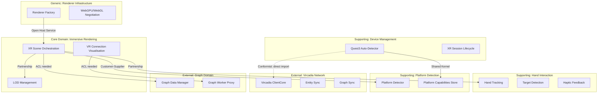

# DDD Analysis: XR/Immersive Bounded Context

## 1. Bounded Context Map



### Context Relationships

| Upstream | Downstream | Pattern | Current State |
|----------|-----------|---------|---------------|
| Platform Detection | Device Management | Shared Kernel (Zustand store) | Functional but tightly coupled |
| Platform Detection | Immersive Rendering | Customer-Supplier | Clean -- reads capabilities |
| Hand Interaction | Immersive Rendering | Partnership | Well-defined hook API |
| LOD Management | Immersive Rendering | Partnership | Clean -- stateless hook |
| Vircadia Network | Device Management | **Missing ACL** | Direct import in quest3AutoDetector |
| Graph Domain | Immersive Rendering | **Missing ACL** | Direct manager imports in useImmersiveData, VRInteractionManager |
| Renderer Infrastructure | Immersive Rendering | Open Host Service | Clean -- factory returns renderer |

## 2. Aggregate Root Analysis

### Current State: No Clear Aggregates

The XR subsystem has no aggregate boundaries. Three problems stand out:

**Problem 1: Quest3AutoDetector is a God Object**

`quest3AutoDetector.ts` (280 lines) mixes four distinct responsibilities:
- Hardware detection (user agent parsing, WebXR API probing)
- Settings mutation (writes directly into `settingsStore`)
- XR session management (requests `immersive-ar`, manages session lifecycle)
- Network bootstrapping (creates `ClientCore`, manages Vircadia connection)

**Problem 2: Duplicate XR Store Creation**

`createXRStore()` is called in two separate files with identical config:
- `WebXRScene.tsx` line 52
- `VRGraphCanvas.tsx` line 20

These produce independent XR store singletons, meaning two competing session managers.

**Problem 3: Duplicate Component Trees**

`VRTargetHighlight`, `VRPerformanceStats`, and `updateHandTrackingFromSession` are copy-pasted between:
- `WebXRScene.tsx` (lines 416-539)
- `VRAgentActionScene.tsx` (lines 194-322)

### Proposed Aggregates

```
XRSession (Aggregate Root)
  |-- sessionState: XRSessionState
  |-- displayMode: 'immersive-vr' | 'immersive-ar' | 'inline'
  |-- activeFeatures: XRFeature[]
  |-- xrStore: XRStore (single instance)
  Invariant: Only one active XR session at a time.
  Invariant: Session features must match device capabilities.

DeviceProfile (Aggregate Root)
  |-- platform: PlatformType
  |-- capabilities: PlatformCapabilities
  |-- detectionResult: Quest3DetectionResult
  Invariant: Detection runs once per page load; result is immutable.
  Invariant: Capabilities derive deterministically from platform.

HandInteraction (Aggregate Root)
  |-- primaryHand: HandState
  |-- secondaryHand: HandState
  |-- targetedNode: TargetNode | null
  Invariant: Only one node targeted at a time.
  Invariant: Haptic fires only on target transition.

LODPolicy (Value Object)
  |-- thresholds: {high, medium, low}
  |-- aggressiveCulling: boolean
  Derived from: DeviceProfile.capabilities.performanceTier + connection count
```

## 3. Domain Events

Events that should flow between contexts (currently none exist -- all coupling is synchronous):

| Event | Producer | Consumer(s) | Currently |
|-------|----------|-------------|-----------|
| `PlatformDetected` | Platform Detection | Device Mgmt, Renderer, Immersive Rendering | Zustand state read (no event) |
| `XRSessionRequested` | Immersive Rendering | Device Mgmt, Platform Detection | Direct `navigator.xr.requestSession()` |
| `XRSessionStarted` | XR Session | Immersive Rendering, Hand Interaction, LOD | XR store subscription (partial) |
| `XRSessionEnded` | XR Session | All consumers | XR store subscription (partial) |
| `DeviceCapabilitiesResolved` | Platform Detection | LOD, Renderer Factory | Not emitted -- capabilities set once |
| `HandTargetChanged` | Hand Interaction | Immersive Rendering | React state (`useState`) |
| `AgentSelected` | Hand Interaction | External (parent callback) | Callback prop |
| `VircadiaConnected` | Vircadia (external) | Device Mgmt | Buried inside quest3AutoDetector |
| `RendererInitialised` | Renderer Factory | Immersive Rendering | Module-level `let` export |

## 4. Anti-Corruption Layer Analysis

The Vircadia SDK leaks into the XR domain at three points:

| Leak | File | Problem |
|------|------|---------|
| `ClientCore` import | quest3AutoDetector.ts:4 | Detector creates Vircadia connections (lines 227-256). Should detect only; connection belongs in a service triggered by `XRSessionStarted`. |
| `graphWorkerProxy` / `graphDataManager` | VRInteractionManager.tsx:8-9 | Node drag writes directly to graph worker. ACL should translate XR interaction events to graph commands. |
| Same graph imports | useImmersiveData.ts:2-3 | Data subscription tightly coupled to graph domain internals. |

**Proposed ACL structure:** `immersive/ports/GraphDataPort.ts` (interface), `immersive/ports/NetworkConnectionPort.ts` (interface), with adapters outside the immersive context that implement these using `graphDataManager` and `ClientCore` respectively.

## 5. Ubiquitous Language

### Term Definitions

| Term | Definition | Files | Status |
|------|-----------|-------|--------|
| `LODLevel` | Distance-based detail tier: `high`, `medium`, `low`, `culled` | useVRConnectionsLOD.ts | Consistent |
| `HandState` | Tracking data for one hand: position, direction, pinch strength | useVRHandTracking.ts | Consistent |
| `TargetNode` | A selectable 3D object identified by ray intersection | useVRHandTracking.ts | Consistent |
| `PlatformType` | Device class enum: `desktop`, `mobile`, `quest`, `quest2`, `quest3`, `pico`, `unknown` | platformManager.ts | Consistent |
| `XRSessionState` | Session lifecycle: `inactive`, `starting`, `active`, `ending`, `error` | platformManager.ts | Partial -- WebXRScene uses boolean `isInVR` instead |
| `ActionConnection` | Animated link between two nodes | useActionConnections.ts (external) | Imported -- not defined in XR context |
| `AgentData` | Node data for VR targeting | WebXRScene.tsx, VRAgentActionScene.tsx | **Inconsistent** -- defined separately in both files with different `type` fields |

### Inconsistencies Found

**1. `AgentData` defined twice with different shapes:**
- `WebXRScene.tsx` line 59: `type?: string` (optional)
- `VRAgentActionScene.tsx` line 37: `type: string` (required)

**2. `isInVR` vs `xrSessionState`:**
- `WebXRScene.tsx` tracks VR with `useState<boolean>` (`isInVR`)
- `platformManager.ts` provides `XRSessionState` with five discrete states
- These are never synchronised -- `WebXRScene` does not write to `platformManager`

**3. `?vr=true` URL parameter parsed in three separate locations:**
- `quest3AutoDetector.ts` line 37
- `WebXRScene.tsx` line 113
- `VRGraphCanvas.tsx` line 35

**4. `primary`/`secondary` hand vs `right`/`left`:**
- `useVRHandTracking.ts` uses `'primary' | 'secondary'`
- `VRInteractionManager.tsx` uses `'left' | 'right'`
- Mapping is implicit (right = primary) and never formalised

## 6. Recommendations

### R1: Extract Vircadia from Quest3AutoDetector

Split `quest3AutoDetector.ts` into three files:

| New File | Responsibility | Lines to Extract |
|----------|---------------|-----------------|
| `client/src/services/quest3Detector.ts` | Pure detection (UA parsing + WebXR probe). Returns `Quest3DetectionResult`. No side effects. | Lines 31-90 |
| `client/src/services/xrSessionManager.ts` | Session lifecycle (request, configure, teardown). Reads from platform store. Emits events. | Lines 93-156, 159-216 |
| `client/src/services/vircadia/vircadiaConnectionService.ts` | Vircadia connection. Subscribes to `XRSessionStarted` event. | Lines 227-277 |

### R2: Deduplicate XR Store

Create a single XR store instance:

**New file:** `client/src/immersive/xrStore.ts`

Both `WebXRScene.tsx` and `VRGraphCanvas.tsx` import from this shared module. Eliminates the dual-store race condition.

### R3: Consolidate Duplicate Components

Extract to shared modules:

| Component | Current Locations | Target |
|-----------|------------------|--------|
| `VRTargetHighlight` | WebXRScene.tsx:416, VRAgentActionScene.tsx:194 | `client/src/immersive/threejs/VRTargetHighlight.tsx` |
| `VRPerformanceStats` | WebXRScene.tsx:465, VRAgentActionScene.tsx:243 | `client/src/immersive/threejs/VRPerformanceStats.tsx` |
| `updateHandTrackingFromSession` | WebXRScene.tsx:508, VRAgentActionScene.tsx:285 | `client/src/immersive/hooks/updateHandTrackingFromSession.ts` |

### R4: Introduce Graph Data Port (ACL)

Create an interface in the immersive context that abstracts graph data access:

**File:** `client/src/immersive/ports/GraphDataPort.ts`

This decouples `useImmersiveData.ts` and `VRInteractionManager.tsx` from direct `graphDataManager`/`graphWorkerProxy` imports. The adapter lives outside the immersive context, injected via React context or prop.

### R5: Unify AgentData Type

Create a single canonical definition:

**File:** `client/src/immersive/types.ts`

All XR components import from this location. Fields: `id: string`, `type: string`, `position?: {x,y,z}`, `status?: AgentStatus`.

### R6: Centralise URL Parameter Parsing

The `?vr=true` check should happen once in `platformManager.ts` during `initialize()`, setting a `forceVRMode: boolean` field in the store. Remove the three duplicate `URLSearchParams` calls.

### Priority Order

1. **R1** (God object decomposition) -- highest risk, blocks all other refactoring
2. **R2** (XR store dedup) -- prevents session race bugs
3. **R3** (component dedup) -- reduces maintenance surface by ~150 lines
4. **R5 + R6** (type/param unification) -- quick wins, prevent drift
5. **R4** (ACL ports) -- architectural improvement, lower urgency
