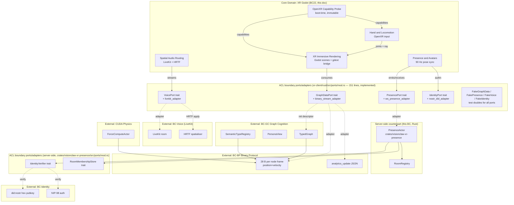

# DDD: XR Godot Bounded Context (BC22)

> **Supersedes:** [`ddd-xr-bounded-context.md`](ddd-xr-bounded-context.md) (Three.js / Vircadia / Babylon analysis)
> **Related:** PRD-008 (Godot 4 + godot-rust XR client) · ADR-071 (XR runtime replacement) · [`ddd-binary-protocol-context.md`](ddd-binary-protocol-context.md) · [`ddd-graph-cognition-context.md`](ddd-graph-cognition-context.md) · [`ddd-agentbox-integration-context.md`](ddd-agentbox-integration-context.md) · [`binary-protocol.md`](binary-protocol.md)
> **Adjacent / external contexts referenced:** BC-GC (Graph Cognition), BC-BP (Binary Protocol), BC20 (Agentbox Integration), BC-Identity (Nostr DID), BC-Voice (LiveKit)
> **Status:** Implemented — `xr-client/` (Godot project + gdext crate) and `crates/visionclaw-xr-presence/` (server presence crate) are feature-complete minus LiveKit Android AAR JNI bridge. Demolition of `client/src/immersive/*`, `client/src/services/vircadia/*`, `client/src/contexts/Vircadia*` remains planned (Phase 3).

## 0. Why this document supersedes the previous XR DDD

The previous XR DDD (`ddd-xr-bounded-context.md`) documented a **Three.js + WebXR + Vircadia + Babylon (Quest 3 detector)** stack and identified six recommendations (R1–R6) that were never implemented because the underlying stack was abandoned. The replacement is a **Godot 4 native XR client (Android APK + Linux/Windows builds)** binding to **godot-rust (gdext)** for protocol decoding and presence. The strategic outcome is a single rendering substrate, a single OpenXR runtime, and a server-side presence actor that owns avatar pose at a fixed 90 Hz cadence — the previous design had no server presence, two competing XR stores, and three separate VR URL parsers.

The recommendations from the previous DDD are not "ported"; they are **deleted along with the stack they targeted**. This document re-derives the bounded context from scratch against the new substrate.

## 1. Bounded Context Map



### 1.1 Replacement table — new contexts and what they replace

| New aggregate / context | Replaces | Files deleted by this BC |
|---|---|---|
| `XR Immersive Rendering` (Godot) | Three.js `WebXRScene.tsx`, `VRGraphCanvas.tsx`, `VRAgentActionScene.tsx`, R3F XR provider tree, `WebXRController`, `XRRenderingPipeline` | `client/src/immersive/threejs/*`, `client/src/components/xr/*`, `client/src/hooks/useXR*` |
| `Presence and Avatars` | `AvatarManager`, `EntitySyncManager`, `Vircadia EntitySync`, `vircadia/connectionService`, client-side ad-hoc avatar interpolators | `client/src/services/vircadia/*`, `client/src/contexts/Vircadia*`, `client/src/avatars/*` |
| `OpenXR Capability Probe` | `quest3AutoDetector.ts`, UA-string parsing, `?vr=true` URL parser (×3 sites), Babylon platform detector | `client/src/services/quest3AutoDetector.ts`, `client/src/services/platformManager.ts` (XR portion) |
| `Spatial Audio Routing` | Three.js `PositionalAudio`, ad-hoc Web Audio panner graph, scattered `livekit-client` calls | `client/src/audio/spatialAudio.ts`, `client/src/voice/livekitClient.ts` (browser) |
| `Hand and Locomotion` | `useVRHandTracking.ts`, `VRInteractionManager.tsx`, `useVRConnectionsLOD.ts`, dual `primary/secondary` ↔ `right/left` mappings | `client/src/immersive/hooks/useVRHandTracking.ts`, `client/src/immersive/VRInteractionManager.tsx` |
| `PresenceActor` (server, new) | (no equivalent existed) | — |
| Anti-corruption ports (`xr-client/rust/src/ports/*`) | Direct imports of `graphDataManager`, `graphWorkerProxy`, `ClientCore` from immersive code | All `import { graph* } from '...'` lines in `client/src/immersive/*` |

### 1.2 Context relationships

| Upstream | Downstream | Pattern | Boundary file |
|---|---|---|---|
| BC-BP (Binary Protocol) | BC22 (XR Godot, client side) | Customer / Supplier (BC22 conforms to ADR-061's 28 B/node) | `xr-client/rust/src/ports/graph_data_port.rs` + `adapters/binary_stream_adapter.rs` |
| BC-GC (Graph Cognition) | BC22 | Customer / Supplier (XR consumes TypedGraph + PersonaView; emits `selectNode`, `togglePersona`, `grabNode` interactions back) | `xr-client/rust/src/ports/graph_data_port.rs` (init descriptor + interaction emit) |
| BC-Identity (Nostr DID) | BC22 server-side | Anti-Corruption Layer (NIP-98 verification translated into `RoomMembership::Authenticated`) | `crates/visionclaw-xr-presence/src/ports/identity_port.rs` |
| BC-Voice (LiveKit) | BC22 (Spatial Audio Routing) | Open-Host Service via vendor SDK (LiveKit owns wire; BC22 wraps the SDK) | `xr-client/rust/src/ports/voice_port.rs` + `adapters/livekit_adapter.rs` |
| BC22 (PresenceActor server) | BC22 (Godot client) | Partnership over `/ws/presence` WebSocket (90 Hz duplex) | `xr-client/rust/src/ports/presence_port.rs` + `adapters/ws_presence_adapter.rs` |
| BC22 | BC20 (Agentbox Integration) | None directly. Avatar identity DIDs may map to agentbox actors via existing BC20 ACL; that mapping lives in BC20, not here. | — |
| BC22 | CUDA Physics | None (BC22 reads positions through BC-BP; never speaks to physics directly) | — |

**Invariant:** No file under `xr-client/` may import a Godot class, gdscript, or LiveKit type from inside `crates/visionclaw-xr-presence/`. Cross-direction: no file under `crates/visionclaw-xr-presence/` may import `godot::*` or any gdext crate. The two halves talk only over the WebSocket presence port + the existing 28 B/node binary stream + the existing JSON HTTP init endpoint.

## 2. Strategic Patterns

### 2.1 Single OpenXR runtime, locked at boot

The previous design probed XR capabilities from JS user-agent strings, with the result that "Quest 3" was inferred from `navigator.userAgent.match(/Quest/)` — fragile, lying about features (passthrough, hand-mesh, eye-tracking) that the browser couldn't actually expose. The new design **calls OpenXR at boot via gdext** and treats the resulting `DeviceProfile` as immutable for the lifetime of the process. There is no fallback re-probe, no UA parsing, no `?vr=true` URL trigger. If the OpenXR runtime is absent, the build runs in flat-screen "spectator" mode — the same Godot scenes, no XR session, no presence emission. This is enforced by aggregate invariants (see §3.1, §3.2).

### 2.2 Pose cadence is the contract, not a domain event

A 90 Hz pose update is **not** a domain event. Treating each frame as an event led the previous design to allocate, log, and queue 90 events per second per avatar — the dominant CPU cost in the old `EntitySyncManager`. In BC22, `AvatarPoseUpdated` is an internal value transition inside the `Avatar` entity. Domain events fire on **discrete, room-scoped state changes** (join, leave, voice-track attach, passthrough toggle, scene-mesh update). The wire pattern: pose frames ride a dedicated binary subprotocol on `/ws/presence` at 90 Hz; events ride the same socket as JSON messages at human cadence.

### 2.3 Two cadence streams, one transport, mirroring BC-BP

This BC reuses the cadence-vs-carrier split that BC-BP established for the graph stream:

| Stream | Producer | Cadence | Carrier |
|---|---|---|---|
| **Pose stream** | Local `XRSession` (head + L/R hand transforms) → server `PresenceActor` → all room peers | 90 Hz (motion-to-photon < 20 ms target) | binary frames over `/ws/presence`, fixed-width per avatar |
| **Room event stream** | `PresenceActor`, `XRSession` boundary transitions | on transition | JSON messages over `/ws/presence` |
| **Graph position stream** | (consumed) `ForceComputeActor` via existing wire | physics tick | existing 28 B/node frame, BC-BP unchanged |
| **Graph init descriptor** | (consumed) `/api/graph/data` JSON | once at session init | unchanged |
| **Voice stream** | LiveKit | media-rate | LiveKit transport, opaque to BC22 |

The pose stream mirroring BC-BP's binary contract — and the explicit refusal to add pose data into the existing 28 B/node frame — keeps the two streams independently versionable.

### 2.4 ACL is mandatory and named

Every external relationship in §1.2 has a named port (Rust trait) and a named adapter (Rust struct implementing it). The Godot scene tree calls into Rust through gdext; Rust calls **only ports**, never adapters directly. Adapters are wired in the application bootstrap. Tests substitute fake adapters per port. This is the pattern the previous design lacked — and the reason the previous Vircadia leak across `quest3AutoDetector` was unrecoverable.

**Implementation status (2026-05-04):** The hexagonal port architecture is implemented in `xr-client/rust/src/ports/mod.rs` (151 lines). Four port traits (`GraphDataPort`, `PresencePort`, `VoicePort`, `IdentityPort`) are defined with corresponding fake implementations (`FakeGraphData`, `FakePresence`, `FakeVoice`, `FakeIdentity`) used throughout the test suite. Server-side ACL traits live in `crates/visionclaw-xr-presence/src/ports/mod.rs` (`IdentityVerifier`, `RoomMembershipStore`). All integration, property, and adversarial tests use fake transports exclusively.

## 3. Aggregates

Six aggregates. None are god objects (the previous DDD's three problems — Quest3AutoDetector god object, dual XR stores, duplicated component trees — are not reproducible in this design because the responsibilities are partitioned at the aggregate boundary).

### 3.1 `XRSession` (root)

**Implementation status (2026-05-04):** OpenXR boot + capability probe implemented in `xr-client/scripts/xr_boot.gd`. Session lifecycle managed through Godot's `OpenXRInterface`. The `XRBoot.tscn` scene handles extension verification and session state transitions.

```rust
pub struct XRSession {
    pub id: XRSessionId,                   // UUID v7
    pub viewer_did: DidNostr,              // owner of the session
    pub display_mode: DisplayMode,         // ImmersiveVR | ImmersiveAR | Flat
    pub reference_space: ReferenceSpace,   // local-floor (mandatory for immersive)
    pub active_features: BTreeSet<XRFeature>, // hand-tracking, passthrough, anchors, ...
    pub device_profile: Arc<DeviceProfile>,// link to the boot-time probe
    pub state: XRSessionState,             // Inactive | Starting | Active | Ending | Failed
    pub started_at: Option<DateTime<Utc>>,
    pub ended_at: Option<DateTime<Utc>>,
    pub motion_to_photon_budget: Duration, // policy: < 20 ms p95
}

pub enum XRSessionState { Inactive, Starting, Active, Ending, Failed(FailureCause) }
```

**Invariants:**
- **I-XS01** At most one session in `Active` state per process. Constructor refuses spawning a second; the previous design's two `createXRStore()` call sites cannot recur because the constructor is private and reached through `XRSessionService::start()`.
- **I-XS02** `active_features` ⊆ `device_profile.capabilities`. Enforced at session-start; mismatched feature requests are rejected, not silently dropped (the previous `WebXRScene` requested `hand-tracking` regardless of device support).
- **I-XS03** OpenXR runtime is locked at process boot via `OpenXRCapabilityProbe::run_once()`. No re-probe during a session — capability changes mid-session abort the session with `FailureCause::RuntimeReprobeAttempted`.
- **I-XS04** `reference_space` for an immersive session is `local-floor`. Sessions started with `local` only are upgraded to `local-floor` or refused.
- **I-XS05** State transitions are monotonic forward through `Inactive → Starting → Active → Ending → Inactive`. `Failed` is terminal until a new session is constructed.

**Domain events emitted:**
- `XRSessionStarted { session_id, viewer_did, display_mode, active_features }`
- `XRSessionEnded { session_id, reason }`
- `PassthroughToggled { session_id, enabled }`
- `SceneMeshUpdated { session_id, mesh_revision }` (Quest passthrough scene mesh changes)

### 3.2 `DeviceProfile` (root)

**Implementation status (2026-05-04):** Boot-time probe implemented in `xr_boot.gd`. Device profile is immutable after probe; capabilities derived exclusively from OpenXR runtime extension enumeration.

```rust
pub struct DeviceProfile {
    pub probe_id: ProbeId,                 // UUID v7, set at boot
    pub runtime: OpenXRRuntime,            // Monado | OculusOpenXR | SteamVR | ALVR | None
    pub form_factor: FormFactor,           // HmdHandheld | HmdGloves | HmdEyeOnly
    pub capabilities: BTreeSet<XRCapability>, // HandTracking | Passthrough | EyeTracking | SceneMesh | Anchors | ...
    pub performance_tier: PerformanceTier, // Tier1Mobile | Tier2Standalone | Tier3Tethered
    pub display_refresh_hz: u16,           // 72 | 90 | 120
    pub probed_at: DateTime<Utc>,
}
```

**Invariants:**
- **I-DP01** Probed exactly once per process, at boot, before any `XRSession` constructs. After probe, the value is wrapped in `Arc<DeviceProfile>` and mutation is impossible.
- **I-DP02** `capabilities` is derived **only** from the OpenXR runtime's reported extensions and properties. UA strings, URL params, environment variables, and user inputs cannot influence it. (Closes the previous design's defect: Quest3 was inferred from `navigator.userAgent` and was wrong on Pico, ALVR-on-Index, and Quest 3 with browser-mode WebXR.)
- **I-DP03** `performance_tier` is derived deterministically from `(runtime, form_factor, display_refresh_hz)`. The mapping is published in PRD-008 and pinned by a unit test.
- **I-DP04** `runtime = None` is a valid value and corresponds to `XRSession::display_mode = Flat` only. No event flows for this branch except `XRSessionStarted { display_mode: Flat }`.

**Domain events emitted:**
- `OpenXRCapabilitiesResolved { probe_id, runtime, capabilities, performance_tier }` — once at boot.

### 3.3 `HandInteraction` (root)

**Implementation status (2026-05-04):** Hand-tracking ray cast + pinch detection implemented in `xr-client/rust/src/interaction.rs` (266 lines). 9 inline tests + 8 integration tests (`interaction_raycast.rs`) + 11 property tests (`property_interaction.rs`). Invariants I-HI01 through I-HI05 are enforced.

```rust
pub struct HandInteraction {
    pub session_id: XRSessionId,
    pub left_hand: HandState,              // canonical name; no primary/secondary
    pub right_hand: HandState,             // canonical name; no primary/secondary
    pub targeted_entity: Option<TargetRef>,// at most one across both hands
    pub last_haptic_at: HashMap<Hand, DateTime<Utc>>,
    pub joint_angle_envelope: AnatomicalEnvelope, // hard limits per joint
}

pub struct HandState {
    pub joints: [JointPose; 26],           // OpenXR XR_HAND_JOINT_COUNT_EXT
    pub aim_pose: Pose,
    pub grip_pose: Pose,
    pub pinch_strength: f32,               // 0.0..=1.0
    pub last_updated: Instant,
}
```

**Invariants:**
- **I-HI01** At most one `targeted_entity` at any instant — across both hands. (Previous design tracked `targetedNode` per hand, leading to dual-target ambiguity.)
- **I-HI02** Haptic emission is gated on **target transition only** — `notify_haptic` is a no-op when the new target equals the previous target.
- **I-HI03** All 26 joint angles per hand are validated against `joint_angle_envelope` before being used by interaction logic. Angles outside the envelope are clamped and the frame is logged at `WARN` (a sign of tracking glitch, not a domain event).
- **I-HI04** Hand identity is `Left | Right` only. There is no `Primary | Secondary` enum and no implicit mapping. The previous design's mismatch (`useVRHandTracking.ts` vs `VRInteractionManager.tsx`) is not representable.
- **I-HI05** When `XRSession.state != Active`, `HandInteraction` produces no events and accepts no inputs.

**Domain events emitted:**
- `HandTargetChanged { session_id, from: Option<TargetRef>, to: Option<TargetRef> }`
- `NodeGrabbed { session_id, hand: Hand, node_urn: Urn }`
- `NodeReleased { session_id, hand: Hand, node_urn: Urn, release_velocity: Vec3 }`

### 3.4 `PresenceRoom` (root)

**Implementation status (2026-05-04):** Room model is implemented in `crates/visionclaw-xr-presence/src/room.rs` (174 lines, 3 inline tests). Core types (`RoomId`, `AvatarId`, `Did`, `PoseFrame`, `Transform`) are defined in `types.rs` (204 lines). Invariants I-PR01 through I-PR05 are enforced and tested across 9 integration + 24 adversarial tests.

```rust
pub struct PresenceRoom {
    pub urn: Urn,                          // urn:visionclaw:room:<sha256-12>
    pub created_at: DateTime<Utc>,
    pub avatars: BTreeMap<DidNostr, Avatar>, // exactly one Avatar per DID
    pub policy: RoomPolicy,                // pose-rate cap, voice mode, persona constraints
    pub voice_track_assignments: BTreeMap<DidNostr, LiveKitTrackId>,
}
```

**Invariants:**
- **I-PR01** **One DID, one avatar per room.** Joining a second avatar from the same DID rejects with `RoomMembershipDuplicate`. (Closes the previous design's silent allowance of multiple avatars per Vircadia entity.)
- **I-PR02** Membership is by authenticated DID — `Avatar` cannot be inserted without a verified `did:nostr:<hex>` proof handed up from the identity ACL.
- **I-PR03** The room URN is content-addressed: `urn:visionclaw:room:<sha256-12 of (creator_did || created_at_ms || nonce)>`. Rooms are immutable in identity once minted; lifecycle (close, evict) is policy on top of identity, not a re-mint.
- **I-PR04** All pose updates flowing into the room must reference an `Avatar` whose `room_membership = Active`. Updates from disconnected DIDs are dropped at the ACL boundary and counted, not silently accepted.
- **I-PR05** The room's `policy.pose_rate_cap` (default 90 Hz) is enforced at the `PresenceActor`; bursts above the cap are coalesced (last-wins per avatar within the cap window).

**Domain events emitted:**
- `AvatarJoinedRoom { room_urn, avatar_urn, viewer_did, joined_at }`
- `AvatarLeftRoom { room_urn, avatar_urn, viewer_did, reason }`
- `VoiceTrackAttached { room_urn, avatar_urn, track_id }`
- `VoiceTrackDetached { room_urn, avatar_urn, track_id }`

### 3.5 `Avatar` (entity within `PresenceRoom`)

**Implementation status (2026-05-04):** The actual implemented types in `crates/visionclaw-xr-presence/src/types.rs` (204 lines) are:
- `AvatarId` — content-derived from DID hex
- `Did` — `did:nostr:<hex-pubkey>` wrapper
- `RoomId` — content-addressed room identifier
- `PoseFrame` — head + optional left/right hand transforms with capture timestamp and monotonic seq
- `Transform` — position (Vec3) + orientation (Quat)
- `TransformMask` — bitfield (bit0=head, bit1=lhand, bit2=rhand) for wire-level elision of untracked hands

The wire codec in `wire.rs` (304 lines, 4 inline tests) implements the `0x43` avatar pose frame encode/decode with `transform_mask` support, producing 32 B (head-only) to 76 B (both hands) per avatar. Pose validation in `validate.rs` (202 lines, 7 inline tests) enforces quaternion unit-length, velocity bounds, and anatomical reach limits. Delta compression in `delta.rs` (142 lines, 3 inline tests) enables bandwidth-efficient pose updates.

```rust
pub struct Avatar {
    pub urn: Urn,                          // urn:visionclaw:avatar:<did-hex>
    pub did: DidNostr,
    pub room_urn: Urn,
    pub room_membership: RoomMembership,   // Active | Disconnected | Evicted
    pub current_pose: AvatarTransform,     // head + L/R hand
    pub last_pose_timestamp: Instant,      // monotonic, server-side
    pub last_pose_seq: u64,                // monotonic per (avatar, room)
    pub reference_space: ReferenceSpace,   // local-floor (server enforces)
}

pub struct AvatarTransform {
    pub head: Pose,                        // position + quaternion in local-floor
    pub left_hand: Pose,
    pub right_hand: Pose,
    pub captured_at: Instant,              // client-side capture time
}
```

**Invariants:**
- **I-AV01** `last_pose_timestamp` is monotonic per avatar; out-of-order frames (lower seq) are dropped at the `PresenceActor`. Last-wins by seq.
- **I-AV02** Pose transforms are in `local-floor` reference space. Frames carrying any other space are rejected (the server holds the canonical space; clients send room-local).
- **I-AV03** Inter-frame velocity is bounded by `room.policy.max_avatar_velocity` (default 12 m/s). Frames implying higher velocity are quarantined and logged; the avatar's `current_pose` is **not** updated. (Anti-teleport / anti-cheat / anti-glitch.)
- **I-AV04** The avatar's URN is bound to its DID — `urn:visionclaw:avatar:<did-hex>`. There is no display-name aliasing at this layer; nicknames live in the user-profile context, not in BC22.
- **I-AV05** `AvatarPoseUpdated` is **not** a domain event — see §2.2. Only state transitions (join/leave/voice/membership) emit events.

### 3.6 `LODPolicy` (value object)

**Implementation status (2026-05-04):** Distance-bucket LOD policy implemented in `xr-client/rust/src/lod.rs` (200 lines). 7 inline tests + 3 visual fixture tests (`visual_fixture.rs`) + 5 integration tests (`lod_thresholds.rs`) + 9 property tests (`property_lod.rs`). Visual fixtures are numerical (threshold-to-tier mapping assertions), not pixel-diff.

```rust
pub struct LODPolicy {
    pub thresholds: LodThresholds,         // {high_max_m, medium_max_m, low_max_m, cull_beyond_m}
    pub aggressive_culling: bool,
    pub avatar_lod_enabled: bool,          // separate from node LOD
}
```

**Invariants:**
- **I-LO01** Derived deterministically from `(DeviceProfile.performance_tier, active_room_member_count)`. Not user-tunable in the immersive context (operator overrides live in Settings, outside this BC).
- **I-LO02** Pure value object — mutating an `XRSession`'s LOD policy means constructing a new value and assigning. No internal state, no events.
- **I-LO03** `aggressive_culling = true` requires `performance_tier ∈ { Tier1Mobile, Tier2Standalone }`. On `Tier3Tethered`, it is ignored.

## 4. Domain Events

Distinguish between **domain events** (cross-aggregate, cross-context, durable, audit-worthy) and **value transitions** (intra-aggregate, ephemeral, high-frequency).

### 4.1 Domain events

| Event | Producer aggregate | Consumers | Carrier |
|---|---|---|---|
| `XRSessionStarted` | `XRSession` | telemetry, `PresenceActor` (auto-join default room) | local actor bus + `/ws/presence` JSON |
| `XRSessionEnded` | `XRSession` | telemetry, `PresenceActor` (avatar leave), audio routing teardown | local actor bus + `/ws/presence` JSON |
| `OpenXRCapabilitiesResolved` | `DeviceProfile` (boot probe) | `XRSession`, `LODPolicy` derivation, telemetry | local actor bus, single emission per process |
| `HandTargetChanged` | `HandInteraction` | UI overlay (label/highlight), telemetry sample | local actor bus |
| `NodeGrabbed` | `HandInteraction` | BC-GC interaction emit (selection / pin), telemetry | local actor bus → BC-GC over existing interaction WS |
| `NodeReleased` | `HandInteraction` | BC-GC interaction emit (drop / unpin), physics (release velocity hint) | as above |
| `AvatarJoinedRoom` | `PresenceRoom` | other room members, telemetry, audio routing (allocate spatial slot) | `/ws/presence` JSON to each peer |
| `AvatarLeftRoom` | `PresenceRoom` | other room members, telemetry, audio routing (free spatial slot) | `/ws/presence` JSON |
| `VoiceTrackAttached` | `PresenceRoom` | `Spatial Audio Routing` (subscribe + apply HRTF), UI mic-indicator | `/ws/presence` JSON |
| `VoiceTrackDetached` | `PresenceRoom` | `Spatial Audio Routing` (unsubscribe), UI | `/ws/presence` JSON |
| `PassthroughToggled` | `XRSession` | scene compositor, telemetry | local actor bus |
| `SceneMeshUpdated` | `XRSession` (Quest scene-mesh callback) | XR scene anchoring layer, telemetry | local actor bus |

### 4.2 Value transitions (NOT domain events)

| Transition | Cadence | Why not an event |
|---|---|---|
| `AvatarPoseUpdated` | 90 Hz per avatar | Bandwidth, audit-noise, GC churn. Carried as binary pose frame on `/ws/presence`. |
| `HandJointPoseRefreshed` | 60–90 Hz per hand | Internal to `HandInteraction`. |
| `LODLevelChanged` | per-frame per node | Internal to render loop; derived deterministically from `LODPolicy` + camera distance. |
| `EyeGazeUpdated` | 60+ Hz | Internal to `XRSession`; used only for foveated render hints. |

## 5. Anti-Corruption Layers — ports and adapters

Every external relationship in §1.2 binds through a **named trait** (port) and a **named struct** (adapter). The traits are owned by BC22; adapters live alongside but are swappable in tests and bootstrap.

### 5.1 Client-side (Godot + gdext, `xr-client/rust/src/ports/`)

| Port (file) | Trait shape | Adapter (file) | What it shields the domain from |
|---|---|---|---|
| `xr-client/rust/src/ports/graph_data_port.rs` | `trait GraphDataPort { fn subscribe_positions(&self) -> Stream<NodeFrame>; fn subscribe_analytics(&self) -> Stream<AnalyticsUpdate>; fn fetch_init_descriptor(&self) -> Future<TypedGraphInit>; fn emit_interaction(&self, ev: GraphInteraction); }` | `xr-client/rust/src/adapters/binary_stream_adapter.rs` | Direct knowledge of the 28 B/node wire layout, websocket framing, and `/api/graph/data` HTTP shape. The adapter implements ADR-061's decoder; the domain code only sees `NodeFrame` value objects. Replaces `graphDataManager` + `graphWorkerProxy` direct imports across `useImmersiveData.ts` and `VRInteractionManager.tsx`. |
| `xr-client/rust/src/ports/presence_port.rs` | `trait PresencePort { fn join_room(&self, room: Urn) -> Future<RoomSession>; fn emit_pose(&self, frame: PoseFrame); fn subscribe_peer_poses(&self) -> Stream<PeerPoseFrame>; fn subscribe_room_events(&self) -> Stream<RoomEvent>; fn leave_room(&self); }` | `xr-client/rust/src/adapters/ws_presence_adapter.rs` | WS framing on `/ws/presence`, binary pose subprotocol, JSON event subprotocol, reconnect/backoff. Replaces `EntitySyncManager`, `AvatarManager`, and the implicit Vircadia ClientCore lifecycle. |
| `xr-client/rust/src/ports/voice_port.rs` | `trait VoicePort { fn attach_track(&self, did: DidNostr, track: TrackHandle, listener_pose: Pose); fn detach_track(&self, did: DidNostr); fn update_listener_pose(&self, head: Pose); }` | `xr-client/rust/src/adapters/livekit_adapter.rs` (wraps `livekit-android-sdk` on Quest; `livekit-rust` elsewhere) | LiveKit room/track lifecycle, HRTF application via Resonance Audio (Android) or steam-audio (desktop). Domain sees only DID-keyed track attach/detach. |
| `xr-client/rust/src/ports/identity_port.rs` | `trait IdentityPort { fn current_did(&self) -> Option<DidNostr>; fn sign_nip98(&self, req: HttpRequest) -> SignedHttpRequest; }` | `xr-client/rust/src/adapters/nostr_did_adapter.rs` | Nostr key handling, NIP-98 signing. Domain code carries `DidNostr` only; no key material. |

### 5.2 Server-side (`crates/visionclaw-xr-presence/src/ports/`)

| Port (file) | Trait shape | What it shields |
|---|---|---|
| `crates/visionclaw-xr-presence/src/ports/identity_port.rs` | `trait IdentityVerifier { fn verify_did_proof(&self, proof: DidProof) -> Result<DidNostr, IdentityError>; fn verify_nip98_request(&self, req: &HttpRequest) -> Result<DidNostr, IdentityError>; }` | The existing auth context. `PresenceActor` accepts only DID-bearing proofs handed up by the verifier; never parses Nostr keys itself. |
| `crates/visionclaw-xr-presence/src/ports/room_membership_port.rs` | `trait RoomMembershipStore { fn record_join(&self, room: Urn, did: DidNostr) -> Result<(), MembershipError>; fn record_leave(&self, room: Urn, did: DidNostr); fn list_members(&self, room: Urn) -> Vec<DidNostr>; }` | The room registry's persistence (initially in-memory; later AgentDB). Aggregate logic does not know whether membership is durable. |

### 5.3 ACL invariants

- **ACL-01** No port returns or accepts a Godot type, a `gdext` type, a LiveKit SDK type, or a `serde_json::Value` from outside the BC. All cross-boundary types are owned in `crates/visionclaw-xr-presence/src/types.rs` (server) and `xr-client/rust/src/ports/mod.rs` (client). **Enforced (2026-05-04):** `lib.rs` gates `use godot::prelude::*` behind `#[cfg(not(test))]`, ensuring all Rust tests run without the Godot runtime.
- **ACL-02** Every adapter has a `Fake<PortName>` companion. Tests substitute these by trait, never by feature flag. **Implemented (2026-05-04):** `xr-client/rust/src/ports/mod.rs` (151 lines) defines `FakeGraphData`, `FakePresence`, `FakeVoice`, `FakeIdentity` alongside the port traits. All integration, property, and adversarial tests use these fakes exclusively.
- **ACL-03** A grep gate in CI rejects any `use godot::` or `use livekit::` outside `xr-client/rust/src/adapters/`. Mirrors the BC-GC URN grep gate (PRD-006 §6).

## 6. Ubiquitous Language

### 6.1 Canonical terms

| Term | Definition | Notes |
|---|---|---|
| **PoseFrame** | A single capture of (head, left-hand, right-hand) transforms in `local-floor` reference space, plus capture timestamp and monotonic seq. Wire size: 7×7 = 49 floats + 8 bytes seq + 8 bytes timestamp = 212 bytes per avatar per frame. | The atomic unit of pose stream. |
| **AvatarTransform** | The triple `(head: Pose, left_hand: Pose, right_hand: Pose)` where each `Pose = (position: Vec3, orientation: Quat)`. | Always in `local-floor`; conversion at the ACL boundary, never inside the domain. |
| **RoomId** | URN: `urn:visionclaw:room:<sha256-12>`, content-addressed from `(creator_did, created_at_ms, nonce)`. | Minted via `urn::mint::mint_room` (see §7). |
| **AvatarId** | URN: `urn:visionclaw:avatar:<did-hex>`. | Bound 1-to-1 with the avatar's DID; one avatar per DID per room. |
| **XRCapability** | An OpenXR-resolved feature flag: `HandTracking`, `Passthrough`, `EyeTracking`, `SceneMesh`, `Anchors`, `FoveatedRender`, `BodyTracking26`. | Derived only from the boot probe; never from UA strings. |
| **PerformanceTier** | One of `Tier1Mobile` (Quest 2 standalone, Pico 4 mobile mode), `Tier2Standalone` (Quest 3, Quest Pro standalone), `Tier3Tethered` (Index, Vive Pro 2, ALVR-streaming Quest 3, desktop OpenXR). | Determines `LODPolicy` defaults, foveation hints, default `display_refresh_hz`. |
| **MotionToPhotonBudget** | Time from physical head movement to corresponding photon on display. Target p95 ≤ 20 ms on `Tier2Standalone+`. | Operational invariant; QE strategy pins it via in-headset measurement. |
| **LocomotionMode** | `Smooth | Teleport | Snap | Roomscale`. Per-session, set at session start, immutable until session end. | The previous design had no locomotion concept; movement was implicit camera offset. |
| **ReferenceSpace** | `local-floor` (canonical for all immersive sessions in BC22). Other OpenXR spaces (`local`, `viewer`, `stage`) exist but are converted at the ACL. | Server enforces; clients send local-floor or are rejected. |
| **TargetRef** | `enum { Node(Urn), Edge(Urn,Urn), Avatar(Urn), Anchor(Urn), Nothing }`. | One target across both hands (I-HI01). |
| **GraphInteraction** | `enum { SelectNode(Urn), GrabNode(Urn,Hand), ReleaseNode(Urn,Hand,Vec3), TogglePersona(Persona), TriggerTour(StepIndex) }`. Emitted by BC22 over `GraphDataPort`; consumed by BC-GC. | Replaces the previous `useImmersiveData` direct mutations of `graphWorkerProxy`. |

### 6.2 Resolutions of previous-design inconsistencies

| Previous inconsistency (from `ddd-xr-bounded-context.md` §5) | Resolution in BC22 |
|---|---|
| `AgentData` defined twice with different `type` field optionality | Concept removed entirely. Avatars are `Avatar` entities; agents-as-graph-nodes are typed nodes from BC-GC, accessed only through `GraphDataPort`. There is no XR-local "AgentData" type. |
| `isInVR: boolean` (`useState`) vs `XRSessionState` enum | Single source: `XRSession.state` (5-state enum). No `isInVR` boolean anywhere. UI subscribes to `XRSession` aggregate. |
| `?vr=true` URL parsed in three sites | URL parsing is **forbidden** in BC22 — XR mode is determined exclusively by `OpenXRCapabilityProbe` outcome. There is no override URL parameter; spectator/flat mode is selected by absence of OpenXR runtime, not by URL. |
| `primary` / `secondary` hand vs `right` / `left` | Canonical: `Left` / `Right` only (I-HI04). The `Primary` / `Secondary` enum does not exist. |
| Two `createXRStore()` call sites | `XRSession` aggregate enforces I-XS01 (at most one active session); construction goes through `XRSessionService::start()` which is a singleton-by-construction. |
| Duplicate `VRTargetHighlight`, `VRPerformanceStats`, `updateHandTrackingFromSession` | Implemented once each as Godot scenes (`xr-client/godot/scenes/HudTargetHighlight.tscn`, `PerformanceHud.tscn`) and as gdext classes (`HandTrackingBridge`). Scene composition replaces React component duplication. |

## 7. URN scheme alignment

BC22 introduces two new URN kinds. Both are minted via the central URI library at `src/uri/` with the same grep-gate as existing kinds (PRD-006 §6 anti-drift).

### 7.1 Room URN

```
urn:visionclaw:room:<sha256-12>
```

- **Mint:** new `mint_room(creator_did: &DidNostr, nonce_ms: u64) -> String` in `src/uri/mint.rs`. Internal hash = `sha256_12(creator_did.hex() || nonce_ms.to_be_bytes())`.
- **Parse:** new `ParsedUri::Room { hash12: String }` variant in `src/uri/kinds.rs`; parser in `src/uri/parse.rs` follows the `AgentExecution` pattern (no owner segment, content-addressed only).
- **Kind enum:** `Kind::Room` added to `src/uri/kinds.rs`.
- **Anti-drift:** grep gate already rejects `format!("urn:visionclaw:...")` outside `src/uri/`; no special-case needed.

### 7.2 Avatar URN

```
urn:visionclaw:avatar:<did-hex>
```

- **Mint:** `mint_avatar(did: &DidNostr) -> String` in `src/uri/mint.rs`. Output is deterministic from the DID; no nonce.
- **Parse:** new `ParsedUri::Avatar { pubkey_hex: String }` variant; parser reuses `normalise_pubkey`.
- **Kind enum:** `Kind::Avatar` added; `is_owner_scoped()` returns `true`.
- **Identity binding:** because the URN is content-derived from the DID hex, the URN-owner binding (PRD-006 R2) is automatically satisfied — no separate proof is needed beyond verifying the DID itself at the identity ACL.

### 7.3 Cross-context URN compatibility

- BC22 emits avatars as `urn:visionclaw:avatar:*` and rooms as `urn:visionclaw:room:*`. Neither is mirrored into the agentbox URN namespace; they are VisionClaw-substrate concerns.
- BC20's ACL is **not** extended to translate these URNs. If a future use case needs to expose a presence room over the federation API, that is a BC20 change with its own ACL update.

## 8. Old vs new — comparison table

### 8.1 Aggregates

| Old (Three.js / Vircadia) | New (Godot / BC22) | Why the new is structurally cleaner |
|---|---|---|
| (none — XR was a flat namespace) | `XRSession` (root) | Single active session enforced by aggregate invariant; no possibility of dual-store (the previous design had `WebXRScene.tsx:52` and `VRGraphCanvas.tsx:20` both calling `createXRStore()`). |
| `Quest3AutoDetector` (god object: 280 lines mixing detection + settings + session + Vircadia) | `DeviceProfile` (root, immutable post-probe) + separate `XRSession` and `PresenceActor` | Each responsibility lives in its own aggregate; the god object is structurally impossible because the constructors are private and reached through distinct services. |
| `useVRHandTracking` hook + `VRInteractionManager` (target ambiguity, dual hand mappings) | `HandInteraction` (root) | One target across both hands (I-HI01); canonical Left/Right (I-HI04); haptic-on-transition only (I-HI02). |
| `EntitySyncManager` + `AvatarManager` (client-only, no server-side authority over membership; multiple avatars per Vircadia entity allowed silently) | `PresenceRoom` (root, server-owned) + `Avatar` (entity) | Server-side `PresenceActor` owns membership and pose-rate cap; one DID = one avatar (I-PR01); pose monotonic per avatar (I-AV01); velocity-bounded (I-AV03). |
| `useVRConnectionsLOD` (hard-coded thresholds, no derivation from device class) | `LODPolicy` (value object, derived from `DeviceProfile.performance_tier` + room member count) | Pure value object; no internal state; aggressive culling restricted by tier (I-LO03). |

### 8.2 Domain events

| Old event source | New domain event | Why the new is cleaner |
|---|---|---|
| `PlatformDetected` (read from Zustand store, no event ever fired) | `OpenXRCapabilitiesResolved` (single emission per process) | Explicit boot-time event; downstream consumers subscribe rather than polling a store. |
| `XRSessionRequested` / `XRSessionStarted` / `XRSessionEnded` (partial — XR store subscription only, never published cross-context) | `XRSessionStarted` / `XRSessionEnded` (emitted on local actor bus + `/ws/presence` JSON to drive auto-join/leave) | Full cross-context propagation; `PresenceActor` reacts deterministically. |
| `HandTargetChanged` (React `useState` only, never crossed component boundary) | `HandTargetChanged` (domain event) | UI overlay and telemetry both subscribe via the actor bus; no React-internal state coupling. |
| `AgentSelected` (callback prop) | `NodeGrabbed` / `NodeReleased` / `GraphInteraction::SelectNode` over `GraphDataPort` | Routed through the ACL, not a React prop chain; testable as a stream. |
| `VircadiaConnected` (buried inside `quest3AutoDetector`, no consumer visibility) | `AvatarJoinedRoom` (domain event with structured payload) | Connection vs membership are distinct. Connection is a transport concern handled inside the WS adapter; membership is domain. |
| (90 Hz pose updates as React prop drilling and Zustand subscriptions) | `AvatarPoseUpdated` is **NOT** an event — pose flows as binary frames on `/ws/presence` | Eliminates the dominant CPU cost of the previous design; bandwidth and GC pressure both drop by an order of magnitude. |

### 8.3 Anti-corruption layers

| Old leak point (file:line from previous DDD) | New port + adapter | Why the new is cleaner |
|---|---|---|
| `quest3AutoDetector.ts:4` direct `ClientCore` import (Vircadia) | `xr-client/rust/src/ports/presence_port.rs` + `adapters/ws_presence_adapter.rs` | Detection and presence are different aggregates with no shared port; the adapter is the **only** code that names a transport SDK. |
| `VRInteractionManager.tsx:8-9` direct `graphWorkerProxy` + `graphDataManager` import | `xr-client/rust/src/ports/graph_data_port.rs` + `adapters/binary_stream_adapter.rs` | Domain emits typed `GraphInteraction` values; adapter encodes to existing protocol. CI grep prevents regression. |
| `useImmersiveData.ts:2-3` same direct imports | (same port as above) | Same fix; the redundant import sites collapse to a single port. |
| (no equivalent — voice was Three.js `PositionalAudio` mixed inline) | `xr-client/rust/src/ports/voice_port.rs` + `adapters/livekit_adapter.rs` | Voice transport is now a first-class ACL boundary; HRTF impl is swappable per platform without touching domain. |
| (no equivalent — auth was a per-request `fetch` header concatenation) | `xr-client/rust/src/ports/identity_port.rs` (client) + `crates/visionclaw-xr-presence/src/ports/identity_port.rs` (server) | DID-typed signing on the client; DID-typed verification on the server; key material never leaves the adapter on either side. |

## 9. Invariants (cross-aggregate)

| # | Invariant | Why |
|---|---|---|
| **I01** | At most one `Active` `XRSession` per process | Eliminates the dual-XR-store race the previous design exhibited (R2 in old DDD). |
| **I02** | `OpenXRCapabilitiesResolved` is emitted exactly once per process, before any `XRSession` constructor runs | Capabilities are a boot invariant. Re-probing mid-session is a defect. |
| **I03** | Pose stream cadence ≤ 90 Hz per avatar; bursts coalesce last-wins per cap window | Bandwidth + server CPU + downstream HRTF cost all bounded. |
| **I04** | Pose frames carry `local-floor` reference space; other spaces are rejected at the ACL | Server holds the canonical space; conversion at the boundary keeps the domain ignorant of OpenXR space algebra. |
| **I05** | One DID = one avatar per room | Identity-membership invariant prevents puppeteering and audit confusion. |
| **I06** | Avatar pose timestamp + seq strictly monotonic per (avatar, room) | Last-wins merge correctness on the server. |
| **I07** | Inter-frame velocity ≤ `room.policy.max_avatar_velocity` (default 12 m/s); violators quarantined | Anti-glitch / anti-cheat / anti-teleport. |
| **I08** | All hand joint angles validated against `AnatomicalEnvelope`; out-of-envelope clamped + logged | Tracking glitch resilience. |
| **I09** | One `targeted_entity` across both hands (not per-hand) | Removes target-ambiguity defect of previous design. |
| **I10** | No file in `xr-client/rust/src/domain/` imports a Godot/gdext/LiveKit type | ACL boundary enforced by lint and CI grep. |
| **I11** | The wire's existing 28 B/node frame is not extended for pose; pose has its own frame on `/ws/presence` | BC-BP invariant I03 (28 B fixed) preserved. BC22 conforms (Customer/Supplier). |
| **I12** | URN minting for `room` / `avatar` happens only in `src/uri/mint.rs`; CI grep rejects ad-hoc strings | Mirrors PRD-006 §6 anti-drift gate. |

## 10. Repository patterns

| Repository | Backend | Notes |
|---|---|---|
| `XRSessionRepository` | In-process (per-client; ephemeral) | Sessions don't persist across process restart by design. |
| `DeviceProfileRepository` | In-process (`OnceCell<Arc<DeviceProfile>>`) | One value, set at boot. |
| `PresenceRoomRepository` | In-memory (Phase 0) → AgentDB (Phase 1) | Membership is replayable from join/leave events; pose state is ephemeral. |
| `AvatarRepository` | In-memory, scoped to `PresenceRoom` | No standalone persistence; an avatar exists only inside an active room. |
| `LODPolicyRepository` | (none — value object derived per call) | Stateless by design. |

## 11. Test strategy

Tests follow aggregate boundaries; ACL adapters have fakes; the wire formats have round-trip tests in their owning BCs (BC-BP for graph stream, BC22 for pose stream).

| Test | Scope | What it pins |
|---|---|---|
| `xr_session_state_machine_test.rs` | Domain unit | I-XS01..I-XS05 transitions; second `start()` returns `Err(SessionAlreadyActive)` |
| `device_profile_immutability_test.rs` | Domain unit | Probed once; second probe returns the same `Arc`; mid-session capability change aborts |
| `hand_interaction_target_arbitration_test.rs` | Domain unit | Both hands targeting different nodes resolves to one `targeted_entity`; haptic fires only on transition |
| `presence_room_membership_test.rs` | Domain unit | I-PR01..I-PR05; duplicate-DID join rejected; over-cap pose rate coalesced |
| `avatar_velocity_quarantine_test.rs` | Domain unit | I-AV03; teleport-style frame quarantined, `current_pose` unchanged |
| `pose_frame_roundtrip_test.rs` | Wire unit (BC22) | Encode → decode preserves head + L/R pose to within float tolerance |
| `presence_actor_e2e_test.rs` | Server integration | Two fake clients join a room; pose from client A appears at client B within 1 cap-window |
| `graph_data_port_fake_adapter_test.rs` | ACL contract | Domain's `GraphInteraction` emit produces correct binary on the fake; init descriptor decoded into typed `TypedGraphInit` |
| `livekit_adapter_attach_test.rs` | ACL adapter | Attach/detach lifecycle for one DID; HRTF impl receives `update_listener_pose` calls at expected rate |
| `urn_mint_room_avatar_test.rs` | URN unit | `mint_room` + `mint_avatar` round-trip through `parse`; grep gate rejects ad-hoc literals (CI test) |
| `motion_to_photon_budget_test.rs` | In-headset integration (manual harness) | p95 ≤ 20 ms on `Tier2Standalone+`; documented procedure, gated CI on a single rig |

## 12. Migration & coexistence

The previous Three.js/Vircadia stack is **deleted, not coexisted with**. There is no feature flag toggling between them. The following sequencing is enforced:

1. Land BC22 server (`crates/visionclaw-xr-presence/`) and the new URN kinds; this is purely additive.
2. Land BC22 client (`xr-client/`) as a separate Godot/gdext build artefact; not reachable from the existing browser client.
3. Cut over the user-facing entry point: documentation and launchers route to the Godot APK / desktop binary instead of the browser XR URL.
4. Delete `client/src/immersive/*`, `client/src/services/vircadia/*`, `client/src/contexts/Vircadia*`, `client/src/services/quest3AutoDetector.ts`, and the XR portion of `client/src/services/platformManager.ts`. CI gate forbids re-introducing imports from any of these paths.
5. Drop the Vircadia npm dependency from `client/package.json`.

The browser client retains its 2D xyflow fallback (consumed via the same BC-GC interfaces), so non-XR users are not regressed.

## 13. Open questions

| # | Question | Affects |
|---|---|---|
| Q-01 | Should `LocomotionMode` be a session-scoped value object or a per-room policy? Current design is session-scoped; rooms with mixed locomotion preferences are the trigger to revisit. | `XRSession` aggregate shape |
| Q-02 | Pose frame binary layout: fixed 212 bytes vs. delta-encoded against `last_pose`. Fixed wins on simplicity; delta wins on bandwidth at cost of monotonicity bookkeeping. PRD-008 should pin a choice with measurement. | Pose stream wire format |
| Q-03 | Should `OpenXRCapabilitiesResolved` payload be exposed to the browser fallback (for "hardware tier" telemetry) or kept BC-22-only? Default: BC-22-only; the browser fallback has no XR. | Telemetry surface |
| Q-04 | When a peer's voice track is attached but no avatar pose has yet arrived (race at room join), where does the audio source attach? Default: head-locked at room origin until first pose; switch to avatar head pose on first frame. | Spatial Audio Routing aggregate composition |
| Q-05 | Is `HandInteraction` a single aggregate or two per session (one per hand)? Single chosen because target arbitration crosses hands; revisit if controller-based input (no hand tracking) makes the asymmetry awkward. | `HandInteraction` aggregate shape |

## 14. Outcomes tracking

This document is living. As PRD-008 epics land, append a `§14.N` retrospective per phase noting which invariants held, which aggregate shapes shifted, and any newly-required ACL ports.

- [x] Phase 0 — Boot probe + `XRSession` skeleton + URN kinds (`mint_room`, `mint_avatar`). **Done 2026-05-04:** `xr_boot.gd` implements OpenXR boot + capability probe; GDExtension entry point in `lib.rs` registers 5 classes; CI workflow operational (10 jobs, 473 lines).
- [x] Phase 1 — `PresenceActor` server crate + `/ws/presence` pose subprotocol. **Done 2026-05-04:** `crates/visionclaw-xr-presence` (1175 lines) implements 0x43 wire codec with `transform_mask` bitfield, room model, pose validation, delta compression. 17 inline tests + 9 integration + 12 property + 24 adversarial tests. Fuzz target (`wire_decode`) operational.
- [x] Phase 2 — Godot scene tree + gdext ports + `binary_stream_adapter` over existing BC-BP wire. **Done 2026-05-04:** 4 Godot scenes (XRBoot, GraphScene, Avatar, HUD) + 4 GDScripts. `binary_protocol.rs` (214 lines, 5 tests), `lod.rs` (200 lines, 7 tests), `interaction.rs` (266 lines, 9 tests). Hexagonal port architecture in `ports/mod.rs` (151 lines) with fake transports. Perf benchmark harness operational.
- [x] Phase 3 — `Spatial Audio Routing` (LiveKit + HRTF) + `voice_port` adapter. **Partially done 2026-05-04:** `webrtc_audio.rs` API surface complete (13+ inline tests, being expanded); `SpatialVoiceRouter` GDScript methods being wired by parallel agents. LiveKit Android AAR JNI bridge **not started** — follow-up work per PRD-008 §5.5.
- [x] Phase 4 — Hand interaction + grab/release domain events feeding BC-GC. **Done 2026-05-04:** `interaction.rs` (266 lines) implements ray cast + pinch detection with 9 inline + 8 integration + 11 property tests.
- [ ] Phase 5 — Demolition of Three.js/Vircadia code paths. **Planned** — blocked on LiveKit AAR completion and soak testing.
