# DDD: Graph Analytics Domain (Clustering + Analytics Subsystem)

**Date**: 2026-06-02
**Status**: DRAFT
**Scope**: The VisionClaw GPU clustering + analytics subsystem — Rust(actix)+CUDA server, React/three.js/WebGPU client.
**Purpose**: Establish a precise shared vocabulary and tactical model so the recurring **encoding drift** ("manual vs auto writers produce different `cluster_id` encodings") and **concept conflation** ("the mounted GPU anomaly actor writes a wrong LOF value while a live agent-health heuristic squats on the same field") failures stop recurring.

This document is descriptive of the verified pipeline (audit 2026-06-02) and prescriptive of the model the team commits to. Where the two disagree, the prescriptive model wins and the gap is a defect.

## Context

The analytics subsystem is the third tenant of the GPU compute substrate, alongside physics/layout and topology management. All three operate over the **same CSR graph and the same node-id space**, which is exactly why their boundaries blur in code. Today that blur manifests as three concrete bugs:

1. **Encoding drift** — two write paths (`manual` and `auto`) populate the same `node_analytics` map with semantically different `cluster_id` encodings; the client cannot tell which convention it received. Worse, the auto path writes the raw 0-based community label into *both* `cluster_id` and `community_id` (`clustering_actor.rs:236/351/492`), so the two fields collide.
2. **Concept conflation** — "anomaly" means a graph-structural GPU score in one place and a live agent-health heuristic in another; they share a wire slot but are not the same quantity. The GPU anomaly actor is mounted and writing to the `anomaly` slot, but the value is wrong (the LOF kernel computes `1/local_density`, not the LOF ratio), and the live `/anomaly/toggle` agent-health heuristic occupies the same surface.
3. **Structural truncation** — `node_analytics` is a 3-slot tuple `(cluster_id, anomaly, community)` (`app_state.rs:347-349`), so **centrality** has *no slot* and cannot reach the wire even though its kernel runs. (Shortest-path distance is *not* truncated: `sssp_distance@28` already exists on the V3 record; SSSP is dropped only because the encoder feeds `None`, a wiring gap, not a missing slot.)

These are not algorithm bugs. They are **modelling bugs**: missing names, missing invariants, missing boundaries. This DDD fixes the model.

## 1. Bounded Context Definition

### The "Graph Analytics" context

**Responsibility**: derive *topological* scalar/categorical fields over the node set — community membership, cluster assignment, structural anomaly, centrality, shortest-path distance — and publish them for visualisation. It owns the meaning of every analytics field, its encoding, and the policy for when a result is fit to publish.

**It explicitly does not own**: node positions, force parameters, edge construction, or the node-id allocation scheme. It *consumes* the graph and *produces* per-node analytics.

### Neighbouring contexts and relationships

| Neighbour | Relationship | Boundary contract |
|-----------|--------------|-------------------|
| **Graph Topology** | Upstream **Customer–Supplier** (Topology is supplier). Analytics is the customer; Topology owns the CSR structure (`row_offsets`, `col_indices`, `edge_types`) and the logical node-id allocation. | Analytics reads CSR + the GPU-index↔logical-id mapping. Analytics never mutates topology. |
| **Physics / Layout** | **Shared Kernel** at the CSR buffer + GPU index space, but otherwise **Separate Ways**. Both run on `unified_gpu_compute` over the same device buffers; neither's results depend on the other's. | Analytics derives from *topology*, not from *positions*. A pass must be reproducible whether or not physics has settled (Invariant I-3). |
| **Wire / Binary Protocol (V3)** | Downstream **Published Language**. The V3 frame (48 B/node today, 52 B/node once `centrality@48` lands) is the contract. | Analytics writes `sssp_distance@28`, `cluster_id@36`, `anomaly@40`, `community@44` (and `centrality@48` after the layout grows). The byte layout is the published language; producers conform, they do not extend it ad hoc. |
| **Client (GemNodes / ClusterHulls / qualityGates)** | Downstream **Conformist** consumer with its own **read model**. | The client reads the V3 frame and applies `qualityGates`. It treats `cluster_id == 0` as "unclustered" — this convention is part of the contract, not a client-local quirk. |

### The GPU-index vs logical-node-id anti-corruption boundary

The CSR graph addresses nodes by **compact GPU index** (`0..N` dense, allocation-order). The rest of the system addresses nodes by **logical node id** (`u32`, stable, possibly sparse). `translate_gpu_index` bridges the two.

This translation is an **anti-corruption layer**, not a convenience function. Every analytics result computed in GPU-index space MUST be translated to logical-id space *before* it enters `node_analytics`. A result keyed by the wrong space is silently wrong (it colours the wrong node) and is indistinguishable from a correct result on the wire. The ACL is the single point where GPU-index leakage is caught; nothing downstream of `node_analytics` is permitted to hold a GPU index.

## 2. Ubiquitous Language Glossary

The single most important section of this document. Each term has exactly one meaning in the Graph Analytics context.

- **Node** — a vertex in the graph, identified by its **logical node id** (`u32`). The unit every analytics field attaches to.
- **Compact / GPU index** — the dense `0..N` device-buffer position of a node inside the CSR graph. An *implementation address*, never a domain identity. Translated to a logical id via `translate_gpu_index` at the ACL.
- **Logical node id** — the stable, domain-meaningful `u32` identity of a node. The only key permitted in `node_analytics` and on the wire.
- **Community** — a *discovered* group of densely-interconnected nodes, the output of **community detection** (Louvain). Membership is an emergent property of edge density. Stored as `community_id`.
- **Cluster** — an *assigned* group, the output of a **clustering** algorithm (K-means / DBSCAN / label-propagation) operating on node features or layout. Stored as `cluster_id`. **Community ≠ Cluster.** A community is found by maximising modularity over the edge structure; a cluster is assigned by a (possibly feature-space) partitioning method. They may coincide but are computed by different algorithms with different inputs and are stored in *different fields*. Conflating them is a defect.
- **Partition** — a complete assignment of *every* node to exactly one group (community or cluster). A partition is total and disjoint. `CommunityPartition` is the aggregate that owns a community partition over the whole node set.
- **Modularity** — the scalar quality score of a community partition (≈ −0.5..1.0). Higher = denser intra-community / sparser inter-community edges. A `CommunityPartition` is invalid unless its modularity is computed and stored. Used by the rejection policy (P-3).
- **`sigma_tot` / community-weight** — per-community sum of incident edge weights, the running total Louvain uses to evaluate modularity gain when moving a node. The audit's **`sigma_tot` race** is a concurrency defect in maintaining this total; it is *not* a domain quantity the wire ever sees. Named here so the team stops treating it as analytics output.
- **Aggregation / Contraction** — the Louvain step that collapses each community into a super-node to build the next coarser level. The audit's "**no aggregation**" finding means Louvain runs one level only and never coarsens — so it reports near-trivial communities. Aggregation is mandatory for Louvain to be correct.
- **Centrality** — a per-node structural-importance scalar (PageRank in the live path). Stored as `centrality`. **Must be normalised** before publication (audit: currently unnormalised, and *has no wire slot to reach anyway*).
- **Anomaly** — a per-node **graph-structural** outlier score in `[0,1]`, the output of the GPU anomaly actor over topology (the *mounted* `AnomalyDetectionActor`, which already writes this slot). Stored as `anomaly_score`. **This is NOT agent-health.** Two defects share this term: the GPU LOF kernel currently emits `1/local_density` rather than the local-outlier-factor ratio (a *wrong-value* defect, not an unwired one), and a separate live **agent-health heuristic** (`/anomaly/toggle`) squats on the same wire slot (the conflation defect). Agent-health is an operational telemetry concern of a *different* context and must never occupy the analytics `anomaly` slot.
- **ShortestPath / Distance** — the per-node geodesic distance from a source (SSSP). Stored on the wire as `sssp_distance@28` (an **existing** V3 slot), sourced from the graph node's SSSP result. SSSP is correct today and the slot already exists; it fails to reach the wire only because the encoder feeds `None` at the broadcast sites — a *wiring* gap, not a missing slot. SSSP distance is therefore sourced from graph-node results, **not** a `node_analytics` field.
- **NodeAnalytics** — the complete, named bundle of derived analytics fields for one node. Today an anonymous 3-slot tuple `(cluster_id, anomaly, community)`; this DDD promotes it to a named value object with four fields — `cluster_id`, `community_id`, `anomaly_score`, `centrality` (§3). `sssp_distance` is *not* a member: it is sourced from the graph node, not derived into this object.
- **`cluster_id == 0` ⇒ unclustered** — a reserved-sentinel convention: a node not assigned to any cluster carries `cluster_id == 0`. The **client relies on this** (it skips hull/colour for 0). The audit's drift is that the **auto path emits raw label `0`** (a legitimate cluster) into the same slot, so the client wrongly treats a real cluster-0 node as unclustered. The fix: cluster labels are 1-based on the wire; 0 is reserved (Invariant I-1).

## 3. Aggregates, Entities, and Value Objects

### Value Object: `NodeAnalytics`

The central fix. `NodeAnalytics` replaces the anonymous tuple at `app_state.rs:347-349`. It is an immutable value object — every field named, every field with a type and a unit.

```
NodeAnalytics {
  cluster_id:     ClusterId,          // 1-based; 0 reserved = unclustered
  community_id:   CommunityId,        // partition membership; distinct from cluster_id
  anomaly_score:  AnomalyScore,       // f32 in [0,1], graph-structural ONLY
  centrality:     CentralityScore,    // f32 normalised to [0,1] — the only NEW wire slot
}
```

`sssp_distance` is deliberately **not** a member of this value object: it is sourced from the graph node's SSSP result straight into the existing `sssp_distance@28` wire slot, so it does not travel through `node_analytics`.

Invariants of `NodeAnalytics`:
- **The encoding is identical regardless of producer.** A `NodeAnalytics` serialised by the manual path is byte-identical to one serialised by the auto path for the same logical values. (Kills encoding drift.)
- `cluster_id == 0` is reserved and means *unclustered* — never a real cluster label.
- `cluster_id` and `community_id` are **distinct fields** and must never carry the same value by construction. (The auto path's dup-write of the raw community label into both is a violation — Invariant I-6.)
- All scores are pre-normalised to their documented range *inside the domain*, never on the client.
- Keyed by logical node id only (never GPU index).

Note the structural consequence: the tuple has only 3 slots and no `centrality`; `NodeAnalytics` adds the named `centrality` field. This is *why* centrality "can't reach the wire" — there was no field for it, and no wire slot. The value object makes the one missing field explicit and forces the V3 layout question (§6: a single appended `centrality@48` f32, 48 B → 52 B). SSSP needs no new field — its slot already exists.

### Value Objects (the field types)

Each is a tiny type that carries its own validity:

- **`ClusterAssignment`** — `(node_id, ClusterId)`. `ClusterId` is 1-based; construction with 0 means explicitly *unclustered*. Encapsulates the sentinel rule so no producer can forget it.
- **`AnomalyScore`** — `f32` clamped to `[0,1]`, tagged with provenance `Structural` (the only kind allowed on the wire). An agent-health value cannot be constructed as an `AnomalyScore`; the type makes the conflation a compile-time/constructor error rather than a runtime surprise.
- **`CentralityScore`** — `f32` normalised to `[0,1]`. Construction from a raw PageRank value *requires* the partition max for normalisation, so an unnormalised value cannot silently escape.
- **`ShortestPathField`** — `f32` distance with an explicit unreachable sentinel; never NaN on the wire. Not a `NodeAnalytics` field: it is the type of the graph-node SSSP result fed into the existing `sssp_distance@28` wire slot, named here so the encoder feeds it a real value instead of `None`.

### Aggregate: `CommunityPartition` (root)

The consistency boundary for community detection. Root entity: a partition over the entire node set.

- **Identity**: `(graph_version, pass_id)`.
- **Contents**: the total `node_id → community_id` mapping, the stored `modularity`, a `converged: bool` flag, and the level count (proof that aggregation/contraction ran).
- **Invariants**:
  - The partition is **total and disjoint** — every node has exactly one `community_id`.
  - **Modularity is computed and stored** before the aggregate is valid (no partition without a quality score).
  - `converged` is true only if Louvain reached a stable assignment *after* at least one aggregation level (guards the "no aggregation" bug).
  - `sigma_tot` totals are internal to the aggregate's computation and are never exposed; their correctness is the aggregate's own responsibility (guards the `sigma_tot` race).

### Entity: `AnalyticsPass` (a.k.a. `AnalyticsRun`)

A single execution of an analytics method, with a lifecycle. This is the entity the orchestration actors (GPUManagerActor → ClusteringActor / AnalyticsSupervisor) create and track.

- **Identity**: `pass_id`.
- **State machine**: `Triggered → Running → (Completed | Failed | Rejected)`.
- **Attributes**: `method` (Louvain / K-means / DBSCAN / PageRank / SSSP / Anomaly), `params`, `graph_version`, and on completion the `modularity_result` (for community methods) plus the produced `CommunityPartition` / field.
- **Why an entity**: it has identity and a lifecycle over time; two passes with identical params are distinct runs. It is the unit the rejection policy (P-3) acts on and the unit broadcast events reference.

## 4. Domain Events

Events are the published facts of the context, in past tense.

- **`AnalyticsPassRequested { pass_id, method, params, graph_version }`** — a pass has been triggered (HTTP route → handler → actor). Moves `AnalyticsPass` to `Triggered`.
- **`CommunityPartitionComputed { pass_id, partition_id, modularity, converged, level_count }`** — Louvain produced a valid `CommunityPartition`. Carries modularity so the rejection policy can fire.
- **`NodeAnalyticsUpdated { graph_version, changed_node_ids, producer }`** — `node_analytics` was written through the single canonical writer. `producer` is recorded for audit but does **not** change the encoding.
- **`AnalyticsBroadcast { graph_version, frame_size }`** — `NodeAnalytics` was serialised into V3 frames and pushed over WebSocket.
- **`AnalyticsPassRejected { pass_id, reason, prior_modularity, new_modularity }`** — a pass was rejected (e.g. `reason = LowModularity` when the new partition regresses against the prior). State → `Rejected`; `node_analytics` is *not* overwritten.

## 5. Invariants and Policies

- **I-1 (Sentinel)**: `cluster_id == 0` ⇒ unclustered, system-wide. Real cluster labels are 1-based on the wire. The auto path's raw label-0 emission is a violation.
- **I-2 (Single canonical encoding)**: exactly one serialiser converts `NodeAnalytics` → V3 bytes. Manual and auto producers both call it. There is no second encoding path. (Directly kills encoding drift.)
- **I-3 (Topology-derived, position-independent)**: analytics derive from topology (CSR), not positions. A pass is valid before physics converges. This is why Analytics ↔ Physics is *Separate Ways*, not a dependency.
- **I-4 (Logical-id keyspace)**: `node_analytics` is keyed by logical node id; GPU indices are translated at the ACL and never stored.
- **I-5 (Provenance integrity)**: the `anomaly` slot carries only `Structural` anomaly. Agent-health never enters it. (The mounted GPU actor already writes this slot; the corollary is that its value must be the real LOF ratio, not `1/local_density`, and the agent-health heuristic must move off this surface.)
- **I-6 (Field distinctness)**: `cluster_id` and `community_id` are distinct fields. No producer may write the same source label into both. The auto path's current dup-write of the raw 0-based community label into both fields (`clustering_actor.rs:236/351/492`) is a violation; after the fix `cluster_id` carries the 1-based clustering result and `community_id` carries the Louvain community label.
- **P-1 (Single-writer)**: `node_analytics` (`Arc<RwLock<HashMap<u32, NodeAnalytics>>>`) has exactly one logical writer — `ClusteringActor`. Today there are ~seven writers (`clustering_handlers.rs:65`, `clustering.rs:38`, `community.rs:102`, `anomaly.rs:58&66`, `clustering_handler.rs:254&797`, `clustering_actor.rs:236/351/492`, `anomaly_detection_actor.rs:316`); the target collapses them so concurrent producers route their results *through* the single writer rather than each holding the write lock with their own encoding. (This is the policy form of I-2.)
- **P-2 (Wire completeness)**: every field in `NodeAnalytics` has a V3 slot. Adding a field is a coordinated wire-layout change, never an in-tuple overload. Centrality is the one field that currently lacks a slot and is genuinely dropped; appending `centrality@48` (48 B → 52 B) puts it on the wire. SSSP distance already has its `sssp_distance@28` slot — wire completeness there is a matter of feeding the encoder, not adding a slot.
- **P-3 (Modularity-regression rejection)**: a community pass whose `modularity` is below the currently-published partition's modularity is **rejected** (`AnalyticsPassRejected{LowModularity}`); the prior partition stays live. Analytics never degrade the published view.
- **P-4 (Convergence-gated publication)**: a `CommunityPartition` is only broadcast if `converged == true` and `level_count ≥ 1` (aggregation ran).

## 6. Anti-Corruption and Boundaries

- **GPU-index ↔ logical-id ACL** (`translate_gpu_index`): the only legal crossing between device-buffer addressing and domain identity. Enforces I-4. A reviewer's heuristic: any analytics value flowing toward `node_analytics` keyed by a `0..N` dense index without passing this ACL is a bug.
- **V3 binary protocol as Published Language**: the V3 frame (`sssp_distance@28`, `sssp_parent@32`, `cluster_id@36`, `anomaly@40`, `community@44` — 48 B/node today; growing to 52 B/node with the appended `centrality@48` required by P-2) is the contract between server and client. The SSSP slots already exist; only `centrality` extends the layout. The canonical encoder lives in `src/utils/binary_protocol.rs` (the duplicate in `crates/visionclaw-protocol` and the V5 frame variant must move in lockstep with any layout change). Producers conform to it; they do not invent local layouts. Layout changes are versioned and coordinated, never silent.
- **Client `qualityGates` as Consumer Read Model**: the client maintains its own read model (GemNodes colouring, ClusterHulls) and validates incoming frames via `qualityGates`. The server treats `qualityGates` as the consumer-side contract test: if the client gate rejects a frame, the server's encoding violated the published language. The `cluster_id == 0 ⇒ unclustered` rule lives in this read model and in I-1 simultaneously — they must agree by construction.

## 7. Context Map Sketch

```mermaid
flowchart LR
  subgraph Topology["Graph Topology Context (Supplier)"]
    CSR["CSR graph<br/>row_offsets / col_indices / edge_types<br/>logical node-id allocation"]
  end

  subgraph Physics["Physics / Layout Context"]
    FORCE["force kernels<br/>node positions"]
  end

  subgraph Analytics["Graph Analytics Context (this DDD)"]
    PASS["AnalyticsPass (entity)<br/>Triggered→Running→Completed/Failed/Rejected"]
    PART["CommunityPartition (aggregate root)<br/>+ modularity, converged, levels"]
    NA["node_analytics<br/>HashMap&lt;node_id, NodeAnalytics&gt;<br/>SINGLE WRITER (P-1, I-2)"]
  end

  subgraph Wire["V3 Binary Protocol (Published Language)"]
    V3["48B→52B/node frame<br/>sssp_distance@28 cluster_id@36 anomaly@40 community@44<br/>+ centrality@48 (P-2, the only new slot)"]
  end

  subgraph Client["Client (Conformist consumer)"]
    RM["qualityGates read model<br/>GemNodes / ClusterHulls<br/>cluster_id==0 ⇒ unclustered (I-1)"]
  end

  CSR -- "Customer–Supplier (reads CSR)" --> Analytics
  CSR -. "Shared Kernel (same device buffers)" .- Physics
  Physics -. "Separate Ways: analytics are position-independent (I-3)" .- Analytics
  CSR == "ACL: translate_gpu_index<br/>(GPU-index ↔ logical-id, I-4)" ==> NA
  PASS --> PART --> NA
  NA -- "single canonical encoder (I-2)" --> V3
  V3 -- "WebSocket broadcast (AnalyticsBroadcast)" --> RM
```



## Consequences

- `node_analytics` changes type from a 3-tuple to the 4-field `NodeAnalytics` value object; the V3 frame gains a single `centrality@48` slot (48 B → 52 B, P-2), while SSSP uses its existing `sssp_distance@28` slot once the encoder feeds it. This is a coordinated wire change, not a hot patch.
- The manual and auto producers lose their independent serialisers, collapse to the single `ClusteringActor` writer, and call the one canonical encoder (I-2 / I-6 / P-1) — the encoding-drift and dup-write bugs become structurally impossible.
- The live "anomaly" agent-health heuristic is removed from the analytics slot; the already-mounted GPU anomaly actor's LOF kernel is corrected to emit the real outlier-factor ratio (not `1/local_density`), and agent-health moves to its own telemetry channel (I-5).
- Louvain must run aggregation/contraction and store modularity before any partition is publishable (P-3, P-4) — the "broken Louvain" finding becomes a gate, not a silent zero.

## Alternatives Considered

- **Keep the tuple, widen it (e.g. to 4 elements)**: rejected — anonymous positional fields are exactly what allowed `anomaly`-vs-agent-health conflation, the `cluster_id`/`community_id` dup-write, and producer-specific encodings. Named value objects are the fix, not more slots.
- **Let the client normalise centrality / interpret cluster 0**: rejected — pushes domain rules into the conformist consumer, where they drift from the server. Normalisation and the sentinel rule live in the domain (I-1, `CentralityScore`).
- **Merge Analytics into Physics (one actor)**: rejected — they share only the kernel substrate; coupling analytics publication to physics convergence reintroduces the position-dependence I-3 forbids.
