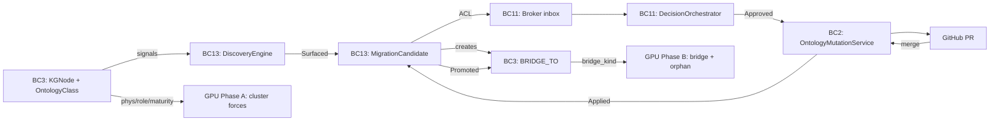

# Insight Migration Loop — Master Design

## 1. Executive summary

The Insight Migration Loop turns writing a Logseq note into the first step of building a governed, machine-reasoned vocabulary. When a `public:: true` note accumulates evidence — ontology wikilinks, an agent proposal, a maturity marker — VisionClaw surfaces it in the broker's inbox as a candidate class. The broker takes two minutes, approves, the system opens a GitHub PR, and on merge the note becomes a live OWL class Whelk can reason over, with the 3D physics view redrawing around it. A governed ontology grows as a by-product of note-taking. VisionClaw is uniquely positioned because it already runs the four ingredients nobody else combines: Logseq tacit input, a CUDA physics graph, Nostr-signed provenance, the Judgment Broker Workbench. The migration event itself is the novelty ([01-prior-art.md](./01-prior-art.md) §Genuine-Novelty Ledger).

## 2. The five pillars

**Identity.** Two Neo4j labels, `KGNode` and `OntologyClass`, share one IRI scheme `vc:{domain}/{slug}`. A `BRIDGE_TO` edge advances through `candidate → promoted → revoked` (or `rejected`, `colocated`). Promotion is an edge-label flip, never a node rewrite — provenance survives because identity does not move ([ADR-048](../../adr/ADR-048-dual-tier-identity-model.md)).

**Detection.** BC13 scores notes on eight signals (wikilink-to-ontology, semantic co-occurrence, explicit OWL, agent proposal, maturity, PageRank, recency, authority), normalises to `[0,1]`, combines with fixed weights summing to one, and squashes through `sigmoid(12·(raw − 0.42))`. Confidence is monotonically non-decreasing while active ([05-candidate-scoring.md](./05-candidate-scoring.md) §2).

**Governance.** A surfaced candidate becomes a `BrokerCase {category: "migration_candidate"}` with a `MigrationPayload`. The `DecisionOrchestrator` enforces that approval calls `ontology_propose`, writes the PR URL back, and emits a Nostr-signed `BrokerDecision`. Rollback is a new case `{category: "migration_rollback"}` — not a state rewind ([ADR-049](../../adr/ADR-049-insight-migration-broker-workflow.md)).

**Physics.** Five forces (physicality, role, maturity, bridging, orphan) render migration state as space. Phase A wires three dormant kernels already in `src/utils/semantic_forces.cu`; Phase B authors two new kernels over `BRIDGE_TO` edges. Phase A ships without any schema change ([03-physics-mapping.md](./03-physics-mapping.md) §9).

**Provenance.** Every bridge transition emits a NIP-33 Nostr bead (kind 30001) with tags `op`, `target_class_iri`, `source_kg_node`, `axiom_diff`, `whelk_consistency_report`, `parent_bead`. Revocations chain via `parent_bead`; the Whelk hash makes each reasoning snapshot tamper-evident ([02-bridge-theory.md](./02-bridge-theory.md) §7).

## 3. The canonical happy path

Rosa writes `Smart Contract.md` in `bc` with `public:: true` and three wikilinks — `[[Blockchain]]`, `[[Transaction]]`, `[[Autonomous Agent]]` — all resolving to existing `OntologyClass` nodes. BC13 assigns `vc:bc/smart-contract`, creates a `KGNode`, emits three `WikilinkToOntology` signals. The `blockchain-ontologist` agent fires an `AgentProposal` at 0.80; frontmatter carries `maturity:: ready`. Raw ≈ 0.47; sigmoid puts confidence at 0.68, crossing the 0.60 threshold.

BC13 creates `BRIDGE_TO {kind: "candidate", confidence: 0.68}` toward the OntologyClass twin, emits `MigrationCandidateSurfaced`, and the ACL makes a `BrokerCase` at `priority: Medium`. Rosa's 3D view renders a 1.2 Hz pulsing aura; `apply_bridging_attraction_kernel` pulls the KGNode at `0.35 × 0.68 = 0.238`/tick.

Rosa opens the card. DecisionCanvas splits: markdown left, proposed class right (parent `Contract`, properties `executed_on`, `triggers`), diff strip showing the OWL delta. She approves. `DecisionOrchestrator` emits `BrokerApprovedMigration`; BC2 opens a GitHub PR within 30 s carrying the Whelk consistency hash; the PR self-merges; BC2 commits the SPARQL PATCH; Whelk re-checks; BC13 flips the bridge to `promoted` and emits `MigrationPromoted`. `bridge_strength` jumps from 0.35 to 0.75; the KGNode accelerates toward its class over ~2 s. Toast: "Promoted: vc:bc/smart-contract — centrality +0.04." Wall-clock: under five minutes.

## 4. Integration map



## 5. Contradictions and reconciliations

**C1. Scoring formula.** PRD §6 gives five signals linear; 05-candidate-scoring §2 gives eight signals with sigmoid; ADR-049 gives a third four-signal form. **Resolution: 05-candidate-scoring is canonical** — most recent, only version with worked examples and cold-start modelling. PRD and ADR-049 edited to match (T0).

**C2. Thresholds.** PRD `0.35/0.55/0.75`; 05-candidate-scoring `0.60` with log-scaling `threshold(n) = 0.60 + 0.04·log10(n/400)`; ADR-049 `0.6`. **Resolution: 0.60 with log-scaling.** PRD's 0.55 was linear-raw; sigmoid equivalent is ~0.60. The 0.35 floor survives as a re-surface suppression rule; 0.75 as the high-priority badge.

**C3. Rollback modelling.** ADR-049 and DDD: rollback is a **new BrokerCase** `{category: "migration_rollback"}`. PRD §7 draws it as a **state** in the main state machine. **Resolution: new case.** Every rollback requires its own broker decision and audit trail. PRD should show `Promoted → (opens rollback case)` as a transition out, with the rollback machine rendered separately.

**C4. Physics phasing.** 03-physics-mapping §9 separates Phase A (three dormant kernels, no schema change) from Phase B (two new kernels, needs ADR-048). PRD §5.10 and acceptance tests treat the forces as one deliverable. **Resolution: separate sprints.** The acceptance feature file must split into `@phase-a` / `@phase-b` tags.

**C5. Rate limit vs clearance KPI.** 05-scoring caps surfacing at 10/broker/24h; PRD §8 targets clearance ≥ 80% over 7 days. Not in tension — rate limit protects cognitive load, clearance measures work completed. **Resolution: both stand.** Add a KPI on rate-limited overflow so owners see if the cap is too tight.

## 6. Ranked risk register

Severity × likelihood, canonical source. Mitigations in each source; no duplication.

1. **Ingestion 33% cliff** H×H — audit, PRD R10
2. **Identity mismatch (IRI drift)** H×M — PRD R1, ADR-048
3. **O(n²) loop breaks 30 Hz above 5k nodes** H×M — 03-physics Q1
4. **Broker fatigue** M×H — PRD R2, 05-scoring §6
5. **Agent hallucination in `ontology_propose`** M×M — PRD R6
6. **Ontology churn (promote-revert)** M×M — PRD R4
7. **PR webhook missed, BRIDGE_TO stuck** M×L — ADR-049 OQ4
8. **Agent-safety boundary breach** H×L — ADR-048
9. **Cold-start kills genuine candidates** L×M — 05-scoring §6
10. **Concept drift post-promotion** M×L — PRD R3
11. **GitHub outage** M×L — PRD R9
12. **Scale at 10k+ pages** M×L — PRD R7
13. **Permission escalation** H×VL — PRD R8
14. **Bad promotion violates policy** M×L — PRD R5

Risk 1 must clear before pilot (audit A1 + D1–D5) — blocking.

## 7. Sprint plan

Owner key: Me = integration lead, Eng = engineering agent, User = owner.

- **T0** (Me, 1h) — edit PRD §6 + ADR-049 §Scoring to reference 05-candidate-scoring
- **T1** (Eng, 1d) — land audit A1 (metadata store fix) + re-ingest mainKG · *prereq: audit*
- **T2** (Eng, 3d) — unified-pipeline D1 (canonical IRI) + frontmatter v2 · *T1*
- **T3** (Eng, 2d) — ADR-048 Neo4j schema (dual labels, BRIDGE_TO constraints) · *T2*
- **T4** (Eng, 1d) — backfill `colocated` and `candidate` bridge edges · *T3*
- **T5** (Eng, 3d) — Phase A physics: buffers + 3 dormant kernels behind flag · *T1*
- **T6** (Eng, 4d) — 8-signal scoring engine + monotonic refinement + suppression · *T2*
- **T7** (Eng, 3d) — `MigrationCandidate` aggregate + 8 domain events · *T6*
- **T8** (Eng, 2d) — ACL BC13 → BC11; `BrokerCase` migration category + payload · *T7*
- **T9** (Eng, 4d) — DecisionCanvas split-pane + PR invariant · *T8*
- **T10** (Eng, 5d) — `ontology_propose` + Whelk gate + Nostr bead · *T9*
- **T11** (Eng, 5d) — Phase B kernels + bridge-edge loader · *T3, T5*
- **T12** (Eng, 3d) — revert workflow: `migration_rollback` case · *T10*
- **T13** (Eng, 3d) — six KPIs into BC15 dashboard · *T10*
- **T14** (Eng, 2d) — split acceptance tests into `@phase-a` / `@phase-b` · *T5, T11*
- **T15** (User, 1d) — §10 checklist walkthrough + pilot selection

Critical path: T1 → T2 → T3 → T4 → T7 → T8 → T9 → T10. ~5 engineering weeks serial, 3 with parallel T5/T6/T11. T0 and T15 unblock nothing — run immediately. Phase A (T1, T2, T5) ships independently as a demo milestone.

## 8. Open questions requiring owner decision

**[B]** = before T1, **[D]** = during.

*Scoring:* [B] PageRank scope (05-Q1); [B] does `agent_confidence ≥ 0.9` bypass the 0.60 threshold (PRD Q2); [D] multi-agent aggregation (05-Q2); [D] retroactive demotion on rescale (05-Q3); [D] confidence decay for stale candidates (ADR-049 OQ2).

*Governance:* [B] defer cooldown global or per-role (PRD Q3); [B] rollback of depended-on classes — block or cascade (PRD Q4); [B] PR reviewer self-merge or second reviewer (PRD Q5); [D] self-approval (PRD Q6); [D] target-IRI lock during UnderReview (ADR-049 OQ1); [D] ontology-expertise claim required (ADR-049 OQ3).

*Identity/provenance:* [B] colocated explicit or implicit (ADR-048 OQ1); [D] `BRIDGE_TO` uniqueness (ADR-048 OQ3); [D] orphaned-source on deletion (ADR-048 OQ4).

*Physics:* [D] O(n²) accept or block (03-Q1); [D] orphan zone world-space or camera-relative (03-Q4).

*Product:* [B] pilot Rosa/Chen/Idris (PRD Q9); [B] pipeline D1–D5 accept or bridge as-is (PRD Q10).

Eight [B] questions must close before T1. Ten [D] questions surface during implementation.

## 9. Vocabulary alignment

- **MigrationCandidate** — BC13 aggregate with scored evidence. Synonyms: Candidate, Proposal. Matches DDD; distinct from BC12 WorkflowProposal.
- **MigrationCase** — BrokerCase subtype in BC11 with `category: "migration_candidate"`. Matches DDD and ADR-049.
- **BRIDGE_TO** — directed edge KGNode → OntologyClass. ADR-048 canonical; uppercase in Cypher, "bridge edge" in prose.
- **Promotion** — approved-and-merged event producing a live OntologyClass. Migration = whole loop; Promotion = the specific event.
- **Revocation** — rollback via a new broker case. Synonyms: Rollback, Revert, Retire. Matches `BRIDGE_TO.kind`; PRD should adopt.
- **Confidence** — scalar [0,1] driving surfacing. PRD §6's "readiness score" should retitle.
- **Ontology bead** — NIP-33 kind-30001 event recording a bridge transition. Narrows ADR-034's "bead" for migration-specific events.

Edits: PRD renames "readiness score" → "confidence" and "Revert" → "Revocation"; 02-bridge-theory's `op=retire` becomes `op=revoke` to match `BRIDGE_TO.kind`.

## 10. Confirmation checklist for owner review

*Identity* — [ ] canonical IRI `vc:{domain}/{slug}` with frontmatter override · [ ] dual Neo4j labels with `BRIDGE_TO` · [ ] agents never write `OntologyClass` directly

*Detection* — [ ] 8-signal scoring (supersedes PRD §6) · [ ] surface threshold 0.60 with log-scaling · [ ] monotonic confidence while active · [ ] cold-start expiry at 3 days below 0.4 · [ ] rate limit 10/broker/24h

*Governance* — [ ] `BrokerCase {category: "migration_candidate"}` shape · [ ] PR-on-approve as domain invariant · [ ] rollback as new BrokerCase · [ ] decide self-merge vs second-reviewer · [ ] decide defer cooldown

*Physics* — [ ] Phase A ships independently · [ ] Phase A defaults 0.40/0.30/0.15 · [ ] Phase B defaults 0.35/0.75/1.20 · [ ] `migration_physics_enabled` flag defaults false

*Provenance* — [ ] Nostr kind-30001 bead on every transition · [ ] Whelk consistency hash pinned · [ ] `parent_bead` chaining for revocations

*Exit* — [ ] PRD §9 exit criteria · [ ] audit A1 prerequisite · [ ] pilot chosen

Every box ticked + eight §8 [B] answered → Phase 3 begins at T1.

---

## 11. Owner decisions (2026-04-18)

All eight blocking questions closed. Canonical answers recorded here; downstream docs and code MUST conform.

### D1 — Scoring: PageRank scope (resolves 05-Q1)

S6 centrality is computed over **both public tiers: `KGNode` ∪ `OntologyClass`** (roughly the full post-fix ingested corpus). **Private source data is never pulled from GitHub in the first place**, so there is no scope concern — the parser fix (commit `b501942b1`) enforces this at ingestion. PageRank sees what the graph sees. No `workingGraph` private notes, no journals. ADR-048 identity model makes this computable on one combined graph with label-aware edge weights.

### D2 — Scoring: agent-confidence bypass (resolves PRD Q2)

**No bypass.** `agent_confidence ≥ 0.9` does NOT override the 0.60 surface threshold. Agents are one signal among eight; the sigmoid decides. This prevents a confident-but-wrong agent from saturating the broker inbox. Agent confidence contributes through S4 weight (0.20) same as any other signal. Canonical scoring: [05-candidate-scoring.md](./05-candidate-scoring.md).

### D3 — Governance: defer cooldown (resolves PRD Q3)

**Per-role cooldowns.** The defer-cooldown timer is configured per role (Broker, Admin, Auditor) via ADR-045 policy engine rules. Defaults:
- Broker: 72 hours
- Admin: 24 hours (more latitude)
- Auditor: 168 hours (observation role — slower cadence)
Policy engine rules override defaults per tenant.

### D4 — Governance: rollback of depended-on classes (resolves PRD Q4)

**Cascade via compensating PRs.** When revoking an `OntologyClass` that other classes `subClassOf`, the revocation mutation cascades to dependents, producing ONE compensating PR containing all affected changes. Rationale: rollback is rare; strictness surfaces worst-case behaviour early; one PR is still atomically reviewable. `reversible: true` is required on the original promotion to allow cascade; orphaning dependents is forbidden.

### D5 — Governance: PR merge policy (resolves PRD Q5)

**Schema-configurable: 1-of-1 OR 2-of-2.** The ontology repo's `.visionclaw/broker-policy.yaml` declares:
```yaml
promotion_merge_policy:
  mode: self_merge | second_reviewer   # choose per deployment
  required_role: Broker | Admin        # who can second
```
MVP ships both modes; pilot tenants pick one. Recommend `second_reviewer` for regulated-industry pilots (Chen), `self_merge` for fast-moving consultancy (Idris default per D7). Policy engine (ADR-045) enforces at merge-time.

### D6 — Identity: colocated bridge confirmation (resolves ADR-048 OQ1)

**Explicit confirmation.** When a `KGNode` and `OntologyClass` resolve to the same canonical IRI, the auto-created `BRIDGE_TO` edge materialises with `kind: colocated_unconfirmed`. The broker inbox surfaces it as a **one-click "confirm colocation"** card. Confirmation flips to `kind: colocated`. Rationale: audit trail matters more than the ~1-click friction; denies silent identity fusion.

### D7 — Product: pilot persona (resolves PRD Q9)

**Idris (consultancy principal).** Rationale: consultancies already have extensive tribal knowledge; they have patience for the loop because the output IS their billable methodology; they dogfood us on their own IP; they control their own ontology governance without regulatory gates. Rosa (research institute) and Chen (regulated medical devices) follow in v2.

### D8 — Product: Unified Knowledge Pipeline prereq (resolves PRD Q10)

**Bridge as-is.** The Insight Migration Loop does NOT gate on acceptance of D1–D5 in [../2026-04-18-unified-knowledge-pipeline.md](../2026-04-18-unified-knowledge-pipeline.md). Sprint T1 (audit A1 = MetadataStore fix, already landed in `b501942b1`) is the only hard prerequisite. Unified Pipeline decisions land in parallel; migration consumes whichever state exists when it runs.

---

### Decisions summary table

| # | Area | Decision |
|---|---|---|
| D1 | Scoring scope | Both public tiers (KGNode ∪ OntologyClass); private never ingested |
| D2 | Agent bypass | No — sigmoid decides, agent is one of eight signals |
| D3 | Defer cooldown | Per-role (Broker 72h, Admin 24h, Auditor 168h) |
| D4 | Rollback | Cascade via one compensating PR; orphaning forbidden |
| D5 | Merge policy | Schema-configurable (1-of-1 OR 2-of-2) |
| D6 | Colocation | Explicit one-click broker confirmation |
| D7 | Pilot | Idris (consultancy principal) |
| D8 | Pipeline prereq | Bridge as-is; only T1 (MetadataStore fix) is mandatory |

### Downstream updates required

Docs that reference the superseded PRD scoring formula or state machine need alignment:
- `prd-insight-migration-loop.md` §6 scoring → point to [05-candidate-scoring.md](./05-candidate-scoring.md) as canonical
- `prd-insight-migration-loop.md` §7 state machine → remove "Rollback" as a state, note it's a separate BrokerCase per ADR-049
- `ADR-049` §Scoring → add cross-ref to D5 schema contract for merge policy
- Acceptance tests → split `@phase-a` and `@phase-b` Gherkin tags

These follow-up doc edits are tracked in sprint T0.

**Phase 3 implementation sprint unblocked as of 2026-04-18.**
