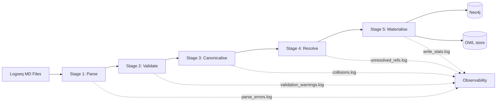

# Unified Knowledge Pipeline

## Prime Directive

**Every atom of information authored has exactly one canonical representation in the graph, participates in the physics, and is addressable by a deterministic IRI.** No silent losses. No grounded/ungrounded tiers. No domain hard-coding. No dead-code axiom types.

This design replaces the current accreted pipeline with a coherent one built around four principles:

1. **Unified page-as-class** — every page is simultaneously a Logseq page, a Neo4j GraphNode, and an OWL class. No more "this node has ontology, that node doesn't."
2. **Domain registry as data** — domains, colours, IRI prefixes, and physics weights live in one YAML file. Adding a domain is editing data, not shipping code.
3. **Every relationship is a force** — the 8 orphan relationship types (`has-part`, `requires`, `enables`, etc.) become first-class GPU forces with per-relationship tunable magnitude.
4. **Boundary validation with loud telemetry** — ingestion logs every rejection with reason. Dashboards surface coverage health. Silent failure becomes a build-failing test.

---

## 1. Source Data Model

### 1.1 One page → one IRI → one node

**Canonical IRI rule** (deterministic, stateless):

```
vc:{domain}/{slug}
  domain ∈ {keys of config/domains.yaml}       // lowercase, short
  slug   = kebab_case(page_name)                // spaces → hyphens, lowercase, strip punctuation
```

Examples:
- `Agent.md` in `mv` domain → `vc:mv/agent`
- `BC-0001-blockchain.md` in `bc` domain → `vc:bc/bc-0001-blockchain`
- `AI Safety.md` in `ai` domain → `vc:ai/ai-safety`

**Frontmatter takes precedence** — if a page declares `canonical-iri:: foo:bar`, that wins. Otherwise the rule derives it.

**Benefits**:
- No collision — slug is deterministic from filename
- No ambiguity — `Agent.md` and `Agents.md` get different slugs
- Cross-graph equivalence possible — same IRI = same concept across workingGraph + mainKG
- Machine-generated references (wikilinks, OWL axioms, edge sources) all resolve to one form

### 1.2 Frontmatter schema v2 (required vs optional)

Every page carries this minimum:

```yaml
---
canonical-iri: vc:ai/agent          # optional — derived if absent
domain: ai                           # REQUIRED (falls back to "uncategorised" with warning)
visibility: public                   # REQUIRED: public | review | private
kind: concept                        # concept | process | artefact | actor | relation | event
last-updated: 2026-04-18             # REQUIRED for change tracking
quality: draft                       # draft | enriched | authoritative
subclass-of: [agent, entity]         # list of canonical IRIs
disjoint-with: [location, process]   # list — enables strong cluster repulsion
relates-to: [knowledge-graph]        # weak associative
has-part: [policy, capability]       # compositional
requires: [training-data]            # dependency
enables: [automation]                # causal
bridges-to:                          # cross-domain hooks
  - { target: vc:bc/smart-contract, via: execution-trust }
aliases: [LLM Agent, AI Agent]       # for synonym resolution
---
```

**Optional** (Tier 2, for authoritativeness):
```yaml
authority-score: 0.75
sources:
  - { url: "https://...", kind: paper, retrieved: 2026-03-01 }
provenance-bead: nostr:naddr1...     # auto-filled by agents
```

Unknown keys are preserved as `Node.metadata[key]`, not discarded.

### 1.3 Domain registry (`config/domains.yaml`)

```yaml
domains:
  ai:
    name: "Artificial Intelligence"
    iri-prefix: "https://visionclaw.dev/ai/"
    color: "#00D4FF"
    physics:
      intra-domain-attraction: 1.2
      inter-domain-repulsion: 0.3
    canonical-page: vc:ai/artificial-intelligence  # optional hub node
  bc:
    name: "Blockchain"
    iri-prefix: "https://visionclaw.dev/bc/"
    color: "#F59E0B"
    ...
  mv: { ... }
  rb: { ... }
  tc: { ... }
  ngm: { ... }
  uncategorised:
    name: "Uncategorised (ingestion fallback)"
    color: "#6B7280"
    physics:
      intra-domain-attraction: 0.2
      inter-domain-repulsion: 0.2
```

Adding a domain = edit this file + optionally write its canonical hub page. No Rust code change. No frontend code change.

### 1.4 Promotion pipeline (working → review → main)

Three visibility states drive a clear lifecycle:

| visibility | Ingested as | Physics | Discovery |
|---|---|---|---|
| `private` | FileMetadata only | — | Invisible to graph |
| `review` | GraphNode with `kind: draft` | Reduced force weights | Shown in "Review Inbox" panel; visually dimmed |
| `public` | Full GraphNode + OWL class | Full weights | First-class visible node |

The transition `private → review → public` becomes an explicit promotion gesture (broker UI action, agent proposal, or frontmatter edit). 1,028 journal entries stay private. The 272 unflagged workingGraph pages become `review` candidates.

---

## 2. Ingestion Pipeline

### 2.1 Five-stage pipeline with boundaries



Each stage has a **single responsibility** and logs to a structured report:

**Stage 1 — Parse.** Read markdown. Extract frontmatter + body + wikilinks + OWL blocks. Output: one `RawPage` struct per file. Zero validation here. Any parse error is reported with filename and line.

**Stage 2 — Validate.** Check required frontmatter fields. Check values against `config/domains.yaml`. Downcase domain. Tag page as `valid`, `valid-with-warnings`, or `rejected`. Rejected pages still produce a `FileMetadata` row (for tracking) but no GraphNode. **Every rejection is logged with exact reason.**

**Stage 3 — Canonicalise.** Derive canonical IRI from frontmatter or rule. Resolve aliases against the known alias-index. Normalise wikilinks — `[[Agent]]` becomes `vc:mv/agent` (or the first matching alias). Detect IRI collisions (two files producing the same IRI) and log loudly.

**Stage 4 — Resolve.** Check every wikilink and OWL axiom reference against the canonical IRI set. Unresolved references go into `unresolved_refs.log` with source page, target, line. Don't silently drop them — they become "ghost" nodes (stub placeholder with `kind: ghost`) so they're visible in the graph and the owner can see what's missing.

**Stage 5 — Materialise.** Write to Neo4j: `GraphNode`, `OwlClass`, and the `EXTRACTED_FROM` edge linking GraphNode to its FileMetadata source. Write edges: `WIKILINK`, `SUBCLASS_OF`, `DISJOINT_WITH`, `EQUIVALENT_TO`, `HAS_PART`, `IS_PART_OF`, `REQUIRES`, `DEPENDS_ON`, `ENABLES`, `RELATES_TO`, `BRIDGES_TO`.

### 2.2 Kill the empty MetadataStore bug

`extract_metadata_store()` (`knowledge_graph_parser.rs:251-271`) currently returns empty. Stage 1's `RawPage.properties` replaces it with a real populated HashMap. Every parsed key ends up either on the node as a first-class field (domain, visibility, kind, quality, etc.) or as `Node.metadata[key]` for unknowns. Nothing discarded.

### 2.3 ID scheme upgrade

Replace `std::DefaultHasher` (non-deterministic across Rust versions, silent collision merges) with **Blake3 of canonical IRI → take first 31 bits → set MSB bit for population flag**. 

- Deterministic across releases
- Collision detection at Stage 4 (IRI collision log fires BEFORE hashing anyway)
- 4-bit population flag preserves existing wire protocol

### 2.4 Observability

Every ingestion run produces `reports/ingest-{timestamp}.json`:

```json
{
  "source": { "pages_scanned": 3330, "journals_skipped": 1028 },
  "parse": { "ok": 3280, "errors": 50 },
  "validate": { "public": 2260, "review": 280, "private": 690, "rejected": 50 },
  "canonicalise": { "canonical_iris": 2540, "collisions": 0 },
  "resolve": { "wikilinks": 8400, "unresolved": 420, "ghost_nodes_created": 180 },
  "materialise": { "graph_nodes": 2540, "edges": 9800, "owl_axioms": 1800 },
  "by_domain": { "ai": 345, "bc": 332, "mv": 1189, ... },
  "by_kind": { "concept": 1800, "process": 420, ... },
  "quality_histogram": { "draft": 850, "enriched": 1290, "authoritative": 400 }
}
```

The frontend reads the latest report and renders a **Corpus Health** panel on the enterprise dashboard. Ingestion health becomes a visible product feature.

---

## 3. Ontology Layer

### 3.1 Every page becomes an OWL class

Current state: 31% of nodes have no `owl_class_iri`. Proposed: every page gets one, even if nothing else is known.

A page with no `subclass-of` frontmatter still produces:

```
OwlClass(vc:ai/new-thing)
SubClassOf(vc:ai/new-thing vc:ai/thing)    // domain-implicit parent
```

Where `vc:ai/thing` is auto-created per domain as the root class. This means every page automatically participates in the semantic force field with at minimum a pull toward its domain hub.

### 3.2 Axiom-to-force mapping (complete)

| Frontmatter property | OWL axiom produced | GPU force | Default magnitude |
|---|---|---|---|
| `subclass-of:` | SubClassOf | Hierarchical attraction | 1.0 |
| `disjoint-with:` | DisjointWith | Repulsion | 2.0 |
| `equivalent-to:` | EquivalentTo | Strong colocation | 1.5 |
| `has-part:` | ObjectProperty `hasPart` | Mild attraction + compositional bond | 0.6 |
| `is-part-of:` | ObjectProperty `isPartOf` | Inverse — child pulled toward parent | 0.6 |
| `requires:` | ObjectProperty `requires` | Directed attraction (requirer → requirement) | 0.5 |
| `depends-on:` | ObjectProperty `dependsOn` | Same as `requires` (alias) | 0.5 |
| `enables:` | ObjectProperty `enables` | Directed attraction (enabler → enabled) | 0.4 |
| `relates-to:` | ObjectProperty `relatesTo` | Weak associative | 0.2 |
| `bridges-to:` | ObjectProperty `bridgesTo` + cross-domain flag | Cross-domain attraction (overrides domain repulsion) | 0.8 |

Every magnitude is tunable per-domain in `config/domains.yaml`. Per-page overrides possible via `physics-weight:: 1.5` frontmatter.

### 3.3 Whelk integration — extract all inferences

Currently: Whelk is asked for `named_subsumptions()` only. Proposed: extract every inference the reasoner computes:

```rust
let result = whelk::assert(&axioms);
let subs = result.named_subsumptions();
let disjoints = result.disjoint_pairs();        // wrapper to add
let equivs = result.equivalence_classes();      // wrapper to add
let unsat = result.unsatisfiable_classes();     // wrapper to add — critical for detecting broken ontologies
```

Inferred axioms are **materialised as edges in Neo4j** with `inferred: true` property, so the graph shows both authored and derived relationships. Inconsistency violations become `ValidationViolation` nodes visible in the Broker inbox.

### 3.4 Bridges (cross-domain)

`bridges-to:` deserves first-class treatment. Current state: the bridge is stored but never produces a distinct force. Proposed: a bridge edge produces a **targeted attraction that overrides the inter-domain repulsion** between those specific IRIs, not between their whole domains. This creates visible "bridge filaments" between clusters — exactly the kind of structure that makes insight discovery visible.

---

## 4. Discovery Features Unlocked

Once the above lands, new product-level features become feasible:

### 4.1 Ungrounded Hot Spot Detector

Query: which pages have >10 wikilinks but fewer than 2 `subclass-of` declarations?

Result: these are topics the owner's notes keep returning to but which haven't been formally classified. Surface them in the Broker inbox as enrichment prompts. Agents can propose ontology blocks for these via `ontology_propose`.

### 4.2 Stale Frontier Detector

Query: which pages have `last-updated` older than the median of their cluster's last-updated, AND have many inbound wikilinks?

Result: important-but-aging nodes. Candidates for scheduled review.

### 4.3 Orphan & Dead-End Dashboard

Show the 483 zero-edge nodes and the 420 unresolved wikilinks as two ranked lists. One click → agent-generated enrichment proposal or delete candidate.

### 4.4 Promotion Queue

Any `visibility: review` page appears in a Broker panel with the bridge from workingGraph. Approve → frontmatter flips to `public`, PR auto-generated, re-ingests.

### 4.5 Domain Imbalance View

Visualise the domain histogram: mv=1189 is 4× ai. Colour-code GPU clusters by size. Owner sees at a glance whether the corpus is skewed.

### 4.6 Inference Browser

Since Whelk-inferred edges are now materialised with `inferred: true`, we can render them visually distinct (dashed, dimmer). Click a node → show authored-only vs inferred-also. Makes the reasoner's contribution legible.

### 4.7 Shadow-Pattern Proposals

The Insight Ingestion Loop (README Layer 3) becomes operational: agent monitoring detects nodes frequently co-queried or co-mentioned in journals → proposes `relates-to` axioms → user reviews in broker → promotes to ontology.

### 4.8 Enrichment Ladder

Visualise every node by `quality: draft | enriched | authoritative`. Colour ramp or size. Owner prioritises enrichment on high-connectivity drafts.

---

## 5. Physics — why calibration changes

With the unified model:

- **Every node has a domain** → meaningful intra-domain attraction and inter-domain repulsion
- **Every node has a parent class** → hierarchical forces apply everywhere, not just to 33.8% of nodes
- **`disjoint-with` finally gets populated** (Tier C corpus seeding) → strongest repulsion force activates, cluster separation becomes a real physics signal instead of a prayer
- **Bridges create directed filaments** → visual richness without cluster fragmentation

At that point the question becomes "what are good weights for a balanced multi-force system" rather than "how do we stop the system from fighting itself." The physics calibration proposal I wrote earlier (damping 0.9, scalingRatio 2, repelK 80, centerGravityK 0.5, springK 10) can be retuned against this richer signal landscape.

---

## 6. Rollout

### Phase 1 — Ingestion fidelity (1-2 weeks)

- [ ] Fix empty MetadataStore (`A1` from audit)
- [ ] Add ingestion observability — reports/ingest-*.json + health panel
- [ ] Ingest existing corpus with current schema, populate source_file/source_domain
- [ ] Telemetry: verify 0% data loss at parser layer (target: ingest_count = file_count - rejected_count)

### Phase 2 — Canonical IRIs + domain registry (1 week)

- [ ] Write `config/domains.yaml` with the 6 known domains + `uncategorised`
- [ ] Implement `canonical_iri(page) -> String`
- [ ] Migrate existing GraphNodes to carry the canonical IRI
- [ ] Rewrite `ontology_enrichment_service` around the registry

### Phase 3 — Frontmatter schema v2 + validation (1-2 weeks)

- [ ] Define the v2 schema (above)
- [ ] Write validator that reports per-file warnings
- [ ] Commit CI check: `cargo run -- ingest --dry-run --fail-on-errors`
- [ ] Owner runs corpus hygiene pass (Tier C items)

### Phase 4 — Complete axiom-to-force mapping (1 week)

- [ ] Wire 8 orphan relationship types into `ontology_pipeline_service`
- [ ] Per-relationship magnitude in domain config
- [ ] Whelk inference extraction (disjointness, equivalence, unsatisfiable)
- [ ] Materialise inferred edges with `inferred: true`

### Phase 5 — Discovery features (2-3 weeks)

- [ ] Ungrounded Hot Spot Detector (API + Broker panel)
- [ ] Promotion Queue (Broker UI)
- [ ] Inference Browser (graph view toggle)
- [ ] Stale Frontier / Orphan dashboards (monitoring feature)

### Phase 6 — Physics recalibration (2-3 days)

- [ ] Run the calibration proposal against the enriched corpus
- [ ] Retune per-domain and per-relationship magnitudes
- [ ] Update defaults in `config/domains.yaml` and `src/config/physics.rs`

Total estimate: ~8 weeks of concentrated work. Each phase ships independently and produces value standalone.

---

## 7. Success Metrics

A redesign earns its keep by moving measurable numbers:

| Metric | Current | Target after Phase 1-2 | Target after Phase 4 |
|---|---:|---:|---:|
| Source pages → GraphNodes | 67% | 100% (minus journals-by-design) | 100% |
| GraphNodes with `owl_class_iri` | 69% | 100% | 100% |
| GraphNodes with populated `source_domain` | 0% | 100% | 100% |
| Unresolved wikilinks | ~25% | Logged, not silent | <5% (with ghost nodes) |
| Parsed axioms producing GPU forces | ~25% | 50% | 95%+ |
| OWL axiom types end-to-end | 3 | 3 | 11 |
| Whelk inferences materialised | 0% | 0% | 100% |
| disjointWith coverage | 0 | 0 | 50+ strategic axioms |
| Mean node degree | 3.4 | 5+ | 7+ |
| Orphan nodes (zero edges) | 483 | <200 | <50 |

---

## 8. What This Explicitly Does Not Do

- **Does not lock the ontology schema** — frontmatter schema v2 is versioned, breaking changes allowed with migration
- **Does not impose a global ontology standard** — each domain owns its axiom conventions inside its namespace
- **Does not require the corpus to be complete** — partial frontmatter still produces a valid node; quality=draft just means less physics weight
- **Does not remove agent autonomy** — agents still author, propose, and validate; this gives them a richer substrate to propose against
- **Does not pre-judge physics weights** — every magnitude is tunable in `domains.yaml`; the defaults are starting points, not truths

---

## 9. Why This Is the Right Shape

The current design treats ontology as an optional annotation on some pages. **The proposal treats ontology as the schema every page conforms to, with quality levels encoding how well each page fulfils the schema.** This inverts the relationship: the ontology is the canvas, pages populate it at varying densities.

That inversion unlocks three properties:

1. **Every node is in the physics.** No 31% silent subset.
2. **Every relationship is a force.** No dead-code axiom types.
3. **Every silent failure becomes telemetry.** Ingestion becomes debuggable.

Expansion, generalisation, and insight discovery fall out of these properties as consequences rather than features to build.

---

## 10. Requested Decision

To proceed, I need owner sign-off on:

**D1.** Accept the canonical IRI scheme `vc:{domain}/{slug}` and `config/domains.yaml` as the source of truth for both code and data.

**D2.** Accept frontmatter schema v2 as the contract for new and migrated pages.

**D3.** Accept the five-stage pipeline and the principle that every rejection must be logged with a reason (no silent drops).

**D4.** Accept the end-state that every page becomes an OwlClass, auto-generating minimal axioms when frontmatter is sparse.

**D5.** Priority order on the 6 phases, or reshuffle.

Everything else in this document is downstream of those five decisions. Once they're in, individual PRs become routine.
