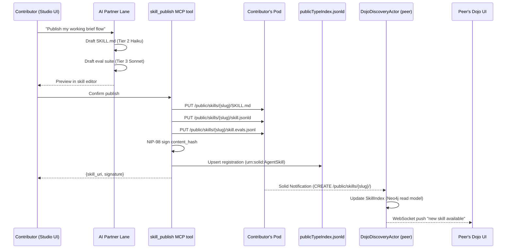
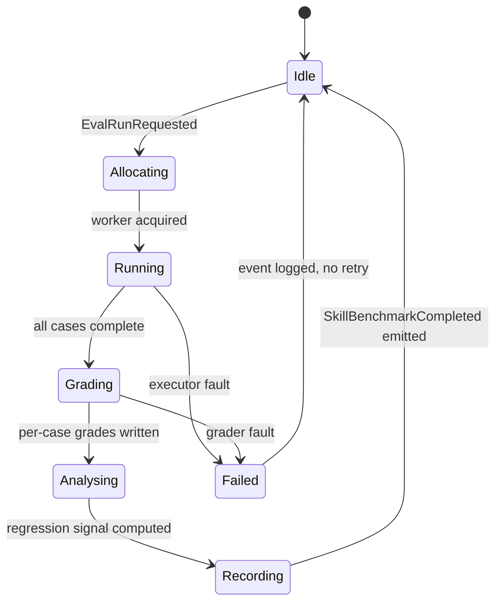
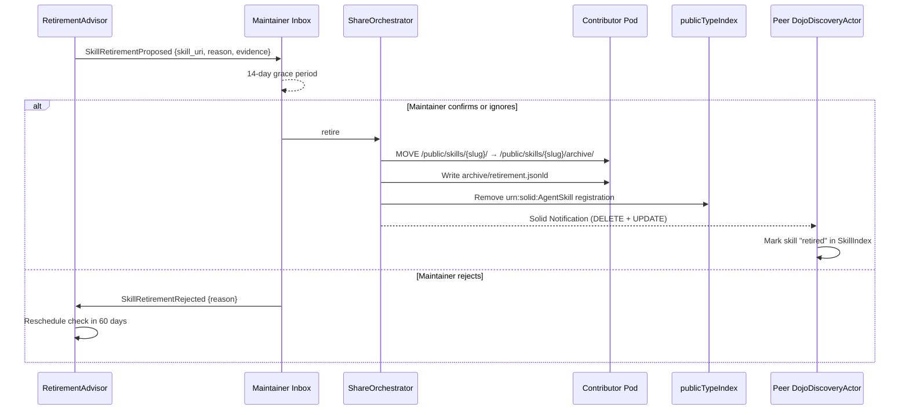

# Skill Dojo and Evaluation — Design Spec

## 1. Purpose

A contributor's workspace is measured by how quickly a single breakthrough
becomes the team's baseline. Ad-hoc skills — prompt snippets pasted into
Logseq, private aliases, personal CLI wrappers — do not compound. They rot
silently when the base model gets better, and they leak capability when the
contributor leaves.

This spec defines VisionClaw's **Skill Dojo**: a decentralised, pod-backed
registry of reusable agent skills with a first-class lifecycle of authoring,
publishing, discovery, installation, evaluation, promotion and retirement.

Two load-bearing principles drive the design:

1. **One person's breakthrough becomes everyone's baseline.** Any contributor
   who captures a working tool-sequence must be able to publish it such that
   collaborators discover and install it within minutes, without exchanging
   URLs or uploading to a central store (Evidence Annex **C5**).
2. **Skills are software, not prompts.** Every published skill carries an
   eval suite and reproducible benchmarks. Skills that the base model has
   caught up on must be retired, not left to drift (Evidence Annex **C9**,
   **C10**, Anthropic Skill Creator v2).

The Dojo is the operational surface for BC19 (Skill Lifecycle) and a first-
class consumer of BC18's `ShareOrchestrator`. It extends — not replaces —
the Pod layout ratified in ADR-052, and it registers skills using the
Type Index mechanism ratified in ADR-029.

## 2. Scope

### In scope
- Skill package format (SKILL.md + JSON-LD manifest + eval suite).
- Pod-based publishing through the public Type Index (ADR-029, ADR-052).
- Dojo UI discovery, installation and personal-library management.
- Eval suite format, grader taxonomy and benchmark storage.
- Distribution scopes (Personal / Team / Company / Public-Mesh) and the
  WAC rules that enforce each.
- Retirement flow and the signals that trigger it.
- Integration with Judgment Broker (ADR-041) for Team→Mesh promotion.
- Model-routing defaults per ADR-026 tiers.
- REST and WebSocket APIs, and the new `SkillRegistrySupervisor` actor tree.

### Out of scope
- The bespoke in-browser skill-authoring IDE (Phase 4 follow-up to
  PRD-003; this spec stops at the `skill_publish` MCP tool surface).
- Cross-tenant skill marketplace (federated multi-tenant mesh is a later
  ADR — this spec assumes single-tenant VisionClaw deployments that
  federate through Type Index discovery only).
- Skill billing / credits / monetisation.
- Automatic SKILL.md generation from raw transcripts (separate "Skill
  Harvester" background worker, referenced here but specified elsewhere).

## 3. SKILL.md canonical format

Every skill is a Pod-resident directory. The directory's name is the
skill's slug (lowercase-kebab-case, deterministic from the YAML `name`
via NFKD + slug conversion). The directory holds exactly three required
artefacts and one optional benchmarks sub-container.

### 3.1 Example — `market-analysis-brief`

The example below is a capability skill (Anthropic v2 nomenclature — the `capability.*` / `preference.*` prefix in §4's `category` enum is descriptive metadata on the `SkillPackage` aggregate, **not** a separate BC19 aggregate dimension or invariant). It
takes a ticker symbol and produces an evidence-grounded one-page market
brief. It is deliberately realistic: the tool sequence is executable, the
variables are typed, the eval suite is runnable.

```markdown
---
name: market-analysis-brief
version: 1.2.0
author: https://alice.pods.visionclaw.org/profile/card#me
description: >
  Generate an evidence-grounded, one-page market brief for a given equity
  ticker. Pulls live quotes and headlines via Perplexity, cross-references
  the local knowledge graph for related entities, and emits a structured
  Markdown brief with inline citations.
category: research.finance
tools:
  - perplexity_research
  - ontology_discover
  - ontology_traverse
min_model_tier: 3          # Sonnet-class reasoning required
prerequisites:
  - PERPLEXITY_API_KEY
  - pod_read:/private/contributor-profile/watchlist.jsonld
license: CC-BY-4.0
signature:
  algorithm: nip98-ed25519
  content_hash: sha256:3b4f...e901
  signed_by: npub1alice...
  signed_at: 2026-04-19T14:03:22Z
---

# Market Analysis Brief

## Purpose

Produce a one-page, decision-grade brief for a listed equity. The brief
is optimised for Monday-morning investment-committee review: each claim
is anchored to a source, and the graph-side cross-reference surfaces
entities already tracked in the contributor's ontology.

## When to use

Trigger this skill when the user asks for "a brief on X", "where are we
on TICKER", "summarise what's moved on TICKER this week", or when a
calendar agent detects an upcoming committee slot and the watchlist has
an un-briefed entry.

Do **not** trigger for generic market-wide queries ("how are markets
today?") — use `market-snapshot` instead.

## Prerequisites

- `PERPLEXITY_API_KEY` must be set in the contributor's pod at
  `/private/contributor-profile/secrets.jsonld`.
- The contributor's watchlist must exist; the skill refuses to run on
  tickers not present in `/private/contributor-profile/watchlist.jsonld`
  unless `force=true` is passed.

## Tool sequence

1. `ontology_discover({query: "{{ticker}} OR {{company_name}}", limit: 8})`
   — seed the local graph with candidate entities.
2. For each result with `relevance_score >= 0.6`:
   `ontology_traverse({start_iri: result.iri, depth: 2, relationship_types: ["has-part", "competitor-of", "subClassOf"]})`.
3. `perplexity_research({
        topic: "{{ticker}} {{company_name}} price movement and news last 7 days",
        depth: "deep",
        max_sources: 12
     })`.
4. Compose the brief using the `template.md` bundled resource, binding
   `{{graph_context}}` from step 2 and `{{web_context}}` from step 3.

## Variables

| Name | Type | Required | Description |
|------|------|----------|-------------|
| `ticker` | string (RIC) | Yes | E.g. `"VOD.L"`, `"AAPL"` |
| `company_name` | string | No | Auto-resolved from ticker if absent |
| `force` | boolean | No | Override watchlist gate; default `false` |
| `as_of` | ISO-8601 date | No | Defaults to today |

## Example invocation

```json
{
  "skill": "market-analysis-brief",
  "variables": {
    "ticker": "VOD.L",
    "as_of": "2026-04-20"
  }
}
```

## Expected outputs

- A Markdown document ~400–600 words, one page printed.
- Front-matter with `ticker`, `as_of`, `graph_nodes_referenced[]`,
  `source_urls[]`, `confidence`.
- Exactly three sections: **Price & Positioning**, **Catalysts & Risks**,
  **Portfolio Lens** (the last anchored to the contributor's watchlist
  and related holdings).
- Every factual claim carries an inline citation of the form
  `[^src1]`, expanded in the footnotes.

## Known limitations

- Relies on Perplexity `sonar` depth — recent filings not yet in the
  search index will be missed. Use `depth: "deep"` for IPO weeks.
- The ontology cross-reference is only as rich as the contributor's
  graph; first-run briefs for a new watchlist name will have thin
  Portfolio Lens sections.
- Not suitable for options-specific analysis — no greeks or implied-vol
  data is fetched.
```

### 3.2 Companion manifest — `skill.jsonld`

The manifest is what the Type Index points at. It is the machine-readable
projection of the SKILL.md frontmatter, typed as `urn:solid:AgentSkill`,
and it is what remote contributors fetch first during discovery (before
deciding whether to read the full SKILL.md body).

```json
{
  "@context": {
    "solid": "http://www.w3.org/ns/solid/terms#",
    "schema": "https://schema.org/",
    "vf": "https://narrativegoldmine.com/ontology#",
    "vfskill": "https://narrativegoldmine.com/ontology/skill#"
  },
  "@id": "https://alice.pods.visionclaw.org/public/skills/market-analysis-brief/",
  "@type": ["urn:solid:AgentSkill", "schema:SoftwareApplication"],
  "vfskill:name": "market-analysis-brief",
  "vfskill:version": "1.2.0",
  "vfskill:author": { "@id": "https://alice.pods.visionclaw.org/profile/card#me" },
  "schema:description": "Generate an evidence-grounded one-page market brief for a given equity ticker.",
  "vfskill:category": "research.finance",
  "vfskill:tools": ["perplexity_research", "ontology_discover", "ontology_traverse"],
  "vfskill:minModelTier": 3,
  "vfskill:prerequisites": [
    "PERPLEXITY_API_KEY",
    "pod_read:/private/contributor-profile/watchlist.jsonld"
  ],
  "schema:license": "https://creativecommons.org/licenses/by/4.0/",
  "vfskill:skillMd": { "@id": "SKILL.md" },
  "vfskill:evalSuite": { "@id": "skill.evals.jsonl" },
  "vfskill:latestBenchmark": {
    "@id": "benchmarks/2026-04-19-tier3-sonnet.json"
  },
  "vfskill:signature": {
    "vfskill:algorithm": "nip98-ed25519",
    "vfskill:contentHash": "sha256:3b4f...e901",
    "vfskill:signedBy": "npub1alice...",
    "vfskill:signedAt": "2026-04-19T14:03:22Z"
  }
}
```

### 3.3 Companion eval suite — `skill.evals.jsonl`

One JSON object per line. Every line is an executable test case. The
full schema is specified in §8.1.

```jsonl
{"id":"t01","prompt":"Give me a brief on VOD.L","expected_signals":["uses perplexity_research","uses ontology_discover","returns 3 sections"],"assertions":[{"type":"tool_call_equals","tool":"ontology_discover","args_match":{"query":"VOD.L.*"}},{"type":"jsonpath","path":"$.output.sections","expect":{"length":3}},{"type":"regex","field":"output.markdown","pattern":"\\[\\^src\\d+\\]"}],"grader":"executor+grader","tier_budget":3}
{"id":"t02","prompt":"Brief on FAKE.Z (not in watchlist)","expected_signals":["refuses or warns about watchlist gate"],"assertions":[{"type":"semantic","question":"Does the output either refuse or explicitly warn that FAKE.Z is not on the watchlist?","grader":"llm-judge","min_score":0.8}],"grader":"grader","tier_budget":2}
{"id":"t03","prompt":"Summarise today's markets","expected_signals":["does NOT trigger"],"assertions":[{"type":"tool_call_equals","tool":"market-analysis-brief","expect_absent":true}],"grader":"trigger-accuracy","tier_budget":1}
```

## 4. Pod layout for skills

The layout extends ADR-052's 3+1 containers. Nothing below overrides the
`POD_DEFAULT_PRIVATE` invariants; every path inherits its parent's
`acl:default`.

```
/public/skills/{skill-slug}/
├── SKILL.md                     Human + LLM-readable spec (required)
├── skill.jsonld                 Type Index manifest (urn:solid:AgentSkill)
├── skill.evals.jsonl            Eval suite — prompts + assertions
├── benchmarks/                  One run per file
│   └── {yyyy-mm-dd}-tier{N}-{model-id}.json
└── archive/                     Populated only on retirement
    └── retirement.jsonld        Who retired, when, why, replacement pointer

/private/skills/{skill-slug}/
├── SKILL.md                     Installed version, version-pinned
├── install.jsonld               {source_uri, installed_at, pinned_version, sha256}
└── local-evals.jsonl            Optional calibration runs from this contributor

/shared/skills/{team-slug}/{skill-slug}/
└── (same structure as /public/skills/; WAC group controls access per ADR-052)
```

### 4.1 Layout invariants

1. The `skill-slug` is globally stable for the lifetime of a skill;
   new versions bump the frontmatter `version`, not the slug.
2. `/public/skills/` is writable only via the `skill_publish` MCP tool
   (double-gated by the proxy — see §5.1 and ADR-052 §Decision).
3. `/private/skills/` is owner-only by ADR-052's default ACL. Install
   events write here unconditionally.
4. `/shared/skills/{team-slug}/` requires the contributor to be a member
   of the team's WAC group (populated in `/shared/.acl`).
5. A skill that never reaches public scope never leaves `/private/skills/`
   and is invisible to any peer.
6. Every benchmark file name encodes date, tier, and model ID so that
   retirement comparisons are deterministic string ops, not content
   parses.

## 5. Publishing flow



The critical moves:

- **Draft is generated**, not hand-typed. The Studio's AI Partner Lane
  produces a SKILL.md draft from the last successful agent session,
  using Tier 2 Haiku (cheap, good enough for structured frontmatter
  + markdown). The eval suite is generated separately at Tier 3
  (Sonnet), because assertion construction benefits from stronger
  reasoning.
- **Contributor edits before publish.** No auto-publish. The Studio
  surfaces a diff and an "expected-trigger" / "expected-not-trigger"
  preview (Anthropic v2's description-optimisation loop; see §8).
- **Publish is atomic at the Pod level.** All three files land in one
  batch, then the Type Index is updated, then the Solid Notification
  fires. If any step fails, the entire publish is rolled back and the
  contributor sees a structured error.
- **Peers discover via notification + Type Index crawl.** Peers are
  never polled opportunistically; `DojoDiscoveryActor` only crawls
  WebIDs the contributor has listed under `/private/contributor-profile/
  collaborators.jsonld` or that appear in the knowledge graph as
  `schema:sameAs` targets.

### 5.1 The `skill_publish` MCP tool

```json
{
  "name": "skill_publish",
  "description": "Publish a new or updated skill to the contributor's Pod and register it in the public Type Index.",
  "input_schema": {
    "type": "object",
    "required": ["name", "description", "tool_sequence", "eval_suite", "category"],
    "properties": {
      "name": {
        "type": "string",
        "pattern": "^[a-z0-9][a-z0-9-]{1,62}[a-z0-9]$",
        "description": "Stable slug; must match SKILL.md frontmatter name."
      },
      "version": {
        "type": "string",
        "pattern": "^\\d+\\.\\d+\\.\\d+(-[A-Za-z0-9.-]+)?$",
        "description": "Semver. Must be strictly greater than the currently-published version."
      },
      "description": { "type": "string", "maxLength": 600 },
      "category": { "type": "string", "enum": ["research.finance", "research.general", "authoring.docs", "authoring.slides", "ops.ci", "ops.data", "ops.security", "analysis.ontology", "preference.style", "capability.extraction", "capability.media"] },
      "tools": {
        "type": "array",
        "items": { "type": "string" },
        "description": "Ordered MCP tool names the skill invokes."
      },
      "tool_sequence": { "type": "array", "items": { "type": "object" } },
      "min_model_tier": { "type": "integer", "enum": [1, 2, 3] },
      "prerequisites": { "type": "array", "items": { "type": "string" } },
      "license": { "type": "string" },
      "eval_suite": {
        "type": "array",
        "items": { "$ref": "#/definitions/EvalCase" },
        "minItems": 3
      },
      "distribution": {
        "type": "string",
        "enum": ["personal", "team", "company", "public"],
        "default": "personal"
      },
      "team_slug": {
        "type": "string",
        "description": "Required iff distribution=team."
      }
    }
  },
  "output_schema": {
    "type": "object",
    "properties": {
      "skill_uri": { "type": "string", "format": "uri" },
      "skill_md_uri": { "type": "string", "format": "uri" },
      "type_index_entry": { "type": "string", "format": "uri" },
      "signature": {
        "type": "object",
        "properties": {
          "algorithm": { "const": "nip98-ed25519" },
          "content_hash": { "type": "string" },
          "signed_by": { "type": "string" },
          "signed_at": { "type": "string", "format": "date-time" }
        }
      },
      "baseline_benchmark": { "type": "string", "format": "uri" }
    }
  },
  "model_routing": {
    "skill_md_draft":   { "tier": 2, "preferred_model": "haiku" },
    "eval_suite_draft": { "tier": 3, "preferred_model": "sonnet" },
    "baseline_run":     { "tier": 3, "preferred_model": "sonnet" },
    "signature":        { "tier": 1, "handler": "agent-booster" }
  }
}
```

Rationale for the tier choices — see §13.

### 5.2 Signature and authenticity

Every published artefact set is signed once, at publish time. The
signature covers the SHA-256 of the tarball of SKILL.md + skill.jsonld
+ skill.evals.jsonl (deterministically sorted). The key is the
contributor's Nostr key, per ADR-040's dual-tier identity model.

- **Protocol**: NIP-98 HTTP Auth (already in use by the JSS sidecar).
- **Verification**: the peer's `DojoDiscoveryActor` computes the same
  hash on fetch; a mismatch excludes the skill from the SkillIndex and
  emits a `SkillSignatureMismatch` event to the Policy Engine (ADR-045).
- **Revocation**: a separate NIP-09 `delete` event, broadcast through
  the contributor's relay list, removes the signature. Peers that
  receive the delete remove the skill from their SkillIndex on the
  next crawl pass. The SKILL.md itself is moved to `archive/` with a
  `retirement.jsonld` record; existing installations keep working but
  are flagged in the Dojo UI.

## 6. Discovery flow

`DojoDiscoveryActor` is the Pod-side crawler. It sits under
`SkillRegistrySupervisor` and never talks to the internet directly —
all fetches go through the JSS sidecar's authed HTTP client.

### 6.1 Supervision tree

```
SkillRegistrySupervisor (1-for-1)
├── DojoDiscoveryActor           Pull-based peer crawl
├── SkillEvaluationActor         Runs eval suites
├── SkillCompatibilityScanner    Re-runs evals on model/tool drift
├── SkillRecommendationService   Ranks Dojo results for a contributor
└── SkillIndexProjector          Writes Neo4j read model
```

### 6.2 Crawl loop

1. **Seed list**: read `/private/contributor-profile/collaborators.jsonld`
   + `schema:sameAs` targets from the contributor's WebID profile +
   team members from `/shared/.acl` groups.
2. For each WebID (deduplicated), fetch the profile, resolve
   `solid:publicTypeIndex`, fetch it.
3. Filter type registrations to
   `solid:forClass == "urn:solid:AgentSkill"`.
4. For each hit:
   - Fetch `skill.jsonld`.
   - Verify signature (NIP-98 + content hash).
   - If new or version-bumped, upsert into Neo4j `SkillIndex` with
     properties from the manifest.
   - If the signature fails, log and drop.
5. Mark crawl complete; schedule next pass per the contributor's
   `discovery_interval` preference (default 15 min; minimum 60 s).

The crawler respects WAC: it never attempts to read `/private/skills/`
on a peer pod, and it authenticates all fetches with its own NIP-98
signature so peers can rate-limit or block it. `/shared/skills/`
requires the contributor to be a member of the target pod's team group;
if the membership check 403s, the skill is not indexed.

### 6.3 Dojo UI

The Dojo lives at `/studio/:workspaceId/skills/dojo` (enterprise-UI
route, ADR-046). It is a three-pane Studio sub-route:

| Pane | Contents |
|------|----------|
| **Left rail** | Distribution-scope filter (Personal / Team / Company / Mesh), category filter, min-tier filter, min-eval-pass-rate slider. |
| **Centre list** | Ranked results from `SkillRecommendationService`. Each row: name, author (WebID), version, category, latest benchmark pass-rate badge, "installed" indicator. |
| **Right preview** | SKILL.md rendered; eval suite summary; benchmark chart; "Install" button and "View evals" link. |

Ranking is contextual. The recommendation service combines:
- ontology distance between the skill's `category` and the contributor's
  current workspace focus (`ontology_discover` nearest-concept score);
- historical reuse by collaborators (`adopted-by-peers` count from the
  KPI stream, BC15);
- the contributor's role (`/private/contributor-profile/role.jsonld`);
- recency of the latest benchmark (older than 30 days is a soft demotion).

## 7. Installation flow

Install is an MCP tool: `skill_install`.

```json
{
  "name": "skill_install",
  "input_schema": {
    "type": "object",
    "required": ["skill_uri"],
    "properties": {
      "skill_uri": { "type": "string", "format": "uri" },
      "pin_version": { "type": "string", "description": "Defaults to the version at the target URI." },
      "run_local_evals": { "type": "boolean", "default": true }
    }
  },
  "output_schema": {
    "type": "object",
    "properties": {
      "install_uri": { "type": "string", "format": "uri" },
      "pinned_version": { "type": "string" },
      "local_eval_benchmark_uri": { "type": "string", "format": "uri" }
    }
  }
}
```

Install behaviour:
1. Fetch `skill.jsonld`, verify signature.
2. Fetch SKILL.md + eval suite.
3. Write to `/private/skills/{slug}/` with `install.jsonld` capturing
   `source_uri`, `pinned_version`, `installed_at`, `sha256`.
4. If `run_local_evals=true`, dispatch to `SkillEvaluationActor` with
   `mode=calibration`. Results land in `/private/skills/{slug}/
   local-evals.jsonl` and never leave the pod.
5. Register the skill in the contributor's `WorkspaceContext` so it
   surfaces in the AI Partner Lane palette.

Installing a skill does **not** auto-update. Updates are explicit via
`skill_install` with a higher pinned version, or via a
`SkillUpdateAdvised` inbox message from `SkillCompatibilityScanner`.

## 8. Eval discipline (Anthropic v2)

### 8.1 Eval suite format

```jsonc
{
  // Unique within the suite. Used as the benchmark join key.
  "id": "t01",
  // The user prompt fed to the agent session.
  "prompt": "Give me a brief on VOD.L",
  // Free-form signals the grader may reference; not independently
  // scored. Kept for auditability and for Comparator sub-agent output.
  "expected_signals": ["uses perplexity_research", "returns 3 sections"],
  // Hard assertions. ALL must pass for the case to pass.
  "assertions": [
    {
      "type": "tool_call_equals",
      "tool": "ontology_discover",
      "args_match": {"query": "VOD.L.*"},   // regex on arg values
      "expect_absent": false                 // optional; default false
    },
    {
      "type": "jsonpath",
      "path": "$.output.sections",
      "expect": {"length": 3}                // jsonpath + structural
    },
    {
      "type": "regex",
      "field": "output.markdown",            // dotted path into the run record
      "pattern": "\\[\\^src\\d+\\]",
      "min_matches": 3
    },
    {
      "type": "semantic",
      "question": "Is every factual claim anchored to a citation?",
      "grader": "llm-judge",
      "min_score": 0.8,
      "rubric": "Score 1.0 if every non-trivial claim has [^src] or footnote. Score 0.0 if any claim has no source."
    }
  ],
  // Which sub-agent(s) run this case. Defaults to all four.
  "grader": "executor+grader",
  // Model tier budget for the grader's LLM judge. Ignored by non-LLM
  // assertion types.
  "tier_budget": 3
}
```

Assertion types:

| Type | Purpose | Grader sub-agent |
|------|---------|------------------|
| `regex` | Pattern match against a field in the run record | Grader |
| `jsonpath` | Structural assertion via JSONPath + `expect` predicates (`equals`, `length`, `contains`, `gte`, `lte`) | Grader |
| `semantic` | Free-form judgement against a rubric; produces a score in [0, 1] | Grader (LLM judge) |
| `tool_call_equals` | The agent did or did not call a named tool, with optional arg regex; supports `expect_absent` for "must not trigger" cases | Executor |
| `latency` | Wall-clock below threshold | Executor |
| `token_budget` | Total tokens below threshold | Executor |
| `diff_against_baseline` | Comparator sub-agent blind A/B against a pinned baseline version | Comparator |

### 8.2 `SkillEvaluationActor`

Lifecycle:



Concretely:

1. **`EvalRunRequested`** carries `{skill_uri, mode, model_tier}` where
   `mode ∈ {baseline, team-gate, mesh-gate, drift, calibration}`.
2. The actor routes to a worker per ADR-026 tier policy — baseline and
   mesh-gate always Tier 3; calibration and drift default to the skill's
   own `min_model_tier`.
3. For each case, the Executor runs the skill (or runs the prompt
   skill-disabled, for baseline comparisons). The Grader applies the
   assertions. The Comparator is only invoked when `diff_against_baseline`
   is present.
4. The Analyzer aggregates per-case scores into a `SkillBenchmark`:

   ```json
   {
     "@type": "vfskill:Benchmark",
     "skill": {"@id": "…/public/skills/market-analysis-brief/"},
     "version": "1.2.0",
     "model": "claude-sonnet-4-7",
     "tier": 3,
     "run_at": "2026-04-20T08:15:00Z",
     "cases_passed": 28,
     "cases_total": 30,
     "pass_rate": 0.933,
     "mean_latency_ms": 4820,
     "mean_tokens": 7610,
     "baseline_pass_rate": 0.60,
     "skill_vs_baseline_delta": 0.333,
     "regression_vs_previous": -0.02,
     "per_case": [ { "id": "t01", "passed": true, "scores": {"semantic": 0.95} } ]
   }
   ```

5. The benchmark is written to `/public/skills/{slug}/benchmarks/{date}-
   tier{N}-{model-id}.json` (or `/private/...` for calibration runs),
   and `SkillBenchmarkCompleted` is emitted on the event bus. KPI
   pipelines (BC15) project into the contributor dashboard.

Baselines are pinned at publish time. A regression is flagged when
`regression_vs_previous < -0.05` on the same model/tier — the threshold
is deliberately conservative to swallow LLM nondeterminism.

### 8.3 Mandatory eval gates

| Transition | Required evidence | Enforced by |
|------------|-------------------|-------------|
| Personal → Team | ≥ 1 passing baseline benchmark on the skill's `min_model_tier` within the last 30 days. | `skill_publish` with `distribution=team` pre-flight |
| Team → Company | Team-gate evidence + ≥ 3 peers (distinct WebIDs) have installed the skill in the last 14 days | `skill_publish` with `distribution=company` pre-flight |
| Company → Mesh (Public) | Company-gate evidence + **broker review** (ADR-041) + fresh benchmark on the current production model tier | `ShareOrchestrator` → `BrokerCase` |
| Any public skill, ongoing | If baseline (skill disabled) matches or beats the skill, `RetirementAdvisor` opens a retirement proposal | `SkillCompatibilityScanner` periodic |

### 8.4 `SkillCompatibilityScanner`

Two triggers:

1. **Model routing config change** — ADR-026 tier mapping is edited, or
   a new base model is rolled out. The scanner enumerates every
   installed Personal and Team skill whose `min_model_tier` is affected
   and schedules a drift benchmark.
2. **Upstream MCP tool version change** — any tool referenced in a
   skill's `tools[]` publishes a breaking change (detected via MCP
   tool registry version bump). Skills referencing the changed tool
   are re-evaluated.

Outcomes:

- `regression_vs_previous < -0.15` → emit `SkillCompatibilityDrift`
  event; deliver a brief to the maintainer's `/inbox/` with the failing
  cases and suggested remediations. The skill is **not** disabled.
- `baseline_pass_rate >= pass_rate` → emit `SkillModelCaughtUp` event;
  `RetirementAdvisor` opens a retirement proposal (see §10).

## 9. Distribution scopes

The four distribution scopes below are **pod-layout refinements of the three BC18 `ShareState` values** (`Private` / `Team` / `Mesh`) defined in the DDD doc and ADR-057. The mapping is: `Personal` → `ShareState=Private`; `Team` and `Company` both map to `ShareState=Team` (differing only in WAC group membership breadth — team-scoped vs company-wide); `Public (Mesh)` → `ShareState=Mesh`. The ShareState stays canonical at the aggregate level; distribution scopes are the concrete pod-layout + governance refinements the Dojo UX exposes.

| Scope | BC18 `ShareState` | Pod location | WAC requirement | Indexed in | Who sees it | Governance |
|-------|-------------------|--------------|-----------------|------------|-------------|------------|
| **Personal** | `Private` | `/private/skills/{slug}/` | Owner-only (default) | Local workspace only | Owner | None; contributor's discretion |
| **Team** | `Team` | `/shared/skills/{team-slug}/{slug}/` | `/shared/.acl` names the team group; members get `Read` | Team `SkillIndex` (scoped query) | Team members | Team lead approves via the Team Settings pane; approval mints the WAC group entry |
| **Company** | `Team` (company-wide group) | `/shared/skills/company/{slug}/` | Company-wide WAC group (all provisioned contributors) | Company `SkillIndex` | All contributors | Admin approves; KPI Lineage (ADR-043) tracks adoption |
| **Public (Mesh)** | `Mesh` | `/public/skills/{slug}/` | `foaf:Agent` Read + owner Write/Control (ADR-052) | Broadcast via public Type Index | Any peer on the federated mesh that can reach the Pod | **Broker review** (ADR-041) required; promotion emits a signed `SkillPromoted` event carrying a promotion certificate |

Double-gating, per ADR-052:
- **Scope flag**: the skill's `distribution` field in the manifest.
- **Container path**: the target path under which `skill_publish`
  writes.

Both must agree. Attempting to publish `distribution=public` to
`/shared/skills/...` returns 403. Attempting to publish
`distribution=personal` to `/public/skills/...` returns 403.

## 10. Retirement

Three triggers, all converging on the same flow:

1. **`SkillModelCaughtUp`** — §8.4 scanner detects the skill no longer
   beats baseline.
2. **Unused-for-N-days** — no invocation in the last `N` days (default
   `N=90` for Public, `60` for Company, `30` for Team). Emitted by the
   KPI pipeline.
3. **Superseded-by-newer-version** — a new skill with the same slug
   publishes and the previous version has had no installs in 14 days.

Flow:



Installed copies continue to work — the pinned version in
`/private/skills/` is untouched — but the Dojo UI flags them with a
"retired by author" badge and suggests any `replaced_by` pointer from
`retirement.jsonld`.

Retirement is a **first-class recommendation**, not a disablement.
Contributors who still get value from a retired skill keep it; but the
mesh stops surfacing it, and it does not count toward institutional
capability metrics (BC15).

## 11. Integration with Broker (ADR-041 / ADR-049)

Team → Mesh promotion routes through the Judgment Broker, reusing the
BrokerCase object model.

1. A team contributor clicks **Promote to Mesh** in the Dojo.
2. `ShareOrchestrator` (BC18) opens a `BrokerCase`:

   ```json
   {
     "case_type": "skill_promotion",
     "subject": { "@id": "…/shared/skills/research/market-analysis-brief/" },
     "payload": {
       "skill_uri": "…",
       "latest_benchmark_uri": "…",
       "eval_suite_uri": "…",
       "adopted_by": ["npub1alice…", "npub1bob…", "npub1carol…"],
       "proposer": "npub1alice…"
     },
     "evidence_bundle": ["…skill.jsonld", "…benchmarks/2026-04-18-tier3-sonnet.json"]
   }
   ```
3. The broker's Decision Canvas renders a Skill Preview widget (new
   wasm-visualization component, ADR-047) containing:
   - SKILL.md preview;
   - benchmark pass-rate sparkline across versions;
   - tool-chain diagram highlighting any high-trust tools (e.g.
     `ontology_propose`, which mutates the ontology);
   - adoption heatmap.
4. On **Approve**:
   - `SkillPromoted` event carries a signed promotion certificate
     (broker's Nostr key, NIP-98).
   - `ShareOrchestrator` COPIES the skill tree from `/shared/skills/.../`
     into the publisher's `/public/skills/...`, updates the Type Index,
     and propagates the promotion cert into `skill.jsonld`.
   - Peer `DojoDiscoveryActor`s see the skill under its public URI on
     the next crawl pass; the cert is what distinguishes a
     broker-reviewed public skill from an unreviewed public skill
     (the Dojo UI ranks certified skills higher and shows a
     "mesh-certified" badge).

On **Reject**: the BrokerCase closes with a reason; `ShareOrchestrator`
writes a rejection note to the proposer's `/inbox/`; no Pod-side
changes occur.

## 12. REST / WebSocket API

All endpoints are under `/api/skills` on the VisionClaw backend and
are authenticated per ADR-011 (universal auth enforcement, NIP-98).

| Method | Path | Purpose |
|--------|------|---------|
| `GET` | `/api/skills/dojo?scope=&category=&q=&min_pass_rate=` | Query the `SkillIndex` Neo4j read model. Scope filter respects the contributor's WAC memberships. |
| `GET` | `/api/skills/:skill_id` | Full manifest + latest benchmark + installed-by-me flag. |
| `POST` | `/api/skills/publish` | Thin wrapper around the `skill_publish` MCP tool. Accepts the same payload. |
| `POST` | `/api/skills/:skill_id/install` | Wrapper around `skill_install`. |
| `POST` | `/api/skills/:skill_id/evals/run` | Manually trigger an eval run. Body: `{mode, model_tier}`. |
| `GET` | `/api/skills/:skill_id/benchmarks` | List of benchmark objects. Supports `?since=` filter. |
| `POST` | `/api/skills/:skill_id/promote` | Open a `BrokerCase` for Team→Mesh. |
| `POST` | `/api/skills/:skill_id/retire` | Maintainer-initiated retirement. |
| `DELETE` | `/api/skills/:skill_id/installations/me` | Uninstall from own pod. |

WebSocket topic: `/api/ws/dojo`.

Events pushed (all carry a `schema:sameAs` WebID so the client can
render attribution):

- `SkillPublished {skill_uri, author, category}`
- `SkillBenchmarkCompleted {skill_uri, version, pass_rate, delta}`
- `SkillPromoted {skill_uri, certificate_uri}`
- `SkillRetirementProposed {skill_uri, reason}`
- `SkillModelCaughtUp {skill_uri, baseline_pass_rate, skill_pass_rate}`
- `SkillSignatureMismatch {skill_uri, reason}`
- `SkillCompatibilityDrift {skill_uri, regression}`

## 13. Model routing (ADR-026 tiers)

| Operation | Tier | Rationale |
|-----------|:----:|-----------|
| Skill tool-sequence execution | per-skill `min_model_tier` | Skills declare their own minimum; executor honours and never downgrades. |
| SKILL.md draft generation (publish) | 2 (Haiku) | Structured markdown + frontmatter; Haiku is sufficient and 50× cheaper than Sonnet. |
| Eval suite draft generation | 3 (Sonnet) | Assertion construction requires multi-step reasoning about edge cases. |
| Semantic assertion grading (LLM judge) | 3 (Sonnet) | Grader must read outputs, apply rubrics; Haiku under-scores borderline cases in empirical tests. |
| Regex / jsonpath / tool_call_equals grading | 1 (Agent Booster) | Deterministic string / structural ops; no LLM needed. |
| Benchmark aggregation (Analyzer) | 1 (Agent Booster) | Pure arithmetic + serialisation. |
| Baseline run (skill disabled) | matches skill's tier | Controls for model-variable so the delta is meaningful. |
| Retirement Advisor narrative | 2 (Haiku) | Drafts the inbox message; Haiku suffices. |
| Dojo search ranking | 1 (pure index query) | Neo4j traversal; no LLM. |
| Skill description-optimisation loop | 3 (Sonnet) | Iterative rewrite against held-out trigger tests; needs Sonnet-class reasoning. |
| Trigger-accuracy eval generation | 3 (Sonnet) | 20-case should/shouldn't-trigger set, per Anthropic v2. |

## 14. Security and policy hooks

`PolicyEngine` (ADR-045) evaluates at every state transition. Each
check is a pure function over the transition payload plus the
contributor's identity; failures return structured reasons.

| Transition | Policy checks |
|------------|---------------|
| **Publish** | PII scan on SKILL.md body (`aidefence_has_pii`); forbidden tool combinations (e.g. `ontology_propose` + no `ontology_validate` is denied — creates unchecked axioms); signature presence and validity; slug uniqueness within the Pod; category whitelist. |
| **Install** | Consent to the skill's `tools[]` scopes (contributor must explicitly approve each tool on first install); prerequisite check (env vars present, required pod paths readable); signature verification; min-tier availability in the deployment. |
| **Team share** | WAC group authorisation (contributor is a member of the named team group with Write); skill has Personal → Team gate evidence per §8.3. |
| **Mesh share** | Broker approval present and cert-verified; public container WAC matches ADR-052; no tool in `tools[]` is flagged `do-not-publish` by the connector governance policy (ADR-044). |
| **Retire** | Maintainer is the skill author OR a delegated team lead; grace period has elapsed OR maintainer explicitly confirmed; no active installs require a `replaced_by` pointer (soft-warn, not block). |

Every failed policy check emits a `PolicyViolation` event consumed by
the SOC dashboard and the contributor's inbox — the inbox message
includes remediation guidance authored by the policy rule itself.

## 15. Metrics

Per-skill metrics (projected by `SkillIndexProjector` into BC15 KPI
streams):

| Metric | Definition | Source |
|--------|------------|--------|
| Install count | Distinct WebIDs with an `install.jsonld` whose `source_uri` matches this skill | Crawled + self-reported |
| Eval pass rate | Latest benchmark `pass_rate` | Benchmark file |
| Benchmark drift | `regression_vs_previous` over last 3 runs | Derived |
| Baseline delta | `skill_vs_baseline_delta` | Benchmark file |
| Retirement status | `active | retirement-proposed | retired` | Event stream |
| Reuse rate | `install_count / distinct_peers_who_saw_it` | Dojo impressions + installs |
| Median time-to-first-invocation | Install to first successful invocation, per installer | Workspace telemetry |

Per-contributor metrics:

| Metric | Definition |
|--------|------------|
| Skills authored | Count of skills where `author == me` and not retired |
| Skills adopted-by-peers | Distinct non-self WebIDs that installed my skills |
| Mesh-promotion count | Broker-approved `SkillPromoted` events where I am the author |
| Institutional lift | Per-skill `adopted-by-peers × mean benchmark delta` summed; BC15 headline KPI tying back to Evidence Annex C5 |

## 16. Open questions

1. **Forward-referencing tools.** A skill may wish to name a tool that
   the Pod owner's instance does not yet have installed (e.g. a new
   Perplexity model variant). Do we permit publish with a warning, or
   refuse? Current assumption: permit, and surface in the Dojo UI as
   an install-time prerequisite; needs validation.
2. **Skill dependencies.** A skill may wish to chain into another
   skill. Do we introduce a formal `depends_on` field in the manifest
   or require the dependency to be embedded? A dependency graph
   creates a package-manager problem we would rather avoid; but flat
   copy-paste loses version discipline. Proposed compromise: declare
   dependencies at publish time but resolve them at install time (pin
   the exact versions the author used) — revisit after Phase 4.
3. **Preventing eval gaming.** An author can write an eval suite that
   their skill trivially passes (tautological assertions, overfitted
   prompts). Do we require broker-reviewed skills to pass a
   third-party "meta-eval" that checks the assertion diversity
   (semantic + structural + negative cases) and trigger-accuracy
   split, per Anthropic v2's description-optimisation loop?
4. **Cross-tenant trust.** Today signatures are Nostr keys; Nostr keys
   are cheap and anonymous. At what point do we require verified
   organisational claims (NIP-05 / NIP-39 domain verification) before
   a skill is eligible for public mesh promotion?
5. **Benchmark cost attribution.** Baseline benchmarks at Tier 3 are
   not free. If a contributor publishes 10 skills and each re-benchmarks
   quarterly across three models, the cost is non-trivial. Do we cap
   benchmarks per contributor per month, or charge against a team
   budget? Related: should `SkillCompatibilityScanner` re-runs be
   rate-limited per skill rather than run on every upstream change?
6. **Private-skill exposure in benchmarks.** A local calibration run
   (`/private/skills/.../local-evals.jsonl`) may reveal information a
   contributor considers sensitive (their prompts, their data). The
   projector currently aggregates only pass-rate for the Dojo UI —
   but even that is a side-channel. Do we make Dojo-side metrics
   opt-in, or is the default "leak only pass rate" acceptable?

## 17. References

- **PRD-003** — Contributor AI Support Stratum.
- **ADR-057** — Contributor Enablement Platform (companion ADR).
- **ADR-026** — 3-tier model routing (cited throughout §5, §8, §13).
- **ADR-027** — Pod-backed graph views (write-master / performance-layer split).
- **ADR-029** — Type Index for agent and view discovery (the Dojo's registration primitive).
- **ADR-030** — Agent memory in Solid Pods (reuse of pod-based storage conventions).
- **ADR-040** — Enterprise identity strategy (Nostr-key signatures).
- **ADR-041** — Judgment Broker Workbench (Team→Mesh promotion review).
- **ADR-042** — Workflow proposal object model (BrokerCase shape).
- **ADR-043** — KPI lineage (institutional-lift metrics).
- **ADR-044** — Connector governance privacy (tool publication policy).
- **ADR-045** — Policy Engine approach (publish/install/share checks).
- **ADR-046** — Enterprise UI architecture (the Dojo route).
- **ADR-047** — WASM visualisation components (Skill Preview widget in Decision Canvas).
- **ADR-048** — Dual-tier identity model (WebID ↔ Nostr linkage).
- **ADR-049** — Insight Migration Broker Workflow (promotion flow analogue).
- **ADR-052** — Pod default WAC + public container (layout substrate).
- **Evidence Annex C5** — "One person's breakthrough becomes everyone's baseline."
- **Evidence Annex C9** — Skills as software assets with a lifecycle.
- **Evidence Annex C10** — Skill retirement discipline.
- **Anthropic Skill Creator v2** — `presentation/2026-04-20-best-companies-ai/90-anthropic-skill-creator-v2.md`.
- **VisionClaw Agent Orchestration Guide** — `docs/how-to/agent-orchestration.md` (7 MCP ontology tools, Perplexity integration).
- **VisionClaw Agent Skills Catalog** — `docs/reference/agents-catalog.md` (existing skill inventory referenced by the Dojo).
- **NIP-98** — HTTP Auth (signing protocol).
- **NIP-09** — Event deletion (revocation).
- **NIP-39** — External identities in profiles (WebID ↔ Nostr claim).
- **Solid Protocol §4** — Access Control (WAC).
- **Solid Notifications Protocol (WebSocketChannel2023)** — skill publish / retire event propagation.
