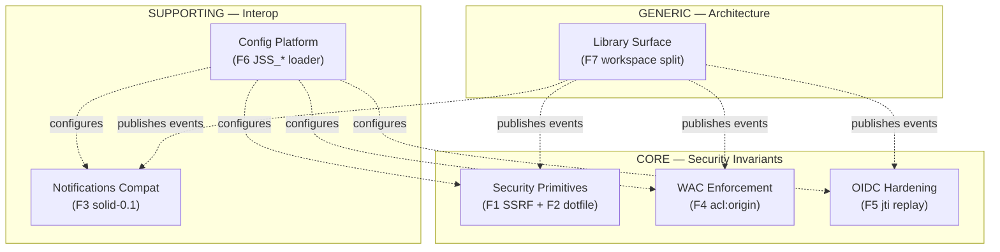

# Sprint 4 — JSS Parity Migration — DDD Master Document

> **Status**: Sprint 4 design artefact. Companion to
> [`../../prd/jss-parity-migration.md`](../../prd/jss-parity-migration.md)
> and [`../../adr/ADR-056-jss-parity-migration.md`](../../adr/ADR-056-jss-parity-migration.md).
> Source material: `crates/solid-pod-rs/GAP-ANALYSIS.md`,
> `crates/solid-pod-rs/PARITY-CHECKLIST.md`,
> `crates/solid-pod-rs/docs/reference/jss-feature-inventory.md`.

## 1. Scope

Sprint 4 closes the v0.3.x → v0.4.0 gate identified in `GAP-ANALYSIS.md §I`
and table `§H` ranks 1–4, 7 plus the architectural split in `ADR-054`. The
work is a **parity ratchet**: each ticket either brings solid-pod-rs to
behavioural equivalence with the upstream JavaScriptSolidServer (JSS) on a
named surface, or formalises a deliberate divergence as a documented
semantic-difference.

Seven F-tickets define the sprint:

| F-ticket | Name | Gap reference | Priority |
|---|---|---|---|
| **F1** | SSRF guard primitive | GAP §H rank 1, rows 114–115 | P0 |
| **F2** | Dotfile allowlist primitive | GAP §H rank 1, row 115 | P0 |
| **F3** | `solid-0.1` notifications adapter | GAP §H rank 2, row 91 | P1 |
| **F4** | `acl:origin` enforcement | GAP §H rank 3, row 51, §F.2 | P1 |
| **F5** | DPoP jti replay cache | GAP §H rank 4, row 64 | P1 |
| **F6** | JSS-compatible config loader | GAP §H rank 7, rows 120–124 | P2 |
| **F7** | Library-vs-server workspace split | ADR-054 | P1 |

F1–F6 are additive inside the existing crate. F7 is structural: it carves
`solid-pod-rs` into a pure library and pushes the HTTP shell into a new
`solid-pod-rs-server` binary crate, with four placeholder crates seeded for
v0.5.0 extension surfaces.

## 2. Bounded contexts

Six bounded contexts carry the sprint. Each owns a distinct consistency
boundary, language, and invariant set.

| Context | Type | Aggregates | Document |
|---|---|---|---|
| Security Primitives | Core | `SsrfPolicy`, `DotfileAllowlist` | [01](./01-security-primitives-context.md) |
| Notifications Compat | Supporting | `LegacyNotificationChannel` | [02](./02-notifications-compat-context.md) |
| WAC Enforcement | Core | `AccessDecision`, `AclDocument` (extended) | [03](./03-wac-enforcement-context.md) |
| OIDC Hardening | Core | `DpopReplayCache` | [04](./04-oidc-hardening-context.md) |
| Config Platform | Supporting | `ServerConfig` | [05](./05-config-platform-context.md) |
| Library Surface | Generic | `PodService`, `PodServer` | [06](./06-library-surface-context.md) |

## 3. Cross-context policies

### 3.1 Parity ratchet

No F-ticket lands without a corresponding row update in
`PARITY-CHECKLIST.md`. `present` or `semantic-difference` status must be
justified against the JSS source path cited in the checklist row. New
behaviour that diverges from JSS must be logged as `net-new` or
`semantic-difference` with an explicit rationale, never as a silent
deviation. The parity percentage at sprint close is the sprint's primary
success metric.

### 3.2 AGPL-3.0 conformance

Every context's module tree carries the AGPL-3.0-only NOTICE section
mirroring `crates/solid-pod-rs/NOTICE`. New crates spawned by F7
(`solid-pod-rs-server` and the four v0.5.0 placeholders) inherit the same
licence header at creation. No context introduces a dependency under a
licence incompatible with AGPL-3.0-only; `deny.toml` enforces.

### 3.3 Feature-flag discipline

Each F-ticket's behaviour is gated behind a Cargo feature in the owning
crate:

| F-ticket | Feature flag | Default? |
|---|---|---|
| F1 SSRF guard | `jss_v04_ssrf` (rolled into `jss_v04` umbrella) | on (primitives always available) |
| F2 Dotfile allowlist | `jss_v04_dotfile` | on |
| F3 `solid-0.1` adapter | `jss_v04_notifications_legacy` | off (opt-in legacy compat) |
| F4 `acl:origin` | `jss_v04_wac_origin` | on (spec conformance) |
| F5 jti replay cache | `jss_v04_oidc_replay` (requires `oidc`) | off by default; on when `oidc` selected |
| F6 Config loader | `jss_v04_config` | off (belongs in server crate) |
| F7 Workspace split | n/a (structural) | always on |

The umbrella feature `jss_v04` transitively enables the on-by-default
subset for consumers who want the whole parity bundle without feature
book-keeping.

### 3.4 Event bus

Domain events cross context boundaries via `tokio::sync::broadcast`. A
single `DomainEventBus` owned by the library core publishes typed events
derived from a crate-level `enum DomainEvent`. Each context declares its
own event variants (see context docs §"Domain events"). Subscribers
attach at binder-wiring time; no context directly calls another.

Rationale: broadcast (vs mpsc or full event-sourcing) fits the
publish/subscribe shape we need (many observers, at-most-once semantics,
bounded back-pressure), avoids introducing a new dependency, and is
trivially replaceable with a stronger bus if persistence ever becomes a
requirement.

### 3.5 Telemetry

Each context opens a `tracing::Span` scoped to its aggregate root
operation. Span names follow `solid_pod_rs::<context>::<operation>`.
Domain-event emission is a `tracing::event!(Level::INFO, …)` keyed by the
event variant name so a single subscriber surfaces both structured logs
and fan-out notifications.

### 3.6 Testing ratchet

Every aggregate carries:
- unit tests for invariants (proptest where inputs are non-trivial),
- integration tests against JSS-fixture input where an analogous JSS
  test exists (cross-walked via checklist row),
- criterion benchmark for any hot-path primitive (F1, F5 in particular).

## 4. Map to v0.4.0 F-tickets (PRD reference)

The PRD (`../../prd/jss-parity-migration.md`) enumerates F-tickets F1–F7
with acceptance criteria. This DDD breakdown supplies the **why and
where**: each F-ticket maps to exactly one bounded context document (F1
and F2 share the Security Primitives context). ADR-056
(`../../adr/ADR-056-jss-parity-migration.md`) captures the strategic
decision to adopt this split; the DDD breakdown captures the tactical
design that realises it.

## 5. Closing ship gate

Sprint 4 is "done" when:

1. All six context documents have shipped code matching their aggregate
   and invariant specifications.
2. PARITY-CHECKLIST.md rows 51, 64, 91, 114–115, 120–124 move from
   `missing`/`partial-parity` to `present` or `semantic-difference`.
3. `cargo test --features jss_v04` passes in both the library crate and
   the new server crate.
4. ADR-054 lands formalising the workspace split.
5. Workspace builds with four placeholder crates present but empty
   (`activitypub`, `git`, `idp`, `nostr`) so v0.5.0 work can begin
   without further restructuring.

Parity percentage target: ≥82% on `PARITY-CHECKLIST.md` strict count
(up from 74%), driven by the five missing rows transitioning to present.
