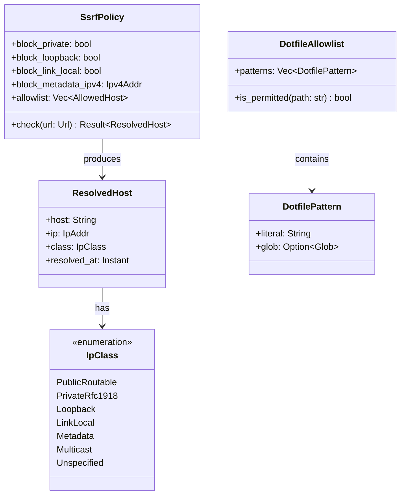

# Bounded Context: Security Primitives

> **Sprint 4 / F1 + F2**. Closes GAP-ANALYSIS.md §H rank 1, PARITY-CHECKLIST.md
> rows 114 (SSRF guard) and 115 (dotfile allowlist). Upstream references:
> `JavaScriptSolidServer/src/utils/ssrf.js:15-157` and
> `JavaScriptSolidServer/src/server.js:265-281`.

## Problem statement

solid-pod-rs today leaves two server-edge security controls to the HTTP
binder: (a) outbound URL validation before issuing server-side fetches
(JWKS, webhook delivery, AP inbox delivery) and (b) dotfile path filtering
on inbound requests. JSS bakes both into the server core. That asymmetry
means every consumer of solid-pod-rs has to rebuild the controls or ship
without them, which in practice they ship without. Promoting both to
**library primitives** closes the attack surface uniformly and lets
binders opt in with one line of glue.

The controls are narrow, orthogonal, and share nothing at runtime except
policy-configuration locality. They live together in one bounded context
because "security primitive" is the ubiquitous language the ops and
security-audit teams use, and because consumers expect to configure both
from the same config subtree (`security.{ssrf,dotfile}`).

## Aggregates

Two aggregate roots, each with a single-writer consistency boundary.



### `SsrfPolicy`

Root. Owns the block-list (IP classes), optional allowlist (operator
escape hatch for known-good internal hosts), and resolver TTL. Exposes
`check(&Url) -> Result<ResolvedHost, SsrfViolation>`. Enforcement is
synchronous (DNS resolution via the async caller's executor is done in
the adapter layer, with the policy consuming an already-resolved
`IpAddr`). Policy is immutable after construction; to change policy,
construct a new one.

### `DotfileAllowlist`

Root. Owns ordered pattern list. Patterns tested in insertion order,
first match wins. `is_permitted("/.acl")` → true when `/.acl` or a glob
covering it is present. Default allowlist mirrors JSS behaviour:
`.acl`, `.meta`, `.well-known/*`. Allowlist is immutable after
construction.

## Value objects

| Value object | Fields | Invariants |
|---|---|---|
| `ResolvedHost` | `host: String`, `ip: IpAddr`, `class: IpClass`, `resolved_at: Instant` | `ip` resolved before construction; `class` derived from `ip`; not constructible from untrusted input directly |
| `IpClass` | enum variants above | Total coverage of `IpAddr`; `IpClass::from(IpAddr)` is total |
| `DotfilePattern` | `literal: String`, optional precompiled `Glob` | Literal always normalised to leading `/`; glob syntax validated at construction |
| `AllowedHost` | `hostname: String`, optional `port: u16` | Hostname lowercased; never matches by IP (operators allowlist by name) |

## Domain events

Published to the cross-context `DomainEventBus`. Consumers: audit log
sink, metrics sink, optional alerting webhook.

| Event | Emitted by | Payload |
|---|---|---|
| `SsrfViolationDetected` | `SsrfPolicy::check` on block | `url: Url`, `resolved_host: ResolvedHost`, `reason: SsrfViolationReason`, `caller_span_id` |
| `DotfileAccessDenied` | `DotfileAllowlist::is_permitted` returning false on an inbound request hook | `path: String`, `method: http::Method`, `remote_ip: Option<IpAddr>`, `caller_span_id` |
| `SsrfAllowlistHit` | policy check on allowlist match | `url: Url`, `matched_pattern: String` |

No write-path events; these aggregates are read-model-only at runtime.

## Ubiquitous language

| Term | Definition |
|---|---|
| **SSRF target** | Any URL the server itself would fetch on behalf of a request (JWKS endpoint, webhook delivery URL, AP inbox URL, client ID document URL) |
| **Private address space** | RFC 1918 (10/8, 172.16/12, 192.168/16) plus RFC 4193 (fc00::/7), RFC 3927 link-local (169.254/16, fe80::/10), loopback (127/8, ::1), and AWS/cloud metadata (169.254.169.254, fd00:ec2::254) |
| **Metadata endpoint** | Any address a cloud provider uses to expose instance credentials; always blocked, never allowlistable |
| **Dotfile** | Any URL path segment starting with `.` |
| **Dotfile meta** | `/.meta`, `/**/.meta` — the LDP sidecar for server-managed triples |
| **Dotfile acl** | `/.acl`, `/**/.acl` — the WAC ACL document for a resource |
| **Allowlist** | Operator-declared exception set; the default-deny stance applies everywhere except allowlist entries |

## Invariants

1. **No public egress for blocked IP classes.** For every `SsrfPolicy p`
   and every `Url u` where `p.check(u)` returns `Err(_)`, the caller MUST
   NOT issue the outbound request. The policy emits
   `SsrfViolationDetected` on every deny; consumers MUST NOT suppress.
2. **No dotfile exposure without explicit allowlist entry.** For every
   inbound request with a path containing a segment starting with `.`,
   the handler MUST consult the `DotfileAllowlist`. A path not in the
   allowlist MUST produce 404 with `DotfileAccessDenied` emitted.
3. **Policy immutability.** Neither aggregate supports mutation after
   construction. Reconfiguration is a whole-aggregate swap in the
   `PodService` state.
4. **Allowlist cannot override metadata block.** The SSRF policy metadata
   block (169.254.169.254 family) is absolute. Allowlist entries
   matching a metadata address are rejected at policy construction.
5. **DNS rebinding resistance.** `ResolvedHost` carries the IP at
   resolution time. Callers MUST pass the same `ResolvedHost` to both
   the policy check and the subsequent socket connect (via
   `reqwest::Client::with_resolved_host`-style binding). The policy
   surface guides callers toward the correct usage; the design docs
   cross-reference the primitive's usage in F3 webhook delivery and F5
   JWKS fetch.

## Rust module placement

```
crates/solid-pod-rs/src/security/
├── mod.rs              # re-exports; feature-gated wiring to DomainEventBus
├── ssrf.rs             # SsrfPolicy, ResolvedHost, IpClass, SsrfViolation
└── dotfile.rs          # DotfileAllowlist, DotfilePattern, AllowedHost
```

Module visibility: `pub mod security` in `lib.rs`, feature-gated behind
the `jss_v04` umbrella (primitives unconditionally compiled in; event
emission gated so embedded users without tokio runtime can still use the
sync check).

## Integration points

| Caller | Trigger | Context |
|---|---|---|
| LDP request pre-hook | every inbound request | `DotfileAllowlist::is_permitted` before dispatch; 404 on deny |
| LDP PUT/POST/PATCH pre-hook | any write targeting a dotfile path | second-pass check (path may have been rewritten by container POST slug resolution) |
| OIDC JWKS fetcher | `oidc::fetch_jwks` in F5 code path | `SsrfPolicy::check` on the discovery document's `jwks_uri` before request |
| Webhook delivery worker | `notifications::WebhookChannelManager::deliver` | `SsrfPolicy::check` on the subscriber-supplied target URL at subscription creation time AND at each delivery attempt (re-resolve guards against DNS rebinding) |
| Client ID Document fetcher | future F-ticket (post-0.4.0 AP / IdP work) | listed in integration matrix for forward compat |

## Test strategy

Unit:
- IP class classification exhaustive over `IpAddr` variants (12 tests).
- SsrfPolicy rejects RFC1918, link-local, loopback, metadata (8 tests).
- SsrfPolicy allowlist hits emit `SsrfAllowlistHit` (2 tests).
- DotfileAllowlist default set matches JSS behaviour (6 tests).
- DotfileAllowlist glob patterns (4 tests).

Integration:
- Webhook delivery against a local httpbin rejects when target resolves
  to 127.0.0.1 without allowlist entry (1 test, `tests/webhook_ssrf.rs`).
- LDP handler rejects `GET /.dotfile` with 404 + event emission (1 test).
- LDP handler accepts `GET /.acl` (1 test).
- Reconfiguration swap: policy-A in flight, swap to policy-B, next check
  reflects policy-B (1 test).

Benches (criterion):
- `SsrfPolicy::check` hot path: target ≤50ns for the common-case public
  IPv4 allow.
- `DotfileAllowlist::is_permitted` hot path: target ≤30ns for allowed
  paths, ≤80ns for denied (includes pattern traversal).

## References

- GAP-ANALYSIS.md §E.10 "library primitives, P1"
- PARITY-CHECKLIST.md rows 114, 115
- JSS `src/utils/ssrf.js:15-157`
- JSS `src/server.js:265-281`
- Related: [00-master.md](./00-master.md), [04-oidc-hardening-context.md](./04-oidc-hardening-context.md) (jti cache with JWKS fetch)
- ADR-056: [../../adr/ADR-056-jss-parity-migration.md](../../adr/ADR-056-jss-parity-migration.md)
