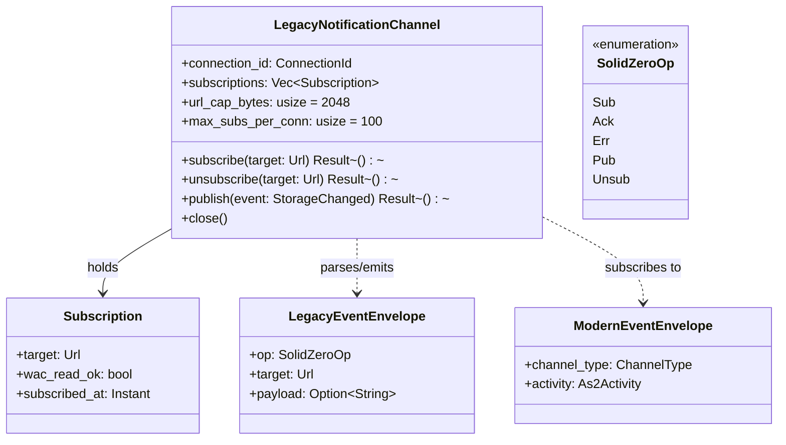

# Bounded Context: Notifications Compat

> **Sprint 4 / F3**. Closes GAP-ANALYSIS.md §E.8, PARITY-CHECKLIST.md row 91.
> Upstream reference: `JavaScriptSolidServer/src/notifications/websocket.js:1-102,110-147`.

## Problem statement

solid-pod-rs ships WebSocketChannel2023 + WebhookChannel2023 (Solid
Notifications 0.2 — rows 92, 93) but lacks the legacy `solid-0.1`
WebSocket protocol that SolidOS still speaks. Without it, SolidOS
data-browser sessions reconnect repeatedly and never receive live
updates against a solid-pod-rs pod. JSS ships only `solid-0.1`; this
context bridges the two protocols so one server speaks both wires.

The bridge is **translation-only**, not a reimplementation. It reuses
the existing `WebSocketChannelManager` fan-out and filesystem watcher
infrastructure; the adapter is a protocol codec wrapping the same
upstream event stream.

## Aggregates

Single aggregate, bounded by the lifetime of a `solid-0.1` WebSocket
connection.



### `LegacyNotificationChannel`

Root. One instance per upgraded WebSocket connection. Owns the
subscription set for that socket. Bridges upward to the existing
`WebSocketChannelManager` broadcast receiver so fan-out from filesystem
events reaches both protocol surfaces. Invariants enforced here cap the
per-connection resource footprint; see §"Invariants" below.

## Value objects

| Value object | Fields | Invariants |
|---|---|---|
| `LegacyEventEnvelope` | `op: SolidZeroOp`, `target: Url`, optional `payload: String` | Wire format: `<op> <target>\n[payload]`; `target` URL-validated before construction |
| `ModernEventEnvelope` | `channel_type: ChannelType`, `activity: As2Activity` | The existing Notifications 0.2 event; this context subscribes via `broadcast::Receiver` |
| `SolidZeroOp` | enum: `Sub`, `Ack`, `Err`, `Pub`, `Unsub` | Only these five opcodes are recognised; unknown opcodes produce an `err` frame and close |
| `Subscription` | `target: Url`, `wac_read_ok: bool`, `subscribed_at: Instant` | `wac_read_ok` is cached at subscribe time AND re-checked on publish; stale-false caches fail-closed |

## Domain events

The bridge is driven by upstream `StorageChanged` events (already emitted
by `storage::fs::FileSystemStorage` and `storage::memory::MemoryStorage`).
This context consumes them and emits two downstream event streams.

| Event | Direction | Payload | Purpose |
|---|---|---|---|
| `StorageChanged` | upstream → context | `resource: Url`, `kind: CreateUpdateDelete` | already emitted by storage layer; context subscribes via `WebSocketChannelManager::receiver` |
| `LegacyNotificationEmitted` | context → observers | `connection_id`, `target: Url`, `op: SolidZeroOp` | audit + metrics sink |
| `ModernNotificationEmitted` | sibling stream (existing WS2023 fanout) | `ChangeNotification` | unchanged; documented here for completeness |

The two downstream streams are **siblings**, not chained: a single
`StorageChanged` drives both a modern-client fan-out and a legacy-client
fan-out independently. Neither protocol's failure affects the other.

## Ubiquitous language

| Term | Definition |
|---|---|
| **Legacy protocol** | `solid-0.1` WebSocket protocol — plain-text framed, `sub/ack/err/pub/unsub` opcodes |
| **Modern protocol** | Solid Notifications 0.2 — WebSocketChannel2023 + WebhookChannel2023, AS2.0 activity payloads |
| **Subscription** | Either legacy (target URL only) or modern (channel resource + AS2.0 descriptor); this context always means the legacy shape |
| **Fan-out** | The broadcast from a single storage event to all connected subscribers with WAC-Read on the changed resource |
| **URL cap** | The 2 KiB upper bound on any target URL (matches JSS `websocket.js:110-147`) |

## Invariants

1. **Per-connection subscription cap.** At most 100 subscriptions per
   `LegacyNotificationChannel`. Over-cap `sub` frames produce `err`
   frames and are not registered. Matches JSS.
2. **URL cap.** Target URLs over 2048 bytes produce `err` frames and
   are not registered.
3. **WAC read gate.** Every `sub` attempt invokes
   `wac::evaluate_access(agent, target, Read)` synchronously; failure
   produces an `err` frame. Every `pub` attempt re-checks (defence
   against ACL updates mid-subscription).
4. **Unknown opcode closes the connection.** Matches JSS policy; prevents
   accidental protocol confusion.
5. **Fan-out is lossy-by-design.** A slow legacy subscriber drops old
   events once its per-socket queue saturates; it does not back-pressure
   the storage layer. Matches JSS.
6. **Modern notifications continue regardless.** A crashed legacy bridge
   must not affect the modern channel; bounded-channel semantics on the
   broadcast subscription enforce.

## Rust module placement

```
crates/solid-pod-rs/src/notifications/
├── mod.rs                           # unchanged; re-exports legacy adapter when feature on
├── websocket_2023.rs                # existing WebSocketChannel2023 manager
├── webhook_2023.rs                  # existing WebhookChannel2023 manager
└── legacy.rs                        # NEW — Solid01Channel, LegacyEventEnvelope, codec
```

Gated behind feature `jss_v04_notifications_legacy` (off-by-default).
When the feature is off, the module is absent; no runtime overhead.

## Integration points

| Caller | Trigger | Context |
|---|---|---|
| Consumer HTTP binder (actix-web example, axum example) | WS upgrade on `/.notifications` or `/.well-known/solid/notifications-legacy` | Binder constructs `LegacyNotificationChannel` bound to the upgraded socket + a fresh `broadcast::Receiver` |
| `WebSocketChannelManager` | existing | Unchanged; the legacy adapter is one more receiver |
| WAC evaluator | `sub` / `pub` frame | `wac::evaluate_access(agent, target, Read)` |
| DomainEventBus | per frame | `LegacyNotificationEmitted` published |

## Test strategy

Unit:
- Codec round-trip for every opcode (5 tests).
- URL cap enforcement (2 tests).
- Subscription cap enforcement (2 tests).
- Unknown opcode behaviour (1 test).

Integration:
- `tests/notifications_legacy.rs`: SolidOS-shape client connects,
  `sub <pod>/file.ttl`, `ack` received, mutate the file, `pub` received.
- WAC denial: client subscribes to a private resource without Read,
  `err` received (1 test).
- Concurrent modern + legacy clients both receive fan-out from a single
  storage event (1 test).

Benches:
- `codec::parse_frame` hot path: target ≤200ns (trivial regex-free parser).

## References

- GAP-ANALYSIS.md §E.8, §F.3, §D.1, §D.2
- PARITY-CHECKLIST.md row 91
- JSS `src/notifications/websocket.js:1-102, 110-147`
- Related: [00-master.md](./00-master.md), [03-wac-enforcement-context.md](./03-wac-enforcement-context.md) (WAC read gate)
- ADR-056: [../../adr/ADR-056-jss-parity-migration.md](../../adr/ADR-056-jss-parity-migration.md)
