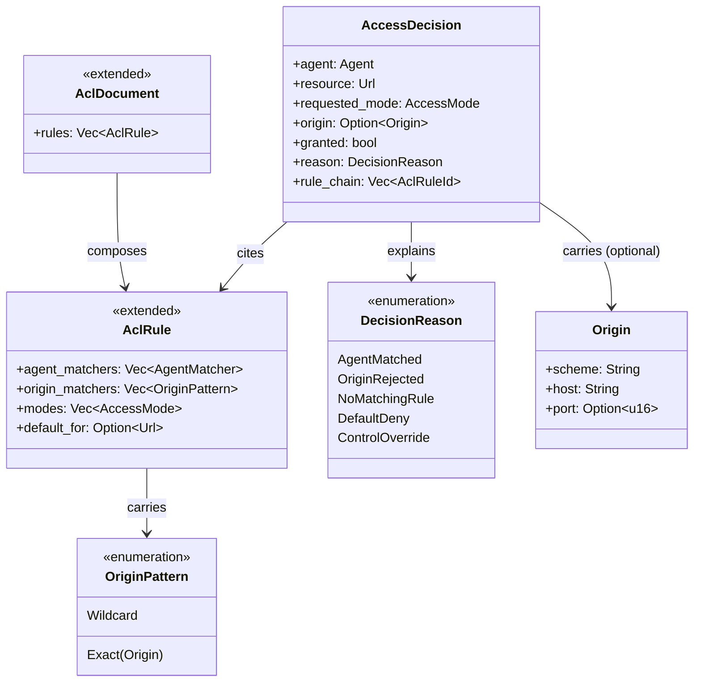

# Bounded Context: WAC Enforcement (extension)

> **Sprint 4 / F4**. Closes GAP-ANALYSIS.md §H rank 3, §F.2,
> PARITY-CHECKLIST.md row 51. Upstream reference: WAC §4.3
> (`https://solidproject.org/TR/wac#origin`). Note that **JSS also does
> not implement `acl:origin`** (`src/wac/parser.js` does not read it);
> this context closes the shared gap and moves solid-pod-rs ahead of JSS
> on conformance.

## Problem statement

WAC §4.3 defines `acl:origin` as an **additional gate** on top of agent
authorisation: even if an `AclRule` matches the request's WebID or
agent-class, the rule only grants access when the request's `Origin:`
header also matches a listed origin. Neither JSS nor current
solid-pod-rs enforces this. The result is that a malicious third-party
site can use a victim's cookies/DPoP to read private resources via
CORS-permitted endpoints. The mitigation exists in the data model
(`acl:origin` triples in ACLs deployed in the wild) but the evaluator
ignores them.

This context extends the existing WAC aggregate set with one new
aggregate (`AccessDecision` as a first-class decision record), two new
value objects (`Origin`, `OriginPattern`), and short-circuit evaluator
logic that runs the origin gate **after** agent/agent-class matching.

## Aggregates



### `AccessDecision` (new root)

Previously decisions were plain `Result<bool, WacError>` return values.
Promoting the decision to an aggregate carries the full reasoning chain
(which rule matched, why, what origin was seen) so the audit log and
`WAC-Allow` header emission are derivable from one structure. The
aggregate is immutable; decision points construct it once and hand it
off.

### `AclDocument` / `AclRule` (extended)

Existing aggregates. The extension is strictly additive: one new field
`origin_matchers: Vec<OriginPattern>` on `AclRule`. Default empty (no
origin gate, matches historical behaviour). Turtle and JSON-LD parsers
extended to populate the field when `acl:origin` triples are present.

## Value objects

| Value object | Fields | Invariants |
|---|---|---|
| `Origin` | `scheme: String`, `host: String`, optional `port: u16` | Scheme lowercased; host lowercased; port None means default for scheme; constructed only from a validated `http::HeaderValue` |
| `OriginPattern` | `Exact(Origin)` \| `Wildcard` (matches any origin) | Wildcard constructed only when `acl:origin foaf:Agent` or equivalent appears; treated as "origin gate effectively disabled for this rule" |
| `Agent` | existing | unchanged |
| `AclRuleId` | opaque string (hash of rule subject IRI) | stable across evaluations for audit correlation |

## Domain events

| Event | Emitted by | Payload |
|---|---|---|
| `AccessEvaluated` | every `evaluate_access` call | `AccessDecision` |
| `OriginMismatchRejected` | origin gate fails for an otherwise-matching rule | `agent`, `resource`, `request_origin: Option<Origin>`, `rule_id: AclRuleId` |

`AccessEvaluated` is high-volume; consumers sample at binder wiring. 
`OriginMismatchRejected` is low-volume and security-relevant; the 
default audit sink keeps it at full fidelity.

## Ubiquitous language

| Term | Definition |
|---|---|
| **Origin** | RFC 6454 web origin: `scheme://host[:port]`; the triple sent in the HTTP `Origin:` header |
| **Origin pattern** | A rule's declared origin list; may be exact origins, or wildcard (effectively no gate) |
| **Origin gate** | The additional check that runs after agent matching and before granting access |
| **Short-circuit** | When agent match succeeds but origin mismatches, evaluation returns `granted=false` without falling through to lower-priority rules (matches WAC §4.3 intent: `acl:origin` narrows a rule, not widens) |
| **Agent/agent-class match** | The existing WebID or `foaf:Agent`/`AuthenticatedAgent` check |
| **Origin match** | Request's `Origin` header (if present) exactly matches one of the rule's `acl:origin` values, OR the rule has no `acl:origin` triples (no gate) |

## Invariants

1. **Origin check runs after agent check.** The evaluator short-circuits
   as: `agent_check() AND (origin_matchers.is_empty() OR
   origin_matchers.any_match(&request_origin))`. If agent matches but
   origin does not, the rule yields `false` for this request without
   inviting a second rule to "restore" access.
2. **No `Origin` header + rule has origin matchers → deny.** A request
   without an `Origin` header against a rule with origin_matchers
   treats the origin as absent and therefore non-matching. Matches WAC
   §4.3 reading.
3. **Rules with empty origin_matchers behave exactly as today.**
   Backward compat: every existing ACL continues to work.
4. **Control mode bypasses origin gate.** `Control` operations on `.acl`
   documents intentionally ignore the origin gate (the owner must be
   able to fix a mis-configured ACL from any origin). Matches the
   existing Control short-circuit in `wac::evaluate_access`.
5. **Origin-matcher parsing is strict.** `acl:origin "https://app.example/"`
   (trailing slash) is rejected as malformed at ACL-write time; only
   canonical `scheme://host[:port]` origins are stored. Bubbles up the
   existing `.acl` write strictness (§C.2d / row 59).

## Rust module placement

```
crates/solid-pod-rs/src/wac/
├── mod.rs              # unchanged public re-exports; origin exposed
├── evaluator.rs        # existing evaluate_access + evaluate_access_with_groups
├── origin.rs           # NEW — Origin, OriginPattern, origin_check helpers
├── parser_turtle.rs    # existing; extended to read acl:origin triples
├── parser_jsonld.rs    # existing; extended to read acl:origin predicate
├── resolver.rs         # existing StorageAclResolver
└── wac_allow.rs        # existing header; unchanged by F4
```

Origin reading in both parsers is the "contained change surface" —
everything else stays.

## Integration points

| Caller | Trigger | Context |
|---|---|---|
| LDP request dispatch | any authenticated request | Binder passes `Origin` header to `evaluate_access` |
| Notifications compat context | `sub`/`pub` WAC-Read check | Origin propagated from WS upgrade handshake |
| ACL write validation | PUT of an `.acl` document | parsers validate origin_matcher syntax; malformed origins reject the write with 422 |
| `WAC-Allow` header emission | response header build | Unchanged in v0.4.0; origin-gate-rejected rules simply don't contribute to the allowed modes seen by the client |

## Test strategy

Unit:
- Origin parse: canonical forms accept, trailing slash rejects, case
  normalisation, port handling (10 tests).
- `evaluate_access` with origin gate: agent-match + origin-match grants
  (2 tests).
- `evaluate_access` with origin gate: agent-match + origin-mismatch
  denies, emits `OriginMismatchRejected` (3 tests).
- `evaluate_access` with origin gate: no `Origin` header + rule has
  origin_matchers denies (1 test).
- Wildcard origin matcher grants regardless of request origin (1 test).
- Control mode bypasses origin gate (1 test).

Integration:
- End-to-end: ACL with `acl:origin <https://app.example>`, request from
  `https://evil.example` denies; from `https://app.example` grants
  (1 test).
- Legacy ACL without any `acl:origin` triples behaves identically to
  v0.3.x (1 test, regression guard).

Benches:
- `origin_check` hot path: target ≤15ns for the empty-matchers case
  (the common case, should be a single branch).

## References

- GAP-ANALYSIS.md §C.2c, §F.2, §H rank 3
- PARITY-CHECKLIST.md row 51
- WAC §4.3: https://solidproject.org/TR/wac#origin
- Related: [00-master.md](./00-master.md), [02-notifications-compat-context.md](./02-notifications-compat-context.md)
- ADR-056: [../../adr/ADR-056-jss-parity-migration.md](../../adr/ADR-056-jss-parity-migration.md)
