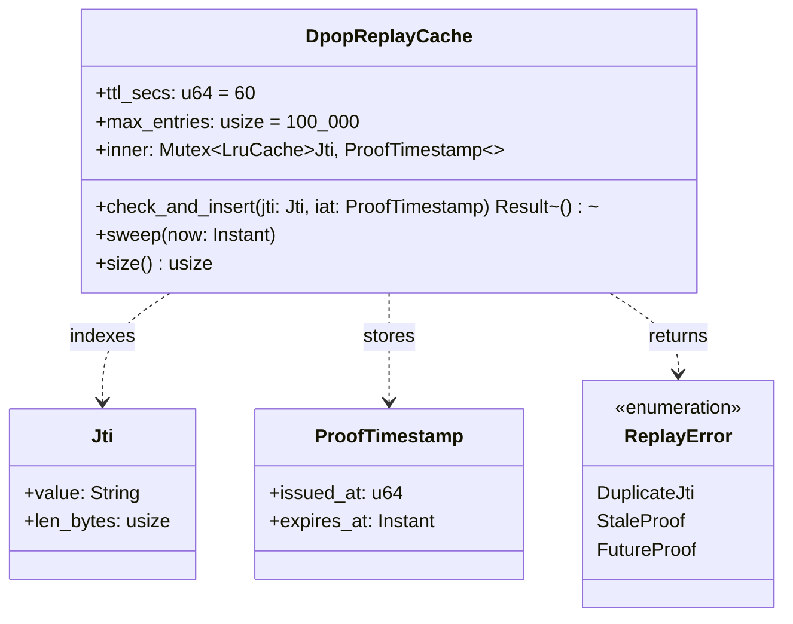

# Bounded Context: OIDC Hardening

> **Sprint 4 / F5**. Closes GAP-ANALYSIS.md §H rank 4, §C.3a,
> PARITY-CHECKLIST.md row 64. Upstream reference:
> `JavaScriptSolidServer/src/auth/solid-oidc.js` (jti replay cache
> embedded in the auth middleware).

## Problem statement

Solid-OIDC §5.2 requires the relying party to reject replayed DPoP
proofs. A DPoP proof is a one-use JWT carrying a unique `jti` claim and
an issued-at (`iat`) timestamp; a verifier MUST track seen `jti`s
within the accepted `iat` skew window and reject duplicates. JSS
implements this with an in-process LRU keyed by jti; solid-pod-rs
currently exposes the primitive (`oidc::verify_dpop_proof`) but leaves
replay tracking to the consumer, which in practice means it is absent.

This context ships the cache as a first-class aggregate inside the
`oidc` module, wired behind the existing `oidc` feature gate and the
new `jss_v04_oidc_replay` sub-feature.

## Aggregates

Single aggregate. The cache itself is the consistency boundary: all
jti-insertion and eviction operations go through it.



### `DpopReplayCache`

Root. Wraps an `lru::LruCache` behind a `Mutex` (write-heavy but short
critical section; contention is bounded by request rate). Exposes
`check_and_insert(jti, iat) -> Result<(), ReplayError>` as the only
external write operation. Internally, `check_and_insert`:

1. Drops entries older than `ttl_secs` (lazy sweep on-access).
2. Looks up `jti`; if present, returns `Err(DuplicateJti)`.
3. Validates `iat` within clock-skew window (±60s default); if stale,
   returns `Err(StaleProof)`; if future, returns `Err(FutureProof)`.
4. Inserts `(jti, ProofTimestamp::from(iat))`; if cache full, LRU
   evicts the oldest entry and emits `JtiCacheEvicted`.
5. Returns `Ok(())`.

Cache is shared across all DPoP verification calls in a process;
consumers construct one and inject into their binder state.

## Value objects

| Value object | Fields | Invariants |
|---|---|---|
| `Jti` | `value: String`, `len_bytes: usize` | Ascii-printable; constructed only from a JWT `jti` claim that passed base signature verification; length bounded to 256 bytes at construction |
| `ProofTimestamp` | `issued_at: u64` (unix seconds), `expires_at: Instant` | `expires_at = max(now, issued_at) + ttl_secs`; never in the past at construction |
| `ReplayError` | enum variants above | No `ReplayError` implies cache mutation succeeded |

## Domain events

| Event | Emitted by | Payload |
|---|---|---|
| `DpopReplayRejected` | `check_and_insert` returning `DuplicateJti` | `jti: Jti`, `first_seen_at: ProofTimestamp`, `replay_seen_at: Instant` |
| `JtiCacheEvicted` | LRU eviction during `check_and_insert` | `evicted_jti: Jti`, `cache_size: usize`, `reason: Capacity` |
| `DpopProofAccepted` | successful `check_and_insert` | `jti: Jti`, `caller_span_id` |

`DpopReplayRejected` is a P1 security event; the default audit sink
keeps at full fidelity and exposes it as a counter metric
(`solid_pod_rs_dpop_replay_rejected_total`).

## Ubiquitous language

| Term | Definition |
|---|---|
| **jti** | JWT ID — the unique identifier claim in a DPoP proof; per RFC 9449 §4.2, the client MUST include one |
| **Proof timestamp** | The DPoP proof's `iat` claim paired with the cache-derived expiry |
| **Replay window** | The TTL during which a `jti` is remembered; default 60s, matches JSS |
| **Clock skew tolerance** | The allowable gap between server time and the proof's `iat`; default ±60s |
| **LRU eviction** | Cache-capacity-driven removal of the least-recently-used entry; NOT time-driven (TTL is separate) |
| **Stale proof** | A DPoP proof whose `iat` is older than `now - skew`; rejected distinct from replay |
| **Future proof** | A DPoP proof whose `iat` is newer than `now + skew`; rejected distinct from replay |

## Invariants

1. **`jti` uniqueness within TTL window.** For every pair of accepted
   DPoP proofs `(p1, p2)` with identical `jti` and `|p1.iat - p2.iat| ≤
   ttl_secs`, at most one is accepted. Configurable TTL; default 60s
   matches JSS.
2. **LRU eviction is capacity-driven, not time-driven.** An entry may
   be evicted by capacity before its TTL expires; a subsequent replay
   of that jti within TTL is then accepted (replay-through-capacity).
   Mitigation: size the cache for worst-case rate (default 100,000
   entries handles ~1,600 rps sustained at 60s TTL).
3. **Stale / future proofs are rejected without cache mutation.** Neither
   `StaleProof` nor `FutureProof` inserts into the cache; the cache
   only records proofs it accepts, keeping the size bound meaningful.
4. **Lock-free fast path for non-duplicates.** The hot path is a single
   `Mutex` acquisition + LRU insert; benchmark-gated to ≤500ns under
   10k concurrent submissions.
5. **Cache is process-local.** Multi-process deployments behind a load
   balancer share no cache; replay across replicas is possible within
   TTL. Documented as a known limitation; operators running HA should
   either (a) stick DPoP-authenticated sessions or (b) reduce TTL to
   within an acceptable replay window. (This matches JSS; fixing it
   properly requires Redis/memcached, out of scope for 0.4.0.)

## Rust module placement

```
crates/solid-pod-rs/src/oidc/
├── mod.rs              # existing re-exports
├── dpop.rs             # existing DPoP proof verification primitives
├── replay.rs           # NEW — DpopReplayCache, Jti, ProofTimestamp, ReplayError
├── discovery.rs        # existing; unchanged
├── introspection.rs    # existing; unchanged
└── access_token.rs     # existing; unchanged
```

Gated behind `jss_v04_oidc_replay` which requires `oidc`. Default build
has `oidc` off, so the replay cache is absent from the minimum-footprint
binary; consumers selecting `oidc` get it automatically.

## Integration points

| Caller | Trigger | Context |
|---|---|---|
| HTTP binder | every DPoP-authenticated request | Call `cache.check_and_insert(jti, iat)` after `verify_dpop_proof` but before `verify_access_token`; reject 401 + `WWW-Authenticate: DPoP error="invalid_token"` on any `ReplayError` |
| F1 SSRF guard | JWKS fetch | Not direct; but the replay cache is adjacent — both run on the DPoP hot path |
| Metrics sink | per-request | Counter increment for accept/reject paths |

## Test strategy

Unit:
- First-seen jti inserts, returns `Ok` (1 test).
- Duplicate jti within TTL returns `DuplicateJti` (1 test).
- Duplicate jti after TTL returns `Ok` (lazy sweep behaviour) (1 test).
- Stale proof (iat < now - 120s) returns `StaleProof` (1 test).
- Future proof (iat > now + 60s) returns `FutureProof` (1 test).
- LRU eviction at capacity emits `JtiCacheEvicted` (1 test).
- Jti length bound rejects > 256-byte values at `Jti::new` (1 test).

Integration:
- `tests/dpop_replay.rs`: 10,000 concurrent submissions, 100 duplicates
  injected; all duplicates rejected, no false rejections on the 9,900
  unique submissions. (Stress test validates the Mutex + LruCache
  combination.)
- End-to-end: binder rejects a replayed DPoP proof with 401
  (1 test).

Benches (criterion; this is the hot path):
- `check_and_insert` non-duplicate case: target ≤500ns median, ≤2µs
  p99 under 10k concurrent submissions (8-core box).
- Memory: 100k entries ≤20MB resident (measured via `dhat`).

Failure case added to clippy budget: a panic in the Mutex-critical
section would poison the cache and DoS the pod; all paths inside the
lock are panic-free-by-construction (no indexing, no unwrap, arithmetic
checked).

## References

- GAP-ANALYSIS.md §C.3a, §H rank 4
- PARITY-CHECKLIST.md row 64
- JSS `src/auth/solid-oidc.js:85-251`
- RFC 9449 DPoP: https://datatracker.ietf.org/doc/rfc9449/
- Solid-OIDC 0.1 §5.2: https://solidproject.org/TR/oidc#authorization-request
- Related: [00-master.md](./00-master.md), [01-security-primitives-context.md](./01-security-primitives-context.md) (SSRF on JWKS fetch)
- ADR-056: [../../adr/ADR-056-jss-parity-migration.md](../../adr/ADR-056-jss-parity-migration.md)
