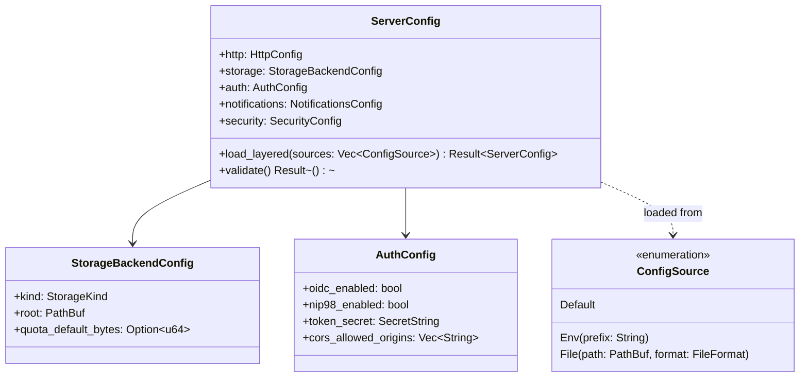

# Bounded Context: Config Platform

> **Sprint 4 / F6**. Closes GAP-ANALYSIS.md §H rank 7, §E.6,
> PARITY-CHECKLIST.md rows 120–124. Upstream reference:
> `JavaScriptSolidServer/src/config.js:17-239`.

## Problem statement

JSS ships a three-layer config loader (CLI > env > file > default) with
30+ `JSS_*` environment variables driving a single `config.json`-shaped
object. solid-pod-rs has no equivalent: every consumer crate rolls its
own. This means (a) the `JSS_*` env vars are not honoured on solid-
pod-rs deployments, blocking drop-in replacement, and (b) operators
can't point the same config at both servers for shadow testing.

This context introduces a `ServerConfig` aggregate loaded via a
layered source stack, designed so that **the same JSS `config.json`
file boots both servers when F7's `solid-pod-rs-server` binary ships**.

## Aggregates

Single aggregate; the consistency boundary is "a fully resolved config
snapshot". Reloads construct a new snapshot atomically.



### `ServerConfig`

Root. Immutable after construction. Validation happens once at the end
of the layered load; partial / invalid states never escape the loader.
Holds the resolved values for HTTP binding, storage backend selection,
auth toggles, notifications toggles, and security primitive settings.

Reload is implemented as "construct a new `ServerConfig` from the same
source stack; if valid, swap into the `PodService`'s state via an
`arc-swap::ArcSwap`". Observers see `ConfigReloaded` with old+new
snapshots for diffing.

## Value objects

| Value object | Fields | Invariants |
|---|---|---|
| `ConfigSource` | `Env(prefix)` / `File(path, format)` / `Default` | Prefix matches `/^[A-Z][A-Z0-9_]*$/`; file path canonical; format one of `Json`, `Toml` (JSS uses JSON, we accept both) |
| `StorageBackendConfig` | `kind: StorageKind`, `root: PathBuf`, optional `quota_default_bytes: u64` | Root is absolute after resolution; kind-specific fields validated per-kind |
| `AuthConfig` | OIDC enabled, NIP-98 enabled, `token_secret: SecretString`, CORS origins | `token_secret` non-empty in production env (`NODE_ENV=production` or `SOLID_POD_RS_ENV=production`) |
| `NotificationsConfig` | WS 2023 on, webhook 2023 on, legacy `solid-0.1` on | At least one channel type on (else warn + continue with none) |
| `SecurityConfig` | SSRF policy toggles, dotfile allowlist entries, rate-limit defaults | SSRF metadata block is always on; rejected at parse time if operator tries to disable |
| `SecretString` | opaque wrapper around `String` | `Debug` impl redacts; never serialised back out; zeroised on drop |

## Domain events

| Event | Emitted by | Payload |
|---|---|---|
| `ConfigReloaded` | `ServerConfig::reload` completing | `old: Arc<ServerConfig>`, `new: Arc<ServerConfig>`, `sources: Vec<ConfigSource>` |
| `ConfigValidationFailed` | `ServerConfig::validate` returning Err | `violations: Vec<ConfigViolation>`, `sources_considered` |

`ConfigReloaded` drives the reconfiguration paths in other contexts
(e.g. a new `SsrfPolicy` is constructed from the new
`SecurityConfig.ssrf` subtree and atomically swapped into the security
context's state).

## Ubiquitous language

| Term | Definition |
|---|---|
| **Config source** | One layer of the stack: env vars, a config file, or the hard-coded defaults |
| **Layered load** | The process of reading each source in precedence order and overlaying |
| **Precedence** | CLI > env > file > default — matches JSS `src/config.js:211-239` |
| **JSS-compatible mapping** | The set of `JSS_*` env vars whose semantics we honour 1:1 |
| **Snapshot** | A frozen, validated `ServerConfig`; the service holds at most one live snapshot, swapped atomically on reload |

## JSS env var mapping

Precedence: CLI > env > file > default (same as JSS). The following
`JSS_*` env vars map 1:1 where semantics align. Where we add a new var,
we name it `SOLID_POD_RS_*` to avoid false drop-in expectations.

| JSS var | solid-pod-rs field | Notes |
|---|---|---|
| `JSS_PORT` | `http.port` | identical |
| `JSS_HOST` | `http.host` | identical |
| `JSS_ROOT` | `storage.root` | identical |
| `JSS_SSL_KEY` / `JSS_SSL_CERT` | `http.tls.{key,cert}` | identical |
| `JSS_MULTIUSER` | `http.multiuser` | identical semantics |
| `JSS_CONNEG` | `http.conneg` | no-op on our side (we conneg unconditionally) — warn-only |
| `JSS_NOTIFICATIONS` | `notifications.enabled` | identical |
| `JSS_QUIET` | `tracing.quiet` | translate to reduced log level |
| `JSS_CONFIG_PATH` | sets `File` source path | identical |
| `JSS_IDP` / `JSS_IDP_ISSUER` | reject with error in 0.4.0 (IdP is future crate) | operator-visible error: "IdP not available in this crate; install solid-pod-rs-idp" |
| `JSS_SUBDOMAINS` / `JSS_BASE_DOMAIN` | `http.subdomains.{enabled,base_domain}` | subdomain mode ships in a later sprint; 0.4.0 accepts the var but warns "not yet implemented" |
| `JSS_MASHLIB*`, `JSS_SOLIDOS_UI` | rejected with warning | belongs in `solid-pod-rs-admin` |
| `JSS_GIT` | rejected with warning | future crate |
| `JSS_NOSTR*` | rejected with warning | future crate |
| `JSS_ACTIVITYPUB` / `JSS_AP_*` | rejected with warning | future crate |
| `JSS_INVITE_ONLY` | not implemented; warn | operator tooling, later sprint |
| `JSS_SINGLE_USER` / `JSS_SINGLE_USER_NAME` | `provisioning.{mode,single_user_name}` | identical |
| `JSS_WEBID_TLS` | rejected | won't-fix (GAP §E.5) |
| `JSS_DEFAULT_QUOTA` | `storage.quota_default_bytes` | parse size strings (`50MB`, `1GB`) |
| `JSS_PUBLIC` | `wac.public_mode` | semantic match |
| `JSS_READ_ONLY` | `wac.read_only` | identical |
| `JSS_LIVE_RELOAD` | warn; not in library scope | consumer nicety |
| `TOKEN_SECRET` | `auth.token_secret` | mandatory in production env |
| `CORS_ALLOWED_ORIGINS` | `auth.cors_allowed_origins` | identical |
| `NODE_ENV` | `env.kind` (maps "production"/"development") | drives production-mode invariants |
| `DATA_ROOT` | fallback for `storage.root` when `JSS_ROOT` absent | identical |

Unknown `JSS_*` vars log a warning (not an error) to support forward compat.

## Invariants

1. **JSS env vars map 1:1 where semantics align.** Listed in the
   mapping table above. Silent semantic drift is forbidden; every
   non-identical mapping carries a documented warning or error.
2. **Layered precedence is strict.** CLI > env > file > default. The
   loader records the source of each resolved value so diagnostics can
   report "x was set to y from env `JSS_PORT`".
3. **Production-mode invariants.** When `env.kind == Production`:
   - `auth.token_secret` MUST be non-empty.
   - `http.tls.{key,cert}` MUST be set OR an explicit "no-tls" flag.
   - `security.ssrf.metadata_block` MUST be on (non-overridable).
4. **Snapshot immutability.** Once constructed, a snapshot is never
   mutated. Reload constructs a fresh one.
5. **Unknown JSS vars warn, don't fail.** Forward-compat with newer
   JSS releases.

## Rust module placement

```
crates/solid-pod-rs/src/config/
├── mod.rs          # public exports; default lives here
├── loader.rs       # layered load, precedence, source tracking
├── sources.rs      # ConfigSource, Env/File/Default readers
└── schema.rs       # ServerConfig + sub-structs, serde derivations
```

Feature-gated behind `jss_v04_config`. The primitive intent is that
most consumers will use the loader inside `solid-pod-rs-server` (F7),
not inside the library directly. The library exports the types so
consumers composing their own binary can reuse them; the binary crate
takes the full loader behaviour.

## Integration points

| Caller | Trigger | Context |
|---|---|---|
| `solid-pod-rs-server` binary | startup | `ServerConfig::load_layered(sources)` → `PodService::new(config)` |
| F1 Security Primitives | on `ConfigReloaded` | reconstruct `SsrfPolicy` + `DotfileAllowlist` from new snapshot |
| F4 WAC Enforcement | on `ConfigReloaded` | no direct effect; WAC reads ACLs, not config |
| F5 OIDC Hardening | on `ConfigReloaded` | reconstruct `DpopReplayCache` if TTL or capacity changed |
| F3 Notifications Compat | on `ConfigReloaded` | toggle legacy adapter on/off |

## Test strategy

Unit:
- Env + file + default layering with conflict resolution (6 tests).
- Unknown `JSS_*` var produces warning but doesn't fail (1 test).
- `JSS_ROOT` maps to `storage.root` (1 test).
- `TOKEN_SECRET` mandatory-in-production enforcement (2 tests).
- Size parsing (`50MB`, `1GB`, `1024`) (4 tests).
- SecretString redacts in `Debug` (1 test).

Integration:
- `tests/config_jss_compat.rs`: load a JSS `config.json` fixture from
  `JavaScriptSolidServer/test/fixtures/` and verify all honoured keys
  resolve correctly; all IdP/AP/git keys produce structured warnings.
- Reload swap: modify a file, trigger reload, `ConfigReloaded` fires,
  downstream contexts observe the new snapshot (1 test).

Benches:
- Layered load of a realistic config: target ≤5ms cold, ≤500µs warm.

## References

- GAP-ANALYSIS.md §C.7, §E.6, §H rank 7
- PARITY-CHECKLIST.md rows 120–124
- JSS `src/config.js:17-239`
- JSS `bin/jss.js:38-83` (CLI flag list)
- Related: [00-master.md](./00-master.md), [06-library-surface-context.md](./06-library-surface-context.md) (server crate consumes this)
- ADR-056: [../../adr/ADR-056-jss-parity-migration.md](../../adr/ADR-056-jss-parity-migration.md)
